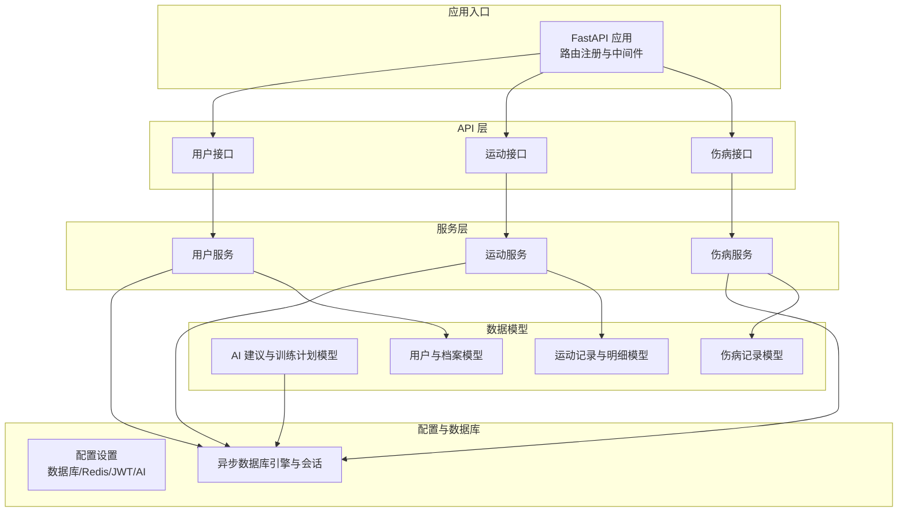
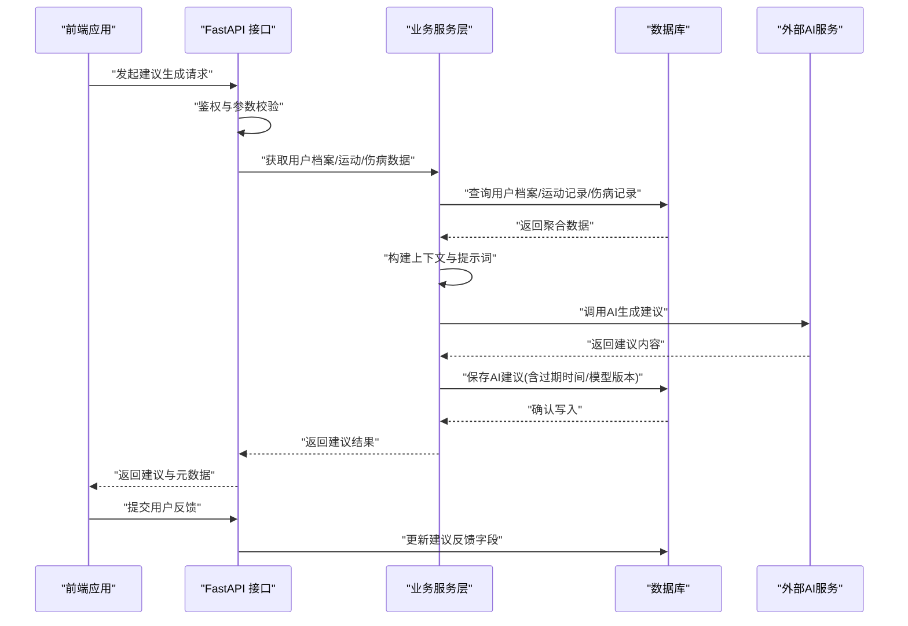
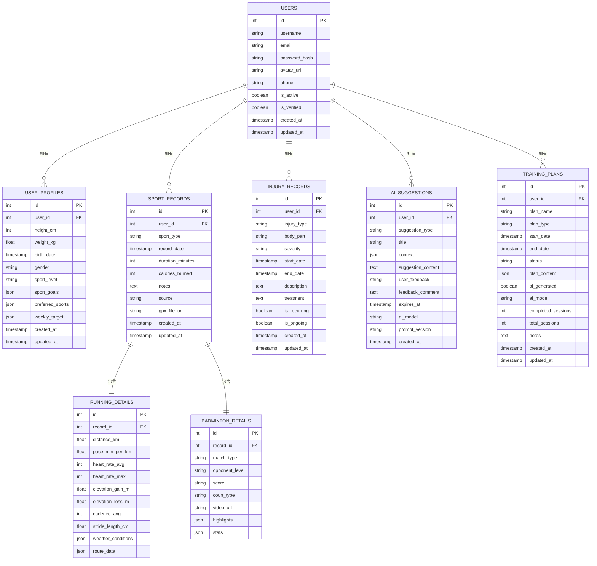
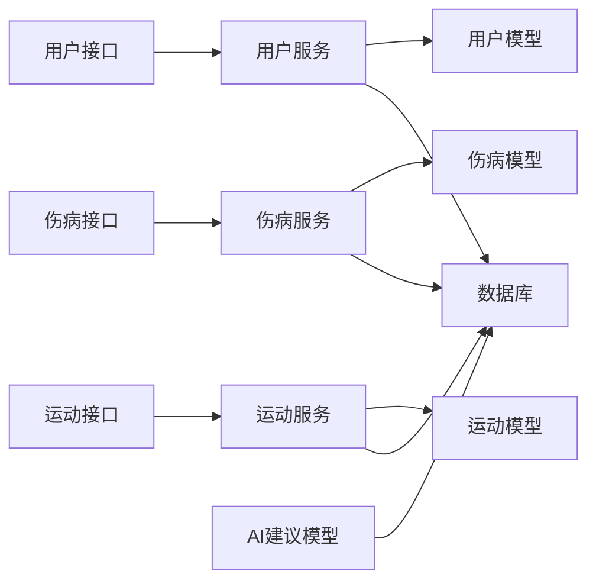

# AI建议生成流程

<cite>
**本文引用的文件**
- [backend/app/main.py](file://backend/app/main.py)
- [backend/app/config.py](file://backend/app/config.py)
- [backend/app/database.py](file://backend/app/database.py)
- [backend/app/models/ai.py](file://backend/app/models/ai.py)
- [backend/app/models/user.py](file://backend/app/models/user.py)
- [backend/app/models/sport.py](file://backend/app/models/sport.py)
- [backend/app/models/injury.py](file://backend/app/models/injury.py)
- [backend/app/services/user_service.py](file://backend/app/services/user_service.py)
- [backend/app/services/sport_service.py](file://backend/app/services/sport_service.py)
- [backend/app/services/injury_service.py](file://backend/app/services/injury_service.py)
- [backend/app/api/users.py](file://backend/app/api/users.py)
- [backend/app/api/sports.py](file://backend/app/api/sports.py)
- [backend/app/api/injuries.py](file://backend/app/api/injuries.py)
- [backend/app/core/exceptions.py](file://backend/app/core/exceptions.py)
</cite>

## 目录
1. [简介](#简介)
2. [项目结构](#项目结构)
3. [核心组件](#核心组件)
4. [架构总览](#架构总览)
5. [详细组件分析](#详细组件分析)
6. [依赖分析](#依赖分析)
7. [性能考虑](#性能考虑)
8. [故障排查指南](#故障排查指南)
9. [结论](#结论)
10. [附录](#附录)

## 简介
本技术文档围绕 ActiveSynapse 的 AI 建议生成流程展开，覆盖从用户数据采集、上下文构建、AI 提示词工程、建议生成与个性化、到期与历史管理、质量评估与反馈闭环，到性能优化与异常处理的全链路设计。当前代码库已实现用户、运动、伤病等基础数据模型与服务层，AI 建议的核心数据模型与枚举类型已具备，但建议生成的具体算法与提示词尚未在仓库中直接实现。本文在现有代码基础上，给出可落地的建议生成架构与实施建议。

## 项目结构
后端采用 FastAPI + SQLAlchemy 异步 ORM 架构，按领域模型分层组织：API 控制器、服务层、数据模型与模式、配置与数据库初始化、异常处理。AI 建议相关的核心实体位于 models/ai.py，包含建议类型、计划类型、状态枚举以及建议与训练计划的数据模型。

图表来源
- [backend/app/main.py](file://backend/app/main.py#L21-L57)
- [backend/app/config.py](file://backend/app/config.py#L5-L46)
- [backend/app/database.py](file://backend/app/database.py#L6-L43)
- [backend/app/api/users.py](file://backend/app/api/users.py#L1-L88)
- [backend/app/api/sports.py](file://backend/app/api/sports.py#L1-L127)
- [backend/app/api/injuries.py](file://backend/app/api/injuries.py#L1-L92)
- [backend/app/services/user_service.py](file://backend/app/services/user_service.py#L10-L120)
- [backend/app/services/sport_service.py](file://backend/app/services/sport_service.py#L10-L238)
- [backend/app/services/injury_service.py](file://backend/app/services/injury_service.py#L9-L115)
- [backend/app/models/ai.py](file://backend/app/models/ai.py#L30-L123)
- [backend/app/models/user.py](file://backend/app/models/user.py#L7-L62)
- [backend/app/models/sport.py](file://backend/app/models/sport.py#L23-L115)
- [backend/app/models/injury.py](file://backend/app/models/injury.py#L39-L70)

章节来源
- [backend/app/main.py](file://backend/app/main.py#L1-L77)
- [backend/app/config.py](file://backend/app/config.py#L1-L46)
- [backend/app/database.py](file://backend/app/database.py#L1-L43)

## 核心组件
- 应用入口与生命周期：FastAPI 应用初始化、CORS 中间件、全局异常处理器、路由挂载与健康检查。
- 配置中心：数据库连接、Redis、JWT、AI 模型与密钥、文件上传、CORS 允许域等。
- 数据库层：异步引擎与会话工厂、表初始化。
- 模型层：AI 建议与训练计划、用户与档案、运动记录与明细、伤病记录。
- 服务层：用户、运动、伤病服务，提供数据访问与业务逻辑封装。
- API 层：用户、运动、伤病接口，负责请求解析、鉴权与响应。

章节来源
- [backend/app/main.py](file://backend/app/main.py#L12-L77)
- [backend/app/config.py](file://backend/app/config.py#L5-L46)
- [backend/app/database.py](file://backend/app/database.py#L6-L43)
- [backend/app/models/ai.py](file://backend/app/models/ai.py#L30-L123)
- [backend/app/models/user.py](file://backend/app/models/user.py#L7-L62)
- [backend/app/models/sport.py](file://backend/app/models/sport.py#L23-L115)
- [backend/app/models/injury.py](file://backend/app/models/injury.py#L39-L70)
- [backend/app/services/user_service.py](file://backend/app/services/user_service.py#L10-L120)
- [backend/app/services/sport_service.py](file://backend/app/services/sport_service.py#L10-L238)
- [backend/app/services/injury_service.py](file://backend/app/services/injury_service.py#L9-L115)
- [backend/app/api/users.py](file://backend/app/api/users.py#L1-L88)
- [backend/app/api/sports.py](file://backend/app/api/sports.py#L1-L127)
- [backend/app/api/injuries.py](file://backend/app/api/injuries.py#L1-L92)

## 架构总览
AI 建议生成的端到端流程如下：前端触发建议生成请求 → 后端 API 接收并鉴权 → 服务层聚合用户档案、近期运动与伤病数据 → 构建上下文与提示词 → 调用外部 AI 服务生成建议 → 将建议持久化至数据库并返回给前端 → 前端展示并支持用户反馈。

图表来源
- [backend/app/api/users.py](file://backend/app/api/users.py#L13-L36)
- [backend/app/api/sports.py](file://backend/app/api/sports.py#L14-L102)
- [backend/app/api/injuries.py](file://backend/app/api/injuries.py#L13-L91)
- [backend/app/services/user_service.py](file://backend/app/services/user_service.py#L97-L120)
- [backend/app/services/sport_service.py](file://backend/app/services/sport_service.py#L127-L193)
- [backend/app/services/injury_service.py](file://backend/app/services/injury_service.py#L87-L115)
- [backend/app/models/ai.py](file://backend/app/models/ai.py#L30-L63)

## 详细组件分析

### 数据模型与实体关系
AI 建议与训练计划模型定义了建议类型、计划类型与状态枚举，并通过外键关联用户。运动与伤病模型提供了建议生成所需的上下文数据。

图表来源
- [backend/app/models/user.py](file://backend/app/models/user.py#L7-L62)
- [backend/app/models/sport.py](file://backend/app/models/sport.py#L23-L115)
- [backend/app/models/injury.py](file://backend/app/models/injury.py#L39-L70)
- [backend/app/models/ai.py](file://backend/app/models/ai.py#L30-L123)

章节来源
- [backend/app/models/user.py](file://backend/app/models/user.py#L7-L62)
- [backend/app/models/sport.py](file://backend/app/models/sport.py#L23-L115)
- [backend/app/models/injury.py](file://backend/app/models/injury.py#L39-L70)
- [backend/app/models/ai.py](file://backend/app/models/ai.py#L30-L123)

### 触发条件与数据收集
- 触发条件建议
  - 定时触发：基于用户活跃度与周期性目标（如每周/每月）。
  - 事件触发：新增运动记录、伤病记录或更新用户档案后。
  - 手动触发：用户在前端主动请求生成建议。
- 数据收集范围
  - 用户档案：身高、体重、性别、运动水平、偏好、周目标等。
  - 近期运动：运动类型、时长、卡路里、跑步配速/心率、羽毛球对战信息等。
  - 伤病历史：类型、部位、严重程度、是否复发、是否持续等。
- 上下文构建
  - 将上述数据序列化为 JSON，作为建议生成的上下文字段，便于后续检索与审计。

章节来源
- [backend/app/services/user_service.py](file://backend/app/services/user_service.py#L97-L120)
- [backend/app/services/sport_service.py](file://backend/app/services/sport_service.py#L127-L193)
- [backend/app/services/injury_service.py](file://backend/app/services/injury_service.py#L87-L115)
- [backend/app/models/ai.py](file://backend/app/models/ai.py#L40-L41)

### 建议生成算法与决策逻辑
- 建议类型
  - 训练：结合运动强度、目标与伤病情况制定阶段性计划。
  - 饮食：基于活动量与目标生成营养建议（需扩展具体算法）。
  - 康复：依据伤病阶段与治疗方案给出恢复动作与注意事项。
  - 伤病预防：根据历史伤病与运动习惯识别高风险动作与调整建议。
  - 通用：综合类建议，用于补充与提醒。
- 决策逻辑
  - 条件分支：根据建议类型选择不同提示词模板与规则集。
  - 规则引擎：对运动强度、疲劳度、伤病状态进行阈值判断与组合评分。
  - 个性化权重：根据用户偏好与目标动态调整建议权重。
- 提示词工程
  - 结构化提示：包含角色设定、上下文、任务指令、输出格式约束与示例。
  - 多轮对话：支持上下文记忆与迭代优化（可选）。
- 外部集成
  - 使用配置中的 AI 模型与密钥调用外部 LLM 服务（当前配置项已存在）。

章节来源
- [backend/app/models/ai.py](file://backend/app/models/ai.py#L8-L28)
- [backend/app/config.py](file://backend/app/config.py#L24-L27)

### 个性化定制、时效性与过期机制
- 个性化
  - 基于用户档案与偏好设置建议风格与内容侧重点。
  - 动态调整训练强度与运动类型推荐。
- 时效性
  - 建议生成时记录创建时间与过期时间，过期后不再展示或需重新生成。
  - 训练计划包含开始/结束日期与状态流转。
- 过期策略
  - 建议过期时间可按类型与用户目标设定（例如 7/14/30 天）。
  - 计划状态支持暂停/取消/完成，配合到期自动归档。

章节来源
- [backend/app/models/ai.py](file://backend/app/models/ai.py#L50-L58)
- [backend/app/models/ai.py](file://backend/app/models/ai.py#L76-L81)

### 建议质量评估、反馈与优化
- 质量评估指标
  - 可执行性：建议是否可操作、是否与用户能力匹配。
  - 相关性：与上下文与目标的契合度。
  - 一致性：与历史记录与伤病状态的一致性。
- 用户反馈
  - 支持“有帮助/无帮助”与评论字段，便于统计与再训练。
- 优化流程
  - 基于反馈与使用日志迭代提示词与规则。
  - 引入 A/B 测试对比不同模板与权重的效果。

章节来源
- [backend/app/models/ai.py](file://backend/app/models/ai.py#L46-L48)

### 存储策略、检索与历史管理
- 存储策略
  - 建议与计划以 JSON/文本形式存储，便于灵活扩展。
  - 关联用户外键保证数据隔离与级联删除。
- 检索机制
  - 按用户、类型、时间范围与状态检索建议与计划。
  - 支持分页与过滤（如仅显示未过期或已完成）。
- 历史管理
  - 建议与计划均保留创建/更新时间戳，支持审计与回溯。
  - 过期建议可归档或软删除，避免影响实时检索。

章节来源
- [backend/app/api/sports.py](file://backend/app/api/sports.py#L14-L34)
- [backend/app/api/injuries.py](file://backend/app/api/injuries.py#L13-L29)
- [backend/app/models/ai.py](file://backend/app/models/ai.py#L33-L60)

### 性能优化、并发与资源管理
- 并发处理
  - 使用异步数据库引擎与会话，减少阻塞。
  - 对高频查询建立索引（用户ID、时间范围、类型）。
- 资源管理
  - 外部 LLM 调用增加超时与重试策略，避免阻塞请求线程。
  - 缓存热点数据（如用户档案与常用统计），降低数据库压力。
- 限流与熔断
  - 对 AI 服务调用增加速率限制与熔断保护，防止雪崩效应。

章节来源
- [backend/app/database.py](file://backend/app/database.py#L6-L20)
- [backend/app/config.py](file://backend/app/config.py#L15-L16)

### 错误处理、异常恢复与监控告警
- 异常体系
  - 统一的业务异常基类与常见错误类型（认证、授权、未找到、验证、冲突）。
  - FastAPI 全局异常处理器统一返回标准错误响应。
- 恢复机制
  - 数据库事务回滚与连接关闭确保一致性。
  - 外部服务失败时记录日志并降级返回缓存或默认建议。
- 监控告警
  - 建议记录 AI 模型与提示词版本，便于追踪与回滚。
  - 集成健康检查端点与错误计数指标，及时发现异常。

章节来源
- [backend/app/core/exceptions.py](file://backend/app/core/exceptions.py#L4-L54)
- [backend/app/main.py](file://backend/app/main.py#L38-L54)
- [backend/app/database.py](file://backend/app/database.py#L26-L37)
- [backend/app/models/ai.py](file://backend/app/models/ai.py#L54-L55)

## 依赖分析
- 组件耦合
  - API 层依赖服务层；服务层依赖模型与数据库；模型依赖数据库基类。
  - AI 建议与训练计划与用户模型存在一对多关系，形成清晰的边界。
- 外部依赖
  - 数据库：异步 PostgreSQL 引擎。
  - 缓存：Redis（配置项存在，可扩展用于热点数据与会话）。
  - AI：OpenAI 密钥与模型配置项存在，建议在服务层封装调用。
- 循环依赖
  - 当前结构未见循环导入，模块职责清晰。

图表来源
- [backend/app/api/users.py](file://backend/app/api/users.py#L1-L88)
- [backend/app/api/sports.py](file://backend/app/api/sports.py#L1-L127)
- [backend/app/api/injuries.py](file://backend/app/api/injuries.py#L1-L92)
- [backend/app/services/user_service.py](file://backend/app/services/user_service.py#L10-L120)
- [backend/app/services/sport_service.py](file://backend/app/services/sport_service.py#L10-L238)
- [backend/app/services/injury_service.py](file://backend/app/services/injury_service.py#L9-L115)
- [backend/app/models/user.py](file://backend/app/models/user.py#L7-L62)
- [backend/app/models/sport.py](file://backend/app/models/sport.py#L23-L115)
- [backend/app/models/injury.py](file://backend/app/models/injury.py#L39-L70)
- [backend/app/models/ai.py](file://backend/app/models/ai.py#L30-L123)

章节来源
- [backend/app/api/users.py](file://backend/app/api/users.py#L1-L88)
- [backend/app/api/sports.py](file://backend/app/api/sports.py#L1-L127)
- [backend/app/api/injuries.py](file://backend/app/api/injuries.py#L1-L92)
- [backend/app/services/user_service.py](file://backend/app/services/user_service.py#L10-L120)
- [backend/app/services/sport_service.py](file://backend/app/services/sport_service.py#L10-L238)
- [backend/app/services/injury_service.py](file://backend/app/services/injury_service.py#L9-L115)
- [backend/app/models/user.py](file://backend/app/models/user.py#L7-L62)
- [backend/app/models/sport.py](file://backend/app/models/sport.py#L23-L115)
- [backend/app/models/injury.py](file://backend/app/models/injury.py#L39-L70)
- [backend/app/models/ai.py](file://backend/app/models/ai.py#L30-L123)

## 性能考虑
- 查询优化
  - 为用户ID、时间范围、类型添加索引，提升统计与分页查询效率。
  - 合理使用延迟加载与联表查询，避免 N+1 查询。
- 缓存策略
  - 使用 Redis 缓存用户档案与常用统计（如近 7 日运动汇总）。
  - 对不频繁变动的静态建议模板进行本地缓存。
- 并发与限流
  - 对外部 LLM 调用增加超时、重试与队列限流，避免突发流量击穿。
- 存储与归档
  - 建议与计划按月/季度归档，清理过期数据，控制主表规模。

## 故障排查指南
- 常见问题
  - 数据库连接失败：检查数据库 URL 与网络连通性。
  - AI 调用异常：检查密钥与模型配置，查看外部服务可用性。
  - 权限错误：确认 JWT 令牌与用户激活状态。
- 排查步骤
  - 查看健康检查端点与日志级别。
  - 核对异常处理器返回的错误码与详情。
  - 检查数据库事务是否正确提交/回滚。
- 建议
  - 在服务层增加调用链日志与埋点，定位慢查询与异常调用。
  - 对外部依赖增加熔断与降级策略，保障系统稳定性。

章节来源
- [backend/app/main.py](file://backend/app/main.py#L69-L77)
- [backend/app/core/exceptions.py](file://backend/app/core/exceptions.py#L4-L54)
- [backend/app/database.py](file://backend/app/database.py#L26-L37)

## 结论
ActiveSynapse 的 AI 建议生成流程在现有代码基础上具备良好的数据模型与服务层支撑。建议下一步在服务层实现具体的提示词模板与调用逻辑，完善训练计划生成与伤病预防算法，并配套建立反馈与评估闭环。同时加强缓存、限流与监控，确保系统在高并发下的稳定性与可维护性。

## 附录
- 快速参考
  - 建议类型：训练、饮食、康复、伤病预防、通用。
  - 计划类型：跑步、力量、羽毛球、综合。
  - 状态：有效、完成、暂停、取消。
- 开发建议
  - 将提示词模板与规则封装为独立模块，便于版本管理与 A/B 实验。
  - 增加建议生成任务队列，支持异步批量生成与重试。
  - 建立建议质量评估仪表盘，跟踪命中率、反馈分布与用户采纳率。