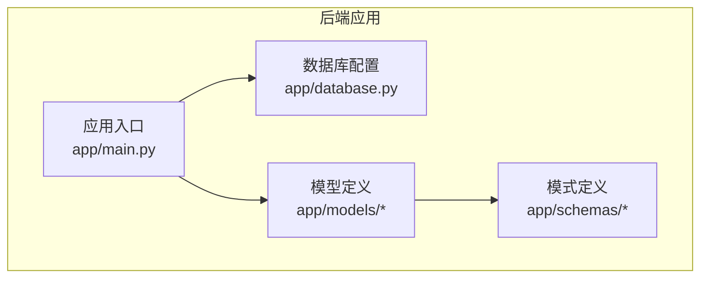
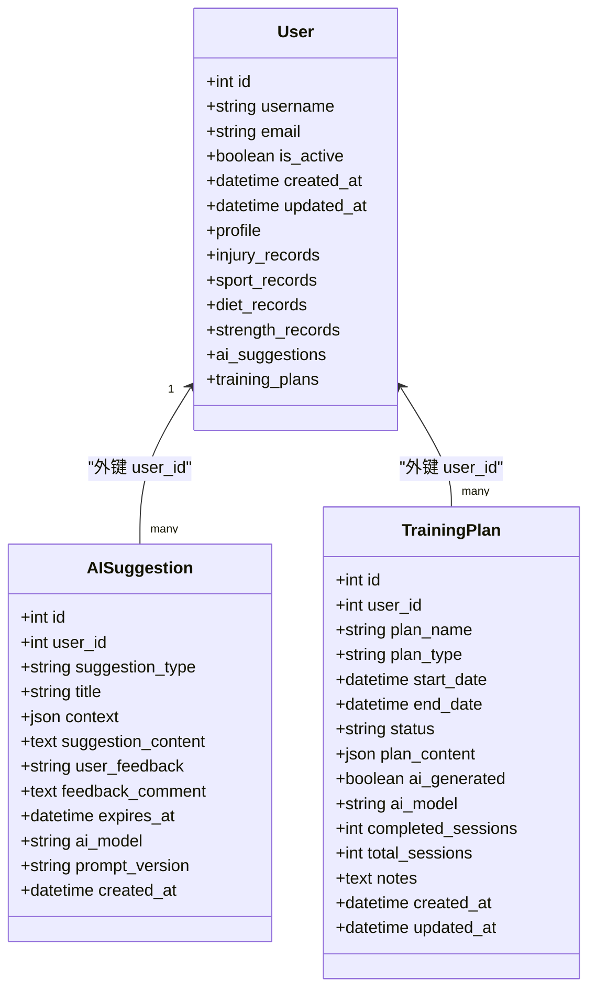

# AI数据模型与架构

<cite>
**本文引用的文件**
- [backend/app/models/ai.py](file://backend/app/models/ai.py)
- [backend/app/models/user.py](file://backend/app/models/user.py)
- [backend/app/models/__init__.py](file://backend/app/models/__init__.py)
- [backend/app/database.py](file://backend/app/database.py)
- [backend/app/main.py](file://backend/app/main.py)
- [backend/app/schemas/__init__.py](file://backend/app/schemas/__init__.py)
</cite>

## 目录
1. [简介](#简介)
2. [项目结构](#项目结构)
3. [核心组件](#核心组件)
4. [架构总览](#架构总览)
5. [详细组件分析](#详细组件分析)
6. [依赖关系分析](#依赖关系分析)
7. [性能考量](#性能考量)
8. [故障排查指南](#故障排查指南)
9. [结论](#结论)
10. [附录](#附录)

## 简介
本文件面向ActiveSynapse AI智能系统，聚焦于两大核心数据模型：AI建议（AISuggestion）与训练计划（TrainingPlan）。文档从数据模型设计、字段定义、枚举类型、关系映射、外键与级联策略、JSON结构规范、索引与性能优化、验证规则、最佳实践与扩展指引等方面进行系统化阐述，帮助开发者快速理解并正确使用这些模型。

## 项目结构
后端采用FastAPI + SQLAlchemy异步ORM，数据库初始化在应用启动时完成。AI相关模型位于models子包中，并通过统一导出入口暴露给上层服务与API。

图表来源
- [backend/app/main.py](file://backend/app/main.py#L1-L77)
- [backend/app/database.py](file://backend/app/database.py#L1-L43)
- [backend/app/models/__init__.py](file://backend/app/models/__init__.py#L1-L20)
- [backend/app/schemas/__init__.py](file://backend/app/schemas/__init__.py#L1-L23)

章节来源
- [backend/app/main.py](file://backend/app/main.py#L1-L77)
- [backend/app/database.py](file://backend/app/database.py#L1-L43)
- [backend/app/models/__init__.py](file://backend/app/models/__init__.py#L1-L20)
- [backend/app/schemas/__init__.py](file://backend/app/schemas/__init__.py#L1-L23)

## 核心组件
本节对AISuggestion与TrainingPlan两大模型进行深入解析，包括字段语义、约束、默认值、关系映射及典型JSON结构示例。

- AISuggestion（AI建议）
  - 关键字段
    - 基础标识与关联：主键id；外键user_id指向users表，删除策略为级联删除
    - 建议类型：suggestion_type（字符串），取值由SuggestionType枚举限定
    - 标题与上下文：title（可选）、context（JSON对象，存储生成建议所用的上下文信息）
    - 建议内容：suggestion_content（文本，必填）
    - 用户反馈：user_feedback（字符串，如“helpful”或“not_helpful”，可选）、feedback_comment（可选）
    - 过期时间：expires_at（可选）
    - 元数据：ai_model（AI模型名称，可选）、prompt_version（提示词版本，可选）
    - 时间戳：created_at（默认当前UTC时间）
  - 关系映射：与User模型建立一对多关系，反向通过User的ai_suggestions访问
  - 索引：主键索引（自动），user_id具备索引（由外键隐式创建）

- TrainingPlan（训练计划）
  - 关键字段
    - 基础标识与关联：主键id；外键user_id指向users表，删除策略为级联删除
    - 计划基本信息：plan_name（必填）、plan_type（字符串），取值由PlanType枚举限定
    - 时间线：start_date、end_date（均必填）
    - 状态：status（字符串，默认“active”），取值由PlanStatus枚举限定
    - 计划内容：plan_content（JSON对象，必填），包含周计划、目标与备注等结构化信息
    - AI属性：ai_generated（布尔，默认False）、ai_model（可选）
    - 进度跟踪：completed_sessions、total_sessions（整数，默认0）
    - 备注：notes（文本，可选）
    - 时间戳：created_at（默认当前UTC时间）、updated_at（更新时自动刷新）
  - 关系映射：与User模型建立一对多关系，反向通过User的training_plans访问
  - 索引：主键索引（自动），user_id具备索引（由外键隐式创建）

章节来源
- [backend/app/models/ai.py](file://backend/app/models/ai.py#L30-L64)
- [backend/app/models/ai.py](file://backend/app/models/ai.py#L66-L122)

## 架构总览
下图展示AI相关模型在系统中的位置与依赖关系，以及与用户模型的关系映射。

图表来源
- [backend/app/models/user.py](file://backend/app/models/user.py#L7-L31)
- [backend/app/models/ai.py](file://backend/app/models/ai.py#L30-L64)
- [backend/app/models/ai.py](file://backend/app/models/ai.py#L66-L122)

## 详细组件分析

### 枚举类型与取值范围
- SuggestionType（建议类型）
  - 取值：training、diet、recovery、injury_prevention、general
  - 用途：限定AISuggestion的suggestion_type字段取值，确保类型一致性与可扩展性

- PlanType（计划类型）
  - 取值：running、strength、badminton、combined
  - 用途：限定TrainingPlan的plan_type字段取值，便于前端与业务逻辑按类型处理

- PlanStatus（计划状态）
  - 取值：active、completed、paused、cancelled
  - 用途：限定TrainingPlan的status字段取值，支持计划生命周期管理

章节来源
- [backend/app/models/ai.py](file://backend/app/models/ai.py#L8-L28)

### 数据模型字段与约束
- AISuggestion
  - 字段与约束
    - id：主键，自增，带索引
    - user_id：外键users.id，非空，删除时级联删除
    - suggestion_type：非空，取值来自SuggestionType
    - title：可选，长度限制
    - context：可选，JSON对象
    - suggestion_content：非空，文本
    - user_feedback：可选，字符串
    - feedback_comment：可选，文本
    - expires_at：可选，日期时间
    - ai_model、prompt_version：可选
    - created_at：默认当前UTC时间
  - 关系：与User的ai_suggestions双向映射

- TrainingPlan
  - 字段与约束
    - id：主键，自增，带索引
    - user_id：外键users.id，非空，删除时级联删除
    - plan_name：非空，长度限制
    - plan_type：非空，取值来自PlanType
    - start_date、end_date：非空，时间顺序需满足end_date >= start_date
    - status：默认“active”，取值来自PlanStatus
    - plan_content：非空，JSON对象，包含周计划、目标与备注等
    - ai_generated：默认False
    - ai_model：可选
    - completed_sessions、total_sessions：默认0
    - notes：可选，文本
    - created_at、updated_at：时间戳
  - 关系：与User的training_plans双向映射

章节来源
- [backend/app/models/ai.py](file://backend/app/models/ai.py#L30-L64)
- [backend/app/models/ai.py](file://backend/app/models/ai.py#L66-L122)

### JSON结构规范与示例
- AISuggestion.context（可选）
  - 结构：JSON对象，用于记录生成建议的上下文，如用户画像、近期活动、伤病历史等
  - 用途：便于复现与审计，支持后续分析与优化

- TrainingPlan.plan_content（必填）
  - 结构要点
    - weeks：数组，元素为周对象，包含week_number与days
    - days：数组，元素为日对象，包含day与activities
    - activities：数组，元素为活动对象，包含type、duration、intensity、description等
    - goals：数组，字符串列表，记录计划目标
    - notes：字符串，计划备注
  - 示例结构参考模型注释中的JSON示例

章节来源
- [backend/app/models/ai.py](file://backend/app/models/ai.py#L40-L41)
- [backend/app/models/ai.py](file://backend/app/models/ai.py#L83-L102)

### 关系映射、外键与级联策略
- 外键
  - AISuggestion.user_id → users.id
  - TrainingPlan.user_id → users.id
- 级联策略
  - 删除策略均为ondelete="CASCADE"，即当用户被删除时，其所有AI建议与训练计划将被级联删除
- 反向关系
  - User.profile、User.injury_records、User.sport_records、User.diet_records、User.strength_records、User.ai_suggestions、User.training_plans均通过级联策略维护数据完整性

章节来源
- [backend/app/models/ai.py](file://backend/app/models/ai.py#L34-L34)
- [backend/app/models/ai.py](file://backend/app/models/ai.py#L70-L70)
- [backend/app/models/user.py](file://backend/app/models/user.py#L22-L28)

### 数据验证规则
- 必填字段
  - AISuggestion：suggestion_content
  - TrainingPlan：plan_name、plan_type、start_date、end_date、plan_content
- 类型与取值范围
  - 枚举字段：suggestion_type（SuggestionType）、plan_type（PlanType）、status（PlanStatus）
  - JSON字段：context（AISuggestion）、plan_content（TrainingPlan）需为合法JSON
- 时间约束
  - TrainingPlan：end_date应不早于start_date
- 唯一性与索引
  - users表的username与email具备唯一性约束（由模型定义决定）
  - 外键user_id隐式建立索引，提升查询性能

章节来源
- [backend/app/models/ai.py](file://backend/app/models/ai.py#L37-L44)
- [backend/app/models/ai.py](file://backend/app/models/ai.py#L73-L78)
- [backend/app/models/ai.py](file://backend/app/models/ai.py#L83-L84)
- [backend/app/models/user.py](file://backend/app/models/user.py#L11-L12)

### 性能优化与索引设计
- 索引
  - 主键索引：自动为id字段创建
  - 外键索引：user_id由外键隐式创建索引，加速关联查询
- 查询优化建议
  - 针对高频过滤字段（如user_id、status、created_at）可考虑复合索引
  - 对JSON字段的查询建议使用数据库JSON函数或在应用层进行预处理
- 异步与连接池
  - 使用SQLAlchemy异步引擎与会话工厂，减少阻塞
  - 初始化时一次性创建表结构，避免运行时DDL开销

章节来源
- [backend/app/database.py](file://backend/app/database.py#L1-L43)
- [backend/app/models/ai.py](file://backend/app/models/ai.py#L34-L34)
- [backend/app/models/ai.py](file://backend/app/models/ai.py#L70-L70)

### 最佳实践
- 模型扩展
  - 新增建议类型：在SuggestionType中添加新枚举值，并在业务层校验
  - 新增计划类型：在PlanType中添加新枚举值，并在API层校验
  - 新增状态：在PlanStatus中添加新枚举值，保持前后端一致
- JSON结构演进
  - 为plan_content引入版本号或schema校验，保证向后兼容
  - 对context与plan_content进行规范化存储，避免冗余字段
- 安全与审计
  - 对敏感字段（如ai_model、prompt_version）进行最小权限访问控制
  - 记录关键操作的日志，便于审计与回溯

### 常见问题与解决方案
- 删除用户后数据清理
  - 现状：user_id外键删除策略为CASCADE，用户删除时AI建议与训练计划同步删除
  - 建议：若需保留数据，可调整为SET NULL或RESTRICT，并在业务层迁移数据
- JSON字段查询性能
  - 现状：JSON字段查询可能较慢
  - 建议：对常用查询路径抽取到独立列，或使用物化视图
- 状态机一致性
  - 现状：状态由字符串表示，易出现拼写错误
  - 建议：在API层统一使用PlanStatus枚举，避免硬编码字符串

## 依赖关系分析
- 模块导入
  - models/__init__.py集中导出User、AISuggestion、TrainingPlan等模型，便于上层服务与API直接引用
- 应用启动流程
  - main.py在应用生命周期内调用init_db()创建所有表，确保模型定义与数据库结构一致
- 数据库引擎
  - database.py提供异步引擎与会话工厂，供各模型与服务使用

图表来源
- [backend/app/main.py](file://backend/app/main.py#L39-L44)
- [backend/app/database.py](file://backend/app/database.py#L39-L42)
- [backend/app/models/__init__.py](file://backend/app/models/__init__.py#L6-L6)

章节来源
- [backend/app/models/__init__.py](file://backend/app/models/__init__.py#L1-L20)
- [backend/app/main.py](file://backend/app/main.py#L12-L18)
- [backend/app/database.py](file://backend/app/database.py#L39-L42)

## 性能考量
- 异步I/O
  - 使用异步引擎与会话，降低阻塞，提升并发吞吐
- 连接池与事务
  - 合理设置连接池参数，避免长事务占用资源
- 查询优化
  - 利用外键索引与必要时的复合索引，减少全表扫描
- JSON处理
  - 控制JSON字段大小，避免超大文档影响序列化与传输性能

## 故障排查指南
- 表未创建
  - 症状：首次请求报错找不到表
  - 排查：确认init_db()已执行，检查DATABASE_URL配置
- 外键约束失败
  - 症状：插入或更新时报外键约束错误
  - 排查：确认user_id指向的用户存在，检查删除策略是否符合预期
- JSON解析异常
  - 症状：保存或读取JSON字段时报错
  - 排查：确认JSON结构合法，字段命名与示例一致
- 状态值非法
  - 症状：状态字段不符合枚举取值
  - 排查：在API层统一使用枚举，避免直接传入字符串

章节来源
- [backend/app/main.py](file://backend/app/main.py#L39-L44)
- [backend/app/database.py](file://backend/app/database.py#L39-L42)
- [backend/app/models/ai.py](file://backend/app/models/ai.py#L83-L84)

## 结论
AISuggestion与TrainingPlan作为ActiveSynapse AI智能系统的核心数据模型，通过明确的字段定义、严格的枚举约束与清晰的关系映射，支撑了建议生成与训练计划管理的关键业务。配合异步数据库与合理的索引策略，系统在保证数据一致性的同时兼顾了性能与可扩展性。建议在后续迭代中持续完善JSON结构校验、状态机治理与查询优化，以进一步提升稳定性与用户体验。

## 附录
- 枚举与字段取值参考
  - SuggestionType：training、diet、recovery、injury_prevention、general
  - PlanType：running、strength、badminton、combined
  - PlanStatus：active、completed、paused、cancelled
- JSON结构参考
  - AISuggestion.context：建议生成上下文（JSON对象）
  - TrainingPlan.plan_content：周计划、目标与备注（JSON对象）