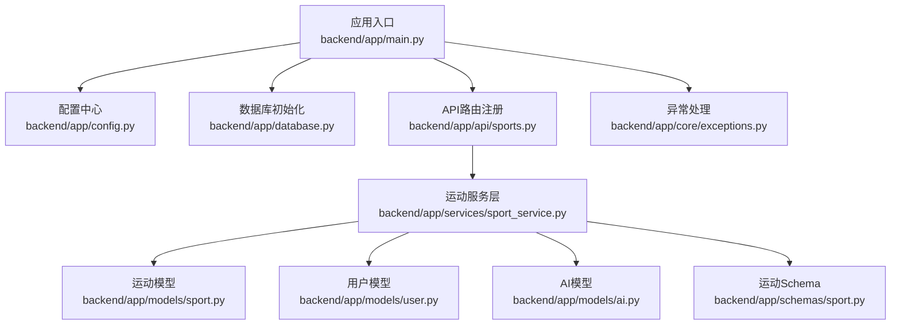
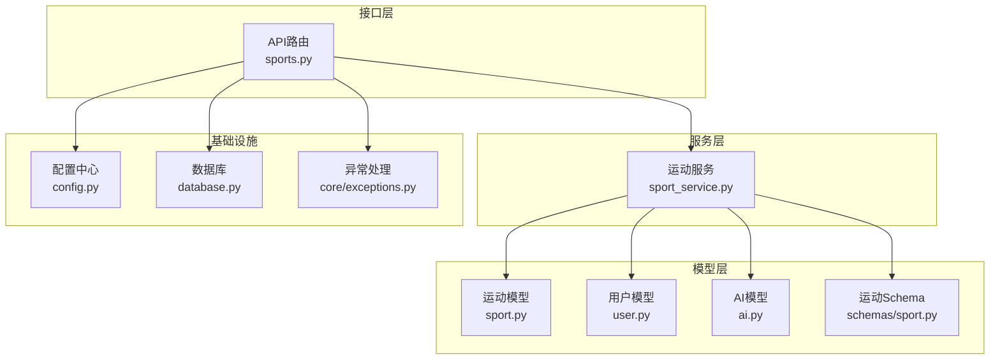
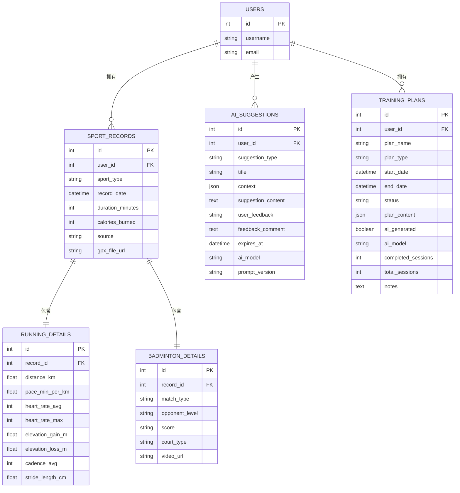
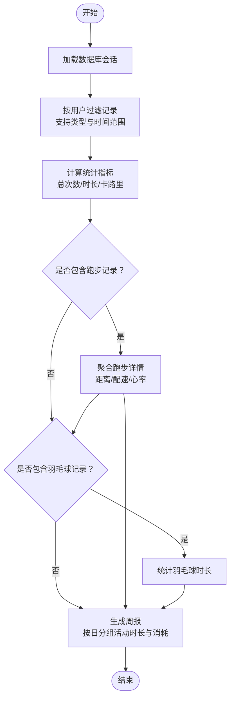
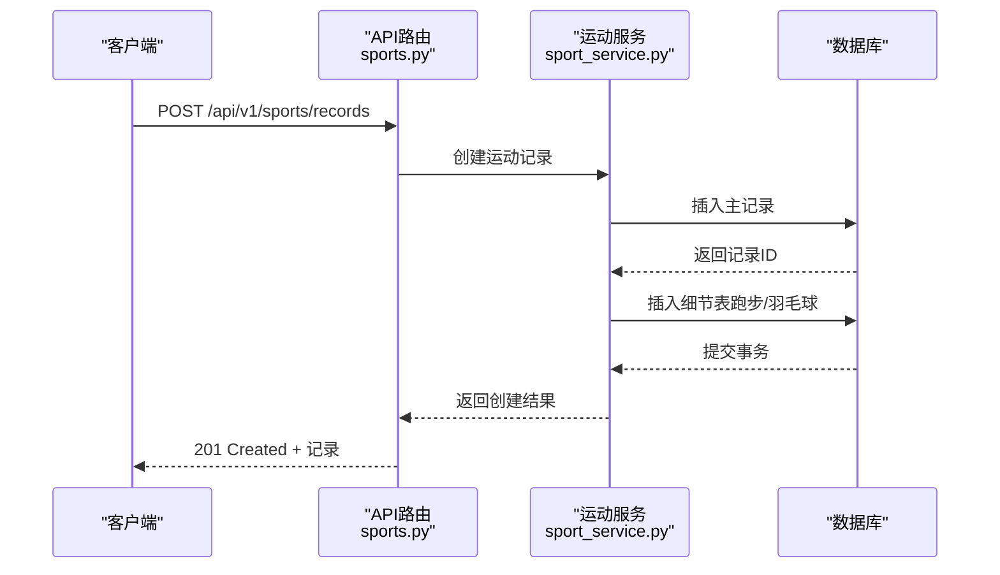
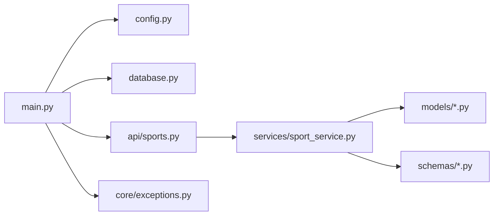

# AI智能系统

<cite>
**本文档引用的文件**
- [README.md](file://README.md)
- [backend/app/main.py](file://backend/app/main.py)
- [backend/app/config.py](file://backend/app/config.py)
- [backend/app/database.py](file://backend/app/database.py)
- [backend/app/models/ai.py](file://backend/app/models/ai.py)
- [backend/app/models/sport.py](file://backend/app/models/sport.py)
- [backend/app/models/user.py](file://backend/app/models/user.py)
- [backend/app/schemas/sport.py](file://backend/app/schemas/sport.py)
- [backend/app/services/sport_service.py](file://backend/app/services/sport_service.py)
- [backend/app/api/sports.py](file://backend/app/api/sports.py)
- [backend/app/core/exceptions.py](file://backend/app/core/exceptions.py)
</cite>

## 目录
1. [简介](#简介)
2. [项目结构](#项目结构)
3. [核心组件](#核心组件)
4. [架构总览](#架构总览)
5. [详细组件分析](#详细组件分析)
6. [依赖关系分析](#依赖关系分析)
7. [性能考虑](#性能考虑)
8. [故障排除指南](#故障排除指南)
9. [结论](#结论)
10. [附录](#附录)

## 简介
ActiveSynapse 是一个个人运动智能教练系统，旨在通过AI驱动的建议与训练计划，帮助用户科学地进行运动管理与健康提升。本系统当前已具备完整的后端基础架构与数据模型，支持运动记录、统计与周报等核心功能，并预留了AI建议与训练计划的数据模型与API扩展点。

根据现有代码，系统尚未实现具体的AI服务集成（如OpenAI），但已通过配置项与数据模型为后续接入AI服务做好准备。本文档将基于现有代码，提供AI系统的设计蓝图、提示词模板设计思路、建议生成流程、个性化训练计划制定与反馈收集机制，并给出可扩展的实现路径与最佳实践。

## 项目结构
后端采用FastAPI框架，使用异步SQLAlchemy ORM进行数据库访问，配置集中于settings对象，数据模型位于models目录，业务逻辑封装在services中，API路由集中在api目录下。

图表来源
- [backend/app/main.py](file://backend/app/main.py#L1-L77)
- [backend/app/config.py](file://backend/app/config.py#L1-L46)
- [backend/app/database.py](file://backend/app/database.py#L1-L43)
- [backend/app/api/sports.py](file://backend/app/api/sports.py#L1-L127)
- [backend/app/services/sport_service.py](file://backend/app/services/sport_service.py#L1-L238)
- [backend/app/models/sport.py](file://backend/app/models/sport.py#L1-L115)
- [backend/app/models/user.py](file://backend/app/models/user.py#L25-L51)
- [backend/app/models/ai.py](file://backend/app/models/ai.py#L1-L123)
- [backend/app/schemas/sport.py](file://backend/app/schemas/sport.py#L1-L102)
- [backend/app/core/exceptions.py](file://backend/app/core/exceptions.py#L1-L54)

章节来源
- [backend/app/main.py](file://backend/app/main.py#L1-L77)
- [backend/app/config.py](file://backend/app/config.py#L1-L46)
- [backend/app/database.py](file://backend/app/database.py#L1-L43)

## 核心组件
- 应用入口与生命周期：负责启动数据库连接、CORS配置、全局异常处理以及路由注册。
- 配置中心：集中管理应用名称、版本、数据库、Redis、JWT、AI模型与文件上传等配置。
- 数据库层：提供异步引擎与会话工厂，统一数据库初始化与事务管理。
- 运动服务层：封装运动记录的增删改查、统计与周报计算。
- 模型层：定义运动记录、跑步细节、羽毛球细节、用户档案、AI建议与训练计划等数据模型。
- 异常处理：提供认证、授权、资源不存在、验证、冲突等统一异常类型。

章节来源
- [backend/app/main.py](file://backend/app/main.py#L12-L57)
- [backend/app/config.py](file://backend/app/config.py#L5-L46)
- [backend/app/database.py](file://backend/app/database.py#L6-L43)
- [backend/app/services/sport_service.py](file://backend/app/services/sport_service.py#L10-L238)
- [backend/app/models/sport.py](file://backend/app/models/sport.py#L23-L115)
- [backend/app/models/user.py](file://backend/app/models/user.py#L34-L51)
- [backend/app/models/ai.py](file://backend/app/models/ai.py#L30-L123)
- [backend/app/core/exceptions.py](file://backend/app/core/exceptions.py#L4-L54)

## 架构总览
系统采用分层架构，API层负责请求处理与路由，服务层封装业务逻辑，模型层定义数据结构，配置与数据库层提供基础设施支撑。AI相关能力以数据模型形式预留，便于后续接入外部AI服务。

图表来源
- [backend/app/api/sports.py](file://backend/app/api/sports.py#L1-L127)
- [backend/app/services/sport_service.py](file://backend/app/services/sport_service.py#L1-L238)
- [backend/app/models/sport.py](file://backend/app/models/sport.py#L1-L115)
- [backend/app/models/user.py](file://backend/app/models/user.py#L25-L51)
- [backend/app/models/ai.py](file://backend/app/models/ai.py#L1-L123)
- [backend/app/schemas/sport.py](file://backend/app/schemas/sport.py#L1-L102)
- [backend/app/config.py](file://backend/app/config.py#L1-L46)
- [backend/app/database.py](file://backend/app/database.py#L1-L43)
- [backend/app/core/exceptions.py](file://backend/app/core/exceptions.py#L1-L54)

## 详细组件分析

### 数据模型与关系
系统通过SQLAlchemy ORM定义了运动记录、用户档案、AI建议与训练计划等核心实体，并建立了清晰的关系映射，便于后续AI建议与训练计划的生成与存储。

图表来源
- [backend/app/models/user.py](file://backend/app/models/user.py#L25-L51)
- [backend/app/models/sport.py](file://backend/app/models/sport.py#L23-L115)
- [backend/app/models/ai.py](file://backend/app/models/ai.py#L30-L123)

章节来源
- [backend/app/models/user.py](file://backend/app/models/user.py#L25-L51)
- [backend/app/models/sport.py](file://backend/app/models/sport.py#L23-L115)
- [backend/app/models/ai.py](file://backend/app/models/ai.py#L30-L123)

### 运动服务与统计逻辑
运动服务层提供了运动记录的查询、创建、更新、删除与统计分析功能，并实现了周报汇总逻辑。这些能力为AI建议与训练计划提供了丰富的上下文数据。

图表来源
- [backend/app/services/sport_service.py](file://backend/app/services/sport_service.py#L127-L194)
- [backend/app/services/sport_service.py](file://backend/app/services/sport_service.py#L195-L238)

章节来源
- [backend/app/services/sport_service.py](file://backend/app/services/sport_service.py#L23-L46)
- [backend/app/services/sport_service.py](file://backend/app/services/sport_service.py#L127-L194)
- [backend/app/services/sport_service.py](file://backend/app/services/sport_service.py#L195-L238)

### API工作流（运动记录）
以下序列图展示了运动记录的创建流程，从API到服务层再到数据库的完整调用链。

图表来源
- [backend/app/api/sports.py](file://backend/app/api/sports.py#L37-L47)
- [backend/app/services/sport_service.py](file://backend/app/services/sport_service.py#L48-L96)

章节来源
- [backend/app/api/sports.py](file://backend/app/api/sports.py#L37-L47)
- [backend/app/services/sport_service.py](file://backend/app/services/sport_service.py#L48-L96)

### AI服务集成蓝图（设计阶段）
基于现有配置与模型，系统已为AI服务集成预留了关键字段与扩展点。以下为建议的集成方案与实现步骤：

- OpenAI集成实现
  - 在配置中心添加OpenAI相关参数（API密钥、模型名称、温度、最大令牌数等）。
  - 创建AI服务类，封装提示词构建、调用OpenAI API与响应解析。
  - 实现重试与超时控制，确保稳定性与性能。

- 提示词模板设计
  - 定义不同类型的提示词模板（训练建议、饮食建议、恢复建议、伤病预防、通用建议）。
  - 模板应包含用户画像、近期运动数据、伤病历史、目标与偏好等上下文信息。
  - 支持版本化管理，便于迭代与A/B测试。

- 建议生成流程
  - 收集上下文：用户档案、最近N次运动记录、伤病与恢复状态。
  - 构建提示词：将上下文注入模板，生成最终提示。
  - 调用AI模型：发送请求并接收响应。
  - 存储与过期：保存建议内容、元数据与过期时间，定期清理过期建议。

- 个性化训练计划制定
  - 使用AI生成结构化训练计划（周为单位，包含天与活动）。
  - 计划应包含目标、备注与进度跟踪字段，支持AI标记与模型标识。
  - 提供计划状态管理（激活/完成/暂停/取消）。

- 建议反馈收集机制
  - 在建议模型中增加用户反馈字段（有用/无用）与评论。
  - 提供反馈提交接口，支持匿名或实名反馈。
  - 建立反馈分析与质量评估体系，用于持续改进。

- 扩展点与自定义能力
  - 支持多模型切换与参数调优（温度、最大令牌数、频率惩罚等）。
  - 允许自定义提示词模板与上下文提取规则。
  - 提供插件化扩展点，便于接入其他AI服务或本地模型。

- 错误处理、重试策略与监控指标
  - 统一异常处理，区分网络错误、API限流与内容安全错误。
  - 实现指数退避重试与熔断保护，避免雪崩效应。
  - 记录关键指标：请求耗时、成功率、Token用量、错误类型分布。

章节来源
- [backend/app/config.py](file://backend/app/config.py#L24-L27)
- [backend/app/models/ai.py](file://backend/app/models/ai.py#L30-L123)

## 依赖关系分析
系统各模块之间耦合度较低，遵循单一职责原则。API层仅负责路由与参数校验，服务层封装业务逻辑，模型层专注数据结构，配置与数据库层提供基础设施。

图表来源
- [backend/app/main.py](file://backend/app/main.py#L1-L77)
- [backend/app/config.py](file://backend/app/config.py#L1-L46)
- [backend/app/database.py](file://backend/app/database.py#L1-L43)
- [backend/app/api/sports.py](file://backend/app/api/sports.py#L1-L127)
- [backend/app/services/sport_service.py](file://backend/app/services/sport_service.py#L1-L238)
- [backend/app/models/sport.py](file://backend/app/models/sport.py#L1-L115)
- [backend/app/models/user.py](file://backend/app/models/user.py#L25-L51)
- [backend/app/models/ai.py](file://backend/app/models/ai.py#L1-L123)
- [backend/app/schemas/sport.py](file://backend/app/schemas/sport.py#L1-L102)
- [backend/app/core/exceptions.py](file://backend/app/core/exceptions.py#L1-L54)

章节来源
- [backend/app/main.py](file://backend/app/main.py#L1-L77)
- [backend/app/api/sports.py](file://backend/app/api/sports.py#L1-L127)
- [backend/app/services/sport_service.py](file://backend/app/services/sport_service.py#L1-L238)

## 性能考虑
- 数据库性能
  - 使用异步引擎与连接池，减少I/O阻塞。
  - 对常用查询建立索引（用户ID、记录日期、运动类型）。
  - 分页查询限制最大返回条数，避免一次性加载过多数据。

- 缓存策略
  - 对热点统计结果进行缓存（如周报、近N日统计）。
  - 利用Redis存储临时上下文与会话状态。

- API性能
  - 合理设置CORS与中间件，避免不必要的跨域检查。
  - 控制请求体大小与文件上传限制，防止内存溢出。

- AI服务性能
  - 对AI请求进行限流与队列化，避免瞬时高并发导致延迟。
  - 使用模型压缩与量化技术（如适用），降低推理成本。

## 故障排除指南
- 常见异常类型
  - 认证失败：检查JWT密钥与过期时间配置。
  - 资源未找到：确认用户ID与记录ID匹配，避免越权访问。
  - 参数验证错误：核对请求体字段类型与取值范围。
  - 冲突错误：检查重复创建场景与唯一约束。

- 错误处理与重试
  - 对网络异常与API限流进行指数退避重试。
  - 记录错误堆栈与上下文信息，便于定位问题。

- 监控指标
  - 请求量、响应时间、错误率、Token用量。
  - AI模型调用成功率与平均耗时。

章节来源
- [backend/app/core/exceptions.py](file://backend/app/core/exceptions.py#L10-L54)
- [backend/app/main.py](file://backend/app/main.py#L38-L53)

## 结论
ActiveSynapse 当前已具备完善的后端基础设施与数据模型，为AI智能系统的落地提供了坚实基础。通过在配置中心与模型层预留的扩展点，系统可以平滑接入AI服务，实现个性化建议与训练计划的生成与管理。建议按照本文档的集成蓝图逐步实现提示词模板、建议生成流程与反馈收集机制，并结合性能优化与监控指标，持续提升AI服务的稳定性与用户体验。

## 附录
- 快速开始
  - 配置数据库与Redis连接字符串。
  - 设置OpenAI API密钥与模型名称。
  - 启动应用并访问健康检查端点确认运行状态。

- 开发者最佳实践
  - 将提示词模板与上下文提取逻辑模块化，便于维护与测试。
  - 对AI输出进行格式校验与二次加工，确保一致性。
  - 建立灰度发布与A/B测试机制，逐步扩大AI建议的应用范围。