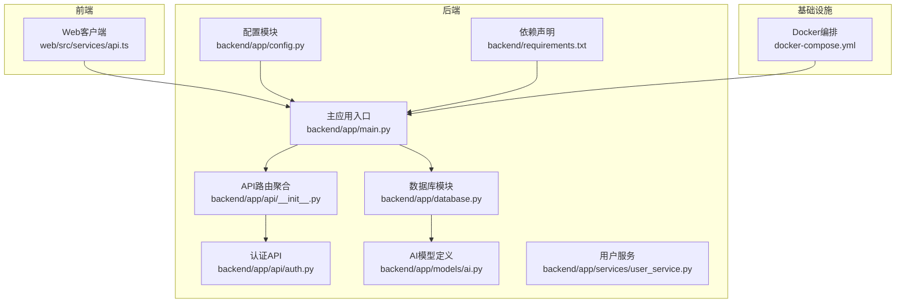
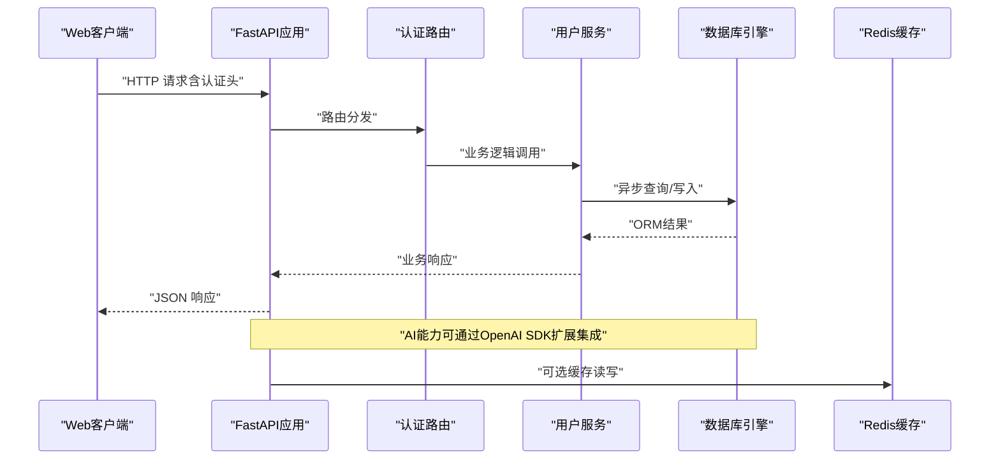
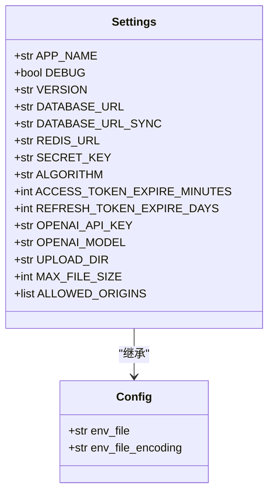
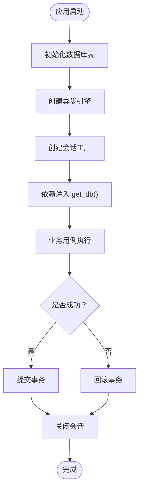
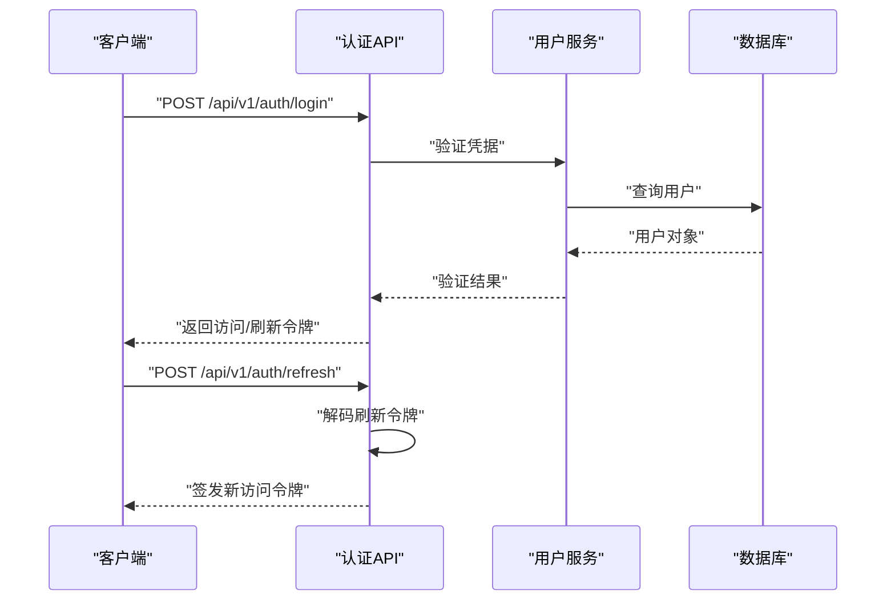
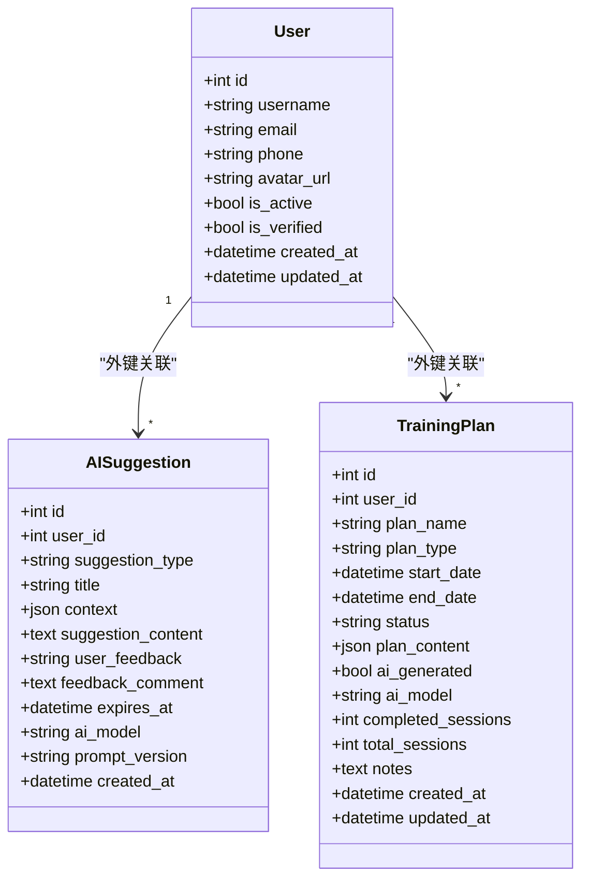
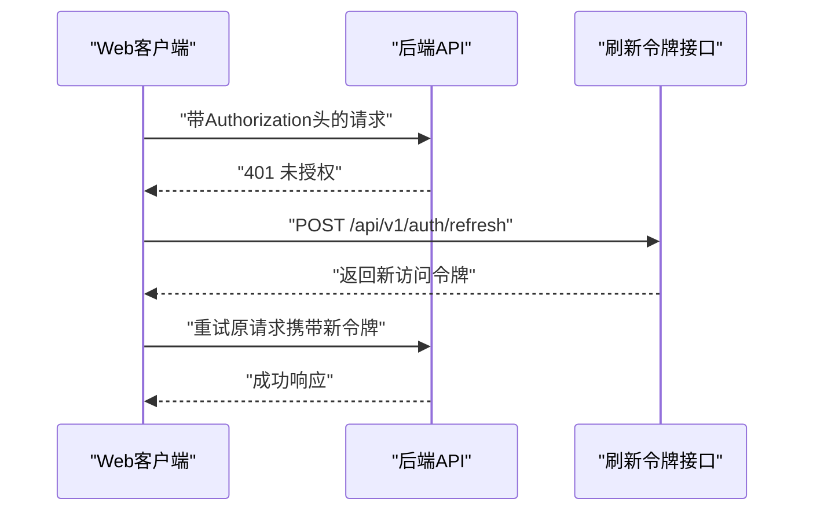
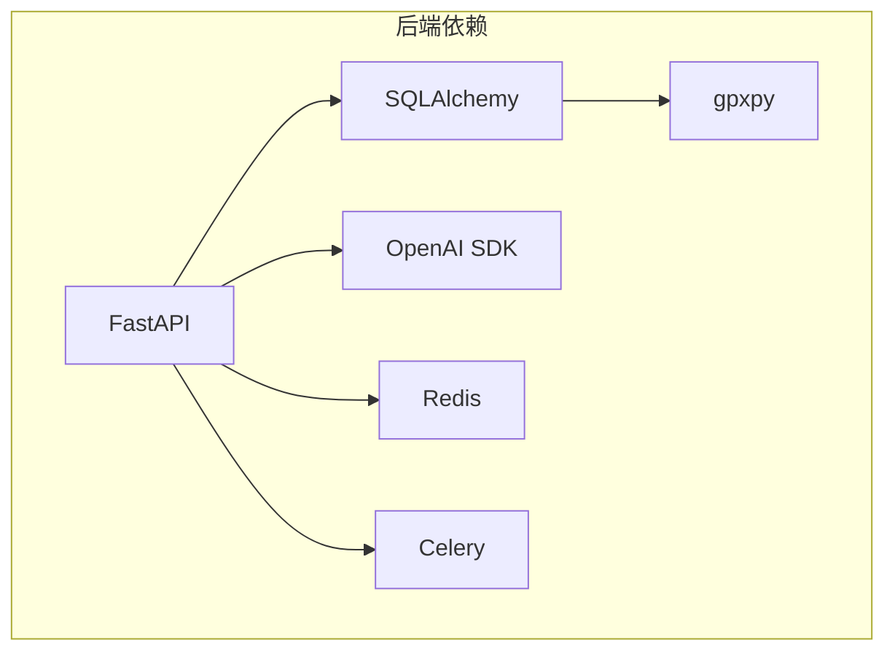

# AI服务集成与配置

<cite>
**本文档引用的文件**
- [backend/app/config.py](file://backend/app/config.py)
- [backend/app/main.py](file://backend/app/main.py)
- [backend/app/models/ai.py](file://backend/app/models/ai.py)
- [backend/app/database.py](file://backend/app/database.py)
- [backend/app/api/__init__.py](file://backend/app/api/__init__.py)
- [backend/app/api/auth.py](file://backend/app/api/auth.py)
- [backend/app/services/user_service.py](file://backend/app/services/user_service.py)
- [backend/requirements.txt](file://backend/requirements.txt)
- [docker-compose.yml](file://docker-compose.yml)
- [web/src/services/api.ts](file://web/src/services/api.ts)
</cite>

## 目录
1. [简介](#简介)
2. [项目结构](#项目结构)
3. [核心组件](#核心组件)
4. [架构概览](#架构概览)
5. [详细组件分析](#详细组件分析)
6. [依赖分析](#依赖分析)
7. [性能考虑](#性能考虑)
8. [故障排除指南](#故障排除指南)
9. [结论](#结论)
10. [附录](#附录)

## 简介
本文件为 ActiveSynapse AI 服务集成的技术文档，重点阐述基于 OpenAI API 的集成实现、API 密钥管理、请求配置、初始化流程、连接池与超时处理、模型支持与版本兼容性、错误处理与重试策略、降级机制、请求参数构造、响应解析与缓存策略，以及性能监控、日志记录与调试工具。同时提供安全配置、速率限制与成本控制的最佳实践。

## 项目结构
ActiveSynapse 后端采用 FastAPI 框架，数据库使用 SQLAlchemy 异步 ORM，AI 能力通过 OpenAI SDK 集成。项目主要目录如下：
- backend：后端应用，包含配置、数据库、API 路由、模型与服务层
- web：前端应用，Axios 客户端负责与后端 API 通信
- docker-compose.yml：容器编排，定义数据库、Redis 缓存与后端服务

**图表来源**
- [backend/app/config.py](file://backend/app/config.py#L1-L46)
- [backend/app/main.py](file://backend/app/main.py#L1-L77)
- [backend/app/api/__init__.py](file://backend/app/api/__init__.py#L1-L10)
- [backend/app/api/auth.py](file://backend/app/api/auth.py#L1-L92)
- [backend/app/models/ai.py](file://backend/app/models/ai.py#L1-L123)
- [backend/app/database.py](file://backend/app/database.py#L1-L43)
- [backend/requirements.txt](file://backend/requirements.txt#L1-L40)
- [docker-compose.yml](file://docker-compose.yml#L1-L54)
- [web/src/services/api.ts](file://web/src/services/api.ts#L1-L50)

**章节来源**
- [backend/app/config.py](file://backend/app/config.py#L1-L46)
- [backend/app/main.py](file://backend/app/main.py#L1-L77)
- [backend/app/api/__init__.py](file://backend/app/api/__init__.py#L1-L10)
- [backend/app/models/ai.py](file://backend/app/models/ai.py#L1-L123)
- [backend/app/database.py](file://backend/app/database.py#L1-L43)
- [backend/requirements.txt](file://backend/requirements.txt#L1-L40)
- [docker-compose.yml](file://docker-compose.yml#L1-L54)
- [web/src/services/api.ts](file://web/src/services/api.ts#L1-L50)

## 核心组件
- 配置系统：集中管理应用配置，包括数据库、Redis、JWT、AI 与文件上传等参数，并通过环境变量注入。
- 数据库与会话：异步 SQLAlchemy 引擎与会话工厂，支持生命周期管理与异常回滚。
- API 路由：统一挂载认证、用户、运动、伤病等路由。
- AI 模型：定义建议与训练计划的数据结构，支持 AI 生成标记与模型标识。
- 用户服务：提供用户注册、登录、资料更新等业务逻辑。
- 前端客户端：Axios 封装，自动添加认证头与刷新令牌。

**章节来源**
- [backend/app/config.py](file://backend/app/config.py#L1-L46)
- [backend/app/database.py](file://backend/app/database.py#L1-L43)
- [backend/app/api/__init__.py](file://backend/app/api/__init__.py#L1-L10)
- [backend/app/models/ai.py](file://backend/app/models/ai.py#L1-L123)
- [backend/app/services/user_service.py](file://backend/app/services/user_service.py#L1-L120)
- [web/src/services/api.ts](file://web/src/services/api.ts#L1-L50)

## 架构概览
下图展示从 Web 客户端到后端 API，再到数据库与 AI 集成的整体架构。当前仓库中未发现直接的 OpenAI SDK 调用实现，但已具备集成所需的配置、模型与依赖声明。

**图表来源**
- [backend/app/main.py](file://backend/app/main.py#L1-L77)
- [backend/app/api/auth.py](file://backend/app/api/auth.py#L1-L92)
- [backend/app/services/user_service.py](file://backend/app/services/user_service.py#L1-L120)
- [backend/app/database.py](file://backend/app/database.py#L1-L43)

## 详细组件分析

### 配置系统与环境管理
- 配置类集中定义应用参数，包括数据库连接、Redis、JWT、AI（OpenAI API Key 与模型）、文件上传与 CORS。
- 使用缓存函数避免重复加载配置，确保运行时一致性。
- Docker Compose 通过环境变量注入 OpenAI API Key，便于在不同环境隔离配置。

**图表来源**
- [backend/app/config.py](file://backend/app/config.py#L5-L38)

**章节来源**
- [backend/app/config.py](file://backend/app/config.py#L1-L46)
- [docker-compose.yml](file://docker-compose.yml#L42-L48)

### 数据库与会话管理
- 异步引擎与会话工厂：使用 NullPool，适合短事务与高并发场景；可根据需要替换为连接池以优化资源复用。
- 会话依赖：提供自动提交、回滚与关闭，保证事务一致性。
- 初始化：应用启动时创建所有表结构。

**图表来源**
- [backend/app/database.py](file://backend/app/database.py#L1-L43)
- [backend/app/main.py](file://backend/app/main.py#L12-L19)

**章节来源**
- [backend/app/database.py](file://backend/app/database.py#L1-L43)
- [backend/app/main.py](file://backend/app/main.py#L12-L19)

### API 路由与认证
- 路由聚合：统一挂载认证、用户、运动、伤病等子路由。
- 认证流程：登录签发访问/刷新令牌，刷新接口验证并重新签发，登出提示客户端清理令牌。
- 异常处理：全局捕获自定义异常与通用异常，返回标准化错误响应。

**图表来源**
- [backend/app/api/__init__.py](file://backend/app/api/__init__.py#L1-L10)
- [backend/app/api/auth.py](file://backend/app/api/auth.py#L25-L85)
- [backend/app/services/user_service.py](file://backend/app/services/user_service.py#L61-L68)

**章节来源**
- [backend/app/api/__init__.py](file://backend/app/api/__init__.py#L1-L10)
- [backend/app/api/auth.py](file://backend/app/api/auth.py#L1-L92)
- [backend/app/services/user_service.py](file://backend/app/services/user_service.py#L1-L120)
- [backend/app/main.py](file://backend/app/main.py#L38-L53)

### AI 模型与数据结构
- AISuggestion：存储 AI 建议内容、类型、上下文、过期时间、AI 模型标识与提示词版本等。
- TrainingPlan：存储训练计划名称、类型、时间线、状态、结构化内容、AI 生成标记与模型信息等。
- 支持的建议类型与计划类型枚举，便于统一管理与扩展。

**图表来源**
- [backend/app/models/ai.py](file://backend/app/models/ai.py#L30-L122)

**章节来源**
- [backend/app/models/ai.py](file://backend/app/models/ai.py#L1-L123)

### 前端客户端与认证拦截器
- Axios 实例：设置基础 URL、内容类型与请求拦截器自动附加 Bearer 令牌。
- 响应拦截器：处理 401 未授权，尝试刷新令牌并重试原请求。
- 与后端路由前缀保持一致，确保 API 调用路径正确。

**图表来源**
- [web/src/services/api.ts](file://web/src/services/api.ts#L14-L50)
- [backend/app/api/auth.py](file://backend/app/api/auth.py#L52-L85)

**章节来源**
- [web/src/services/api.ts](file://web/src/services/api.ts#L1-L50)
- [backend/app/api/auth.py](file://backend/app/api/auth.py#L52-L85)

## 依赖分析
- OpenAI SDK：在依赖清单中声明，用于后续集成 AI 推理与生成能力。
- 数据库与连接：SQLAlchemy 2.x、asyncpg、psycopg2，配合异步引擎与会话工厂。
- 缓存：Redis 客户端，可用于热点数据与会话缓存。
- 任务队列：Celery，可用于后台任务调度（如批量生成建议或计划）。
- 文件解析：gpxpy，支持运动轨迹文件解析。

**图表来源**
- [backend/requirements.txt](file://backend/requirements.txt#L1-L40)

**章节来源**
- [backend/requirements.txt](file://backend/requirements.txt#L1-L40)

## 性能考虑
- 连接池选择：当前使用 NullPool，适合短事务；在高并发场景建议引入连接池以减少连接开销。
- 异常处理：数据库会话自动回滚与关闭，避免资源泄漏。
- 缓存策略：结合 Redis 对热点建议与计划进行缓存，降低重复计算与外部调用次数。
- 超时与重试：建议在集成 OpenAI 时设置合理的请求超时与指数退避重试，避免雪崩效应。
- 日志与监控：记录关键指标（请求耗时、错误率、调用次数），并结合 APM 工具进行性能分析。

## 故障排除指南
- 认证失败：检查前端是否正确附加 Authorization 头，后端刷新令牌接口是否正常工作。
- 数据库连接问题：确认 DATABASE_URL 与网络连通性，查看初始化日志。
- OpenAI 集成未生效：确认 OPENAI_API_KEY 是否通过环境变量正确注入，SDK 版本与依赖是否匹配。
- CORS 问题：核对 ALLOWED_ORIGINS 设置，确保前端域名与协议一致。
- 401 未授权：前端拦截器需正确处理刷新令牌流程，避免死循环重试。

**章节来源**
- [backend/app/main.py](file://backend/app/main.py#L38-L53)
- [web/src/services/api.ts](file://web/src/services/api.ts#L28-L50)
- [docker-compose.yml](file://docker-compose.yml#L42-L48)

## 结论
ActiveSynapse 已具备完善的配置、数据库与 API 基础设施，AI 集成通过 OpenAI SDK 可无缝扩展。建议在现有基础上完善连接池、缓存、超时与重试策略，并建立统一的日志与监控体系，以保障生产环境的稳定性与可观测性。

## 附录

### OpenAI 集成实施要点
- 初始化：在应用启动阶段或首次调用时初始化 OpenAI 客户端，读取配置中的 API Key 与模型。
- 请求配置：设置超时、重试次数与退避策略；对不同模型设置合适的温度与最大令牌数。
- 错误处理：区分网络错误、API 限流与语义错误，采用幂等与补偿机制。
- 降级策略：当 OpenAI 不可用时，返回缓存数据或默认模板，保证系统基本功能。
- 成本控制：统计调用次数与令牌消耗，设置预算上限与告警阈值。

### 安全配置与最佳实践
- 密钥管理：通过环境变量注入，避免硬编码；定期轮换；最小权限原则。
- 速率限制：在网关或应用层实现限流，防止滥用与费用激增。
- 数据脱敏：对外响应避免泄露敏感信息；对日志进行脱敏处理。
- 加密传输：生产环境强制 HTTPS；JWT 密钥安全存储。

### 版本兼容性与模型支持
- 当前配置默认模型为 GPT-4；可根据需求调整为其他模型（如 GPT-4o、GPT-3.5-turbo 等）。
- 建议在配置中增加模型版本字段，便于灰度发布与 A/B 测试。
- 对于结构化输出（如训练计划），建议在提示词中明确 JSON Schema，提升解析稳定性。