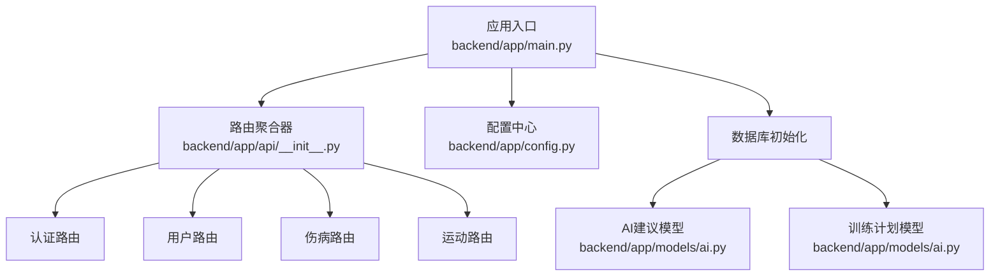
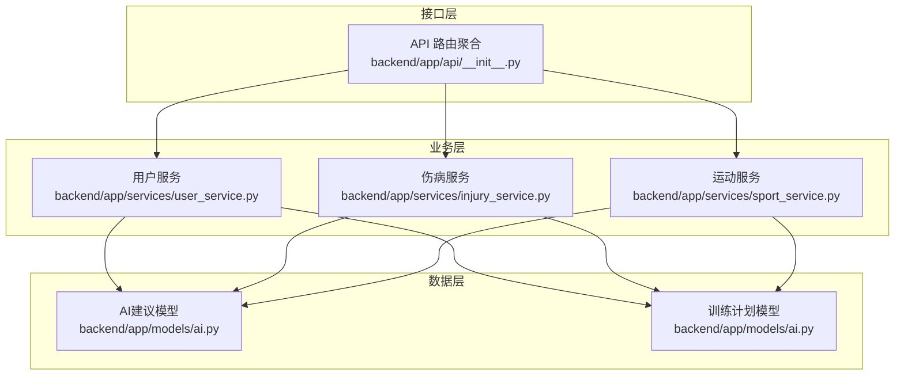
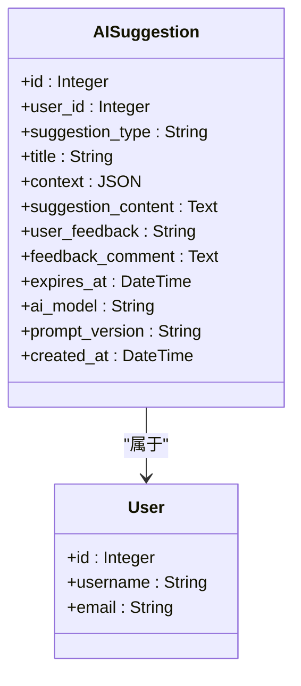
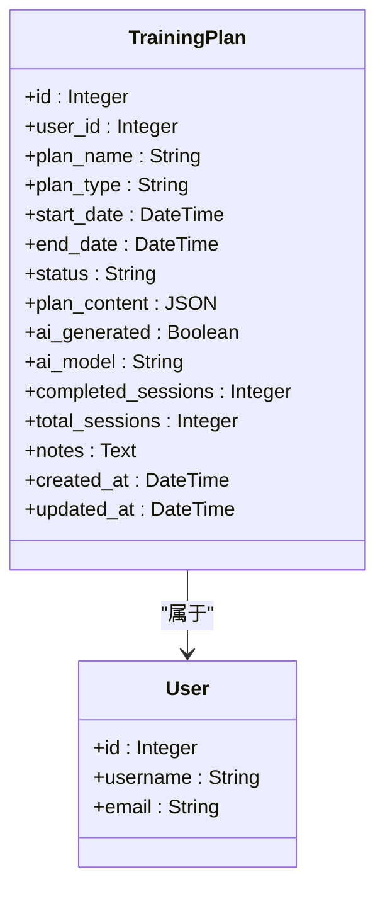
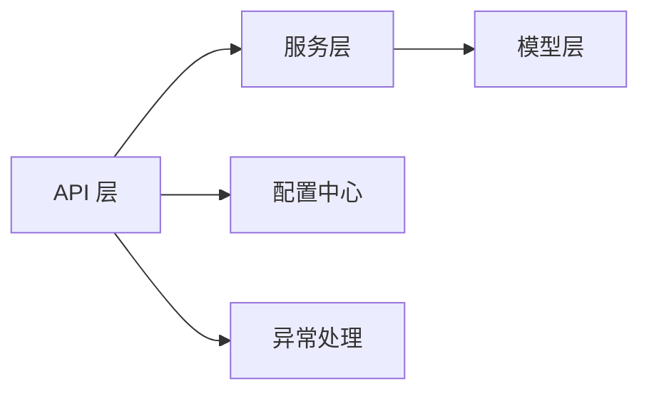

# 提示词模板管理

<cite>
**本文引用的文件**
- [README.md](file://README.md)
- [backend/app/main.py](file://backend/app/main.py)
- [backend/app/config.py](file://backend/app/config.py)
- [backend/app/models/ai.py](file://backend/app/models/ai.py)
- [backend/app/services/user_service.py](file://backend/app/services/user_service.py)
- [backend/app/services/injury_service.py](file://backend/app/services/injury_service.py)
- [backend/app/services/sport_service.py](file://backend/app/services/sport_service.py)
- [backend/app/api/__init__.py](file://backend/app/api/__init__.py)
</cite>

## 目录
1. [简介](#简介)
2. [项目结构](#项目结构)
3. [核心组件](#核心组件)
4. [架构总览](#架构总览)
5. [详细组件分析](#详细组件分析)
6. [依赖分析](#依赖分析)
7. [性能考量](#性能考量)
8. [故障排查指南](#故障排查指南)
9. [结论](#结论)
10. [附录](#附录)

## 简介
本文件面向ActiveSynapse提示词模板管理系统，系统目标是为用户提供基于AI的个性化建议与训练计划。当前仓库中与提示词模板直接相关的核心实体为AI建议模型与训练计划模型，它们承载了提示词模板的结构化存储、版本元数据以及生成上下文信息。本文将围绕以下主题展开：提示词模板的设计原则、结构规范与版本管理；四类AI建议（训练建议、饮食建议、康复建议、伤病预防）的模板映射；参数化设计与动态内容生成；本地化与多语言适配；测试与评估流程；自定义模板开发指南与最佳实践；版本控制、回滚与向后兼容策略。

## 项目结构
后端采用FastAPI框架，通过路由聚合器统一挂载认证、用户、伤病与运动等模块。配置集中于设置类，数据库初始化在应用生命周期内完成。AI建议与训练计划的数据模型位于ORM层，服务层封装业务逻辑，API层负责对外接口。

图表来源
- [backend/app/main.py](file://backend/app/main.py#L1-L77)
- [backend/app/api/__init__.py](file://backend/app/api/__init__.py#L1-L10)
- [backend/app/config.py](file://backend/app/config.py#L1-L46)
- [backend/app/models/ai.py](file://backend/app/models/ai.py#L1-L123)

章节来源
- [README.md](file://README.md#L1-L3)
- [backend/app/main.py](file://backend/app/main.py#L1-L77)
- [backend/app/api/__init__.py](file://backend/app/api/__init__.py#L1-L10)
- [backend/app/config.py](file://backend/app/config.py#L1-L46)

## 核心组件
- 建议类型枚举：用于标识建议类别（训练、饮食、康复、伤病预防、通用），作为模板选择与分发的关键字段。
- 训练计划类型枚举：用于区分不同训练计划类型（跑步、力量、羽毛球、综合），便于模板参数化与内容生成。
- 训练计划状态枚举：用于跟踪计划执行状态（激活、完成、暂停、取消），影响模板渲染与提示词上下文。
- AI建议模型：存储建议类型、标题、生成上下文、建议内容、过期时间、AI模型与提示词版本等元数据，并与用户建立关联。
- 训练计划模型：存储计划名称、类型、起止时间、状态、计划内容（结构化JSON）、是否由AI生成、AI模型、进度统计与备注等。

章节来源
- [backend/app/models/ai.py](file://backend/app/models/ai.py#L8-L28)
- [backend/app/models/ai.py](file://backend/app/models/ai.py#L30-L64)
- [backend/app/models/ai.py](file://backend/app/models/ai.py#L66-L123)

## 架构总览
提示词模板管理涉及三层协作：数据层（模型与服务）、业务层（服务封装）、接口层（API路由）。AI建议与训练计划作为模板载体，分别承载建议内容与训练计划内容；服务层负责查询、统计与汇总，API层负责对外暴露接口。

图表来源
- [backend/app/api/__init__.py](file://backend/app/api/__init__.py#L1-L10)
- [backend/app/services/user_service.py](file://backend/app/services/user_service.py#L1-L120)
- [backend/app/services/injury_service.py](file://backend/app/services/injury_service.py#L1-L115)
- [backend/app/services/sport_service.py](file://backend/app/services/sport_service.py#L1-L238)
- [backend/app/models/ai.py](file://backend/app/models/ai.py#L30-L123)

## 详细组件分析

### AI建议模型与模板存储
- 字段设计要点
  - 建议类型：用于模板选择与分类。
  - 标题：可选标题，便于前端展示与归档。
  - 上下文：JSON格式，保存生成建议时使用的上下文（如用户画像、近期活动、伤病情况等）。
  - 建议内容：文本内容，承载最终生成的提示词模板输出。
  - 用户反馈：帮助度评价与评论，支撑模板效果评估与迭代。
  - 过期时间：建议有效期控制，避免过期内容误导。
  - 元数据：AI模型与提示词版本，支撑版本追踪与回滚。
  - 时间戳：创建时间，便于审计与排序。
- 关系与外键：与用户模型建立一对多关系，删除用户时级联删除其所有AI建议。

图表来源
- [backend/app/models/ai.py](file://backend/app/models/ai.py#L30-L64)

章节来源
- [backend/app/models/ai.py](file://backend/app/models/ai.py#L30-L64)

### 训练计划模型与模板内容
- 字段设计要点
  - 计划名称、类型、起止时间：决定模板渲染维度与周期。
  - 状态：控制计划执行阶段与模板呈现方式。
  - 计划内容：结构化JSON，承载周-日-活动的层级组织，便于模板参数化与动态生成。
  - 是否AI生成：标记内容来源，便于模板版本与质量追踪。
  - AI模型：记录生成所用模型，便于一致性与回溯。
  - 进度统计：已完成/总会话数，支持模板动态调整。
  - 备注：可扩展字段，用于模板说明或注意事项。
- 关系与外键：与用户模型建立一对多关系，删除用户时级联删除其所有训练计划。

图表来源
- [backend/app/models/ai.py](file://backend/app/models/ai.py#L66-L123)

章节来源
- [backend/app/models/ai.py](file://backend/app/models/ai.py#L66-L123)

### 建议类型与模板映射
- 建议类型枚举包含训练、饮食、康复、伤病预防与通用五类，作为模板选择与分发的依据。
- 模板映射建议
  - 训练建议：结合运动记录统计、伤病历史与体能指标，生成个性化训练强度、节奏与恢复建议。
  - 饮食建议：结合体重、目标、活动量与过敏史，生成宏量营养素分配与餐次安排。
  - 康复建议：基于伤病部位、严重程度与治疗阶段，给出阶段性功能训练与动作指导。
  - 伤病预防：根据过往伤病分布、运动类型与疲劳指标，提出针对性热身、拉伸与力量训练方案。
  - 通用建议：综合用户画像与近期行为，提供健康生活方式与心理调节建议。

章节来源
- [backend/app/models/ai.py](file://backend/app/models/ai.py#L8-L14)

### 参数化设计与动态内容生成
- 参数来源
  - 用户画像：年龄、性别、身高、体重、目标、偏好等。
  - 近期活动：运动类型、时长、强度、卡路里消耗、运动轨迹等。
  - 伤病历史：伤病类型、部位、严重程度、治疗阶段、复发情况等。
  - 统计指标：周均时长、月均距离、心率区间、疲劳指数等。
- 动态生成策略
  - 结构化上下文：将上述参数以JSON形式存入建议上下文字段，模板引擎按需提取。
  - 条件分支：根据建议类型与状态（如康复期、恢复期）切换不同模板分支。
  - 实时统计：在模板中嵌入占位符，运行时注入最新统计数据，确保建议时效性。
  - 进度联动：训练计划的完成进度影响建议强度与频率，形成闭环反馈。

章节来源
- [backend/app/models/ai.py](file://backend/app/models/ai.py#L40-L44)
- [backend/app/services/sport_service.py](file://backend/app/services/sport_service.py#L127-L194)
- [backend/app/services/injury_service.py](file://backend/app/services/injury_service.py#L87-L115)

### 本地化支持与多语言适配
- 语言与文化适配建议
  - 模板语言风格：根据用户所在地区调整表达习惯（如运动术语、饮食描述、康复用语）。
  - 文化敏感性：避免刻板印象，尊重不同文化背景下的运动参与度与健康观念差异。
  - 本地化字段：在上下文或建议内容中预留语言与文化标签，便于前端动态切换。
  - 多语言资源：建议将模板片段与文案拆分为可翻译单元，配合后端返回的语言代码进行渲染。
- 当前实现提示
  - 项目未发现显式的本地化配置或多语言字段，可在建议上下文或建议内容中扩展语言与区域字段，以支持后续国际化。

章节来源
- [backend/app/models/ai.py](file://backend/app/models/ai.py#L40-L44)

### 版本管理与回滚机制
- 版本字段
  - 建议模型：提示词版本字段用于追踪模板版本，便于回滚与对比。
  - 计划模型：AI模型字段记录生成模型，便于一致性验证与回滚。
- 回滚策略
  - 版本号：建议使用语义化版本号（如v1.2.3），变更模板时递增主/次/补丁版本。
  - 回滚路径：当新版本出现偏差时，通过版本字段回退到上一个稳定版本。
  - 向后兼容：新增字段采用可选策略，避免破坏旧版模板解析。
- 变更控制
  - 变更日志：记录每次模板更新的原因、影响范围与测试结果。
  - A/B测试：对新版本模板进行小范围灰度发布，收集反馈后再全量上线。

章节来源
- [backend/app/models/ai.py](file://backend/app/models/ai.py#L54-L55)

### 测试方法与效果评估
- 单元测试
  - 模型层：验证建议类型与计划类型的取值范围与默认值。
  - 服务层：针对统计与汇总函数进行边界条件测试（空数据、异常输入、超长时间跨度）。
- 集成测试
  - API层：模拟用户请求，校验建议生成与计划返回的结构完整性与字段一致性。
- 效果评估
  - 用户反馈：通过“有帮助/无帮助”与评论字段收集主观评价。
  - 行为指标：对比建议实施后的运动时长、强度变化与伤病发生率。
  - A/B对比：对同一用户在不同模板版本下的表现进行统计显著性检验。

章节来源
- [backend/app/services/sport_service.py](file://backend/app/services/sport_service.py#L127-L194)
- [backend/app/services/injury_service.py](file://backend/app/services/injury_service.py#L87-L115)
- [backend/app/models/ai.py](file://backend/app/models/ai.py#L46-L48)

### 自定义提示词模板开发指南与最佳实践
- 开发流程
  - 明确场景：确定建议类型与目标用户群体，梳理关键参数与约束条件。
  - 设计模板：将参数化字段与条件分支写入模板，确保可读性与可维护性。
  - 上下文构建：将用户画像、活动与伤病数据标准化为JSON，便于模板解析。
  - 渲染与校验：先渲染样例，再进行人工校验与自动化断言。
- 最佳实践
  - 分层设计：将通用逻辑与特定场景分离，减少重复模板。
  - 容错处理：对缺失字段与异常值进行兜底处理，避免渲染失败。
  - 可观测性：在模板中埋点关键指标，便于后续效果评估。
  - 文档化：为每个模板编写使用说明与参数清单，便于团队协作与知识沉淀。

章节来源
- [backend/app/models/ai.py](file://backend/app/models/ai.py#L40-L44)

## 依赖分析
- 组件耦合
  - 服务层对模型层存在强依赖，用于数据访问与聚合。
  - API层对服务层存在依赖，用于业务编排与响应封装。
- 外部依赖
  - 数据库：异步SQLAlchemy ORM，支持事务与级联删除。
  - 配置中心：集中管理应用配置与AI服务密钥。
  - 异常处理：统一异常处理器，保障接口稳定性。

图表来源
- [backend/app/main.py](file://backend/app/main.py#L38-L54)
- [backend/app/config.py](file://backend/app/config.py#L1-L46)
- [backend/app/api/__init__.py](file://backend/app/api/__init__.py#L1-L10)

章节来源
- [backend/app/main.py](file://backend/app/main.py#L1-L77)
- [backend/app/config.py](file://backend/app/config.py#L1-L46)
- [backend/app/api/__init__.py](file://backend/app/api/__init__.py#L1-L10)

## 性能考量
- 查询优化
  - 对用户与建议/计划的关联查询添加索引，提升分页与过滤性能。
  - 在统计接口中使用聚合查询，减少多次往返。
- 缓存策略
  - 将常用统计结果与模板片段缓存至Redis，降低重复计算开销。
- 并发控制
  - 在高并发场景下，对模板生成与统计计算加锁或使用队列异步化处理。

## 故障排查指南
- 常见问题
  - 建议内容为空：检查上下文字段是否完整，模板是否存在空值分支。
  - 版本不一致：核对提示词版本与AI模型字段，确认回滚路径正确。
  - 统计异常：检查时间范围与过滤条件，确认边界日期处理逻辑。
- 排查步骤
  - 查看异常处理器返回的错误详情，定位具体服务与模型。
  - 校验数据库中建议与计划的元数据字段，确认版本与模型信息。
  - 对比历史版本的上下文与输出，定位变更引发的问题。

章节来源
- [backend/app/main.py](file://backend/app/main.py#L38-L54)
- [backend/app/models/ai.py](file://backend/app/models/ai.py#L54-L55)

## 结论
ActiveSynapse的提示词模板管理以AI建议与训练计划为核心载体，通过结构化的数据模型与版本元数据，实现了模板的参数化、动态生成与版本追踪。结合服务层的统计与汇总能力，系统能够为用户提供个性化且可验证的建议。未来可在本地化、多语言适配与A/B测试方面进一步完善，以提升用户体验与模板质量。

## 附录
- 快速参考
  - 建议类型：训练、饮食、康复、伤病预防、通用
  - 计划类型：跑步、力量、羽毛球、综合
  - 计划状态：激活、完成、暂停、取消
  - 关键字段：建议类型、标题、上下文、建议内容、过期时间、AI模型、提示词版本