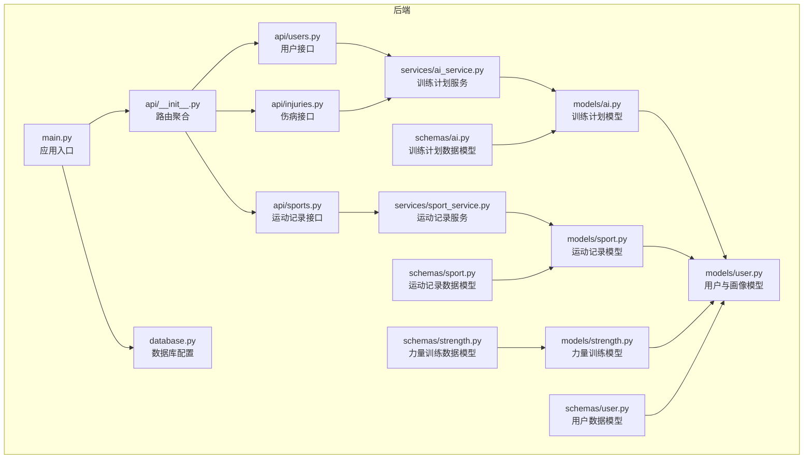
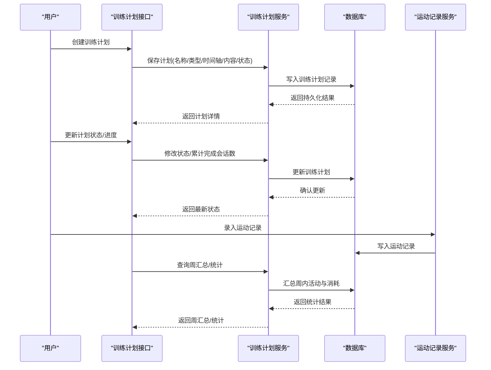
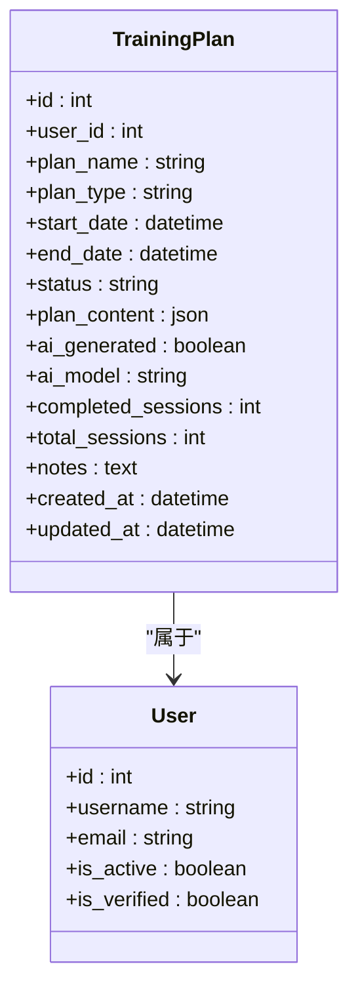
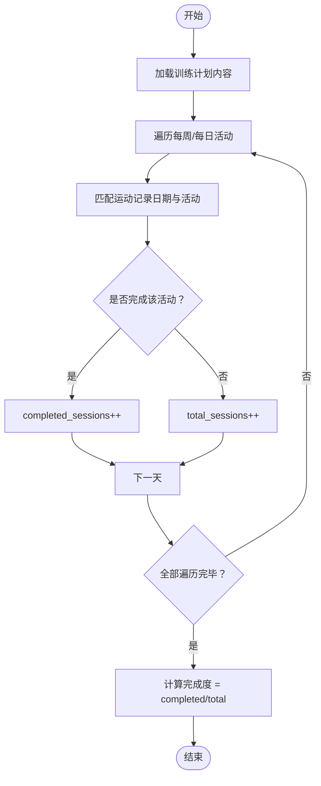
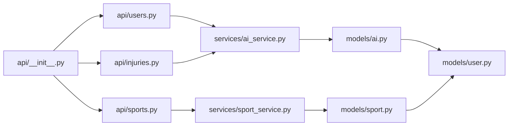

# 训练计划制定与管理

<cite>
**本文引用的文件**
- [README.md](file://README.md)
- [backend/app/models/ai.py](file://backend/app/models/ai.py)
- [backend/app/schemas/ai.py](file://backend/app/schemas/ai.py)
- [backend/app/services/ai_service.py](file://backend/app/services/ai_service.py)
- [backend/app/api/__init__.py](file://backend/app/api/__init__.py)
- [backend/app/models/user.py](file://backend/app/models/user.py)
- [backend/app/schemas/user.py](file://backend/app/schemas/user.py)
- [backend/app/models/sport.py](file://backend/app/models/sport.py)
- [backend/app/schemas/sport.py](file://backend/app/schemas/sport.py)
- [backend/app/api/sports.py](file://backend/app/api/sports.py)
- [backend/app/services/sport_service.py](file://backend/app/services/sport_service.py)
- [backend/app/models/strength.py](file://backend/app/models/strength.py)
- [backend/app/schemas/strength.py](file://backend/app/schemas/strength.py)
- [backend/app/api/users.py](file://backend/app/api/users.py)
- [backend/app/api/injuries.py](file://backend/app/api/injuries.py)
- [backend/app/main.py](file://backend/app/main.py)
- [backend/app/database.py](file://backend/app/database.py)
- [backend/requirements.txt](file://backend/requirements.txt)
</cite>

## 目录
1. [简介](#简介)
2. [项目结构](#项目结构)
3. [核心组件](#核心组件)
4. [架构总览](#架构总览)
5. [详细组件分析](#详细组件分析)
6. [依赖关系分析](#依赖关系分析)
7. [性能考虑](#性能考虑)
8. [故障排查指南](#故障排查指南)
9. [结论](#结论)
10. [附录](#附录)

## 简介
本技术文档围绕 ActiveSynapse 的“训练计划制定与管理”能力展开，结合现有代码库中的训练计划模型、用户画像模型以及运动记录模型，系统阐述训练计划的类型分类、结构化存储、状态管理与生命周期控制，并给出与运动记录的关联、进度跟踪、完成度计算、生成与优化策略、效果评估机制、编辑与重新生成、导出与备份恢复等实践方案。文档同时提供面向非技术读者的可读性说明与面向开发者的实现细节。

## 项目结构
后端采用 FastAPI + SQLAlchemy 异步 ORM 架构，按领域模型分层组织：models 定义数据库表结构与枚举；schemas 定义 Pydantic 数据模型；services 实现业务逻辑；api 提供接口路由；main 与 database 负责应用启动与数据库连接。

图表来源
- [backend/app/api/__init__.py](file://backend/app/api/__init__.py#L1-L10)
- [backend/app/api/sports.py](file://backend/app/api/sports.py#L1-L127)
- [backend/app/models/ai.py](file://backend/app/models/ai.py#L66-L122)
- [backend/app/models/user.py](file://backend/app/models/user.py#L7-L31)
- [backend/app/models/sport.py](file://backend/app/models/sport.py#L23-L49)
- [backend/app/models/strength.py](file://backend/app/models/strength.py#L18-L57)
- [backend/app/services/ai_service.py](file://backend/app/services/ai_service.py)
- [backend/app/services/sport_service.py](file://backend/app/services/sport_service.py#L1-L238)
- [backend/app/database.py](file://backend/app/database.py)
- [backend/app/main.py](file://backend/app/main.py)

章节来源
- [README.md](file://README.md#L1-L3)
- [backend/app/api/__init__.py](file://backend/app/api/__init__.py#L1-L10)

## 核心组件
- 训练计划模型与枚举：定义计划类型（跑步、力量、羽毛球、综合）、状态（激活、完成、暂停、取消），以及计划内容的结构化存储（JSON）。
- 用户与画像模型：承载用户基本信息、运动偏好、目标与周目标等，用于训练计划的个性化定制。
- 运动记录模型：记录用户的运动活动、时长、卡路里消耗、来源（手动/设备）等，支持与训练计划的进度关联。
- 力量训练模型：记录力量训练动作、组数、次数、重量、体积等指标，便于综合训练计划的构建与统计。
- 接口与服务：提供训练计划的增删改查、状态变更、进度统计与周汇总等能力。

章节来源
- [backend/app/models/ai.py](file://backend/app/models/ai.py#L16-L28)
- [backend/app/models/ai.py](file://backend/app/models/ai.py#L66-L122)
- [backend/app/models/user.py](file://backend/app/models/user.py#L34-L61)
- [backend/app/models/sport.py](file://backend/app/models/sport.py#L23-L49)
- [backend/app/models/strength.py](file://backend/app/models/strength.py#L18-L57)

## 架构总览
训练计划模块在后端以“模型-服务-接口”的分层实现，通过用户与运动记录模型建立与训练计划的关联，形成“计划-执行-反馈-优化”的闭环。

图表来源
- [backend/app/models/ai.py](file://backend/app/models/ai.py#L66-L122)
- [backend/app/services/ai_service.py](file://backend/app/services/ai_service.py)
- [backend/app/api/sports.py](file://backend/app/api/sports.py#L105-L113)
- [backend/app/services/sport_service.py](file://backend/app/services/sport_service.py#L195-L237)

## 详细组件分析

### 训练计划模型与状态管理
- 类型与状态枚举：支持 running、strength、badminton、combined 四类计划；状态包括 active、completed、paused、cancelled。
- 结构化内容：plan_content 使用 JSON 存储，包含 weeks 数组，每项包含 week_number 与 days 列表，每天包含 activities 数组，每项描述活动类型、时长、强度等。
- 进度跟踪：completed_sessions 与 total_sessions 字段用于记录完成度；notes 可记录教练建议或备注。
- 生命周期控制：通过状态字段与时间轴(start_date/end_date)共同控制计划的启用、暂停、完成与取消。

图表来源
- [backend/app/models/ai.py](file://backend/app/models/ai.py#L66-L122)
- [backend/app/models/user.py](file://backend/app/models/user.py#L7-L31)

章节来源
- [backend/app/models/ai.py](file://backend/app/models/ai.py#L16-L28)
- [backend/app/models/ai.py](file://backend/app/models/ai.py#L66-L122)

### 训练计划的个性化定制与生成
- 个性化依据：基于用户画像中的 sport_level、sport_goals、preferred_sports、weekly_target 等字段，结合近期运动记录与伤病历史，生成符合用户当前水平与目标的训练计划。
- 生成策略：可采用规则引擎或大模型提示词（prompt）生成计划内容，ai_generated 标记是否由 AI 生成，ai_model 记录所用模型版本。
- 计划内容结构：weeks → days → activities，activities 包含 type、duration、intensity、description 等字段，便于前端渲染与执行追踪。

章节来源
- [backend/app/models/user.py](file://backend/app/models/user.py#L34-L61)
- [backend/app/models/ai.py](file://backend/app/models/ai.py#L83-L102)

### 训练计划与运动记录的关联、进度跟踪与完成度计算
- 关联方式：运动记录中的 user_id 与训练计划的 user_id 关联；运动记录可作为计划执行的证据与统计数据来源。
- 周度与天度组织：运动记录服务提供周汇总接口，按日聚合 running/badminton/other 的时长与总卡路里，便于与计划的周目标对齐。
- 完成度计算：total_sessions 与 completed_sessions 之比即为完成度；也可根据计划中每日活动数量与实际完成数量进行对比。

图表来源
- [backend/app/services/sport_service.py](file://backend/app/services/sport_service.py#L195-L237)
- [backend/app/models/ai.py](file://backend/app/models/ai.py#L108-L111)

章节来源
- [backend/app/services/sport_service.py](file://backend/app/services/sport_service.py#L195-L237)
- [backend/app/models/ai.py](file://backend/app/models/ai.py#L108-L111)

### 训练计划的编辑、修改与重新生成
- 编辑与修改：通过接口更新 plan_name、plan_type、timeframe、status、plan_content、notes 等字段；支持部分字段更新与全量替换。
- 重新生成：当用户调整目标或偏好后，可基于新上下文重新生成计划内容，保留原计划 ID 并更新 plan_content 与进度统计字段。

章节来源
- [backend/app/models/ai.py](file://backend/app/models/ai.py#L72-L113)

### 训练计划的导出、分享与备份恢复
- 导出：将 plan_content 以 JSON 格式导出，包含完整的周度与天度结构，便于跨平台或离线查看。
- 分享：通过 plan_id 或共享链接，将计划内容分享给教练或同伴；可附加 notes 说明。
- 备份与恢复：定期导出训练计划 JSON 文件，结合数据库备份实现完整恢复；恢复时重建 plan_content 结构并回填进度统计。

章节来源
- [backend/app/models/ai.py](file://backend/app/models/ai.py#L83-L102)

### 训练计划的生成算法、优化策略与效果评估
- 生成算法：基于用户画像与历史数据，采用启发式规则或 LLM 提示词生成计划；可引入目标函数（如周目标达成率、疲劳平衡）进行优化。
- 优化策略：动态调整强度分布、活动类型比例与恢复期安排；根据周汇总统计反馈（时长、卡路里、心率等）迭代计划。
- 效果评估：以周汇总与统计指标为评估依据，结合用户反馈与运动表现，持续改进计划质量。

章节来源
- [backend/app/services/sport_service.py](file://backend/app/services/sport_service.py#L127-L193)
- [backend/app/models/ai.py](file://backend/app/models/ai.py#L83-L102)

### 与运动记录的数据同步与趋势分析
- 数据同步：运动记录创建后，训练计划服务可查询周汇总与统计，实现计划执行情况的实时更新。
- 趋势分析：基于最近 N 天的运动记录，分析时长、距离、卡路里与心率趋势，辅助判断计划执行效果与调整方向。

章节来源
- [backend/app/api/sports.py](file://backend/app/api/sports.py#L105-L113)
- [backend/app/services/sport_service.py](file://backend/app/services/sport_service.py#L127-L193)

## 依赖关系分析
- 组件耦合：训练计划服务依赖用户模型与运动记录模型；运动记录服务独立于训练计划，但二者通过 user_id 关联。
- 外部依赖：FastAPI、SQLAlchemy 异步 ORM、数据库驱动；未发现循环依赖。
- 接口聚合：api/__init__.py 将认证、用户、伤病与运动记录接口统一挂载到根路由。

图表来源
- [backend/app/api/__init__.py](file://backend/app/api/__init__.py#L1-L10)
- [backend/app/api/sports.py](file://backend/app/api/sports.py#L1-L127)
- [backend/app/services/sport_service.py](file://backend/app/services/sport_service.py#L1-L238)
- [backend/app/models/ai.py](file://backend/app/models/ai.py#L66-L122)
- [backend/app/models/sport.py](file://backend/app/models/sport.py#L23-L49)
- [backend/app/models/user.py](file://backend/app/models/user.py#L7-L31)

章节来源
- [backend/app/api/__init__.py](file://backend/app/api/__init__.py#L1-L10)
- [backend/app/requirements.txt](file://backend/requirements.txt)

## 性能考虑
- 查询优化：对用户维度的记录查询使用索引字段（user_id、record_date），并限制分页大小与时间范围。
- 统计聚合：周汇总与统计接口按固定时间窗口（如 7 天）查询，避免全量扫描；必要时可引入物化视图或缓存。
- 并发控制：异步数据库会话减少阻塞；批量写入时注意事务边界与 flush 策略。
- 建议：对高频统计接口增加缓存层，对计划内容的解析与序列化进行轻量化处理。

## 故障排查指南
- 权限与归属：确认请求用户与记录 user_id 一致，避免越权访问。
- 参数校验：Pydantic 模型对输入参数进行约束，若报错需检查字段类型与取值范围。
- 状态一致性：更新计划状态时需遵循状态机（active → paused → completed/cancelled），避免非法跳转。
- 数据完整性：删除记录时确保级联删除不会误删关联数据；导出前验证 plan_content 结构完整性。

章节来源
- [backend/app/services/sport_service.py](file://backend/app/services/sport_service.py#L14-L21)
- [backend/app/schemas/sport.py](file://backend/app/schemas/sport.py#L56-L91)

## 结论
ActiveSynapse 的训练计划模块以结构化 JSON 存储为核心，结合用户画像与运动记录，实现了从生成、执行、跟踪到优化的闭环。通过明确的状态管理与周度/天度组织方式，系统能够有效支撑个性化训练计划的落地与演进。后续可在 AI 生成与反馈机制上进一步增强，以实现更智能的训练计划自适应优化。

## 附录
- 训练计划类型与适用场景
  - 跑步：提升心肺耐力与减脂，适合初学者循序渐进与进阶跑者节奏训练。
  - 力量训练：增强肌肉力量与骨密度，适合体能提升与专项力量需求。
  - 羽毛球：提高专项技能与敏捷性，适合羽毛球爱好者与竞技选手。
  - 综合训练：多项目融合，平衡有氧、无氧与柔韧性，适合全面健身目标。
- 训练计划状态管理
  - 激活：计划生效，允许录入运动记录并计入进度。
  - 完成：达到目标或周期结束，标记完成并归档。
  - 暂停：临时停止，不计入进度，待恢复后继续。
  - 取消：终止计划，清理未执行内容与进度。
- 进度跟踪与完成度
  - completed_sessions / total_sessions 作为完成度指标；结合周汇总与统计指标进行趋势分析。