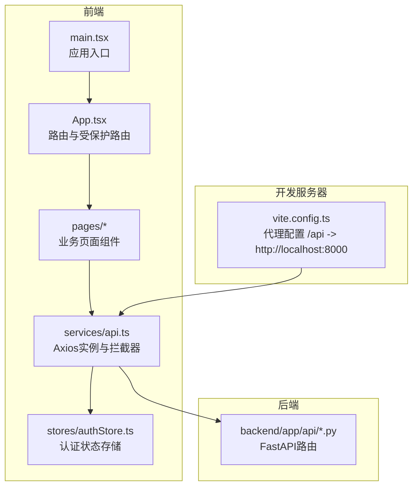
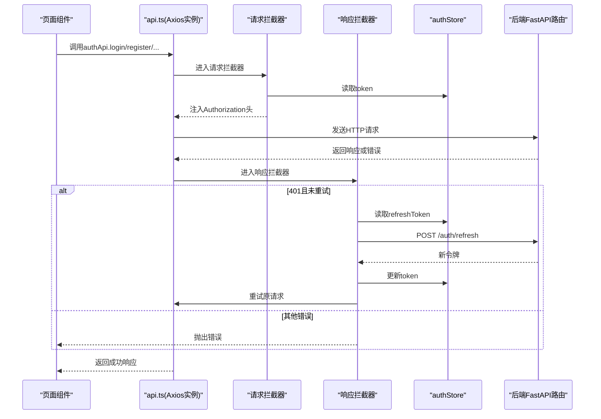
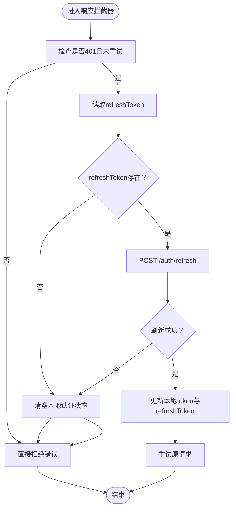
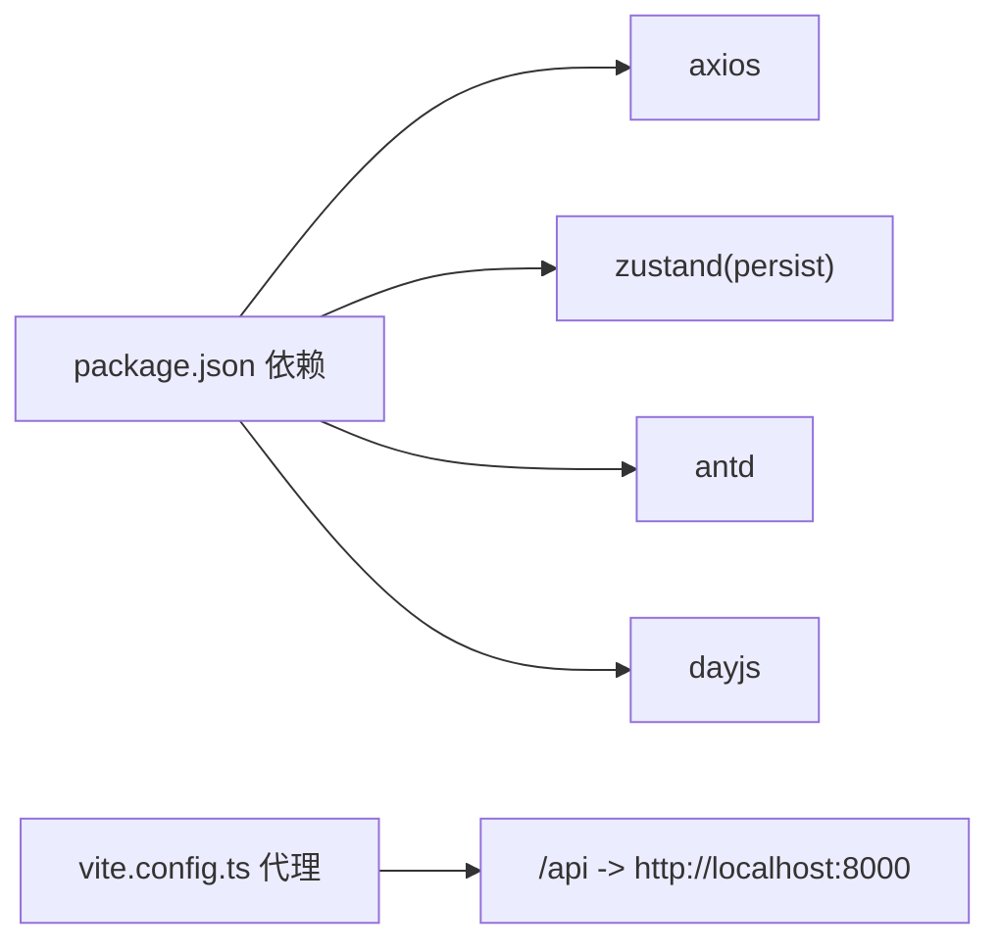

# API服务

<cite>
**本文档引用的文件**
- [web/src/services/api.ts](file://web/src/services/api.ts)
- [web/src/stores/authStore.ts](file://web/src/stores/authStore.ts)
- [web/src/pages/LoginPage.tsx](file://web/src/pages/LoginPage.tsx)
- [web/src/pages/RegisterPage.tsx](file://web/src/pages/RegisterPage.tsx)
- [web/src/pages/DashboardPage.tsx](file://web/src/pages/DashboardPage.tsx)
- [web/src/pages/SportRecordsPage.tsx](file://web/src/pages/SportRecordsPage.tsx)
- [web/src/pages/InjuryRecordsPage.tsx](file://web/src/pages/InjuryRecordsPage.tsx)
- [web/src/App.tsx](file://web/src/App.tsx)
- [web/src/main.tsx](file://web/src/main.tsx)
- [web/vite.config.ts](file://web/vite.config.ts)
- [web/package.json](file://web/package.json)
- [backend/app/api/auth.py](file://backend/app/api/auth.py)
- [backend/app/api/sports.py](file://backend/app/api/sports.py)
- [backend/app/api/injuries.py](file://backend/app/api/injuries.py)
</cite>

## 更新摘要
**所做更改**
- 更新了统一API调用封装的描述，强调了Axios实例的集中管理和拦截器的统一配置
- 完善了错误处理机制的说明，增加了对401未授权错误的详细处理流程
- 增强了状态管理集成部分，详细说明了Zustand与API服务的协作机制
- 补充了性能监控和调试工具的使用方法
- 更新了页面使用示例，展示了完整的API调用流程

## 目录
1. [简介](#简介)
2. [项目结构](#项目结构)
3. [核心组件](#核心组件)
4. [架构总览](#架构总览)
5. [详细组件分析](#详细组件分析)
6. [依赖关系分析](#依赖关系分析)
7. [性能考虑](#性能考虑)
8. [故障排查指南](#故障排查指南)
9. [结论](#结论)
10. [附录](#附录)

## 简介
本文档面向ActiveSynapse前端Web应用的API服务，系统性说明web/src/services/api.ts中的HTTP请求封装、拦截器配置与错误处理机制；梳理RESTful API调用模式、请求参数格式与响应数据结构；解释认证令牌自动添加、请求重试与超时处理策略；并提供API服务的使用示例、错误码说明与异常处理建议。同时，结合后端FastAPI接口定义，明确前后端对接的数据格式与行为边界，并给出性能监控与调试工具的使用方法。

## 项目结构
前端采用Vite + React + TypeScript构建，API服务位于web/src/services/api.ts，状态管理使用Zustand（持久化），路由与页面组件位于web/src/pages与web/src/components目录。开发服务器通过Vite代理将/api前缀转发至后端服务。

**图表来源**
- [web/src/main.tsx:1-15](file://web/src/main.tsx#L1-L15)
- [web/src/App.tsx:1-48](file://web/src/App.tsx#L1-L48)
- [web/src/services/api.ts:1-108](file://web/src/services/api.ts#L1-L108)
- [web/src/stores/authStore.ts:1-52](file://web/src/stores/authStore.ts#L1-L52)
- [web/vite.config.ts:1-23](file://web/vite.config.ts#L1-L23)
- [backend/app/api/auth.py:1-92](file://backend/app/api/auth.py#L1-L92)
- [backend/app/api/sports.py:1-127](file://backend/app/api/sports.py#L1-L127)
- [backend/app/api/injuries.py:1-92](file://backend/app/api/injuries.py#L1-L92)

**章节来源**
- [web/src/main.tsx:1-15](file://web/src/main.tsx#L1-L15)
- [web/src/App.tsx:1-48](file://web/src/App.tsx#L1-L48)
- [web/src/services/api.ts:1-108](file://web/src/services/api.ts#L1-L108)
- [web/src/stores/authStore.ts:1-52](file://web/src/stores/authStore.ts#L1-L52)
- [web/vite.config.ts:1-23](file://web/vite.config.ts#L1-L23)

## 核心组件
- **统一的Axios实例**：集中配置baseURL、Content-Type等基础设置，提供统一的HTTP请求入口
- **请求拦截器**：自动从认证状态中读取访问令牌并附加到Authorization头，实现透明认证
- **响应拦截器**：智能处理401未授权错误，自动触发令牌刷新流程，确保用户体验连续性
- **模块化API导出**：按功能域拆分authApi、userApi、sportApi、injuryApi，便于按需导入与测试
- **状态管理集成**：使用Zustand持久化存储用户信息、访问令牌与刷新令牌，与API服务深度集成

**章节来源**
- [web/src/services/api.ts:1-108](file://web/src/services/api.ts#L1-L108)
- [web/src/stores/authStore.ts:1-52](file://web/src/stores/authStore.ts#L1-L52)

## 架构总览
下图展示从前端页面到API服务、再到后端路由的整体调用链路与拦截器作用点。

**图表来源**
- [web/src/services/api.ts:13-64](file://web/src/services/api.ts#L13-L64)
- [web/src/stores/authStore.ts:1-52](file://web/src/stores/authStore.ts#L1-L52)
- [backend/app/api/auth.py:25-91](file://backend/app/api/auth.py#L25-L91)

## 详细组件分析

### 统一的API调用封装
- **Axios实例配置**
  - baseURL来源于Vite环境变量VITE_API_URL，默认回退到本地后端地址
  - 默认Content-Type为application/json，确保前后端数据格式一致性
  - 集中管理所有HTTP请求的基础配置，便于统一维护和扩展
- **模块化API导出**
  - authApi：处理用户认证相关操作（登录、注册、刷新、登出）
  - userApi：管理用户基本信息和档案
  - sportApi：运动记录的增删改查与统计分析
  - injuryApi：外伤记录的增删改查与统计摘要

**章节来源**
- [web/src/services/api.ts:1-108](file://web/src/services/api.ts#L1-L108)

### 请求拦截器机制
- **认证令牌自动附加**
  - 在发送HTTP请求前自动从authStore读取token
  - 将Bearer令牌附加到Authorization头，实现透明认证
  - 支持动态令牌更新，无需手动处理认证状态
- **请求预处理**
  - 统一设置请求头格式
  - 提供请求前的统一处理逻辑
  - 支持未来扩展（如请求日志、性能监控等）

**章节来源**
- [web/src/services/api.ts:13-25](file://web/src/services/api.ts#L13-L25)
- [web/src/stores/authStore.ts:1-52](file://web/src/stores/authStore.ts#L1-L52)

### 智能响应拦截器与错误处理
- **401未授权自动处理**
  - 检测401错误且未进行过重试时，自动触发刷新流程
  - 从authStore读取refreshToken并发起令牌刷新请求
  - 刷新成功后更新本地状态，注入新令牌并重试原请求
- **失败状态清理**
  - 刷新失败或无refreshToken时，清空本地认证状态
  - 引导用户重新登录，确保系统状态一致性
- **错误传播机制**
  - 未处理的错误通过Promise.reject传播给调用方
  - 保持错误处理的一致性和可预测性

**图表来源**
- [web/src/services/api.ts:27-64](file://web/src/services/api.ts#L27-L64)
- [web/src/stores/authStore.ts:1-52](file://web/src/stores/authStore.ts#L1-L52)

**章节来源**
- [web/src/services/api.ts:27-64](file://web/src/services/api.ts#L27-L64)

### 状态管理集成机制
- **Zustand持久化存储**
  - 用户信息、访问令牌、刷新令牌的持久化管理
  - 自动序列化和反序列化，支持页面刷新后的状态恢复
  - 内置状态更新函数，简化认证状态操作
- **实时状态同步**
  - API调用与状态管理的双向同步
  - 令牌更新时自动反映到所有相关组件
  - 支持用户信息的动态更新

**章节来源**
- [web/src/stores/authStore.ts:1-52](file://web/src/stores/authStore.ts#L1-L52)

### 认证API（authApi）
- **登录功能**：提交邮箱与密码，返回access_token、refresh_token与用户信息
- **注册功能**：提交用户名、邮箱与密码，创建新用户
- **令牌刷新**：使用refresh_token换取新的access_token与refresh_token
- **登出功能**：通知后端登出（客户端负责丢弃令牌）

**章节来源**
- [web/src/services/api.ts:68-80](file://web/src/services/api.ts#L68-L80)
- [backend/app/api/auth.py:17-91](file://backend/app/api/auth.py#L17-L91)

### 用户API（userApi）
- **获取当前用户信息**
- **更新当前用户信息**
- **获取/更新个人档案**

**章节来源**
- [web/src/services/api.ts:82-88](file://web/src/services/api.ts#L82-L88)

### 运动记录API（sportApi）
- **查询记录**：支持分页与过滤（类型、日期范围）
- **创建记录**：提交运动类型、日期、时长、卡路里等字段
- **更新记录**：按ID更新指定字段
- **删除记录**：按ID删除
- **统计数据**：支持按天数统计与运动类型筛选
- **周汇总**：返回本周活动概要

**章节来源**
- [web/src/services/api.ts:90-98](file://web/src/services/api.ts#L90-L98)
- [backend/app/api/sports.py:14-113](file://backend/app/api/sports.py#L14-L113)

### 外伤记录API（injuryApi）
- **查询记录**：支持分页与仅显示进行中
- **创建记录**：提交外伤类型、部位、严重程度、起止日期、是否持续/复发等
- **更新记录**：按ID更新
- **删除记录**：按ID删除
- **统计摘要**：返回外伤统计概要

**章节来源**
- [web/src/services/api.ts:100-107](file://web/src/services/api.ts#L100-L107)
- [backend/app/api/injuries.py:13-91](file://backend/app/api/injuries.py#L13-L91)

### 页面使用示例
- **登录页**：调用authApi.login，成功后写入认证状态并跳转首页
- **注册页**：调用authApi.register，提示注册成功后跳转登录
- **仪表盘**：并发调用运动统计、周汇总与外伤摘要，渲染统计数据卡片
- **运动记录页**：增删改查运动记录，表单提交时将日期转换为ISO字符串
- **外伤记录页**：增删改查外伤记录，表单提交时将日期转换为ISO字符串

**章节来源**
- [web/src/pages/LoginPage.tsx:1-93](file://web/src/pages/LoginPage.tsx#L1-L93)
- [web/src/pages/RegisterPage.tsx:1-127](file://web/src/pages/RegisterPage.tsx#L1-L127)
- [web/src/pages/DashboardPage.tsx:1-118](file://web/src/pages/DashboardPage.tsx#L1-L118)
- [web/src/pages/SportRecordsPage.tsx:1-177](file://web/src/pages/SportRecordsPage.tsx#L1-L177)
- [web/src/pages/InjuryRecordsPage.tsx:1-220](file://web/src/pages/InjuryRecordsPage.tsx#L1-L220)

### 错误码与异常处理策略
- **401未授权**：由响应拦截器触发刷新流程；若刷新失败则登出并拒绝请求
- **404资源不存在**：后端路由对查询不到的记录返回404，前端捕获并提示
- **通用错误**：后端可能返回包含detail字段的错误对象，前端统一读取并提示
- **异常处理建议**：
  - 在页面层捕获错误并使用消息组件提示
  - 对批量请求使用Promise.all组合，统一错误处理与加载状态
  - 对需要鉴权的受保护路由，使用受保护路由组件进行权限校验

**章节来源**
- [web/src/services/api.ts:27-64](file://web/src/services/api.ts#L27-L64)
- [backend/app/api/sports.py:58-60](file://backend/app/api/sports.py#L58-L60)
- [backend/app/api/injuries.py:53-55](file://backend/app/api/injuries.py#L53-L55)
- [web/src/App.tsx:14-18](file://web/src/App.tsx#L14-L18)

### 数据格式与转换
- **请求体**：JSON格式，字段名遵循后端Schema定义
- **时间字段**：前端提交时转换为ISO 8601字符串，后端解析为datetime
- **分页参数**：后端支持skip/limit，前端可直接传入
- **过滤参数**：如运动类型、日期范围、是否仅进行中等，作为查询参数传递

**章节来源**
- [web/src/pages/SportRecordsPage.tsx:59-62](file://web/src/pages/SportRecordsPage.tsx#L59-L62)
- [web/src/pages/InjuryRecordsPage.tsx:62-66](file://web/src/pages/InjuryRecordsPage.tsx#L62-L66)
- [backend/app/api/sports.py:14-34](file://backend/app/api/sports.py#L14-L34)
- [backend/app/api/injuries.py:13-29](file://backend/app/api/injuries.py#L13-L29)

## 依赖关系分析
- **前端依赖**
  - axios：HTTP客户端，提供网络请求能力
  - zustand：状态管理（含持久化），提供全局状态管理
  - antd：UI组件库，提供丰富的界面组件
  - dayjs：时间处理，提供日期时间操作功能
- **开发依赖**
  - vite、react、typescript及相关插件，提供开发环境支持
- **代理与运行**
  - Vite代理将/api前缀转发至后端，便于本地联调

**图表来源**
- [web/package.json:12-36](file://web/package.json#L12-L36)
- [web/vite.config.ts:15-20](file://web/vite.config.ts#L15-L20)

**章节来源**
- [web/package.json:1-37](file://web/package.json#L1-L37)
- [web/vite.config.ts:1-23](file://web/vite.config.ts#L1-L23)

## 性能考虑
- **并发请求优化**：在仪表盘等场景使用Promise.all并发获取多个接口，减少总等待时间
- **批量查询策略**：合理使用分页参数与过滤条件，避免一次性拉取过多数据
- **状态缓存机制**：当前拦截器未内置缓存，可在业务层根据路由与参数做简单缓存
- **超时与重试策略**：当前未显式设置axios超时与全局重试，可在axios.create中增加timeout与自定义重试逻辑（建议仅对幂等GET请求启用）
- **包体优化**：按需引入antd组件，避免全量引入导致包体增大

**章节来源**
- [web/src/pages/DashboardPage.tsx:19-23](file://web/src/pages/DashboardPage.tsx#L19-L23)
- [web/src/services/api.ts:6-11](file://web/src/services/api.ts#L6-L11)

## 故障排查指南
- **无法连接后端**
  - 检查VITE_API_URL环境变量与vite代理配置是否正确
  - 确认后端服务已启动并监听8000端口
- **登录后仍提示未授权**
  - 检查请求拦截器是否正确附加Authorization头
  - 确认刷新流程是否成功更新本地token
- **401频繁出现**
  - 检查refreshToken是否存在与有效
  - 后端是否正确签发了refresh token
- **日期字段错误**
  - 确认前端提交时已转换为ISO字符串
- **调试工具使用**
  - 浏览器Network面板查看请求头与响应状态
  - 控制台打印store状态变化，确认token更新
  - 使用浏览器开发者工具断点定位拦截器执行路径

**章节来源**
- [web/vite.config.ts:13-21](file://web/vite.config.ts#L13-L21)
- [web/src/services/api.ts:13-64](file://web/src/services/api.ts#L13-L64)
- [web/src/stores/authStore.ts:1-52](file://web/src/stores/authStore.ts#L1-L52)
- [web/src/pages/SportRecordsPage.tsx:61-62](file://web/src/pages/SportRecordsPage.tsx#L61-L62)
- [web/src/pages/InjuryRecordsPage.tsx:65-66](file://web/src/pages/InjuryRecordsPage.tsx#L65-L66)

## 结论
本API服务通过统一的Axios实例与拦截器实现了标准化的认证、刷新与错误处理机制，配合模块化的API导出与Zustand状态管理，为前端页面提供了清晰、一致的后端交互能力。系统在设计上注重可维护性和扩展性，通过拦截器机制实现了横切关注点的统一处理。结合后端FastAPI接口定义，前后端在数据格式与行为上保持高度一致。建议后续增强超时与重试策略、引入请求去重与缓存，并完善错误日志上报以提升稳定性与可观测性。

## 附录

### RESTful API调用模式与参数
- **认证**
  - POST /auth/login：{ email, password }
  - POST /auth/register：{ username, email, password }
  - POST /auth/refresh：{ refresh_token }
  - POST /auth/logout：无
- **用户**
  - GET /users/me：无
  - PUT /users/me：{ ... }
  - GET /users/me/profile：无
  - PUT /users/me/profile：{ ... }
- **运动记录**
  - GET /sports/records?skip&limit&sport_type&start_date&end_date：无
  - POST /sports/records：{ sport_type, record_date, duration_minutes, calories_burned, notes, source }
  - GET /sports/records/{id}：无
  - PUT /sports/records/{id}：{ ... }
  - DELETE /sports/records/{id}：无
  - GET /sports/statistics?days：无
  - GET /sports/weekly-summary：无
- **外伤记录**
  - GET /injuries/?ongoing_only：无
  - POST /injuries/：{ injury_type, body_part, severity, start_date, end_date, is_ongoing, is_recurring, description, treatment }
  - GET /injuries/{id}：无
  - PUT /injuries/{id}：{ ... }
  - DELETE /injuries/{id}：无
  - GET /injuries/summary/statistics：无

**章节来源**
- [backend/app/api/auth.py:17-91](file://backend/app/api/auth.py#L17-L91)
- [backend/app/api/sports.py:14-113](file://backend/app/api/sports.py#L14-L113)
- [backend/app/api/injuries.py:13-91](file://backend/app/api/injuries.py#L13-L91)