# 主布局组件

<cite>
**本文档引用的文件**
- [MainLayout.tsx](file://web/src/components/MainLayout.tsx)
- [App.tsx](file://web/src/App.tsx)
- [main.tsx](file://web/src/main.tsx)
- [authStore.ts](file://web/src/stores/authStore.ts)
- [api.ts](file://web/src/services/api.ts)
- [DashboardPage.tsx](file://web/src/pages/DashboardPage.tsx)
- [ProfilePage.tsx](file://web/src/pages/ProfilePage.tsx)
- [LoginPage.tsx](file://web/src/pages/LoginPage.tsx)
- [index.css](file://web/src/index.css)
- [vite.config.ts](file://web/vite.config.ts)
- [package.json](file://web/package.json)
</cite>

## 目录
1. [简介](#简介)
2. [项目结构](#项目结构)
3. [核心组件](#核心组件)
4. [架构概览](#架构概览)
5. [详细组件分析](#详细组件分析)
6. [依赖关系分析](#依赖关系分析)
7. [性能考虑](#性能考虑)
8. [故障排除指南](#故障排除指南)
9. [结论](#结论)
10. [附录](#附录)

## 简介

ActiveSynapse是一个个人运动智能教练系统，主布局组件MainLayout是整个Web应用的核心界面框架。该组件实现了响应式布局设计，集成了Ant Design组件库，提供了完整的导航栏、侧边栏和内容区域管理功能。组件支持用户认证状态管理、路由集成、主题切换和国际化支持，并通过Zustand状态管理库实现了高效的全局状态控制。

## 项目结构

ActiveSynapse Web应用采用模块化架构设计，主要文件组织如下：

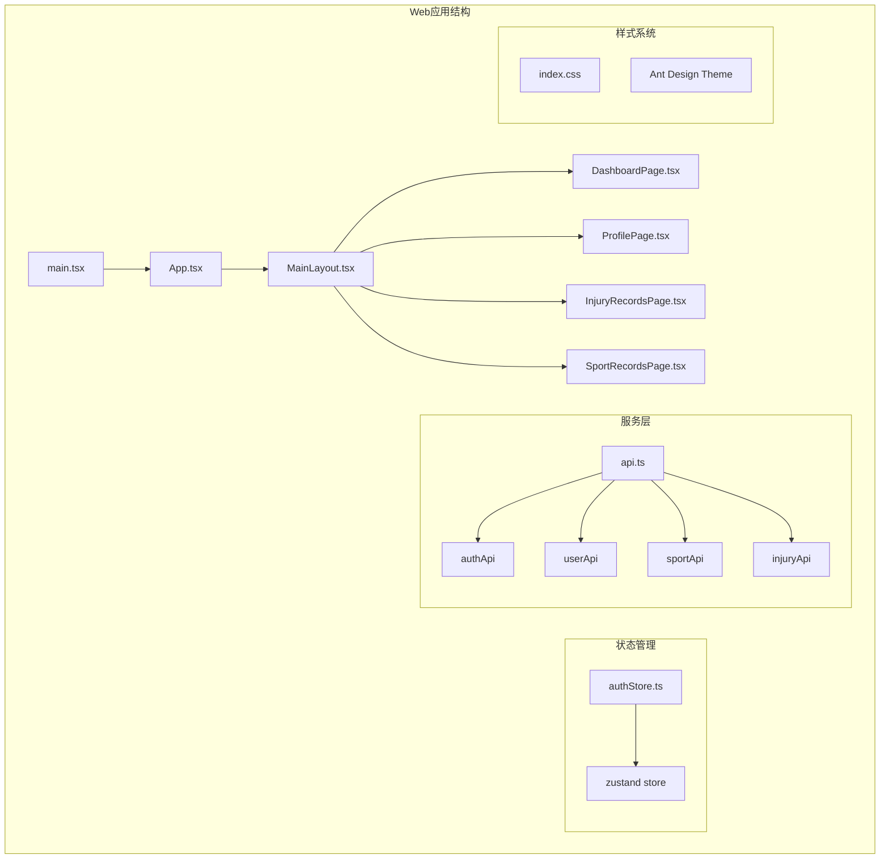
```mermaid
graph TB
subgraph "Web应用结构"
A[main.tsx] --> B[App.tsx]
B --> C[MainLayout.tsx]
C --> D[DashboardPage.tsx]
C --> E[ProfilePage.tsx]
C --> F[InjuryRecordsPage.tsx]
C --> G[SportRecordsPage.tsx]
subgraph "状态管理"
H[authStore.ts]
I[zustand store]
end
subgraph "服务层"
J[api.ts]
K[authApi]
L[userApi]
M[sportApi]
N[injuryApi]
end
subgraph "样式系统"
O[index.css]
P[Ant Design Theme]
end
H --> I
J --> K
J --> L
J --> M
J --> N
end
```

**图表来源**
- [main.tsx](file://web/src/main.tsx#L1-L15)
- [App.tsx](file://web/src/App.tsx#L1-L48)
- [MainLayout.tsx](file://web/src/components/MainLayout.tsx#L1-L121)

**章节来源**
- [package.json](file://web/package.json#L1-L37)
- [vite.config.ts](file://web/vite.config.ts#L1-L23)

## 核心组件

### MainLayout组件概述

MainLayout组件是ActiveSynapse应用的主界面容器，基于Ant Design的Layout组件系统构建。该组件实现了以下核心功能：

- **响应式布局**：支持桌面端和移动端的自适应显示
- **导航管理**：集成菜单导航和用户下拉菜单
- **状态管理**：使用Zustand进行全局状态控制
- **路由集成**：与React Router无缝集成
- **主题支持**：利用Ant Design的主题系统

### 组件Props接口

MainLayout组件本身不接受任何外部props，但通过React Router和Zustand状态管理器实现数据传递：

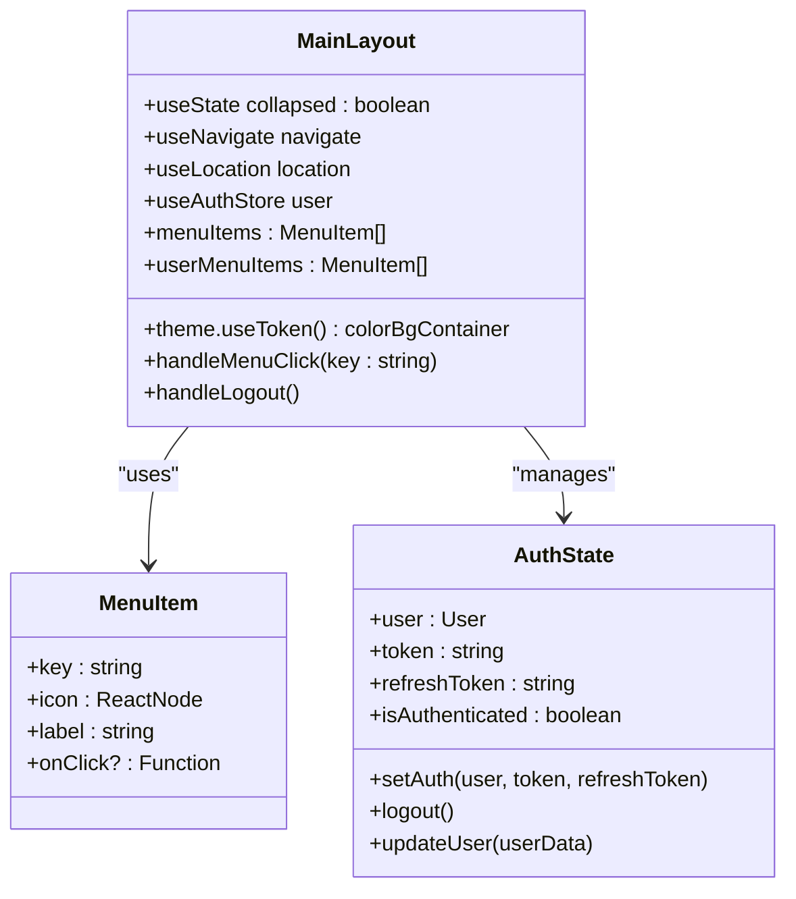
```mermaid
classDiagram
class MainLayout {
+useState collapsed : boolean
+useNavigate navigate
+useLocation location
+useAuthStore user
+theme.useToken() colorBgContainer
+menuItems : MenuItem[]
+handleMenuClick(key : string)
+handleLogout()
+userMenuItems : MenuItem[]
}
class MenuItem {
+key : string
+icon : ReactNode
+label : string
+onClick? : Function
}
class AuthState {
+user : User
+token : string
+refreshToken : string
+isAuthenticated : boolean
+setAuth(user, token, refreshToken)
+logout()
+updateUser(userData)
}
MainLayout --> MenuItem : "uses"
MainLayout --> AuthState : "manages"
```

**图表来源**
- [MainLayout.tsx](file://web/src/components/MainLayout.tsx#L17-L118)
- [authStore.ts](file://web/src/stores/authStore.ts#L11-L46)

**章节来源**
- [MainLayout.tsx](file://web/src/components/MainLayout.tsx#L17-L118)
- [authStore.ts](file://web/src/stores/authStore.ts#L1-L52)

## 架构概览

### 整体架构设计

ActiveSynapse采用分层架构模式，各层职责明确：

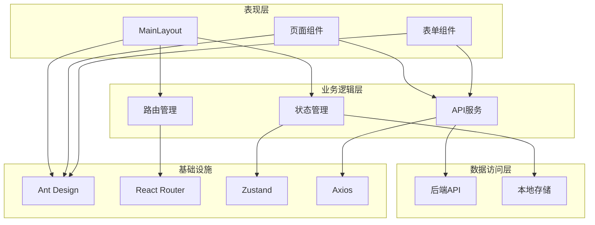
```mermaid
graph TD
subgraph "表现层"
A[MainLayout]
B[页面组件]
C[表单组件]
end
subgraph "业务逻辑层"
D[路由管理]
E[状态管理]
F[API服务]
end
subgraph "数据访问层"
G[后端API]
H[本地存储]
end
subgraph "基础设施"
I[Ant Design]
J[React Router]
K[Zustand]
L[Axios]
end
A --> D
A --> E
B --> F
C --> F
D --> J
E --> K
F --> L
F --> G
E --> H
A --> I
B --> I
C --> I
```

**图表来源**
- [App.tsx](file://web/src/App.tsx#L14-L45)
- [authStore.ts](file://web/src/stores/authStore.ts#L21-L51)
- [api.ts](file://web/src/services/api.ts#L1-L108)

### 路由集成架构

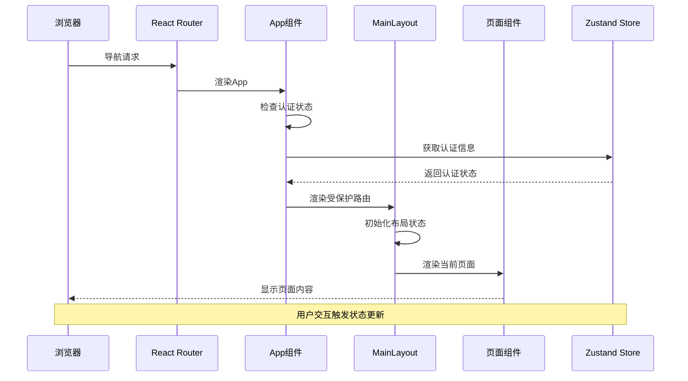
```mermaid
sequenceDiagram
participant Browser as 浏览器
participant Router as React Router
participant App as App组件
participant Layout as MainLayout
participant Page as 页面组件
participant Store as Zustand Store
Browser->>Router : 导航请求
Router->>App : 渲染App
App->>App : 检查认证状态
App->>Store : 获取认证信息
Store-->>App : 返回认证状态
App->>Layout : 渲染受保护路由
Layout->>Layout : 初始化布局状态
Layout->>Page : 渲染当前页面
Page-->>Browser : 显示页面内容
Note over Browser,Store : 用户交互触发状态更新
```

**图表来源**
- [App.tsx](file://web/src/App.tsx#L14-L45)
- [MainLayout.tsx](file://web/src/components/MainLayout.tsx#L17-L118)

**章节来源**
- [App.tsx](file://web/src/App.tsx#L14-L45)
- [main.tsx](file://web/src/main.tsx#L8-L14)

## 详细组件分析

### 导航栏实现

MainLayout组件的导航栏实现了完整的用户交互功能：

#### 用户头像下拉菜单

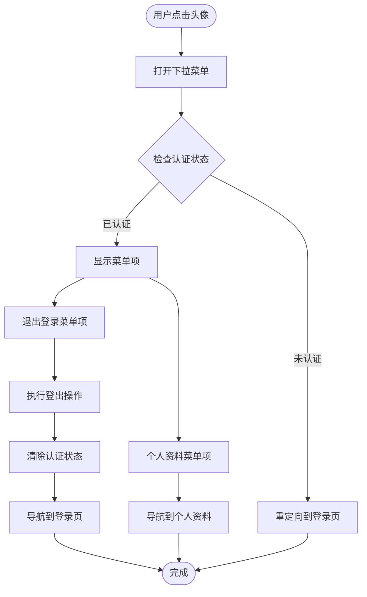
```mermaid
flowchart TD
Start([用户点击头像]) --> DropdownOpen["打开下拉菜单"]
DropdownOpen --> CheckAuth{"检查认证状态"}
CheckAuth --> |已认证| ShowMenu["显示菜单项"]
CheckAuth --> |未认证| RedirectLogin["重定向到登录页"]
ShowMenu --> ProfileItem["个人资料菜单项"]
ShowMenu --> LogoutItem["退出登录菜单项"]
ProfileItem --> NavigateProfile["导航到个人资料"]
LogoutItem --> HandleLogout["执行登出操作"]
HandleLogout --> ClearStore["清除认证状态"]
ClearStore --> NavigateLogin["导航到登录页"]
NavigateLogin --> End([完成])
NavigateProfile --> End
RedirectLogin --> End
```

**图表来源**
- [MainLayout.tsx](file://web/src/components/MainLayout.tsx#L58-L71)
- [authStore.ts](file://web/src/stores/authStore.ts#L36-L41)

#### 菜单导航系统

侧边栏菜单支持多级导航和状态同步：

| 菜单项 | 路径 | 图标 | 功能描述 |
|--------|------|------|----------|
| Dashboard | `/` | DashboardOutlined | 仪表板主页 |
| Sports Records | `/sports` | TrophyOutlined | 运动记录管理 |
| Injury Records | `/injuries` | MedicineBoxOutlined | 受伤记录管理 |
| Profile | `/profile` | UserOutlined | 用户个人资料 |

**章节来源**
- [MainLayout.tsx](file://web/src/components/MainLayout.tsx#L26-L47)
- [MainLayout.tsx](file://web/src/components/MainLayout.tsx#L49-L51)

### 侧边栏布局设计

侧边栏采用可折叠设计，支持响应式显示：

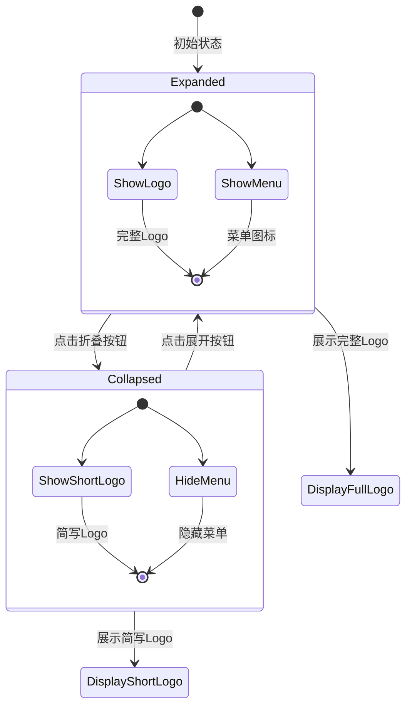
```mermaid
stateDiagram-v2
[*] --> Expanded : 初始状态
Expanded --> Collapsed : 点击折叠按钮
Collapsed --> Expanded : 点击展开按钮
Expanded --> DisplayFullLogo : 展示完整Logo
Collapsed --> DisplayShortLogo : 展示简写Logo
state Expanded {
[*] --> ShowLogo
[*] --> ShowMenu
ShowLogo --> [*] : 完整Logo
ShowMenu --> [*] : 菜单图标
}
state Collapsed {
[*] --> ShowShortLogo
[*] --> HideMenu
ShowShortLogo --> [*] : 简写Logo
HideMenu --> [*] : 隐藏菜单
}
```

**图表来源**
- [MainLayout.tsx](file://web/src/components/MainLayout.tsx#L75-L86)
- [MainLayout.tsx](file://web/src/components/MainLayout.tsx#L76-L78)

### 内容区域管理

内容区域采用Ant Design的Card组件风格，支持动态内容加载：

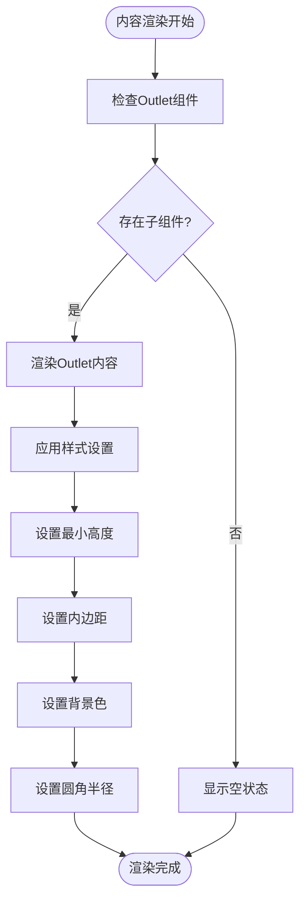
```mermaid
flowchart TD
ContentStart([内容渲染开始]) --> CheckOutlet["检查Outlet组件"]
CheckOutlet --> HasOutlet{"存在子组件?"}
HasOutlet --> |是| RenderOutlet["渲染Outlet内容"]
HasOutlet --> |否| ShowEmpty["显示空状态"]
RenderOutlet --> ApplyStyles["应用样式设置"]
ApplyStyles --> SetMinHeight["设置最小高度"]
SetMinHeight --> SetPadding["设置内边距"]
SetPadding --> SetBackground["设置背景色"]
SetBackground --> BorderRadius["设置圆角半径"]
BorderRadius --> Complete([渲染完成])
ShowEmpty --> Complete
```

**图表来源**
- [MainLayout.tsx](file://web/src/components/MainLayout.tsx#L104-L115)

**章节来源**
- [MainLayout.tsx](file://web/src/components/MainLayout.tsx#L104-L115)

### 状态管理机制

#### 认证状态管理

使用Zustand实现全局状态管理，支持持久化存储：

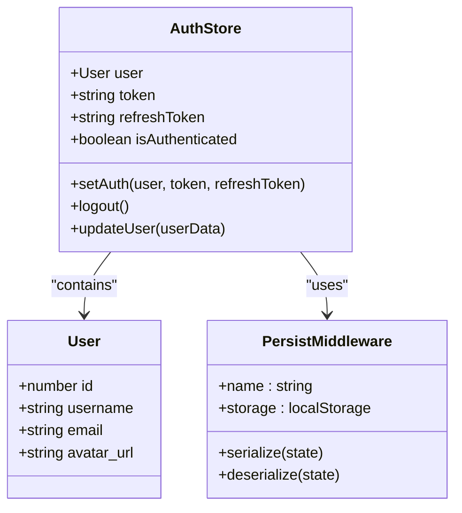
```mermaid
classDiagram
class AuthStore {
+User user
+string token
+string refreshToken
+boolean isAuthenticated
+setAuth(user, token, refreshToken)
+logout()
+updateUser(userData)
}
class User {
+number id
+string username
+string email
+string avatar_url
}
class PersistMiddleware {
+name : string
+storage : localStorage
+serialize(state)
+deserialize(state)
}
AuthStore --> User : "contains"
AuthStore --> PersistMiddleware : "uses"
```

**图表来源**
- [authStore.ts](file://web/src/stores/authStore.ts#L21-L51)

#### API拦截器设计

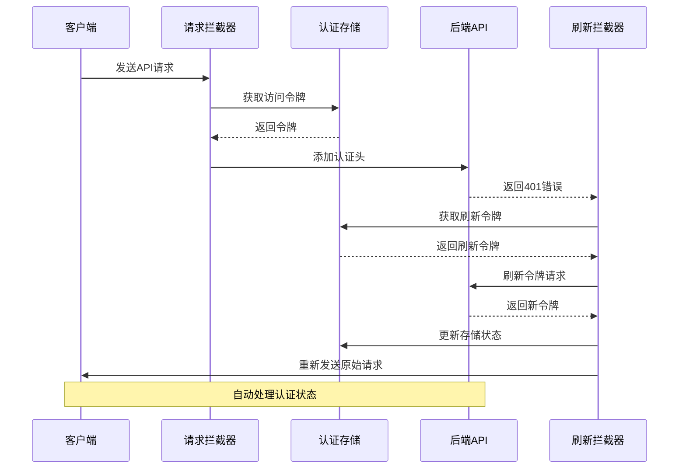
```mermaid
sequenceDiagram
participant Client as 客户端
participant Interceptor as 请求拦截器
participant AuthStore as 认证存储
participant Backend as 后端API
participant Refresh as 刷新拦截器
Client->>Interceptor : 发送API请求
Interceptor->>AuthStore : 获取访问令牌
AuthStore-->>Interceptor : 返回令牌
Interceptor->>Backend : 添加认证头
Backend-->>Refresh : 返回401错误
Refresh->>AuthStore : 获取刷新令牌
AuthStore-->>Refresh : 返回刷新令牌
Refresh->>Backend : 刷新令牌请求
Backend-->>Refresh : 返回新令牌
Refresh->>AuthStore : 更新存储状态
Refresh->>Client : 重新发送原始请求
Note over Client,Backend : 自动处理认证状态
```

**图表来源**
- [api.ts](file://web/src/services/api.ts#L13-L64)

**章节来源**
- [authStore.ts](file://web/src/stores/authStore.ts#L21-L51)
- [api.ts](file://web/src/services/api.ts#L13-L64)

### 响应式设计实现

#### 断点配置

组件采用Ant Design的响应式断点系统：

| 断点 | 设备类型 | 屏幕宽度 | 表现行为 |
|------|----------|----------|----------|
| xs | 移动设备 | < 576px | 单列布局，紧凑间距 |
| sm | 小型设备 | ≥ 576px | 双列布局，中等间距 |
| lg | 大型设备 | ≥ 992px | 四列布局，宽松间距 |

#### 样式定制

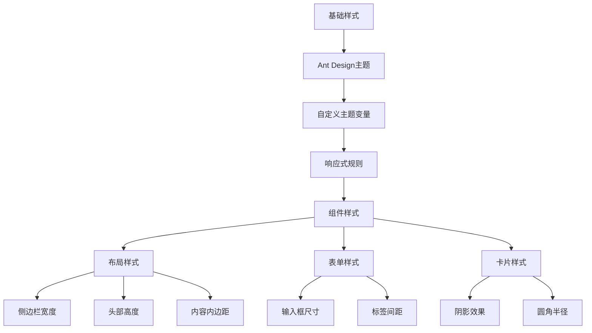
```mermaid
flowchart TD
BaseCSS[基础样式] --> AntDTheme[Ant Design主题]
AntDTheme --> CustomTheme[自定义主题变量]
CustomTheme --> ResponsiveRules[响应式规则]
ResponsiveRules --> ComponentStyles[组件样式]
ComponentStyles --> LayoutStyles[布局样式]
ComponentStyles --> FormStyles[表单样式]
ComponentStyles --> CardStyles[卡片样式]
LayoutStyles --> SidebarWidth[侧边栏宽度]
LayoutStyles --> HeaderHeight[头部高度]
LayoutStyles --> ContentPadding[内容内边距]
FormStyles --> InputSizes[输入框尺寸]
FormStyles --> LabelSpacing[标签间距]
CardStyles --> ShadowEffects[阴影效果]
CardStyles --> BorderRadius[圆角半径]
```

**图表来源**
- [index.css](file://web/src/index.css#L1-L36)
- [MainLayout.tsx](file://web/src/components/MainLayout.tsx#L22-L24)

**章节来源**
- [index.css](file://web/src/index.css#L1-L36)

### 国际化支持

#### 语言配置

应用默认使用简体中文界面：

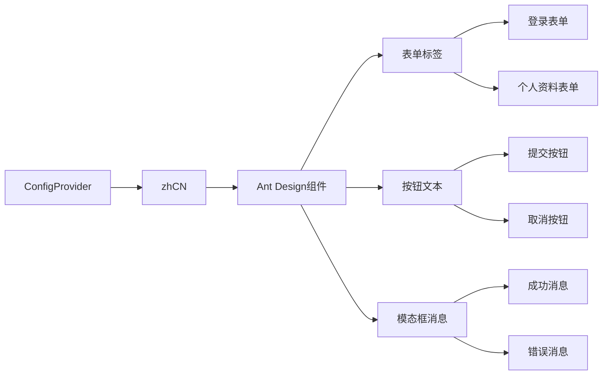
```mermaid
graph LR
ConfigProvider[ConfigProvider] --> Locale[zhCN]
Locale --> AntDComponents[Ant Design组件]
AntDComponents --> FormLabels[表单标签]
AntDComponents --> ButtonText[按钮文本]
AntDComponents --> ModalMessages[模态框消息]
FormLabels --> LoginForm[登录表单]
FormLabels --> ProfileForm[个人资料表单]
ButtonText --> SubmitButton[提交按钮]
ButtonText --> CancelButton[取消按钮]
ModalMessages --> SuccessMessage[成功消息]
ModalMessages --> ErrorMessage[错误消息]
```

**图表来源**
- [main.tsx](file://web/src/main.tsx#L8-L14)

#### 多语言扩展

虽然当前版本仅支持中文，但架构已为国际化扩展预留了接口：

| 功能模块 | 当前状态 | 扩展方案 |
|----------|----------|----------|
| 菜单文本 | 已本地化 | i18n库集成 |
| 表单验证 | 已本地化 | 验证规则本地化 |
| 错误消息 | 已本地化 | 消息模板本地化 |
| 日期格式 | 已本地化 | 日期库本地化 |

**章节来源**
- [main.tsx](file://web/src/main.tsx#L8-L14)

### 主题切换机制

#### Ant Design主题系统

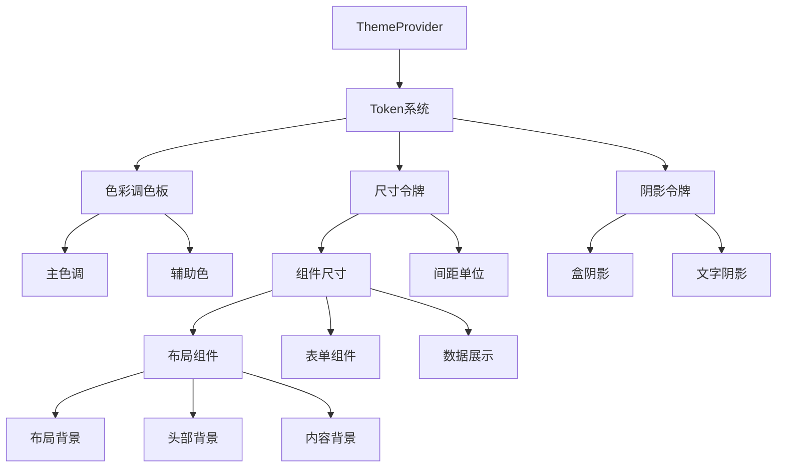
```mermaid
flowchart TD
ThemeProvider[ThemeProvider] --> TokenSystem[Token系统]
TokenSystem --> ColorPalette[色彩调色板]
TokenSystem --> SizeTokens[尺寸令牌]
TokenSystem --> ShadowTokens[阴影令牌]
ColorPalette --> PrimaryColor[主色调]
ColorPalette --> SecondaryColors[辅助色]
SizeTokens --> ComponentSizes[组件尺寸]
SizeTokens --> SpacingUnits[间距单位]
ShadowTokens --> BoxShadows[盒阴影]
ShadowTokens --> TextShadows[文字阴影]
ComponentSizes --> LayoutComponents[布局组件]
ComponentSizes --> FormComponents[表单组件]
ComponentSizes --> DataDisplay[数据展示]
LayoutComponents --> LayoutBackground[布局背景]
LayoutComponents --> HeaderBackground[头部背景]
LayoutComponents --> ContentBackground[内容背景]
```

**图表来源**
- [MainLayout.tsx](file://web/src/components/MainLayout.tsx#L22-L24)

**章节来源**
- [MainLayout.tsx](file://web/src/components/MainLayout.tsx#L22-L24)

## 依赖关系分析

### 外部依赖关系

```mermaid
graph TB
subgraph "核心依赖"
A[react ^18.2.0]
B[react-dom ^18.2.0]
C[react-router-dom ^6.21.0]
D[antd ^5.12.0]
E[@ant-design/icons ^5.2.0]
end
subgraph "状态管理"
F[zustand ^4.4.0]
G[persist middleware]
end
subgraph "网络请求"
H[axios ^1.6.0]
end
subgraph "开发工具"
I[typescript ^5.2.2]
J[vite ^5.0.8]
K[dayjs ^1.11.10]
end
subgraph "可视化"
L[echarts ^5.4.0]
M[echarts-for-react ^3.0.0]
end
A --> C
A --> D
C --> D
D --> E
F --> G
H --> A
L --> M
```

**图表来源**
- [package.json](file://web/package.json#L12-L23)

### 内部模块依赖

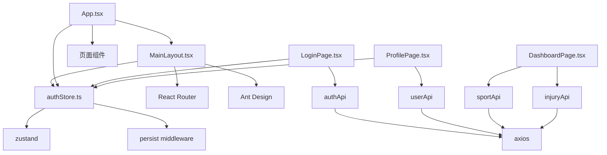
```mermaid
graph TD
MainLayout[MainLayout.tsx] --> AuthStore[authStore.ts]
MainLayout --> Router[React Router]
MainLayout --> AntD[Ant Design]
App[App.tsx] --> MainLayout
App --> AuthStore
App --> Pages[页面组件]
LoginPage[LoginPage.tsx] --> AuthStore
LoginPage --> AuthApi[authApi]
DashboardPage[DashboardPage.tsx] --> SportApi[sportApi]
DashboardPage --> InjuryApi[injuryApi]
ProfilePage[ProfilePage.tsx] --> UserApi[userApi]
ProfilePage --> AuthStore
AuthStore --> Zustand[zustand]
AuthStore --> Persist[persist middleware]
AuthApi --> Axios[axios]
UserApi --> Axios
SportApi --> Axios
InjuryApi --> Axios
```

**图表来源**
- [MainLayout.tsx](file://web/src/components/MainLayout.tsx#L1-L13)
- [App.tsx](file://web/src/App.tsx#L1-L10)
- [authStore.ts](file://web/src/stores/authStore.ts#L1-L2)

**章节来源**
- [package.json](file://web/package.json#L12-L23)

## 性能考虑

### 渲染优化策略

#### React.memo优化

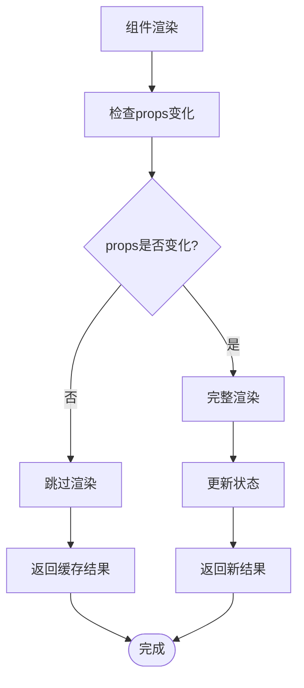
```mermaid
flowchart TD
ComponentRender[组件渲染] --> CheckProps[检查props变化]
CheckProps --> PropsChanged{"props是否变化?"}
PropsChanged --> |否| SkipRender[跳过渲染]
PropsChanged --> |是| FullRender[完整渲染]
SkipRender --> ReturnCached[返回缓存结果]
FullRender --> UpdateState[更新状态]
UpdateState --> ReturnResult[返回新结果]
ReturnCached --> End([完成])
ReturnResult --> End
```

#### 状态分离优化

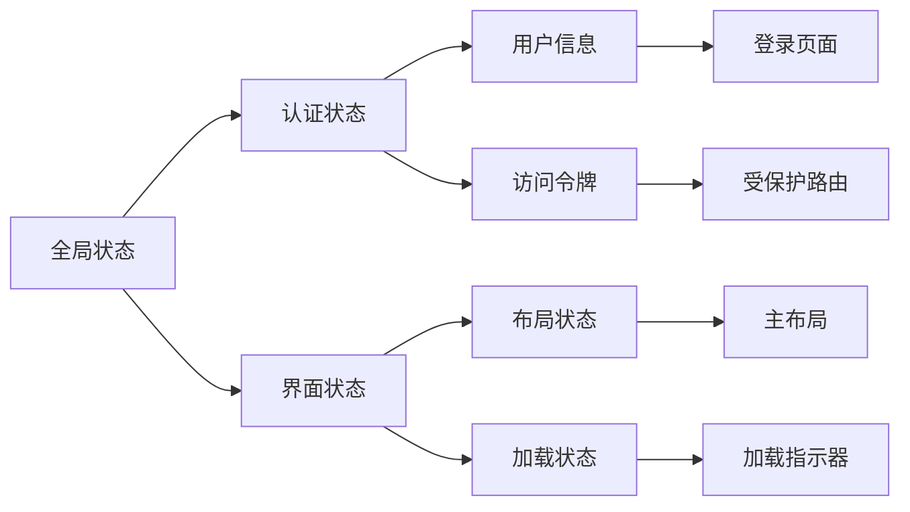
```mermaid
graph LR
GlobalState[全局状态] --> AuthState[认证状态]
GlobalState --> UIState[界面状态]
AuthState --> UserStore[用户信息]
AuthState --> TokenStore[访问令牌]
UIState --> LayoutState[布局状态]
UIState --> LoadingState[加载状态]
UserStore --> LoginPage[登录页面]
TokenStore --> ProtectedRoutes[受保护路由]
LayoutState --> MainLayout[主布局]
LoadingState --> LoadingSpinner[加载指示器]
```

### 加载性能优化

#### 懒加载实现

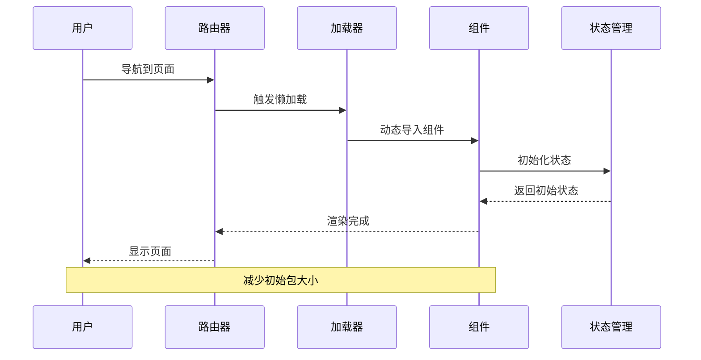
```mermaid
sequenceDiagram
participant User as 用户
participant Router as 路由器
participant Loader as 加载器
participant Component as 组件
participant Store as 状态管理
User->>Router : 导航到页面
Router->>Loader : 触发懒加载
Loader->>Component : 动态导入组件
Component->>Store : 初始化状态
Store-->>Component : 返回初始状态
Component-->>Router : 渲染完成
Router-->>User : 显示页面
Note over User,Component : 减少初始包大小
```

### 缓存策略

#### API缓存机制

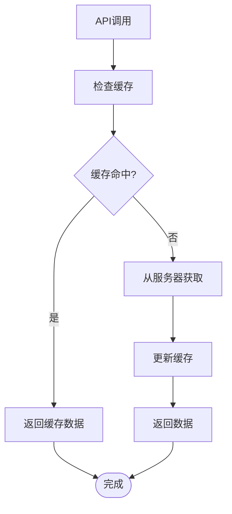
```mermaid
flowchart TD
APICall[API调用] --> CheckCache[检查缓存]
CheckCache --> CacheHit{"缓存命中?"}
CacheHit --> |是| ReturnCache[返回缓存数据]
CacheHit --> |否| FetchData[从服务器获取]
FetchData --> UpdateCache[更新缓存]
UpdateCache --> ReturnData[返回数据]
ReturnCache --> End([完成])
ReturnData --> End
```

**章节来源**
- [MainLayout.tsx](file://web/src/components/MainLayout.tsx#L17-L21)
- [authStore.ts](file://web/src/stores/authStore.ts#L21-L51)

## 故障排除指南

### 常见问题诊断

#### 认证相关问题

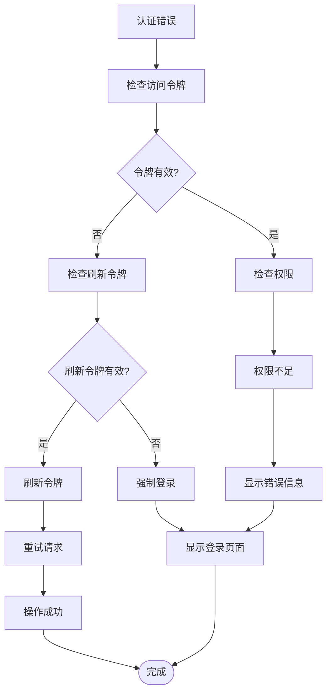
```mermaid
flowchart TD
AuthError[认证错误] --> CheckToken[检查访问令牌]
CheckToken --> TokenValid{"令牌有效?"}
TokenValid --> |否| CheckRefresh[检查刷新令牌]
TokenValid --> |是| CheckPermissions[检查权限]
CheckRefresh --> RefreshValid{"刷新令牌有效?"}
RefreshValid --> |否| ForceLogin[强制登录]
RefreshValid --> |是| RefreshToken[刷新令牌]
RefreshToken --> RetryRequest[重试请求]
RetryRequest --> Success[操作成功]
CheckPermissions --> PermissionError[权限不足]
PermissionError --> ShowError[显示错误信息]
ForceLogin --> ShowLogin[显示登录页面]
ShowError --> ShowLogin
Success --> End([完成])
ShowLogin --> End
```

#### 路由导航问题

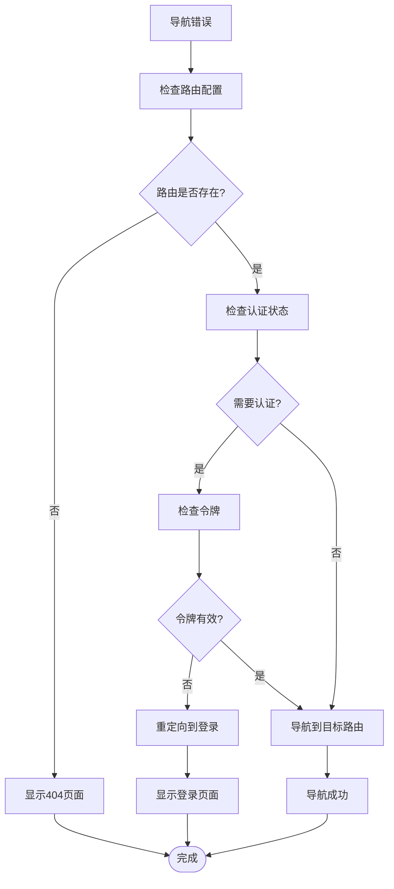
```mermaid
flowchart TD
NavError[导航错误] --> CheckRoute[检查路由配置]
CheckRoute --> RouteExists{"路由是否存在?"}
RouteExists --> |否| Show404[显示404页面]
RouteExists --> |是| CheckAuth[检查认证状态]
CheckAuth --> AuthRequired{"需要认证?"}
AuthRequired --> |是| CheckToken[检查令牌]
AuthRequired --> |否| NavigateRoute[导航到目标路由]
CheckToken --> TokenValid{"令牌有效?"}
TokenValid --> |否| RedirectLogin[重定向到登录]
TokenValid --> |是| NavigateRoute
NavigateRoute --> Success[导航成功]
RedirectLogin --> ShowLogin[显示登录页面]
Show404 --> End([完成])
ShowLogin --> End
Success --> End
```

### 调试技巧

#### 开发者工具使用

1. **React DevTools**: 检查组件树和状态变化
2. **Redux DevTools**: 监控Zustand状态更新
3. **Network面板**: 分析API请求和响应
4. **Console面板**: 查看错误日志和警告信息

#### 性能监控

```mermaid
graph TD
Performance[性能监控] --> Memory[内存使用]
Performance --> CPU[CPU使用率]
Performance --> Network[网络请求]
Performance --> Rendering[渲染性能]
Memory --> HeapSnapshot[堆快照]
CPU --> Profiler[性能分析器]
Network --> RequestLog[请求日志]
Rendering --> FPSCounter[帧率计数器]
HeapSnapshot --> MemoryLeaks[内存泄漏检测]
Profiler --> Bottlenecks[性能瓶颈识别]
RequestLog --> APIErrors[API错误追踪]
FPSCounter --> UIResponsiveness[UI响应性]
```

**章节来源**
- [api.ts](file://web/src/services/api.ts#L28-L64)
- [authStore.ts](file://web/src/stores/authStore.ts#L36-L41)

## 结论

ActiveSynapse的主布局组件MainLayout展现了现代React应用的最佳实践，通过以下关键特性实现了高质量的用户体验：

### 核心优势

1. **模块化设计**: 清晰的组件分离和职责划分
2. **状态管理**: 基于Zustand的高效全局状态管理
3. **响应式布局**: 适配多种设备和屏幕尺寸
4. **主题系统**: 基于Ant Design的统一设计语言
5. **国际化支持**: 为多语言扩展预留接口
6. **性能优化**: 包含多种性能优化策略

### 技术亮点

- **TypeScript集成**: 提供完整的类型安全保证
- **Ant Design生态**: 利用成熟的UI组件库
- **React Router集成**: 实现完整的路由管理
- **Axios封装**: 提供统一的API访问层
- **Zustand状态管理**: 简化的状态管理模式

### 改进建议

1. **代码分割**: 实现更细粒度的懒加载
2. **缓存策略**: 增强API缓存和离线支持
3. **测试覆盖**: 添加单元测试和集成测试
4. **文档完善**: 增加组件API文档和使用示例
5. **国际化扩展**: 实现多语言支持

## 附录

### 组件使用示例

#### 基本使用

```typescript
// 在路由配置中使用MainLayout
<Route
  path="/"
  element={
    <ProtectedRoute>
      <MainLayout />
    </ProtectedRoute>
  }
>
  <Route index element={<DashboardPage />} />
  <Route path="sports" element={<SportRecordsPage />} />
  <Route path="injuries" element={<InjuryRecordsPage />} />
  <Route path="profile" element={<ProfilePage />} />
</Route>
```

#### 自定义配置选项

```typescript
// 主布局自定义属性
interface MainLayoutProps {
  /** 是否启用侧边栏折叠 */
  collapsible?: boolean
  
  /** 默认折叠状态 */
  defaultCollapsed?: boolean
  
  /** 菜单配置 */
  menuItems?: MenuItem[]
  
  /** 主题配置 */
  theme?: 'light' | 'dark'
  
  /** 响应式断点 */
  responsiveBreakpoints?: BreakpointMap
}

interface BreakpointMap {
  xs?: number
  sm?: number
  md?: number
  lg?: number
  xl?: number
}
```

### 样式定制方法

#### CSS变量定制

```css
/* 自定义主题变量 */
:root {
  --layout-primary-color: #1890ff;
  --layout-sidebar-width: 256px;
  --layout-header-height: 64px;
  --layout-content-padding: 24px;
  --layout-border-radius: 8px;
}

/* 组件样式覆盖 */
.ant-layout-sider {
  background: var(--layout-primary-color);
}

.ant-layout-header {
  background: var(--layout-primary-color);
  color: white;
}
```

#### Ant Design主题定制

```typescript
// 主题配置
const themeConfig = {
  token: {
    colorPrimary: '#1890ff',
    borderRadius: 8,
  },
  components: {
    Layout: {
      colorBgContainer: '#ffffff',
    },
    Menu: {
      colorBgContainer: '#f5f5f5',
    },
  },
};
```

### 生命周期管理

#### 组件生命周期

```mermaid
stateDiagram-v2
[*] --> Mount : 组件挂载
Mount --> Initialize : 初始化状态
Initialize --> Ready : 准备就绪
Ready --> Navigate : 用户导航
Navigate --> UpdateState : 更新状态
UpdateState --> Ready
Ready --> Unmount : 组件卸载
Unmount --> [*] : 清理资源
Ready --> AuthChange : 认证状态变化
AuthChange --> UpdateAuth : 更新认证状态
UpdateAuth --> Ready
```

### 性能优化策略

#### 代码分割实现

```typescript
// 动态导入页面组件
const DashboardPage = lazy(() => import('../pages/DashboardPage'))
const ProfilePage = lazy(() => import('../pages/ProfilePage'))

// Suspense边界
<Suspense fallback={<Spin size="large" />}>
  <Routes>
    <Route path="/" element={<MainLayout />}>
      <Route index element={<DashboardPage />} />
      <Route path="profile" element={<ProfilePage />} />
    </Route>
  </Routes>
</Suspense>
```

#### 状态优化

```typescript
// 使用useCallback优化回调函数
const handleMenuClick = useCallback(({ key }) => {
  navigate(key)
}, [navigate])

// 使用useMemo优化计算结果
const menuItems = useMemo(() => [
  // 菜单项配置
], [])
```

**章节来源**
- [MainLayout.tsx](file://web/src/components/MainLayout.tsx#L17-L118)
- [App.tsx](file://web/src/App.tsx#L29-L41)
- [authStore.ts](file://web/src/stores/authStore.ts#L21-L51)