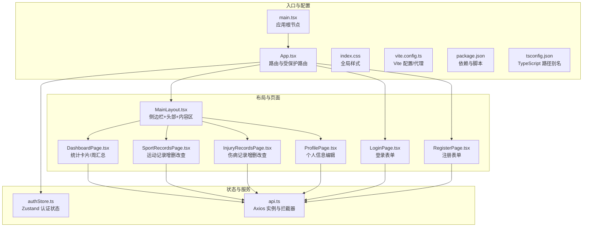
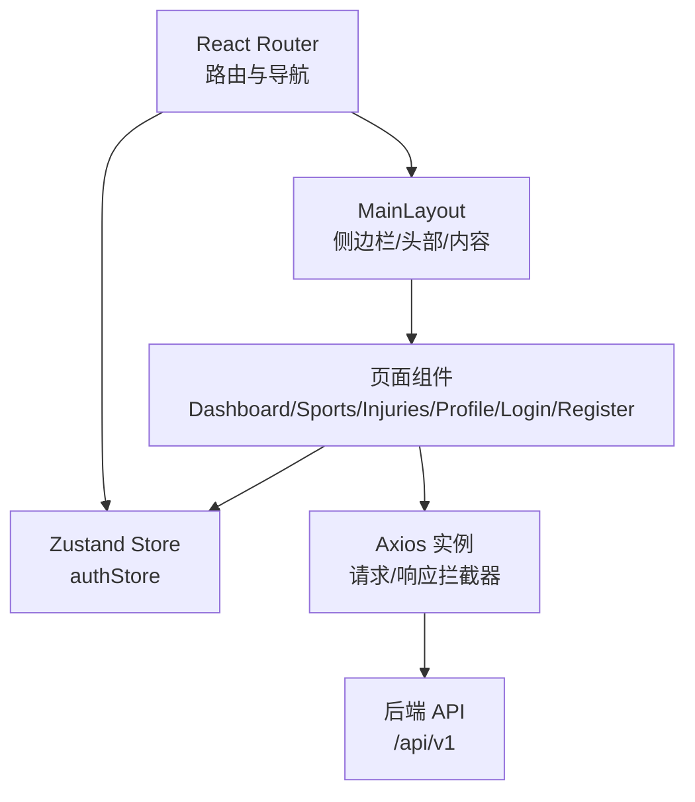

# 前端应用架构

<cite>
**本文档引用的文件**
- [web/src/App.tsx](file://web/src/App.tsx)
- [web/src/main.tsx](file://web/src/main.tsx)
- [web/src/index.css](file://web/src/index.css)
- [web/src/components/MainLayout.tsx](file://web/src/components/MainLayout.tsx)
- [web/src/pages/DashboardPage.tsx](file://web/src/pages/DashboardPage.tsx)
- [web/src/pages/LoginPage.tsx](file://web/src/pages/LoginPage.tsx)
- [web/src/pages/RegisterPage.tsx](file://web/src/pages/RegisterPage.tsx)
- [web/src/pages/SportRecordsPage.tsx](file://web/src/pages/SportRecordsPage.tsx)
- [web/src/pages/InjuryRecordsPage.tsx](file://web/src/pages/InjuryRecordsPage.tsx)
- [web/src/pages/ProfilePage.tsx](file://web/src/pages/ProfilePage.tsx)
- [web/src/services/api.ts](file://web/src/services/api.ts)
- [web/src/stores/authStore.ts](file://web/src/stores/authStore.ts)
- [web/package.json](file://web/package.json)
- [web/vite.config.ts](file://web/vite.config.ts)
- [web/tsconfig.json](file://web/tsconfig.json)
</cite>

## 目录
1. [简介](#简介)
2. [项目结构](#项目结构)
3. [核心组件](#核心组件)
4. [架构总览](#架构总览)
5. [详细组件分析](#详细组件分析)
6. [依赖关系分析](#依赖关系分析)
7. [性能考虑](#性能考虑)
8. [故障排查指南](#故障排查指南)
9. [结论](#结论)
10. [附录](#附录)

## 简介
本文件为 ActiveSynapse 前端应用的 UI 组件与页面架构文档，面向开发者与产品人员，系统化梳理组件的视觉外观、行为与交互模式，记录 props/属性、事件、插槽与自定义选项；提供使用示例与代码片段路径；给出响应式设计与无障碍访问建议；说明组件状态、动画与过渡效果；涵盖样式自定义与主题支持；并总结跨浏览器兼容性与性能优化策略。文档同时覆盖主要页面组件：仪表板、运动记录、伤病管理、个人资料、登录与注册，并说明页面布局、状态管理与 API 服务集成。

## 项目结构
前端采用 React + TypeScript + Vite 构建，Ant Design 作为 UI 基础库，Zustand 管理认证状态，Axios 封装 API 请求，路由基于 React Router DOM。项目通过别名 @ 指向 src 目录，便于模块导入。

**图表来源**
- [web/src/main.tsx:1-15](file://web/src/main.tsx#L1-L15)
- [web/src/App.tsx:1-48](file://web/src/App.tsx#L1-L48)
- [web/src/components/MainLayout.tsx:1-121](file://web/src/components/MainLayout.tsx#L1-L121)
- [web/src/pages/DashboardPage.tsx:1-118](file://web/src/pages/DashboardPage.tsx#L1-L118)
- [web/src/pages/SportRecordsPage.tsx:1-177](file://web/src/pages/SportRecordsPage.tsx#L1-L177)
- [web/src/pages/InjuryRecordsPage.tsx:1-220](file://web/src/pages/InjuryRecordsPage.tsx#L1-L220)
- [web/src/pages/ProfilePage.tsx:1-137](file://web/src/pages/ProfilePage.tsx#L1-L137)
- [web/src/pages/LoginPage.tsx:1-93](file://web/src/pages/LoginPage.tsx#L1-L93)
- [web/src/pages/RegisterPage.tsx:1-127](file://web/src/pages/RegisterPage.tsx#L1-L127)
- [web/src/stores/authStore.ts:1-52](file://web/src/stores/authStore.ts#L1-L52)
- [web/src/services/api.ts:1-108](file://web/src/services/api.ts#L1-L108)

**章节来源**
- [web/src/main.tsx:1-15](file://web/src/main.tsx#L1-L15)
- [web/src/App.tsx:1-48](file://web/src/App.tsx#L1-L48)
- [web/src/index.css:1-36](file://web/src/index.css#L1-L36)
- [web/vite.config.ts:1-23](file://web/vite.config.ts#L1-L23)
- [web/package.json:1-37](file://web/package.json#L1-L37)
- [web/tsconfig.json:1-32](file://web/tsconfig.json#L1-L32)

## 核心组件
- 应用入口与国际化
  - 入口文件在根节点包裹 ConfigProvider 并设置 Ant Design 语言为简体中文，确保组件文案与日期时间本地化一致。
  - 全局样式统一字体、背景色与滚动条样式，提供基础可定制性。
- 主布局 MainLayout
  - 提供侧边导航、顶部用户菜单、内容区域占位 Outlet，支持折叠/展开侧边栏，使用 Ant Design Layout、Menu、Dropdown、Avatar 等组件。
  - 使用 Ant Design 设计令牌 token 控制容器背景与圆角，保证主题一致性。
- 页面组件
  - 登录页与注册页：基于 Ant Design 表单与消息提示，完成字段校验与提交流程。
  - 仪表板：加载统计数据、周汇总与伤病概要，使用 Card、Statistic、Row/Col 实现响应式布局。
  - 运动记录：表格展示、Modal 编辑、表单校验与日期选择。
  - 伤病记录：表格展示、Modal 编辑、严重程度标签、开关控制"持续/复发"。
  - 个人资料：表单编辑身高、体重、生日、性别、运动等级与偏好等信息。

**章节来源**
- [web/src/main.tsx:1-15](file://web/src/main.tsx#L1-L15)
- [web/src/index.css:1-36](file://web/src/index.css#L1-L36)
- [web/src/components/MainLayout.tsx:1-121](file://web/src/components/MainLayout.tsx#L1-L121)
- [web/src/pages/LoginPage.tsx:1-93](file://web/src/pages/LoginPage.tsx#L1-L93)
- [web/src/pages/RegisterPage.tsx:1-127](file://web/src/pages/RegisterPage.tsx#L1-L127)
- [web/src/pages/DashboardPage.tsx:1-118](file://web/src/pages/DashboardPage.tsx#L1-L118)
- [web/src/pages/SportRecordsPage.tsx:1-177](file://web/src/pages/SportRecordsPage.tsx#L1-L177)
- [web/src/pages/InjuryRecordsPage.tsx:1-220](file://web/src/pages/InjuryRecordsPage.tsx#L1-L220)
- [web/src/pages/ProfilePage.tsx:1-137](file://web/src/pages/ProfilePage.tsx#L1-L137)

## 架构总览
应用采用"布局 + 页面"的分层组织，路由控制访问权限（受保护路由），状态通过 Zustand 管理，API 通过 Axios 封装并注入拦截器处理鉴权与刷新。

**图表来源**
- [web/src/App.tsx:1-48](file://web/src/App.tsx#L1-L48)
- [web/src/components/MainLayout.tsx:1-121](file://web/src/components/MainLayout.tsx#L1-L121)
- [web/src/stores/authStore.ts:1-52](file://web/src/stores/authStore.ts#L1-L52)
- [web/src/services/api.ts:1-108](file://web/src/services/api.ts#L1-L108)

## 详细组件分析

### 主布局 MainLayout
- 视觉外观
  - 顶部 Header 包含侧边栏折叠按钮与用户下拉菜单；内容区 Content 使用 Ant Design 容器样式与圆角。
  - 侧边 Sider 支持折叠，显示品牌名称或全称；Menu 以图标+文字展示导航项，当前路由高亮。
- 行为与交互
  - 折叠切换：点击头部按钮切换侧边栏折叠状态。
  - 导航跳转：点击菜单项触发 useNavigate 跳转对应路径。
  - 用户操作：下拉菜单支持"我的资料"跳转与"退出登录"，退出时清理状态并跳转登录页。
- 属性与事件
  - 无外部 props；内部通过 Ant Design 组件的 onClick/onChange 等回调实现交互。
- 插槽与自定义
  - 通过 Ant Design 的 theme/token 自定义容器背景与圆角；可扩展菜单项与下拉项。
- 响应式与无障碍
  - 使用 Ant Design 原生响应式断点；按钮具备可访问性语义（type=text）。
- 动画与过渡
  - Ant Design 内置过渡效果；侧边栏折叠使用内置动画。
- 样式与主题
  - 使用 theme.useToken 获取容器背景与圆角；支持 light/dark 主题切换（Ant Design）。
- 代码片段路径
  - [MainLayout 组件实现:17-118](file://web/src/components/MainLayout.tsx#L17-L118)

**章节来源**
- [web/src/components/MainLayout.tsx:1-121](file://web/src/components/MainLayout.tsx#L1-L121)

### 仪表板 DashboardPage
- 视觉外观
  - 使用 Card 包裹 Statistic 指标卡片，按 30 天、周汇总与伤病概要展示关键指标。
  - 周活动卡片展示起止日期与总次数。
- 行为与交互
  - 首次渲染触发并发请求：运动统计、周汇总、伤病概要；错误时弹出消息提示。
  - 数据为空时隐藏特定卡片（例如 Running 统计）。
- 属性与事件
  - 无外部 props；内部通过 API 调用与状态更新驱动视图。
- 插槽与自定义
  - 可扩展卡片标题与图标；数值颜色根据状态动态变化（如伤病数量大于 0 时显示警示色）。
- 响应式与无障碍
  - 使用 Row/Col 实现响应式网格；Statistic 组件具备可读性。
- 动画与过渡
  - 加载态使用 Spin；数据加载完成后平滑呈现。
- 样式与主题
  - 继承 Ant Design 卡片与统计组件样式；可通过主题 token 调整配色。
- 代码片段路径
  - [仪表板数据加载与渲染:12-33](file://web/src/pages/DashboardPage.tsx#L12-L33)
  - [指标卡片与周汇总展示:43-114](file://web/src/pages/DashboardPage.tsx#L43-L114)

**章节来源**
- [web/src/pages/DashboardPage.tsx:1-118](file://web/src/pages/DashboardPage.tsx#L1-L118)

### 登录页 LoginPage
- 视觉外观
  - 居中卡片、大号输入框、垂直布局、品牌标题与副标题。
- 行为与交互
  - 表单校验：邮箱格式、密码必填；提交时调用 authApi.login，成功后写入认证状态并跳转首页。
  - 错误处理：捕获异常并提示错误信息。
- 属性与事件
  - 无外部 props；内部通过 Ant Design Form 的 onFinish 与控件规则实现。
- 插槽与自定义
  - 可替换图标与文案；宽度与阴影样式可调整。
- 响应式与无障碍
  - 垂直布局适合移动端；输入框具备可访问性语义。
- 动画与过渡
  - 提交按钮 loading 状态反馈。
- 样式与主题
  - 卡片阴影与背景色可定制；Ant Design 组件继承主题。
- 代码片段路径
  - [登录表单与提交逻辑:15-29](file://web/src/pages/LoginPage.tsx#L15-L29)

**章节来源**
- [web/src/pages/LoginPage.tsx:1-93](file://web/src/pages/LoginPage.tsx#L1-L93)

### 注册页 RegisterPage
- 视觉外观
  - 类似登录页的居中卡片与垂直表单。
- 行为与交互
  - 字段校验：用户名长度、邮箱格式、密码长度、确认密码一致性；提交后调用注册接口并提示成功。
- 属性与事件
  - 无外部 props；使用 Ant Design Form 的依赖校验与异步校验器。
- 插槽与自定义
  - 可扩展多选/枚举字段；文案与图标可替换。
- 响应式与无障碍
  - 表单控件具备可访问性语义；布局适配移动端。
- 动画与过渡
  - 提交按钮 loading 状态反馈。
- 样式与主题
  - 继承 Ant Design 卡片与表单样式。
- 代码片段路径
  - [注册表单与提交逻辑:13-24](file://web/src/pages/RegisterPage.tsx#L13-L24)

**章节来源**
- [web/src/pages/RegisterPage.tsx:1-127](file://web/src/pages/RegisterPage.tsx#L1-L127)

### 运动记录 SportRecordsPage
- 视觉外观
  - 卡片内表格展示运动记录，包含类型、时长、卡路里、来源等列；操作列提供编辑与删除按钮。
- 行为与交互
  - 新增/编辑：打开 Modal，填充表单，提交后刷新列表；日期使用 dayjs 格式化。
  - 删除：二次确认（由按钮危险样式体现），成功后刷新。
  - 列渲染：类型与来源使用 Tag 标签区分颜色；操作列使用 Ant Design Button。
- 属性与事件
  - 无外部 props；内部通过 Ant Design Table 的 render 与 rowKey 实现。
- 插槽与自定义
  - 可扩展列渲染与新增/编辑表单项；Modal 宽度可调。
- 响应式与无障碍
  - 表格在小屏下可横向滚动；按钮具备可访问性语义。
- 动画与过渡
  - Modal 打开/关闭使用 Ant Design 内置过渡。
- 样式与主题
  - 继承 Ant Design 表格与卡片样式；Tag 颜色可定制。
- 代码片段路径
  - [表格列定义与渲染:78-125](file://web/src/pages/SportRecordsPage.tsx#L78-L125)
  - [新增/编辑/删除与表单提交:32-76](file://web/src/pages/SportRecordsPage.tsx#L32-L76)

**章节来源**
- [web/src/pages/SportRecordsPage.tsx:1-177](file://web/src/pages/SportRecordsPage.tsx#L1-L177)

### 伤病记录 InjuryRecordsPage
- 视觉外观
  - 表格展示伤病类型、部位、严重程度、开始日期与状态（进行中/复发/已康复）。
- 行为与交互
  - 新增默认值：进行中勾选、非复发；编辑时回显日期与布尔值。
  - 严重程度映射颜色；状态标签动态生成。
  - Modal 宽度较大以容纳多行文本域。
- 属性与事件
  - 无外部 props；内部通过 Ant Design Form 的 Switch 与多选实现。
- 插槽与自定义
  - 可扩展选项列表与标签颜色映射。
- 响应式与无障碍
  - 表单控件具备可访问性语义；标签颜色满足对比度要求。
- 动画与过渡
  - Modal 打开/关闭使用 Ant Design 内置过渡。
- 样式与主题
  - 继承 Ant Design 表格与表单样式；标签颜色可定制。
- 代码片段路径
  - [表格列定义与状态标签渲染:82-134](file://web/src/pages/InjuryRecordsPage.tsx#L82-L134)
  - [新增/编辑/删除与表单提交:33-80](file://web/src/pages/InjuryRecordsPage.tsx#L33-L80)

**章节来源**
- [web/src/pages/InjuryRecordsPage.tsx:1-220](file://web/src/pages/InjuryRecordsPage.tsx#L1-L220)

### 个人资料 ProfilePage
- 视觉外观
  - 基本信息卡片与运动档案表单；表单为垂直布局，便于移动端填写。
- 行为与交互
  - 首次加载获取用户档案并回填表单；保存时提交更新并提示结果。
  - 生日使用 DatePicker，多选使用 Select 的多选模式。
- 属性与事件
  - 无外部 props；内部通过 Ant Design Form 的 onFinish 与控件规则实现。
- 插槽与自定义
  - 可扩展枚举选项与多选值集合。
- 响应式与无障碍
  - 表单控件具备可访问性语义；垂直布局适合移动端。
- 动画与过渡
  - 加载态使用 Spin；保存按钮 loading 状态反馈。
- 样式与主题
  - 继承 Ant Design 卡片与表单样式。
- 代码片段路径
  - [档案加载与表单回填:20-36](file://web/src/pages/ProfilePage.tsx#L20-L36)
  - [表单提交与保存逻辑:38-52](file://web/src/pages/ProfilePage.tsx#L38-L52)

**章节来源**
- [web/src/pages/ProfilePage.tsx:1-137](file://web/src/pages/ProfilePage.tsx#L1-L137)

### 路由与受保护路由
- 结构与流程
  - 使用 React Router DOM 定义公开路由（登录/注册）与受保护路由（仪表板/运动/伤病/个人资料）。
  - 受保护路由通过自定义组件读取认证状态，未认证则重定向到登录页。
- 代码片段路径
  - [路由与受保护路由实现:14-41](file://web/src/App.tsx#L14-L41)

**章节来源**
- [web/src/App.tsx:1-48](file://web/src/App.tsx#L1-L48)

### 状态管理与认证
- 状态模型
  - 用户信息、访问令牌、刷新令牌与认证状态；支持 setAuth、logout、updateUser。
- 本地持久化
  - 使用 persist 中间件将状态存储在本地，避免刷新丢失。
- 代码片段路径
  - [认证状态模型与方法:11-46](file://web/src/stores/authStore.ts#L11-L46)

**章节来源**
- [web/src/stores/authStore.ts:1-52](file://web/src/stores/authStore.ts#L1-L52)

### API 服务与拦截器
- 实例与拦截器
  - 创建 Axios 实例，设置基础 URL；请求拦截器自动附加 Bearer Token；响应拦截器处理 401 并尝试刷新令牌。
- 接口封装
  - 分模块导出：authApi、userApi、sportApi、injuryApi，统一命名与参数传递。
- 代码片段路径
  - [请求/响应拦截器与刷新逻辑:13-64](file://web/src/services/api.ts#L13-L64)
  - [接口方法定义:68-108](file://web/src/services/api.ts#L68-L108)

**章节来源**
- [web/src/services/api.ts:1-108](file://web/src/services/api.ts#L1-L108)

## 依赖关系分析
- 组件耦合
  - 页面组件依赖 API 服务与认证状态；主布局依赖认证状态与路由导航。
- 外部依赖
  - Ant Design 提供 UI 基础与主题；Axios 提供网络请求；Zustand 提供轻量状态；dayjs 提供日期处理；echarts/echarts-for-react 用于图表（页面中未直接使用，但已引入）。
- 代理与环境
  - Vite 代理将 /api 前缀转发至后端服务；环境变量控制 API 基础地址。
- 代码片段路径
  - [依赖声明:12-22](file://web/package.json#L12-L22)
  - [Vite 代理配置:15-20](file://web/vite.config.ts#L15-L20)

**章节来源**
- [web/package.json:1-37](file://web/package.json#L1-L37)
- [web/vite.config.ts:1-23](file://web/vite.config.ts#L1-L23)

## 性能考虑
- 渲染优化
  - 页面组件使用局部状态与懒加载策略（如 Modal 按需打开），减少不必要的重渲染。
  - 表格组件传入 rowKey，提升列表渲染性能。
- 网络优化
  - 使用并发请求合并数据加载（仪表板使用 Promise.all）；请求拦截器复用已存在 token，避免重复鉴权。
- 资源优化
  - Ant Design 按需加载组件（通过构建工具与 Tree Shaking）；全局样式最小化，避免重复样式。
- 代码分割与懒加载
  - 可对大型页面组件进行动态导入，进一步降低首屏体积。
- 无障碍与可访问性
  - 使用语义化标签与可访问性属性；按钮与表单控件具备键盘导航能力；颜色对比度符合基本要求。
- 跨浏览器兼容性
  - TypeScript 与现代浏览器特性配合 Vite 构建链路；Ant Design 已覆盖主流浏览器；注意滚动条样式在非 WebKit 内核的差异。

## 故障排查指南
- 登录失败
  - 检查后端返回的错误信息是否包含 detail 字段；确认邮箱/密码格式与必填规则。
  - 参考路径：[登录表单提交:15-29](file://web/src/pages/LoginPage.tsx#L15-L29)
- 注册失败
  - 检查用户名长度、邮箱格式、密码长度与确认密码一致性；查看消息提示。
  - 参考路径：[注册表单提交:13-24](file://web/src/pages/RegisterPage.tsx#L13-L24)
- 数据加载失败
  - 仪表板、运动记录、伤病记录、个人资料均使用消息提示；检查网络面板与后端接口可用性。
  - 参考路径：[仪表板加载:16-33](file://web/src/pages/DashboardPage.tsx#L16-L33)、[运动记录加载:20-30](file://web/src/pages/SportRecordsPage.tsx#L20-L30)、[伤病记录加载:21-31](file://web/src/pages/InjuryRecordsPage.tsx#L21-L31)、[个人资料加载:20-36](file://web/src/pages/ProfilePage.tsx#L20-L36)
- 认证与刷新
  - 若出现 401，检查刷新令牌是否存在；确认响应拦截器是否正确设置新 token 并重试原请求。
  - 参考路径：[请求拦截器:13-25](file://web/src/services/api.ts#L13-L25)、[响应拦截器与刷新:27-64](file://web/src/services/api.ts#L27-L64)
- 路由跳转
  - 未登录访问受保护路由会自动跳转登录页；确认认证状态是否持久化。
  - 参考路径：[受保护路由:14-18](file://web/src/App.tsx#L14-L18)

**章节来源**
- [web/src/pages/LoginPage.tsx:1-93](file://web/src/pages/LoginPage.tsx#L1-L93)
- [web/src/pages/RegisterPage.tsx:1-127](file://web/src/pages/RegisterPage.tsx#L1-L127)
- [web/src/pages/DashboardPage.tsx:1-118](file://web/src/pages/DashboardPage.tsx#L1-L118)
- [web/src/pages/SportRecordsPage.tsx:1-177](file://web/src/pages/SportRecordsPage.tsx#L1-L177)
- [web/src/pages/InjuryRecordsPage.tsx:1-220](file://web/src/pages/InjuryRecordsPage.tsx#L1-L220)
- [web/src/pages/ProfilePage.tsx:1-137](file://web/src/pages/ProfilePage.tsx#L1-L137)
- [web/src/services/api.ts:1-108](file://web/src/services/api.ts#L1-L108)
- [web/src/App.tsx:1-48](file://web/src/App.tsx#L1-L48)

## 结论
ActiveSynapse 前端采用清晰的分层架构：路由与布局负责导航与容器，页面组件聚焦业务功能，状态与服务分别承担认证与数据访问。组件遵循 Ant Design 设计体系，具备良好的响应式与可访问性基础；通过拦截器与并发请求提升用户体验与性能。后续可在以下方面深化：组件化复用、主题深度定制、图表可视化集成、国际化扩展与自动化测试完善。

## 附录
- 快速上手
  - 启动开发服务器：执行 dev 脚本；访问 http://localhost:5173
  - 构建生产包：执行 build 脚本；预览生产包：执行 preview 脚本
- 关键路径索引
  - [应用入口与国际化:8-14](file://web/src/main.tsx#L8-L14)
  - [全局样式与滚动条:1-36](file://web/src/index.css#L1-L36)
  - [路由与受保护路由:14-41](file://web/src/App.tsx#L14-L41)
  - [主布局组件:17-118](file://web/src/components/MainLayout.tsx#L17-L118)
  - [仪表板页面:12-114](file://web/src/pages/DashboardPage.tsx#L12-L114)
  - [登录页面:15-29](file://web/src/pages/LoginPage.tsx#L15-L29)
  - [注册页面:13-24](file://web/src/pages/RegisterPage.tsx#L13-L24)
  - [运动记录页面:32-173](file://web/src/pages/SportRecordsPage.tsx#L32-L173)
  - [伤病记录页面:33-214](file://web/src/pages/InjuryRecordsPage.tsx#L33-L214)
  - [个人资料页面:20-131](file://web/src/pages/ProfilePage.tsx#L20-L131)
  - [认证状态存储:21-46](file://web/src/stores/authStore.ts#L21-L46)
  - [API 封装与拦截器:13-108](file://web/src/services/api.ts#L13-L108)
  - [Vite 代理配置:15-20](file://web/vite.config.ts#L15-L20)
  - [TypeScript 路径别名:23-27](file://web/tsconfig.json#L23-L27)