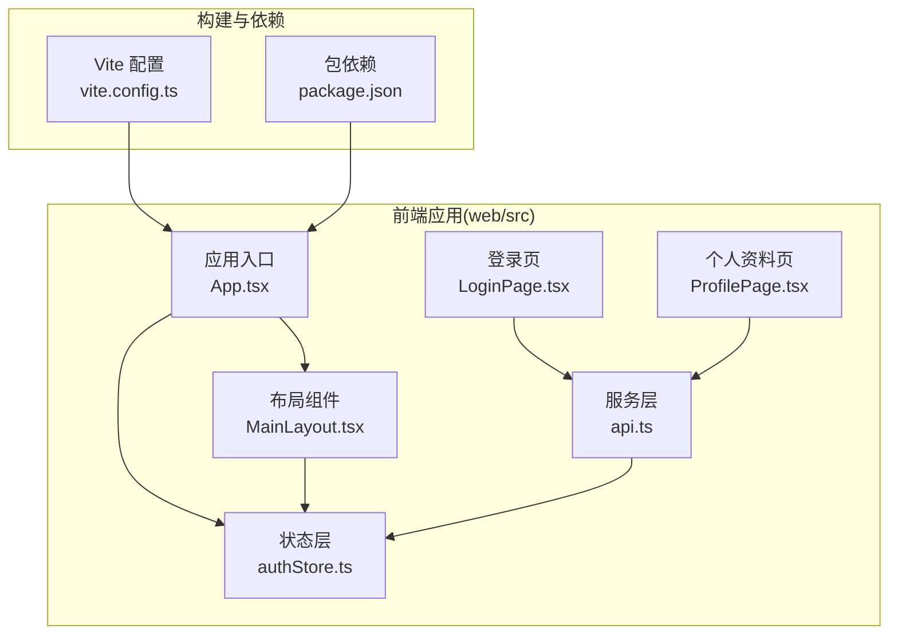
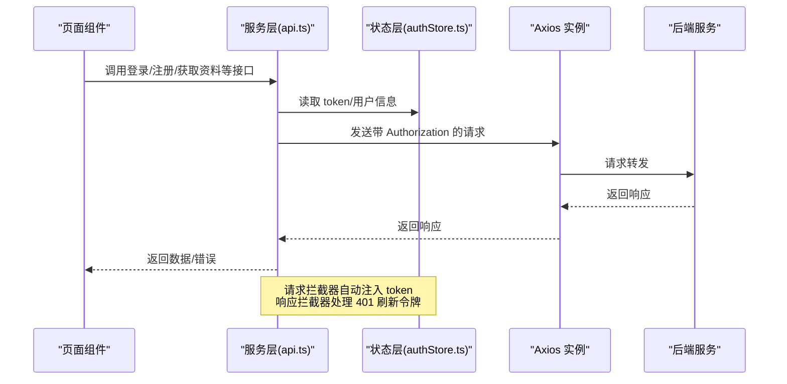
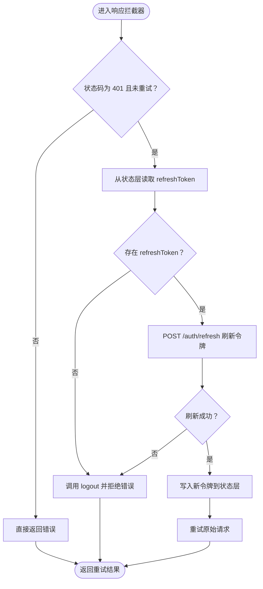
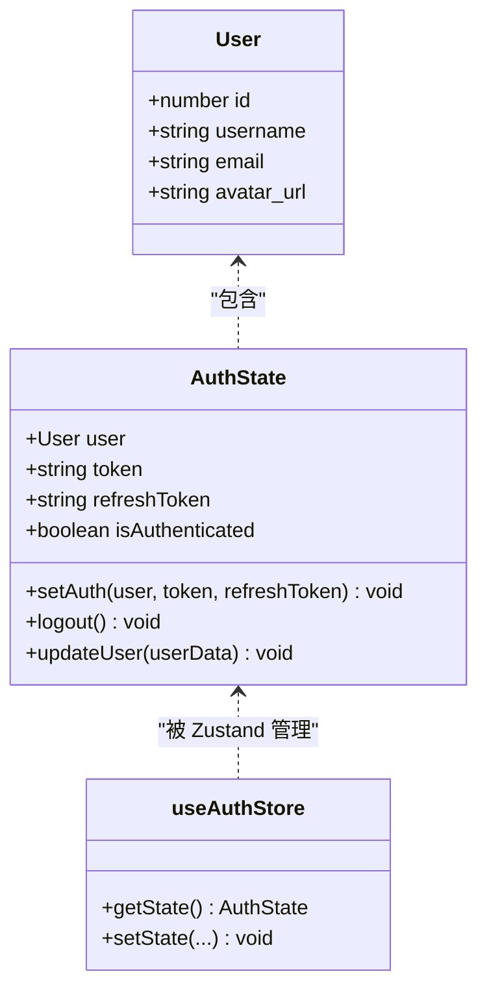
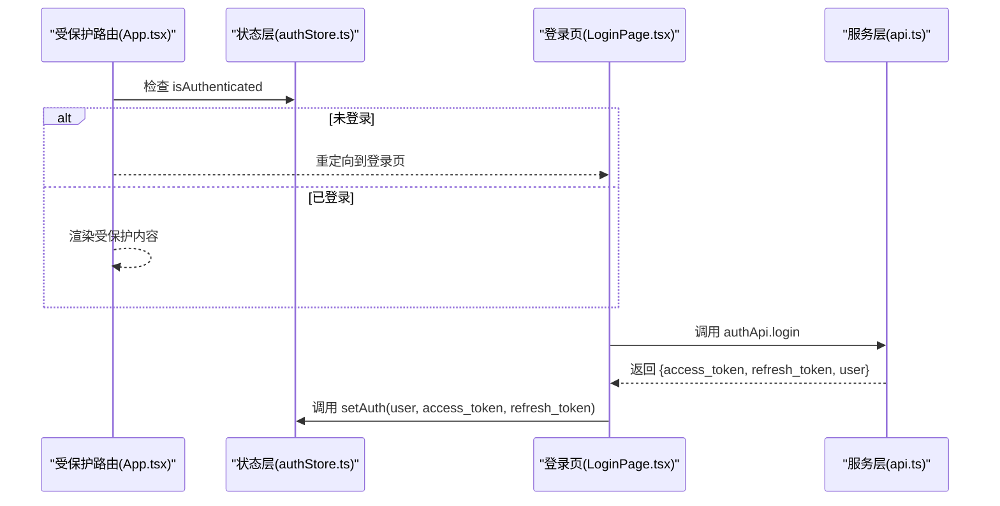
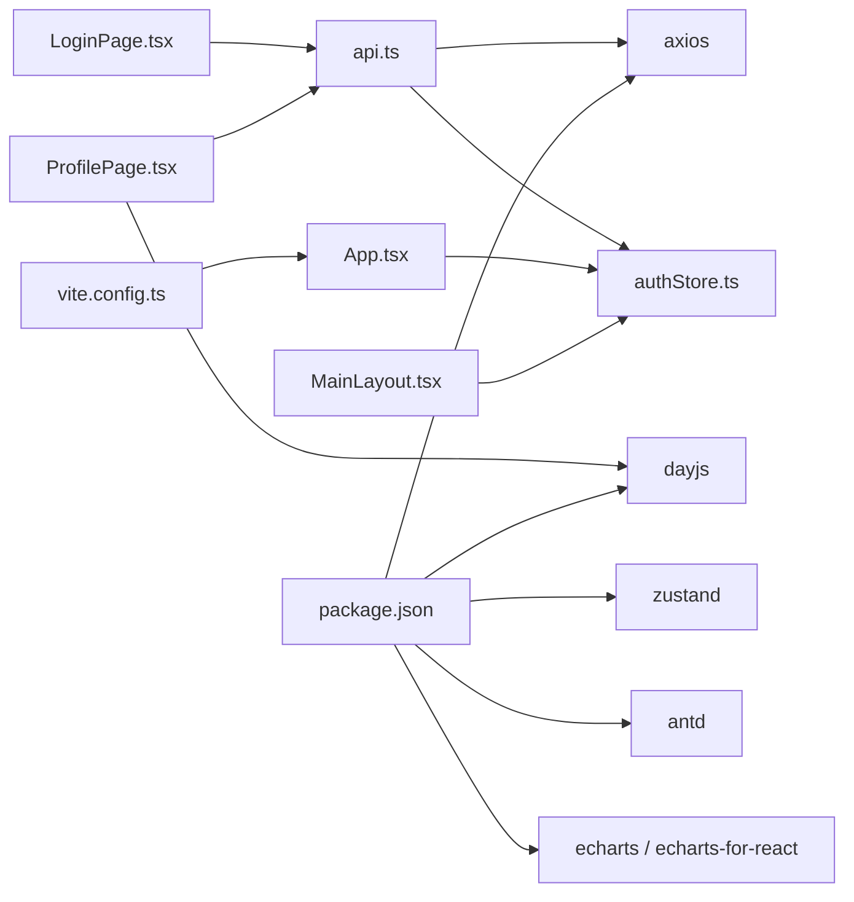

# 工具函数

<cite>
**本文引用的文件**
- [web/src/services/api.ts](file://web/src/services/api.ts)
- [web/src/stores/authStore.ts](file://web/src/stores/authStore.ts)
- [web/src/App.tsx](file://web/src/App.tsx)
- [web/src/components/MainLayout.tsx](file://web/src/components/MainLayout.tsx)
- [web/src/pages/LoginPage.tsx](file://web/src/pages/LoginPage.tsx)
- [web/src/pages/ProfilePage.tsx](file://web/src/pages/ProfilePage.tsx)
- [web/package.json](file://web/package.json)
- [web/vite.config.ts](file://web/vite.config.ts)
</cite>

## 目录
1. [简介](#简介)
2. [项目结构](#项目结构)
3. [核心组件](#核心组件)
4. [架构总览](#架构总览)
5. [详细组件分析](#详细组件分析)
6. [依赖分析](#依赖分析)
7. [性能考虑](#性能考虑)
8. [故障排查指南](#故障排查指南)
9. [结论](#结论)
10. [附录](#附录)

## 简介
本文件聚焦 ActiveSynapse 前端中的“工具函数”相关实现，系统性梳理与说明以下内容：
- 设计目的：统一网络请求、认证状态管理与路由守卫，降低页面耦合度，提升可维护性与复用性
- 实现逻辑：基于 axios 的请求/响应拦截器、Zustand 状态持久化、受保护路由守卫
- 使用方法：在页面组件中通过导入相应模块调用 API 或访问状态
- 数据处理与格式化：集中于请求头注入、错误处理与自动刷新流程；页面内对日期等进行格式化
- 最佳实践与性能：拦截器链路优化、状态持久化、代理配置与环境变量
- 与业务逻辑关系：认证、用户资料、运动与伤病记录等业务均通过统一服务层调用
- 测试与维护：建议以单元测试覆盖拦截器与状态变更，集成测试覆盖登录/登出流程

## 项目结构
前端位于 web/src 目录，关键文件如下：
- 服务层：网络请求封装与业务 API 暴露（web/src/services/api.ts）
- 状态层：认证状态与持久化（web/src/stores/authStore.ts）
- 应用入口与路由：应用组件与受保护路由（web/src/App.tsx）
- 布局与页面：主布局、登录页、个人资料页等（web/src/components/MainLayout.tsx、web/src/pages/LoginPage.tsx、web/src/pages/ProfilePage.tsx）
- 构建与依赖：Vite 配置、包依赖（web/vite.config.ts、web/package.json）

**图表来源**
- [web/src/services/api.ts](file://web/src/services/api.ts#L1-L108)
- [web/src/stores/authStore.ts](file://web/src/stores/authStore.ts#L1-L52)
- [web/src/App.tsx](file://web/src/App.tsx#L1-L48)
- [web/src/components/MainLayout.tsx](file://web/src/components/MainLayout.tsx#L1-L121)
- [web/src/pages/LoginPage.tsx](file://web/src/pages/LoginPage.tsx#L1-L40)
- [web/src/pages/ProfilePage.tsx](file://web/src/pages/ProfilePage.tsx#L1-L47)
- [web/vite.config.ts](file://web/vite.config.ts#L1-L22)
- [web/package.json](file://web/package.json#L1-L36)

**章节来源**
- [web/src/services/api.ts](file://web/src/services/api.ts#L1-L108)
- [web/src/stores/authStore.ts](file://web/src/stores/authStore.ts#L1-L52)
- [web/src/App.tsx](file://web/src/App.tsx#L1-L48)
- [web/src/components/MainLayout.tsx](file://web/src/components/MainLayout.tsx#L1-L121)
- [web/src/pages/LoginPage.tsx](file://web/src/pages/LoginPage.tsx#L1-L40)
- [web/src/pages/ProfilePage.tsx](file://web/src/pages/ProfilePage.tsx#L1-L47)
- [web/vite.config.ts](file://web/vite.config.ts#L1-L22)
- [web/package.json](file://web/package.json#L1-L36)

## 核心组件
- 网络请求与拦截器
  - 统一基础 URL、JSON 头部
  - 请求拦截：从状态层读取 token 并注入 Authorization
  - 响应拦截：401 时自动刷新令牌并重试原请求
- 认证状态管理
  - 用户信息、访问令牌、刷新令牌、登录态
  - setAuth、logout、updateUser 方法
  - 使用 Zustand 持久化存储
- 受保护路由
  - 未登录跳转到登录页
- 页面级数据处理
  - 登录页：提交表单后调用登录 API，并设置认证状态
  - 个人资料页：加载/更新用户资料，日期格式化为 ISO 字符串

**章节来源**
- [web/src/services/api.ts](file://web/src/services/api.ts#L1-L108)
- [web/src/stores/authStore.ts](file://web/src/stores/authStore.ts#L1-L52)
- [web/src/App.tsx](file://web/src/App.tsx#L14-L18)
- [web/src/pages/LoginPage.tsx](file://web/src/pages/LoginPage.tsx#L15-L29)
- [web/src/pages/ProfilePage.tsx](file://web/src/pages/ProfilePage.tsx#L20-L47)

## 架构总览
前端采用“服务层 + 状态层 + 路由守卫”的分层设计，工具函数以模块形式提供：
- 服务层：封装 axios 实例与业务 API，暴露 authApi、userApi、sportApi、injuryApi
- 状态层：集中管理认证上下文，支持持久化
- 路由层：受保护路由组件保障页面访问安全
- 页面层：按需调用服务与状态，完成业务操作

**图表来源**
- [web/src/services/api.ts](file://web/src/services/api.ts#L13-L64)
- [web/src/stores/authStore.ts](file://web/src/stores/authStore.ts#L21-L46)
- [web/src/pages/LoginPage.tsx](file://web/src/pages/LoginPage.tsx#L15-L29)

## 详细组件分析

### 服务层：网络请求与拦截器（api.ts）
- 设计目的
  - 统一请求前缀、默认头部，集中处理认证与错误
  - 通过拦截器实现无侵入的鉴权与令牌刷新
- 关键实现
  - 创建 axios 实例并设置 base URL 与 Content-Type
  - 请求拦截：从 authStore 读取 token 注入 Authorization
  - 响应拦截：401 且未重试过时，使用 refreshToken 刷新 access_token，并重试原请求；失败则登出
  - 导出通用 api 与业务 API 分组：authApi、userApi、sportApi、injuryApi
- 参数与返回
  - authApi.login(email, password)：参数为字符串；返回 axios 请求 Promise
  - authApi.register(data)：参数为对象；返回 axios 请求 Promise
  - authApi.refresh(refreshToken)：参数为字符串；返回 axios 请求 Promise
  - authApi.logout()：无参数；返回 axios 请求 Promise
  - userApi.getMe()/updateMe()/getProfile()/updateProfile()：参数为任意对象；返回 axios 请求 Promise
  - sportApi.getRecords(params)/createRecord()/updateRecord(id, data)/deleteRecord(id)/getStatistics(params)/getWeeklySummary()：参数为可选对象或 id+data；返回 axios 请求 Promise
  - injuryApi.getRecords(params)/createRecord()/updateRecord(id, data)/deleteRecord(id)/getSummary()：参数为可选对象或 id+data；返回 axios 请求 Promise
- 使用示例（路径）
  - 登录：[web/src/pages/LoginPage.tsx](file://web/src/pages/LoginPage.tsx#L15-L29)
  - 获取/更新个人资料：[web/src/pages/ProfilePage.tsx](file://web/src/pages/ProfilePage.tsx#L20-L47)
  - 运动记录查询与统计：[web/src/services/api.ts](file://web/src/services/api.ts#L90-L98)
  - 伤病记录查询与汇总：[web/src/services/api.ts](file://web/src/services/api.ts#L100-L107)

**图表来源**
- [web/src/services/api.ts](file://web/src/services/api.ts#L27-L64)
- [web/src/stores/authStore.ts](file://web/src/stores/authStore.ts#L36-L41)

**章节来源**
- [web/src/services/api.ts](file://web/src/services/api.ts#L1-L108)
- [web/src/pages/LoginPage.tsx](file://web/src/pages/LoginPage.tsx#L15-L29)
- [web/src/pages/ProfilePage.tsx](file://web/src/pages/ProfilePage.tsx#L20-L47)

### 状态层：认证状态管理（authStore.ts）
- 设计目的
  - 将用户信息、令牌与登录态集中管理，并持久化到本地存储
- 关键实现
  - 定义 User 与 AuthState 接口
  - 使用 Zustand 的 persist 中间件持久化
  - 提供 setAuth、logout、updateUser 方法
- 参数与返回
  - setAuth(user, token, refreshToken)：无返回值
  - logout()：无返回值
  - updateUser(userData)：无返回值
- 使用示例（路径）
  - 登录成功后设置认证状态：[web/src/pages/LoginPage.tsx](file://web/src/pages/LoginPage.tsx#L19-L23)
  - 更新用户资料：[web/src/pages/ProfilePage.tsx](file://web/src/pages/ProfilePage.tsx#L43-L47)

**图表来源**
- [web/src/stores/authStore.ts](file://web/src/stores/authStore.ts#L4-L19)
- [web/src/stores/authStore.ts](file://web/src/stores/authStore.ts#L21-L51)

**章节来源**
- [web/src/stores/authStore.ts](file://web/src/stores/authStore.ts#L1-L52)
- [web/src/pages/LoginPage.tsx](file://web/src/pages/LoginPage.tsx#L19-L23)
- [web/src/pages/ProfilePage.tsx](file://web/src/pages/ProfilePage.tsx#L43-L47)

### 路由与页面：受保护路由与页面数据处理
- 受保护路由
  - 未登录用户将被重定向至登录页
- 页面数据处理
  - 登录页：表单提交后调用 authApi.login，成功后 setAuth 并提示
  - 个人资料页：加载用户资料时将日期转换为 dayjs 对象；保存时将日期转为 ISO 字符串
  - 主布局：菜单导航、用户下拉菜单、登出逻辑

**图表来源**
- [web/src/App.tsx](file://web/src/App.tsx#L14-L18)
- [web/src/pages/LoginPage.tsx](file://web/src/pages/LoginPage.tsx#L15-L29)
- [web/src/services/api.ts](file://web/src/services/api.ts#L68-L80)
- [web/src/stores/authStore.ts](file://web/src/stores/authStore.ts#L29-L34)

**章节来源**
- [web/src/App.tsx](file://web/src/App.tsx#L14-L18)
- [web/src/pages/LoginPage.tsx](file://web/src/pages/LoginPage.tsx#L15-L29)
- [web/src/pages/ProfilePage.tsx](file://web/src/pages/ProfilePage.tsx#L20-L47)
- [web/src/components/MainLayout.tsx](file://web/src/components/MainLayout.tsx#L53-L56)

## 依赖分析
- 外部依赖
  - axios：HTTP 客户端与拦截器
  - zustand：轻量状态管理，配合 persist 实现持久化
  - dayjs：日期解析与格式化
  - antd：UI 组件库
  - echarts / echarts-for-react：可视化图表
- 内部依赖
  - api.ts 依赖 authStore.ts 提供的 token 与用户信息
  - 页面组件依赖 api.ts 与 authStore.ts 完成业务操作
  - App.tsx 依赖 authStore.ts 实现受保护路由

**图表来源**
- [web/src/services/api.ts](file://web/src/services/api.ts#L1-L2)
- [web/src/stores/authStore.ts](file://web/src/stores/authStore.ts#L1-L2)
- [web/src/pages/LoginPage.tsx](file://web/src/pages/LoginPage.tsx#L5-L6)
- [web/src/pages/ProfilePage.tsx](file://web/src/pages/ProfilePage.tsx#L4-L6)
- [web/vite.config.ts](file://web/vite.config.ts#L1-L22)
- [web/package.json](file://web/package.json#L12-L22)

**章节来源**
- [web/src/services/api.ts](file://web/src/services/api.ts#L1-L2)
- [web/src/stores/authStore.ts](file://web/src/stores/authStore.ts#L1-L2)
- [web/src/pages/LoginPage.tsx](file://web/src/pages/LoginPage.tsx#L5-L6)
- [web/src/pages/ProfilePage.tsx](file://web/src/pages/ProfilePage.tsx#L4-L6)
- [web/package.json](file://web/package.json#L12-L22)
- [web/vite.config.ts](file://web/vite.config.ts#L1-L22)

## 性能考虑
- 拦截器链路
  - 请求拦截器仅读取一次 token，避免重复计算
  - 响应拦截器对 401 错误进行幂等重试（_retry 标记），防止无限循环
- 状态持久化
  - 使用 persist 减少重复登录成本，提升用户体验
- 网络与代理
  - Vite 代理将 /api 转发至后端，减少跨域与环境差异带来的开销
- 日期处理
  - 页面内使用 dayjs 进行解析与格式化，避免频繁字符串转换

[本节为通用指导，不直接分析具体文件]

## 故障排查指南
- 登录失败
  - 检查后端返回的错误信息是否包含 detail 字段
  - 确认环境变量 VITE_API_URL 是否正确
  - 参考：[web/src/pages/LoginPage.tsx](file://web/src/pages/LoginPage.tsx#L24-L26)，[web/src/services/api.ts](file://web/src/services/api.ts#L4)
- 401 未授权
  - 确认 refreshToken 是否存在
  - 检查响应拦截器是否成功刷新并重试请求
  - 参考：[web/src/services/api.ts](file://web/src/services/api.ts#L33-L64)
- 无法访问受保护页面
  - 检查 isAuthenticated 状态是否为 true
  - 参考：[web/src/App.tsx](file://web/src/App.tsx#L16-L17)
- 个人资料保存失败
  - 确认日期字段已转换为 ISO 字符串
  - 参考：[web/src/pages/ProfilePage.tsx](file://web/src/pages/ProfilePage.tsx#L42-L44)

**章节来源**
- [web/src/pages/LoginPage.tsx](file://web/src/pages/LoginPage.tsx#L24-L26)
- [web/src/services/api.ts](file://web/src/services/api.ts#L4)
- [web/src/services/api.ts](file://web/src/services/api.ts#L33-L64)
- [web/src/App.tsx](file://web/src/App.tsx#L16-L17)
- [web/src/pages/ProfilePage.tsx](file://web/src/pages/ProfilePage.tsx#L42-L44)

## 结论
ActiveSynapse 前端通过服务层与状态层的清晰分层，实现了认证、网络请求与路由守卫的高内聚低耦合。工具函数以模块化方式提供，便于在多页面复用，同时具备良好的可维护性与扩展性。建议后续补充针对拦截器与状态变更的单元测试，以及针对登录/登出流程的集成测试。

[本节为总结性内容，不直接分析具体文件]

## 附录
- 环境变量
  - VITE_API_URL：后端 API 基础地址
  - 参考：[web/src/services/api.ts](file://web/src/services/api.ts#L4)
- 构建与代理
  - Vite 将 /api 代理到 http://localhost:8000，便于开发调试
  - 参考：[web/vite.config.ts](file://web/vite.config.ts#L15-L20)
- 包依赖概览
  - axios、zustand、dayjs、antd、echarts 等
  - 参考：[web/package.json](file://web/package.json#L12-L22)

**章节来源**
- [web/src/services/api.ts](file://web/src/services/api.ts#L4)
- [web/vite.config.ts](file://web/vite.config.ts#L15-L20)
- [web/package.json](file://web/package.json#L12-L22)