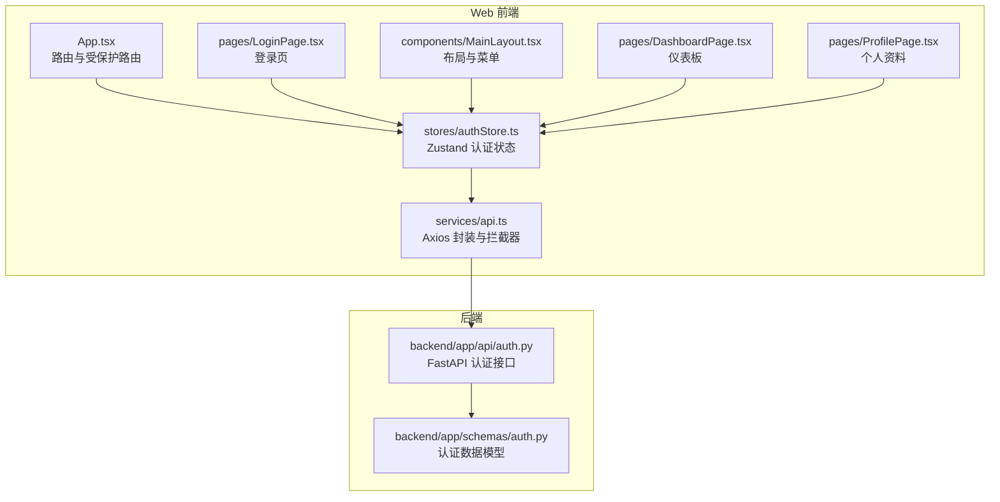
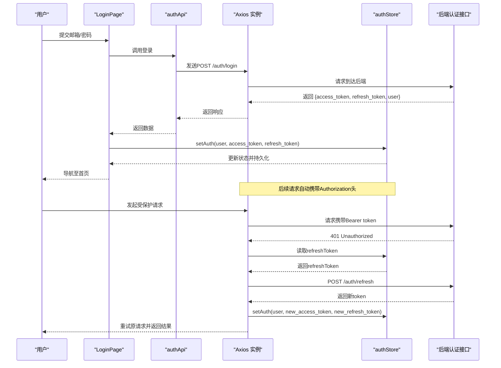
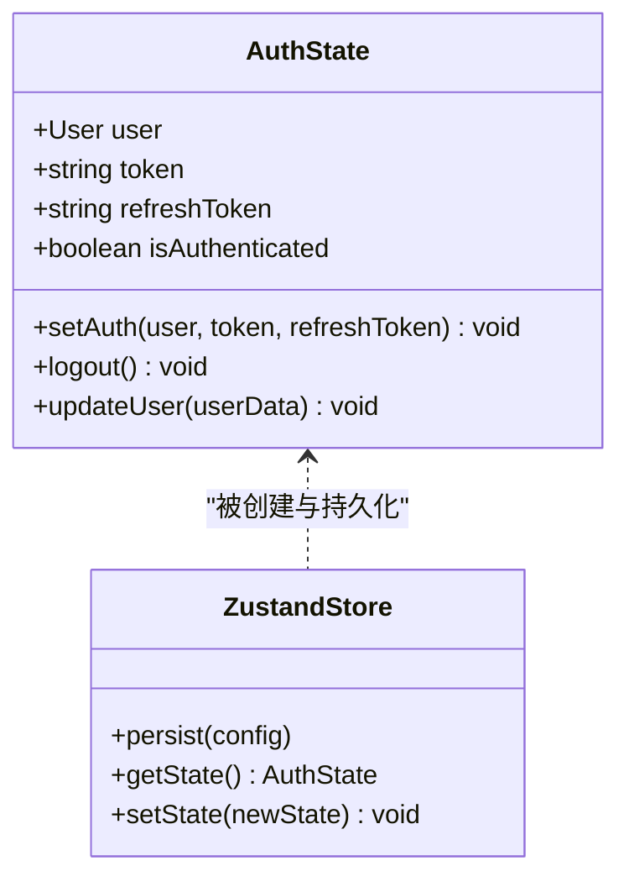
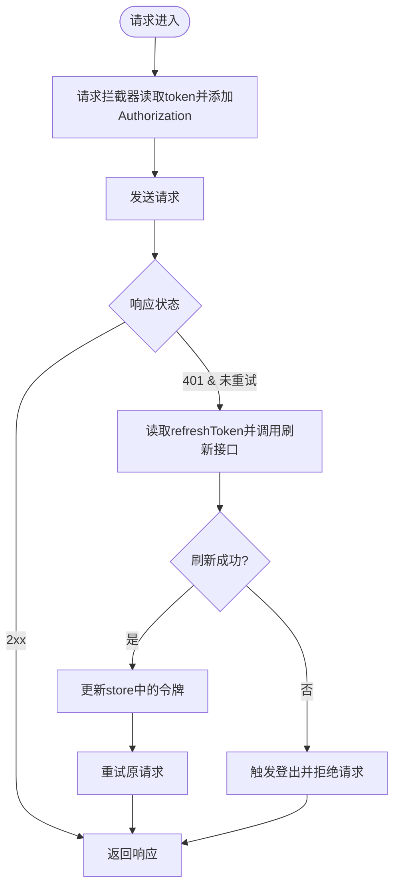
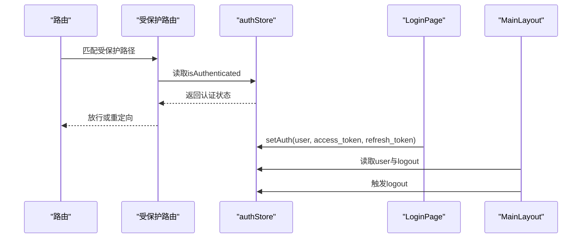
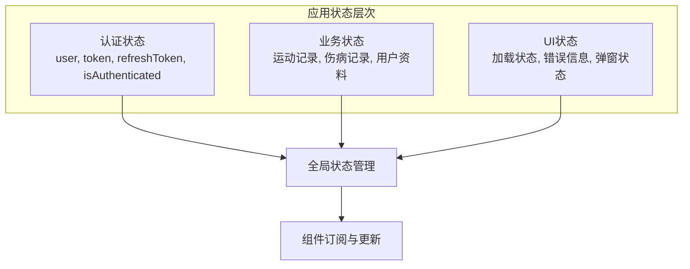
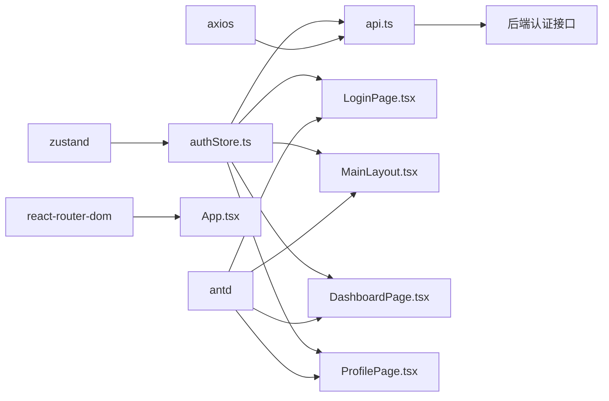

# 状态管理

<cite>
**本文档引用的文件**
- [authStore.ts](file://web/src/stores/authStore.ts)
- [api.ts](file://web/src/services/api.ts)
- [App.tsx](file://web/src/App.tsx)
- [LoginPage.tsx](file://web/src/pages/LoginPage.tsx)
- [MainLayout.tsx](file://web/src/components/MainLayout.tsx)
- [DashboardPage.tsx](file://web/src/pages/DashboardPage.tsx)
- [ProfilePage.tsx](file://web/src/pages/ProfilePage.tsx)
- [auth.py](file://backend/app/api/auth.py)
- [auth.py（后端schemas）](file://backend/app/schemas/auth.py)
- [package.json](file://web/package.json)
- [main.tsx](file://web/src/main.tsx)
</cite>

## 更新摘要
**所做更改**
- 新增应用状态管理章节，涵盖认证状态、用户信息和应用状态的集中式管理
- 扩展状态持久化机制说明，包括本地存储集成策略
- 增加状态同步与错误处理的最佳实践指导
- 完善与React Hooks的集成方式和状态订阅模式
- 补充性能优化和调试技巧的具体实施方案

## 目录
1. [简介](#简介)
2. [项目结构](#项目结构)
3. [核心组件](#核心组件)
4. [架构总览](#架构总览)
5. [详细组件分析](#详细组件分析)
6. [应用状态管理](#应用状态管理)
7. [依赖关系分析](#依赖关系分析)
8. [性能考量](#性能考量)
9. [故障排查指南](#故障排查指南)
10. [结论](#结论)
11. [附录](#附录)

## 简介
本文件聚焦于ActiveSynapse前端的状态管理，特别是认证状态管理模块（authStore）。内容涵盖：
- 认证状态的数据结构与生命周期
- 登录、登出、令牌刷新与用户信息更新的操作流程
- 本地持久化与状态同步策略
- 与React Hooks的集成与订阅模式
- 错误处理与异常恢复机制
- 最佳实践、性能优化与调试技巧

## 项目结构
前端采用Vite + React + TypeScript构建，状态管理使用Zustand，HTTP请求通过Axios封装并配置拦截器。认证状态由独立的store集中管理，并在路由层进行鉴权保护。

**图表来源**
- [App.tsx:1-48](file://web/src/App.tsx#L1-L48)
- [authStore.ts:1-52](file://web/src/stores/authStore.ts#L1-L52)
- [api.ts:1-108](file://web/src/services/api.ts#L1-L108)
- [LoginPage.tsx:1-93](file://web/src/pages/LoginPage.tsx#L1-L93)
- [MainLayout.tsx:1-121](file://web/src/components/MainLayout.tsx#L1-L121)
- [DashboardPage.tsx:1-118](file://web/src/pages/DashboardPage.tsx#L1-L118)
- [ProfilePage.tsx:1-137](file://web/src/pages/ProfilePage.tsx#L1-L137)
- [auth.py:1-92](file://backend/app/api/auth.py#L1-L92)
- [auth.py（后端schemas）:1-35](file://backend/app/schemas/auth.py#L1-L35)

**章节来源**
- [package.json:1-37](file://web/package.json#L1-L37)
- [main.tsx:1-15](file://web/src/main.tsx#L1-L15)

## 核心组件
- 认证状态存储：基于Zustand的authStore，提供用户信息、访问令牌、刷新令牌与认证状态标志，并支持持久化到本地存储。
- HTTP服务封装：Axios实例与请求/响应拦截器，自动注入Authorization头并在401时尝试刷新令牌。
- 路由守卫：受保护路由组件根据认证状态决定是否放行。
- 页面与组件：登录页触发登录流程并写入状态；布局组件展示用户信息并提供登出入口；仪表板和资料页展示应用状态管理效果。

**章节来源**
- [authStore.ts:1-52](file://web/src/stores/authStore.ts#L1-L52)
- [api.ts:1-108](file://web/src/services/api.ts#L1-L108)
- [App.tsx:14-18](file://web/src/App.tsx#L14-L18)
- [LoginPage.tsx:10-29](file://web/src/pages/LoginPage.tsx#L10-L29)
- [MainLayout.tsx:17-56](file://web/src/components/MainLayout.tsx#L17-L56)

## 架构总览
下图展示了从用户登录到API调用、令牌刷新与状态同步的完整流程。

**图表来源**
- [LoginPage.tsx:15-29](file://web/src/pages/LoginPage.tsx#L15-L29)
- [api.ts:68-80](file://web/src/services/api.ts#L68-L80)
- [api.ts:13-64](file://web/src/services/api.ts#L13-L64)
- [authStore.ts:21-51](file://web/src/stores/authStore.ts#L21-L51)
- [auth.py:25-49](file://backend/app/api/auth.py#L25-L49)

## 详细组件分析

### 认证状态存储（authStore）
- 数据结构
  - 用户信息：包含唯一标识、用户名、邮箱与可选头像URL。
  - 认证令牌：访问令牌与刷新令牌。
  - 认证状态：布尔值表示当前是否已认证。
- 操作方法
  - setAuth：设置用户、访问令牌与刷新令牌，并标记为已认证。
  - logout：清空用户、令牌与认证状态。
  - updateUser：对用户信息进行部分更新。
- 持久化策略
  - 使用Zustand中间件persist，默认存储键名为"auth-storage"，实现浏览器本地存储的自动同步。
- 状态订阅
  - 组件通过直接解构store返回的字段或使用选择器订阅所需字段，避免不必要的重渲染。

**图表来源**
- [authStore.ts:4-19](file://web/src/stores/authStore.ts#L4-L19)
- [authStore.ts:21-51](file://web/src/stores/authStore.ts#L21-L51)

**章节来源**
- [authStore.ts:1-52](file://web/src/stores/authStore.ts#L1-L52)

### HTTP服务与拦截器（api.ts）
- 请求拦截器
  - 在每个请求前读取当前token并添加到Authorization头。
- 响应拦截器
  - 当收到401且未重试过时，读取refreshToken并调用后端刷新接口。
  - 成功刷新后，更新store中的令牌并重试原请求；失败则触发登出并拒绝请求。
- API封装
  - 提供authApi、userApi、sportApi、injuryApi等命名空间，统一管理各模块的REST接口。

**图表来源**
- [api.ts:13-25](file://web/src/services/api.ts#L13-L25)
- [api.ts:27-64](file://web/src/services/api.ts#L27-L64)

**章节来源**
- [api.ts:1-108](file://web/src/services/api.ts#L1-L108)

### 路由守卫与页面集成（App.tsx、LoginPage.tsx、MainLayout.tsx）
- 受保护路由
  - 通过高阶组件模式，读取store中的isAuthenticated决定是否渲染子组件或跳转到登录页。
- 登录页
  - 调用authApi.login，接收后端返回的令牌与用户信息，调用setAuth写入store并导航。
- 布局组件
  - 展示当前用户信息与头像，提供下拉菜单中的"我的资料"与"登出"入口；点击登出调用store.logout并导航回登录页。

**图表来源**
- [App.tsx:14-18](file://web/src/App.tsx#L14-L18)
- [LoginPage.tsx:15-29](file://web/src/pages/LoginPage.tsx#L15-L29)
- [MainLayout.tsx:21-56](file://web/src/components/MainLayout.tsx#L21-L56)
- [authStore.ts:29-41](file://web/src/stores/authStore.ts#L29-L41)

**章节来源**
- [App.tsx:14-18](file://web/src/App.tsx#L14-L18)
- [LoginPage.tsx:10-29](file://web/src/pages/LoginPage.tsx#L10-L29)
- [MainLayout.tsx:17-56](file://web/src/components/MainLayout.tsx#L17-L56)

### 后端认证接口（FastAPI）
- 登录接口：校验凭据并返回访问令牌、刷新令牌与用户信息。
- 刷新接口：验证刷新令牌并签发新的访问令牌与刷新令牌。
- 注册接口：创建新用户并返回用户信息。
- 登出接口：返回登出成功消息（客户端负责清理本地令牌）。

**章节来源**
- [auth.py:17-49](file://backend/app/api/auth.py#L17-L49)
- [auth.py:52-85](file://backend/app/api/auth.py#L52-L85)
- [auth.py（后端schemas）:6-31](file://backend/app/schemas/auth.py#L6-L31)

## 应用状态管理

### 状态层次结构
ActiveSynapse采用分层状态管理模式，将应用状态分为三个层次：

- **认证层**：管理用户认证状态、令牌和用户信息
- **业务层**：管理具体业务数据（运动记录、伤病记录等）
- **UI层**：管理界面状态和交互反馈

### 状态同步机制
- **自动同步**：通过Zustand的persist中间件实现本地存储与内存状态的双向同步
- **事件驱动**：状态变更通过store的订阅机制通知相关组件
- **一致性保证**：在请求拦截器中确保令牌的一致性和有效性

### 应用状态集成
- **仪表板状态**：DashboardPage通过sportApi和injuryApi获取统计数据，实时更新UI
- **用户状态**：ProfilePage通过userApi获取和更新用户信息，支持updateUser操作
- **导航状态**：MainLayout根据认证状态动态调整菜单和用户信息显示

**章节来源**
- [DashboardPage.tsx:1-118](file://web/src/pages/DashboardPage.tsx#L1-L118)
- [ProfilePage.tsx:1-137](file://web/src/pages/ProfilePage.tsx#L1-L137)
- [MainLayout.tsx:17-56](file://web/src/components/MainLayout.tsx#L17-L56)

## 依赖关系分析
- 状态管理：Zustand作为轻量级状态库，提供简单易用的API与良好的TS支持。
- HTTP通信：Axios提供拦截器能力，便于统一处理认证与错误。
- UI框架：Ant Design提供丰富的UI组件与主题能力。
- 路由：React Router用于页面导航与受保护路由。

**图表来源**
- [authStore.ts:1-2](file://web/src/stores/authStore.ts#L1-L2)
- [api.ts:1-2](file://web/src/services/api.ts#L1-L2)
- [App.tsx:1-10](file://web/src/App.tsx#L1-L10)
- [LoginPage.tsx:1-6](file://web/src/pages/LoginPage.tsx#L1-L6)
- [MainLayout.tsx:1-3](file://web/src/components/MainLayout.tsx#L1-L3)
- [DashboardPage.tsx:1-6](file://web/src/pages/DashboardPage.tsx#L1-L6)
- [ProfilePage.tsx:1-6](file://web/src/pages/ProfilePage.tsx#L1-L6)
- [package.json:12-22](file://web/package.json#L12-L22)

**章节来源**
- [package.json:12-22](file://web/package.json#L12-L22)

## 性能考量
- **状态粒度与订阅**
  - 避免在组件中订阅整块状态，仅订阅需要的字段，减少不必要的重渲染。
  - 对于频繁更新的字段（如用户头像），可考虑拆分状态以降低抖动。
- **持久化策略**
  - 使用Zustand的persist中间件时，注意只持久化必要字段，避免存储大型对象导致本地存储膨胀。
- **请求拦截器**
  - 在请求拦截器中尽量避免昂贵计算，保持token读取与头注入的轻量性。
- **缓存与重试**
  - 响应拦截器中对401的重试逻辑应限制重试次数与并发，防止风暴效应。
- **组件优化**
  - 使用React.memo、useMemo、useCallback等工具减少子组件重渲染。
  - Ant Design组件按需加载与主题定制，避免无谓的样式计算。
- **状态更新优化**
  - 使用选择器函数订阅特定状态片段，避免全状态重渲染
  - 合理使用immer更新函数，确保不可变性的同时提高性能

## 故障排查指南
- **登录后无法访问受保护资源**
  - 检查请求拦截器是否正确读取并附加Authorization头。
  - 确认store中的token与refreshToken是否正确写入。
- **401频繁出现**
  - 检查刷新逻辑是否正常执行，确认后端刷新接口可用。
  - 排查refreshToken是否为空或已失效。
- **登出后仍可访问**
  - 确认响应拦截器在刷新失败时调用了logout。
  - 检查store持久化是否被意外保留。
- **用户信息未更新**
  - 确认updateUser调用是否传入了正确的字段。
  - 检查后端用户信息接口返回的数据结构是否匹配。
- **状态不同步问题**
  - 检查persist中间件配置，确认存储键名一致。
  - 验证多标签页间的localStorage同步机制。
- **内存泄漏排查**
  - 确认组件卸载时正确清理store订阅。
  - 检查定时器和事件监听器的清理。

**章节来源**
- [api.ts:33-60](file://web/src/services/api.ts#L33-L60)
- [authStore.ts:43-45](file://web/src/stores/authStore.ts#L43-L45)

## 结论
ActiveSynapse前端通过Zustand集中管理认证状态，结合Axios拦截器实现了自动令牌注入与刷新，配合受保护路由完成权限控制。该方案简洁高效，具备良好的扩展性与维护性。通过分层状态管理、状态同步机制和性能优化策略，系统能够有效处理复杂的业务场景。建议在后续迭代中进一步细化状态粒度、增强错误边界与日志追踪，并引入更完善的令牌安全策略（如HttpOnly Cookie、CSRF防护等）以提升安全性。

## 附录
- **状态字段说明**
  - user：当前登录用户信息，包含id、username、email、avatar_url。
  - token：访问令牌，用于API请求的身份验证。
  - refreshToken：刷新令牌，用于换取新的访问令牌。
  - isAuthenticated：认证状态标志，用于路由守卫与UI显示。
- **常用操作**
  - setAuth：登录成功后写入用户与令牌。
  - logout：登出时清空所有认证相关状态。
  - updateUser：更新用户信息（如头像、昵称等）。
- **本地存储**
  - 默认持久化键名：auth-storage。可通过Zustand persist配置自定义存储位置与序列化策略。
- **最佳实践**
  - 使用类型安全的状态访问模式
  - 实现状态变更的日志记录
  - 建立状态快照和回滚机制
  - 实施状态迁移策略以兼容版本升级

**章节来源**
- [authStore.ts:4-19](file://web/src/stores/authStore.ts#L4-L19)
- [authStore.ts:47-50](file://web/src/stores/authStore.ts#L47-L50)