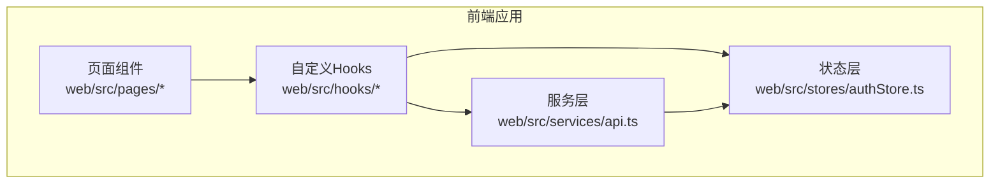
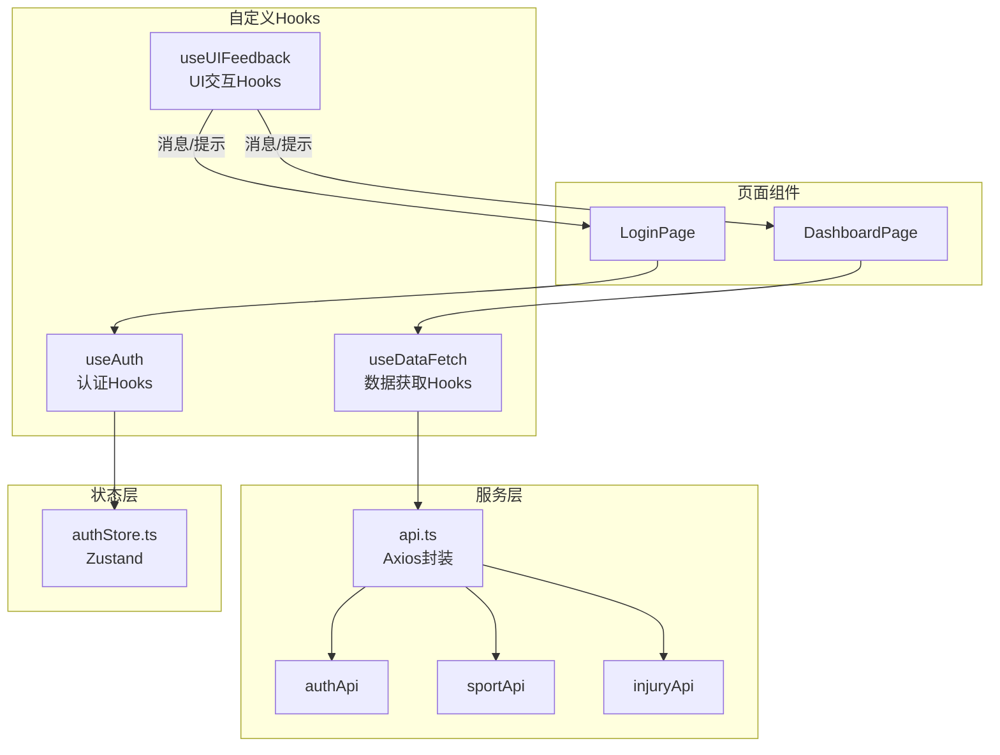
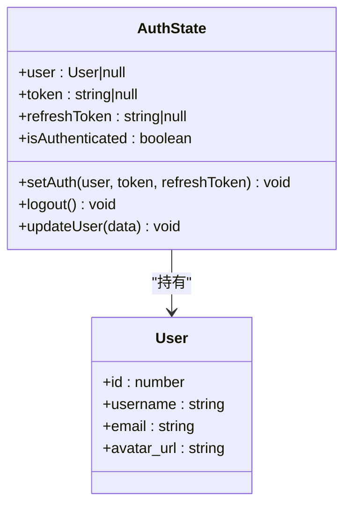
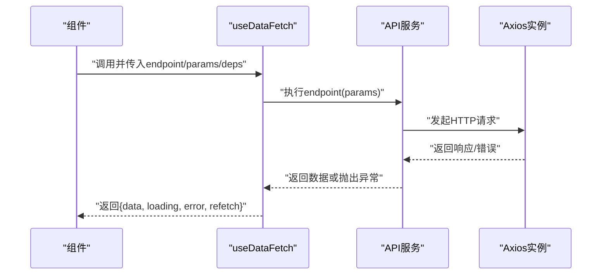
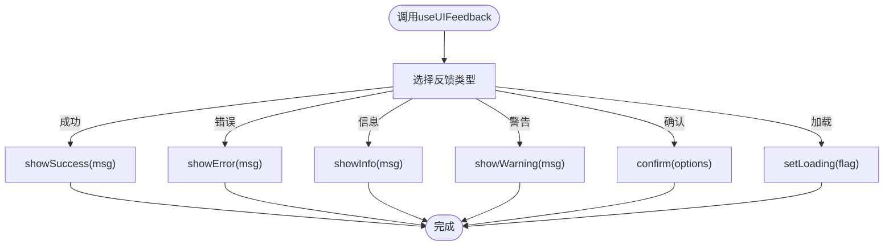
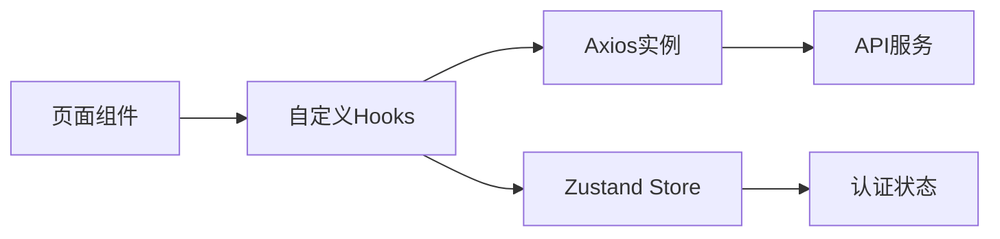
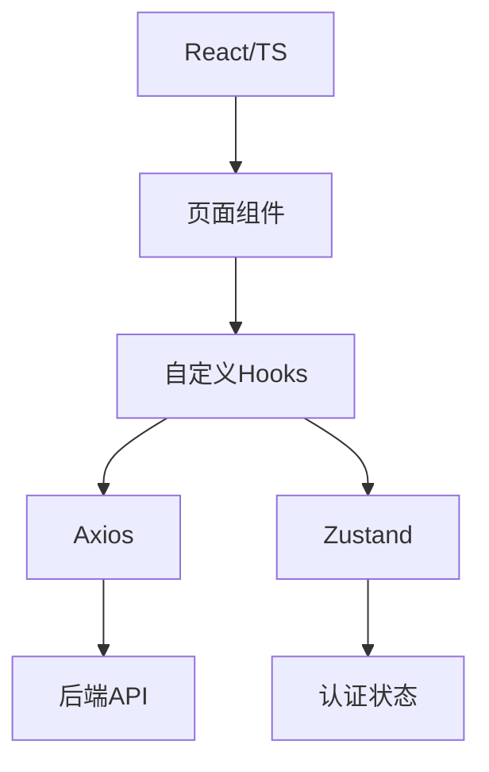

# 自定义Hooks

<cite>
**本文引用的文件**
- [web/package.json](file://web/package.json)
- [web/src/stores/authStore.ts](file://web/src/stores/authStore.ts)
- [web/src/services/api.ts](file://web/src/services/api.ts)
- [web/src/pages/LoginPage.tsx](file://web/src/pages/LoginPage.tsx)
- [web/src/pages/DashboardPage.tsx](file://web/src/pages/DashboardPage.tsx)
</cite>

## 目录
1. [简介](#简介)
2. [项目结构](#项目结构)
3. [核心组件](#核心组件)
4. [架构总览](#架构总览)
5. [详细组件分析](#详细组件分析)
6. [依赖分析](#依赖分析)
7. [性能考虑](#性能考虑)
8. [故障排查指南](#故障排查指南)
9. [结论](#结论)
10. [附录](#附录)

## 简介
本文件面向ActiveSynapse前端（React + TypeScript）的自定义Hooks设计与实现，结合现有代码库中的状态管理与数据访问层，系统性阐述以下主题：
- 设计理念：关注可复用性、单一职责、副作用隔离与可测试性
- 实现方式：基于Zustand的状态管理与Axios封装的API服务
- 使用场景：认证态管理、数据获取、UI交互与错误处理
- 参数配置、返回值结构与副作用处理
- 最佳实践、性能优化与错误处理
- 与组件的集成方式与依赖管理
- 测试策略与调试方法

## 项目结构
ActiveSynapse前端采用分层组织：
- stores：集中式状态管理（Zustand）
- services：HTTP客户端与API封装（Axios）
- pages：页面级组件（展示逻辑与副作用）
- hooks：建议新增的自定义Hooks目录（本文件将给出设计蓝图）

**图表来源**
- [web/src/pages/LoginPage.tsx](file://web/src/pages/LoginPage.tsx#L1-L93)
- [web/src/pages/DashboardPage.tsx](file://web/src/pages/DashboardPage.tsx#L1-L118)
- [web/src/services/api.ts](file://web/src/services/api.ts#L1-L108)
- [web/src/stores/authStore.ts](file://web/src/stores/authStore.ts#L1-L52)

**章节来源**
- [web/package.json](file://web/package.json#L1-L37)

## 核心组件
- 认证状态管理（Zustand）
  - 职责：维护用户信息、令牌与登录态
  - 关键接口：设置认证、登出、更新用户信息
  - 存储策略：持久化到本地存储
- API服务封装（Axios）
  - 职责：统一请求/响应拦截器、自动注入令牌、刷新令牌与重试
  - 模块划分：认证、用户、运动记录、伤情记录等API模块

**章节来源**
- [web/src/stores/authStore.ts](file://web/src/stores/authStore.ts#L1-L52)
- [web/src/services/api.ts](file://web/src/services/api.ts#L1-L108)

## 架构总览
下图展示了页面组件、自定义Hooks与服务层之间的交互关系。

**图表来源**
- [web/src/pages/LoginPage.tsx](file://web/src/pages/LoginPage.tsx#L1-L93)
- [web/src/pages/DashboardPage.tsx](file://web/src/pages/DashboardPage.tsx#L1-L118)
- [web/src/services/api.ts](file://web/src/services/api.ts#L1-L108)
- [web/src/stores/authStore.ts](file://web/src/stores/authStore.ts#L1-L52)

## 详细组件分析

### 设计理念与通用模式
- 可复用性：将跨页面的业务逻辑抽取为Hooks，避免重复代码
- 单一职责：每个Hooks聚焦一个领域（认证、数据、UI）
- 副作用隔离：通过自定义Hooks封装异步与副作用，保持组件简洁
- 可测试性：暴露稳定的输入输出，便于单元测试与集成测试

### 认证Hooks（useAuth）
- 设计目标：封装认证态读取、设置、更新与登出
- 输入参数
  - 无显式参数；内部通过Zustand store读取/写入
- 返回值结构
  - user: 用户对象或空
  - token: 访问令牌或空
  - refreshToken: 刷新令牌或空
  - isAuthenticated: 是否已认证
  - setAuth(user, access_token, refresh_token): 设置认证态
  - logout(): 清空认证态
  - updateUser(partialUser): 更新用户信息
- 副作用处理
  - setAuth：写入store并标记已认证
  - logout：清空store并标记未认证
  - updateUser：合并部分字段更新
- 使用场景
  - 登录页提交后设置认证态
  - 需要判断登录态的页面与导航
  - 用户资料修改后的状态同步

**图表来源**
- [web/src/stores/authStore.ts](file://web/src/stores/authStore.ts#L4-L19)

**章节来源**
- [web/src/stores/authStore.ts](file://web/src/stores/authStore.ts#L21-L51)

### 数据获取Hooks（useDataFetch）
- 设计目标：封装数据获取的加载、错误与缓存逻辑
- 输入参数
  - endpoint: API端点函数（如 sportApi.getStatistics）
  - params?: 查询参数
  - deps?: 依赖数组（用于触发重新获取）
- 返回值结构
  - data: 获取的数据对象或空
  - loading: 加载状态
  - error: 错误对象或空
  - refetch(): 重新获取数据
- 副作用处理
  - 在依赖变化时触发请求
  - 请求前设置loading=true，完成后恢复
  - 捕获错误并设置error
- 使用场景
  - 仪表盘统计、周汇总、伤情概要
  - 列表页分页加载
  - 表单提交后的列表刷新

**图表来源**
- [web/src/services/api.ts](file://web/src/services/api.ts#L68-L108)
- [web/src/pages/DashboardPage.tsx](file://web/src/pages/DashboardPage.tsx#L16-L33)

**章节来源**
- [web/src/pages/DashboardPage.tsx](file://web/src/pages/DashboardPage.tsx#L1-L118)
- [web/src/services/api.ts](file://web/src/services/api.ts#L68-L108)

### UI交互Hooks（useUIFeedback）
- 设计目标：统一处理消息提示、确认对话框与加载状态
- 输入参数
  - options?: 配置项（如默认成功/失败消息模板）
- 返回值结构
  - showSuccess(msg): 显示成功消息
  - showError(msg): 显示错误消息
  - showInfo(msg): 显示信息消息
  - showWarning(msg): 显示警告消息
  - confirm(options): 弹出确认对话框
  - setLoading(flag): 设置全局/局部加载状态
- 副作用处理
  - 基于Ant Design的消息组件进行提示
  - 基于Ant Design的Modal组件进行确认
- 使用场景
  - 登录、注册、更新资料后的反馈
  - 删除、提交表单前的确认
  - 大批量操作的进度提示

**图表来源**
- [web/src/pages/LoginPage.tsx](file://web/src/pages/LoginPage.tsx#L15-L29)

**章节来源**
- [web/src/pages/LoginPage.tsx](file://web/src/pages/LoginPage.tsx#L1-L93)

### 与组件的集成方式与依赖管理
- 组件通过自定义Hooks与服务层解耦
- Hooks内部依赖Zustand store与Axios实例
- 依赖管理建议
  - 将API服务作为外部依赖注入到Hooks
  - 将store作为外部依赖注入到认证Hooks
  - 使用依赖倒置原则，便于测试替身

**图表来源**
- [web/src/services/api.ts](file://web/src/services/api.ts#L1-L108)
- [web/src/stores/authStore.ts](file://web/src/stores/authStore.ts#L1-L52)

## 依赖分析
- 技术栈
  - React + TypeScript
  - Zustand（状态管理）
  - Axios（HTTP客户端）
  - Ant Design（UI组件库）
- 依赖关系
  - 页面组件依赖自定义Hooks
  - 自定义Hooks依赖服务层与状态层
  - 服务层依赖Axios与Zustand store

**图表来源**
- [web/package.json](file://web/package.json#L12-L23)
- [web/src/services/api.ts](file://web/src/services/api.ts#L1-L108)
- [web/src/stores/authStore.ts](file://web/src/stores/authStore.ts#L1-L52)

**章节来源**
- [web/package.json](file://web/package.json#L1-L37)

## 性能考虑
- 数据获取
  - 合理使用并发请求（Promise.all）减少等待时间
  - 对频繁查询增加防抖/节流
  - 缓存热点数据，避免重复请求
- 状态管理
  - 将大对象拆分为细粒度store，降低重渲染范围
  - 使用selector精确订阅所需字段
- UI交互
  - 批量消息提示，避免频繁弹窗
  - 使用骨架屏或占位符提升感知性能

## 故障排查指南
- 认证失败
  - 检查令牌是否正确注入到请求头
  - 确认刷新令牌流程是否触发
  - 查看拦截器对401的处理逻辑
- 数据获取失败
  - 检查API端点与参数
  - 观察错误返回码与消息
  - 确认网络与跨域配置
- UI反馈异常
  - 确认Ant Design组件版本与样式引入
  - 检查消息组件的容器与层级

**章节来源**
- [web/src/services/api.ts](file://web/src/services/api.ts#L13-L64)
- [web/src/pages/LoginPage.tsx](file://web/src/pages/LoginPage.tsx#L15-L29)

## 结论
通过在现有Zustand与Axios基础上引入自定义Hooks，可以显著提升ActiveSynapse前端的可维护性与可测试性。建议优先实现认证、数据获取与UI交互三类Hooks，并将其作为页面组件的稳定依赖，逐步替换页面内的重复逻辑。

## 附录

### Hooks使用最佳实践
- 输入校验：对输入参数进行类型与边界校验
- 错误处理：区分网络错误、业务错误与用户取消
- 并发控制：避免竞态条件，使用取消令牌或最新请求优先
- 缓存策略：合理设置TTL与失效规则
- 日志与监控：记录关键事件与错误堆栈

### 测试策略与调试方法
- 单元测试
  - 使用测试框架模拟Axios与Zustand store
  - 验证不同输入下的返回值与副作用
- 集成测试
  - 搭建Mock API服务器，验证端到端流程
- 调试技巧
  - 使用React DevTools追踪组件渲染
  - 使用Zustand DevTools观察状态变化
  - 使用浏览器Network面板检查请求与响应