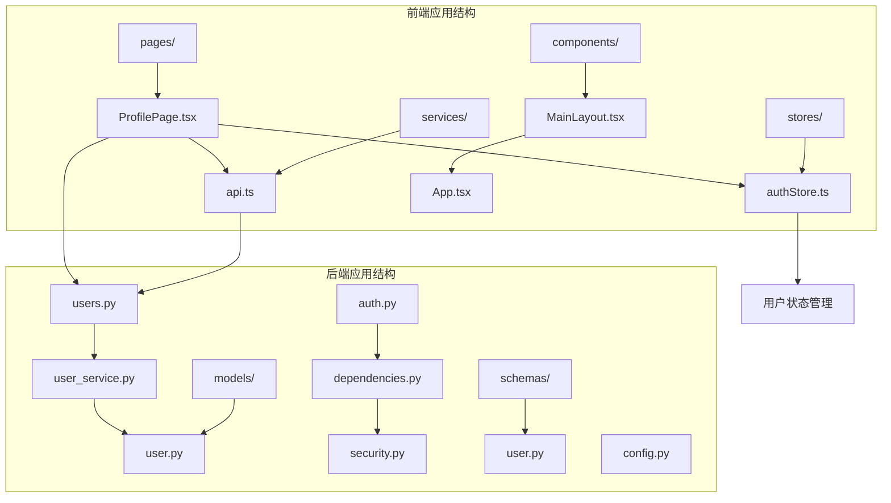
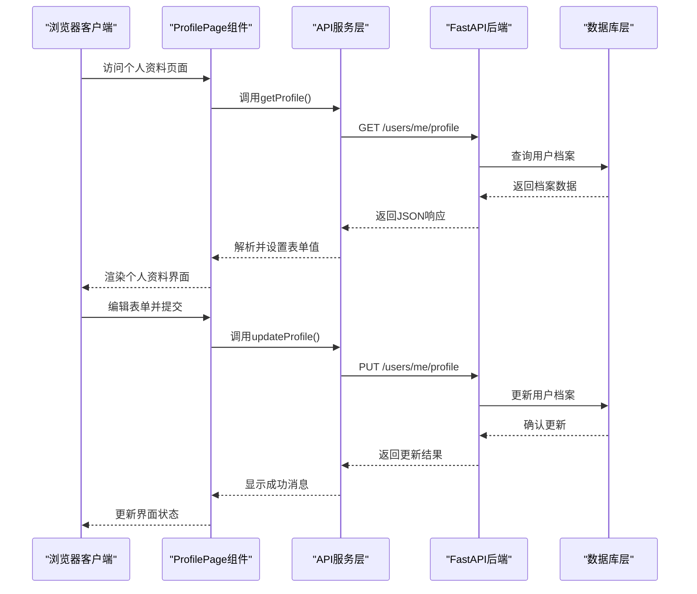
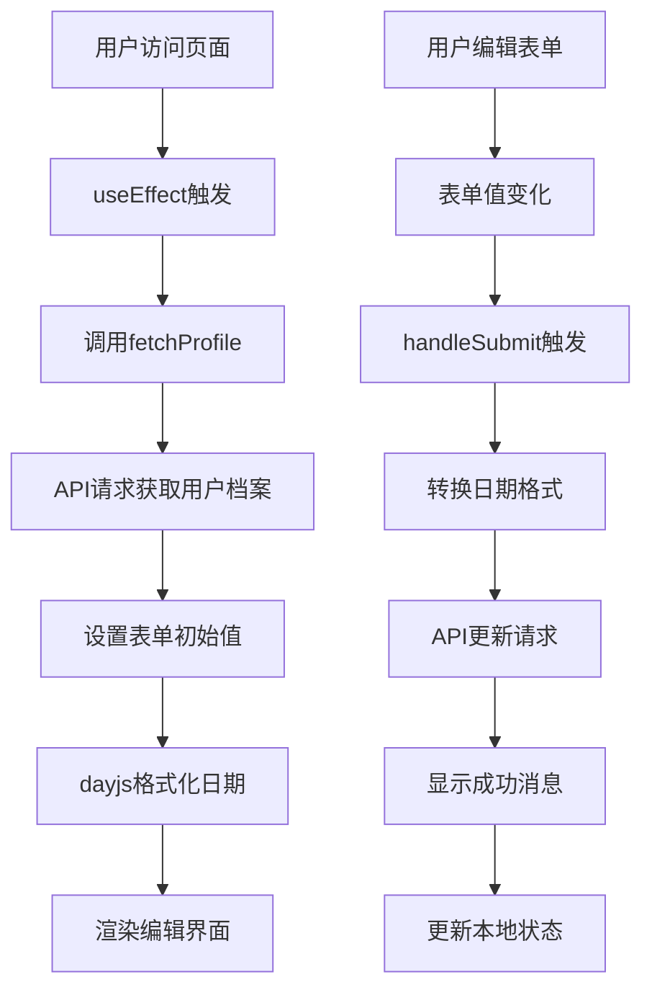
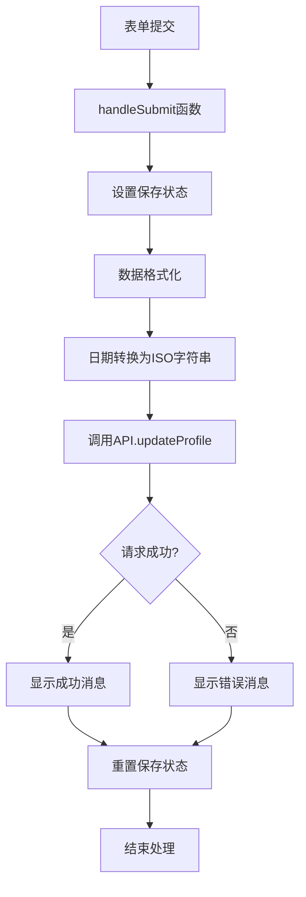
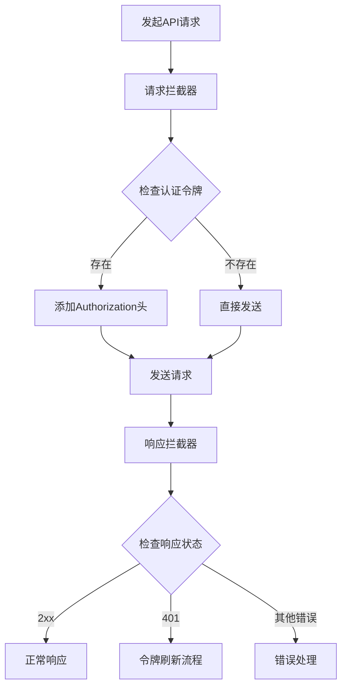
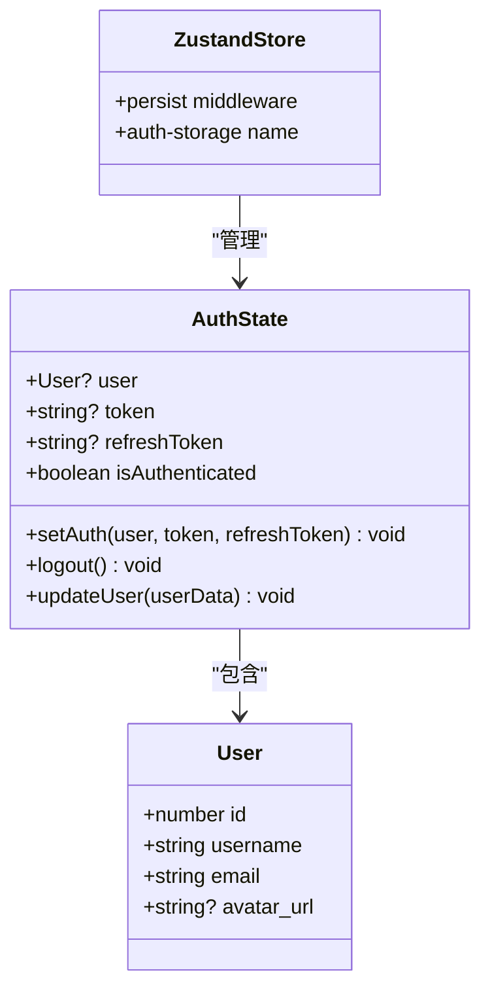
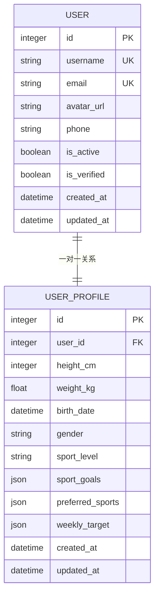
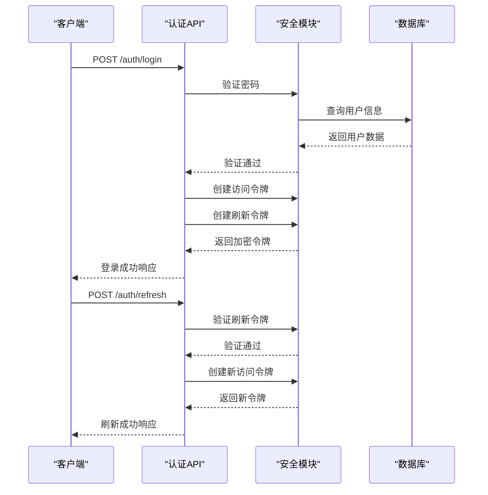
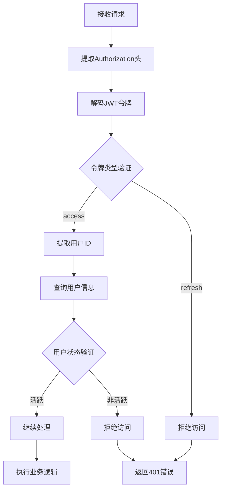
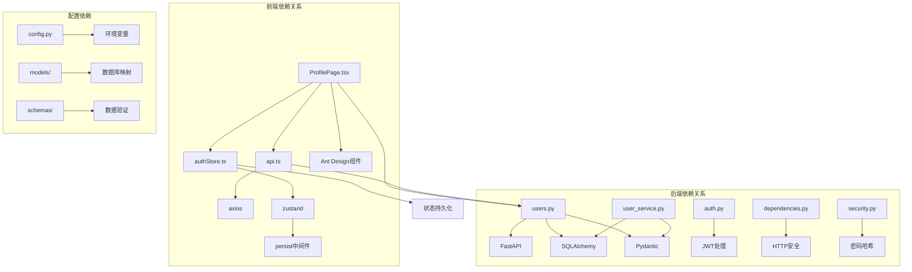

# 个人资料管理

<cite>
**本文档引用的文件**
- [ProfilePage.tsx](file://web/src/pages/ProfilePage.tsx)
- [api.ts](file://web/src/services/api.ts)
- [authStore.ts](file://web/src/stores/authStore.ts)
- [users.py](file://backend/app/api/users.py)
- [user_service.py](file://backend/app/services/user_service.py)
- [user.py](file://backend/app/models/user.py)
- [user.py](file://backend/app/schemas/user.py)
- [auth.py](file://backend/app/api/auth.py)
- [dependencies.py](file://backend/app/core/dependencies.py)
- [security.py](file://backend/app/core/security.py)
- [App.tsx](file://web/src/App.tsx)
- [MainLayout.tsx](file://web/src/components/MainLayout.tsx)
</cite>

## 更新摘要
**变更内容**
- 更新了ProfilePage组件的详细功能说明，包含完整的用户档案编辑功能
- 新增了运动偏好设置和目标调整的完整实现细节
- 完善了后端用户档案模型和API端点的文档
- 增强了数据绑定、表单验证和提交处理的技术细节
- 补充了头像上传功能的占位符实现说明

## 目录
1. [简介](#简介)
2. [项目结构](#项目结构)
3. [核心组件](#核心组件)
4. [架构概览](#架构概览)
5. [详细组件分析](#详细组件分析)
6. [依赖关系分析](#依赖关系分析)
7. [性能考虑](#性能考虑)
8. [故障排除指南](#故障排除指南)
9. [结论](#结论)

## 简介

ActiveSynapse个人资料管理页面是一个完整的用户信息管理系统，提供了用户基本信息展示、编辑表单和数据更新的完整功能。该系统采用前后端分离架构，前端使用React + Ant Design构建用户界面，后端使用FastAPI提供RESTful API服务。

**更新** 该页面现已包含完整的用户档案编辑功能，支持运动偏好设置、目标调整和完整的个人信息管理。

本页面支持以下核心功能：
- 用户基本信息展示（用户名、邮箱）
- 个人运动档案编辑（身高、体重、生日、性别等）
- 运动偏好设置（运动水平、目标、偏爱运动）
- 头像上传功能（占位符实现）
- 实时数据同步和状态管理
- 完整的错误处理和用户体验优化

## 项目结构

个人资料管理页面位于Web前端应用中，采用模块化组织方式：

**图表来源**
- [ProfilePage.tsx:1-137](file://web/src/pages/ProfilePage.tsx#L1-L137)
- [api.ts:1-108](file://web/src/services/api.ts#L1-L108)
- [authStore.ts:1-52](file://web/src/stores/authStore.ts#L1-L52)

**章节来源**
- [ProfilePage.tsx:1-137](file://web/src/pages/ProfilePage.tsx#L1-L137)
- [App.tsx:1-48](file://web/src/App.tsx#L1-L48)

## 核心组件

### 前端组件架构

个人资料管理页面由多个核心组件构成，采用分层设计模式：

#### ProfilePage 组件
- **职责**：主要的个人资料管理界面
- **功能**：加载用户信息、渲染编辑表单、处理数据提交
- **状态管理**：使用Ant Design Form Hook进行表单状态管理
- **更新**：支持完整的运动偏好设置和目标调整功能

#### API 服务层
- **职责**：封装HTTP请求，处理认证令牌
- **功能**：用户信息获取、个人资料更新、头像上传
- **拦截器**：自动添加认证头，处理令牌刷新

#### 状态管理
- **职责**：管理用户认证状态和全局应用状态
- **功能**：用户信息持久化、认证令牌存储
- **存储**：基于Zustand的状态管理库

**章节来源**
- [ProfilePage.tsx:10-137](file://web/src/pages/ProfilePage.tsx#L10-L137)
- [api.ts:68-88](file://web/src/services/api.ts#L68-L88)
- [authStore.ts:21-51](file://web/src/stores/authStore.ts#L21-L51)

## 架构概览

系统采用经典的MVC架构模式，前后端分离设计：

**图表来源**
- [ProfilePage.tsx:20-52](file://web/src/pages/ProfilePage.tsx#L20-L52)
- [api.ts:82-88](file://web/src/services/api.ts#L82-L88)
- [users.py:51-71](file://backend/app/api/users.py#L51-L71)

## 详细组件分析

### ProfilePage 组件详解

ProfilePage是个人资料管理的核心组件，实现了完整的CRUD操作：

#### 数据绑定机制
组件使用Ant Design的Form组件进行双向数据绑定：

**图表来源**
- [ProfilePage.tsx:16-52](file://web/src/pages/ProfilePage.tsx#L16-L52)

#### 表单字段定义
组件包含以下关键字段：

| 字段名 | 类型 | 验证规则 | 描述 |
|--------|------|----------|------|
| height_cm | InputNumber | min=50, max=300 | 身高（厘米） |
| weight_kg | InputNumber | min=20, max=300, step=0.1 | 体重（公斤） |
| birth_date | DatePicker | ISO格式转换 | 出生日期 |
| gender | Select | 必填选项 | 性别选择 |
| sport_level | Select | 预定义等级 | 运动水平 |
| sport_goals | Select(multiple) | 多选列表 | 运动目标 |
| preferred_sports | Select(multiple) | 多选列表 | 偏爱运动 |

**更新** 新增了完整的运动偏好设置字段，包括运动目标和偏爱运动的多选功能。

#### 提交处理流程

**图表来源**
- [ProfilePage.tsx:38-52](file://web/src/pages/ProfilePage.tsx#L38-L52)

**章节来源**
- [ProfilePage.tsx:10-137](file://web/src/pages/ProfilePage.tsx#L10-L137)

### API 服务层设计

API服务层提供了统一的HTTP请求接口，实现了完整的认证和错误处理机制：

#### 请求拦截器

**图表来源**
- [api.ts:13-64](file://web/src/services/api.ts#L13-L64)

#### 错误处理机制
API服务实现了智能的错误处理策略：

1. **认证错误处理**：自动检测401未授权错误
2. **令牌刷新**：在401错误时尝试刷新访问令牌
3. **用户登出**：刷新失败时自动登出用户
4. **请求重试**：刷新后重新发送原始请求

**章节来源**
- [api.ts:1-108](file://web/src/services/api.ts#L1-L108)

### 状态管理架构

应用使用Zustand实现轻量级状态管理：

#### 认证状态模型

**图表来源**
- [authStore.ts:4-45](file://web/src/stores/authStore.ts#L4-L45)

#### 状态持久化策略
- **存储位置**：浏览器本地存储
- **存储键名**：`auth-storage`
- **数据序列化**：自动JSON序列化
- **恢复机制**：应用启动时自动恢复

**章节来源**
- [authStore.ts:21-51](file://web/src/stores/authStore.ts#L21-L51)

### 后端API设计

后端采用FastAPI提供RESTful服务，实现了完整的用户管理功能：

#### 用户档案模型

**图表来源**
- [user.py:7-61](file://backend/app/models/user.py#L7-L61)

**更新** 用户档案模型现在包含完整的运动偏好设置字段，包括运动目标、偏爱运动和每周目标配置。

#### API端点设计
后端提供了以下关键API端点：

| 端点 | 方法 | 功能 | 认证要求 |
|------|------|------|----------|
| `/users/me` | GET | 获取当前用户信息 | 是 |
| `/users/me` | PUT | 更新用户信息 | 是 |
| `/users/me/profile` | GET | 获取用户档案 | 是 |
| `/users/me/profile` | PUT | 更新用户档案 | 是 |
| `/users/me/avatar` | POST | 上传头像 | 是 |

**章节来源**
- [users.py:13-87](file://backend/app/api/users.py#L13-L87)
- [user_service.py:97-119](file://backend/app/services/user_service.py#L97-L119)

### 安全认证机制

系统实现了完整的JWT认证和授权机制：

#### 令牌管理流程

**图表来源**
- [auth.py:25-85](file://backend/app/api/auth.py#L25-L85)
- [dependencies.py:11-50](file://backend/app/core/dependencies.py#L11-L50)

#### 中间件认证流程

**图表来源**
- [dependencies.py:11-60](file://backend/app/core/dependencies.py#L11-L60)

**章节来源**
- [auth.py:1-92](file://backend/app/api/auth.py#L1-L92)
- [dependencies.py:1-61](file://backend/app/core/dependencies.py#L1-L61)
- [security.py:1-50](file://backend/app/core/security.py#L1-L50)

## 依赖关系分析

系统各组件之间的依赖关系清晰明确：

**图表来源**
- [ProfilePage.tsx:1-6](file://web/src/pages/ProfilePage.tsx#L1-L6)
- [api.ts:1-11](file://web/src/services/api.ts#L1-L11)
- [authStore.ts:1-2](file://web/src/stores/authStore.ts#L1-L2)

### 外部依赖分析

#### 前端技术栈
- **React 18**：现代JavaScript框架
- **Ant Design**：企业级UI组件库
- **Axios**：HTTP客户端库
- **Day.js**：轻量级日期处理库
- **Zustand**：轻量级状态管理

#### 后端技术栈
- **FastAPI**：高性能Python Web框架
- **SQLAlchemy**：ORM对象关系映射
- **Pydantic**：数据验证和序列化
- **JWT**：JSON Web令牌认证
- **Passlib**：密码哈希处理

**章节来源**
- [ProfilePage.tsx:1-6](file://web/src/pages/ProfilePage.tsx#L1-L6)
- [api.ts:1-11](file://web/src/services/api.ts#L1-L11)
- [authStore.ts:1-2](file://web/src/stores/authStore.ts#L1-L2)

## 性能考虑

### 前端性能优化

#### 懒加载和代码分割
- 使用React.lazy实现组件懒加载
- Ant Design按需导入减少包体积
- Day.js替代Moment.js提升性能

#### 状态管理优化
- Zustand避免不必要的重渲染
- 持久化中间件只存储必要状态
- 局部状态更新减少全局重渲染

#### API调用优化
- 请求拦截器统一处理认证
- 自动令牌刷新避免频繁登录
- 错误缓存减少重复请求

### 后端性能优化

#### 数据库优化
- 异步数据库连接池
- 关系映射优化查询性能
- JSON字段索引提升查询效率

#### 缓存策略
- Redis缓存热门数据
- JWT令牌本地存储
- 前端状态持久化

#### 并发处理
- 异步API处理高并发请求
- 连接池管理数据库连接
- 令牌刷新避免阻塞请求

## 故障排除指南

### 常见问题及解决方案

#### 认证相关问题
**问题**：登录后无法访问受保护资源
**原因**：令牌过期或无效
**解决方案**：
1. 检查网络请求是否包含Authorization头
2. 验证JWT令牌格式和签名
3. 确认用户账户状态为活跃

#### 数据同步问题
**问题**：更新后界面未反映最新数据
**原因**：状态管理未正确更新
**解决方案**：
1. 确保updateProfile调用后更新本地状态
2. 检查useAuthStore的updateUser方法
3. 验证表单重置逻辑

#### 文件上传问题
**问题**：头像上传功能不可用
**原因**：后端占位符实现
**解决方案**：
1. 实现实际的文件存储服务
2. 添加文件类型和大小验证
3. 配置CDN或本地存储路径

#### API调用错误
**问题**：网络请求失败
**原因**：跨域或认证问题
**解决方案**：
1. 检查CORS配置
2. 验证API基础URL设置
3. 确认后端服务运行状态

### 调试技巧

#### 前端调试
- 使用浏览器开发者工具监控网络请求
- 在控制台输出关键状态变化
- 利用React DevTools检查组件状态

#### 后端调试
- 启用DEBUG模式获取详细日志
- 使用Postman测试API端点
- 检查数据库连接和查询性能

**章节来源**
- [api.ts:27-64](file://web/src/services/api.ts#L27-L64)
- [users.py:74-87](file://backend/app/api/users.py#L74-L87)

## 结论

ActiveSynapse个人资料管理页面是一个设计良好的全功能用户管理系统，具有以下特点：

### 技术优势
- **现代化架构**：前后端分离，模块化设计
- **完整功能**：涵盖用户信息管理的所有核心需求
- **良好扩展性**：清晰的代码结构便于功能扩展
- **用户体验**：流畅的交互和完善的错误处理

**更新** 系统现已提供完整的用户档案管理功能，包括运动偏好设置、目标调整和完整的个人信息编辑能力。

### 安全保障
- **JWT认证**：标准的令牌认证机制
- **权限控制**：严格的访问控制和用户状态验证
- **数据验证**：前后端双重数据验证
- **错误处理**：完善的异常处理和用户反馈

### 改进建议
1. **头像上传**：实现完整的文件上传和存储功能
2. **表单验证**：添加更详细的前端表单验证规则
3. **缓存策略**：实现更高效的前端数据缓存机制
4. **国际化**：支持多语言界面
5. **测试覆盖**：增加单元测试和集成测试

该系统为ActiveSynapse平台提供了坚实的用户管理基础，为后续功能扩展奠定了良好的技术基础。