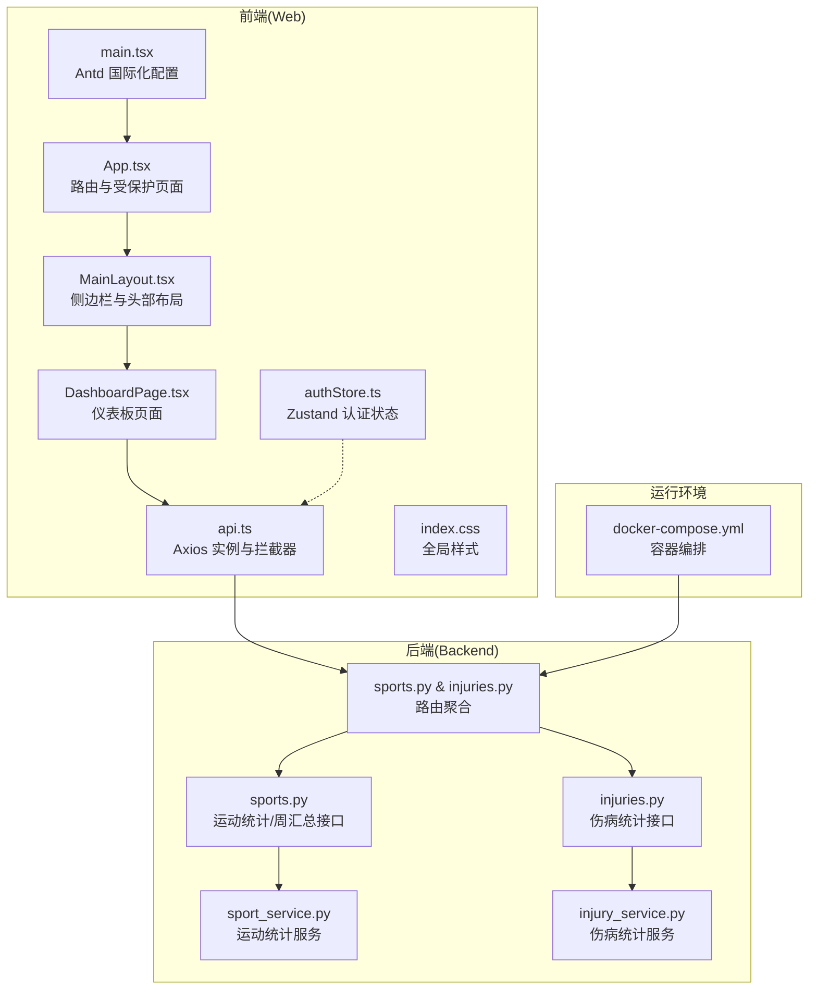
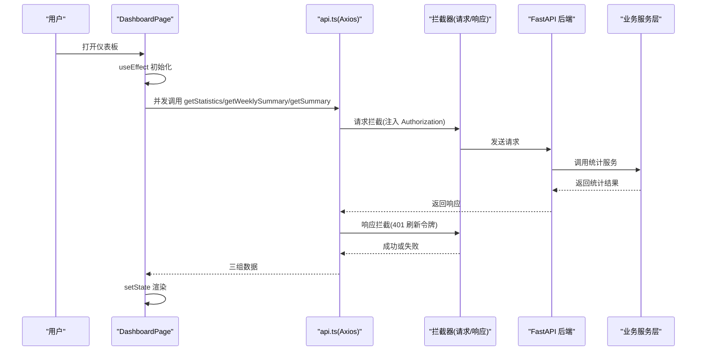
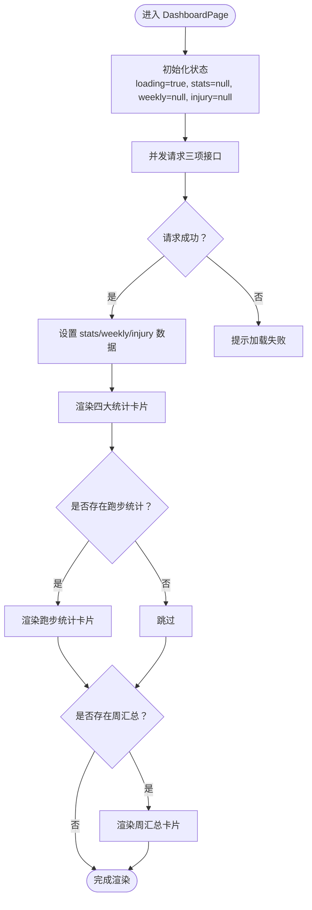
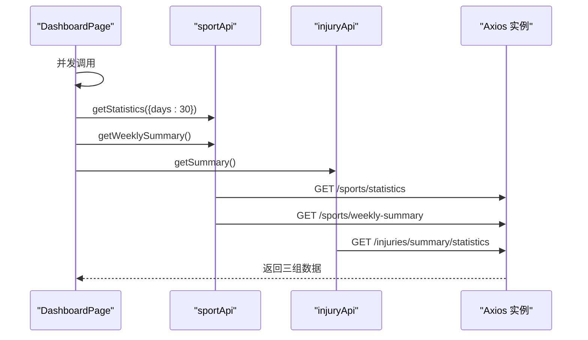
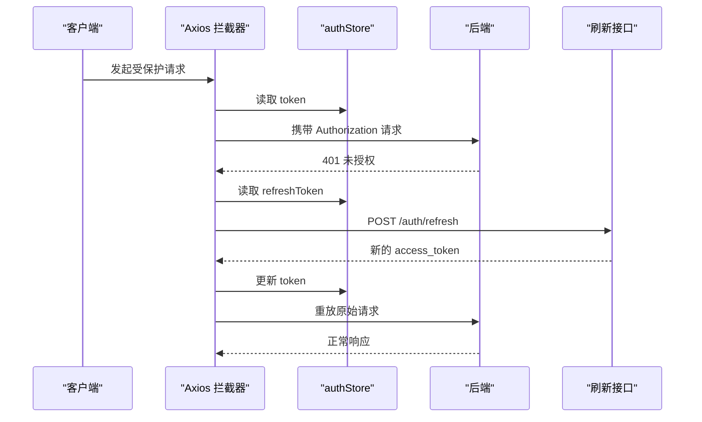
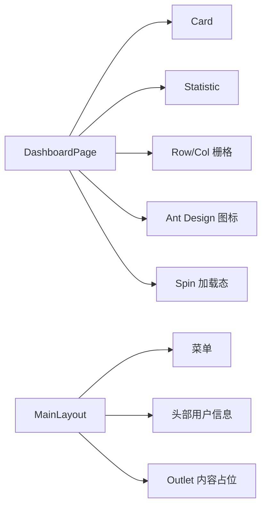
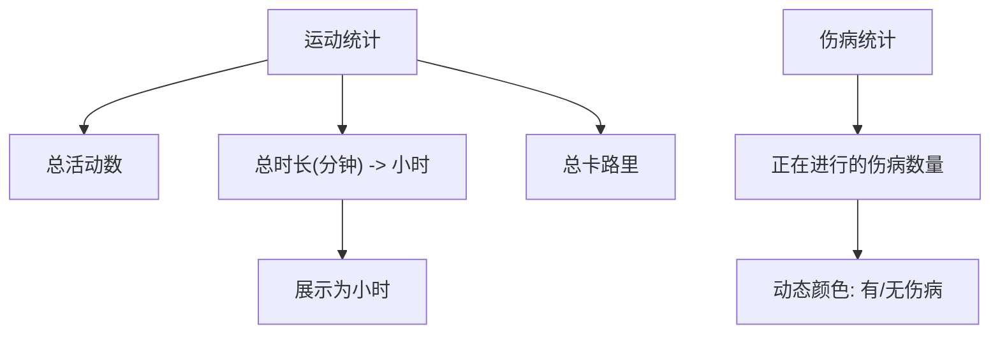
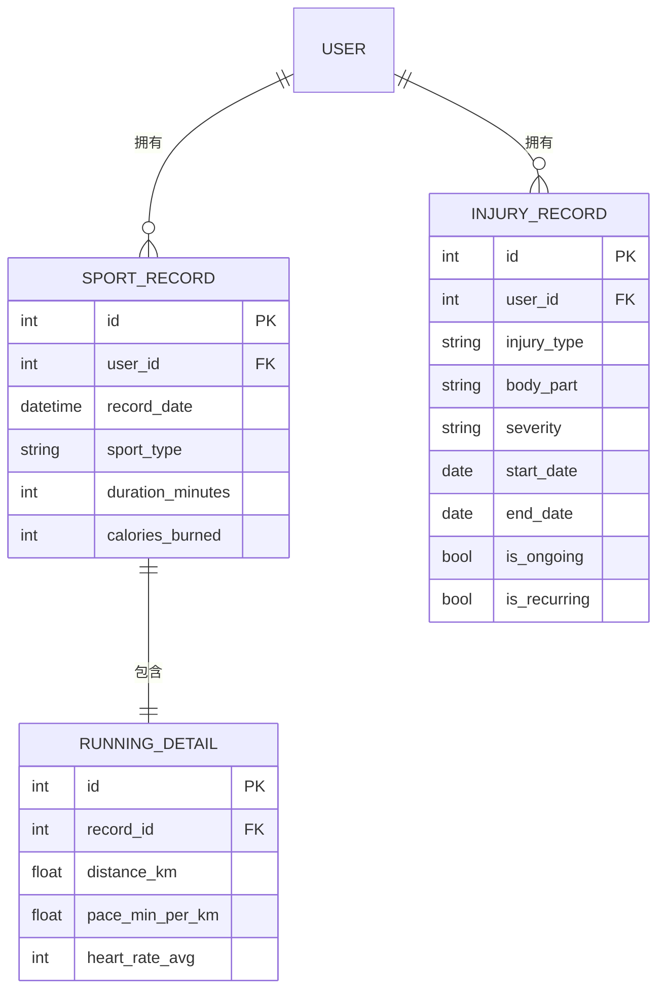
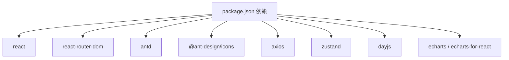

# 仪表板页面

<cite>
**本文引用的文件**
- [DashboardPage.tsx](file://web/src/pages/DashboardPage.tsx)
- [api.ts](file://web/src/services/api.ts)
- [authStore.ts](file://web/src/stores/authStore.ts)
- [App.tsx](file://web/src/App.tsx)
- [MainLayout.tsx](file://web/src/components/MainLayout.tsx)
- [index.css](file://web/src/index.css)
- [main.tsx](file://web/src/main.tsx)
- [package.json](file://web/package.json)
- [sports.py](file://backend/app/api/sports.py)
- [injuries.py](file://backend/app/api/injuries.py)
- [sport_service.py](file://backend/app/services/sport_service.py)
- [injury_service.py](file://backend/app/services/injury_service.py)
</cite>

## 目录
1. [简介](#简介)
2. [项目结构](#项目结构)
3. [核心组件](#核心组件)
4. [架构总览](#架构总览)
5. [详细组件分析](#详细组件分析)
6. [依赖关系分析](#依赖关系分析)
7. [性能考虑](#性能考虑)
8. [故障排查指南](#故障排查指南)
9. [结论](#结论)
10. [附录](#附录)

## 简介
本文件针对 ActiveSynapse 仪表板页面进行系统化技术文档整理，重点围绕 DashboardPage 组件展开，涵盖以下方面：
- 数据获取流程与并发请求处理
- 三大核心统计数据区域（总活动数、总时长、卡路里消耗）与伤病统计的实现
- 周度摘要展示与条件渲染逻辑
- Ant Design 组件使用、图标集成与样式定制
- 页面加载状态管理与用户体验优化
- API 调用模式、鉴权拦截与错误处理机制

## 项目结构
前端采用 React + TypeScript + Vite 构建，使用 Ant Design 作为 UI 基础库，并通过 Zustand 管理全局认证状态。后端基于 FastAPI 提供 REST API，数据库与缓存通过 Docker Compose 编排。

**图示来源**
- [App.tsx:1-48](file://web/src/App.tsx#L1-L48)
- [MainLayout.tsx:1-121](file://web/src/components/MainLayout.tsx#L1-L121)
- [DashboardPage.tsx:1-118](file://web/src/pages/DashboardPage.tsx#L1-L118)
- [api.ts:1-108](file://web/src/services/api.ts#L1-L108)
- [authStore.ts:1-52](file://web/src/stores/authStore.ts#L1-L52)
- [index.css:1-36](file://web/src/index.css#L1-L36)
- [main.tsx:1-15](file://web/src/main.tsx#L1-L15)
- [sports.py:1-127](file://backend/app/api/sports.py#L1-L127)
- [injuries.py:1-92](file://backend/app/api/injuries.py#L1-L92)
- [sport_service.py:1-238](file://backend/app/services/sport_service.py#L1-L238)
- [injury_service.py:1-115](file://backend/app/services/injury_service.py#L1-L115)

**章节来源**
- [App.tsx:1-48](file://web/src/App.tsx#L1-L48)
- [MainLayout.tsx:1-121](file://web/src/components/MainLayout.tsx#L1-L121)
- [DashboardPage.tsx:1-118](file://web/src/pages/DashboardPage.tsx#L1-L118)
- [api.ts:1-108](file://web/src/services/api.ts#L1-L108)
- [authStore.ts:1-52](file://web/src/stores/authStore.ts#L1-L52)
- [index.css:1-36](file://web/src/index.css#L1-L36)
- [main.tsx:1-15](file://web/src/main.tsx#L1-L15)
- [sports.py:1-127](file://backend/app/api/sports.py#L1-L127)
- [injuries.py:1-92](file://backend/app/api/injuries.py#L1-L92)
- [sport_service.py:1-238](file://backend/app/services/sport_service.py#L1-L238)
- [injury_service.py:1-115](file://backend/app/services/injury_service.py#L1-L115)

## 核心组件
- DashboardPage：负责一次性并发拉取三项关键数据（运动统计、周汇总、伤病统计），渲染四大卡片统计区与附加信息区块。
- api.ts：封装 Axios 实例，统一设置基础 URL、请求头与鉴权头；内置请求/响应拦截器，支持自动刷新令牌与 401 处理。
- authStore：Zustand 全局状态，持久化存储用户、访问令牌与刷新令牌，提供登录/登出与用户信息更新能力。
- MainLayout：应用主布局，包含侧边菜单、顶部用户下拉菜单与内容区域 Outlet。
- App：路由层，定义公开与受保护路由，使用 ProtectedRoute 保护仪表板等页面。
- index.css/main.tsx：全局样式与 Ant Design 中文本地化配置。

**章节来源**
- [DashboardPage.tsx:1-118](file://web/src/pages/DashboardPage.tsx#L1-L118)
- [api.ts:1-108](file://web/src/services/api.ts#L1-L108)
- [authStore.ts:1-52](file://web/src/stores/authStore.ts#L1-L52)
- [MainLayout.tsx:1-121](file://web/src/components/MainLayout.tsx#L1-L121)
- [App.tsx:1-48](file://web/src/App.tsx#L1-L48)
- [index.css:1-36](file://web/src/index.css#L1-L36)
- [main.tsx:1-15](file://web/src/main.tsx#L1-L15)

## 架构总览
仪表板的数据流从页面发起，经由 api.ts 的 Axios 实例与拦截器，最终落到后端 FastAPI 接口，再由对应服务层计算统计结果返回给前端。

**图示来源**
- [DashboardPage.tsx:12-33](file://web/src/pages/DashboardPage.tsx#L12-L33)
- [api.ts:13-64](file://web/src/services/api.ts#L13-L64)
- [sports.py:88-113](file://backend/app/api/sports.py#L88-L113)
- [injuries.py:83-91](file://backend/app/api/injuries.py#L83-L91)
- [sport_service.py:127-221](file://backend/app/services/sport_service.py#L127-L221)
- [injury_service.py:87-114](file://backend/app/services/injury_service.py#L87-L114)

## 详细组件分析

### DashboardPage 组件实现原理
- 生命周期与数据获取
  - 组件挂载时触发一次数据拉取，内部通过 Promise.all 并发请求三项接口，避免串行等待导致的页面卡顿。
  - 并发请求包括：运动统计（最近 N 天）、周汇总、伤病统计。
- 加载状态管理
  - 使用 loading 状态在请求期间显示大号 Spin，提升交互反馈。
- 统计卡片渲染
  - 总活动数：来自运动统计中的总活动数字段。
  - 总时长（小时）：将分钟转换为小时并保留一位小数。
  - 卡路里消耗：直接展示总卡路里。
  - 伤病统计：展示"正在进行的伤病"数量，并根据数值动态调整颜色（有伤病为警示色，无伤病为绿色）。
- 条件渲染
  - 当存在跑步统计时，额外渲染"30 天跑步统计"卡片，包含总距离、平均配速、平均心率等指标。
  - 当存在周汇总时，渲染本周活动摘要卡片，包含周起止日期与总活动数。

**图示来源**
- [DashboardPage.tsx:6-33](file://web/src/pages/DashboardPage.tsx#L6-L33)
- [DashboardPage.tsx:43-114](file://web/src/pages/DashboardPage.tsx#L43-L114)

**章节来源**
- [DashboardPage.tsx:1-118](file://web/src/pages/DashboardPage.tsx#L1-L118)

### API 调用模式与并发请求处理
- 并发策略
  - 使用 Promise.all 同时发起三项 API 请求，缩短首屏加载时间。
- 错误处理
  - 捕获异常并弹出错误消息，确保用户感知到加载失败。
- 成功后数据绑定
  - 将三个响应分别赋值到对应状态，驱动 UI 更新。

**图示来源**
- [DashboardPage.tsx:19-23](file://web/src/pages/DashboardPage.tsx#L19-L23)
- [api.ts:91-107](file://web/src/services/api.ts#L91-L107)

**章节来源**
- [DashboardPage.tsx:16-33](file://web/src/pages/DashboardPage.tsx#L16-L33)
- [api.ts:91-107](file://web/src/services/api.ts#L91-L107)

### 鉴权拦截与令牌刷新机制
- 请求拦截
  - 在请求发送前从 Zustand 状态读取 token，并将其写入 Authorization 头。
- 响应拦截
  - 对 401 未授权进行处理：标记重试标志，使用 refreshToken 向后端刷新 access_token。
  - 刷新成功后更新 Zustand 中的 token，并重放原始请求。
  - 刷新失败则触发登出流程，清空状态并拒绝请求。
- 登录流程联动
  - 登录成功后将用户信息与双 token 写入 Zustand，后续请求自动携带 Authorization。

**图示来源**
- [api.ts:13-64](file://web/src/services/api.ts#L13-L64)
- [authStore.ts:21-51](file://web/src/stores/authStore.ts#L21-L51)
- [App.tsx:14-18](file://web/src/App.tsx#L14-L18)

**章节来源**
- [api.ts:13-64](file://web/src/services/api.ts#L13-L64)
- [authStore.ts:1-52](file://web/src/stores/authStore.ts#L1-L52)
- [App.tsx:14-18](file://web/src/App.tsx#L14-L18)

### Ant Design 组件使用、图标集成与样式定制
- 组件使用
  - 使用 Card、Row、Col、Statistic、Spin 等组件构建统计卡片与布局。
  - 使用 Ant Design 图标（奖杯、火焰、时钟、药盒）增强可读性。
- 响应式布局
  - 使用 Ant Design 的栅格系统，通过 xs/sm/lg 断点控制卡片在不同屏幕下的排列。
- 样式定制
  - 全局样式通过 index.css 定义基础字体、背景与滚动条样式。
  - 主题通过 main.tsx 的 ConfigProvider 设置为中文语言包。
- 主布局
  - MainLayout 提供侧边栏菜单、顶部用户下拉菜单与内容区域 Outlet，配合 ProtectedRoute 实现页面级权限控制。

**图示来源**
- [DashboardPage.tsx:43-114](file://web/src/pages/DashboardPage.tsx#L43-L114)
- [MainLayout.tsx:73-118](file://web/src/components/MainLayout.tsx#L73-L118)
- [index.css:1-36](file://web/src/index.css#L1-L36)
- [main.tsx:8-12](file://web/src/main.tsx#L8-L12)

**章节来源**
- [DashboardPage.tsx:1-118](file://web/src/pages/DashboardPage.tsx#L1-L118)
- [MainLayout.tsx:1-121](file://web/src/components/MainLayout.tsx#L1-L121)
- [index.css:1-36](file://web/src/index.css#L1-L36)
- [main.tsx:1-15](file://web/src/main.tsx#L1-L15)

### 三大统计数据区域与伤病统计实现
- 总活动数（30 天）
  - 数据来源：运动统计接口返回的总活动数。
  - 展示：Statistic 组件，前缀使用奖杯图标。
- 总时长（小时）
  - 数据来源：运动统计接口返回的总时长（分钟），前端换算为小时并保留一位小数。
  - 展示：Statistic 组件，前缀使用时钟图标。
- 卡路里消耗
  - 数据来源：运动统计接口返回的总卡路里。
  - 展示：Statistic 组件，前缀使用火焰图标。
- 伤病统计（正在进行的伤病）
  - 数据来源：伤病统计接口返回的正在进行的伤病数量。
  - 展示：Statistic 组件，前缀使用药盒图标；数值颜色根据数量动态变化（有伤病为警示色，无伤病为绿色）。

**图示来源**
- [DashboardPage.tsx:48-84](file://web/src/pages/DashboardPage.tsx#L48-L84)
- [sport_service.py:127-193](file://backend/app/services/sport_service.py#L127-L193)
- [injury_service.py:87-114](file://backend/app/services/injury_service.py#L87-L114)

**章节来源**
- [DashboardPage.tsx:48-84](file://web/src/pages/DashboardPage.tsx#L48-L84)
- [sport_service.py:127-193](file://backend/app/services/sport_service.py#L127-L193)
- [injury_service.py:87-114](file://backend/app/services/injury_service.py#L87-L114)

### 周度摘要展示与条件渲染
- 周度摘要卡片
  - 数据来源：运动统计接口返回的周汇总数据，包含周起始日期、结束日期与总活动数。
  - 展示：Card 组件，标题为"本周活动摘要"，内容包含周日期范围与总活动数。
- 条件渲染逻辑
  - 仅当 weeklySummary 存在时才渲染周度摘要卡片，避免空数据导致的 UI 异常。
  - 使用简单的文本格式化展示日期范围与统计数据。

**章节来源**
- [DashboardPage.tsx:103-112](file://web/src/pages/DashboardPage.tsx#L103-L112)
- [sports.py:105-113](file://backend/app/api/sports.py#L105-L113)
- [sport_service.py:195-237](file://backend/app/services/sport_service.py#L195-L237)

### 后端接口与数据模型
- 运动统计接口
  - GET /sports/statistics：支持按运动类型与天数过滤，返回总活动数、总时长、总卡路里、平均时长等基础统计，以及跑步/羽毛球的专项统计。
- 周汇总接口
  - GET /sports/weekly-summary：返回最近七天的每日运动时长与卡路里分布。
- 伤病统计接口
  - GET /injuries/summary/statistics：返回伤病总数、正在进行的伤病数、复发次数、按部位与类型的分布统计。

**图示来源**
- [sports.py:88-113](file://backend/app/api/sports.py#L88-L113)
- [injuries.py:83-91](file://backend/app/api/injuries.py#L83-L91)
- [sport_service.py:127-221](file://backend/app/services/sport_service.py#L127-L221)
- [injury_service.py:87-114](file://backend/app/services/injury_service.py#L87-L114)

**章节来源**
- [sports.py:88-113](file://backend/app/api/sports.py#L88-L113)
- [injuries.py:83-91](file://backend/app/api/injuries.py#L83-L91)
- [sport_service.py:127-221](file://backend/app/services/sport_service.py#L127-L221)
- [injury_service.py:87-114](file://backend/app/services/injury_service.py#L87-L114)

## 依赖关系分析
- 前端依赖
  - React、React Router DOM、Ant Design、Ant Design Icons、Axios、Zustand、Day.js、ECharts。
- 运行时依赖
  - Vite 开发服务器、Ant Design 中文本地化、全局样式。
- 后端依赖
  - FastAPI、SQLAlchemy 异步会话、CORS 中间件、异常处理器、数据库与缓存服务。

**图示来源**
- [package.json:12-22](file://web/package.json#L12-L22)

**章节来源**
- [package.json:1-37](file://web/package.json#L1-L37)

## 性能考虑
- 并发请求：使用 Promise.all 同时拉取三项数据，减少首屏等待时间。
- 本地状态更新：仅在数据完整到达后再批量更新状态，避免中间态渲染。
- 本地化与样式：Ant Design 中文本地化与全局样式减少重复配置成本。
- 可选优化建议
  - 对高频统计接口增加缓存策略（如内存缓存或浏览器缓存）。
  - 对大型表格或图表引入虚拟化或懒加载。
  - 对统计计算逻辑进行分页或增量更新，避免一次性计算过多数据。

## 故障排查指南
- 页面空白或长时间加载
  - 检查网络请求是否被拦截器正确注入 Authorization。
  - 确认后端接口可用且返回 2xx。
- 401 未授权频繁出现
  - 检查 refreshToken 是否存在与有效；确认刷新流程是否成功更新 Zustand 状态。
- 统计数据为空
  - 确认当前用户是否有运动或伤病记录；检查接口参数（如 days）是否合理。
- 布局错乱
  - 检查响应式断点配置与容器尺寸；确认 index.css 未被覆盖。

**章节来源**
- [api.ts:13-64](file://web/src/services/api.ts#L13-L64)
- [authStore.ts:1-52](file://web/src/stores/authStore.ts#L1-L52)
- [DashboardPage.tsx:1-118](file://web/src/pages/DashboardPage.tsx#L1-L118)

## 结论
DashboardPage 通过并发请求与 Ant Design 卡片组件，实现了简洁直观的健康与运动数据概览。配合鉴权拦截与令牌刷新机制，保障了安全性与可用性。新增的周度摘要与伤病监控功能进一步完善了综合展示界面。建议在现有基础上引入缓存与分页策略，进一步提升性能与用户体验。

## 附录
- 环境变量与容器编排
  - 前端通过 VITE_API_URL 指向后端 API；后端通过 docker-compose 启动数据库与缓存服务。
- 国际化与主题
  - Ant Design 通过 ConfigProvider 设置中文语言包；全局样式统一字体与背景。

**章节来源**
- [main.tsx:8-12](file://web/src/main.tsx#L8-L12)
- [index.css:1-36](file://web/src/index.css#L1-L36)