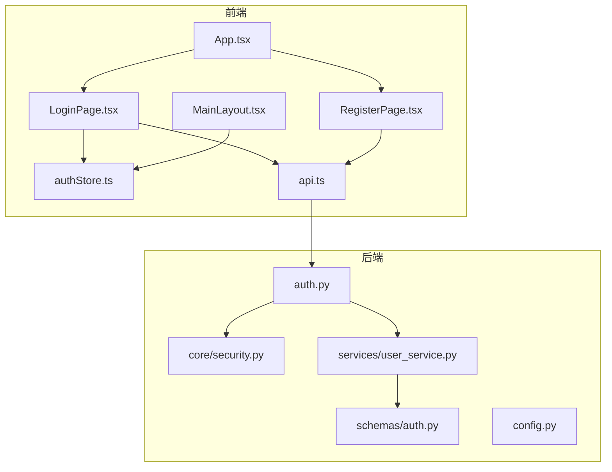
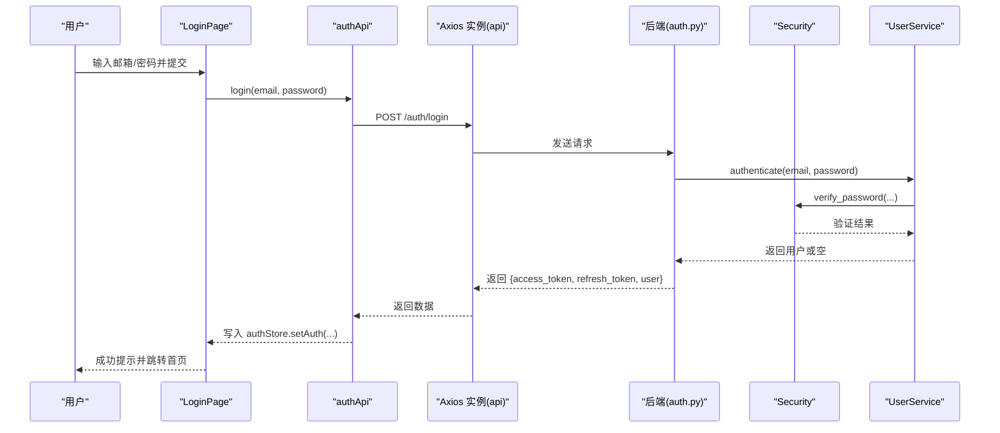
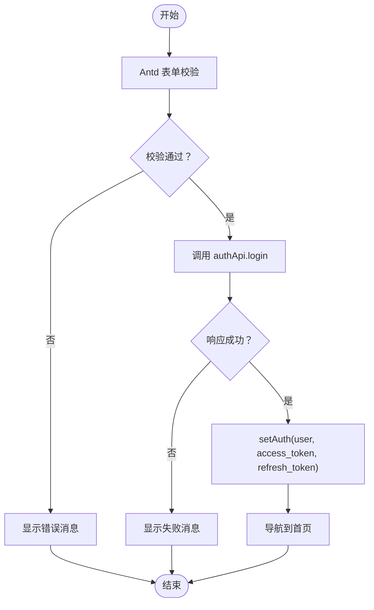
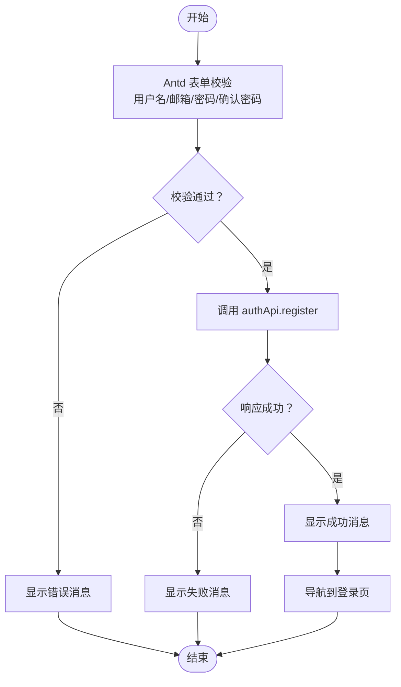
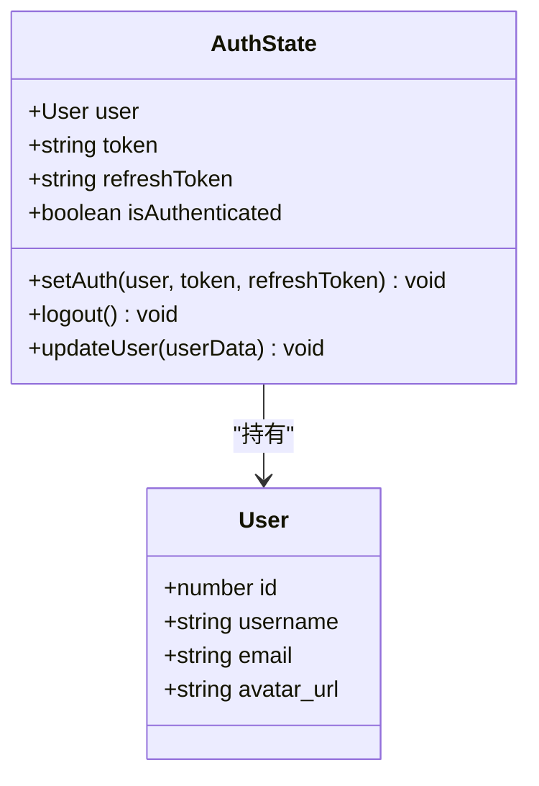
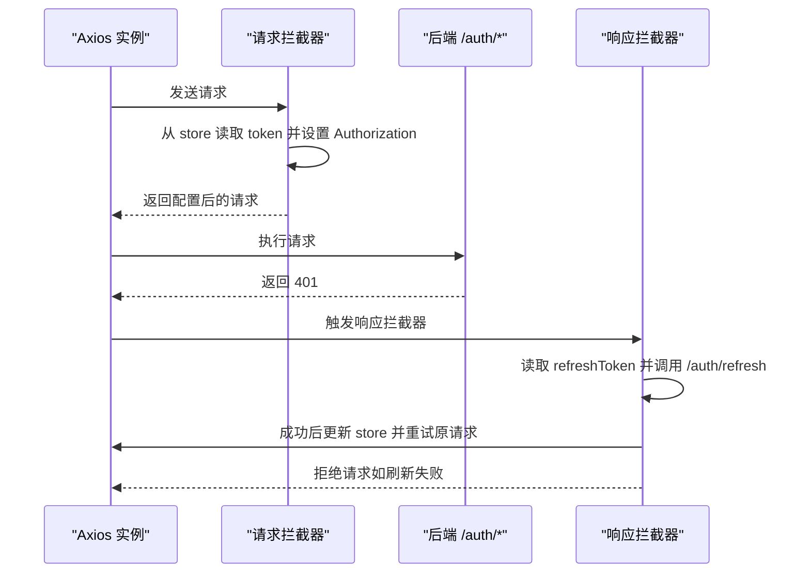
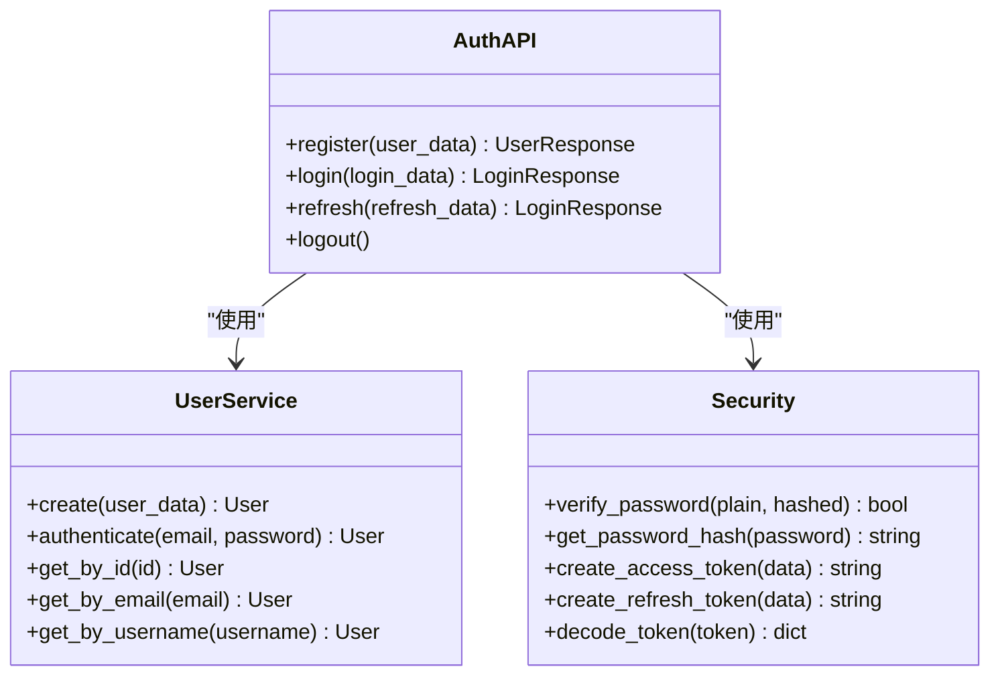
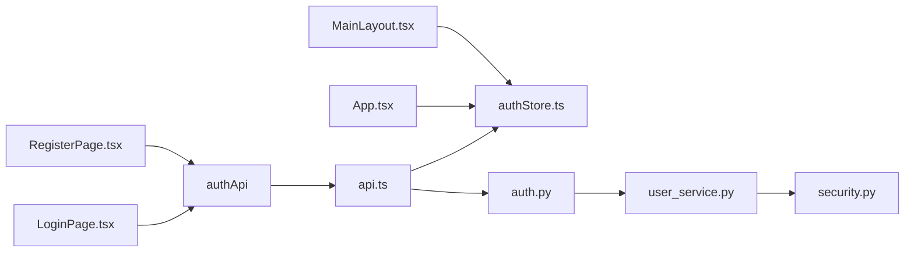

# 认证页面

<cite>
**本文引用的文件**
- [web/src/pages/LoginPage.tsx](file://web/src/pages/LoginPage.tsx)
- [web/src/pages/RegisterPage.tsx](file://web/src/pages/RegisterPage.tsx)
- [web/src/stores/authStore.ts](file://web/src/stores/authStore.ts)
- [web/src/services/api.ts](file://web/src/services/api.ts)
- [web/src/App.tsx](file://web/src/App.tsx)
- [web/src/components/MainLayout.tsx](file://web/src/components/MainLayout.tsx)
- [backend/app/api/auth.py](file://backend/app/api/auth.py)
- [backend/app/schemas/auth.py](file://backend/app/schemas/auth.py)
- [backend/app/core/security.py](file://backend/app/core/security.py)
- [backend/app/services/user_service.py](file://backend/app/services/user_service.py)
- [backend/app/config.py](file://backend/app/config.py)
</cite>

## 更新摘要
**变更内容**
- 更新了登录和注册页面的表单验证规则细节
- 补充了API拦截器的完整工作流程说明
- 增强了JWT令牌处理的安全性分析
- 完善了后端认证接口的数据模型描述
- 添加了密码哈希和安全配置的详细说明

## 目录
1. [简介](#简介)
2. [项目结构](#项目结构)
3. [核心组件](#核心组件)
4. [架构总览](#架构总览)
5. [详细组件分析](#详细组件分析)
6. [依赖分析](#依赖分析)
7. [性能考量](#性能考量)
8. [故障排查指南](#故障排查指南)
9. [结论](#结论)
10. [附录](#附录)

## 简介
本文件为 ActiveSynapse 认证页面组的综合技术文档，聚焦于登录页（LoginPage）与注册页（RegisterPage）的实现细节，涵盖：
- 表单验证规则与用户输入处理
- 提交流程与错误消息展示机制
- 认证状态管理与会话生命周期
- 与后端 API 的交互模式、JWT 令牌处理与刷新策略
- 表单组件复用、验证规则配置与用户体验优化
- 安全考虑、密码强度建议与防重复提交机制
- 完整的调试指南与最佳实践

## 项目结构
前端采用 React + Ant Design + Zustand + Axios 构建，认证相关代码集中在 pages、stores、services 三个目录；后端使用 FastAPI + SQLAlchemy + Pydantic，认证接口位于 app/api/auth.py，安全工具在 app/core/security.py，用户服务在 app/services/user_service.py。

**图表来源**
- [web/src/pages/LoginPage.tsx:1-93](file://web/src/pages/LoginPage.tsx#L1-L93)
- [web/src/pages/RegisterPage.tsx:1-127](file://web/src/pages/RegisterPage.tsx#L1-L127)
- [web/src/stores/authStore.ts:1-52](file://web/src/stores/authStore.ts#L1-L52)
- [web/src/services/api.ts:1-108](file://web/src/services/api.ts#L1-L108)
- [web/src/App.tsx:1-48](file://web/src/App.tsx#L1-L48)
- [web/src/components/MainLayout.tsx:1-121](file://web/src/components/MainLayout.tsx#L1-L121)
- [backend/app/api/auth.py:1-92](file://backend/app/api/auth.py#L1-L92)
- [backend/app/schemas/auth.py:1-35](file://backend/app/schemas/auth.py#L1-L35)
- [backend/app/core/security.py:1-50](file://backend/app/core/security.py#L1-L50)
- [backend/app/services/user_service.py:1-120](file://backend/app/services/user_service.py#L1-L120)
- [backend/app/config.py:1-46](file://backend/app/config.py#L1-L46)

**章节来源**
- [web/src/pages/LoginPage.tsx:1-93](file://web/src/pages/LoginPage.tsx#L1-L93)
- [web/src/pages/RegisterPage.tsx:1-127](file://web/src/pages/RegisterPage.tsx#L1-L127)
- [web/src/stores/authStore.ts:1-52](file://web/src/stores/authStore.ts#L1-L52)
- [web/src/services/api.ts:1-108](file://web/src/services/api.ts#L1-L108)
- [web/src/App.tsx:1-48](file://web/src/App.tsx#L1-L48)
- [web/src/components/MainLayout.tsx:1-121](file://web/src/components/MainLayout.tsx#L1-L121)
- [backend/app/api/auth.py:1-92](file://backend/app/api/auth.py#L1-L92)
- [backend/app/schemas/auth.py:1-35](file://backend/app/schemas/auth.py#L1-L35)
- [backend/app/core/security.py:1-50](file://backend/app/core/security.py#L1-L50)
- [backend/app/services/user_service.py:1-120](file://backend/app/services/user_service.py#L1-L120)
- [backend/app/config.py:1-46](file://backend/app/config.py#L1-L46)

## 核心组件
- **登录页 LoginPage**：负责邮箱/密码登录，调用 authApi.login，成功后写入认证状态并跳转首页，失败显示错误消息。
- **注册页 RegisterPage**：负责用户名/邮箱/密码注册，含密码确认校验，调用 authApi.register，成功提示并跳转登录页。
- **认证状态存储 authStore**：Zustand + persist 持久化，保存用户信息、访问令牌与刷新令牌，提供 setAuth、logout、updateUser 方法。
- **API 层 api**：Axios 实例，请求拦截器自动附加 Bearer Token，响应拦截器处理 401 并尝试刷新令牌，失败则登出。
- **后端认证路由 auth.py**：提供 /auth/login、/auth/register、/auth/refresh、/auth/logout 接口，返回 JWT 与用户信息。
- **安全工具 security.py**：密码哈希、JWT 签发与解码、令牌过期时间配置。
- **用户服务 user_service.py**：用户查询、创建、认证、唯一性检查等。

**章节来源**
- [web/src/pages/LoginPage.tsx:10-29](file://web/src/pages/LoginPage.tsx#L10-L29)
- [web/src/pages/RegisterPage.tsx:9-24](file://web/src/pages/RegisterPage.tsx#L9-L24)
- [web/src/stores/authStore.ts:21-51](file://web/src/stores/authStore.ts#L21-L51)
- [web/src/services/api.ts:6-64](file://web/src/services/api.ts#L6-L64)
- [backend/app/api/auth.py:25-85](file://backend/app/api/auth.py#L25-L85)
- [backend/app/core/security.py:21-49](file://backend/app/core/security.py#L21-L49)
- [backend/app/services/user_service.py:29-68](file://backend/app/services/user_service.py#L29-L68)

## 架构总览
前端通过 authApi 调用后端 /auth/* 接口，后端使用 UserService 进行业务逻辑处理，Security 工具进行密码校验与 JWT 签发。Axios 请求拦截器统一注入 Authorization 头，响应拦截器在 401 时尝试刷新令牌并重试原请求。

**图表来源**
- [web/src/pages/LoginPage.tsx:15-29](file://web/src/pages/LoginPage.tsx#L15-L29)
- [web/src/services/api.ts:69-80](file://web/src/services/api.ts#L69-L80)
- [backend/app/api/auth.py:25-49](file://backend/app/api/auth.py#L25-L49)
- [backend/app/core/security.py:11-13](file://backend/app/core/security.py#L11-L13)
- [backend/app/services/user_service.py:61-68](file://backend/app/services/user_service.py#L61-L68)

## 详细组件分析

### 登录页 LoginPage
- **表单字段与验证**
  - 邮箱：必填且格式校验
  - 密码：必填
- **提交流程**
  - 设置加载态，调用 authApi.login(email, password)
  - 成功：从响应中提取 access_token、refresh_token、user，调用 setAuth 写入状态，提示成功并导航到首页
  - 失败：显示后端返回的 detail 或通用失败提示
  - finally：关闭加载态
- **错误消息显示**：使用 Ant Design message 组件展示错误/成功提示
- **跳转与导航**：使用 react-router-dom 的 useNavigate 和 Link

**图表来源**
- [web/src/pages/LoginPage.tsx:15-29](file://web/src/pages/LoginPage.tsx#L15-L29)

**章节来源**
- [web/src/pages/LoginPage.tsx:10-93](file://web/src/pages/LoginPage.tsx#L10-L93)

### 注册页 RegisterPage
- **表单字段与验证**
  - 用户名：必填，最小长度 3
  - 邮箱：必填且格式校验
  - 密码：必填，最小长度 6
  - 确认密码：必填，需与密码一致（通过依赖项与自定义 validator 实现）
- **提交流程**
  - 设置加载态，调用 authApi.register({ username, email, password })
  - 成功：提示注册成功并导航到登录页
  - 失败：显示后端返回的 detail 或通用失败提示
  - finally：关闭加载态
- **错误消息显示**：使用 Ant Design message 组件
- **跳转与导航**：使用 react-router-dom 的 useNavigate 和 Link

**图表来源**
- [web/src/pages/RegisterPage.tsx:13-24](file://web/src/pages/RegisterPage.tsx#L13-L24)

**章节来源**
- [web/src/pages/RegisterPage.tsx:1-127](file://web/src/pages/RegisterPage.tsx#L1-L127)

### 认证状态管理（authStore）
- **数据模型**
  - user: 用户信息（id、username、email、avatar_url?）
  - token: 访问令牌
  - refreshToken: 刷新令牌
  - isAuthenticated: 是否已认证
- **方法**
  - setAuth(user, token, refreshToken): 设置用户与令牌并标记已认证
  - logout(): 清空用户与令牌并标记未认证
  - updateUser(userData): 更新当前用户信息（浅合并）
- **持久化**
  - 使用 persist 中间件，本地持久化名为 'auth-storage'

**图表来源**
- [web/src/stores/authStore.ts:4-19](file://web/src/stores/authStore.ts#L4-L19)

**章节来源**
- [web/src/stores/authStore.ts:1-52](file://web/src/stores/authStore.ts#L1-L52)

### API 交互与 JWT 令牌处理（api.ts）
- **基础配置**
  - baseURL 来自环境变量 VITE_API_URL，默认 http://localhost:8000/api/v1
  - Content-Type: application/json
- **请求拦截器**
  - 从 authStore 读取 token，若存在则在 Authorization 头添加 Bearer
- **响应拦截器**
  - 捕获 401 且未重试过的情况
  - 读取 refreshToken，向 /auth/refresh 发起刷新请求
  - 成功后更新 authStore 中的 access_token 与 refresh_token，并重试原始请求
  - 刷新失败或无 refreshToken，则调用 logout 并拒绝请求
- **authApi 封装**
  - login(email, password)
  - register({ username, email, password })
  - refresh(refreshToken)
  - logout()

**图表来源**
- [web/src/services/api.ts:13-64](file://web/src/services/api.ts#L13-L64)

**章节来源**
- [web/src/services/api.ts:1-108](file://web/src/services/api.ts#L1-L108)

### 后端认证接口与安全（backend）
- **认证路由**
  - POST /auth/register：创建用户，返回用户信息
  - POST /auth/login：认证用户，签发 access_token 与 refresh_token
  - POST /auth/refresh：使用 refresh_token 刷新 access_token
  - POST /auth/logout：客户端登出提示
- **数据模型**
  - LoginRequest：email、password
  - TokenRefreshRequest：refresh_token
  - LoginResponse：access_token、refresh_token、token_type、expires_in、user
  - UserInfo：id、username、email、avatar_url
- **安全工具**
  - verify_password、get_password_hash：密码哈希与校验
  - create_access_token、create_refresh_token：签发 JWT
  - decode_token：解码与验证
- **用户服务**
  - create：检查邮箱与用户名唯一性，创建用户并生成空档案
  - authenticate：按邮箱查找用户并校验密码

**图表来源**
- [backend/app/api/auth.py:17-91](file://backend/app/api/auth.py#L17-L91)
- [backend/app/core/security.py:11-49](file://backend/app/core/security.py#L11-L49)
- [backend/app/services/user_service.py:29-68](file://backend/app/services/user_service.py#L29-L68)

**章节来源**
- [backend/app/api/auth.py:1-92](file://backend/app/api/auth.py#L1-L92)
- [backend/app/schemas/auth.py:1-35](file://backend/app/schemas/auth.py#L1-L35)
- [backend/app/core/security.py:1-50](file://backend/app/core/security.py#L1-L50)
- [backend/app/services/user_service.py:1-120](file://backend/app/services/user_service.py#L1-L120)
- [backend/app/config.py:18-22](file://backend/app/config.py#L18-L22)

### 路由保护与布局（App.tsx、MainLayout.tsx）
- **路由保护**
  - ProtectedRoute：未认证则重定向至 /login
- **主布局**
  - 侧边栏菜单、顶部用户下拉菜单（个人资料、登出）
  - 登出时调用 store.logout 并导航到登录页

**章节来源**
- [web/src/App.tsx:14-18](file://web/src/App.tsx#L14-L18)
- [web/src/components/MainLayout.tsx:53-56](file://web/src/components/MainLayout.tsx#L53-L56)

## 依赖分析
- **前端**
  - LoginPage 依赖 authApi 与 authStore
  - RegisterPage 依赖 authApi
  - api.ts 依赖 authStore 获取/更新令牌
  - App.tsx 依赖 authStore 进行路由保护
  - MainLayout.tsx 依赖 authStore 进行登出
- **后端**
  - auth.py 依赖 UserService 与 Security
  - user_service.py 依赖 Security 进行密码处理

**图表来源**
- [web/src/pages/LoginPage.tsx:5-6](file://web/src/pages/LoginPage.tsx#L5-L6)
- [web/src/pages/RegisterPage.tsx](file://web/src/pages/RegisterPage.tsx#L5)
- [web/src/services/api.ts:2-2](file://web/src/services/api.ts#L2-L2)
- [web/src/stores/authStore.ts:1-2](file://web/src/stores/authStore.ts#L1-L2)
- [web/src/App.tsx](file://web/src/App.tsx#L3)
- [web/src/components/MainLayout.tsx](file://web/src/components/MainLayout.tsx#L13)
- [backend/app/api/auth.py:8-10](file://backend/app/api/auth.py#L8-L10)
- [backend/app/services/user_service.py](file://backend/app/services/user_service.py#L6)

**章节来源**
- [web/src/pages/LoginPage.tsx:1-93](file://web/src/pages/LoginPage.tsx#L1-L93)
- [web/src/pages/RegisterPage.tsx:1-127](file://web/src/pages/RegisterPage.tsx#L1-L127)
- [web/src/stores/authStore.ts:1-52](file://web/src/stores/authStore.ts#L1-L52)
- [web/src/services/api.ts:1-108](file://web/src/services/api.ts#L1-L108)
- [web/src/App.tsx:1-48](file://web/src/App.tsx#L1-L48)
- [web/src/components/MainLayout.tsx:1-121](file://web/src/components/MainLayout.tsx#L1-L121)
- [backend/app/api/auth.py:1-92](file://backend/app/api/auth.py#L1-L92)
- [backend/app/services/user_service.py:1-120](file://backend/app/services/user_service.py#L1-L120)

## 性能考量
- **表单渲染与校验**
  - 使用 Antd Form 的受控组件与内置校验，避免不必要的重渲染
  - RegisterPage 的 confirmPassword 依赖 password 字段，仅在密码变化时触发校验
- **网络请求**
  - Axios 拦截器统一处理，减少重复代码
  - 401 自动刷新令牌并重试，降低用户感知的失败率
- **状态管理**
  - Zustand + persist 减少全局状态同步成本，持久化避免刷新丢失状态
- **建议**
  - 对高频字段（如邮箱/密码）可启用 debounce
  - 在刷新令牌期间禁用敏感操作按钮，防止并发刷新
  - 后端可引入速率限制与 IP 黑名单以抵御暴力破解

## 故障排查指南
- **登录失败**
  - 检查后端返回的 detail 字段，常见原因：邮箱不存在、密码错误
  - 确认前端 authApi.login 参数顺序与类型正确
  - 查看浏览器 Network 面板，确认 Authorization 头是否被设置
- **注册失败**
  - 确认用户名/邮箱唯一性约束是否被触发
  - 检查密码长度与确认密码一致性
- **401 未刷新**
  - 确认 refreshToken 是否存在且有效
  - 检查后端 /auth/refresh 是否返回新的 access_token 与 refresh_token
  - 若刷新失败，store 会自动 logout，需重新登录
- **令牌过期**
  - 后端 ACCESS_TOKEN_EXPIRE_MINUTES 默认 30 分钟，可在配置中调整
- **环境变量**
  - VITE_API_URL 未设置时默认 http://localhost:8000/api/v1
- **调试步骤**
  - 打开浏览器开发者工具，查看 Console 与 Network
  - 在 api.ts 的拦截器处设置断点，观察请求头与响应状态
  - 在 authStore 中检查 token 与 isAuthenticated 的变化

**章节来源**
- [web/src/pages/LoginPage.tsx:24-28](file://web/src/pages/LoginPage.tsx#L24-L28)
- [web/src/pages/RegisterPage.tsx:19-23](file://web/src/pages/RegisterPage.tsx#L19-L23)
- [web/src/services/api.ts:33-63](file://web/src/services/api.ts#L33-L63)
- [backend/app/config.py](file://backend/app/config.py#L21)

## 结论
ActiveSynapse 的认证页面组通过清晰的职责分离与完善的拦截器机制，实现了可靠的登录、注册与会话管理。前端以 Antd 表单与 Zustand 状态管理为基础，结合 Axios 的请求/响应拦截器完成 JWT 的自动注入与刷新；后端以 FastAPI + Pydantic + Security 工具保证了数据模型与安全策略的一致性。整体架构具备良好的扩展性与可维护性，适合进一步引入密码强度校验、双因素认证与审计日志等高级特性。

## 附录
- **表单字段与验证规则**
  - 登录页：邮箱（必填+邮箱格式）、密码（必填）
  - 注册页：用户名（必填+≥3）、邮箱（必填+邮箱格式）、密码（必填+≥6）、确认密码（必填+与密码一致）
- **令牌配置**
  - 访问令牌过期时间：ACCESS_TOKEN_EXPIRE_MINUTES（默认 30 分钟）
  - 刷新令牌过期时间：REFRESH_TOKEN_EXPIRE_DAYS（默认 7 天）
- **安全建议**
  - 生产环境务必更换 SECRET_KEY，使用 HTTPS 传输
  - 引入密码强度规则（大小写字母、数字、特殊字符、长度）
  - 增加验证码与登录失败次数限制
  - 使用 SameSite Cookie 与 HttpOnly 标记提升安全性
- **防重复提交**
  - 前端：提交按钮在 loading 期间禁用
  - 后端：对 /auth/login 与 /auth/register 增加限流与幂等键
- **用户体验优化**
  - 登录/注册成功后自动跳转
  - 错误消息明确具体字段
  - 支持回车提交与键盘导航
- **密码安全增强**
  - 建议在前端增加密码强度检测（长度、复杂度要求）
  - 可考虑添加密码历史记录，防止重复使用
  - 实施账户锁定机制，防范暴力破解攻击
- **监控与日志**
  - 记录认证失败事件，便于安全审计
  - 监控令牌刷新频率，识别异常使用模式
  - 实施用户行为分析，及时发现可疑活动