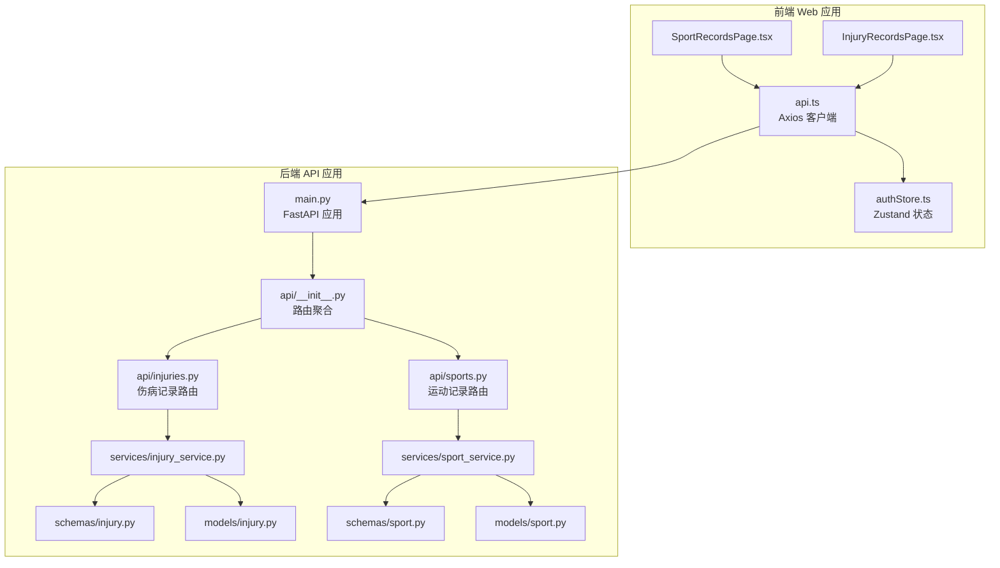
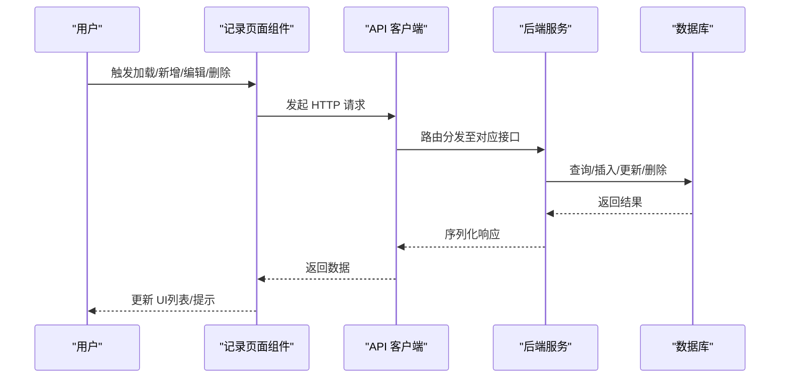
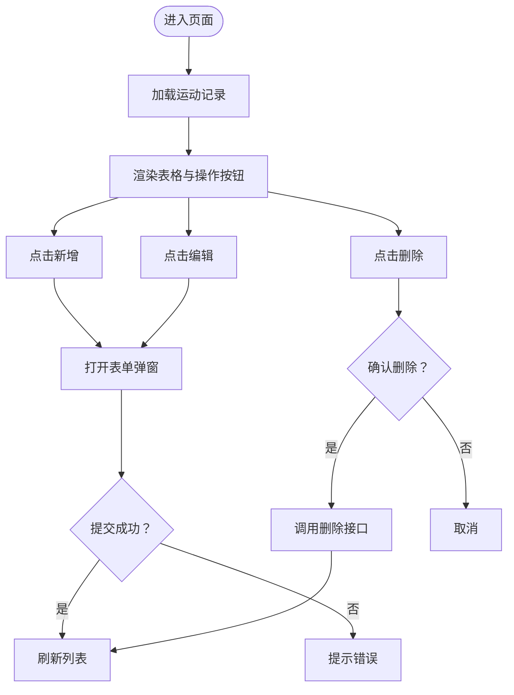
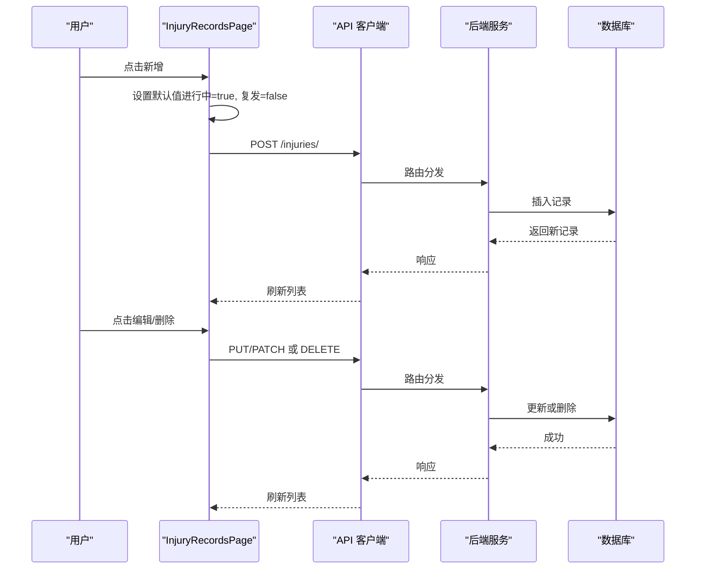
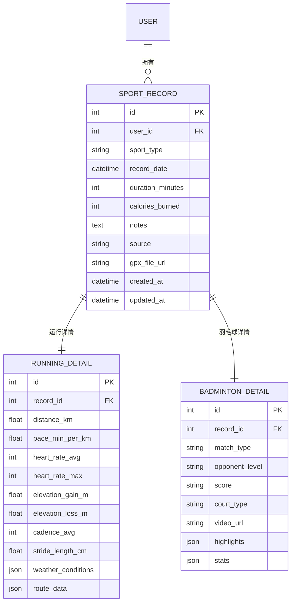
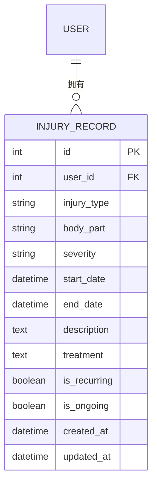
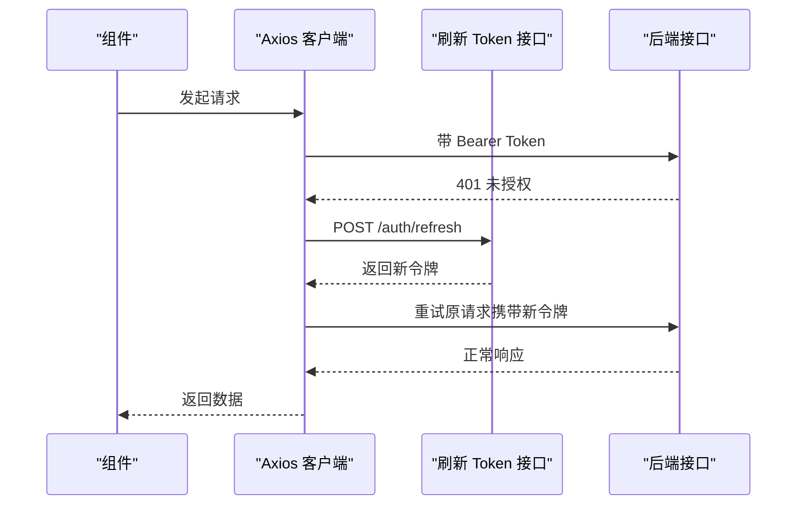
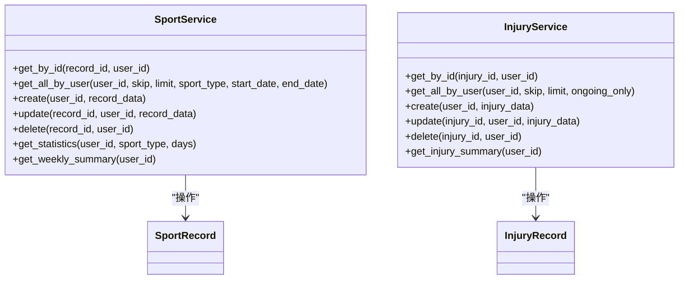
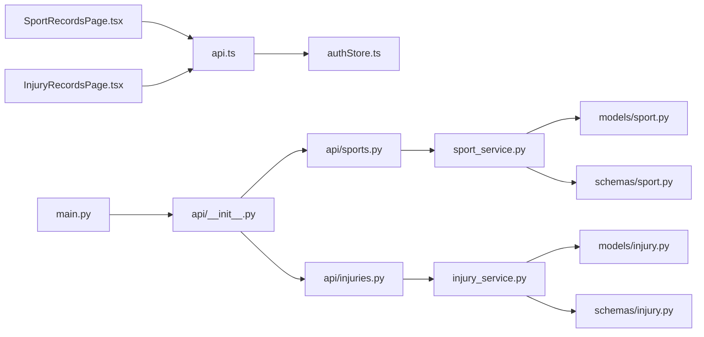

# 记录管理页面

<cite>
**本文引用的文件**
- [web/src/pages/SportRecordsPage.tsx](file://web/src/pages/SportRecordsPage.tsx)
- [web/src/pages/InjuryRecordsPage.tsx](file://web/src/pages/InjuryRecordsPage.tsx)
- [web/src/services/api.ts](file://web/src/services/api.ts)
- [web/src/stores/authStore.ts](file://web/src/stores/authStore.ts)
- [backend/app/models/sport.py](file://backend/app/models/sport.py)
- [backend/app/models/injury.py](file://backend/app/models/injury.py)
- [backend/app/schemas/sport.py](file://backend/app/schemas/sport.py)
- [backend/app/schemas/injury.py](file://backend/app/schemas/injury.py)
- [backend/app/api/sports.py](file://backend/app/api/sports.py)
- [backend/app/api/injuries.py](file://backend/app/api/injuries.py)
- [backend/app/services/sport_service.py](file://backend/app/services/sport_service.py)
- [backend/app/services/injury_service.py](file://backend/app/services/injury_service.py)
- [backend/app/main.py](file://backend/app/main.py)
- [backend/app/api/__init__.py](file://backend/app/api/__init__.py)
</cite>

## 更新摘要
**变更内容**
- 完善了运动记录和伤病记录的增删改查功能文档
- 更新了数据模型和业务逻辑的详细说明
- 增加了完整的 API 接口定义和实现细节
- 补充了前端表单验证和后端数据验证的说明
- 添加了统计分析和图表可视化的实现方案

## 目录
1. [简介](#简介)
2. [项目结构](#项目结构)
3. [核心组件](#核心组件)
4. [架构总览](#架构总览)
5. [详细组件分析](#详细组件分析)
6. [依赖关系分析](#依赖关系分析)
7. [性能考虑](#性能考虑)
8. [故障排查指南](#故障排查指南)
9. [结论](#结论)
10. [附录](#附录)

## 简介
本文件为 ActiveSynapse 记录管理页面的综合技术文档，聚焦于运动记录页面（SportRecordsPage）与伤病记录页面（InjuryRecordsPage）。内容涵盖：
- 页面实现原理：数据列表展示、搜索过滤与分页处理
- 数据模型与字段定义：运动记录与伤病记录的业务模型
- 记录 CRUD 流程与确认机制
- 后端 API 交互模式、统计与汇总接口
- 性能优化、缓存策略与用户体验建议

## 项目结构
前端采用 React + Ant Design 实现，后端基于 FastAPI + SQLAlchemy 异步 ORM。页面通过统一的 API 客户端访问后端接口，并使用 Zustand 管理认证状态。

**图示来源**
- [web/src/pages/SportRecordsPage.tsx:1-177](file://web/src/pages/SportRecordsPage.tsx#L1-L177)
- [web/src/pages/InjuryRecordsPage.tsx:1-220](file://web/src/pages/InjuryRecordsPage.tsx#L1-L220)
- [web/src/services/api.ts:1-108](file://web/src/services/api.ts#L1-L108)
- [web/src/stores/authStore.ts:1-52](file://web/src/stores/authStore.ts#L1-L52)
- [backend/app/main.py:1-77](file://backend/app/main.py#L1-L77)
- [backend/app/api/__init__.py:1-10](file://backend/app/api/__init__.py#L1-L10)
- [backend/app/api/sports.py:1-127](file://backend/app/api/sports.py#L1-L127)
- [backend/app/api/injuries.py:1-92](file://backend/app/api/injuries.py#L1-L92)
- [backend/app/services/sport_service.py:1-238](file://backend/app/services/sport_service.py#L1-L238)
- [backend/app/services/injury_service.py:1-115](file://backend/app/services/injury_service.py#L1-L115)
- [backend/app/models/sport.py:1-115](file://backend/app/models/sport.py#L1-L115)
- [backend/app/models/injury.py:1-70](file://backend/app/models/injury.py#L1-L70)
- [backend/app/schemas/sport.py:1-102](file://backend/app/schemas/sport.py#L1-L102)
- [backend/app/schemas/injury.py:1-42](file://backend/app/schemas/injury.py#L1-L42)

**章节来源**
- [web/src/pages/SportRecordsPage.tsx:1-177](file://web/src/pages/SportRecordsPage.tsx#L1-L177)
- [web/src/pages/InjuryRecordsPage.tsx:1-220](file://web/src/pages/InjuryRecordsPage.tsx#L1-L220)
- [web/src/services/api.ts:1-108](file://web/src/services/api.ts#L1-L108)
- [backend/app/api/__init__.py:1-10](file://backend/app/api/__init__.py#L1-L10)

## 核心组件
- **运动记录页面（SportRecordsPage）**
  - 列表展示：使用 Ant Design Table 展示记录，包含日期、类型、时长、卡路里、来源等列
  - 表单弹窗：新增/编辑使用 Modal + Form，支持下拉选择、日期时间、数值输入、多行文本
  - 操作：新增、编辑、删除按钮；删除无二次确认（可按需增强）
  - 数据加载：首次挂载触发加载；提交成功后刷新列表
  - **新增功能**：完整的 CRUD 操作流程，包括表单验证、日期格式化、消息提示
- **伤病记录页面（InjuryRecordsPage）**
  - 列表展示：类型、部位、严重程度、开始日期、状态（进行中/复发/已康复）、操作
  - 表单弹窗：包含类型、部位、严重程度、起止日期、进行中/复发开关、描述与治疗
  - 操作：同上；默认新增时"进行中"为开启
  - **新增功能**：完整的 CRUD 操作流程，包括日期处理、状态标签渲染、表单验证
- **API 客户端（api.ts）**
  - 基础 URL 读取环境变量，统一添加 Authorization 头
  - 请求拦截器：注入 Bearer Token
  - 响应拦截器：401 自动刷新 Token 并重试原请求
  - **新增功能**：完整的运动记录和伤病记录 API 封装
- **认证状态（authStore.ts）**
  - 使用 Zustand + persist 存储用户信息、访问令牌与刷新令牌
  - 提供登录设置、登出、更新用户信息方法

**章节来源**
- [web/src/pages/SportRecordsPage.tsx:1-177](file://web/src/pages/SportRecordsPage.tsx#L1-L177)
- [web/src/pages/InjuryRecordsPage.tsx:1-220](file://web/src/pages/InjuryRecordsPage.tsx#L1-L220)
- [web/src/services/api.ts:1-108](file://web/src/services/api.ts#L1-L108)
- [web/src/stores/authStore.ts:1-52](file://web/src/stores/authStore.ts#L1-L52)

## 架构总览
前后端交互遵循 REST 风格，前端通过 Axios 客户端调用后端接口，后端使用 FastAPI 路由分发到对应服务层，服务层封装数据库查询与业务逻辑，模型与序列化在 schemas 中定义。

**图示来源**
- [web/src/pages/SportRecordsPage.tsx:20-76](file://web/src/pages/SportRecordsPage.tsx#L20-L76)
- [web/src/pages/InjuryRecordsPage.tsx:21-80](file://web/src/pages/InjuryRecordsPage.tsx#L21-L80)
- [web/src/services/api.ts:90-107](file://web/src/services/api.ts#L90-L107)
- [backend/app/api/sports.py:14-85](file://backend/app/api/sports.py#L14-L85)
- [backend/app/api/injuries.py:13-80](file://backend/app/api/injuries.py#L13-L80)
- [backend/app/services/sport_service.py:23-46](file://backend/app/services/sport_service.py#L23-L46)
- [backend/app/services/injury_service.py:22-37](file://backend/app/services/injury_service.py#L22-L37)

## 详细组件分析

### 运动记录页面（SportRecordsPage）
- **数据模型与字段**
  - 主记录字段：运动类型、记录日期、时长（分钟）、卡路里、备注、来源（手动/COROS）、GPX 文件链接
  - 运动详情（运行/羽毛球）：分别扩展不同指标（如距离、配速、心率、路线、对战信息等）
- **列表展示与渲染**
  - 日期格式化显示
  - 类型与来源以标签形式展示颜色编码
  - 操作列提供编辑与删除按钮
- **搜索过滤与分页**
  - 当前前端未实现搜索过滤与分页参数传递
  - 后端接口支持按类型、起止日期过滤，以及分页参数（skip/limit），可在前端扩展
- **CRUD 流程**
  - 新增/编辑：弹窗表单收集数据，日期转换为 ISO 字符串后提交
  - 删除：调用删除接口并刷新列表
- **统计与汇总**
  - 后端提供统计接口与周汇总接口，前端可调用展示图表与趋势

**图示来源**
- [web/src/pages/SportRecordsPage.tsx:16-76](file://web/src/pages/SportRecordsPage.tsx#L16-L76)
- [web/src/services/api.ts:90-98](file://web/src/services/api.ts#L90-L98)
- [backend/app/api/sports.py:14-34](file://backend/app/api/sports.py#L14-L34)

**章节来源**
- [web/src/pages/SportRecordsPage.tsx:1-177](file://web/src/pages/SportRecordsPage.tsx#L1-L177)
- [backend/app/models/sport.py:23-46](file://backend/app/models/sport.py#L23-L46)
- [backend/app/schemas/sport.py:55-91](file://backend/app/schemas/sport.py#L55-L91)
- [backend/app/api/sports.py:14-34](file://backend/app/api/sports.py#L14-L34)

### 伤病记录页面（InjuryRecordsPage）
- **数据模型与字段**
  - 伤病类型、身体部位、严重程度、起止日期、描述、治疗、是否复发、是否进行中
- **列表展示与渲染**
  - 严重程度按等级映射颜色标签
  - 状态列根据进行中/复发/已康复显示不同标签
- **搜索过滤与分页**
  - 当前前端未实现搜索过滤与分页参数传递
  - 后端接口支持仅显示进行中记录、分页参数，可在前端扩展
- **CRUD 流程**
  - 新增默认开启"进行中"，可选关闭"复发"
  - 编辑时日期字段支持空值（结束日期可为空表示持续中）
  - 删除后刷新列表

**图示来源**
- [web/src/pages/InjuryRecordsPage.tsx:33-80](file://web/src/pages/InjuryRecordsPage.tsx#L33-L80)
- [web/src/services/api.ts:100-107](file://web/src/services/api.ts#L100-L107)
- [backend/app/api/injuries.py:13-80](file://backend/app/api/injuries.py#L13-L80)

**章节来源**
- [web/src/pages/InjuryRecordsPage.tsx:1-220](file://web/src/pages/InjuryRecordsPage.tsx#L1-L220)
- [backend/app/models/injury.py:39-66](file://backend/app/models/injury.py#L39-L66)
- [backend/app/schemas/injury.py:6-39](file://backend/app/schemas/injury.py#L6-L39)
- [backend/app/api/injuries.py:13-80](file://backend/app/api/injuries.py#L13-L80)

### 数据模型与业务逻辑

#### 运动记录模型
- **主表**：记录用户运动的基本信息与来源
- **运行详情**：距离、配速、心率、海拔、步频、路线等
- **羽毛球详情**：对战类型、对手水平、比分、场地、视频、高光时刻、统计等
- **关系**：主记录与两类详情一对一级联删除

**图示来源**
- [backend/app/models/sport.py:23-114](file://backend/app/models/sport.py#L23-L114)

**章节来源**
- [backend/app/models/sport.py:1-115](file://backend/app/models/sport.py#L1-L115)
- [backend/app/schemas/sport.py:1-102](file://backend/app/schemas/sport.py#L1-L102)

#### 伤病记录模型
- **主表**：伤病类型、部位、严重程度、起止日期、描述、治疗、是否复发、是否进行中
- **统计**：按部位与类型分布统计总数、进行中数量、复发数量

**图示来源**
- [backend/app/models/injury.py:39-69](file://backend/app/models/injury.py#L39-L69)

**章节来源**
- [backend/app/models/injury.py:1-70](file://backend/app/models/injury.py#L1-L70)
- [backend/app/schemas/injury.py:1-42](file://backend/app/schemas/injury.py#L1-L42)

### API 交互与状态管理

#### 前端 API 客户端
- **统一基础 URL**，自动注入 Authorization 头
- **401 自动刷新 Token** 并重试原请求
- **导出认证、用户、运动、伤病相关接口**
- **新增功能**：完整的运动记录和伤病记录 API 封装

**图示来源**
- [web/src/services/api.ts:13-64](file://web/src/services/api.ts#L13-L64)
- [web/src/stores/authStore.ts:21-51](file://web/src/stores/authStore.ts#L21-L51)

**章节来源**
- [web/src/services/api.ts:1-108](file://web/src/services/api.ts#L1-L108)
- [web/src/stores/authStore.ts:1-52](file://web/src/stores/authStore.ts#L1-L52)

#### 后端路由与服务
- **运动记录**：列表、创建、获取、更新、删除、统计、周汇总、GPX 导入占位
- **伤病记录**：列表、创建、获取、更新、删除、统计汇总
- **服务层**：实现权限校验（用户 ID）、过滤条件、分页、统计计算与周汇总

**图示来源**
- [backend/app/services/sport_service.py:10-238](file://backend/app/services/sport_service.py#L10-L238)
- [backend/app/services/injury_service.py:9-115](file://backend/app/services/injury_service.py#L9-L115)
- [backend/app/models/sport.py:23-46](file://backend/app/models/sport.py#L23-L46)
- [backend/app/models/injury.py:39-66](file://backend/app/models/injury.py#L39-L66)

**章节来源**
- [backend/app/api/sports.py:1-127](file://backend/app/api/sports.py#L1-L127)
- [backend/app/api/injuries.py:1-92](file://backend/app/api/injuries.py#L1-L92)
- [backend/app/services/sport_service.py:1-238](file://backend/app/services/sport_service.py#L1-L238)
- [backend/app/services/injury_service.py:1-115](file://backend/app/services/injury_service.py#L1-L115)

## 依赖关系分析
- **前端**
  - 页面组件依赖 API 客户端与认证状态
  - API 客户端依赖认证状态与环境变量
- **后端**
  - 路由依赖服务层
  - 服务层依赖模型与序列化
  - 应用入口注册路由并启用 CORS 与异常处理

**图示来源**
- [web/src/pages/SportRecordsPage.tsx:1-177](file://web/src/pages/SportRecordsPage.tsx#L1-L177)
- [web/src/pages/InjuryRecordsPage.tsx:1-220](file://web/src/pages/InjuryRecordsPage.tsx#L1-L220)
- [web/src/services/api.ts:1-108](file://web/src/services/api.ts#L1-L108)
- [web/src/stores/authStore.ts:1-52](file://web/src/stores/authStore.ts#L1-L52)
- [backend/app/api/sports.py:1-127](file://backend/app/api/sports.py#L1-L127)
- [backend/app/api/injuries.py:1-92](file://backend/app/api/injuries.py#L1-L92)
- [backend/app/services/sport_service.py:1-238](file://backend/app/services/sport_service.py#L1-L238)
- [backend/app/services/injury_service.py:1-115](file://backend/app/services/injury_service.py#L1-L115)
- [backend/app/models/sport.py:1-115](file://backend/app/models/sport.py#L1-L115)
- [backend/app/models/injury.py:1-70](file://backend/app/models/injury.py#L1-L70)
- [backend/app/schemas/sport.py:1-102](file://backend/app/schemas/sport.py#L1-L102)
- [backend/app/schemas/injury.py:1-42](file://backend/app/schemas/injury.py#L1-L42)
- [backend/app/main.py:1-77](file://backend/app/main.py#L1-L77)
- [backend/app/api/__init__.py:1-10](file://backend/app/api/__init__.py#L1-L10)

**章节来源**
- [backend/app/main.py:28-57](file://backend/app/main.py#L28-L57)
- [backend/app/api/__init__.py:1-10](file://backend/app/api/__init__.py#L1-L10)

## 性能考虑
- **前端**
  - 列表懒加载：当前一次性加载全部记录，建议结合后端分页参数（skip/limit）实现分页
  - 搜索过滤：增加类型/日期范围筛选，减少渲染与网络传输
  - 表单提交：避免重复提交，可在提交时禁用按钮或使用防抖
  - 图表渲染：统计与趋势展示建议使用虚拟滚动与增量渲染
- **后端**
  - 分页与过滤：服务层已支持 skip/limit 与多种过滤条件，前端应传参以减轻数据库压力
  - 统计计算：按需计算（如仅运行统计）以减少关联查询
  - 缓存策略：对高频统计接口可引入 Redis 缓存，设置合理过期时间
- **其他**
  - 离线处理：前端可引入本地存储，记录变更队列，网络恢复后同步
  - 令牌刷新：确保刷新失败时及时登出，避免无效请求

## 故障排查指南
- **401 未授权**
  - 检查本地存储中的访问令牌与刷新令牌是否存在
  - 确认响应拦截器是否正确发起刷新请求并重试原请求
- **删除失败**
  - 确认当前用户是否为记录所有者（后端按 user_id 校验）
  - 查看后端异常处理返回的具体错误信息
- **列表不更新**
  - 确认提交成功后是否调用了列表刷新函数
  - 检查是否有全局错误提示被吞掉
- **统计数据异常**
  - 核对前端传入的统计参数（如天数、类型）
  - 检查服务层统计逻辑与数据库数据一致性

**章节来源**
- [web/src/services/api.ts:27-64](file://web/src/services/api.ts#L27-L64)
- [backend/app/services/sport_service.py:127-193](file://backend/app/services/sport_service.py#L127-L193)
- [backend/app/services/injury_service.py:87-114](file://backend/app/services/injury_service.py#L87-L114)

## 结论
- **页面实现了基本的记录 CRUD 与列表展示**，具备良好的可扩展性
- **后端提供了完善的过滤、分页与统计能力**，前端可进一步集成
- **建议优先补齐前端搜索过滤与分页、增强删除确认、完善导入导出与批量操作**
- **性能方面应从前后端协同入手**，结合分页、缓存与离线策略提升体验

## 附录

### API 定义概览
- **运动记录**
  - GET /sports/records?skip&limit&sport_type&start_date&end_date
  - POST /sports/records
  - GET /sports/records/{record_id}
  - PUT /sports/records/{record_id}
  - DELETE /sports/records/{record_id}
  - GET /sports/statistics?sport_type&days
  - GET /sports/weekly-summary
  - POST /sports/records/import（占位）
- **伤病记录**
  - GET /injuries/?skip&limit&ongoing_only
  - POST /injuries/
  - GET /injuries/{injury_id}
  - PUT /injuries/{injury_id}
  - DELETE /injuries/{injury_id}
  - GET /injuries/summary/statistics

**章节来源**
- [backend/app/api/sports.py:14-127](file://backend/app/api/sports.py#L14-L127)
- [backend/app/api/injuries.py:13-92](file://backend/app/api/injuries.py#L13-L92)

### 数据验证规则
- **运动记录验证**
  - sport_type: 必须为 "running" 或 "badminton"
  - duration_minutes: 必须大于 0
  - calories_burned: 可选，必须为非负整数
  - record_date: 必须为有效日期时间
  - source: 默认 "manual"，可选 "coros"
- **伤病记录验证**
  - injury_type: 必须为预定义枚举值
  - body_part: 必须为预定义枚举值
  - severity: 必须为 "mild"、"moderate" 或 "severe"
  - start_date: 必须为有效日期时间
  - end_date: 可选，必须为有效日期时间或为空
  - is_ongoing: 布尔值，默认 true
  - is_recurring: 布尔值，默认 false

**章节来源**
- [backend/app/schemas/sport.py:55-91](file://backend/app/schemas/sport.py#L55-L91)
- [backend/app/schemas/injury.py:6-39](file://backend/app/schemas/injury.py#L6-L39)