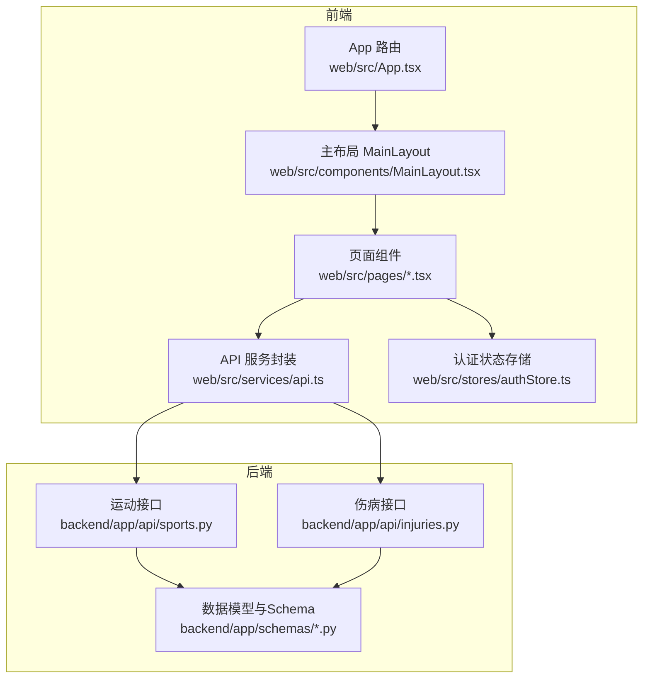
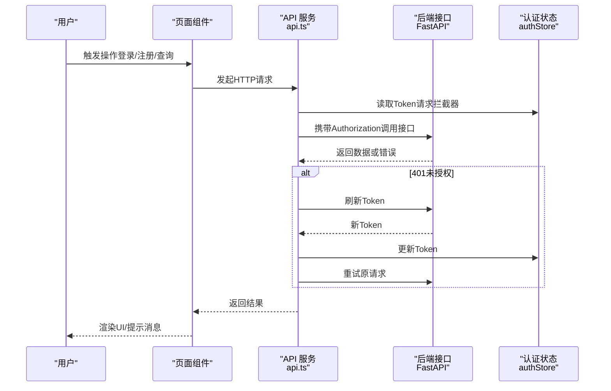
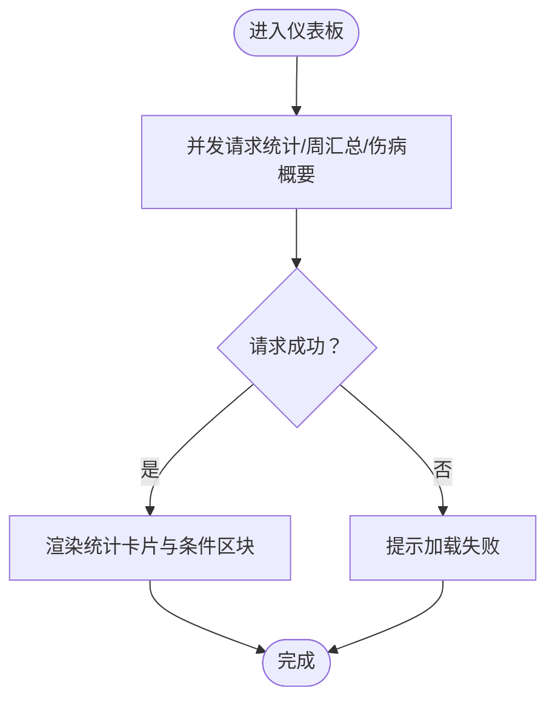
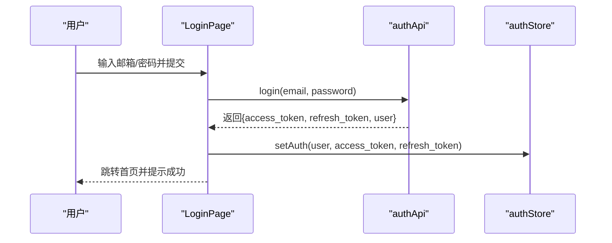
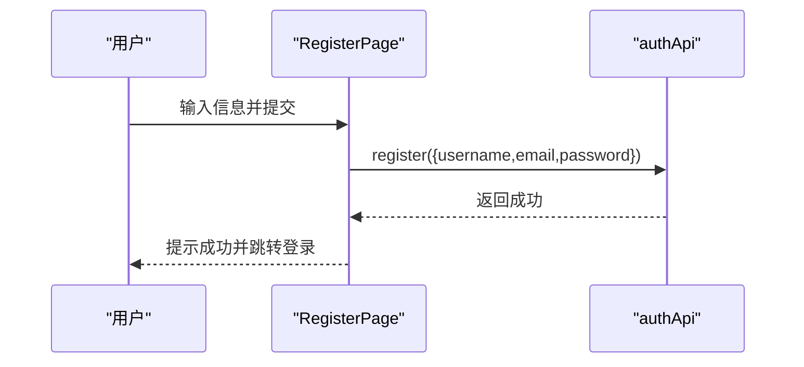
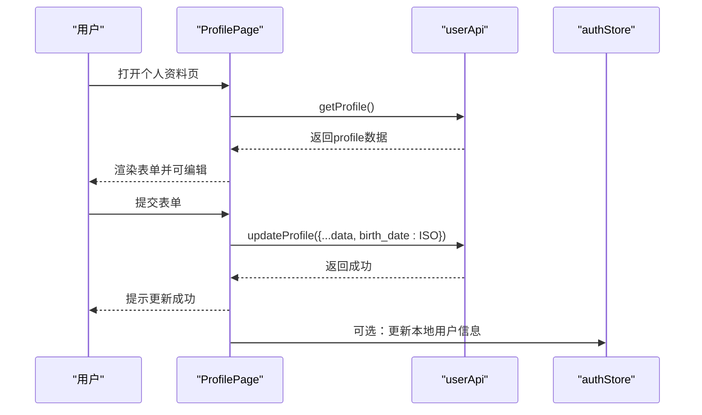
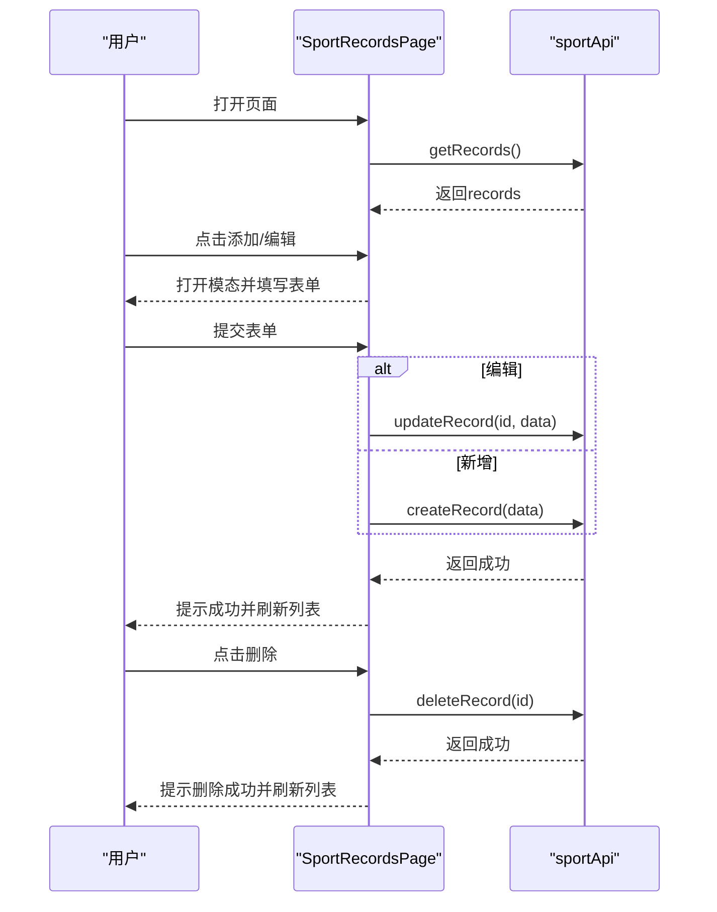
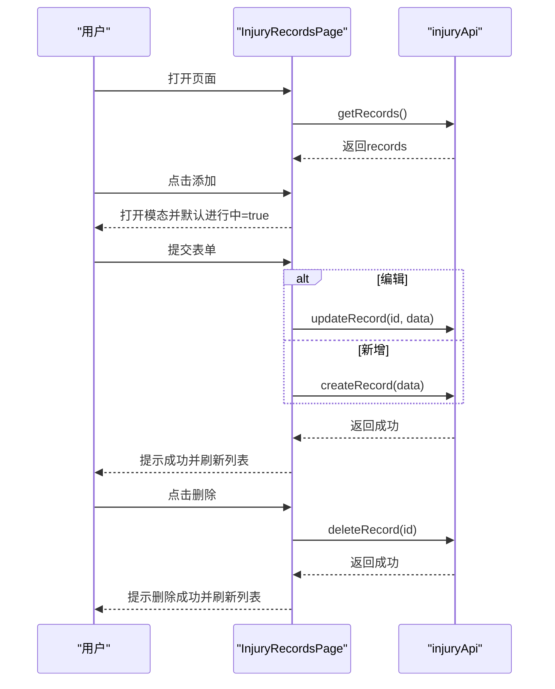
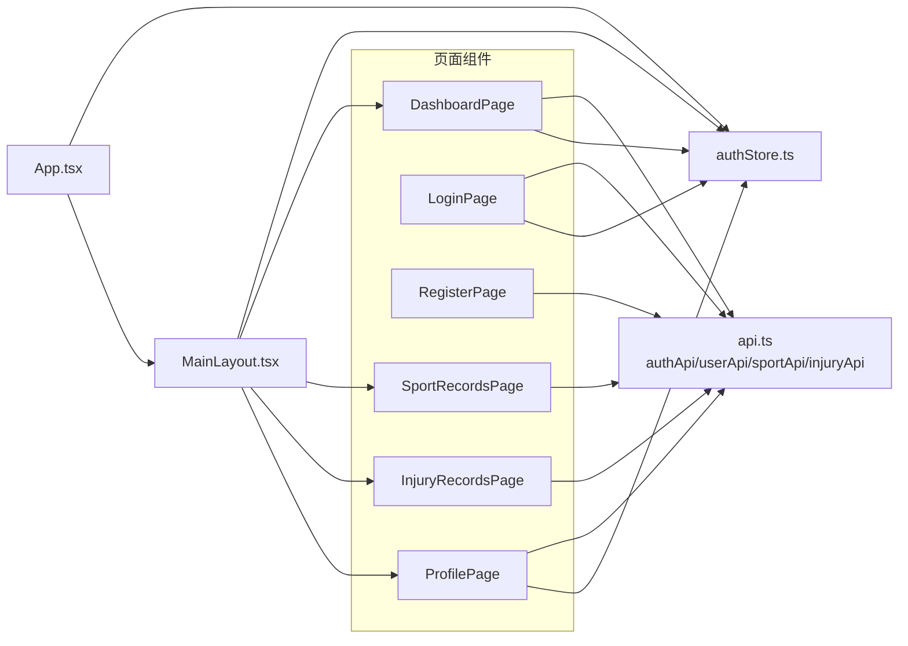

# 页面组件

<cite>
**本文引用的文件**
- [web/src/pages/DashboardPage.tsx](file://web/src/pages/DashboardPage.tsx)
- [web/src/pages/LoginPage.tsx](file://web/src/pages/LoginPage.tsx)
- [web/src/pages/RegisterPage.tsx](file://web/src/pages/RegisterPage.tsx)
- [web/src/pages/ProfilePage.tsx](file://web/src/pages/ProfilePage.tsx)
- [web/src/pages/SportRecordsPage.tsx](file://web/src/pages/SportRecordsPage.tsx)
- [web/src/pages/InjuryRecordsPage.tsx](file://web/src/pages/InjuryRecordsPage.tsx)
- [web/src/services/api.ts](file://web/src/services/api.ts)
- [web/src/stores/authStore.ts](file://web/src/stores/authStore.ts)
- [web/src/App.tsx](file://web/src/App.tsx)
- [web/src/components/MainLayout.tsx](file://web/src/components/MainLayout.tsx)
- [backend/app/schemas/sport.py](file://backend/app/schemas/sport.py)
- [backend/app/schemas/injury.py](file://backend/app/schemas/injury.py)
- [backend/app/schemas/user.py](file://backend/app/schemas/user.py)
- [backend/app/api/sports.py](file://backend/app/api/sports.py)
- [backend/app/api/injuries.py](file://backend/app/api/injuries.py)
</cite>

## 目录
1. [简介](#简介)
2. [项目结构](#项目结构)
3. [核心组件](#核心组件)
4. [架构总览](#架构总览)
5. [详细组件分析](#详细组件分析)
6. [依赖关系分析](#依赖关系分析)
7. [性能考虑](#性能考虑)
8. [故障排查指南](#故障排查指南)
9. [结论](#结论)
10. [附录](#附录)

## 简介
本文件为 ActiveSynapse 前端页面组件的综合技术文档，覆盖以下页面：仪表板、登录、注册、个人资料、运动记录、伤病记录。文档从系统架构、组件职责、数据绑定与用户交互、状态管理与路由配置、API 调用模式、页面间导航与数据流转、性能优化与错误处理等方面进行深入解析，并提供使用示例、参数传递与事件处理说明。

## 项目结构
前端采用 React + Ant Design + Zustand 架构，页面组件位于 web/src/pages，API 封装在 web/src/services/api.ts，全局状态通过 zustand 的 authStore.ts 管理，路由与受保护页面在 web/src/App.tsx 中定义，主布局 web/src/components/MainLayout.tsx 提供侧边栏与头部导航。

图表来源
- [web/src/App.tsx](file://web/src/App.tsx#L20-L45)
- [web/src/components/MainLayout.tsx](file://web/src/components/MainLayout.tsx#L73-L118)
- [web/src/services/api.ts](file://web/src/services/api.ts#L1-L108)
- [web/src/stores/authStore.ts](file://web/src/stores/authStore.ts#L21-L51)
- [backend/app/api/sports.py](file://backend/app/api/sports.py#L1-L127)
- [backend/app/api/injuries.py](file://backend/app/api/injuries.py#L1-L92)

章节来源
- [web/src/App.tsx](file://web/src/App.tsx#L1-L48)
- [web/src/components/MainLayout.tsx](file://web/src/components/MainLayout.tsx#L1-L121)
- [web/src/services/api.ts](file://web/src/services/api.ts#L1-L108)
- [web/src/stores/authStore.ts](file://web/src/stores/authStore.ts#L1-L52)

## 核心组件
- 仪表板页面：聚合统计、周汇总、伤病概要展示，使用并发请求加载数据，Ant Design 卡片与统计组件展示关键指标。
- 登录页面：表单校验、提交登录、成功后写入认证状态并跳转首页。
- 注册页面：表单校验（含密码确认）、提交注册、提示后跳转登录。
- 个人资料页面：加载并编辑用户基础信息与运动档案，日期转换与保存。
- 运动记录页面：列表展示、新增/编辑/删除、模态表单、日期时间选择与数值输入。
- 伤病记录页面：列表展示、新增/编辑/删除、严重程度标签、开关字段、描述文本域。

章节来源
- [web/src/pages/DashboardPage.tsx](file://web/src/pages/DashboardPage.tsx#L1-L118)
- [web/src/pages/LoginPage.tsx](file://web/src/pages/LoginPage.tsx#L1-L93)
- [web/src/pages/RegisterPage.tsx](file://web/src/pages/RegisterPage.tsx#L1-L127)
- [web/src/pages/ProfilePage.tsx](file://web/src/pages/ProfilePage.tsx#L1-L137)
- [web/src/pages/SportRecordsPage.tsx](file://web/src/pages/SportRecordsPage.tsx#L1-L177)
- [web/src/pages/InjuryRecordsPage.tsx](file://web/src/pages/InjuryRecordsPage.tsx#L1-L220)

## 架构总览
页面组件通过统一的 API 服务层访问后端接口；认证状态通过 Zustand 存储持久化，请求拦截器自动注入 Token，响应拦截器处理 401 并触发刷新流程；路由层对受保护页面进行鉴权控制，主布局提供统一导航与用户菜单。

图表来源
- [web/src/services/api.ts](file://web/src/services/api.ts#L13-L64)
- [web/src/stores/authStore.ts](file://web/src/stores/authStore.ts#L21-L51)
- [web/src/pages/LoginPage.tsx](file://web/src/pages/LoginPage.tsx#L15-L29)
- [web/src/pages/RegisterPage.tsx](file://web/src/pages/RegisterPage.tsx#L13-L24)

## 详细组件分析

### 仪表板页面 DashboardPage
- 功能实现
  - 首次挂载时并发请求三类数据：运动统计（最近N天）、周汇总、伤病概要。
  - 使用卡片与统计组件展示活动次数、时长、卡路里、正在进行的伤病数量（带颜色指示）。
  - 条件渲染：当存在跑步统计数据时显示“Running Statistics”卡片；当有周汇总时显示“本周活动”卡片。
- 数据绑定
  - 状态：loading、stats、weeklySummary、injurySummary。
  - 组件：Ant Design Card、Statistic、Row/Col 布局。
- 用户交互
  - 加载态：居中旋转指示器。
  - 错误处理：捕获异常并提示失败。
- 性能与优化
  - 并发请求减少等待时间。
  - 条件渲染避免空数据时的无意义渲染。
- API 调用模式
  - sportApi.getStatistics({ days: 30 })
  - sportApi.getWeeklySummary()
  - injuryApi.getSummary()

图表来源
- [web/src/pages/DashboardPage.tsx](file://web/src/pages/DashboardPage.tsx#L12-L33)

章节来源
- [web/src/pages/DashboardPage.tsx](file://web/src/pages/DashboardPage.tsx#L1-L118)
- [web/src/services/api.ts](file://web/src/services/api.ts#L90-L107)

### 登录页面 LoginPage
- 功能实现
  - 表单布局：邮箱、密码，提交后调用 authApi.login。
  - 成功后：写入认证状态（用户、访问/刷新 Token），提示成功并跳转首页。
  - 失败：提示错误详情。
- 数据绑定
  - 状态：loading。
  - 表单：Ant Design Form，字段规则校验。
- 用户交互
  - 提交按钮禁用态与加载态。
  - 跳转到注册页链接。
- API 调用模式
  - authApi.login(email, password)
- 导航与状态
  - 使用 useNavigate 进行路由跳转。
  - 认证状态通过 useAuthStore.setAuth 写入。

图表来源
- [web/src/pages/LoginPage.tsx](file://web/src/pages/LoginPage.tsx#L15-L29)
- [web/src/services/api.ts](file://web/src/services/api.ts#L68-L80)
- [web/src/stores/authStore.ts](file://web/src/stores/authStore.ts#L29-L34)

章节来源
- [web/src/pages/LoginPage.tsx](file://web/src/pages/LoginPage.tsx#L1-L93)
- [web/src/services/api.ts](file://web/src/services/api.ts#L68-L80)
- [web/src/stores/authStore.ts](file://web/src/stores/authStore.ts#L1-L52)

### 注册页面 RegisterPage
- 功能实现
  - 表单：用户名、邮箱、密码、确认密码，密码确认依赖于原密码字段。
  - 提交后调用 authApi.register，成功提示并跳转登录页。
- 数据绑定
  - 状态：loading。
  - 表单：Ant Design Form，字段规则校验。
- 用户交互
  - 提交按钮加载态。
  - 跳转到登录页链接。
- API 调用模式
  - authApi.register({ username, email, password })

图表来源
- [web/src/pages/RegisterPage.tsx](file://web/src/pages/RegisterPage.tsx#L13-L24)
- [web/src/services/api.ts](file://web/src/services/api.ts#L73-L77)

章节来源
- [web/src/pages/RegisterPage.tsx](file://web/src/pages/RegisterPage.tsx#L1-L127)
- [web/src/services/api.ts](file://web/src/services/api.ts#L68-L80)

### 个人资料页面 ProfilePage
- 功能实现
  - 首次挂载加载当前用户资料，设置表单默认值（日期使用 dayjs）。
  - 编辑表单提交时将日期转换为 ISO 字符串并调用 userApi.updateProfile。
  - 展示基础信息（用户名、邮箱）与运动档案（身高、体重、生日、性别、运动等级、目标、偏好运动）。
- 数据绑定
  - 状态：loading、saving。
  - 表单：Ant Design Form + Input/InputNumber/DatePicker/Select。
- 用户交互
  - 加载态与保存态。
  - 成功/失败提示。
- API 调用模式
  - userApi.getProfile()
  - userApi.updateProfile(data)

图表来源
- [web/src/pages/ProfilePage.tsx](file://web/src/pages/ProfilePage.tsx#L20-L52)
- [web/src/services/api.ts](file://web/src/services/api.ts#L82-L88)
- [web/src/stores/authStore.ts](file://web/src/stores/authStore.ts#L43-L45)

章节来源
- [web/src/pages/ProfilePage.tsx](file://web/src/pages/ProfilePage.tsx#L1-L137)
- [web/src/services/api.ts](file://web/src/services/api.ts#L82-L88)
- [web/src/stores/authStore.ts](file://web/src/stores/authStore.ts#L1-L52)

### 运动记录页面 SportRecordsPage
- 功能实现
  - 列表展示：日期、类型（Running/Badminton）、时长、卡路里、来源（COROS/Manual）、操作（编辑/删除）。
  - 新增/编辑：模态表单，日期使用 dayjs，时长与卡路里为数值输入。
  - 删除：调用删除接口并重新加载列表。
- 数据绑定
  - 状态：records、loading、modalVisible、editingRecord、表单实例。
  - 表格：Ant Design Table + Tag + Space。
- 用户交互
  - 添加按钮打开新增模态。
  - 编辑按钮填充表单并打开模态。
  - 删除二次确认（消息提示）。
- API 调用模式
  - sportApi.getRecords()
  - sportApi.createRecord(data)
  - sportApi.updateRecord(id, data)
  - sportApi.deleteRecord(id)

图表来源
- [web/src/pages/SportRecordsPage.tsx](file://web/src/pages/SportRecordsPage.tsx#L20-L76)
- [web/src/services/api.ts](file://web/src/services/api.ts#L90-L98)

章节来源
- [web/src/pages/SportRecordsPage.tsx](file://web/src/pages/SportRecordsPage.tsx#L1-L177)
- [web/src/services/api.ts](file://web/src/services/api.ts#L90-L98)

### 伤病记录页面 InjuryRecordsPage
- 功能实现
  - 列表展示：类型、部位、严重程度（Tag）、开始日期、状态（进行中/复发/已康复）、操作（编辑/删除）。
  - 新增/编辑：模态表单，日期可选结束日期，开关字段表示是否进行中/是否复发，文本域用于描述与治疗。
  - 删除：调用删除接口并重新加载列表。
- 数据绑定
  - 状态：records、loading、modalVisible、editingRecord、表单实例。
  - 表格：Ant Design Table + Tag + Space。
- 用户交互
  - 添加按钮初始化默认值（进行中=true，复发=false）。
  - 编辑时回填日期与布尔值。
  - 删除二次确认（消息提示）。
- API 调用模式
  - injuryApi.getRecords()
  - injuryApi.createRecord(data)
  - injuryApi.updateRecord(id, data)
  - injuryApi.deleteRecord(id)
  - injuryApi.getSummary()

图表来源
- [web/src/pages/InjuryRecordsPage.tsx](file://web/src/pages/InjuryRecordsPage.tsx#L21-L80)
- [web/src/services/api.ts](file://web/src/services/api.ts#L100-L107)

章节来源
- [web/src/pages/InjuryRecordsPage.tsx](file://web/src/pages/InjuryRecordsPage.tsx#L1-L220)
- [web/src/services/api.ts](file://web/src/services/api.ts#L100-L107)

## 依赖关系分析
- 页面组件依赖
  - API 服务：authApi、userApi、sportApi、injuryApi。
  - 认证状态：useAuthStore（读取/更新用户信息、Token）。
  - 路由：useNavigate/useLocation/useAuthStore（受保护路由）。
- 组件耦合
  - 页面组件与 API 服务解耦，便于替换与测试。
  - 主布局与页面组件松耦合，通过 Outlet 插槽组合。
- 外部依赖
  - Ant Design UI 组件库。
  - dayjs 日期处理。
  - axios 请求库与拦截器。
  - Zustand 状态管理与持久化。

图表来源
- [web/src/pages/DashboardPage.tsx](file://web/src/pages/DashboardPage.tsx#L1-L118)
- [web/src/pages/LoginPage.tsx](file://web/src/pages/LoginPage.tsx#L1-L93)
- [web/src/pages/RegisterPage.tsx](file://web/src/pages/RegisterPage.tsx#L1-L127)
- [web/src/pages/ProfilePage.tsx](file://web/src/pages/ProfilePage.tsx#L1-L137)
- [web/src/pages/SportRecordsPage.tsx](file://web/src/pages/SportRecordsPage.tsx#L1-L177)
- [web/src/pages/InjuryRecordsPage.tsx](file://web/src/pages/InjuryRecordsPage.tsx#L1-L220)
- [web/src/services/api.ts](file://web/src/services/api.ts#L1-L108)
- [web/src/stores/authStore.ts](file://web/src/stores/authStore.ts#L1-L52)
- [web/src/components/MainLayout.tsx](file://web/src/components/MainLayout.tsx#L1-L121)
- [web/src/App.tsx](file://web/src/App.tsx#L1-L48)

章节来源
- [web/src/services/api.ts](file://web/src/services/api.ts#L1-L108)
- [web/src/stores/authStore.ts](file://web/src/stores/authStore.ts#L1-L52)
- [web/src/App.tsx](file://web/src/App.tsx#L1-L48)
- [web/src/components/MainLayout.tsx](file://web/src/components/MainLayout.tsx#L1-L121)

## 性能考虑
- 并发请求：仪表板使用 Promise.all 并行获取多份数据，缩短首屏等待时间。
- 条件渲染：仅在有数据时渲染对应区块，减少 DOM 结构复杂度。
- 表单懒加载：仅在需要时打开模态框，避免不必要的表单初始化。
- 状态最小化：仅维护必要的状态（如 loading/saving/modalVisible），避免过度重渲染。
- 本地化日期：使用 dayjs 在前端格式化与转换，减少后端压力。
- Token 自动续期：请求拦截器统一处理 401，避免页面重复处理。

## 故障排查指南
- 登录/注册失败
  - 检查网络与后端可用性。
  - 查看返回的错误详情（后端会返回 detail 字段）。
  - 确认邮箱/密码格式与长度规则。
- 仪表板数据为空
  - 确认用户是否有历史运动/伤病记录。
  - 检查并发请求是否全部成功。
- 个人资料保存失败
  - 确认必填字段与数值范围。
  - 检查 birth_date 是否正确转换为 ISO。
- 运动/伤病记录 CRUD 失败
  - 确认当前用户权限与记录归属。
  - 检查日期字段与布尔字段的传参格式。
- Token 过期
  - 检查刷新流程是否正常执行。
  - 若刷新失败，将触发登出并回到登录页。

章节来源
- [web/src/pages/LoginPage.tsx](file://web/src/pages/LoginPage.tsx#L24-L25)
- [web/src/pages/RegisterPage.tsx](file://web/src/pages/RegisterPage.tsx#L19-L20)
- [web/src/pages/DashboardPage.tsx](file://web/src/pages/DashboardPage.tsx#L28-L32)
- [web/src/pages/ProfilePage.tsx](file://web/src/pages/ProfilePage.tsx#L47-L48)
- [web/src/pages/SportRecordsPage.tsx](file://web/src/pages/SportRecordsPage.tsx#L73-L75)
- [web/src/pages/InjuryRecordsPage.tsx](file://web/src/pages/InjuryRecordsPage.tsx#L77-L79)
- [web/src/services/api.ts](file://web/src/services/api.ts#L33-L60)

## 结论
ActiveSynapse 页面组件围绕清晰的数据流与状态管理构建：页面组件负责视图与交互，API 服务统一封装请求与拦截，Zustand 管理认证状态并持久化，路由层保障受保护页面的安全访问。通过并发请求、条件渲染与自动 Token 续期等策略，系统在易用性与性能之间取得平衡。后续可在表单校验、国际化、分页与搜索过滤等方面进一步增强。

## 附录

### 页面路由配置与导航逻辑
- 公共路由：/login、/register
- 受保护路由：根路径与子路径（/sports、/injuries、/profile）均需登录
- 主布局：侧边栏菜单项与头部用户菜单联动，支持折叠与登出
- 导航：侧边栏点击或头部下拉菜单跳转至对应页面

章节来源
- [web/src/App.tsx](file://web/src/App.tsx#L24-L41)
- [web/src/components/MainLayout.tsx](file://web/src/components/MainLayout.tsx#L26-L71)

### API 调用模式与数据结构参考
- 运动记录
  - 查询：GET /sports/records
  - 创建：POST /sports/records
  - 更新：PUT /sports/records/{id}
  - 删除：DELETE /sports/records/{id}
  - 统计：GET /sports/statistics?days=N
  - 周汇总：GET /sports/weekly-summary
- 伤病记录
  - 查询：GET /injuries/
  - 创建：POST /injuries/
  - 更新：PUT /injuries/{id}
  - 删除：DELETE /injuries/{id}
  - 概要：GET /injuries/summary/statistics
- 用户资料
  - 获取：GET /users/me/profile
  - 更新：PUT /users/me/profile

章节来源
- [web/src/services/api.ts](file://web/src/services/api.ts#L90-L107)
- [backend/app/api/sports.py](file://backend/app/api/sports.py#L14-L126)
- [backend/app/api/injuries.py](file://backend/app/api/injuries.py#L13-L91)
- [backend/app/schemas/sport.py](file://backend/app/schemas/sport.py#L55-L102)
- [backend/app/schemas/injury.py](file://backend/app/schemas/injury.py#L6-L42)
- [backend/app/schemas/user.py](file://backend/app/schemas/user.py#L6-L69)