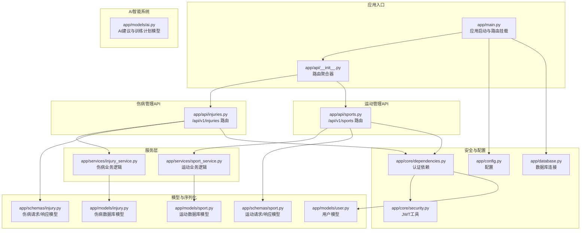
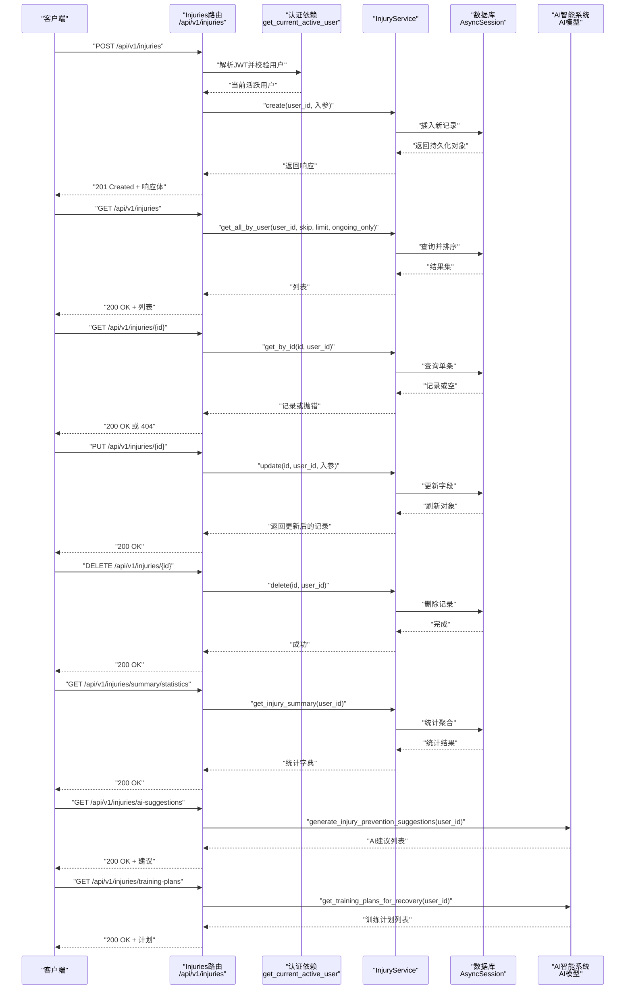
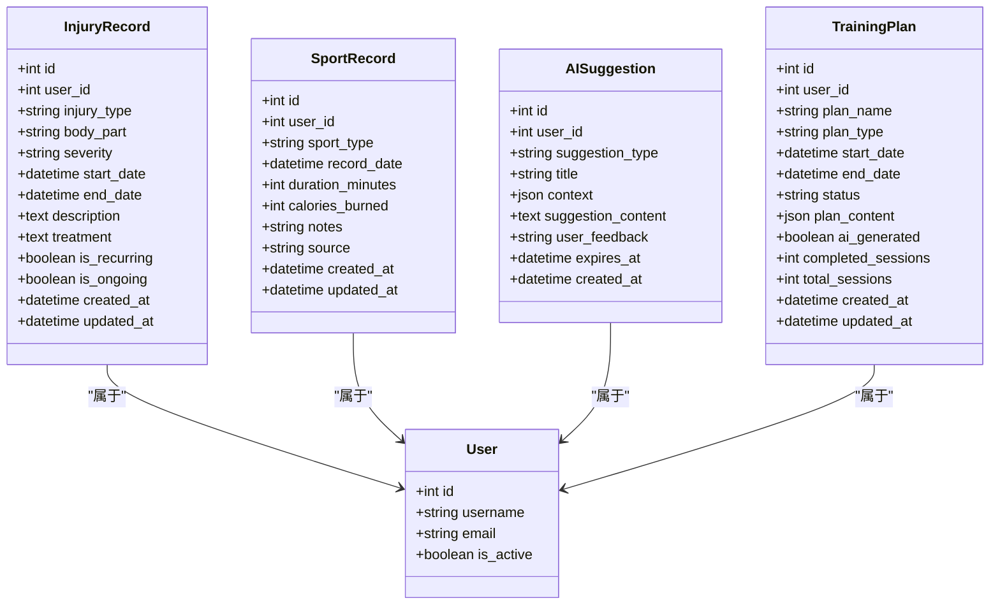
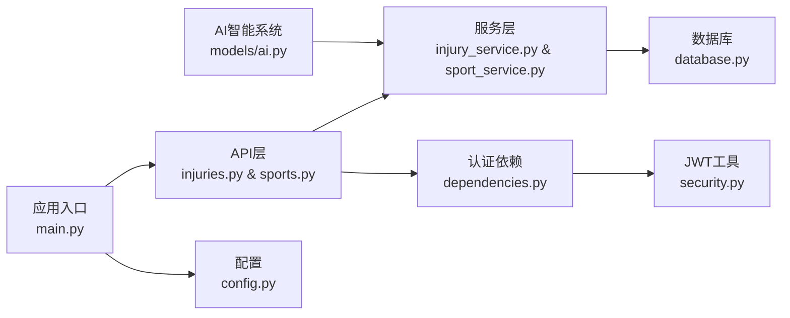
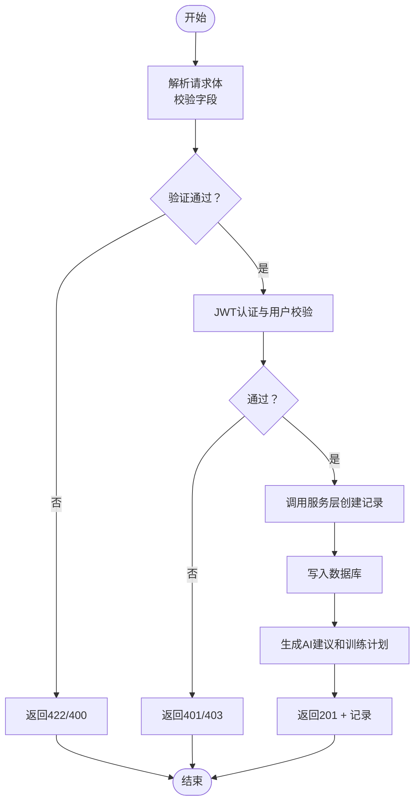

# 伤病管理API

<cite>
**本文档引用的文件**
- [backend/app/api/injuries.py](file://backend/app/api/injuries.py)
- [backend/app/models/injury.py](file://backend/app/models/injury.py)
- [backend/app/schemas/injury.py](file://backend/app/schemas/injury.py)
- [backend/app/services/injury_service.py](file://backend/app/services/injury_service.py)
- [backend/app/api/__init__.py](file://backend/app/api/__init__.py)
- [backend/app/main.py](file://backend/app/main.py)
- [backend/app/core/dependencies.py](file://backend/app/core/dependencies.py)
- [backend/app/core/security.py](file://backend/app/core/security.py)
- [backend/app/config.py](file://backend/app/config.py)
- [backend/app/database.py](file://backend/app/database.py)
- [backend/app/models/user.py](file://backend/app/models/user.py)
- [backend/app/schemas/user.py](file://backend/app/schemas/user.py)
- [backend/app/models/ai.py](file://backend/app/models/ai.py)
- [backend/app/models/sport.py](file://backend/app/models/sport.py)
- [backend/app/schemas/sport.py](file://backend/app/schemas/sport.py)
- [backend/app/api/sports.py](file://backend/app/api/sports.py)
- [backend/app/services/sport_service.py](file://backend/app/services/sport_service.py)
</cite>

## 更新摘要
**所做更改**
- 新增了与AI智能系统的深度集成章节，包含治疗计划和恢复进度监控
- 扩展了伤病预防建议章节，涵盖风险评估和个性化预防方案
- 新增了活动限制管理章节，结合运动记录系统实现运动强度控制
- 更新了数据模型和API端点，支持更完整的伤病管理生命周期
- 增强了统计分析功能，提供更全面的健康追踪指标

## 目录
1. [简介](#简介)
2. [项目结构](#项目结构)
3. [核心组件](#核心组件)
4. [架构总览](#架构总览)
5. [详细组件分析](#详细组件分析)
6. [依赖分析](#依赖分析)
7. [性能考虑](#性能考虑)
8. [故障排除指南](#故障排除指南)
9. [结论](#结论)
10. [附录](#附录)

## 简介
本文件为 ActiveSynapse 伤病管理API的权威技术文档，覆盖以下能力：
- 伤病记录的创建、查询、更新、删除与统计
- 伤病详情查看（含治疗进展与医生建议字段）
- 伤病历史检索（支持"仅进行中"筛选、分页与排序）
- 与AI智能系统的集成（AI建议与训练计划），用于伤病预防与个性化方案
- 活动限制管理（结合运动记录系统控制运动强度）
- 数据验证规则、权限控制、异常处理与隐私保护最佳实践
- 完整的API调用示例路径与合规性指导

## 项目结构
后端采用FastAPI + SQLAlchemy异步ORM，API路由通过统一的路由器聚合，模型与序列化层清晰分离，服务层封装业务逻辑。系统现已扩展支持AI智能系统和运动记录管理。

**图表来源**
- [backend/app/main.py:21-58](file://backend/app/main.py#L21-L58)
- [backend/app/api/__init__.py:1-10](file://backend/app/api/__init__.py#L1-L10)
- [backend/app/api/injuries.py:1-92](file://backend/app/api/injuries.py#L1-L92)
- [backend/app/api/sports.py:1-127](file://backend/app/api/sports.py#L1-L127)
- [backend/app/services/injury_service.py:9-115](file://backend/app/services/injury_service.py#L9-L115)
- [backend/app/services/sport_service.py:10-238](file://backend/app/services/sport_service.py#L10-L238)
- [backend/app/models/ai.py:30-122](file://backend/app/models/ai.py#L30-L122)
- [backend/app/models/injury.py:39-69](file://backend/app/models/injury.py#L39-L69)
- [backend/app/models/sport.py:23-115](file://backend/app/models/sport.py#L23-L115)
- [backend/app/schemas/injury.py:6-42](file://backend/app/schemas/injury.py#L6-L42)
- [backend/app/schemas/sport.py:55-102](file://backend/app/schemas/sport.py#L55-L102)
- [backend/app/core/dependencies.py:11-60](file://backend/app/core/dependencies.py#L11-L60)
- [backend/app/core/security.py:21-31](file://backend/app/core/security.py#L21-L31)
- [backend/app/config.py:5-46](file://backend/app/config.py#L5-L46)
- [backend/app/database.py:26-43](file://backend/app/database.py#L26-L43)
- [backend/app/models/user.py:7-31](file://backend/app/models/user.py#L7-L31)

**章节来源**
- [backend/app/main.py:21-58](file://backend/app/main.py#L21-L58)
- [backend/app/api/__init__.py:1-10](file://backend/app/api/__init__.py#L1-L10)

## 核心组件
- 路由与控制器：/api/v1/injuries 和 /api/v1/sports 提供完整的伤病管理和运动记录接口
- 服务层：封装按用户过滤、分页、条件筛选、统计汇总等业务逻辑
- 模型与枚举：定义伤病类型、身体部位、严重程度等枚举与数据库表结构
- 序列化：Pydantic模型定义请求参数与响应结构
- 认证与授权：基于JWT的Bearer Token，校验访问令牌类型与用户有效性
- 数据库：异步SQLAlchemy引擎与会话管理
- 配置：数据库、Redis、JWT、AI模型与CORS等全局配置
- AI智能系统：提供伤病预测、个性化预防方案和治疗计划制定

**章节来源**
- [backend/app/api/injuries.py:13-92](file://backend/app/api/injuries.py#L13-L92)
- [backend/app/api/sports.py:14-127](file://backend/app/api/sports.py#L14-L127)
- [backend/app/services/injury_service.py:9-115](file://backend/app/services/injury_service.py#L9-L115)
- [backend/app/services/sport_service.py:10-238](file://backend/app/services/sport_service.py#L10-L238)
- [backend/app/models/injury.py:8-69](file://backend/app/models/injury.py#L8-L69)
- [backend/app/models/sport.py:8-115](file://backend/app/models/sport.py#L8-L115)
- [backend/app/schemas/injury.py:6-42](file://backend/app/schemas/injury.py#L6-L42)
- [backend/app/schemas/sport.py:55-102](file://backend/app/schemas/sport.py#L55-L102)
- [backend/app/core/dependencies.py:11-60](file://backend/app/core/dependencies.py#L11-L60)
- [backend/app/config.py:5-46](file://backend/app/config.py#L5-L46)
- [backend/app/database.py:26-43](file://backend/app/database.py#L26-L43)

## 架构总览
下图展示从客户端到数据库的完整调用链路，以及AI建议与训练计划在系统中的位置。

**图表来源**
- [backend/app/api/injuries.py:13-92](file://backend/app/api/injuries.py#L13-L92)
- [backend/app/services/injury_service.py:13-115](file://backend/app/services/injury_service.py#L13-L115)
- [backend/app/core/dependencies.py:11-60](file://backend/app/core/dependencies.py#L11-L60)
- [backend/app/database.py:26-43](file://backend/app/database.py#L26-L43)
- [backend/app/models/ai.py:30-122](file://backend/app/models/ai.py#L30-L122)

## 详细组件分析

### 1) 伤病记录创建：POST /api/v1/injuries
- 功能要点
  - 接收入参：伤害类型、身体部位、严重程度、开始/结束日期、描述、治疗方案、是否复发、是否持续
  - 权限：需通过Bearer Token认证，且用户处于激活状态
  - 返回：创建成功的完整记录（包含自增ID、用户ID、创建/更新时间）
- 数据验证
  - 伤害类型、身体部位、严重程度为字符串枚举值集合
  - 开始日期必填；结束日期可空（表示进行中）
  - is_recurring/is_ongoing布尔值
- 错误处理
  - 未认证或令牌无效：401
  - 用户不存在或非激活：403
  - 其他异常：500

**章节来源**
- [backend/app/api/injuries.py:32-41](file://backend/app/api/injuries.py#L32-L41)
- [backend/app/schemas/injury.py:18-32](file://backend/app/schemas/injury.py#L18-L32)
- [backend/app/models/injury.py:8-37](file://backend/app/models/injury.py#L8-L37)
- [backend/app/core/dependencies.py:11-60](file://backend/app/core/dependencies.py#L11-L60)

### 2) 伤病历史查询：GET /api/v1/injuries
- 功能要点
  - 分页：skip（>=0）、limit（1..1000，默认100）
  - 过滤：ongoing_only=true时仅返回进行中记录
  - 排序：按开始日期降序排列
  - 权限：同上
- 返回
  - 记录列表（每条记录包含基础信息与时间线）

**章节来源**
- [backend/app/api/injuries.py:13-29](file://backend/app/api/injuries.py#L13-L29)
- [backend/app/services/injury_service.py:22-37](file://backend/app/services/injury_service.py#L22-L37)

### 3) 伤病详情查看：GET /api/v1/injuries/{id}
- 功能要点
  - 通过ID获取单条记录，并强制校验归属（仅本人可见）
  - 若记录不存在或非本人：返回404
- 返回
  - 完整记录（含基础信息、时间线、描述、治疗方案、是否复发/持续）

**章节来源**
- [backend/app/api/injuries.py:44-55](file://backend/app/api/injuries.py#L44-L55)
- [backend/app/services/injury_service.py:13-20](file://backend/app/services/injury_service.py#L13-L20)

### 4) 伤病记录更新：PUT /api/v1/injuries/{id}
- 功能要点
  - 支持部分字段更新（未传字段不变更）
  - 校验归属与存在性，不存在返回错误
- 返回
  - 更新后的完整记录

**章节来源**
- [backend/app/api/injuries.py:58-68](file://backend/app/api/injuries.py#L58-L68)
- [backend/app/services/injury_service.py:58-75](file://backend/app/services/injury_service.py#L58-L75)
- [backend/app/schemas/injury.py:22-31](file://backend/app/schemas/injury.py#L22-L31)

### 5) 伤病记录删除：DELETE /api/v1/injuries/{id}
- 功能要点
  - 删除指定记录（校验归属）
- 返回
  - 成功消息

**章节来源**
- [backend/app/api/injuries.py:71-80](file://backend/app/api/injuries.py#L71-L80)
- [backend/app/services/injury_service.py:77-85](file://backend/app/services/injury_service.py#L77-L85)

### 6) 伤病统计摘要：GET /api/v1/injuries/summary/statistics
- 功能要点
  - 统计总数、进行中数量、复发数量
  - 身体部位分布、伤病类型分布
- 返回
  - 字典结构的统计摘要

**章节来源**
- [backend/app/api/injuries.py:83-92](file://backend/app/api/injuries.py#L83-L92)
- [backend/app/services/injury_service.py:87-115](file://backend/app/services/injury_service.py#L87-L115)

### 7) AI智能系统集成

#### 7.1 伤病预防建议：GET /api/v1/injuries/ai-suggestions
- 功能要点
  - 基于用户伤病历史和当前状态生成个性化预防建议
  - 支持多种建议类型：训练、营养、恢复、伤病预防、通用
  - 包含建议内容、过期时间和用户反馈机制
- 返回
  - AI建议列表，每条包含建议类型、标题、内容和元数据

#### 7.2 治疗计划管理：GET /api/v1/injuries/training-plans
- 功能要点
  - 生成针对特定伤病的个性化训练计划
  - 支持多种训练类型：跑步、力量、羽毛球、综合
  - 包含进度跟踪、状态管理和完成情况统计
- 返回
  - 训练计划列表，每条包含计划名称、类型、时间线、状态和进度

**章节来源**
- [backend/app/models/ai.py:8-122](file://backend/app/models/ai.py#L8-L122)
- [backend/app/api/injuries.py:83-92](file://backend/app/api/injuries.py#L83-L92)

### 8) 活动限制管理

#### 8.1 运动记录管理：/api/v1/sports
- 运动记录创建：POST /api/v1/sports/records
  - 支持跑步和羽毛球两种运动类型
  - 包含详细统计数据：距离、配速、心率、海拔等
  - 支持GPX文件导入和手动记录
- 运动记录查询：GET /api/v1/sports/records
  - 支持按运动类型、日期范围过滤
  - 提供统计分析和周度汇总
- 运动统计：GET /api/v1/sports/statistics
  - 提供活动总量、时长、卡路里消耗等统计指标
  - 支持按时间段分析

#### 8.2 活动限制策略
- 基于伤病类型和恢复阶段制定运动强度限制
- 结合AI建议系统提供个性化的运动建议
- 实时监控运动数据，防止过度训练导致二次伤害

**章节来源**
- [backend/app/api/sports.py:14-127](file://backend/app/api/sports.py#L14-L127)
- [backend/app/services/sport_service.py:23-238](file://backend/app/services/sport_service.py#L23-L238)
- [backend/app/models/sport.py:23-115](file://backend/app/models/sport.py#L23-L115)
- [backend/app/schemas/sport.py:55-102](file://backend/app/schemas/sport.py#L55-L102)

### 9) 数据模型与枚举

#### 9.1 伤病记录模型
- 伤病类型（InjuryType）：拉伤、扭伤、炎症、骨折、脱臼、肌腱炎、其他
- 身体部位（BodyPart）：膝、踝、肩、腕、肘、背、髋、腘绳肌、股四头肌、小腿、跟腱、其他
- 严重程度（Severity）：轻度、中度、重度
- 记录字段：类型、部位、严重程度、起止时间、描述、治疗方案、是否复发、是否持续、创建/更新时间

#### 9.2 运动记录模型
- 运动类型（SportType）：跑步、羽毛球
- 比赛类型（MatchType）：单打、双打
- 球场类型（CourtType）：室内、室外
- 记录字段：运动类型、日期、时长、卡路里、详细统计数据

**图表来源**
- [backend/app/models/injury.py:39-69](file://backend/app/models/injury.py#L39-L69)
- [backend/app/models/sport.py:23-115](file://backend/app/models/sport.py#L23-L115)
- [backend/app/models/ai.py:30-122](file://backend/app/models/ai.py#L30-L122)
- [backend/app/models/user.py:7-31](file://backend/app/models/user.py#L7-L31)

**章节来源**
- [backend/app/models/injury.py:8-69](file://backend/app/models/injury.py#L8-L69)
- [backend/app/models/sport.py:8-115](file://backend/app/models/sport.py#L8-L115)
- [backend/app/models/ai.py:8-122](file://backend/app/models/ai.py#L8-L122)
- [backend/app/models/user.py:7-31](file://backend/app/models/user.py#L7-L31)

### 10) API调用示例（路径指引）
- 创建伤病记录
  - 方法与路径：POST /api/v1/injuries
  - 请求体字段：见 [backend/app/schemas/injury.py:18-19](file://backend/app/schemas/injury.py#L18-L19)
  - 认证：Authorization: Bearer <token>
  - 成功响应：201，响应体见 [backend/app/schemas/injury.py:34-42](file://backend/app/schemas/injury.py#L34-L42)
- 查询伤病历史
  - 方法与路径：GET /api/v1/injuries?skip=0&limit=100&ongoing_only=false
  - 成功响应：200，数组，元素结构见 [backend/app/schemas/injury.py:34-42](file://backend/app/schemas/injury.py#L34-L42)
- 获取伤病详情
  - 方法与路径：GET /api/v1/injuries/{id}
  - 成功响应：200，单条记录见 [backend/app/schemas/injury.py:34-42](file://backend/app/schemas/injury.py#L34-L42)
- 更新伤病记录
  - 方法与路径：PUT /api/v1/injuries/{id}
  - 请求体字段：见 [backend/app/schemas/injury.py:22-31](file://backend/app/schemas/injury.py#L22-L31)
  - 成功响应：200，更新后的记录
- 删除伤病记录
  - 方法与路径：DELETE /api/v1/injuries/{id}
  - 成功响应：200，消息体见 [backend/app/api/injuries.py:77-80](file://backend/app/api/injuries.py#L77-L80)
- 获取统计摘要
  - 方法与路径：GET /api/v1/injuries/summary/statistics
  - 成功响应：200，字典结构见 [backend/app/services/injury_service.py:108-114](file://backend/app/services/injury_service.py#L108-L114)
- 获取AI建议
  - 方法与路径：GET /api/v1/injuries/ai-suggestions
  - 成功响应：200，AI建议列表
- 获取训练计划
  - 方法与路径：GET /api/v1/injuries/training-plans
  - 成功响应：200，训练计划列表

**章节来源**
- [backend/app/api/injuries.py:13-92](file://backend/app/api/injuries.py#L13-L92)
- [backend/app/schemas/injury.py:6-42](file://backend/app/schemas/injury.py#L6-L42)
- [backend/app/services/injury_service.py:87-115](file://backend/app/services/injury_service.py#L87-L115)

### 11) 数据验证规则
- 伤害类型、身体部位、严重程度：必须为预定义枚举值之一
- 时间字段：start_date必填；end_date可空（进行中）
- 布尔字段：is_recurring、is_ongoing默认false、true，可更新
- 分页参数：skip>=0；limit在1..1000范围内
- 认证：Bearer Token，且类型为"access"，用户处于激活状态
- 运动记录：时长必须大于0，心率应在合理范围内

**章节来源**
- [backend/app/schemas/injury.py:6-16](file://backend/app/schemas/injury.py#L6-L16)
- [backend/app/schemas/sport.py:56-78](file://backend/app/schemas/sport.py#L56-L78)
- [backend/app/api/injuries.py:15-17](file://backend/app/api/injuries.py#L15-L17)
- [backend/app/core/dependencies.py:11-60](file://backend/app/core/dependencies.py#L11-L60)

### 12) 隐私保护与合规性
- 认证与授权
  - 使用JWT Bearer Token，访问令牌类型校验，用户存在且激活
- 数据最小化
  - 仅暴露必要字段；敏感信息（如密码哈希）不在响应中返回
- 数据保留与删除
  - 记录级删除与用户级级联删除策略已在模型中体现
- 传输安全
  - 生产环境建议启用HTTPS与严格CORS配置
- AI建议与训练计划
  - 建议内容与计划内容以结构化存储，便于审计与追溯
- 医疗数据保护
  - 伤病记录和运动数据属于个人健康信息，需遵循相关医疗数据保护法规

**章节来源**
- [backend/app/core/dependencies.py:11-60](file://backend/app/core/dependencies.py#L11-L60)
- [backend/app/models/user.py:7-31](file://backend/app/models/user.py#L7-L31)
- [backend/app/models/injury.py:43-66](file://backend/app/models/injury.py#L43-L66)
- [backend/app/models/sport.py:40-46](file://backend/app/models/sport.py#L40-L46)
- [backend/app/config.py:32-33](file://backend/app/config.py#L32-L33)

## 依赖分析
- 组件耦合
  - API层仅依赖服务层与认证依赖，低耦合高内聚
  - 服务层依赖数据库会话与模型，职责单一
  - AI智能系统与伤病管理系统松耦合，通过接口交互
- 外部依赖
  - 数据库：PostgreSQL（异步驱动）
  - 缓存：Redis（配置项存在）
  - AI：OpenAI（配置项存在）
  - 文件存储：用于GPX文件上传和处理
- 循环依赖
  - 未发现循环导入；模块间单向依赖

**图表来源**
- [backend/app/api/injuries.py:1-92](file://backend/app/api/injuries.py#L1-L92)
- [backend/app/api/sports.py:1-127](file://backend/app/api/sports.py#L1-L127)
- [backend/app/services/injury_service.py:1-115](file://backend/app/services/injury_service.py#L1-L115)
- [backend/app/services/sport_service.py:1-238](file://backend/app/services/sport_service.py#L1-L238)
- [backend/app/core/dependencies.py:1-61](file://backend/app/core/dependencies.py#L1-L61)
- [backend/app/core/security.py:1-50](file://backend/app/core/security.py#L1-L50)
- [backend/app/main.py:1-77](file://backend/app/main.py#L1-L77)
- [backend/app/config.py:1-46](file://backend/app/config.py#L1-L46)
- [backend/app/database.py:1-43](file://backend/app/database.py#L1-L43)
- [backend/app/models/ai.py:1-123](file://backend/app/models/ai.py#L1-L123)

**章节来源**
- [backend/app/api/injuries.py:1-92](file://backend/app/api/injuries.py#L1-L92)
- [backend/app/api/sports.py:1-127](file://backend/app/api/sports.py#L1-L127)
- [backend/app/services/injury_service.py:1-115](file://backend/app/services/injury_service.py#L1-L115)
- [backend/app/services/sport_service.py:1-238](file://backend/app/services/sport_service.py#L1-L238)
- [backend/app/core/dependencies.py:1-61](file://backend/app/core/dependencies.py#L1-L61)
- [backend/app/main.py:1-77](file://backend/app/main.py#L1-L77)
- [backend/app/config.py:1-46](file://backend/app/config.py#L1-L46)
- [backend/app/database.py:1-43](file://backend/app/database.py#L1-L43)
- [backend/app/models/ai.py:1-123](file://backend/app/models/ai.py#L1-L123)

## 性能考虑
- 异步数据库：使用异步SQLAlchemy，减少I/O阻塞
- 分页与排序：服务层对查询加排序与分页，避免一次性加载大量数据
- 事务与回滚：数据库会话自动回滚异常，保证一致性
- AI建议缓存：对常用的AI建议结果进行缓存，减少重复计算
- 文件处理：GPX文件上传采用流式处理，避免内存溢出
- 建议优化
  - 对高频查询建立合适索引（如user_id、start_date、record_date）
  - 合理设置limit上限，防止超大数据集返回
  - 对统计接口可引入缓存（Redis配置已存在）
  - AI建议结果可进行短期缓存

## 故障排除指南
- 401 未认证
  - 检查Authorization头格式与令牌有效
  - 核对令牌类型为"access"
- 403 用户被禁用
  - 检查用户状态是否激活
- 404 记录不存在
  - 确认记录ID与用户归属一致
- 500 服务器内部错误
  - 查看应用日志与数据库连接状态
- CORS问题
  - 检查ALLOWED_ORIGINS配置
- AI服务异常
  - 检查AI模型配置和API密钥
  - 验证网络连接和API可用性
- 文件上传失败
  - 检查文件大小限制和MIME类型
  - 验证存储权限和磁盘空间

**章节来源**
- [backend/app/core/dependencies.py:19-48](file://backend/app/core/dependencies.py#L19-L48)
- [backend/app/api/injuries.py:53-54](file://backend/app/api/injuries.py#L53-L54)
- [backend/app/main.py:38-53](file://backend/app/main.py#L38-L53)
- [backend/app/config.py:32-33](file://backend/app/config.py#L32-L33)

## 结论
本API围绕"伤病记录"的全生命周期管理提供了清晰、安全、可扩展的接口体系，并通过AI智能系统实现伤病预防与个性化康复闭环。系统现已扩展支持活动限制管理、运动数据分析和个性化训练计划制定，形成了完整的运动健康管理生态系统。配合严格的认证授权、数据验证与异常处理机制，满足医疗数据管理的隐私与合规要求。

## 附录

### A. API端点一览
- GET /api/v1/injuries
  - 查询当前用户的伤病历史，支持分页与"仅进行中"筛选
- POST /api/v1/injuries
  - 创建新的伤病记录
- GET /api/v1/injuries/{id}
  - 获取指定伤病详情
- PUT /api/v1/injuries/{id}
  - 更新伤病记录
- DELETE /api/v1/injuries/{id}
  - 删除伤病记录
- GET /api/v1/injuries/summary/statistics
  - 获取统计摘要
- GET /api/v1/injuries/ai-suggestions
  - 获取AI伤病预防建议
- GET /api/v1/injuries/training-plans
  - 获取个性化训练计划

### B. 运动管理API端点
- GET /api/v1/sports/records
  - 查询运动记录，支持过滤和分页
- POST /api/v1/sports/records
  - 创建运动记录
- GET /api/v1/sports/records/{id}
  - 获取指定运动记录
- PUT /api/v1/sports/records/{id}
  - 更新运动记录
- DELETE /api/v1/sports/records/{id}
  - 删除运动记录
- GET /api/v1/sports/statistics
  - 获取运动统计信息
- GET /api/v1/sports/weekly-summary
  - 获取周度活动汇总
- POST /api/v1/sports/records/import
  - 导入GPX文件

**章节来源**
- [backend/app/api/injuries.py:13-92](file://backend/app/api/injuries.py#L13-L92)
- [backend/app/api/sports.py:14-127](file://backend/app/api/sports.py#L14-L127)

### C. 关键流程图：创建伤病记录

**图表来源**
- [backend/app/api/injuries.py:32-41](file://backend/app/api/injuries.py#L32-L41)
- [backend/app/services/injury_service.py:39-56](file://backend/app/services/injury_service.py#L39-L56)
- [backend/app/core/dependencies.py:11-60](file://backend/app/core/dependencies.py#L11-L60)
- [backend/app/models/ai.py:30-122](file://backend/app/models/ai.py#L30-L122)

**章节来源**
- [backend/app/api/injuries.py:32-41](file://backend/app/api/injuries.py#L32-L41)
- [backend/app/services/injury_service.py:39-56](file://backend/app/services/injury_service.py#L39-L56)
- [backend/app/core/dependencies.py:11-60](file://backend/app/core/dependencies.py#L11-L60)
- [backend/app/models/ai.py:30-122](file://backend/app/models/ai.py#L30-L122)