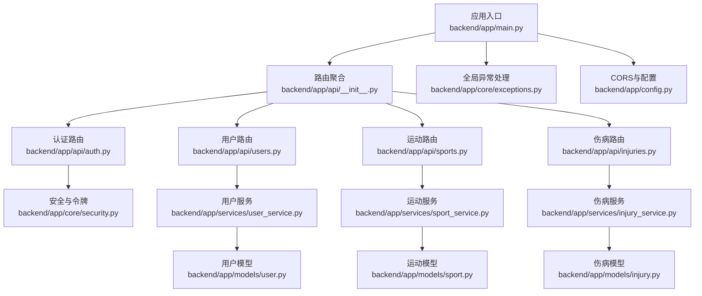
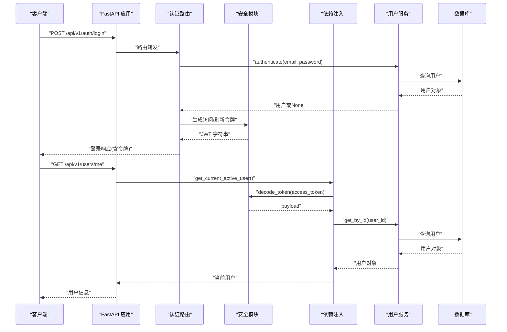
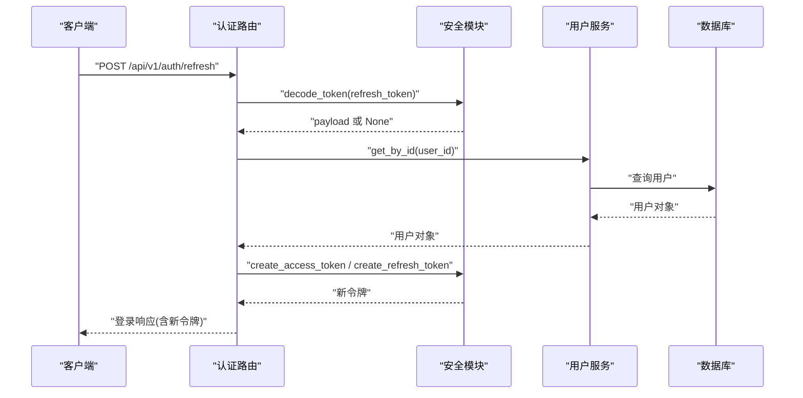
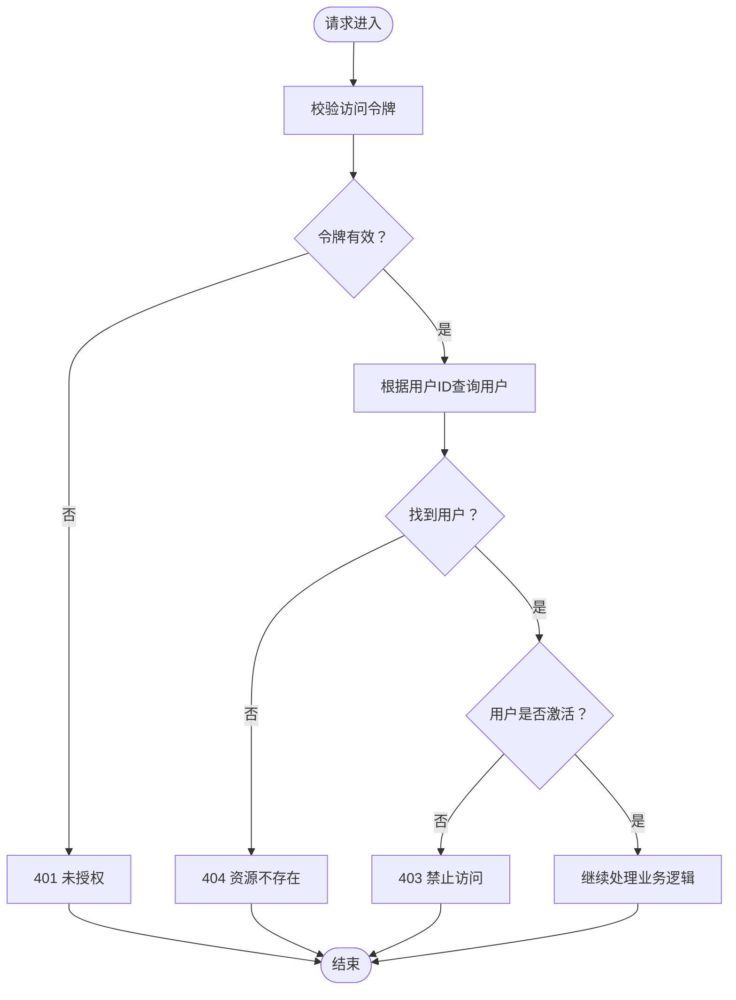
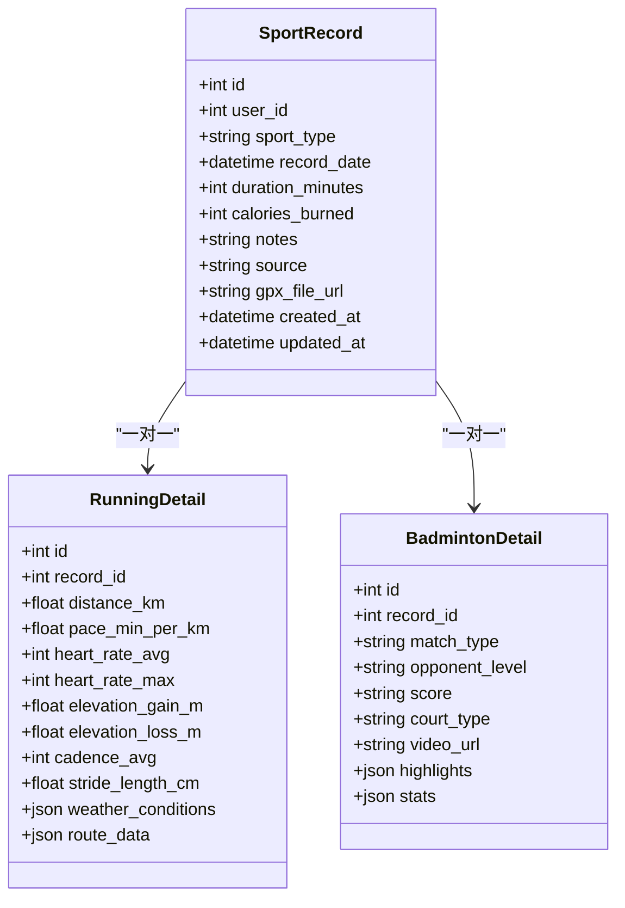
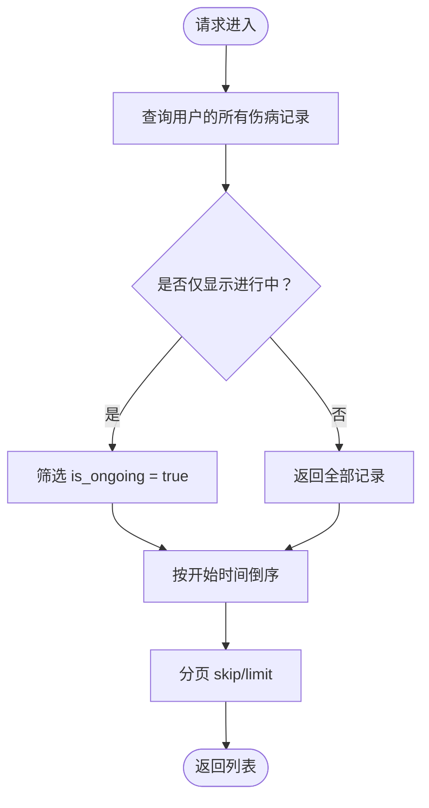
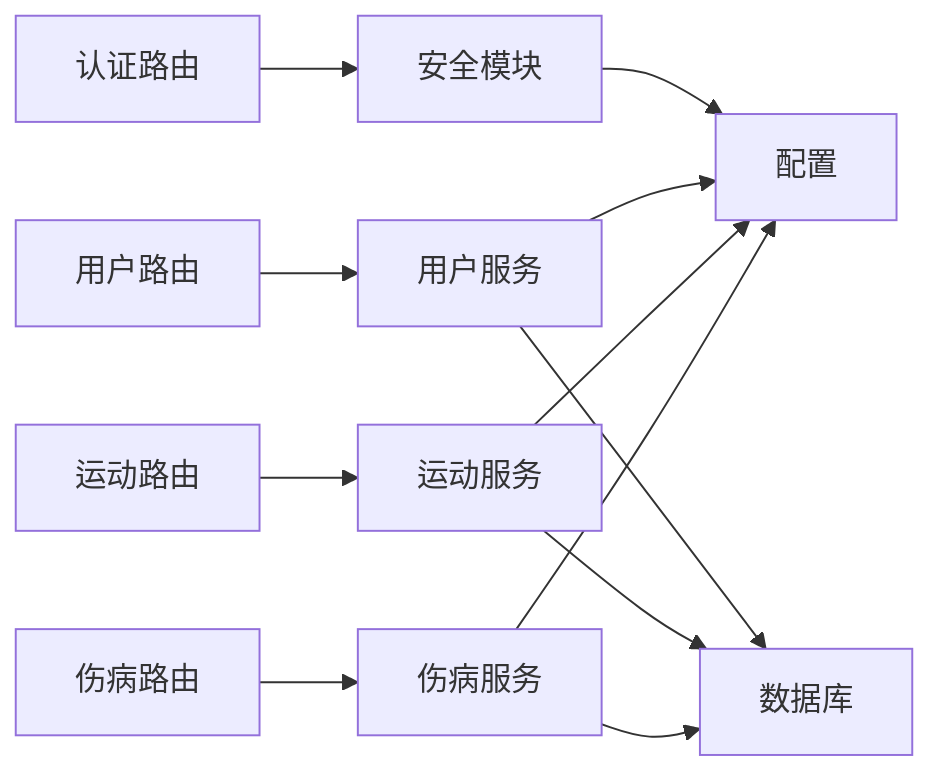
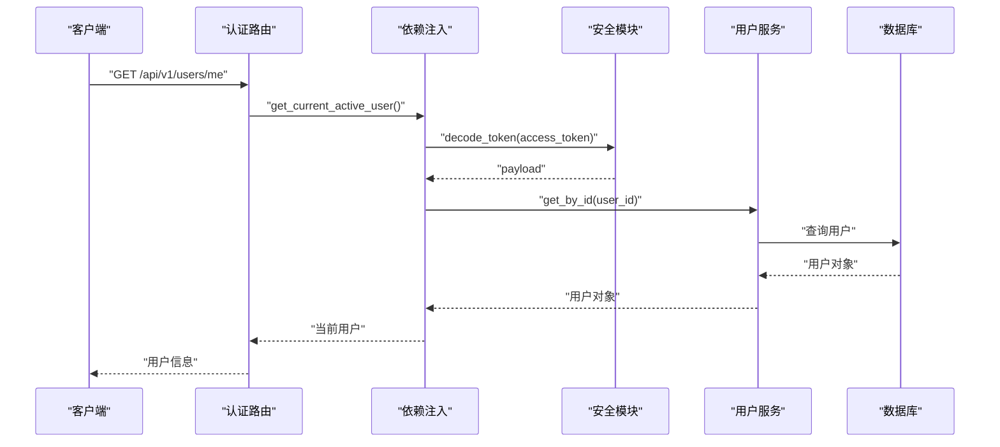

# 后端API文档

<cite>
**本文档引用的文件**
- [backend/app/main.py](file://backend/app/main.py)
- [backend/app/api/__init__.py](file://backend/app/api/__init__.py)
- [backend/app/api/auth.py](file://backend/app/api/auth.py)
- [backend/app/api/users.py](file://backend/app/api/users.py)
- [backend/app/api/sports.py](file://backend/app/api/sports.py)
- [backend/app/api/injuries.py](file://backend/app/api/injuries.py)
- [backend/app/config.py](file://backend/app/config.py)
- [backend/app/core/security.py](file://backend/app/core/security.py)
- [backend/app/core/dependencies.py](file://backend/app/core/dependencies.py)
- [backend/app/core/exceptions.py](file://backend/app/core/exceptions.py)
- [backend/app/models/user.py](file://backend/app/models/user.py)
- [backend/app/models/injury.py](file://backend/app/models/injury.py)
- [backend/app/models/sport.py](file://backend/app/models/sport.py)
- [backend/app/services/user_service.py](file://backend/app/services/user_service.py)
- [backend/app/services/injury_service.py](file://backend/app/services/injury_service.py)
- [backend/app/services/sport_service.py](file://backend/app/services/sport_service.py)
- [backend/app/schemas/auth.py](file://backend/app/schemas/auth.py)
- [backend/app/schemas/user.py](file://backend/app/schemas/user.py)
- [backend/app/schemas/injury.py](file://backend/app/schemas/injury.py)
- [backend/app/schemas/sport.py](file://backend/app/schemas/sport.py)
</cite>

## 目录
1. [简介](#简介)
2. [项目结构](#项目结构)
3. [核心组件](#核心组件)
4. [架构总览](#架构总览)
5. [详细组件分析](#详细组件分析)
6. [依赖分析](#依赖分析)
7. [性能考虑](#性能考虑)
8. [故障排查指南](#故障排查指南)
9. [结论](#结论)
10. [附录](#附录)

## 简介
ActiveSynapse 是一个个人运动与健康管理系统，后端基于 FastAPI 构建，采用异步数据库访问（SQLAlchemy Async），提供认证、用户管理、运动记录与伤病管理等核心能力。API 通过版本前缀统一在 /api/v1 下提供，并使用 HTTP Bearer 令牌进行鉴权。

## 项目结构
后端采用分层架构：路由层（APIRouter）、服务层（Service）、数据模型（ORM）与数据验证层（Pydantic Schemas）。应用入口负责初始化数据库、注册中间件与异常处理器，并挂载 API 路由。

图表来源
- [backend/app/main.py](file://backend/app/main.py#L1-L77)
- [backend/app/api/__init__.py](file://backend/app/api/__init__.py#L1-L10)
- [backend/app/api/auth.py](file://backend/app/api/auth.py#L1-L92)
- [backend/app/api/users.py](file://backend/app/api/users.py#L1-L88)
- [backend/app/api/sports.py](file://backend/app/api/sports.py#L1-L127)
- [backend/app/api/injuries.py](file://backend/app/api/injuries.py#L1-L92)
- [backend/app/core/security.py](file://backend/app/core/security.py#L1-L50)
- [backend/app/services/user_service.py](file://backend/app/services/user_service.py#L1-L120)
- [backend/app/services/sport_service.py](file://backend/app/services/sport_service.py#L1-L238)
- [backend/app/services/injury_service.py](file://backend/app/services/injury_service.py#L1-L115)
- [backend/app/models/user.py](file://backend/app/models/user.py#L1-L62)
- [backend/app/models/sport.py](file://backend/app/models/sport.py#L1-L115)
- [backend/app/models/injury.py](file://backend/app/models/injury.py#L1-L70)
- [backend/app/core/exceptions.py](file://backend/app/core/exceptions.py#L1-L54)
- [backend/app/config.py](file://backend/app/config.py#L1-L46)

章节来源
- [backend/app/main.py](file://backend/app/main.py#L1-L77)
- [backend/app/api/__init__.py](file://backend/app/api/__init__.py#L1-L10)

## 核心组件
- 应用入口与生命周期：初始化数据库、注册 CORS、异常处理器；挂载 /api/v1 前缀路由。
- 安全与鉴权：HTTP Bearer 令牌，访问令牌与刷新令牌分离，支持令牌刷新与登出。
- 数据模型：用户、用户档案、运动记录（含跑步与羽毛球明细）、伤病记录。
- 服务层：封装业务逻辑，执行数据持久化与统计计算。
- 数据验证：Pydantic 模型定义请求/响应结构与字段约束。

章节来源
- [backend/app/main.py](file://backend/app/main.py#L21-L57)
- [backend/app/core/security.py](file://backend/app/core/security.py#L21-L50)
- [backend/app/core/dependencies.py](file://backend/app/core/dependencies.py#L11-L61)
- [backend/app/models/user.py](file://backend/app/models/user.py#L7-L28)
- [backend/app/models/sport.py](file://backend/app/models/sport.py#L23-L47)
- [backend/app/models/injury.py](file://backend/app/models/injury.py#L39-L66)

## 架构总览
下图展示从客户端到服务层的典型调用链路，包括认证、鉴权与业务处理。

图表来源
- [backend/app/api/auth.py](file://backend/app/api/auth.py#L25-L49)
- [backend/app/core/security.py](file://backend/app/core/security.py#L21-L40)
- [backend/app/core/dependencies.py](file://backend/app/core/dependencies.py#L11-L50)
- [backend/app/services/user_service.py](file://backend/app/services/user_service.py#L61-L68)

## 详细组件分析

### 认证系统
- 终端与功能
  - 注册：POST /api/v1/auth/register
  - 登录：POST /api/v1/auth/login（返回 access_token、refresh_token、用户信息）
  - 刷新：POST /api/v1/auth/refresh（使用 refresh_token 获取新令牌）
  - 登出：POST /api/v1/auth/logout（提示客户端丢弃令牌）
- 请求/响应
  - 登录请求：邮箱、密码
  - 登录响应：access_token、refresh_token、token_type、expires_in、用户信息
  - 刷新请求：refresh_token
- 鉴权方式
  - HTTP Bearer 令牌，访问令牌用于受保护资源，刷新令牌用于换取新的访问令牌
- 错误处理
  - 认证失败、无效令牌、用户不存在或非活跃账户会返回相应状态码
- 令牌管理
  - 访问令牌过期时间可配置；刷新令牌过期时间可配置；刷新时同时发放新访问/刷新令牌

图表来源
- [backend/app/api/auth.py](file://backend/app/api/auth.py#L52-L85)
- [backend/app/core/security.py](file://backend/app/core/security.py#L21-L40)
- [backend/app/services/user_service.py](file://backend/app/services/user_service.py#L14-L17)

章节来源
- [backend/app/api/auth.py](file://backend/app/api/auth.py#L17-L92)
- [backend/app/core/security.py](file://backend/app/core/security.py#L21-L50)
- [backend/app/core/dependencies.py](file://backend/app/core/dependencies.py#L11-L61)
- [backend/app/schemas/auth.py](file://backend/app/schemas/auth.py#L6-L35)

### 用户管理API
- 终端与功能
  - 获取当前用户信息：GET /api/v1/users/me
  - 更新当前用户信息：PUT /api/v1/users/me
  - 获取当前用户档案：GET /api/v1/users/me/profile
  - 更新或创建当前用户档案：PUT /api/v1/users/me/profile
  - 上传头像（占位）：POST /api/v1/users/me/avatar
- 权限控制
  - 使用 get_current_active_user 依赖，要求携带有效且未过期的访问令牌，且用户处于激活状态
- 请求/响应
  - 用户信息响应包含基础字段与可选档案
  - 档案响应包含身高、体重、生日、性别、运动等级、目标、偏好、周目标等
- 错误处理
  - 未认证、令牌无效、用户不存在或非活跃账户返回相应状态码

图表来源
- [backend/app/core/dependencies.py](file://backend/app/core/dependencies.py#L11-L61)
- [backend/app/services/user_service.py](file://backend/app/services/user_service.py#L14-L17)

章节来源
- [backend/app/api/users.py](file://backend/app/api/users.py#L13-L88)
- [backend/app/core/dependencies.py](file://backend/app/core/dependencies.py#L53-L61)
- [backend/app/schemas/user.py](file://backend/app/schemas/user.py#L36-L69)

### 运动记录API
- 终端与功能
  - 查询运动记录列表：GET /api/v1/sports/records（支持分页、按类型与日期范围过滤）
  - 创建运动记录：POST /api/v1/sports/records（支持跑步/羽毛球明细）
  - 获取单条运动记录：GET /api/v1/sports/records/{record_id}
  - 更新运动记录：PUT /api/v1/sports/records/{record_id}
  - 删除运动记录：DELETE /api/v1/sports/records/{record_id}
  - 运动统计：GET /api/v1/sports/statistics（可按类型与天数聚合）
  - 周汇总：GET /api/v1/sports/weekly-summary
  - GPX 导入（占位）：POST /api/v1/sports/records/import
- 请求/响应
  - 运动记录响应包含基础信息与对应明细（跑步/羽毛球）
  - 统计响应包含活动总数、时长、卡路里、平均时长等，以及按运动类型的细分指标
- 参数说明
  - 分页参数：skip（>=0）、limit（1..1000）
  - 过滤参数：sport_type、start_date、end_date
  - 统计参数：sport_type、days（1..365）

图表来源
- [backend/app/models/sport.py](file://backend/app/models/sport.py#L23-L47)
- [backend/app/models/sport.py](file://backend/app/models/sport.py#L52-L84)
- [backend/app/models/sport.py](file://backend/app/models/sport.py#L87-L114)

章节来源
- [backend/app/api/sports.py](file://backend/app/api/sports.py#L14-L127)
- [backend/app/services/sport_service.py](file://backend/app/services/sport_service.py#L23-L238)
- [backend/app/schemas/sport.py](file://backend/app/schemas/sport.py#L55-L102)

### 伤病管理API
- 终端与功能
  - 查询伤病记录列表：GET /api/v1/injuries/（支持分页与仅显示进行中）
  - 创建伤病记录：POST /api/v1/injuries/
  - 获取单条伤病记录：GET /api/v1/injuries/{injury_id}
  - 更新伤病记录：PUT /api/v1/injuries/{injury_id}
  - 删除伤病记录：DELETE /api/v1/injuries/{injury_id}
  - 伤病统计摘要：GET /api/v1/injuries/summary/statistics
- 请求/响应
  - 伤病记录响应包含类型、部位、严重程度、起止时间、描述、治疗方案、是否复发/进行中等
  - 统计摘要包含总数、进行中数量、复发数量及按部位与类型的分布
- 参数说明
  - 分页参数：skip（>=0）、limit（1..1000）
  - 过滤参数：ongoing_only（布尔）

图表来源
- [backend/app/api/injuries.py](file://backend/app/api/injuries.py#L13-L30)
- [backend/app/services/injury_service.py](file://backend/app/services/injury_service.py#L22-L37)

章节来源
- [backend/app/api/injuries.py](file://backend/app/api/injuries.py#L13-L92)
- [backend/app/services/injury_service.py](file://backend/app/services/injury_service.py#L87-L115)
- [backend/app/schemas/injury.py](file://backend/app/schemas/injury.py#L6-L42)

## 依赖分析
- 组件耦合
  - 路由层仅依赖服务层与依赖注入，保持低耦合
  - 服务层依赖数据库会话与异常类，职责清晰
  - 安全模块独立于业务，提供通用的令牌生成与解码
- 外部依赖
  - 数据库：PostgreSQL（异步/同步）
  - 缓存：Redis（配置项存在）
  - 文件上传：本地目录与大小限制配置
- 版本与兼容
  - API 前缀 /api/v1，便于后续版本演进
  - Pydantic 模型作为契约，有助于前后端一致性

图表来源
- [backend/app/api/auth.py](file://backend/app/api/auth.py#L1-L92)
- [backend/app/api/users.py](file://backend/app/api/users.py#L1-L88)
- [backend/app/api/sports.py](file://backend/app/api/sports.py#L1-L127)
- [backend/app/api/injuries.py](file://backend/app/api/injuries.py#L1-L92)
- [backend/app/core/security.py](file://backend/app/core/security.py#L1-L50)
- [backend/app/config.py](file://backend/app/config.py#L1-L46)

章节来源
- [backend/app/config.py](file://backend/app/config.py#L11-L33)

## 性能考虑
- 异步数据库访问：使用 SQLAlchemy Async 降低 I/O 阻塞
- 分页与限制：默认每页最多 1000 条，避免一次性返回大量数据
- 统计计算：服务层聚合计算，减少前端重复处理
- 缓存与队列：Redis 配置可用，可用于热点数据缓存或任务队列
- 文件上传：上传目录与大小限制需结合实际存储服务（如对象存储）优化

## 故障排查指南
- 常见状态码
  - 400：请求参数不合法（Pydantic 校验失败）
  - 401：未认证或令牌无效
  - 403：用户非活跃或权限不足
  - 404：资源不存在
  - 409：资源冲突（如邮箱/用户名已存在）
  - 422：数据验证失败
  - 500：服务器内部错误
- 全局异常处理
  - 自定义 AppException 及其子类，统一封装错误响应
  - FastAPI 全局异常处理器将异常转换为 JSON 响应
- 调试建议
  - 使用 /docs（Swagger UI）查看接口契约与示例
  - 检查 CORS 配置与允许的来源
  - 关注令牌有效期与刷新流程
  - 对大数据量查询启用分页与合理限制

章节来源
- [backend/app/core/exceptions.py](file://backend/app/core/exceptions.py#L4-L54)
- [backend/app/main.py](file://backend/app/main.py#L38-L53)

## 结论
ActiveSynapse 后端以清晰的分层架构与严格的请求/响应契约提供了完整的认证、用户、运动与伤病管理能力。通过版本前缀与 Pydantic 模型，系统具备良好的扩展性与向前兼容性。建议在生产环境中完善文件存储、缓存与监控体系，并持续优化统计与报表性能。

## 附录

### API 一览表
- 认证
  - POST /api/v1/auth/register
  - POST /api/v1/auth/login
  - POST /api/v1/auth/refresh
  - POST /api/v1/auth/logout
- 用户
  - GET /api/v1/users/me
  - PUT /api/v1/users/me
  - GET /api/v1/users/me/profile
  - PUT /api/v1/users/me/profile
  - POST /api/v1/users/me/avatar
- 运动
  - GET /api/v1/sports/records
  - POST /api/v1/sports/records
  - GET /api/v1/sports/records/{record_id}
  - PUT /api/v1/sports/records/{record_id}
  - DELETE /api/v1/sports/records/{record_id}
  - GET /api/v1/sports/statistics
  - GET /api/v1/sports/weekly-summary
  - POST /api/v1/sports/records/import
- 伤病
  - GET /api/v1/injuries/
  - POST /api/v1/injuries/
  - GET /api/v1/injuries/{injury_id}
  - PUT /api/v1/injuries/{injury_id}
  - DELETE /api/v1/injuries/{injury_id}
  - GET /api/v1/injuries/summary/statistics

### 认证流程与令牌管理
- 登录流程
  - 客户端提交邮箱与密码
  - 服务端验证成功后生成访问令牌与刷新令牌
  - 访问令牌用于后续受保护请求，刷新令牌用于轮换访问令牌
- 令牌刷新
  - 使用刷新令牌解码并校验类型
  - 校验用户存在且激活
  - 重新签发新的访问/刷新令牌
- 权限控制
  - 所有受保护端点依赖 HTTP Bearer 令牌
  - 依赖注入解析令牌并校验用户状态

图表来源
- [backend/app/api/users.py](file://backend/app/api/users.py#L13-L36)
- [backend/app/core/dependencies.py](file://backend/app/core/dependencies.py#L11-L50)
- [backend/app/core/security.py](file://backend/app/core/security.py#L43-L50)

### 速率限制、版本控制与兼容性
- 版本控制
  - API 前缀 /api/v1，未来可通过新增 /api/v2 实现向后兼容
- 速率限制
  - 当前未内置速率限制中间件，可在网关或应用层添加
- 向后兼容
  - Pydantic 模型字段默认排除未设置值，有利于平滑演进

章节来源
- [backend/app/main.py](file://backend/app/main.py#L57-L66)
- [backend/app/config.py](file://backend/app/config.py#L7-L9)

### 客户端实现建议与性能优化
- 客户端实现建议
  - 存储访问令牌与刷新令牌，请求受保护资源时附加 Authorization: Bearer
  - 在访问令牌即将过期时主动刷新
  - 对大列表查询使用分页参数，避免一次性加载过多数据
- 性能优化
  - 将统计计算移至服务层，减少重复计算
  - 对热点数据引入缓存（Redis）
  - 文件上传建议使用对象存储并配合 CDN