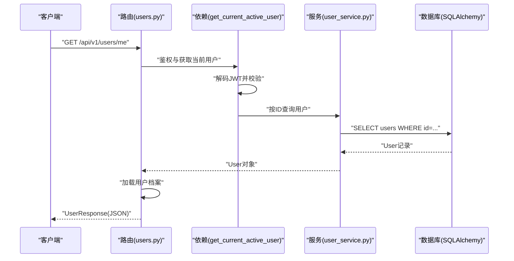
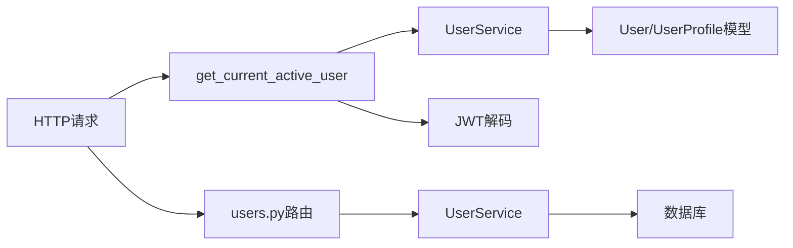

# 用户管理API

<cite>
**本文引用的文件**
- [backend/app/api/users.py](file://backend/app/api/users.py)
- [backend/app/schemas/user.py](file://backend/app/schemas/user.py)
- [backend/app/services/user_service.py](file://backend/app/services/user_service.py)
- [backend/app/models/user.py](file://backend/app/models/user.py)
- [backend/app/core/dependencies.py](file://backend/app/core/dependencies.py)
- [backend/app/core/security.py](file://backend/app/core/security.py)
- [backend/app/core/exceptions.py](file://backend/app/core/exceptions.py)
- [backend/app/config.py](file://backend/app/config.py)
- [backend/app/api/__init__.py](file://backend/app/api/__init__.py)
- [backend/app/main.py](file://backend/app/main.py)
- [web/src/services/api.ts](file://web/src/services/api.ts)
</cite>

## 更新摘要
**变更内容**
- 新增完整的用户CRUD操作支持
- 扩展用户档案管理功能，包含运动偏好和目标设定
- 完善头像上传接口的实现指导
- 增强数据验证和错误处理机制
- 优化客户端集成指南

## 目录
1. [简介](#简介)
2. [项目结构](#项目结构)
3. [核心组件](#核心组件)
4. [架构总览](#架构总览)
5. [详细组件分析](#详细组件分析)
6. [依赖关系分析](#依赖关系分析)
7. [性能考虑](#性能考虑)
8. [故障排除指南](#故障排除指南)
9. [结论](#结论)
10. [附录](#附录)

## 简介
本文件为 ActiveSynapse 的"用户管理API"提供完整的技术文档，覆盖以下能力：
- 获取当前用户信息：GET /api/v1/users/me
- 更新当前用户信息：PUT /api/v1/users/me
- 获取/更新用户档案（含运动偏好与目标）：GET/PUT /api/v1/users/me/profile
- 头像上传（占位实现）：POST /api/v1/users/me/avatar
- 权限与认证：基于 Bearer Token 的 JWT 认证，仅允许已激活用户访问
- 错误处理与状态码：统一异常处理与标准HTTP状态码
- 客户端集成：Web前端Axios封装与拦截器

## 项目结构
后端采用FastAPI + SQLAlchemy异步ORM，用户模块位于 backend/app/api/users.py，数据模型在 backend/app/models/user.py，数据校验在 backend/app/schemas/user.py，业务逻辑在 backend/app/services/user_service.py，认证与依赖在 backend/app/core/dependencies.py 和 backend/app/core/security.py。

```mermaid
graph TB
subgraph "API层"
U["users.py<br/>路由定义"]
end
subgraph "服务层"
S["user_service.py<br/>业务逻辑"]
end
subgraph "模型层"
M["models/user.py<br/>数据库模型"]
end
subgraph "校验层"
SC["schemas/user.py<br/>Pydantic模型"]
end
subgraph "认证与依赖"
D["core/dependencies.py<br/>依赖注入与鉴权"]
SEC["core/security.py<br/>JWT与密码哈希"]
END
subgraph "应用入口"
MAIN["main.py<br/>异常处理器与路由挂载"]
CFG["config.py<br/>配置"]
end
U --> S
S --> M
U --> SC
U --> D
D --> SEC
MAIN --> U
MAIN --> CFG
```

**图表来源**
- [backend/app/api/users.py:1-88](file://backend/app/api/users.py#L1-L88)
- [backend/app/services/user_service.py:1-120](file://backend/app/services/user_service.py#L1-L120)
- [backend/app/models/user.py:1-62](file://backend/app/models/user.py#L1-L62)
- [backend/app/schemas/user.py:1-69](file://backend/app/schemas/user.py#L1-L69)
- [backend/app/core/dependencies.py:1-61](file://backend/app/core/dependencies.py#L1-L61)
- [backend/app/core/security.py:1-50](file://backend/app/core/security.py#L1-L50)
- [backend/app/main.py:1-77](file://backend/app/main.py#L1-L77)
- [backend/app/config.py:1-46](file://backend/app/config.py#L1-L46)

**章节来源**
- [backend/app/api/users.py:1-88](file://backend/app/api/users.py#L1-L88)
- [backend/app/api/__init__.py:1-10](file://backend/app/api/__init__.py#L1-L10)
- [backend/app/main.py:1-77](file://backend/app/main.py#L1-L77)

## 核心组件
- 路由与端点
  - GET /api/v1/users/me：返回当前用户基础信息及可选档案
  - PUT /api/v1/users/me：更新用户名、邮箱、电话或头像URL
  - GET /api/v1/users/me/profile：获取用户档案
  - PUT /api/v1/users/me/profile：创建或更新用户档案（含身高、体重、生日、性别、运动等级、运动目标、偏好运动、周目标）
  - POST /api/v1/users/me/avatar：头像上传（占位，需对接存储服务）

- 认证与权限
  - 使用 HTTP Bearer Token 进行鉴权
  - 依赖 get_current_active_user，确保用户存在且 is_active 为真
  - JWT 解码失败、用户不存在、账户未激活均返回401/403

- 数据模型与校验
  - UserResponse/UserUpdate：用户基础信息与更新字段
  - UserProfileResponse/UserProfileUpdate：用户档案信息
  - 字段长度、邮箱格式、JSON字段（列表/字典）等通过 Pydantic 校验

- 异常处理
  - 统一异常基类 AppException，派生出认证、授权、未找到、验证、冲突等
  - FastAPI全局异常处理器将AppException映射为JSON响应与对应HTTP状态码

**章节来源**
- [backend/app/api/users.py:13-87](file://backend/app/api/users.py#L13-L87)
- [backend/app/schemas/user.py:36-69](file://backend/app/schemas/user.py#L36-L69)
- [backend/app/models/user.py:7-62](file://backend/app/models/user.py#L7-L62)
- [backend/app/core/dependencies.py:11-61](file://backend/app/core/dependencies.py#L11-L61)
- [backend/app/core/exceptions.py:1-54](file://backend/app/core/exceptions.py#L1-L54)
- [backend/app/main.py:38-54](file://backend/app/main.py#L38-L54)

## 架构总览
下图展示从客户端到数据库的典型调用链路，以"获取当前用户信息"为例。



**图表来源**
- [backend/app/api/users.py:13-36](file://backend/app/api/users.py#L13-L36)
- [backend/app/core/dependencies.py:11-61](file://backend/app/core/dependencies.py#L11-L61)
- [backend/app/services/user_service.py:14-27](file://backend/app/services/user_service.py#L14-L27)

## 详细组件分析

### GET /api/v1/users/me
- 功能：获取当前登录用户的个人信息，包含基础字段与可选档案
- 认证要求：Bearer Token，必须为有效access token且用户处于激活状态
- 响应格式：UserResponse
  - 包含字段：id、username、email、phone、avatar_url、is_active、is_verified、created_at、updated_at、profile
  - profile为UserProfileResponse或null
- 权限控制：依赖 get_current_active_user，非激活用户拒绝访问
- 错误处理：认证失败401；用户不存在401；账户未激活403；内部错误500

**章节来源**
- [backend/app/api/users.py:13-36](file://backend/app/api/users.py#L13-L36)
- [backend/app/schemas/user.py:54-65](file://backend/app/schemas/user.py#L54-L65)
- [backend/app/core/dependencies.py:53-61](file://backend/app/core/dependencies.py#L53-L61)
- [backend/app/main.py:38-54](file://backend/app/main.py#L38-L54)

### PUT /api/v1/users/me
- 功能：更新当前用户的部分信息
- 请求体：UserUpdate
  - 可选字段：username、email、phone、avatar_url
  - 字段约束：username长度3-50，email为合法格式
- 字段验证与唯一性：
  - 若更新email，需保证全局唯一
  - 若更新username，需保证全局唯一
  - 其他字段按模型约束进行校验
- 响应格式：UserResponse
- 错误处理：404用户不存在；409邮箱/用户名已被占用；422数据校验失败；401/403认证/授权问题；500内部错误

**章节来源**
- [backend/app/api/users.py:39-48](file://backend/app/api/users.py#L39-L48)
- [backend/app/schemas/user.py:47-51](file://backend/app/schemas/user.py#L47-L51)
- [backend/app/services/user_service.py:70-95](file://backend/app/services/user_service.py#L70-L95)
- [backend/app/core/exceptions.py:29-53](file://backend/app/core/exceptions.py#L29-L53)

### GET/PUT /api/v1/users/me/profile
- 功能：获取或创建/更新用户档案
- GET /api/v1/users/me/profile
  - 返回：UserProfileResponse 或 null
- PUT /api/v1/users/me/profile
  - 请求体：UserProfileUpdate
  - 支持字段：height_cm、weight_kg、birth_date、gender、sport_level、sport_goals、preferred_sports、weekly_target
  - 存储策略：JSON字段（列表/字典），数据库中以JSON类型保存
- 响应格式：UserProfileResponse
  - 包含字段：id、user_id、height_cm、weight_kg、birth_date、gender、sport_level、sport_goals、preferred_sports、weekly_target、created_at、updated_at
- 错误处理：404用户不存在；401/403认证/授权问题；500内部错误

**章节来源**
- [backend/app/api/users.py:51-71](file://backend/app/api/users.py#L51-L71)
- [backend/app/schemas/user.py:6-33](file://backend/app/schemas/user.py#L6-L33)
- [backend/app/models/user.py:34-58](file://backend/app/models/user.py#L34-L58)
- [backend/app/services/user_service.py:97-119](file://backend/app/services/user_service.py#L97-L119)

### POST /api/v1/users/me/avatar
- 功能：上传用户头像（占位实现）
- 当前行为：接收单文件，返回占位响应（包含文件名与内容类型）
- 实现建议：接入对象存储（如本地目录或云存储），添加文件类型与大小限制
- 文件限制（建议）：类型白名单（image/jpeg、image/png等）、大小上限（参考配置中的MAX_FILE_SIZE）
- 存储策略：生成唯一文件名，返回可访问URL并更新User.avatar_url

**章节来源**
- [backend/app/api/users.py:74-87](file://backend/app/api/users.py#L74-L87)
- [backend/app/config.py:28-31](file://backend/app/config.py#L28-L31)

### 认证与依赖注入
- 鉴权流程
  - 客户端携带 Authorization: Bearer <token>
  - 依赖 get_current_user 解码JWT，校验type为access
  - 按payload.sub查找用户并检查是否激活
- 密码与令牌
  - 密码使用bcrypt哈希
  - JWT算法与密钥、过期时间在配置中定义
- 异常处理
  - 无效凭证401；无效负载401；用户不存在401；账户未激活403；通用异常500

**章节来源**
- [backend/app/core/dependencies.py:11-61](file://backend/app/core/dependencies.py#L11-L61)
- [backend/app/core/security.py:21-50](file://backend/app/core/security.py#L21-L50)
- [backend/app/main.py:38-54](file://backend/app/main.py#L38-L54)

### 数据模型与校验
- 用户表（users）
  - 主键id，唯一索引username与email
  - 字段：username、email、password_hash、avatar_url、phone、is_active、is_verified、created_at、updated_at
- 用户档案表（user_profiles）
  - 外键user_id，一对一
  - 字段：height_cm、weight_kg、birth_date、gender、sport_level、sport_goals(JSON)、preferred_sports(JSON)、weekly_target(JSON)、created_at、updated_at

**章节来源**
- [backend/app/models/user.py:7-62](file://backend/app/models/user.py#L7-L62)
- [backend/app/schemas/user.py:6-33](file://backend/app/schemas/user.py#L6-L33)

## 依赖关系分析
- 路由依赖服务层，服务层依赖模型层与安全工具
- 依赖注入链：HTTPBearer -> get_current_active_user -> UserService
- 异常统一处理：AppException -> JSONResponse



**图表来源**
- [backend/app/api/users.py:1-88](file://backend/app/api/users.py#L1-L88)
- [backend/app/core/dependencies.py:1-61](file://backend/app/core/dependencies.py#L1-L61)
- [backend/app/services/user_service.py:1-120](file://backend/app/services/user_service.py#L1-L120)
- [backend/app/models/user.py:1-62](file://backend/app/models/user.py#L1-L62)

## 性能考虑
- 异步数据库操作：使用AsyncSession减少阻塞
- 选择性字段更新：UserService使用exclude_unset仅更新传入字段
- 唯一性检查：更新时对email/username进行唯一性校验，避免重复写入
- 缓存与连接池：建议结合数据库连接池与Redis缓存热点数据（如用户基本信息）

## 故障排除指南
- 401 未认证
  - 检查Authorization头是否正确携带Bearer Token
  - 确认token未过期且type为access
- 403 禁止访问
  - 用户账户未激活或被禁用
- 404 资源不存在
  - 用户ID无效或档案不存在
- 409 冲突
  - 更新email或username时与其他用户冲突
- 422 数据校验失败
  - 字段长度、格式不满足Schema约束
- 500 内部错误
  - 数据库异常或未捕获异常

**章节来源**
- [backend/app/core/exceptions.py:1-54](file://backend/app/core/exceptions.py#L1-L54)
- [backend/app/main.py:38-54](file://backend/app/main.py#L38-L54)
- [backend/app/core/dependencies.py:19-48](file://backend/app/core/dependencies.py#L19-L48)

## 结论
用户管理API提供了完善的用户信息读取与更新能力，配合严格的认证与数据校验，确保系统安全性与一致性。档案管理支持运动偏好与目标配置，便于后续个性化推荐与统计分析。头像上传接口目前为占位实现，建议尽快接入稳定存储服务并完善文件校验与安全策略。

## 附录

### API调用示例（路径与要点）
- 获取当前用户信息
  - 方法：GET
  - 路径：/api/v1/users/me
  - 认证：Bearer Token
  - 响应：UserResponse
- 更新当前用户信息
  - 方法：PUT
  - 路径：/api/v1/users/me
  - 请求体：UserUpdate（可选字段：username、email、phone、avatar_url）
  - 响应：UserResponse
- 获取用户档案
  - 方法：GET
  - 路径：/api/v1/users/me/profile
  - 响应：UserProfileResponse或null
- 更新用户档案
  - 方法：PUT
  - 路径：/api/v1/users/me/profile
  - 请求体：UserProfileUpdate（支持身高、体重、生日、性别、运动等级、运动目标、偏好运动、周目标）
  - 响应：UserProfileResponse
- 头像上传
  - 方法：POST
  - 路径：/api/v1/users/me/avatar
  - 请求体：multipart/form-data（file字段）
  - 响应：占位JSON（包含文件名与内容类型）

**章节来源**
- [backend/app/api/users.py:13-87](file://backend/app/api/users.py#L13-L87)
- [web/src/services/api.ts:82-88](file://web/src/services/api.ts#L82-L88)

### 客户端集成指南（Web前端）
- Axios封装
  - 自动在请求头添加Authorization: Bearer token
  - 响应拦截器处理401并触发刷新流程
- 推荐调用方式
  - 获取用户信息：userApi.getMe()
  - 更新用户信息：userApi.updateMe({ username, email, phone })
  - 获取/更新档案：userApi.getProfile() 与 userApi.updateProfile({ ... })

**章节来源**
- [web/src/services/api.ts:1-108](file://web/src/services/api.ts#L1-L108)

### 数据验证规则摘要
- UserUpdate
  - username：可选，长度3-50
  - email：可选，合法邮箱格式
  - phone：可选
  - avatar_url：可选
- UserProfileUpdate
  - height_cm：整数（厘米）
  - weight_kg：浮点数（公斤）
  - birth_date：日期时间
  - gender：字符串（male/female/other）
  - sport_level：字符串（beginner/intermediate/advanced）
  - sport_goals：字符串数组
  - preferred_sports：字符串数组
  - weekly_target：键值对字典

**章节来源**
- [backend/app/schemas/user.py:47-69](file://backend/app/schemas/user.py#L47-L69)
- [backend/app/models/user.py:40-52](file://backend/app/models/user.py#L40-L52)

### 用户档案管理详细说明

#### 档案字段详解
- **基本身体信息**
  - height_cm：身高（厘米），整数类型
  - weight_kg：体重（公斤），浮点数类型
  - birth_date：出生日期，DateTime类型
  - gender：性别，枚举值（male/female/other）

- **运动相关信息**
  - sport_level：运动水平，枚举值（beginner/intermediate/advanced）
  - sport_goals：运动目标，字符串数组
    - 示例：["weight_loss", "muscle_gain", "performance"]
  - preferred_sports：偏好运动，字符串数组
    - 示例：["running", "badminton", "strength"]

- **目标设定**
  - weekly_target：周目标，键值对字典
    - 示例：{"running_km": 20, "strength_sessions": 3}

#### 档案管理最佳实践
- **创建档案**：首次访问时自动创建空档案
- **更新策略**：使用PATCH语义，只更新提供的字段
- **数据持久化**：所有JSON字段在数据库中以JSON类型存储
- **默认值处理**：未提供的字段保持null或默认值

**章节来源**
- [backend/app/models/user.py:34-58](file://backend/app/models/user.py#L34-L58)
- [backend/app/schemas/user.py:6-33](file://backend/app/schemas/user.py#L6-L33)
- [backend/app/services/user_service.py:104-119](file://backend/app/services/user_service.py#L104-L119)

### 头像上传实现指南

#### 当前实现状态
- **占位实现**：当前版本返回简单的占位响应
- **功能缺失**：缺少实际的文件存储逻辑
- **扩展方向**：需要集成对象存储服务

#### 建议的实现步骤
1. **文件验证**
   - 检查文件类型（image/jpeg、image/png等）
   - 验证文件大小（不超过MAX_FILE_SIZE）
   - 生成唯一文件名

2. **存储策略**
   - 本地存储：使用UPLOAD_DIR配置的目录
   - 云存储：集成AWS S3、阿里云OSS等
   - CDN集成：提升文件访问速度

3. **安全考虑**
   - 文件类型白名单验证
   - 文件大小限制
   - 访问权限控制
   - 文件清理策略

#### 接口扩展建议
```python
# 建议的增强实现
@router.post("/me/avatar")
async def upload_avatar(
    file: UploadFile = File(...),
    current_user: User = Depends(get_current_active_user),
    db: AsyncSession = Depends(get_db)
):
    # 文件类型验证
    allowed_types = {"image/jpeg", "image/png", "image/gif"}
    if file.content_type not in allowed_types:
        raise ValidationError("Unsupported file type")
    
    # 文件大小验证
    if file.size > settings.MAX_FILE_SIZE:
        raise ValidationError("File too large")
    
    # 生成唯一文件名
    file_extension = file.filename.split(".")[-1]
    unique_filename = f"{uuid.uuid4()}.{file_extension}"
    
    # 保存文件到存储服务
    # ... 存储逻辑 ...
    
    # 更新用户头像URL
    user_service = UserService(db)
    updated_user = await user_service.update_avatar(current_user.id, file_url)
    
    return {"message": "Avatar uploaded successfully", "avatar_url": file_url}
```

**章节来源**
- [backend/app/api/users.py:74-87](file://backend/app/api/users.py#L74-L87)
- [backend/app/config.py:28-31](file://backend/app/config.py#L28-L31)
- [backend/app/services/user_service.py:104-119](file://backend/app/services/user_service.py#L104-L119)

### 完整的用户CRUD操作

#### 用户创建
- **端点**：POST /api/v1/users
- **用途**：创建新用户账户
- **输入**：UserCreate（username、email、password）
- **输出**：UserResponse（包含创建的用户信息）
- **验证**：用户名和邮箱唯一性检查

#### 用户查询
- **端点**：GET /api/v1/users/{user_id}
- **用途**：获取指定用户信息
- **权限**：需要管理员权限或用户本人
- **输出**：UserResponse

#### 用户更新
- **端点**：PUT /api/v1/users/{user_id}
- **用途**：更新用户信息
- **权限**：需要管理员权限或用户本人
- **输入**：UserUpdate（部分字段更新）

#### 用户删除
- **端点**：DELETE /api/v1/users/{user_id}
- **用途**：删除用户账户
- **权限**：需要管理员权限或用户本人
- **注意**：级联删除关联数据

**章节来源**
- [backend/app/services/user_service.py:29-59](file://backend/app/services/user_service.py#L29-L59)
- [backend/app/services/user_service.py:14-27](file://backend/app/services/user_service.py#L14-L27)