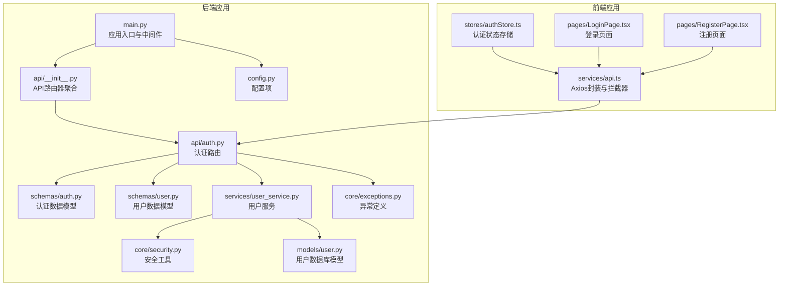
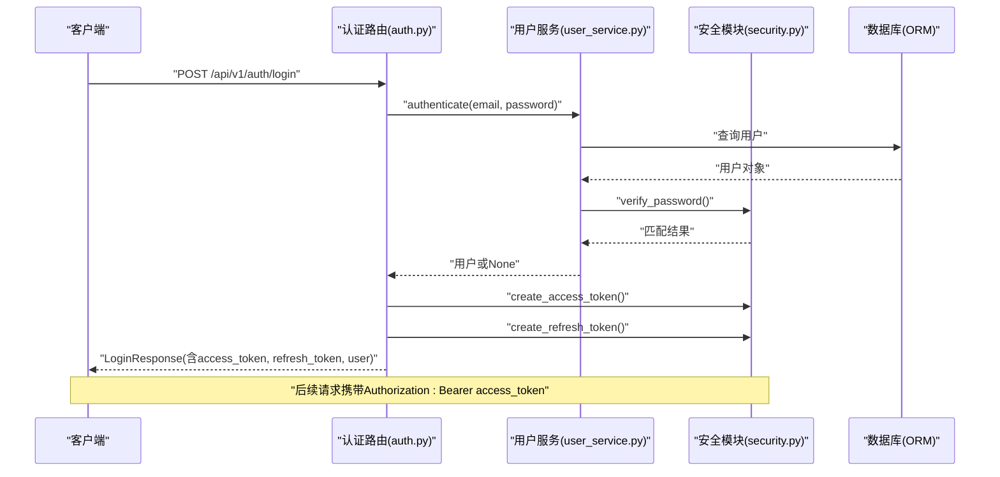
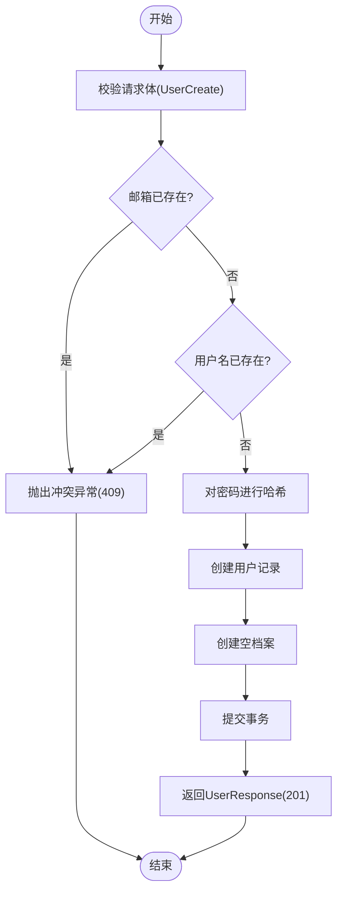
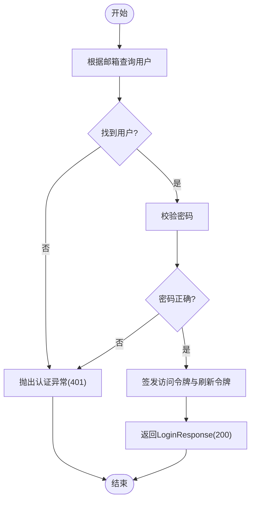
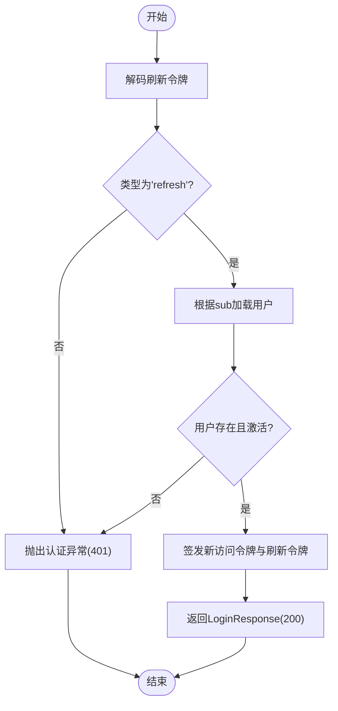
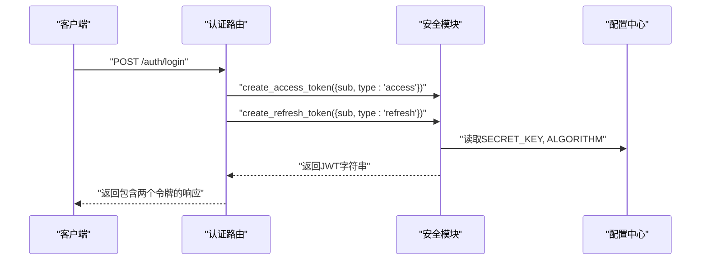
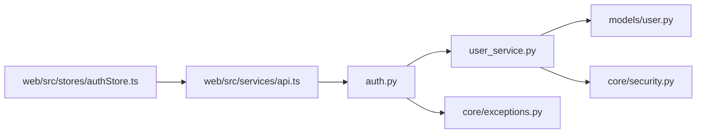

# 认证API

<cite>
**本文引用的文件**
- [backend/app/api/auth.py](file://backend/app/api/auth.py)
- [backend/app/schemas/auth.py](file://backend/app/schemas/auth.py)
- [backend/app/schemas/user.py](file://backend/app/schemas/user.py)
- [backend/app/services/user_service.py](file://backend/app/services/user_service.py)
- [backend/app/core/security.py](file://backend/app/core/security.py)
- [backend/app/core/exceptions.py](file://backend/app/core/exceptions.py)
- [backend/app/config.py](file://backend/app/config.py)
- [backend/app/models/user.py](file://backend/app/models/user.py)
- [backend/app/main.py](file://backend/app/main.py)
- [backend/app/api/__init__.py](file://backend/app/api/__init__.py)
- [web/src/services/api.ts](file://web/src/services/api.ts)
- [web/src/stores/authStore.ts](file://web/src/stores/authStore.ts)
- [web/src/pages/LoginPage.tsx](file://web/src/pages/LoginPage.tsx)
- [web/src/pages/RegisterPage.tsx](file://web/src/pages/RegisterPage.tsx)
</cite>

## 更新摘要
**变更内容**
- 补充了JWT令牌结构和声明信息的详细说明
- 增加了令牌过期时间和安全配置的具体参数
- 完善了前端自动刷新机制的技术实现细节
- 详细说明了令牌类型标识和验证流程
- 补充了配置文件中的JWT相关设置

## 目录
1. [简介](#简介)
2. [项目结构](#项目结构)
3. [核心组件](#核心组件)
4. [架构总览](#架构总览)
5. [详细组件分析](#详细组件分析)
6. [JWT认证机制详解](#jwt认证机制详解)
7. [依赖关系分析](#依赖关系分析)
8. [性能考量](#性能考量)
9. [故障排除指南](#故障排除指南)
10. [结论](#结论)
11. [附录](#附录)

## 简介
本文件为 ActiveSynapse 认证API的权威技术文档，覆盖用户注册、登录、令牌刷新与登出的完整流程。文档基于后端FastAPI实现与前端Web应用集成，提供：
- 接口定义与数据模型
- 请求/响应示例与状态码说明
- 错误处理策略与安全考虑
- 客户端实现指南与最佳实践

## 项目结构
认证API位于后端FastAPI应用中，通过统一的API路由器挂载在 `/api/v1/auth` 路径下，配合全局异常处理器与CORS中间件提供一致的错误与跨域支持。

**图表来源**
- [backend/app/main.py:21-57](file://backend/app/main.py#L21-L57)
- [backend/app/api/__init__.py:4-9](file://backend/app/api/__init__.py#L4-L9)
- [backend/app/api/auth.py:1-92](file://backend/app/api/auth.py#L1-L92)
- [backend/app/schemas/auth.py:1-35](file://backend/app/schemas/auth.py#L1-L35)
- [backend/app/schemas/user.py:1-69](file://backend/app/schemas/user.py#L1-L69)
- [backend/app/services/user_service.py:1-120](file://backend/app/services/user_service.py#L1-L120)
- [backend/app/core/security.py:1-50](file://backend/app/core/security.py#L1-L50)
- [backend/app/core/exceptions.py:1-54](file://backend/app/core/exceptions.py#L1-L54)
- [backend/app/models/user.py:1-62](file://backend/app/models/user.py#L1-L62)
- [backend/app/config.py:1-46](file://backend/app/config.py#L1-L46)
- [web/src/services/api.ts:1-108](file://web/src/services/api.ts#L1-L108)
- [web/src/stores/authStore.ts:1-52](file://web/src/stores/authStore.ts#L1-L52)
- [web/src/pages/LoginPage.tsx:1-93](file://web/src/pages/LoginPage.tsx#L1-L93)
- [web/src/pages/RegisterPage.tsx:1-127](file://web/src/pages/RegisterPage.tsx#L1-L127)

**章节来源**
- [backend/app/main.py:21-57](file://backend/app/main.py#L21-L57)
- [backend/app/api/__init__.py:4-9](file://backend/app/api/__init__.py#L4-L9)

## 核心组件
- 认证路由：提供注册、登录、刷新、登出四个端点，均位于 `/api/v1/auth` 前缀下。
- 数据模型：使用Pydantic模型定义请求与响应结构，确保类型安全与自动校验。
- 用户服务：封装数据库操作与业务逻辑（创建用户、认证、查询）。
- 安全模块：提供密码哈希、JWT生成与解码、令牌类型校验等能力。
- 异常体系：统一HTTP异常映射，便于前端识别与处理。
- 配置中心：集中管理JWT密钥、算法、过期时间等安全参数。

**章节来源**
- [backend/app/api/auth.py:17-92](file://backend/app/api/auth.py#L17-L92)
- [backend/app/schemas/auth.py:6-35](file://backend/app/schemas/auth.py#L6-L35)
- [backend/app/schemas/user.py:43-69](file://backend/app/schemas/user.py#L43-L69)
- [backend/app/services/user_service.py:10-120](file://backend/app/services/user_service.py#L10-L120)
- [backend/app/core/security.py:11-50](file://backend/app/core/security.py#L11-L50)
- [backend/app/core/exceptions.py:4-54](file://backend/app/core/exceptions.py#L4-L54)
- [backend/app/config.py:18-22](file://backend/app/config.py#L18-L22)

## 架构总览
认证API采用分层设计：
- 表现层：FastAPI路由处理HTTP请求，调用服务层。
- 服务层：封装业务逻辑与数据库交互。
- 模型层：SQLAlchemy ORM模型与Pydantic数据模型。
- 安全层：密码哈希、JWT签发与验证。
- 异常层：统一异常转换为标准HTTP响应。
- 前端集成：Axios拦截器自动携带令牌与处理刷新。

**图表来源**
- [backend/app/api/auth.py:25-49](file://backend/app/api/auth.py#L25-L49)
- [backend/app/services/user_service.py:61-68](file://backend/app/services/user_service.py#L61-L68)
- [backend/app/core/security.py:21-40](file://backend/app/core/security.py#L21-L40)
- [backend/app/models/user.py:7-29](file://backend/app/models/user.py#L7-L29)

## 详细组件分析

### 注册接口 /api/v1/auth/register
- 方法与路径：POST /api/v1/auth/register
- 功能：创建新用户，校验用户名与邮箱唯一性，生成默认空档案。
- 请求体：UserCreate
  - 字段：username, email, password（最小长度6），可选phone
- 成功响应：UserResponse（包含用户基础信息与创建时间）
- 状态码：
  - 201 Created：注册成功
  - 409 Conflict：邮箱或用户名已存在
  - 422 Unprocessable Entity：字段校验失败
- 错误处理：
  - 使用冲突异常类提示资源冲突
  - 全局异常处理器将AppException转换为JSON响应

请求示例（示意）
- 请求头：Content-Type: application/json
- 请求体：
  - username: "张三"
  - email: "zhangsan@example.com"
  - password: "至少6位"
  - phone: "+8613800000000"

响应示例（示意）
- 201 Created
- 响应体：
  - id: 1
  - username: "张三"
  - email: "zhangsan@example.com"
  - avatar_url: null
  - is_active: true
  - is_verified: false
  - created_at: "2025-01-01T00:00:00Z"
  - updated_at: "2025-01-01T00:00:00Z"

**章节来源**
- [backend/app/api/auth.py:17-22](file://backend/app/api/auth.py#L17-L22)
- [backend/app/schemas/user.py:43-69](file://backend/app/schemas/user.py#L43-L69)
- [backend/app/services/user_service.py:29-59](file://backend/app/services/user_service.py#L29-L59)
- [backend/app/core/exceptions.py:47-53](file://backend/app/core/exceptions.py#L47-L53)

### 登录接口 /api/v1/auth/login
- 方法与路径：POST /api/v1/auth/login
- 功能：邮箱密码验证，签发访问令牌与刷新令牌。
- 请求体：LoginRequest
  - 字段：email, password
- 成功响应：LoginResponse
  - 字段：access_token, refresh_token, token_type, expires_in, user
  - user：包含id, username, email, avatar_url
- 状态码：
  - 200 OK：登录成功
  - 401 Unauthorized：邮箱或密码无效
  - 422 Unprocessable Entity：请求体校验失败
- 安全要点：
  - 访问令牌过期时间由配置项控制
  - 刷新令牌用于换取新的访问令牌与刷新令牌

请求示例（示意）
- 请求体：
  - email: "zhangsan@example.com"
  - password: "用户密码"

响应示例（示意）
- 200 OK
- 响应体：
  - access_token: "eyJhbGciOiJIUzI1NiIs..."
  - refresh_token: "eyJhbGciOiJIUzI1NiIs..."
  - token_type: "bearer"
  - expires_in: 1800
  - user:
    - id: 1
    - username: "张三"
    - email: "zhangsan@example.com"
    - avatar_url: null

**章节来源**
- [backend/app/api/auth.py:25-49](file://backend/app/api/auth.py#L25-L49)
- [backend/app/schemas/auth.py:6-21](file://backend/app/schemas/auth.py#L6-L21)
- [backend/app/core/security.py:21-40](file://backend/app/core/security.py#L21-L40)
- [backend/app/config.py:18-22](file://backend/app/config.py#L18-L22)

### 令牌刷新接口 /api/v1/auth/refresh
- 方法与路径：POST /api/v1/auth/refresh
- 功能：使用刷新令牌换取新的访问令牌与刷新令牌。
- 请求体：TokenRefreshRequest
  - 字段：refresh_token
- 成功响应：LoginResponse（同登录响应）
- 状态码：
  - 200 OK：刷新成功
  - 401 Unauthorized：刷新令牌无效或用户不存在/未激活
  - 422 Unprocessable Entity：请求体校验失败
- 安全考虑：
  - 解码时校验令牌类型为"refresh"
  - 校验用户存在且处于激活状态
  - 刷新令牌过期时间由配置项控制

请求示例（示意）
- 请求体：
  - refresh_token: "刷新令牌字符串"

响应示例（示意）
- 200 OK
- 响应体：
  - access_token: "新访问令牌"
  - refresh_token: "新刷新令牌"
  - token_type: "bearer"
  - expires_in: 1800
  - user: 用户信息

**章节来源**
- [backend/app/api/auth.py:52-85](file://backend/app/api/auth.py#L52-L85)
- [backend/app/schemas/auth.py:11-13](file://backend/app/schemas/auth.py#L11-L13)
- [backend/app/core/security.py:43-49](file://backend/app/core/security.py#L43-L49)
- [backend/app/config.py:21-22](file://backend/app/config.py#L21-L22)

### 登出接口 /api/v1/auth/logout
- 方法与路径：POST /api/v1/auth/logout
- 功能：服务端登出（当前实现为轻量提示，实际登出由客户端负责丢弃令牌）。
- 响应：简单消息确认登出成功。
- 状态码：200 OK

请求示例（示意）
- 请求体：空
- 响应体：
  - message: "Successfully logged out"

**章节来源**
- [backend/app/api/auth.py:88-91](file://backend/app/api/auth.py#L88-L91)

### 数据模型与复杂度分析
- UserCreate/UserResponse：字段数量固定，序列化/反序列化为O(n)，n为字段数。
- LoginRequest/LoginResponse：结构简单，序列化开销低。
- TokenRefreshRequest：单字段，开销极小。
- 密码哈希与验证：bcrypt哈希与比较为O(k)，k为密码长度。
- JWT签发与解码：哈希算法与解析为O(1)于数据规模外。

**章节来源**
- [backend/app/schemas/user.py:43-69](file://backend/app/schemas/user.py#L43-L69)
- [backend/app/schemas/auth.py:6-21](file://backend/app/schemas/auth.py#L6-L21)
- [backend/app/core/security.py:11-18](file://backend/app/core/security.py#L11-L18)

### 处理流程图

#### 注册流程

**图表来源**
- [backend/app/services/user_service.py:29-59](file://backend/app/services/user_service.py#L29-L59)
- [backend/app/core/security.py:16-18](file://backend/app/core/security.py#L16-L18)

#### 登录流程

**图表来源**
- [backend/app/services/user_service.py:61-68](file://backend/app/services/user_service.py#L61-L68)
- [backend/app/core/security.py:21-40](file://backend/app/core/security.py#L21-L40)

#### 刷新流程

**图表来源**
- [backend/app/api/auth.py:52-85](file://backend/app/api/auth.py#L52-L85)
- [backend/app/core/security.py:43-49](file://backend/app/core/security.py#L43-L49)

## JWT认证机制详解

### 令牌结构与声明
JWT令牌包含以下关键声明（claims）：
- `sub`：用户标识符（用户ID）
- `type`：令牌类型（"access" 或 "refresh"）
- `exp`：过期时间戳（UTC时间）
- `iat`：签发时间戳（UTC时间）

### 访问令牌（Access Token）
- 用途：用于访问受保护的API端点
- 过期时间：由配置项 `ACCESS_TOKEN_EXPIRE_MINUTES` 控制，默认30分钟
- 结构：包含用户ID和访问类型声明
- 使用方式：在HTTP请求头中使用 `Authorization: Bearer <token>`

### 刷新令牌（Refresh Token）
- 用途：用于获取新的访问令牌
- 过期时间：由配置项 `REFRESH_TOKEN_EXPIRE_DAYS` 控制，默认7天
- 结构：包含用户ID和刷新类型声明
- 安全性：存储在更安全的位置，建议使用HttpOnly Cookie

### 令牌生成与验证流程

**图表来源**
- [backend/app/core/security.py:21-40](file://backend/app/core/security.py#L21-L40)
- [backend/app/config.py:18-22](file://backend/app/config.py#L18-L22)

### 前端自动刷新机制
前端通过Axios拦截器实现透明的令牌刷新：
- 请求拦截器：自动添加Authorization头
- 响应拦截器：检测401错误，触发刷新流程
- 刷新流程：使用刷新令牌获取新令牌对
- 重试机制：刷新成功后重试原始请求

**章节来源**
- [backend/app/core/security.py:21-49](file://backend/app/core/security.py#L21-L49)
- [backend/app/config.py:18-22](file://backend/app/config.py#L18-L22)
- [web/src/services/api.ts:13-64](file://web/src/services/api.ts#L13-L64)

## 依赖关系分析
- 路由到服务：认证路由依赖用户服务进行业务处理。
- 服务到模型：用户服务依赖SQLAlchemy模型与数据库会话。
- 服务到安全：用户服务依赖安全模块进行密码校验与哈希。
- 路由到异常：认证路由抛出认证异常，由全局异常处理器统一处理。
- 前端到后端：前端Axios实例通过拦截器自动添加Authorization头并处理401刷新。

**图表来源**
- [backend/app/api/auth.py:1-14](file://backend/app/api/auth.py#L1-L14)
- [backend/app/services/user_service.py:1-12](file://backend/app/services/user_service.py#L1-L12)
- [backend/app/models/user.py:1-62](file://backend/app/models/user.py#L1-L62)
- [backend/app/core/security.py:1-50](file://backend/app/core/security.py#L1-L50)
- [backend/app/core/exceptions.py:1-54](file://backend/app/core/exceptions.py#L1-L54)
- [web/src/services/api.ts:1-108](file://web/src/services/api.ts#L1-L108)
- [web/src/stores/authStore.ts:1-52](file://web/src/stores/authStore.ts#L1-L52)

**章节来源**
- [backend/app/api/auth.py:1-14](file://backend/app/api/auth.py#L1-L14)
- [backend/app/services/user_service.py:1-12](file://backend/app/services/user_service.py#L1-L12)
- [backend/app/core/security.py:1-50](file://backend/app/core/security.py#L1-L50)
- [web/src/services/api.ts:1-108](file://web/src/services/api.ts#L1-L108)

## 性能考量
- 密码哈希：bcrypt成本因子影响CPU占用，建议在生产环境适当调整。
- JWT大小：令牌仅包含必要声明（如sub），避免过大负载。
- 数据库查询：按邮箱/用户名查询使用索引列，避免全表扫描。
- 缓存策略：可结合Redis缓存活跃令牌集合，减少重复解码与查询。
- 并发控制：令牌刷新并发场景需保证幂等与一致性。

## 故障排除指南
- 401 Unauthorized
  - 可能原因：邮箱或密码错误；刷新令牌无效；用户不存在或未激活。
  - 处理建议：检查请求体字段；确认用户状态；核对刷新令牌是否过期。
- 409 Conflict
  - 可能原因：邮箱或用户名已被注册。
  - 处理建议：引导用户修改邮箱/用户名或直接登录。
- 422 Unprocessable Entity
  - 可能原因：请求体字段不满足约束（如长度、格式）。
  - 处理建议：前端校验与后端校验结合，明确提示字段要求。
- 500 Internal Server Error
  - 可能原因：未捕获异常或数据库连接问题。
  - 处理建议：查看服务日志，检查数据库与配置。

**章节来源**
- [backend/app/core/exceptions.py:10-53](file://backend/app/core/exceptions.py#L10-L53)
- [backend/app/api/auth.py:31-32](file://backend/app/api/auth.py#L31-L32)
- [backend/app/api/auth.py:57-62](file://backend/app/api/auth.py#L57-L62)
- [backend/app/api/auth.py:67-68](file://backend/app/api/auth.py#L67-L68)
- [backend/app/main.py:38-53](file://backend/app/main.py#L38-L53)

## 结论
ActiveSynapse认证API通过清晰的分层设计与严格的异常处理，提供了稳定可靠的用户注册、登录、令牌刷新与登出能力。结合前端Axios拦截器与状态存储，实现了自动令牌携带与刷新，提升了用户体验与安全性。JWT认证机制确保了令牌的安全性与可验证性，配置中心提供了灵活的安全参数管理。建议在生产环境中强化令牌黑名单、速率限制与审计日志，并定期轮换密钥与优化密码哈希成本。

## 附录

### 客户端实现指南与最佳实践
- 令牌存储
  - 建议使用安全存储（如HttpOnly Cookie或加密存储）保存刷新令牌，访问令牌仅保存在内存中。
  - 使用持久化状态管理（如Zustand）同步用户信息与令牌。
- 自动刷新
  - 在请求拦截器中检测401错误，触发刷新流程并重试原请求。
  - 刷新失败时清空本地状态并跳转至登录页。
- 请求头与路由
  - 对受保护路由统一添加Authorization: Bearer access_token。
  - 将认证相关API路径与业务API路径分离，便于维护。
- 错误处理
  - 统一展示错误消息，避免泄露敏感信息。
  - 对401错误优先尝试刷新，失败后再强制登出。

### JWT配置参数说明
- `SECRET_KEY`：JWT签名密钥，必须保密
- `ALGORITHM`：JWT算法，默认"HS256"
- `ACCESS_TOKEN_EXPIRE_MINUTES`：访问令牌过期时间（分钟）
- `REFRESH_TOKEN_EXPIRE_DAYS`：刷新令牌过期时间（天）

**章节来源**
- [web/src/services/api.ts:13-64](file://web/src/services/api.ts#L13-L64)
- [web/src/stores/authStore.ts:21-51](file://web/src/stores/authStore.ts#L21-L51)
- [web/src/pages/LoginPage.tsx:15-29](file://web/src/pages/LoginPage.tsx#L15-L29)
- [web/src/pages/RegisterPage.tsx:13-24](file://web/src/pages/RegisterPage.tsx#L13-L24)
- [backend/app/config.py:18-22](file://backend/app/config.py#L18-L22)