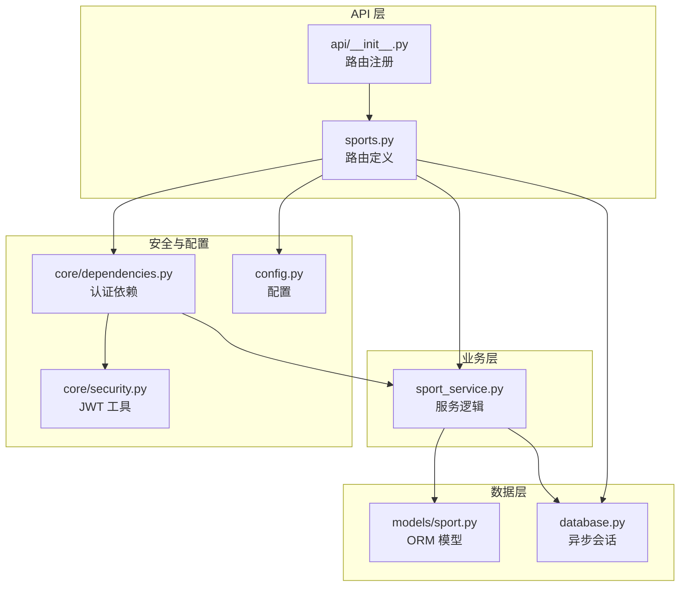
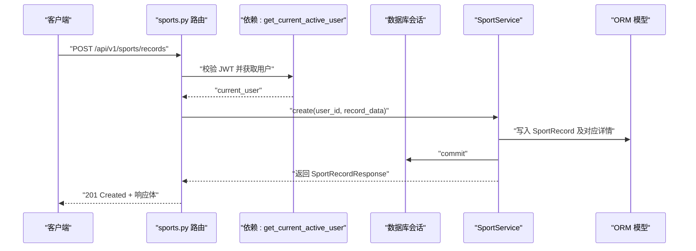
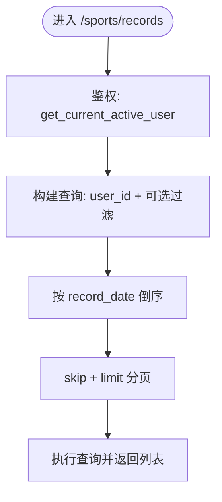
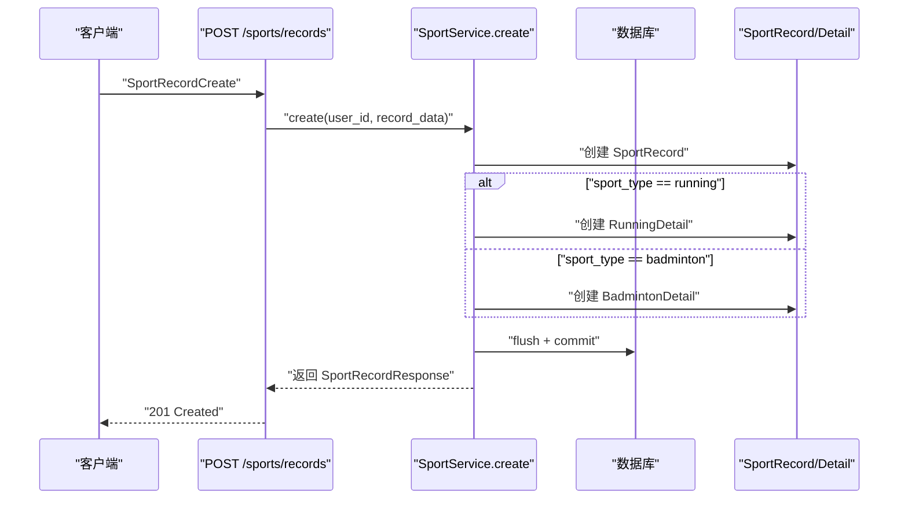
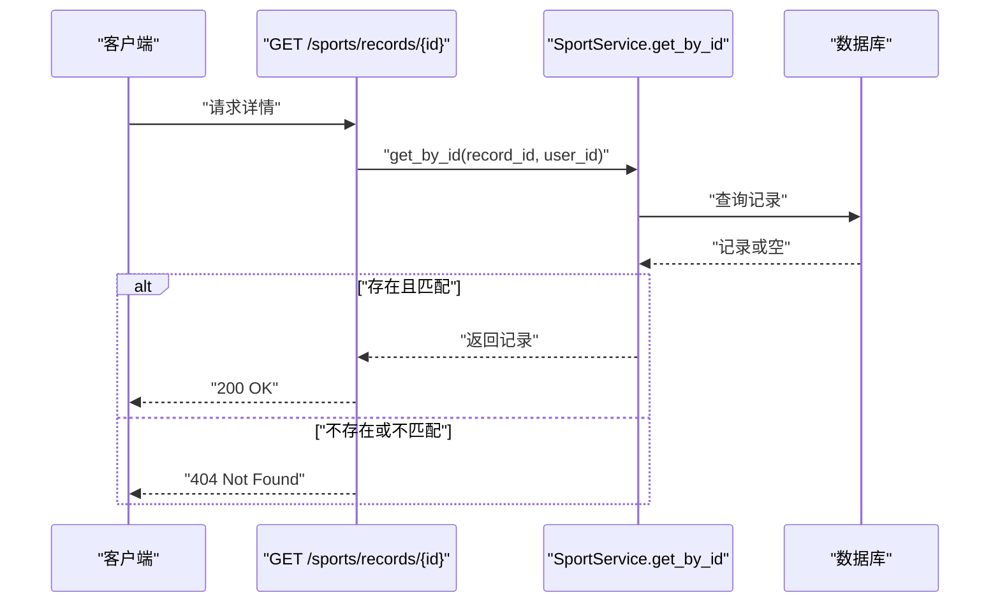
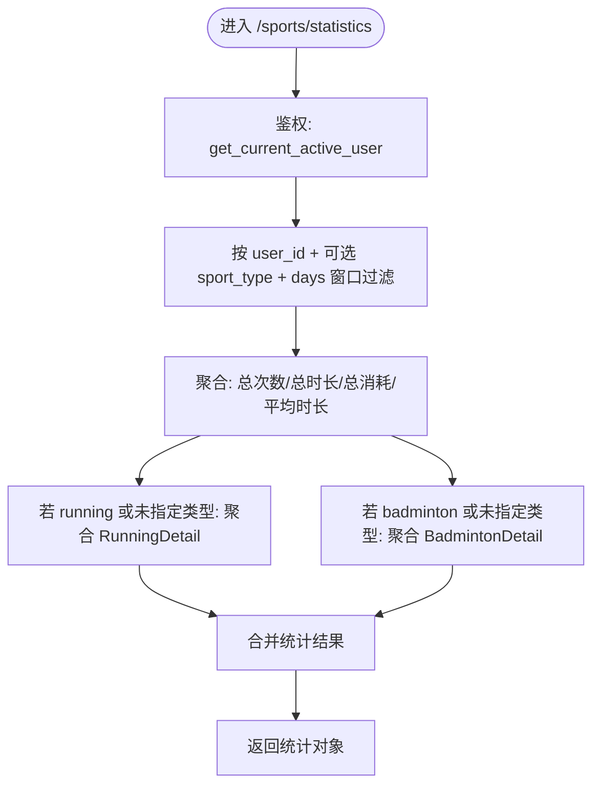
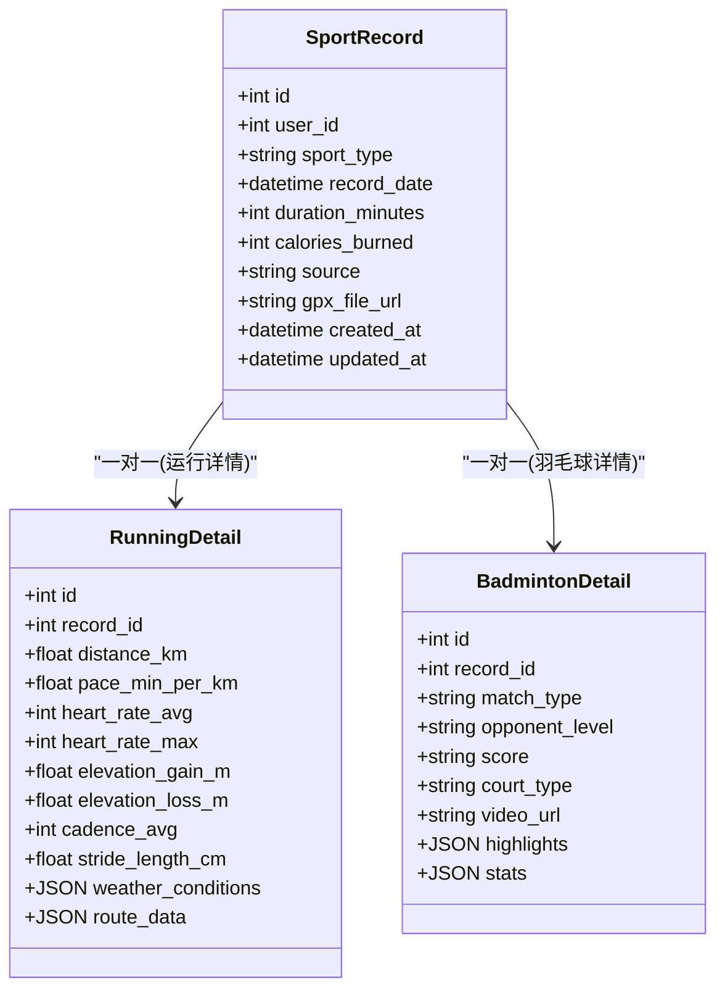

# 运动记录API

<cite>
**本文引用的文件**
- [backend/app/api/sports.py](file://backend/app/api/sports.py)
- [backend/app/models/sport.py](file://backend/app/models/sport.py)
- [backend/app/schemas/sport.py](file://backend/app/schemas/sport.py)
- [backend/app/services/sport_service.py](file://backend/app/services/sport_service.py)
- [backend/app/api/__init__.py](file://backend/app/api/__init__.py)
- [backend/app/main.py](file://backend/app/main.py)
- [backend/app/core/dependencies.py](file://backend/app/core/dependencies.py)
- [backend/app/core/security.py](file://backend/app/core/security.py)
- [backend/app/core/exceptions.py](file://backend/app/core/exceptions.py)
- [backend/app/config.py](file://backend/app/config.py)
- [backend/app/database.py](file://backend/app/database.py)
</cite>

## 更新摘要
**变更内容**
- 修正运动类型枚举拼写错误（BADMINTON → BADMINTON）
- 更新运动类型枚举值的一致性
- 完善GPX文件导入接口的占位实现说明
- 增强权限控制和错误处理机制
- 补充统计分析接口的详细说明

## 目录
1. [简介](#简介)
2. [项目结构](#项目结构)
3. [核心组件](#核心组件)
4. [架构总览](#架构总览)
5. [详细组件分析](#详细组件分析)
6. [依赖关系分析](#依赖关系分析)
7. [性能考虑](#性能考虑)
8. [故障排查指南](#故障排查指南)
9. [结论](#结论)
10. [附录](#附录)

## 简介
本文件为 ActiveSynapse 运动记录API的权威技术文档，覆盖以下内容：
- 运动记录的创建、查询、更新与删除接口
- 运动类型枚举、数据模型与字段约束
- 列表查询的分页、过滤与排序
- 详情查询的数据校验与权限控制
- 统计分析接口（历史趋势、性能指标、训练负荷）
- GPX 文件上传与解析流程（当前占位实现，后续扩展）
- 请求/响应示例、错误处理与性能优化建议
- 数据分析最佳实践与可视化指导

## 项目结构
后端采用 FastAPI + SQLAlchemy Async 架构，API 路由通过统一的根路由注册到 /api/v1 前缀下。运动记录模块位于 /sports 路由组，包含：
- 路由定义：/sports/records、/sports/records/{id}、/sports/statistics、/sports/weekly-summary、/sports/records/import
- 模型定义：运动记录主表及两类运动详情表（跑步、羽毛球）
- 服务层：封装数据库操作、统计聚合与汇总
- 校验模型：Pydantic 定义的输入输出模型
- 权限与安全：基于 JWT 的认证中间件与依赖注入

**图表来源**
- [backend/app/api/sports.py:1-127](file://backend/app/api/sports.py#L1-L127)
- [backend/app/api/__init__.py:1-10](file://backend/app/api/__init__.py#L1-L10)
- [backend/app/services/sport_service.py:1-238](file://backend/app/services/sport_service.py#L1-L238)
- [backend/app/models/sport.py:1-115](file://backend/app/models/sport.py#L1-L115)
- [backend/app/core/dependencies.py:1-61](file://backend/app/core/dependencies.py#L1-L61)
- [backend/app/core/security.py:1-50](file://backend/app/core/security.py#L1-L50)
- [backend/app/config.py:1-46](file://backend/app/config.py#L1-L46)
- [backend/app/database.py:1-43](file://backend/app/database.py#L1-L43)

**章节来源**
- [backend/app/api/sports.py:1-127](file://backend/app/api/sports.py#L1-L127)
- [backend/app/api/__init__.py:1-10](file://backend/app/api/__init__.py#L1-L10)
- [backend/app/main.py:1-77](file://backend/app/main.py#L1-L77)

## 核心组件
- 运动记录模型：包含基础信息、来源标记、关联详情表
- 运动类型枚举：running、badminton（修正拼写错误）
- 详情模型：RunningDetail（距离、配速、心率、海拔、步频、路线数据等）；BadmintonDetail（对战类型、对手水平、比分、场地、视频、高光时刻、统计数据等）
- 服务层：提供 CRUD、统计聚合、周汇总
- 路由层：提供列表、创建、详情、更新、删除、统计、周汇总、GPX 导入占位

**章节来源**
- [backend/app/models/sport.py:1-115](file://backend/app/models/sport.py#L1-L115)
- [backend/app/schemas/sport.py:1-102](file://backend/app/schemas/sport.py#L1-L102)
- [backend/app/services/sport_service.py:1-238](file://backend/app/services/sport_service.py#L1-L238)

## 架构总览
API 通过 /api/v1 前缀统一暴露，使用 JWT Bearer 认证，依赖注入数据库会话，异常统一处理。运动记录模块在路由中注册，服务层负责数据访问与聚合。

**图表来源**
- [backend/app/api/sports.py:37-46](file://backend/app/api/sports.py#L37-L46)
- [backend/app/services/sport_service.py:48-96](file://backend/app/services/sport_service.py#L48-L96)
- [backend/app/models/sport.py:23-47](file://backend/app/models/sport.py#L23-L47)

## 详细组件分析

### 接口总览与路径前缀
- 基础路径：/api/v1/sports
- 路由注册：通过 api_router.include_router(sports.router, prefix="/sports", tags=["Sports"])

**章节来源**
- [backend/app/api/__init__.py:1-10](file://backend/app/api/__init__.py#L1-L10)
- [backend/app/main.py:56-57](file://backend/app/main.py#L56-L57)

### GET /sports/records —— 获取运动记录列表
- 功能：按当前用户过滤，支持分页、按运动类型与日期范围过滤、按记录时间倒序
- 分页参数：
  - skip：非负整数，默认 0
  - limit：1~1000，默认 100
- 过滤条件：
  - sport_type：可选，枚举值 running、badminton
  - start_date、end_date：可选，按记录日期范围过滤
- 返回：SportRecordResponse 数组（含运行/羽毛球详情）

**图表来源**
- [backend/app/api/sports.py:14-34](file://backend/app/api/sports.py#L14-L34)
- [backend/app/services/sport_service.py:23-46](file://backend/app/services/sport_service.py#L23-L46)

**章节来源**
- [backend/app/api/sports.py:14-34](file://backend/app/api/sports.py#L14-L34)
- [backend/app/services/sport_service.py:23-46](file://backend/app/services/sport_service.py#L23-L46)

### POST /sports/records —— 创建运动记录
- 功能：创建运动记录，并根据运动类型创建对应的详情记录（运行或羽毛球）
- 输入模型：SportRecordCreate（包含基础字段与可选 running_detail/badminton_detail）
- 字段约束：
  - sport_type：必填，枚举 running 或 badminton
  - record_date：必填
  - duration_minutes：必填且 > 0
  - calories_burned：可选
  - notes：可选
  - source：默认 manual，可选 coros
  - gpx_file_url：可选
  - running_detail/badminton_detail：仅当 sport_type 对应时有效
- 输出：SportRecordResponse（包含详情）

**图表来源**
- [backend/app/api/sports.py:37-46](file://backend/app/api/sports.py#L37-L46)
- [backend/app/services/sport_service.py:48-96](file://backend/app/services/sport_service.py#L48-L96)
- [backend/app/schemas/sport.py:66-88](file://backend/app/schemas/sport.py#L66-L88)

**章节来源**
- [backend/app/api/sports.py:37-46](file://backend/app/api/sports.py#L37-L46)
- [backend/app/services/sport_service.py:48-96](file://backend/app/services/sport_service.py#L48-L96)
- [backend/app/schemas/sport.py:55-91](file://backend/app/schemas/sport.py#L55-L91)

### GET /sports/records/{id} —— 获取运动记录详情
- 功能：按记录ID获取详情，同时进行所有权校验（仅当前用户可读）
- 权限控制：依赖 get_current_active_user，内部通过查询确认 user_id 匹配
- 返回：SportRecordResponse（若不存在则返回 404）

**图表来源**
- [backend/app/api/sports.py:49-60](file://backend/app/api/sports.py#L49-L60)
- [backend/app/services/sport_service.py:14-21](file://backend/app/services/sport_service.py#L14-L21)

**章节来源**
- [backend/app/api/sports.py:49-60](file://backend/app/api/sports.py#L49-L60)
- [backend/app/services/sport_service.py:14-21](file://backend/app/services/sport_service.py#L14-L21)

### PUT /sports/records/{id} —— 更新运动记录
- 功能：部分更新，仅更新传入的字段
- 输入：SportRecordUpdate（字段均为可选）
- 权限控制：同详情读取
- 返回：更新后的 SportRecordResponse

**章节来源**
- [backend/app/api/sports.py:63-73](file://backend/app/api/sports.py#L63-L73)
- [backend/app/services/sport_service.py:98-115](file://backend/app/services/sport_service.py#L98-L115)
- [backend/app/schemas/sport.py:71-78](file://backend/app/schemas/sport.py#L71-L78)

### DELETE /sports/records/{id} —— 删除运动记录
- 功能：删除指定记录，同时级联删除详情
- 权限控制：同详情读取
- 返回：成功消息

**章节来源**
- [backend/app/api/sports.py:76-85](file://backend/app/api/sports.py#L76-L85)
- [backend/app/services/sport_service.py:117-125](file://backend/app/services/sport_service.py#L117-L125)

### GET /sports/statistics —— 获取运动统计
- 功能：按用户维度统计活动数量、总时长、总消耗、平均时长等；可选按运动类型与天数窗口过滤
- 参数：
  - sport_type：可选，running 或 badminton
  - days：1~365，默认 30
- 返回：包含通用统计与按运动类型的细分统计的对象

**图表来源**
- [backend/app/api/sports.py:88-102](file://backend/app/api/sports.py#L88-L102)
- [backend/app/services/sport_service.py:127-193](file://backend/app/services/sport_service.py#L127-L193)

**章节来源**
- [backend/app/api/sports.py:88-102](file://backend/app/api/sports.py#L88-L102)
- [backend/app/services/sport_service.py:127-193](file://backend/app/services/sport_service.py#L127-L193)

### GET /sports/weekly-summary —— 获取周汇总
- 功能：统计最近7天的每日活动时长与总消耗，按运动类型拆分
- 返回：包含周起止日期、每日明细与总活动数的对象

**章节来源**
- [backend/app/api/sports.py:105-113](file://backend/app/api/sports.py#L105-L113)
- [backend/app/services/sport_service.py:195-237](file://backend/app/services/sport_service.py#L195-L237)

### POST /sports/records/import —— GPX 文件导入（占位）
- 功能：COROS 设备 GPX 文件导入占位接口，当前返回提示信息
- 后续扩展：需实现文件上传、GPX 解析、轨迹数据提取与坐标转换、生成运动记录与详情

**章节来源**
- [backend/app/api/sports.py:116-126](file://backend/app/api/sports.py#L116-L126)

## 依赖关系分析

**图表来源**
- [backend/app/models/sport.py:23-114](file://backend/app/models/sport.py#L23-L114)

**章节来源**
- [backend/app/models/sport.py:1-115](file://backend/app/models/sport.py#L1-L115)

## 性能考虑
- 查询优化
  - 列表查询已按 record_date 倒序并支持 skip/limit，建议在 record_date 上建立索引以提升排序与分页性能
  - 过滤条件（sport_type、record_date）建议在数据库层面进行，避免应用侧二次筛选
- 统计聚合
  - 统计接口按 days 窗口裁剪，避免全量扫描；建议对 record_date 建立复合索引（user_id, record_date）
  - RunningDetail/BadmintonDetail 聚合使用子查询与 in 子句，注意批量查询的 SQL 复杂度
- 事务与连接
  - 使用异步会话，确保 commit/rollback 正确释放连接；避免长时间持有事务
- 缓存策略
  - 周汇总与常用统计可引入 Redis 缓存，设置合理过期时间
- 文件上传
  - GPX 导入建议限制文件大小与类型，解析过程异步化，避免阻塞请求线程

## 故障排查指南
- 认证失败
  - 现象：401 未授权
  - 原因：无效或过期的 JWT、非 access 类型 token、用户不存在或非激活状态
  - 处理：检查 Authorization 头、确认 token 类型与有效期、确认用户状态
- 权限不足
  - 现象：403 禁止访问
  - 原因：用户账户非激活
  - 处理：联系管理员或重新登录
- 资源不存在
  - 现象：404 未找到
  - 原因：记录不存在或不属于当前用户
  - 处理：确认 record_id 是否正确、是否属于当前用户
- 参数校验失败
  - 现象：422 参数不可处理
  - 原因：字段类型不符、范围越界、必填字段缺失
  - 处理：对照模型字段约束修正请求体

**章节来源**
- [backend/app/core/dependencies.py:11-60](file://backend/app/core/dependencies.py#L11-L60)
- [backend/app/core/exceptions.py:1-54](file://backend/app/core/exceptions.py#L1-L54)
- [backend/app/api/sports.py:58-59](file://backend/app/api/sports.py#L58-L59)

## 结论
ActiveSynapse 运动记录API提供了完善的 CRUD、统计与周汇总能力，支持两种运动类型的详细数据建模。GPX 导入接口目前为占位实现，建议后续结合文件上传与解析库完成轨迹数据提取与坐标转换。通过合理的索引、缓存与异步处理，可进一步提升性能与用户体验。

## 附录

### 运动类型与枚举
- 运动类型：running、badminton（修正拼写错误）
- 羽毛球对战类型：singles、doubles
- 球场类型：indoor、outdoor

**章节来源**
- [backend/app/models/sport.py:8-21](file://backend/app/models/sport.py#L8-L21)

### 数据模型字段说明（节选）
- 运动记录主表
  - sport_type：字符串，枚举 running/badminton
  - record_date：日期时间
  - duration_minutes：分钟，> 0
  - calories_burned：卡路里，可选
  - notes：备注，可选
  - source：来源 manual/coros，可选
  - gpx_file_url：GPX 文件地址，可选
- 运行详情
  - distance_km：公里，> 0
  - pace_min_per_km：配速，可选
  - heart_rate_avg/max：心率，可选范围校验
  - elevation_gain/loss_m：海拔增减，可选
  - cadence_avg：步频，可选
  - stride_length_cm：步幅，可选
  - weather_conditions：JSON，可选
  - route_data：JSON 数组，可选
- 羽毛球详情
  - match_type：单打/双打，可选
  - opponent_level：对手水平，可选
  - score：比分，可选
  - court_type：室内/室外，可选
  - video_url：视频链接，可选
  - highlights：高光时刻数组，可选
  - stats：比赛统计字典，可选

**章节来源**
- [backend/app/schemas/sport.py:55-102](file://backend/app/schemas/sport.py#L55-L102)
- [backend/app/models/sport.py:23-114](file://backend/app/models/sport.py#L23-L114)

### 错误码与处理
- 401 未授权：认证失败或 token 非 access
- 403 禁止访问：用户非激活
- 404 未找到：资源不存在或越权
- 422 参数不可处理：字段校验失败
- 500 内部错误：通用异常捕获

**章节来源**
- [backend/app/core/exceptions.py:1-54](file://backend/app/core/exceptions.py#L1-L54)
- [backend/app/main.py:38-53](file://backend/app/main.py#L38-L53)

### GPX 文件上传与解析流程（建议）
- 文件上传
  - 限制文件大小与 MIME 类型（application/gpx+xml）
  - 保存至安全目录，生成唯一文件名
- 解析与提取
  - 解析 GPX XML，提取轨迹点（纬度、经度、海拔、时间、心率）
  - 坐标转换：如需，将 WGS84 转换为项目坐标系
  - 计算距离、配速、海拔增减、平均心率等指标
- 生成运动记录
  - 创建运动记录与运行详情，填充 route_data 与指标
  - 可选：生成视频片段高光标注

### 数据分析最佳实践与可视化指导
- 指标计算
  - 历史趋势：按日/周/月聚合总时长、总距离、总消耗
  - 性能指标：配速分布、心率区间占比、海拔变化
  - 训练负荷：结合时长、强度与恢复指标综合评估
- 可视化建议
  - 折线图：趋势随时间变化
  - 柱状图：不同运动类型的对比
  - 热力图：每周活动密度
  - 散点图：配速与心率关系
- 前端集成
  - 使用图表库（如 ECharts、Chart.js）渲染
  - 支持交互式筛选（运动类型、日期范围）