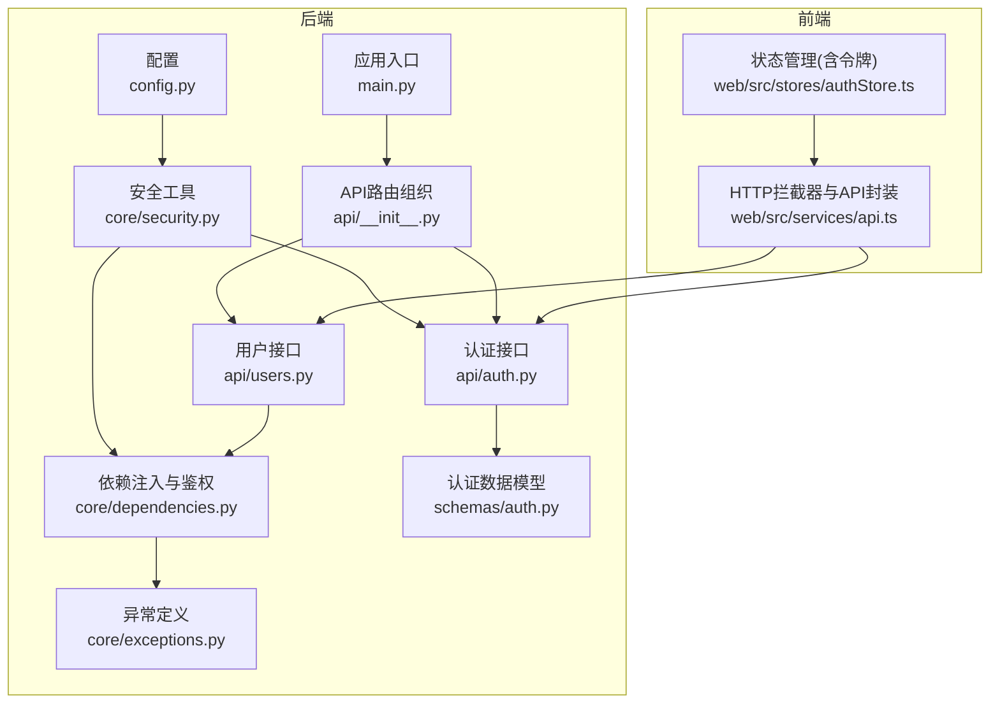
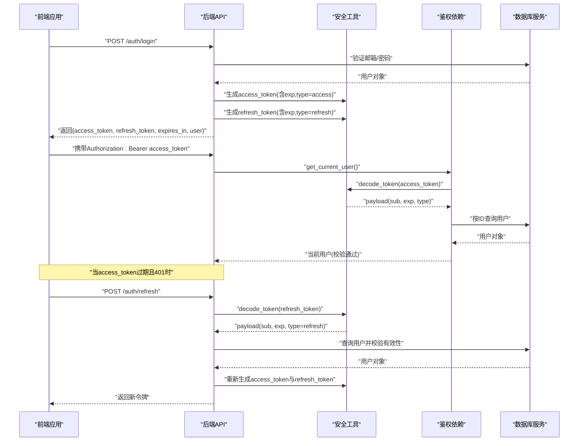
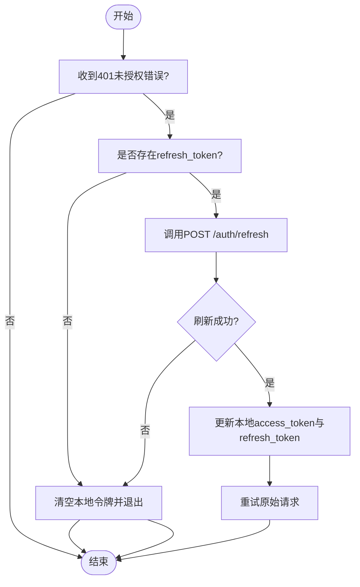
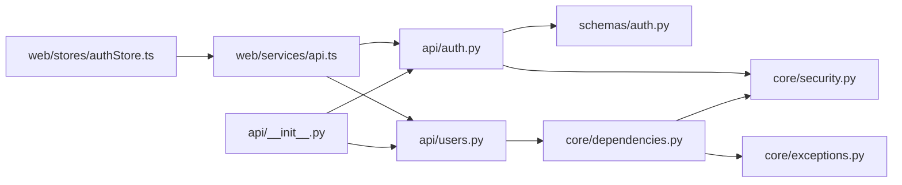

# JWT认证机制

<cite>
**本文引用的文件**
- [backend/app/core/security.py](file://backend/app/core/security.py)
- [backend/app/api/auth.py](file://backend/app/api/auth.py)
- [backend/app/schemas/auth.py](file://backend/app/schemas/auth.py)
- [backend/app/core/dependencies.py](file://backend/app/core/dependencies.py)
- [backend/app/config.py](file://backend/app/config.py)
- [backend/app/core/exceptions.py](file://backend/app/core/exceptions.py)
- [backend/app/api/users.py](file://backend/app/api/users.py)
- [backend/app/main.py](file://backend/app/main.py)
- [web/src/services/api.ts](file://web/src/services/api.ts)
- [web/src/stores/authStore.ts](file://web/src/stores/authStore.ts)
- [backend/app/api/__init__.py](file://backend/app/api/__init__.py)
</cite>

## 更新摘要
**变更内容**
- 完善了访问令牌和刷新令牌的完整生命周期管理文档
- 新增了令牌刷新机制的详细流程说明
- 补充了前端自动刷新令牌的实现细节
- 增强了令牌安全性和并发会话管理的最佳实践
- 更新了异常处理和错误响应的文档

## 目录
1. [简介](#简介)
2. [项目结构](#项目结构)
3. [核心组件](#核心组件)
4. [架构总览](#架构总览)
5. [详细组件分析](#详细组件分析)
6. [依赖关系分析](#依赖关系分析)
7. [性能考量](#性能考量)
8. [故障排查指南](#故障排查指南)
9. [结论](#结论)
10. [附录](#附录)

## 简介
本文件系统性梳理ActiveSynapse后端的JWT认证机制，覆盖令牌生成、编码、解码与验证流程；明确access token与refresh token的差异、过期时间与刷新策略；记录令牌负载结构与声明字段；说明令牌在HTTP请求中的传递方式、前端存储与生命周期管理；提供可直接定位到源码的实现路径与最佳实践建议；并讨论JWT安全考虑、密钥管理与算法选择，以及令牌失效处理、并发会话管理与安全审计思路。

## 项目结构
ActiveSynapse采用FastAPI后端与React前端的分层架构。JWT认证相关逻辑集中在后端的core与api模块，并通过中间件与拦截器在前后端协同完成认证与刷新。

**图表来源**
- [backend/app/config.py:18-22](file://backend/app/config.py#L18-L22)
- [backend/app/core/security.py:21-49](file://backend/app/core/security.py#L21-L49)
- [backend/app/core/dependencies.py:11-50](file://backend/app/core/dependencies.py#L11-L50)
- [backend/app/api/auth.py:25-85](file://backend/app/api/auth.py#L25-L85)
- [backend/app/api/users.py:13-36](file://backend/app/api/users.py#L13-L36)
- [backend/app/schemas/auth.py:6-30](file://backend/app/schemas/auth.py#L6-L30)
- [backend/app/core/exceptions.py:10-17](file://backend/app/core/exceptions.py#L10-L17)
- [backend/app/main.py:56-57](file://backend/app/main.py#L56-L57)
- [backend/app/api/__init__.py:1-10](file://backend/app/api/__init__.py#L1-L10)
- [web/src/services/api.ts:13-64](file://web/src/services/api.ts#L13-L64)
- [web/src/stores/authStore.ts:21-51](file://web/src/stores/authStore.ts#L21-L51)

**章节来源**
- [backend/app/main.py:56-57](file://backend/app/main.py#L56-L57)
- [backend/app/config.py:18-22](file://backend/app/config.py#L18-L22)

## 核心组件
- 安全工具（JWT生成/解码）
  - 生成access token：在负载中加入exp与type=access，使用配置的SECRET_KEY与ALGORITHM进行签名。
  - 生成refresh token：在负载中加入exp与type=refresh，使用相同密钥与算法。
  - 解码与校验：使用配置的密钥与算法对令牌进行解码，捕获JWTError返回None。
- 认证接口
  - 登录：验证用户凭据，成功后返回access_token与refresh_token，同时包含expires_in与用户信息。
  - 刷新：使用refresh_token解码并校验类型，重新签发新的access_token与refresh_token。
  - 注销：提示客户端丢弃令牌。
- 鉴权依赖
  - 从HTTP Bearer头提取令牌，解码并校验type=access，解析sub获取用户ID，查询数据库并校验用户有效性。
- 前端拦截器
  - 请求前自动附加Authorization: Bearer token。
  - 响应401时尝试使用refresh_token调用后端刷新接口，更新本地令牌后重试原请求。
- 数据模型
  - LoginRequest/LoginResponse/TokenRefreshRequest/UserInfo等Pydantic模型，约束输入输出格式。

**章节来源**
- [backend/app/core/security.py:21-49](file://backend/app/core/security.py#L21-L49)
- [backend/app/api/auth.py:25-85](file://backend/app/api/auth.py#L25-L85)
- [backend/app/core/dependencies.py:11-50](file://backend/app/core/dependencies.py#L11-L50)
- [backend/app/schemas/auth.py:6-30](file://backend/app/schemas/auth.py#L6-L30)
- [web/src/services/api.ts:13-64](file://web/src/services/api.ts#L13-L64)
- [web/src/stores/authStore.ts:21-51](file://web/src/stores/authStore.ts#L21-L51)

## 架构总览
下图展示从登录到访问受保护资源的完整流程，包括令牌生成、传递、验证与刷新。

**图表来源**
- [backend/app/api/auth.py:25-85](file://backend/app/api/auth.py#L25-L85)
- [backend/app/core/security.py:21-49](file://backend/app/core/security.py#L21-L49)
- [backend/app/core/dependencies.py:11-50](file://backend/app/core/dependencies.py#L11-L50)
- [web/src/services/api.ts:27-64](file://web/src/services/api.ts#L27-L64)

## 详细组件分析

### 令牌生成与编码
- access token
  - 负载包含exp（过期时间）与type=access。
  - 使用settings.SECRET_KEY与settings.ALGORITHM进行签名。
  - 默认过期时间为settings.ACCESS_TOKEN_EXPIRE_MINUTES分钟。
- refresh token
  - 负载包含exp（过期时间）与type=refresh。
  - 使用相同密钥与算法。
  - 默认过期时间为settings.REFRESH_TOKEN_EXPIRE_DAYS天。
- 密钥与算法
  - 默认算法为HS256，密钥为配置项SECRET_KEY。
- 过期时间设置
  - ACCESS_TOKEN_EXPIRE_MINUTES与REFRESH_TOKEN_EXPIRE_DAYS在配置中集中管理。

**章节来源**
- [backend/app/core/security.py:21-40](file://backend/app/core/security.py#L21-L40)
- [backend/app/config.py:18-22](file://backend/app/config.py#L18-L22)

### 令牌解码与验证
- 解码流程
  - 使用decode_token对传入令牌进行解码与验证。
  - 捕获JWTError并返回None，便于上层统一处理。
- 类型校验
  - 在get_current_user中要求type=access，确保仅允许访问令牌用于路由鉴权。
- 用户校验
  - 从payload解析sub得到用户ID，查询数据库确认用户存在且有效。

**章节来源**
- [backend/app/core/security.py:43-49](file://backend/app/core/security.py#L43-L49)
- [backend/app/core/dependencies.py:19-48](file://backend/app/core/dependencies.py#L19-L48)

### 认证接口与响应模型
- 登录接口
  - 成功时返回access_token、refresh_token、token_type=bearer、expires_in（秒）、user信息。
- 刷新接口
  - 使用refresh_token解码并校验type=refresh，重新签发新的令牌组合。
- 注销接口
  - 返回成功消息，提示客户端丢弃令牌。

**章节来源**
- [backend/app/api/auth.py:25-85](file://backend/app/api/auth.py#L25-L85)
- [backend/app/schemas/auth.py:15-30](file://backend/app/schemas/auth.py#L15-L30)

### HTTP请求中的令牌传递
- 前端
  - 请求拦截器自动在Authorization头添加Bearer token。
  - 响应拦截器在401时尝试刷新令牌并重试原请求。
- 后端
  - 使用HTTPBearer从Authorization头提取令牌。
  - 通过get_current_user依赖链完成解码与用户校验。

**章节来源**
- [web/src/services/api.ts:13-64](file://web/src/services/api.ts#L13-L64)
- [backend/app/core/dependencies.py:11-50](file://backend/app/core/dependencies.py#L11-L50)

### 前端存储与生命周期管理
- 存储
  - 使用zustand持久化存储用户信息、access_token与refresh_token。
- 生命周期
  - 登录成功后写入store；注销时清空store。
  - 响应拦截器在401时触发刷新并更新store，随后重试请求。

**章节来源**
- [web/src/stores/authStore.ts:21-51](file://web/src/stores/authStore.ts#L21-L51)
- [web/src/services/api.ts:27-64](file://web/src/services/api.ts#L27-L64)

### 受保护路由与依赖注入
- 受保护路由
  - 通过get_current_active_user依赖链自动完成令牌校验与用户有效性检查。
- 异常处理
  - 自定义AuthenticationError与AuthorizationError，配合HTTP 401/403响应头WWW-Authenticate: Bearer。

**章节来源**
- [backend/app/api/users.py:13-36](file://backend/app/api/users.py#L13-L36)
- [backend/app/core/dependencies.py:53-60](file://backend/app/core/dependencies.py#L53-L60)
- [backend/app/core/exceptions.py:10-17](file://backend/app/core/exceptions.py#L10-L17)

### 访问令牌与刷新令牌对比
- 负载字段
  - access token：exp、type=access、sub（用户ID）。
  - refresh token：exp、type=refresh、sub（用户ID）。
- 过期时间
  - access token：ACCESS_TOKEN_EXPIRE_MINUTES（默认30分钟）。
  - refresh token：REFRESH_TOKEN_EXPIRE_DAYS（默认7天）。
- 使用场景
  - access token用于短期访问受保护资源。
  - refresh token用于在access token过期时换取新的令牌组合。

**章节来源**
- [backend/app/core/security.py:21-40](file://backend/app/core/security.py#L21-L40)
- [backend/app/config.py:18-22](file://backend/app/config.py#L18-L22)

### 刷新机制流程

**图表来源**
- [web/src/services/api.ts:27-64](file://web/src/services/api.ts#L27-L64)
- [backend/app/api/auth.py:52-85](file://backend/app/api/auth.py#L52-L85)

### 令牌生命周期管理
- 完整生命周期
  - 登录阶段：生成access_token和refresh_token，设置过期时间。
  - 使用阶段：access_token用于短期访问，refresh_token用于刷新。
  - 刷新阶段：access_token过期时使用refresh_token获取新令牌。
  - 注销阶段：客户端丢弃令牌，服务端无需特殊处理。
- 自动刷新机制
  - 前端拦截器检测401错误，自动调用刷新接口。
  - 成功刷新后更新本地存储并重试原请求。
  - 刷新失败则引导用户重新登录。

**章节来源**
- [backend/app/api/auth.py:25-85](file://backend/app/api/auth.py#L25-L85)
- [web/src/services/api.ts:27-64](file://web/src/services/api.ts#L27-L64)
- [web/src/stores/authStore.ts:21-51](file://web/src/stores/authStore.ts#L21-L51)

## 依赖关系分析
- 组件耦合
  - API层依赖安全工具与用户服务；依赖注入层负责从令牌解析用户上下文。
  - 前端拦截器依赖后端认证接口与本地状态存储。
- 外部依赖
  - jose库用于JWT编码/解码；passlib用于密码哈希；FastAPI HTTPBearer用于提取令牌。
- 接口契约
  - 认证接口返回标准化的LoginResponse；受保护路由依赖get_current_active_user依赖链。

**图表来源**
- [backend/app/api/auth.py:10-11](file://backend/app/api/auth.py#L10-L11)
- [backend/app/api/users.py](file://backend/app/api/users.py#L8)
- [backend/app/core/dependencies.py](file://backend/app/core/dependencies.py#L5)
- [backend/app/schemas/auth.py:7-8](file://backend/app/schemas/auth.py#L7-L8)
- [backend/app/core/exceptions.py:10-17](file://backend/app/core/exceptions.py#L10-L17)
- [web/src/services/api.ts:1-64](file://web/src/services/api.ts#L1-L64)
- [web/src/stores/authStore.ts:1-51](file://web/src/stores/authStore.ts#L1-L51)
- [backend/app/api/__init__.py:1-10](file://backend/app/api/__init__.py#L1-L10)

**章节来源**
- [backend/app/api/auth.py:10-11](file://backend/app/api/auth.py#L10-L11)
- [backend/app/api/users.py](file://backend/app/api/users.py#L8)
- [backend/app/core/dependencies.py](file://backend/app/core/dependencies.py#L5)
- [web/src/services/api.ts:1-64](file://web/src/services/api.ts#L1-L64)

## 性能考量
- 令牌大小
  - 负载仅包含必要字段（exp、type、sub），体积小，网络开销低。
- 解码成本
  - HS256算法计算量适中，单次解码与签名成本可忽略不计。
- 缓存与复用
  - 建议在应用层对频繁访问的用户信息做缓存，减少数据库查询次数。
- 并发与会话
  - 当前实现未引入会话表或黑名单，建议结合Redis实现在线会话管理与令牌撤销能力（见"附录"）。

## 故障排查指南
- 常见问题
  - 401未授权：检查Authorization头是否正确携带Bearer token；确认令牌未过期；确认type=access。
  - 403禁止访问：用户账户被禁用或无效。
  - 刷新失败：refresh_token无效或已过期；用户不存在或非激活状态。
- 定位方法
  - 查看get_current_user依赖链的解码与用户查询逻辑。
  - 检查自定义AuthenticationError/AuthorizationError的抛出位置。
  - 前端拦截器在401时的刷新流程与错误分支。

**章节来源**
- [backend/app/core/dependencies.py:19-48](file://backend/app/core/dependencies.py#L19-L48)
- [backend/app/core/exceptions.py:10-17](file://backend/app/core/exceptions.py#L10-L17)
- [web/src/services/api.ts:27-64](file://web/src/services/api.ts#L27-L64)

## 结论
ActiveSynapse的JWT认证机制以简洁清晰的方式实现了短期访问令牌与长期刷新令牌的分离，结合前端拦截器与后端依赖注入，提供了良好的用户体验与安全性基础。建议在生产环境中强化密钥管理、启用HTTPS、引入令牌撤销与并发会话控制，并完善安全审计日志。

## 附录

### 令牌负载结构与声明字段
- 公共字段
  - exp：过期时间（UTC时间戳）。
  - type：令牌类型（access或refresh）。
  - sub：用户标识（用户ID字符串）。
- 生成位置
  - access token：在生成时追加exp与type=access。
  - refresh token：在生成时追加exp与type=refresh。

**章节来源**
- [backend/app/core/security.py:29-39](file://backend/app/core/security.py#L29-L39)

### 令牌传递与存储
- HTTP传递
  - 前端：Authorization: Bearer <access_token>。
  - 后端：HTTPBearer自动提取并交由decode_token处理。
- 前端存储
  - 使用zustand持久化存储access_token与refresh_token，支持注销时清理。

**章节来源**
- [web/src/services/api.ts:13-25](file://web/src/services/api.ts#L13-L25)
- [web/src/stores/authStore.ts:21-51](file://web/src/stores/authStore.ts#L21-L51)

### 过期时间与刷新策略
- 过期时间
  - ACCESS_TOKEN_EXPIRE_MINUTES：默认30分钟。
  - REFRESH_TOKEN_EXPIRE_DAYS：默认7天。
- 刷新策略
  - 前端在401时自动调用刷新接口，成功后更新本地令牌并重试请求。

**章节来源**
- [backend/app/config.py:18-22](file://backend/app/config.py#L18-L22)
- [web/src/services/api.ts:27-64](file://web/src/services/api.ts#L27-L64)
- [backend/app/api/auth.py:52-85](file://backend/app/api/auth.py#L52-L85)

### 安全考虑与最佳实践
- 密钥管理
  - SECRET_KEY必须足够随机且保密，避免硬编码在代码中，建议通过环境变量注入。
- 算法选择
  - HS256为对称算法，性能好但需妥善保管密钥；如需更强隔离可考虑RS256（需公私钥对）。
- 传输安全
  - 必须启用HTTPS，防止令牌在传输中被窃取。
- 令牌撤销与并发会话
  - 建议引入Redis维护在线会话列表与黑名单，支持强制登出与多设备会话管理。
- 审计日志
  - 记录登录、刷新、注销、401/403事件，包含用户ID、IP、UA、时间戳与结果，便于追踪与审计。

### 代码示例定位
- 生成access token
  - [backend/app/core/security.py:21-31](file://backend/app/core/security.py#L21-L31)
- 生成refresh token
  - [backend/app/core/security.py:34-40](file://backend/app/core/security.py#L34-L40)
- 解码与验证
  - [backend/app/core/security.py:43-49](file://backend/app/core/security.py#L43-L49)
- 登录接口
  - [backend/app/api/auth.py:25-49](file://backend/app/api/auth.py#L25-L49)
- 刷新接口
  - [backend/app/api/auth.py:52-85](file://backend/app/api/auth.py#L52-L85)
- 受保护路由依赖
  - [backend/app/core/dependencies.py:11-50](file://backend/app/core/dependencies.py#L11-L50)
- 前端拦截器与刷新
  - [web/src/services/api.ts:27-64](file://web/src/services/api.ts#L27-L64)
- 前端状态存储
  - [web/src/stores/authStore.ts:21-51](file://web/src/stores/authStore.ts#L21-L51)

### 完整生命周期管理
- 登录流程
  - 用户凭据验证通过后，同时生成access_token和refresh_token。
  - access_token用于短期访问，refresh_token用于后续刷新。
- 使用流程
  - 访问受保护资源时携带access_token。
  - access_token过期时自动触发刷新机制。
- 刷新流程
  - 前端检测401错误，自动使用refresh_token调用刷新接口。
  - 服务端验证refresh_token并重新签发新令牌组合。
  - 前端更新本地存储并重试原请求。
- 注销流程
  - 客户端清除本地存储的令牌。
  - 服务端无需特殊处理，因为令牌有固定过期时间。

**章节来源**
- [backend/app/api/auth.py:25-85](file://backend/app/api/auth.py#L25-L85)
- [web/src/services/api.ts:27-64](file://web/src/services/api.ts#L27-L64)
- [web/src/stores/authStore.ts:21-51](file://web/src/stores/authStore.ts#L21-L51)