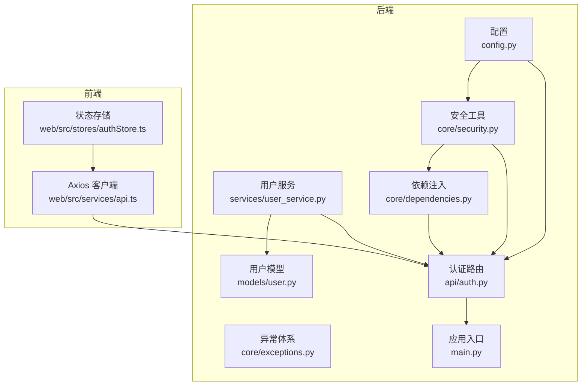
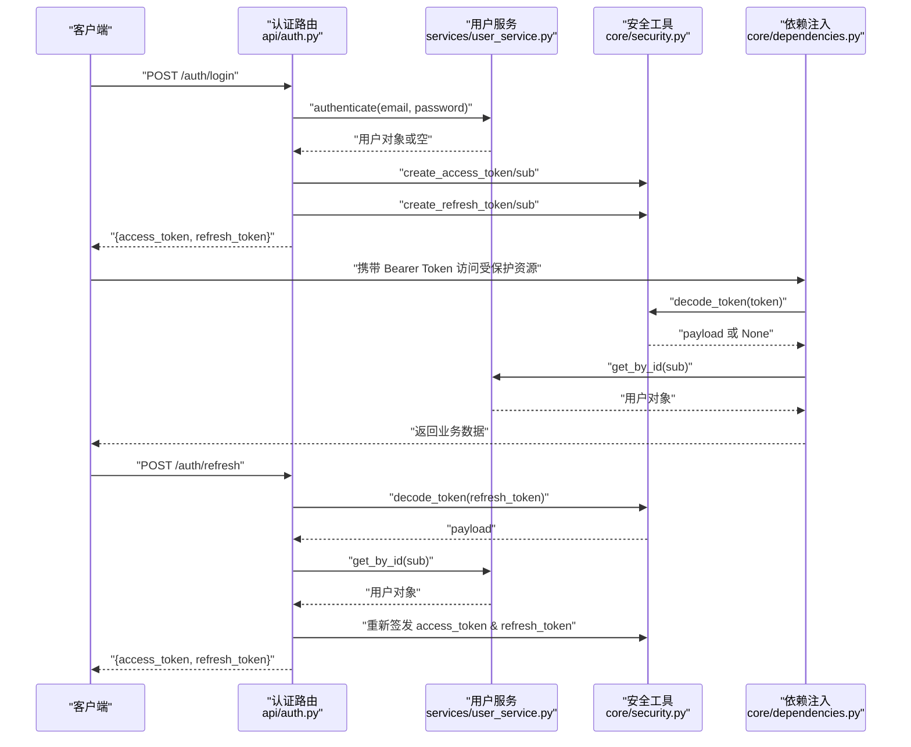
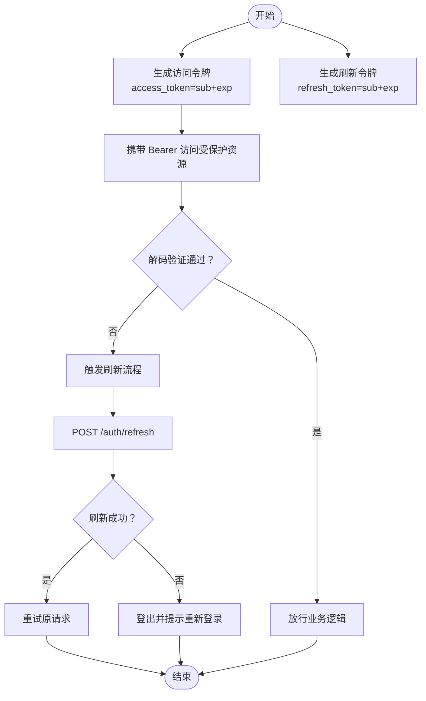
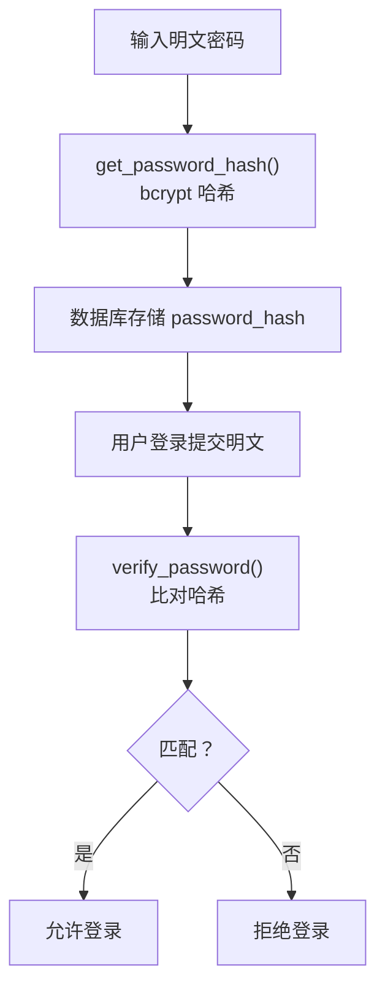
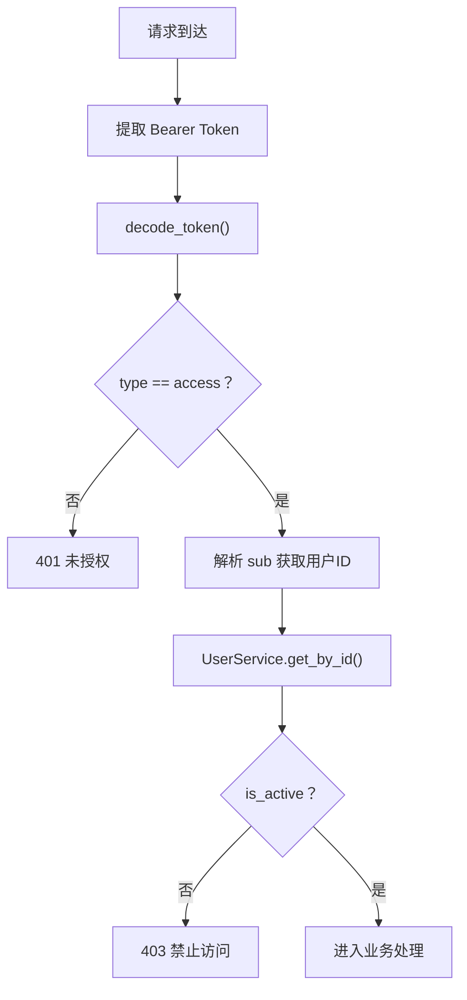
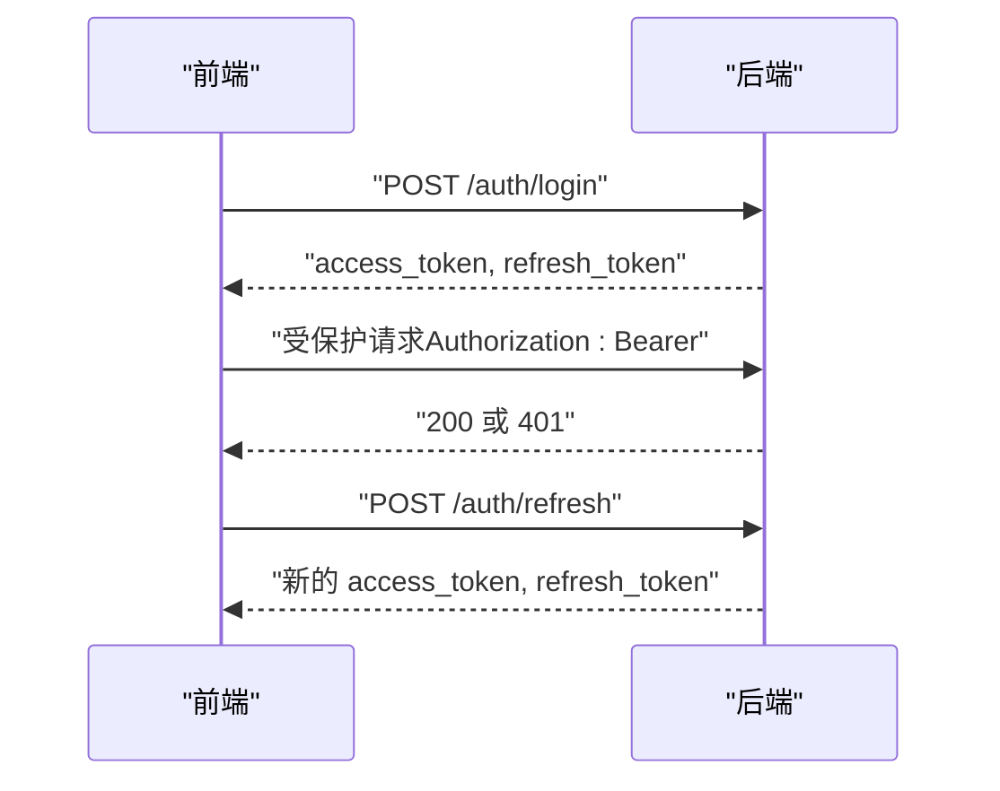
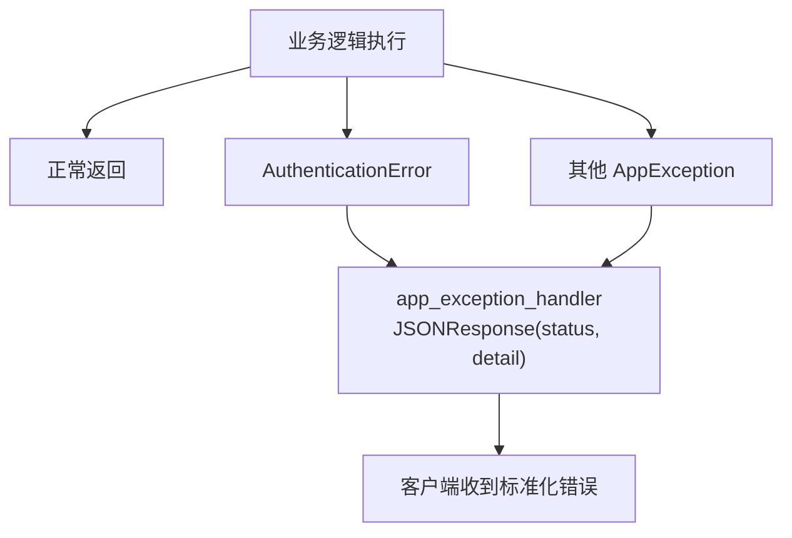
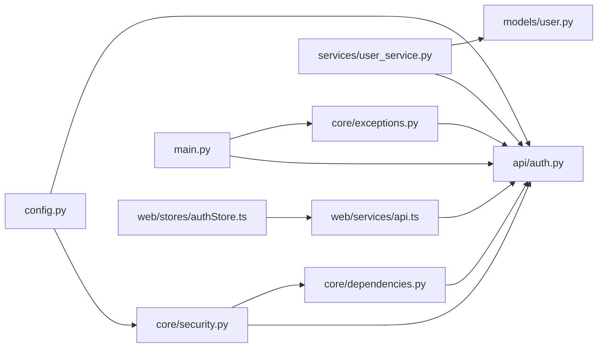

# 安全与认证

<cite>
**本文引用的文件**
- [backend/app/core/security.py](file://backend/app/core/security.py)
- [backend/app/api/auth.py](file://backend/app/api/auth.py)
- [backend/app/schemas/auth.py](file://backend/app/schemas/auth.py)
- [backend/app/core/exceptions.py](file://backend/app/core/exceptions.py)
- [backend/app/main.py](file://backend/app/main.py)
- [backend/app/config.py](file://backend/app/config.py)
- [backend/app/services/user_service.py](file://backend/app/services/user_service.py)
- [backend/app/models/user.py](file://backend/app/models/user.py)
- [backend/app/core/dependencies.py](file://backend/app/core/dependencies.py)
- [backend/requirements.txt](file://backend/requirements.txt)
- [web/src/stores/authStore.ts](file://web/src/stores/authStore.ts)
- [web/src/services/api.ts](file://web/src/services/api.ts)
</cite>

## 目录
1. [引言](#引言)
2. [项目结构](#项目结构)
3. [核心组件](#核心组件)
4. [架构总览](#架构总览)
5. [详细组件分析](#详细组件分析)
6. [依赖分析](#依赖分析)
7. [性能考虑](#性能考虑)
8. [故障排查指南](#故障排查指南)
9. [结论](#结论)
10. [附录](#附录)

## 引言
本文件为 ActiveSynapse 安全与认证系统的全面安全文档，覆盖 JWT 令牌机制、密码加密策略、权限控制设计、认证流程、令牌生成/验证/刷新、异常处理与安全日志、API 安全配置（CORS/HTTPS）、用户权限分级与资源访问控制、数据隔离策略、密码哈希与安全存储、安全编码规范与漏洞防护指南，以及常见威胁检测与应对措施。文档面向开发者与运维人员，既提供高层概览也包含代码级细节映射。

## 项目结构
后端采用 FastAPI + SQLAlchemy 异步 ORM 架构，前端使用 Vite + React + Zustand 状态管理。安全相关能力集中在后端核心模块：配置、安全工具、认证路由、用户服务、依赖注入与异常体系；前端通过 Axios 拦截器实现自动鉴权与令牌刷新。

**图表来源**
- [backend/app/config.py:1-46](file://backend/app/config.py#L1-L46)
- [backend/app/core/security.py:1-50](file://backend/app/core/security.py#L1-L50)
- [backend/app/core/exceptions.py:1-54](file://backend/app/core/exceptions.py#L1-L54)
- [backend/app/core/dependencies.py:1-61](file://backend/app/core/dependencies.py#L1-L61)
- [backend/app/services/user_service.py:1-120](file://backend/app/services/user_service.py#L1-L120)
- [backend/app/models/user.py:1-62](file://backend/app/models/user.py#L1-L62)
- [backend/app/api/auth.py:1-92](file://backend/app/api/auth.py#L1-L92)
- [backend/app/main.py:1-77](file://backend/app/main.py#L1-L77)
- [web/src/services/api.ts:1-108](file://web/src/services/api.ts#L1-L108)
- [web/src/stores/authStore.ts:1-52](file://web/src/stores/authStore.ts#L1-L52)

**章节来源**
- [backend/app/main.py:1-77](file://backend/app/main.py#L1-L77)
- [backend/app/config.py:1-46](file://backend/app/config.py#L1-L46)

## 核心组件
- 配置中心：集中管理密钥、算法、令牌过期时间、CORS 允许来源等敏感参数。
- 密码加密：基于 bcrypt 的密码哈希与校验。
- JWT 工具：访问令牌与刷新令牌的生成、解码与验证。
- 认证路由：注册、登录、刷新、登出接口。
- 用户服务：用户查询、创建、认证、资料更新。
- 依赖注入：从请求头提取 Bearer Token 并解析当前用户。
- 异常体系：统一的认证/授权/通用异常处理。
- 前端拦截器：自动添加 Authorization 头、401 自动刷新令牌。

**章节来源**
- [backend/app/config.py:18-22](file://backend/app/config.py#L18-L22)
- [backend/app/core/security.py:7-18](file://backend/app/core/security.py#L7-L18)
- [backend/app/api/auth.py:17-92](file://backend/app/api/auth.py#L17-L92)
- [backend/app/services/user_service.py:29-68](file://backend/app/services/user_service.py#L29-L68)
- [backend/app/core/dependencies.py:11-50](file://backend/app/core/dependencies.py#L11-L50)
- [backend/app/core/exceptions.py:10-17](file://backend/app/core/exceptions.py#L10-L17)
- [web/src/services/api.ts:13-64](file://web/src/services/api.ts#L13-L64)

## 架构总览
下图展示从客户端到后端的认证与授权流程，包括令牌生成、携带与刷新。

**图表来源**
- [backend/app/api/auth.py:25-85](file://backend/app/api/auth.py#L25-L85)
- [backend/app/services/user_service.py:61-68](file://backend/app/services/user_service.py#L61-L68)
- [backend/app/core/security.py:21-49](file://backend/app/core/security.py#L21-L49)
- [backend/app/core/dependencies.py:11-50](file://backend/app/core/dependencies.py#L11-L50)

## 详细组件分析

### JWT 令牌机制
- 令牌类型与负载
  - 访问令牌：包含用户标识与过期时间，用于日常资源访问。
  - 刷新令牌：包含用户标识与过期时间，用于在访问令牌过期时换取新的访问令牌。
- 生成与验证
  - 使用对称算法签名，密钥由配置中心提供。
  - 解码时严格校验算法与过期时间，并区分令牌类型。
- 过期策略
  - 访问令牌默认较短有效期，刷新令牌较长有效期。
- 刷新流程
  - 客户端收到 401 时，使用刷新令牌向后端发起刷新请求，成功后重试原请求。

**图表来源**
- [backend/app/core/security.py:21-49](file://backend/app/core/security.py#L21-L49)
- [backend/app/api/auth.py:52-85](file://backend/app/api/auth.py#L52-L85)
- [web/src/services/api.ts:27-64](file://web/src/services/api.ts#L27-L64)

**章节来源**
- [backend/app/core/security.py:21-49](file://backend/app/core/security.py#L21-L49)
- [backend/app/config.py:18-22](file://backend/app/config.py#L18-L22)
- [backend/app/api/auth.py:34-49](file://backend/app/api/auth.py#L34-L49)
- [backend/app/api/auth.py:70-85](file://backend/app/api/auth.py#L70-L85)
- [web/src/services/api.ts:43-55](file://web/src/services/api.ts#L43-L55)

### 密码加密策略
- 哈希算法：使用 bcrypt，具备自适应成本参数，抵抗暴力破解。
- 存储格式：仅存储哈希值，不保存明文密码。
- 校验流程：登录时使用哈希上下文对明文密码进行验证。

**图表来源**
- [backend/app/core/security.py:11-18](file://backend/app/core/security.py#L11-L18)
- [backend/app/services/user_service.py:44-45](file://backend/app/services/user_service.py#L44-L45)
- [backend/app/services/user_service.py:66-67](file://backend/app/services/user_service.py#L66-L67)

**章节来源**
- [backend/app/core/security.py:7-18](file://backend/app/core/security.py#L7-L18)
- [backend/app/services/user_service.py:29-59](file://backend/app/services/user_service.py#L29-L59)

### 权限控制设计
- 当前实现
  - 通过依赖注入从令牌中解析用户标识，查询用户并检查账户是否激活。
  - 对于需要"仅活跃用户"的场景，提供额外的活跃用户依赖。
- 扩展建议
  - 引入角色/权限模型（如普通用户、管理员）与资源级授权策略。
  - 在路由层或业务方法上增加装饰器以声明式控制访问。

**图表来源**
- [backend/app/core/dependencies.py:11-50](file://backend/app/core/dependencies.py#L11-L50)
- [backend/app/api/auth.py:25-49](file://backend/app/api/auth.py#L25-L49)

**章节来源**
- [backend/app/core/dependencies.py:11-50](file://backend/app/core/dependencies.py#L11-L50)
- [backend/app/api/auth.py:25-49](file://backend/app/api/auth.py#L25-L49)

### 认证流程、令牌生成、验证与刷新
- 登录
  - 校验邮箱与密码，成功则签发访问令牌与刷新令牌。
- 访问
  - 请求头携带 Bearer Token，依赖注入解析并校验。
- 刷新
  - 访问令牌失效时，使用刷新令牌换取新令牌。
- 登出
  - 后端返回成功消息，前端应丢弃本地令牌。

**图表来源**
- [backend/app/api/auth.py:25-85](file://backend/app/api/auth.py#L25-L85)
- [web/src/services/api.ts:13-64](file://web/src/services/api.ts#L13-L64)

**章节来源**
- [backend/app/api/auth.py:25-85](file://backend/app/api/auth.py#L25-L85)
- [web/src/services/api.ts:69-80](file://web/src/services/api.ts#L69-L80)

### 异常处理机制、错误信息过滤与安全日志
- 统一异常
  - 自定义异常类封装 HTTP 状态码与 WWW-Authenticate 头，确保一致的 401/403 响应。
- 异常处理器
  - 应用层异常处理器返回标准化 JSON 错误体，避免泄露内部细节。
  - 通用异常处理器统一返回"内部服务器错误"。
- 建议
  - 增加结构化日志记录（请求 ID、用户标识、IP、时间戳），并在生产环境开启审计日志。

**图表来源**
- [backend/app/core/exceptions.py:4-17](file://backend/app/core/exceptions.py#L4-L17)
- [backend/app/main.py:38-53](file://backend/app/main.py#L38-L53)

**章节来源**
- [backend/app/core/exceptions.py:10-17](file://backend/app/core/exceptions.py#L10-L17)
- [backend/app/main.py:38-53](file://backend/app/main.py#L38-L53)

### API 安全配置、CORS 设置与 HTTPS 强制
- CORS
  - 允许来源、凭证、方法与头部均通过配置管理，便于在不同环境调整。
- HTTPS
  - 当前未强制 HTTPS，建议在生产环境启用反向代理（Nginx/Traefik）并强制跳转至 HTTPS。
- TLS
  - 生产环境应配置强密码套件与证书轮换策略。

**章节来源**
- [backend/app/main.py:28-35](file://backend/app/main.py#L28-L35)
- [backend/app/config.py:32-33](file://backend/app/config.py#L32-L33)

### 用户权限分级、资源访问控制与数据隔离
- 当前实现
  - 用户激活状态作为基础访问控制条件。
- 数据隔离
  - 资源操作通常绑定用户标识（sub），确保用户只能访问自身数据。
- 建议
  - 引入角色（如管理员）与细粒度权限（CRUD 操作），在路由或服务层实施 RBAC。
  - 对高敏感资源（如财务、诊断）增加二次确认与审计轨迹。

**章节来源**
- [backend/app/core/dependencies.py:44-48](file://backend/app/core/dependencies.py#L44-L48)
- [backend/app/api/auth.py:66-68](file://backend/app/api/auth.py#L66-L68)

### 密码哈希算法、盐值生成与安全存储
- 算法：bcrypt，自动处理盐值生成与迭代成本。
- 存储：仅存储哈希值，字段长度满足 bcrypt 输出。
- 最佳实践：定期评估成本参数，结合速率限制与多因子认证。

**章节来源**
- [backend/app/core/security.py](file://backend/app/core/security.py#L8)
- [backend/app/models/user.py](file://backend/app/models/user.py#L13)

### 开发者安全编码规范与漏洞防护指南
- 输入验证
  - 使用 Pydantic 模型进行请求体与路径参数验证。
- 令牌安全
  - 仅通过 HTTPS 传输，避免在 URL 中传递令牌。
  - 刷新令牌应安全存储，避免 XSS/CSRF 攻击。
- 速率限制
  - 对认证接口实施速率限制与账户锁定策略。
- 日志与监控
  - 记录失败登录尝试与可疑行为，设置告警阈值。
- 依赖更新
  - 定期更新依赖，关注 CVE 通告。

**章节来源**
- [backend/app/schemas/auth.py:6-12](file://backend/app/schemas/auth.py#L6-L12)
- [backend/requirements.txt:16-17](file://backend/requirements.txt#L16-L17)

## 依赖分析
后端安全相关模块之间的耦合关系如下：

**图表来源**
- [backend/app/config.py:1-46](file://backend/app/config.py#L1-L46)
- [backend/app/core/security.py:1-50](file://backend/app/core/security.py#L1-L50)
- [backend/app/api/auth.py:1-92](file://backend/app/api/auth.py#L1-L92)
- [backend/app/core/dependencies.py:1-61](file://backend/app/core/dependencies.py#L1-L61)
- [backend/app/services/user_service.py:1-120](file://backend/app/services/user_service.py#L1-L120)
- [backend/app/models/user.py:1-62](file://backend/app/models/user.py#L1-L62)
- [backend/app/core/exceptions.py:1-54](file://backend/app/core/exceptions.py#L1-L54)
- [backend/app/main.py:1-77](file://backend/app/main.py#L1-L77)
- [web/src/services/api.ts:1-108](file://web/src/services/api.ts#L1-L108)
- [web/src/stores/authStore.ts:1-52](file://web/src/stores/authStore.ts#L1-L52)

**章节来源**
- [backend/app/main.py:1-77](file://backend/app/main.py#L1-L77)

## 性能考虑
- 令牌解码为 O(1)，影响可忽略。
- 密码哈希成本参数需平衡安全与性能，建议基准测试后设定。
- 数据库查询使用异步 ORM，注意连接池与索引优化。
- 前端刷新令牌仅在 401 时触发，减少不必要的网络往返。

## 故障排查指南
- 401 未授权
  - 检查请求头是否包含正确的 Bearer Token。
  - 确认令牌未过期且类型为 access。
- 403 禁止访问
  - 用户账户可能被禁用或权限不足。
- 401 刷新失败
  - 刷新令牌无效或已过期；检查令牌类型与用户状态。
- CORS 问题
  - 确认前端与后端允许来源一致，凭证与头部均已放行。
- 密码错误
  - 确认 bcrypt 哈希正确存储，校验函数调用无误。

**章节来源**
- [backend/app/core/exceptions.py:10-17](file://backend/app/core/exceptions.py#L10-L17)
- [backend/app/core/dependencies.py:19-48](file://backend/app/core/dependencies.py#L19-L48)
- [backend/app/api/auth.py:55-68](file://backend/app/api/auth.py#L55-L68)
- [backend/app/main.py:28-35](file://backend/app/main.py#L28-L35)

## 结论
ActiveSynapse 的安全与认证体系以 JWT 与 bcrypt 为核心，配合统一异常处理与 CORS 策略，提供了基础但实用的安全框架。建议在生产环境中补充 HTTPS 强制、速率限制、RBAC、审计日志与更严格的前端令牌存储策略，以进一步提升整体安全性。

## 附录

### 配置项与安全要点对照
- 密钥与算法：用于 JWT 签名与解码，务必在生产环境随机化并妥善保管。
- 令牌过期：访问令牌短周期、刷新令牌长周期，降低泄露风险。
- CORS：严格限定来源，避免通配符带来的跨域风险。
- 数据库与缓存：生产环境使用独立实例并启用 TLS。

**章节来源**
- [backend/app/config.py:18-22](file://backend/app/config.py#L18-L22)
- [backend/app/config.py:32-33](file://backend/app/config.py#L32-L33)