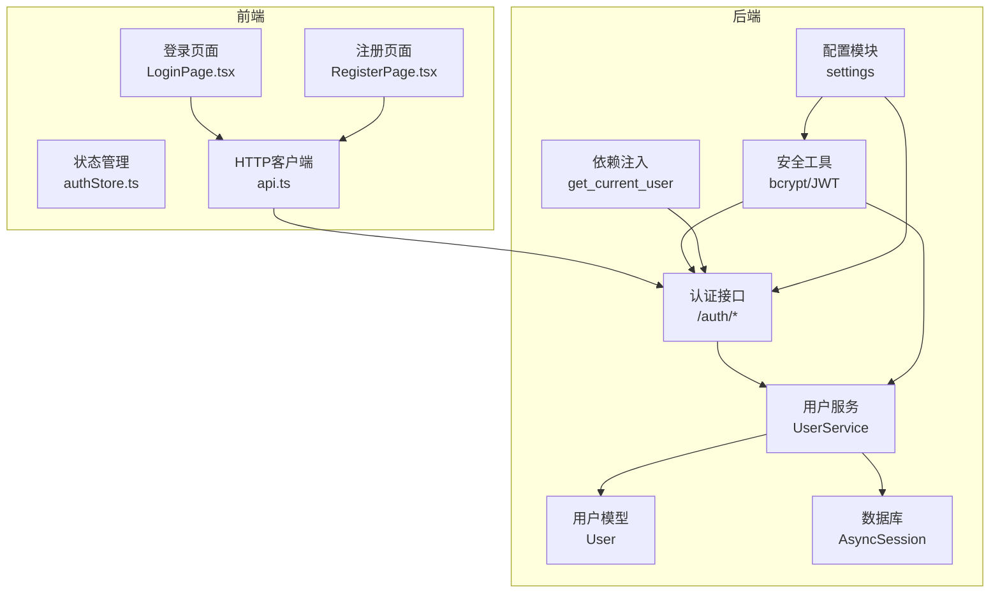
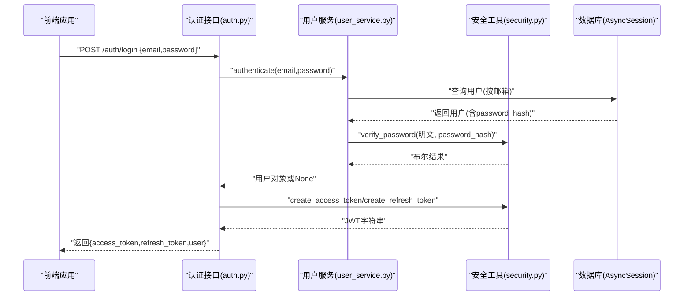
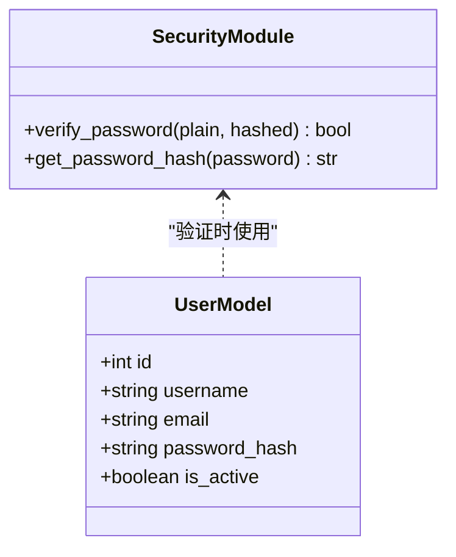
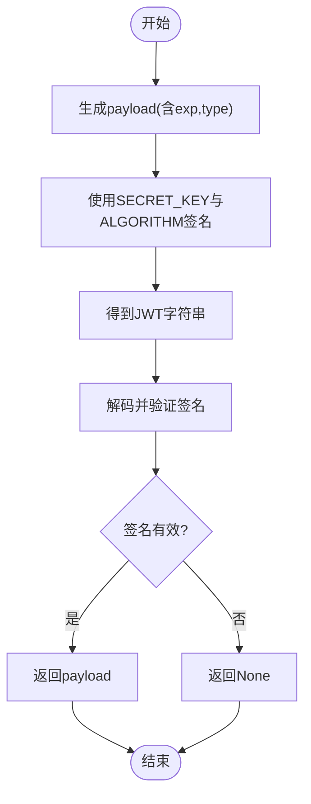
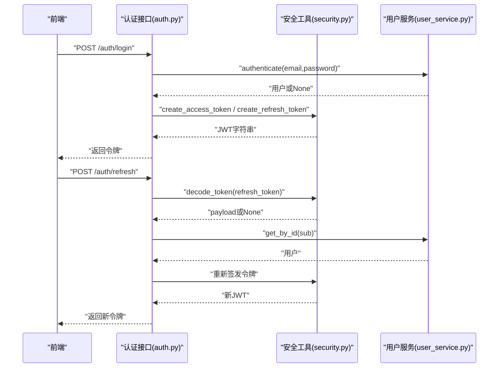
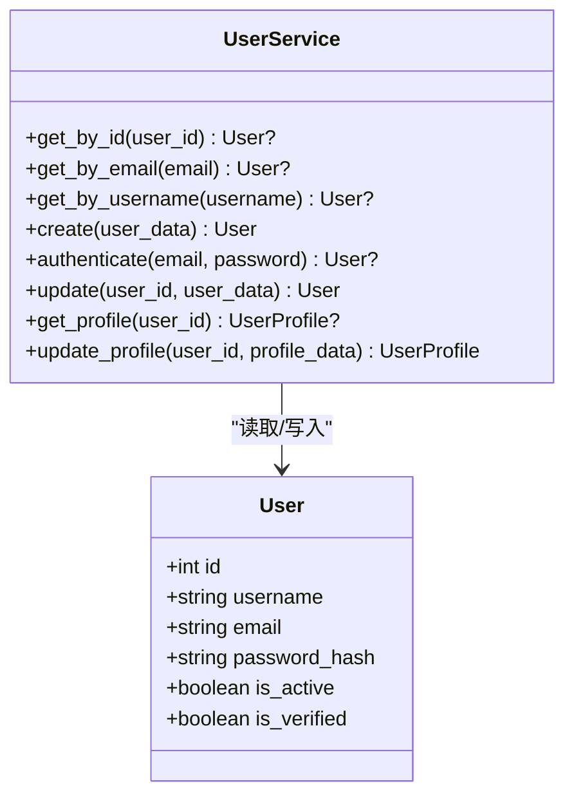
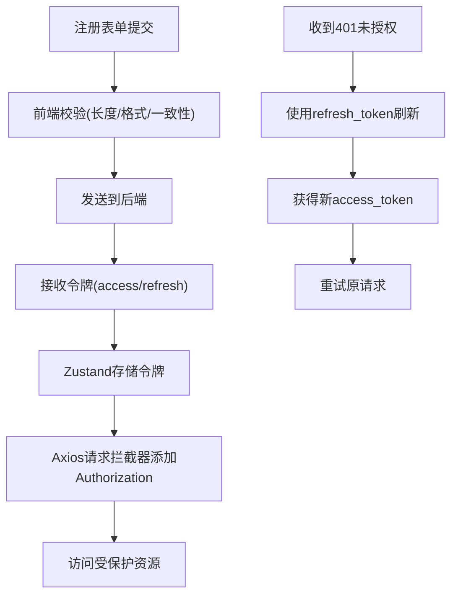
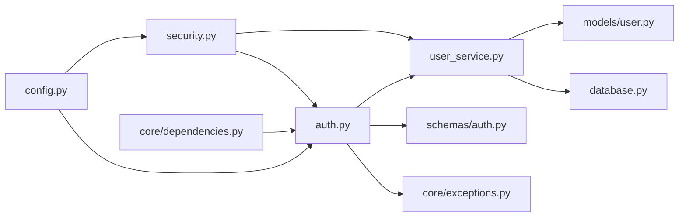

# 密码加密与安全

<cite>
**本文档引用的文件**
- [backend/app/core/security.py](file://backend/app/core/security.py)
- [backend/app/api/auth.py](file://backend/app/api/auth.py)
- [backend/app/schemas/auth.py](file://backend/app/schemas/auth.py)
- [backend/app/models/user.py](file://backend/app/models/user.py)
- [backend/app/services/user_service.py](file://backend/app/services/user_service.py)
- [backend/app/config.py](file://backend/app/config.py)
- [backend/app/core/exceptions.py](file://backend/app/core/exceptions.py)
- [backend/app/core/dependencies.py](file://backend/app/core/dependencies.py)
- [backend/app/database.py](file://backend/app/database.py)
- [web/src/pages/LoginPage.tsx](file://web/src/pages/LoginPage.tsx)
- [web/src/pages/RegisterPage.tsx](file://web/src/pages/RegisterPage.tsx)
- [web/src/stores/authStore.ts](file://web/src/stores/authStore.ts)
- [web/src/services/api.ts](file://web/src/services/api.ts)
</cite>

## 目录
1. [简介](#简介)
2. [项目结构](#项目结构)
3. [核心组件](#核心组件)
4. [架构总览](#架构总览)
5. [详细组件分析](#详细组件分析)
6. [依赖关系分析](#依赖关系分析)
7. [性能考虑](#性能考虑)
8. [故障排除指南](#故障排除指南)
9. [结论](#结论)
10. [附录](#附录)

## 简介
本文件针对 ActiveSynapse 的密码加密与安全系统进行全面技术文档化，重点覆盖以下方面：
- bcrypt 密码哈希算法的使用、盐值生成与安全存储机制
- 密码验证流程、哈希比较与安全检查
- 前端密码强度要求、复杂度规则与验证策略
- 密码重置流程（当前实现未包含）、临时令牌生成与安全传输建议
- 安全配置、哈希参数调优与性能优化建议
- 密码泄露防护、暴力攻击防护与会话固定攻击防范
- 审计、日志记录与监控策略

## 项目结构
ActiveSynapse 后端采用 FastAPI + SQLAlchemy 异步 ORM 架构，前端使用 React + Ant Design。安全相关代码主要分布在后端的安全工具模块、认证路由、用户服务层以及配置模块；前端负责输入校验与令牌传递。

**图表来源**
- [backend/app/core/security.py](file://backend/app/core/security.py#L1-L50)
- [backend/app/api/auth.py](file://backend/app/api/auth.py#L1-L92)
- [backend/app/services/user_service.py](file://backend/app/services/user_service.py#L1-L120)
- [backend/app/models/user.py](file://backend/app/models/user.py#L1-L62)
- [backend/app/config.py](file://backend/app/config.py#L1-L46)
- [backend/app/core/dependencies.py](file://backend/app/core/dependencies.py#L1-L61)
- [backend/app/database.py](file://backend/app/database.py#L1-L43)
- [web/src/pages/LoginPage.tsx](file://web/src/pages/LoginPage.tsx#L1-L92)
- [web/src/pages/RegisterPage.tsx](file://web/src/pages/RegisterPage.tsx#L38-L126)
- [web/src/stores/authStore.ts](file://web/src/stores/authStore.ts#L1-L51)
- [web/src/services/api.ts](file://web/src/services/api.ts#L1-L50)

**章节来源**
- [backend/app/core/security.py](file://backend/app/core/security.py#L1-L50)
- [backend/app/api/auth.py](file://backend/app/api/auth.py#L1-L92)
- [backend/app/services/user_service.py](file://backend/app/services/user_service.py#L1-L120)
- [backend/app/models/user.py](file://backend/app/models/user.py#L1-L62)
- [backend/app/config.py](file://backend/app/config.py#L1-L46)
- [backend/app/core/dependencies.py](file://backend/app/core/dependencies.py#L1-L61)
- [backend/app/database.py](file://backend/app/database.py#L1-L43)
- [web/src/pages/LoginPage.tsx](file://web/src/pages/LoginPage.tsx#L1-L92)
- [web/src/pages/RegisterPage.tsx](file://web/src/pages/RegisterPage.tsx#L38-L126)
- [web/src/stores/authStore.ts](file://web/src/stores/authStore.ts#L1-L51)
- [web/src/services/api.ts](file://web/src/services/api.ts#L1-L50)

## 核心组件
- 密码哈希与验证：通过 passlib 的 CryptContext 配置 bcrypt，提供哈希与验证函数。
- JWT 令牌：生成访问令牌与刷新令牌，设置过期时间，并进行解码与验证。
- 认证流程：登录接口完成用户认证，返回访问与刷新令牌；刷新接口基于刷新令牌签发新令牌。
- 用户服务：负责用户创建、邮箱/用户名唯一性检查、认证逻辑与资料更新。
- 数据模型：用户表包含 password_hash 字段用于存储哈希值。
- 前端校验：注册页对密码长度与确认密码进行前端校验；登录页进行邮箱格式与必填校验。
- 依赖注入：从请求头中提取 Bearer 令牌，解析并校验访问令牌有效性。

**章节来源**
- [backend/app/core/security.py](file://backend/app/core/security.py#L7-L18)
- [backend/app/api/auth.py](file://backend/app/api/auth.py#L25-L85)
- [backend/app/services/user_service.py](file://backend/app/services/user_service.py#L29-L68)
- [backend/app/models/user.py](file://backend/app/models/user.py#L10-L19)
- [web/src/pages/RegisterPage.tsx](file://web/src/pages/RegisterPage.tsx#L74-L108)
- [web/src/pages/LoginPage.tsx](file://web/src/pages/LoginPage.tsx#L51-L74)
- [backend/app/core/dependencies.py](file://backend/app/core/dependencies.py#L11-L50)

## 架构总览
下图展示了密码加密与安全的关键交互路径：前端提交凭据 → 后端认证 → 密码哈希验证 → JWT 签发 → 前端存储令牌并发起受保护请求。

**图表来源**
- [backend/app/api/auth.py](file://backend/app/api/auth.py#L25-L49)
- [backend/app/services/user_service.py](file://backend/app/services/user_service.py#L61-L68)
- [backend/app/core/security.py](file://backend/app/core/security.py#L11-L18)
- [backend/app/database.py](file://backend/app/database.py#L26-L36)

## 详细组件分析

### 组件A：密码哈希与验证（bcrypt）
- 使用 passlib 的 CryptContext 配置 bcrypt，自动处理盐值生成与哈希计算。
- 提供两个核心函数：
  - get_password_hash：对原始密码进行哈希，存储于数据库字段 password_hash。
  - verify_password：对输入明文与数据库中的哈希值进行比较验证。
- 存储机制：用户模型的 password_hash 字段用于持久化存储哈希值，避免明文保存。

**图表来源**
- [backend/app/core/security.py](file://backend/app/core/security.py#L7-L18)
- [backend/app/models/user.py](file://backend/app/models/user.py#L10-L19)

**章节来源**
- [backend/app/core/security.py](file://backend/app/core/security.py#L7-L18)
- [backend/app/models/user.py](file://backend/app/models/user.py#L10-L19)

### 组件B：JWT 令牌生成与验证
- 访问令牌与刷新令牌：
  - 访问令牌：短期有效，用于受保护资源访问。
  - 刷新令牌：长期有效，用于在访问令牌过期后换取新的访问令牌。
- 过期时间：通过配置项设置访问令牌与刷新令牌的有效期。
- 算法与密钥：使用 HS256 算法与 SECRET_KEY 进行签名与验证。
- 解码与校验：decode_token 负责解码并验证令牌签名，捕获异常以处理无效令牌。

**图表来源**
- [backend/app/core/security.py](file://backend/app/core/security.py#L21-L49)
- [backend/app/config.py](file://backend/app/config.py#L18-L22)

**章节来源**
- [backend/app/core/security.py](file://backend/app/core/security.py#L21-L49)
- [backend/app/config.py](file://backend/app/config.py#L18-L22)

### 组件C：认证流程与令牌刷新
- 登录流程：
  - 接收邮箱与密码，调用用户服务进行认证。
  - 认证成功后，生成访问令牌与刷新令牌并返回给前端。
- 令牌刷新：
  - 使用刷新令牌解码并验证类型是否为 refresh。
  - 根据 payload 中的用户标识查找用户并确保账户处于激活状态。
  - 重新签发新的访问令牌与刷新令牌。
- 退出登录：
  - 后端返回成功消息，前端负责丢弃本地令牌。

**图表来源**
- [backend/app/api/auth.py](file://backend/app/api/auth.py#L25-L85)
- [backend/app/core/security.py](file://backend/app/core/security.py#L21-L49)
- [backend/app/services/user_service.py](file://backend/app/services/user_service.py#L61-L68)

**章节来源**
- [backend/app/api/auth.py](file://backend/app/api/auth.py#L25-L85)
- [backend/app/services/user_service.py](file://backend/app/services/user_service.py#L61-L68)

### 组件D：用户服务与数据模型
- 用户创建：
  - 检查邮箱与用户名唯一性，失败则抛出冲突错误。
  - 对密码使用 get_password_hash 生成哈希并存入数据库。
- 用户认证：
  - 按邮箱查询用户，若存在则使用 verify_password 对比哈希。
- 数据模型：
  - User 表包含 password_hash 字段，用于存储 bcrypt 哈希值。
  - 其他字段包括用户名、邮箱、头像、激活状态等。

**图表来源**
- [backend/app/services/user_service.py](file://backend/app/services/user_service.py#L10-L120)
- [backend/app/models/user.py](file://backend/app/models/user.py#L7-L29)

**章节来源**
- [backend/app/services/user_service.py](file://backend/app/services/user_service.py#L29-L68)
- [backend/app/models/user.py](file://backend/app/models/user.py#L10-L19)

### 组件E：前端密码强度与令牌管理
- 注册页面：
  - 对用户名、邮箱、密码与确认密码进行前端校验，密码最小长度为 6。
- 登录页面：
  - 对邮箱格式与必填项进行校验。
- 状态管理与 HTTP 客户端：
  - 使用 Zustand 存储用户信息与令牌。
  - Axios 请求拦截器自动附加 Bearer 令牌。
  - 响应拦截器处理 401 未授权并尝试使用刷新令牌获取新访问令牌。

**图表来源**
- [web/src/pages/RegisterPage.tsx](file://web/src/pages/RegisterPage.tsx#L74-L108)
- [web/src/pages/LoginPage.tsx](file://web/src/pages/LoginPage.tsx#L51-L74)
- [web/src/stores/authStore.ts](file://web/src/stores/authStore.ts#L21-L50)
- [web/src/services/api.ts](file://web/src/services/api.ts#L13-L50)

**章节来源**
- [web/src/pages/RegisterPage.tsx](file://web/src/pages/RegisterPage.tsx#L74-L108)
- [web/src/pages/LoginPage.tsx](file://web/src/pages/LoginPage.tsx#L51-L74)
- [web/src/stores/authStore.ts](file://web/src/stores/authStore.ts#L21-L50)
- [web/src/services/api.ts](file://web/src/services/api.ts#L13-L50)

## 依赖关系分析
- 组件耦合与内聚：
  - security.py 与 user_service.py 通过 verify_password 与 get_password_hash 进行低耦合交互。
  - auth.py 仅依赖 security.py 与 user_service.py，职责清晰。
  - 前端通过 api.ts 与后端接口解耦，状态管理独立。
- 外部依赖：
  - passlib（bcrypt）、jose（JWT）、FastAPI、SQLAlchemy、Ant Design、Axios 等。
- 可能的循环依赖：
  - 当前模块间无直接循环导入，保持良好分层。

**图表来源**
- [backend/app/core/security.py](file://backend/app/core/security.py#L1-L50)
- [backend/app/api/auth.py](file://backend/app/api/auth.py#L1-L92)
- [backend/app/services/user_service.py](file://backend/app/services/user_service.py#L1-L120)
- [backend/app/models/user.py](file://backend/app/models/user.py#L1-L62)
- [backend/app/schemas/auth.py](file://backend/app/schemas/auth.py#L1-L35)
- [backend/app/core/exceptions.py](file://backend/app/core/exceptions.py#L1-L54)
- [backend/app/core/dependencies.py](file://backend/app/core/dependencies.py#L1-L61)
- [backend/app/database.py](file://backend/app/database.py#L1-L43)
- [backend/app/config.py](file://backend/app/config.py#L1-L46)

**章节来源**
- [backend/app/core/security.py](file://backend/app/core/security.py#L1-L50)
- [backend/app/api/auth.py](file://backend/app/api/auth.py#L1-L92)
- [backend/app/services/user_service.py](file://backend/app/services/user_service.py#L1-L120)
- [backend/app/models/user.py](file://backend/app/models/user.py#L1-L62)
- [backend/app/schemas/auth.py](file://backend/app/schemas/auth.py#L1-L35)
- [backend/app/core/exceptions.py](file://backend/app/core/exceptions.py#L1-L54)
- [backend/app/core/dependencies.py](file://backend/app/core/dependencies.py#L1-L61)
- [backend/app/database.py](file://backend/app/database.py#L1-L43)
- [backend/app/config.py](file://backend/app/config.py#L1-L46)

## 性能考虑
- bcrypt 参数调优：
  - 当前 passlib 使用默认 bcrypt 配置，建议在生产环境评估成本因子（cost）以平衡安全性与性能。
  - 可通过自定义 CryptContext 的参数进行微调，避免在高并发场景下出现显著延迟。
- 令牌签发与验证：
  - JWT 签发与解码为轻量操作，但需注意 SECRET_KEY 的长度与随机性，避免弱密钥导致性能退化。
- 数据库访问：
  - 用户认证与查询为 O(log n) 的索引查找，建议确保邮箱与用户名字段建立唯一索引。
- 前端令牌缓存：
  - 使用浏览器本地存储令牌时，建议启用 HttpOnly、Secure、SameSite 属性（在后端 Cookie 场景），减少 XSS 风险。

[本节为通用性能建议，不直接分析具体文件]

## 故障排除指南
- 认证失败：
  - 若返回 401 未授权，检查前端是否正确携带 Bearer 令牌；确认刷新令牌是否有效且类型为 refresh。
- 用户不存在或未激活：
  - get_current_user 会在用户不存在或非激活状态时抛出相应异常，需检查用户状态与数据库记录。
- 密码错误：
  - verify_password 返回 False 会导致认证失败，确认输入密码与数据库中的 password_hash 是否匹配。
- 配置问题：
  - SECRET_KEY 为空或不一致会导致 JWT 签名/验证失败；ACCESS_TOKEN_EXPIRE_MINUTES 与 REFRESH_TOKEN_EXPIRE_DAYS 影响用户体验与安全策略。

**章节来源**
- [backend/app/api/auth.py](file://backend/app/api/auth.py#L31-L32)
- [backend/app/core/dependencies.py](file://backend/app/core/dependencies.py#L19-L48)
- [backend/app/core/exceptions.py](file://backend/app/core/exceptions.py#L10-L17)
- [backend/app/config.py](file://backend/app/config.py#L18-L22)

## 结论
ActiveSynapse 的密码安全体系以 bcrypt 哈希与 JWT 令牌为核心，结合前端输入校验与后端严格认证流程，形成了较为完整的安全闭环。建议在生产环境中进一步完善密码重置流程、实施更严格的密码复杂度策略、强化暴力破解与会话固定防护，并建立完善的日志与监控体系以支持安全审计。

[本节为总结性内容，不直接分析具体文件]

## 附录

### A. 密码强度与复杂度规则
- 前端规则（注册页）：
  - 密码最小长度：6 个字符。
  - 必填校验与确认密码一致性校验。
- 建议补充（生产环境）：
  - 最小长度提升至 8-12 字符。
  - 引入复杂度规则：大小写字母、数字、特殊字符组合。
  - 禁止常见弱口令列表与个人相关信息（如邮箱、用户名）。

**章节来源**
- [web/src/pages/RegisterPage.tsx](file://web/src/pages/RegisterPage.tsx#L74-L108)

### B. 密码重置流程（当前实现状态与建议）
- 当前实现状态：
  - 未发现密码重置相关接口与令牌生成逻辑。
- 建议方案（概念性）：
  - 生成一次性临时令牌（带过期时间），通过安全通道（如邮箱）发送给用户。
  - 重置接口校验令牌与邮箱，更新密码哈希并使旧令牌失效。
  - 强化安全传输：仅在 HTTPS 下传输，限制重试次数与速率。

[本节为概念性建议，不直接映射到现有源码]

### C. 安全配置与哈希参数调优
- 关键配置项：
  - SECRET_KEY：高强度随机字符串，定期轮换。
  - ALGORITHM：HS256，确保密钥安全。
  - ACCESS_TOKEN_EXPIRE_MINUTES：较短有效期，降低泄露风险。
  - REFRESH_TOKEN_EXPIRE_DAYS：较长有效期，配合刷新机制。
- bcrypt 参数：
  - 在 passlib 中可调整 cost 值，结合基准测试确定最优成本因子。

**章节来源**
- [backend/app/config.py](file://backend/app/config.py#L18-L22)
- [backend/app/core/security.py](file://backend/app/core/security.py#L7-L8)

### D. 泄露防护、暴力攻击与会话固定防范
- 泄露防护：
  - 不在日志中输出密码或哈希；敏感字段使用掩码显示。
  - 传输层强制 HTTPS，防止中间人攻击。
- 暴力攻击防护：
  - 登录失败计数与临时封禁策略（建议在后续版本引入）。
  - 速率限制与验证码（CAPTCHA）。
- 会话固定攻击：
  - 登录成功后更换会话标识（建议在后续版本引入）。
  - 刷新令牌与访问令牌分离，缩短访问令牌有效期。

[本节为通用安全实践建议，不直接分析具体文件]

### E. 审计、日志与监控策略
- 审计事件：
  - 记录登录尝试（成功/失败）、令牌刷新、用户状态变更等关键事件。
- 日志记录：
  - 区分日志级别，避免敏感信息泄露；统一日志格式与保留周期。
- 监控告警：
  - 监控异常登录频率、失败率突增、令牌伪造尝试等指标。
  - 集成 SIEM 或日志分析平台进行集中管理。

[本节为通用安全运营建议，不直接分析具体文件]