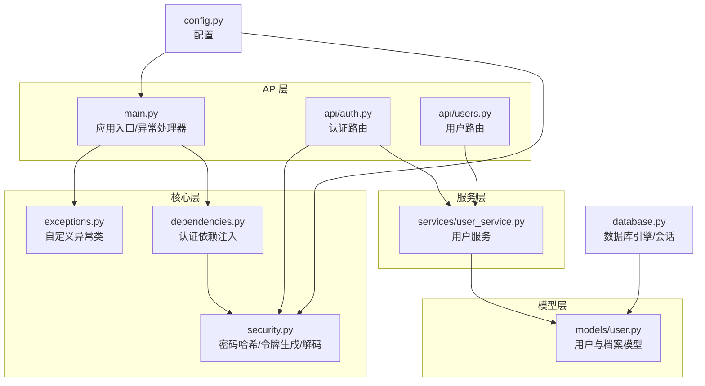
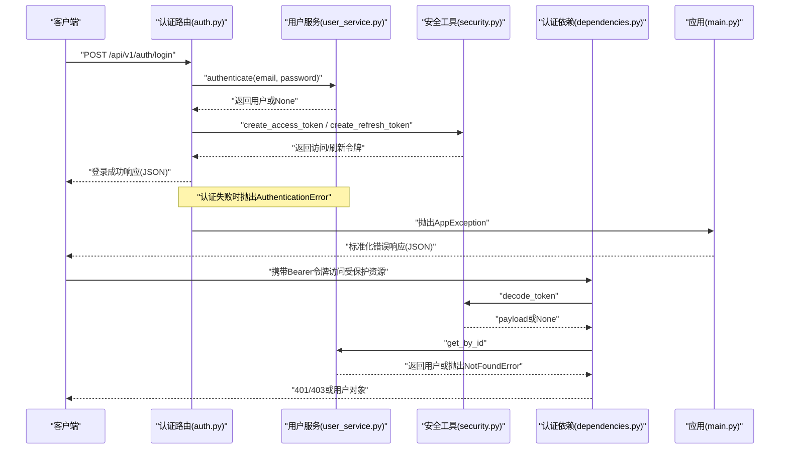
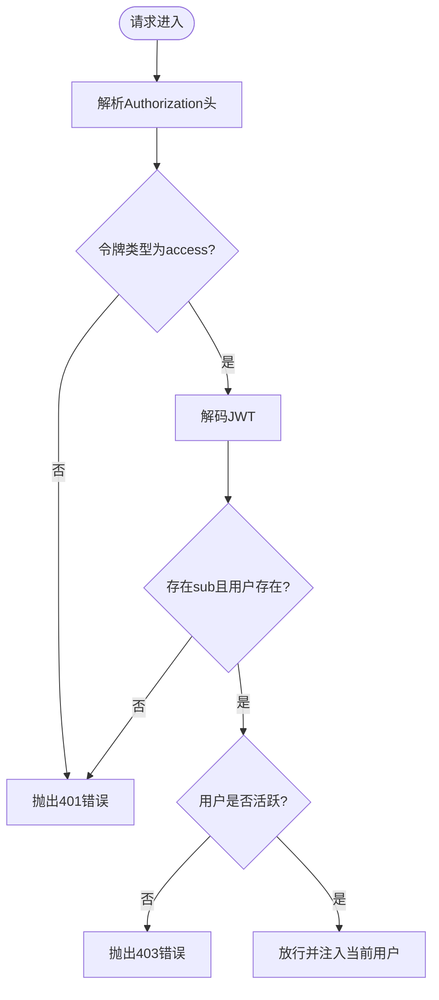
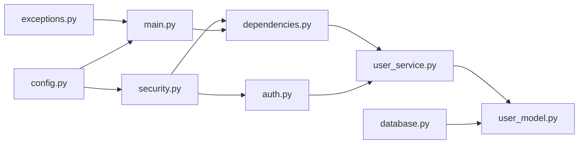

# 异常处理与安全响应

<cite>
**本文引用的文件**
- [exceptions.py](file://backend/app/core/exceptions.py)
- [security.py](file://backend/app/core/security.py)
- [dependencies.py](file://backend/app/core/dependencies.py)
- [main.py](file://backend/app/main.py)
- [auth.py](file://backend/app/api/auth.py)
- [users.py](file://backend/app/api/users.py)
- [user_service.py](file://backend/app/services/user_service.py)
- [auth_schema.py](file://backend/app/schemas/auth.py)
- [config.py](file://backend/app/config.py)
- [database.py](file://backend/app/database.py)
- [user_model.py](file://backend/app/models/user.py)
</cite>

## 目录
1. [简介](#简介)
2. [项目结构](#项目结构)
3. [核心组件](#核心组件)
4. [架构总览](#架构总览)
5. [详细组件分析](#详细组件分析)
6. [依赖分析](#依赖分析)
7. [性能考虑](#性能考虑)
8. [故障排查指南](#故障排查指南)
9. [结论](#结论)
10. [附录](#附录)

## 简介
本文件面向ActiveSynapse后端的异常处理与安全响应体系，系统化梳理自定义异常类设计、错误码与响应格式标准化、安全异常策略（认证失败、权限拒绝、会话超时）、敏感信息保护、日志与调试控制、API错误响应与客户端体验优化、异常监控与告警、安全事件响应与合规建议等。文档以代码为依据，结合架构图与流程图，帮助开发者与运维人员快速理解并改进系统安全性与稳定性。

## 项目结构
后端采用FastAPI + SQLAlchemy异步ORM + Pydantic模型的分层架构：
- 核心层：异常定义、安全工具、依赖注入
- API层：路由与业务接口
- 服务层：领域逻辑封装
- 模型层：数据库实体
- 配置层：应用设置与环境变量

图表来源
- [exceptions.py](file://backend/app/core/exceptions.py#L1-L54)
- [security.py](file://backend/app/core/security.py#L1-L50)
- [dependencies.py](file://backend/app/core/dependencies.py#L1-L61)
- [main.py](file://backend/app/main.py#L1-L77)
- [auth.py](file://backend/app/api/auth.py#L1-L92)
- [users.py](file://backend/app/api/users.py#L1-L88)
- [user_service.py](file://backend/app/services/user_service.py#L1-L120)
- [user_model.py](file://backend/app/models/user.py#L1-L62)
- [config.py](file://backend/app/config.py#L1-L46)
- [database.py](file://backend/app/database.py#L1-L43)

章节来源
- [main.py](file://backend/app/main.py#L1-L77)
- [config.py](file://backend/app/config.py#L1-L46)

## 核心组件
- 自定义异常类：统一继承HTTPException，便于全局捕获与标准化响应。
- 安全工具：密码哈希、JWT访问/刷新令牌生成与校验、令牌解码。
- 认证依赖：从Authorization头解析Bearer令牌，校验类型与有效性，加载用户并检查状态。
- 全局异常处理器：AppException与通用异常的JSON响应格式统一化。
- 用户服务：在注册/更新等操作中抛出冲突、未找到等异常，保证数据一致性。

章节来源
- [exceptions.py](file://backend/app/core/exceptions.py#L1-L54)
- [security.py](file://backend/app/core/security.py#L1-L50)
- [dependencies.py](file://backend/app/core/dependencies.py#L1-L61)
- [main.py](file://backend/app/main.py#L38-L53)
- [user_service.py](file://backend/app/services/user_service.py#L1-L120)

## 架构总览
下图展示认证与异常处理的关键交互路径，包括令牌生成、依赖注入校验、服务层异常抛出以及全局异常处理器响应。

图表来源
- [auth.py](file://backend/app/api/auth.py#L25-L49)
- [user_service.py](file://backend/app/services/user_service.py#L61-L68)
- [security.py](file://backend/app/core/security.py#L21-L40)
- [dependencies.py](file://backend/app/core/dependencies.py#L11-L50)
- [main.py](file://backend/app/main.py#L38-L53)

## 详细组件分析

### 自定义异常类设计
- 基类AppException：统一继承HTTPException，支持自定义状态码、详情与响应头。
- 子类覆盖典型场景：
  - AuthenticationError：认证失败，返回401并带WWW-Authenticate头。
  - AuthorizationError：权限不足，返回403。
  - NotFoundError：资源不存在，返回404。
  - ValidationError：参数校验失败，返回422。
  - ConflictError：资源冲突（如重复邮箱/用户名），返回409。

这些异常类确保所有业务异常通过统一基类抛出，便于全局捕获与标准化响应。

章节来源
- [exceptions.py](file://backend/app/core/exceptions.py#L4-L54)

### 错误码与响应格式标准化
- 全局异常处理器：
  - AppException：返回JSON，包含状态码与detail字段。
  - 通用异常：统一返回500与“内部服务器错误”提示，避免泄露内部细节。
- 登录响应：使用Pydantic模型LoginResponse，包含访问令牌、刷新令牌、过期时间与用户信息；不直接暴露敏感字段。
- 认证依赖：当令牌无效或用户不存在时，抛出HTTPException，由FastAPI默认JSON响应处理，保持一致的错误风格。

章节来源
- [main.py](file://backend/app/main.py#L38-L53)
- [auth_schema.py](file://backend/app/schemas/auth.py#L15-L21)
- [dependencies.py](file://backend/app/core/dependencies.py#L20-L48)

### 安全异常处理策略
- 认证失败处理：
  - 登录接口在凭据无效时抛出AuthenticationError，返回401并设置WWW-Authenticate头，引导前端重新登录。
  - 刷新令牌接口对无效/非刷新类型令牌进行严格校验，防止滥用。
- 权限拒绝响应：
  - 依赖注入中对非活跃用户直接抛出403，阻止访问受保护资源。
- 会话超时处理：
  - 访问令牌过期由前端负责刷新；刷新接口在用户不存在或非活跃时拒绝，避免僵尸令牌被滥用。

章节来源
- [auth.py](file://backend/app/api/auth.py#L31-L68)
- [dependencies.py](file://backend/app/core/dependencies.py#L44-L48)

### 敏感信息保护
- 密码处理：使用bcrypt哈希存储，不以明文形式保存；验证时仅比较哈希值。
- 令牌内容：JWT仅包含必要声明（sub、exp、type），不包含敏感业务数据。
- 响应最小化：错误响应仅包含必要信息，避免泄露内部实现细节与用户隐私。
- 数据库连接：DEBUG模式下开启SQL回显，生产环境关闭，降低敏感信息泄露风险。

章节来源
- [security.py](file://backend/app/core/security.py#L11-L18)
- [config.py](file://backend/app/config.py#L8-L9)
- [database.py](file://backend/app/database.py#L9-L10)

### 认证失败、权限拒绝与会话超时处理
- 认证失败：登录失败或令牌无效时，返回401并提示无效凭据；刷新令牌失败时同样返回401。
- 权限拒绝：用户非活跃或无权限访问时返回403。
- 会话超时：访问令牌过期由前端处理刷新；刷新接口对payload与用户状态进行双重校验。

图表来源
- [dependencies.py](file://backend/app/core/dependencies.py#L11-L50)

章节来源
- [dependencies.py](file://backend/app/core/dependencies.py#L11-L61)
- [auth.py](file://backend/app/api/auth.py#L52-L85)

### 异常日志记录与调试控制
- 调试开关：DEBUG为True时开启SQL回显，便于开发调试；生产环境应关闭以减少信息泄露。
- 日志建议：建议在全局异常处理器中集成结构化日志（如记录timestamp、request_id、异常堆栈、用户标识、IP等），并在生产环境屏蔽内部细节。
- 会话管理：数据库会话在异常时自动回滚，确保事务一致性。

章节来源
- [config.py](file://backend/app/config.py#L8-L9)
- [database.py](file://backend/app/database.py#L26-L36)

### API错误响应格式与客户端体验
- 统一错误格式：AppException返回包含detail的JSON；通用异常统一为500与固定提示。
- 登录响应：包含access_token、refresh_token、expires_in与用户基本信息，便于前端统一处理。
- 建议：客户端在收到401时清除本地令牌并跳转登录页；收到403时提示权限不足并引导联系管理员。

章节来源
- [main.py](file://backend/app/main.py#L38-L53)
- [auth_schema.py](file://backend/app/schemas/auth.py#L15-L21)
- [auth.py](file://backend/app/api/auth.py#L25-L49)

### 异常监控、告警与故障恢复
- 监控指标：建议采集异常类型分布、错误率、响应时间、用户维度失败次数等。
- 告警策略：对401/403异常激增、500内部错误、认证失败率异常提升触发告警。
- 故障恢复：对可重试的数据库/外部依赖错误进行指数退避重试；对不可恢复的业务异常（如重复注册）引导用户修正输入。

（本节为通用实践建议，无需特定文件引用）

### 常见攻击场景与安全响应
- 认证绕过：严格校验令牌类型与用户状态；对无效payload直接拒绝。
- 暴力破解：建议在服务层增加速率限制与账户锁定策略（当前实现未包含，建议补充）。
- 令牌泄露：缩短访问令牌有效期，使用刷新令牌轮换；对异常登录尝试进行风控与通知。
- 注入与越权：依赖ORM查询与Pydantic模型校验，避免原生SQL注入；通过依赖注入强制鉴权与授权。

（本节为通用实践建议，无需特定文件引用）

## 依赖分析
- 异常处理链路：main.py注册AppException与通用异常处理器；auth与users路由在业务失败时抛出自定义异常；user_service在数据冲突/未找到时抛出对应异常。
- 安全链路：auth依赖security生成令牌；dependencies依赖security解码令牌并校验；user_service依赖security进行密码校验。
- 配置链路：config提供SECRET_KEY、ALGORITHM、ACCESS_TOKEN_EXPIRE_MINUTES等安全参数；database根据DEBUG控制SQL回显。

图表来源
- [exceptions.py](file://backend/app/core/exceptions.py#L1-L54)
- [main.py](file://backend/app/main.py#L1-L77)
- [security.py](file://backend/app/core/security.py#L1-L50)
- [auth.py](file://backend/app/api/auth.py#L1-L92)
- [dependencies.py](file://backend/app/core/dependencies.py#L1-L61)
- [user_service.py](file://backend/app/services/user_service.py#L1-L120)
- [user_model.py](file://backend/app/models/user.py#L1-L62)
- [config.py](file://backend/app/config.py#L1-L46)
- [database.py](file://backend/app/database.py#L1-L43)

章节来源
- [main.py](file://backend/app/main.py#L1-L77)
- [auth.py](file://backend/app/api/auth.py#L1-L92)
- [user_service.py](file://backend/app/services/user_service.py#L1-L120)

## 性能考虑
- 令牌生成与解码：使用轻量级JWT，避免复杂加密；建议缓存常用用户信息以减少数据库查询。
- 依赖注入：get_current_user按需解码与查询，避免不必要的数据库访问。
- 数据库连接：DEBUG关闭时减少日志开销；合理设置连接池参数以提升并发能力。

（本节为通用指导，无需特定文件引用）

## 故障排查指南
- 认证失败排查：
  - 检查Authorization头格式与Bearer前缀。
  - 确认令牌未过期且类型为access。
  - 核对用户是否存在且处于活跃状态。
- 409冲突排查：
  - 注册/更新时检查邮箱/用户名唯一性约束。
- 500内部错误排查：
  - 查看服务端日志（建议启用结构化日志）与数据库回滚记录。
- 令牌刷新失败排查：
  - 确认刷新令牌有效且类型正确；检查用户状态与ID解析。

章节来源
- [dependencies.py](file://backend/app/core/dependencies.py#L11-L50)
- [auth.py](file://backend/app/api/auth.py#L52-L85)
- [user_service.py](file://backend/app/services/user_service.py#L29-L59)
- [database.py](file://backend/app/database.py#L26-L36)

## 结论
ActiveSynapse的异常处理与安全响应体系以自定义异常类为核心，配合统一的全局异常处理器与严格的认证依赖注入，实现了认证失败、权限拒绝、资源冲突等场景的标准化响应。通过JWT令牌与密码哈希保障身份安全，结合最小化错误信息输出与生产环境调试控制，提升了系统的安全性与可观测性。建议后续补充速率限制、结构化日志与更完善的监控告警机制，以进一步增强安全韧性与故障恢复能力。

## 附录
- 响应字段说明
  - 错误响应：包含状态码与detail字段，用于前端统一提示。
  - 登录响应：包含access_token、refresh_token、expires_in与用户基本信息。
- 最佳实践清单
  - 生产环境关闭DEBUG与SQL回显。
  - 对敏感操作增加二次确认与审计日志。
  - 使用刷新令牌轮换访问令牌，缩短有效期。
  - 在网关或中间件层增加速率限制与WAF规则。