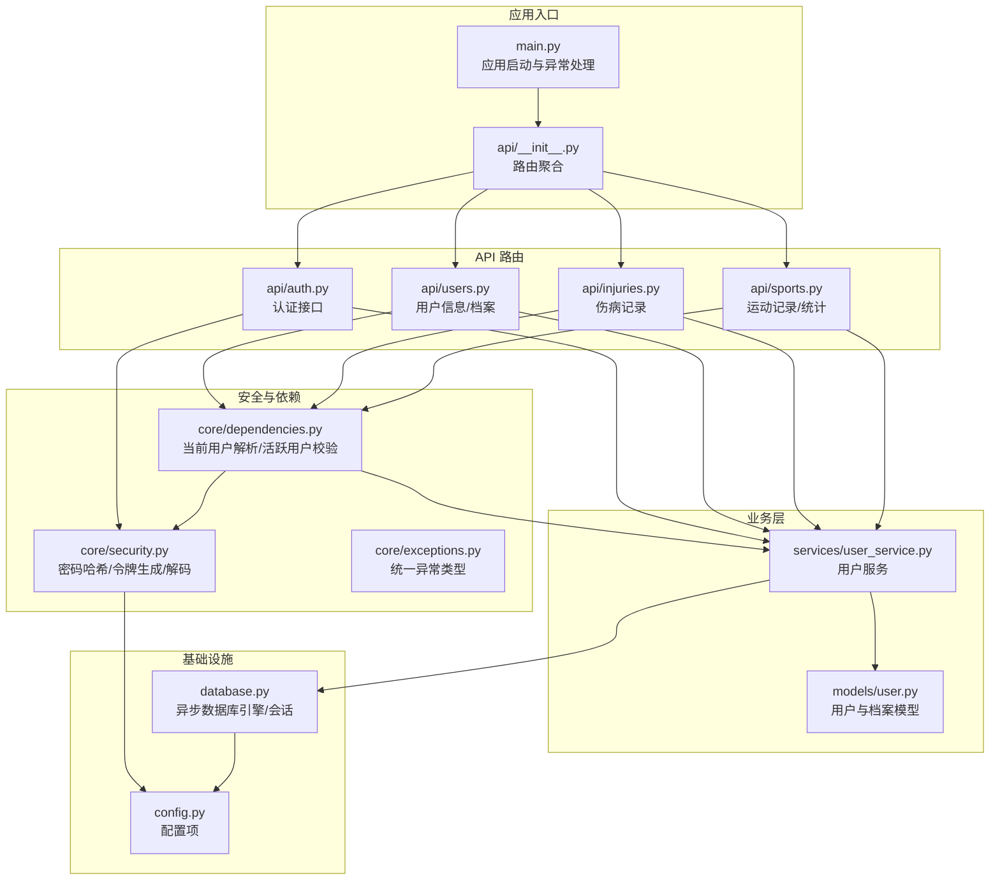
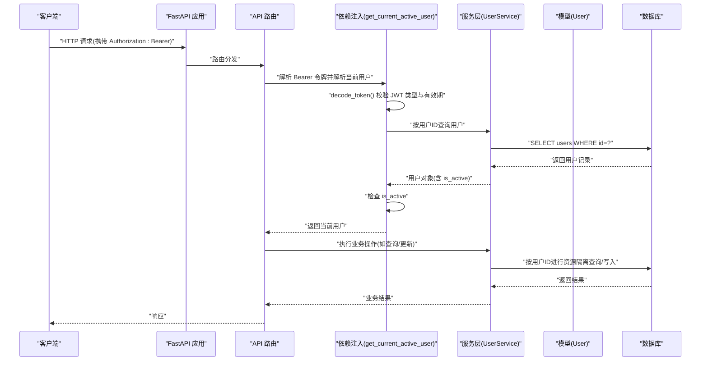
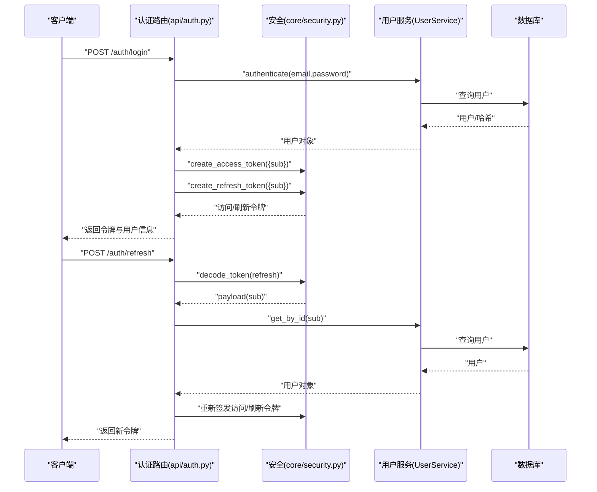
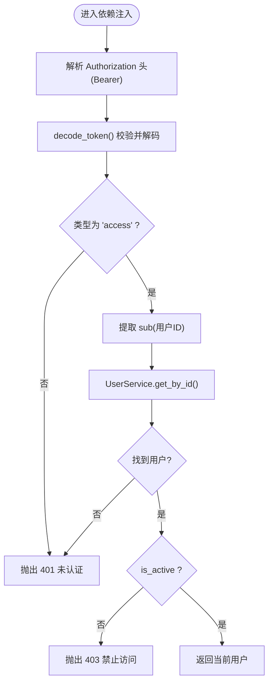
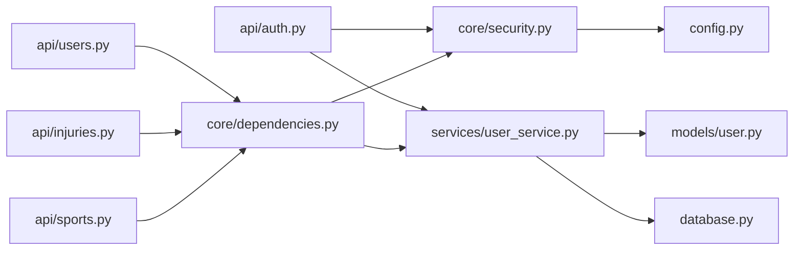
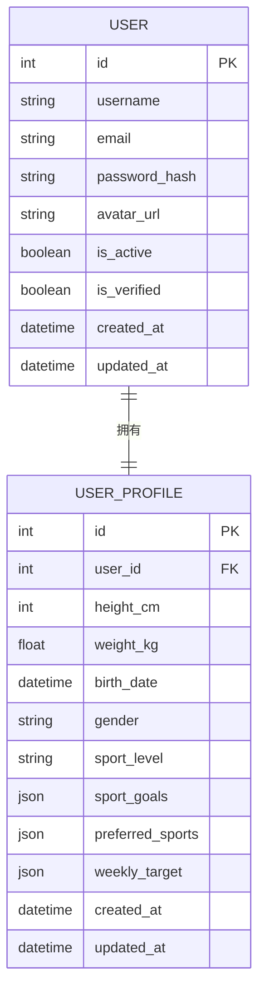

# 权限控制与访问管理

<cite>
**本文档引用的文件**
- [backend/app/main.py](file://backend/app/main.py)
- [backend/app/api/__init__.py](file://backend/app/api/__init__.py)
- [backend/app/api/auth.py](file://backend/app/api/auth.py)
- [backend/app/api/users.py](file://backend/app/api/users.py)
- [backend/app/api/injuries.py](file://backend/app/api/injuries.py)
- [backend/app/api/sports.py](file://backend/app/api/sports.py)
- [backend/app/core/security.py](file://backend/app/core/security.py)
- [backend/app/core/dependencies.py](file://backend/app/core/dependencies.py)
- [backend/app/core/exceptions.py](file://backend/app/core/exceptions.py)
- [backend/app/models/user.py](file://backend/app/models/user.py)
- [backend/app/services/user_service.py](file://backend/app/services/user_service.py)
- [backend/app/database.py](file://backend/app/database.py)
- [backend/app/config.py](file://backend/app/config.py)
</cite>

## 目录
1. [简介](#简介)
2. [项目结构](#项目结构)
3. [核心组件](#核心组件)
4. [架构总览](#架构总览)
5. [详细组件分析](#详细组件分析)
6. [依赖关系分析](#依赖关系分析)
7. [性能考虑](#性能考虑)
8. [故障排除指南](#故障排除指南)
9. [结论](#结论)
10. [附录](#附录)

## 简介
本文件系统性梳理 ActiveSynapse 的权限控制与访问管理体系，覆盖用户角色与权限模型、访问控制实现、依赖注入机制、认证与会话管理、API 级别权限控制、资源访问隔离、权限缓存与性能优化、安全审计以及权限配置与批量授权/撤销流程。文档以代码为依据，结合可视化图示帮助读者快速理解系统设计与实现。

## 项目结构
后端采用 FastAPI + SQLAlchemy Async 架构，权限相关逻辑集中在以下模块：
- 应用入口与路由聚合：main.py、api/__init__.py
- 安全与认证：core/security.py、core/dependencies.py、core/exceptions.py
- 数据模型与服务：models/user.py、services/user_service.py
- 配置与数据库：config.py、database.py
- API 层：api/auth.py、api/users.py、api/injuries.py、api/sports.py

图表来源
- [backend/app/main.py](file://backend/app/main.py#L1-L77)
- [backend/app/api/__init__.py](file://backend/app/api/__init__.py#L1-L10)
- [backend/app/core/security.py](file://backend/app/core/security.py#L1-L50)
- [backend/app/core/dependencies.py](file://backend/app/core/dependencies.py#L1-L61)
- [backend/app/core/exceptions.py](file://backend/app/core/exceptions.py#L1-L54)
- [backend/app/models/user.py](file://backend/app/models/user.py#L1-L62)
- [backend/app/services/user_service.py](file://backend/app/services/user_service.py#L1-L120)
- [backend/app/database.py](file://backend/app/database.py#L1-L43)
- [backend/app/config.py](file://backend/app/config.py#L1-L46)
- [backend/app/api/auth.py](file://backend/app/api/auth.py#L1-L92)
- [backend/app/api/users.py](file://backend/app/api/users.py#L1-L88)
- [backend/app/api/injuries.py](file://backend/app/api/injuries.py#L1-L92)
- [backend/app/api/sports.py](file://backend/app/api/sports.py#L1-L127)

章节来源
- [backend/app/main.py](file://backend/app/main.py#L1-L77)
- [backend/app/api/__init__.py](file://backend/app/api/__init__.py#L1-L10)

## 核心组件
- 认证与令牌管理：基于 JWT 的访问/刷新令牌生成、解码与校验；密码哈希与比对。
- 依赖注入与中间件：HTTP Bearer 授权头解析、当前用户解析、活跃用户校验；全局异常处理。
- 用户与档案模型：用户基础信息、激活状态、档案扩展字段。
- 服务层：用户注册/登录/更新、档案读写、资源隔离查询。
- API 路由：认证、用户信息、伤病记录、运动记录与统计等端点，均通过依赖注入强制鉴权。

章节来源
- [backend/app/core/security.py](file://backend/app/core/security.py#L1-L50)
- [backend/app/core/dependencies.py](file://backend/app/core/dependencies.py#L1-L61)
- [backend/app/models/user.py](file://backend/app/models/user.py#L1-L62)
- [backend/app/services/user_service.py](file://backend/app/services/user_service.py#L1-L120)
- [backend/app/api/auth.py](file://backend/app/api/auth.py#L1-L92)
- [backend/app/api/users.py](file://backend/app/api/users.py#L1-L88)
- [backend/app/api/injuries.py](file://backend/app/api/injuries.py#L1-L92)
- [backend/app/api/sports.py](file://backend/app/api/sports.py#L1-L127)

## 架构总览
下图展示从客户端到数据库的完整请求链路，重点标注了权限控制的关键节点（令牌解析、用户校验、资源隔离）。

图表来源
- [backend/app/api/auth.py](file://backend/app/api/auth.py#L1-L92)
- [backend/app/api/users.py](file://backend/app/api/users.py#L1-L88)
- [backend/app/api/injuries.py](file://backend/app/api/injuries.py#L1-L92)
- [backend/app/api/sports.py](file://backend/app/api/sports.py#L1-L127)
- [backend/app/core/dependencies.py](file://backend/app/core/dependencies.py#L1-L61)
- [backend/app/core/security.py](file://backend/app/core/security.py#L1-L50)
- [backend/app/services/user_service.py](file://backend/app/services/user_service.py#L1-L120)
- [backend/app/models/user.py](file://backend/app/models/user.py#L1-L62)
- [backend/app/database.py](file://backend/app/database.py#L1-L43)

## 详细组件分析

### 认证与会话管理
- 令牌类型与生命周期
  - 访问令牌：包含标准声明与自定义类型标识，过期时间由配置项决定。
  - 刷新令牌：独立过期周期，用于在访问令牌过期时换取新的访问令牌。
- 密码与令牌安全
  - 使用强哈希算法对密码进行存储。
  - JWT 使用密钥签名，算法可配置。
- 登录/刷新/注销流程
  - 登录：凭邮箱与密码验证，成功后返回访问/刷新令牌及用户信息。
  - 刷新：校验刷新令牌类型与有效性，重新签发新令牌。
  - 注销：服务端不维护会话状态，仅提示客户端丢弃令牌。

图表来源
- [backend/app/api/auth.py](file://backend/app/api/auth.py#L1-L92)
- [backend/app/core/security.py](file://backend/app/core/security.py#L1-L50)
- [backend/app/services/user_service.py](file://backend/app/services/user_service.py#L1-L120)
- [backend/app/models/user.py](file://backend/app/models/user.py#L1-L62)
- [backend/app/database.py](file://backend/app/database.py#L1-L43)

章节来源
- [backend/app/api/auth.py](file://backend/app/api/auth.py#L1-L92)
- [backend/app/core/security.py](file://backend/app/core/security.py#L1-L50)
- [backend/app/config.py](file://backend/app/config.py#L1-L46)

### 依赖注入与中间件实现
- HTTP Bearer 解析
  - 通过 HTTP 依赖自动从 Authorization 头提取凭据。
- 当前用户解析
  - 解码 JWT，校验类型为“访问令牌”，提取 sub 作为用户ID。
  - 查询用户并检查是否激活；未找到或非激活直接抛出认证/授权错误。
- 活跃用户校验
  - 在 get_current_active_user 中再次确认用户处于激活状态。

图表来源
- [backend/app/core/dependencies.py](file://backend/app/core/dependencies.py#L1-L61)
- [backend/app/core/security.py](file://backend/app/core/security.py#L1-L50)
- [backend/app/services/user_service.py](file://backend/app/services/user_service.py#L1-L120)
- [backend/app/models/user.py](file://backend/app/models/user.py#L1-L62)

章节来源
- [backend/app/core/dependencies.py](file://backend/app/core/dependencies.py#L1-L61)
- [backend/app/core/exceptions.py](file://backend/app/core/exceptions.py#L1-L54)

### 用户角色分级与权限模型
- 角色与权限
  - 当前代码未实现显式角色枚举或权限位/清单。所有受保护端点默认要求“已认证且账户激活”。
- 资源访问隔离
  - 所有资源读写均通过“当前用户ID”进行过滤，确保用户只能访问自身数据。
- 可扩展建议
  - 引入角色表与用户-角色关联表，以及权限表与资源-权限映射表，实现 RBAC。
  - 在依赖注入中增加角色/权限校验函数，配合装饰器或中间件统一拦截。

章节来源
- [backend/app/api/users.py](file://backend/app/api/users.py#L1-L88)
- [backend/app/api/injuries.py](file://backend/app/api/injuries.py#L1-L92)
- [backend/app/api/sports.py](file://backend/app/api/sports.py#L1-L127)
- [backend/app/models/user.py](file://backend/app/models/user.py#L1-L62)

### API 端点级权限控制与资源访问限制
- 认证端点
  - /auth/register：创建用户（注册流程），无需当前用户上下文。
  - /auth/login：登录并发放令牌。
  - /auth/refresh：刷新令牌。
  - /auth/logout：提示客户端丢弃令牌。
- 用户信息端点
  - /users/me：获取当前用户信息与档案。
  - /users/me/profile：获取/更新当前用户档案。
  - /users/me/avatar：占位上传头像接口。
- 资源端点（均需当前活跃用户）
  - /injuries：列出/创建/读取/更新/删除伤病记录；支持按条件筛选与汇总统计。
  - /sports：列出/创建/读取/更新/删除运动记录；支持统计与周汇总；导入 GPX 占位。
- 访问控制要点
  - 所有受保护端点均依赖 get_current_active_user，从而实现：
    - 令牌有效性与类型校验；
    - 用户存在性与激活状态检查；
    - 基于用户ID的资源隔离查询。

章节来源
- [backend/app/api/auth.py](file://backend/app/api/auth.py#L1-L92)
- [backend/app/api/users.py](file://backend/app/api/users.py#L1-L88)
- [backend/app/api/injuries.py](file://backend/app/api/injuries.py#L1-L92)
- [backend/app/api/sports.py](file://backend/app/api/sports.py#L1-L127)
- [backend/app/core/dependencies.py](file://backend/app/core/dependencies.py#L1-L61)

### 数据隔离策略
- 查询隔离
  - 服务层在执行资源查询时，统一传入当前用户ID作为过滤条件，避免越权访问。
- 写入隔离
  - 创建/更新/删除操作均先校验资源归属，再执行业务逻辑，保证数据一致性与隔离性。
- 档案扩展
  - 用户档案通过一对一关系与用户绑定，同样遵循用户ID隔离。

章节来源
- [backend/app/services/user_service.py](file://backend/app/services/user_service.py#L1-L120)
- [backend/app/api/injuries.py](file://backend/app/api/injuries.py#L1-L92)
- [backend/app/api/sports.py](file://backend/app/api/sports.py#L1-L127)
- [backend/app/models/user.py](file://backend/app/models/user.py#L1-L62)

### 权限继承、角色切换与动态权限分配
- 当前实现
  - 未实现角色继承与动态权限分配。
- 建议方案
  - 引入角色层级（如普通用户、教练、管理员），通过继承规则叠加权限。
  - 提供角色切换接口（在管理员场景下临时提升权限），并记录审计日志。
  - 动态权限分配通过权限模板与资源绑定，运行时计算有效权限集合。

[本节为概念性建议，不直接分析具体文件]

### 权限缓存、性能优化与安全审计
- 权限缓存
  - 可将用户权限集合缓存至 Redis，设置合理 TTL；在用户信息变更或权限调整时失效。
- 性能优化
  - 将用户对象注入到请求上下文，避免重复查询。
  - 对热点端点使用数据库只读副本或连接池优化。
- 安全审计
  - 记录登录/登出、令牌刷新、敏感操作（修改资料、删除记录）等事件，保留时间戳、用户ID、IP、UA 等元信息。

[本节为通用指导，不直接分析具体文件]

### 权限配置管理、批量授权与权限撤销
- 配置管理
  - 通过配置文件集中管理令牌算法、密钥、过期时间等参数。
- 批量授权
  - 通过后台管理接口对多个用户授予/回收角色或权限。
- 权限撤销
  - 冻结用户账户或撤销其角色/权限；对在线会话可通过黑名单或缩短令牌有效期实现即时生效。

[本节为通用指导，不直接分析具体文件]

## 依赖关系分析
- 组件耦合
  - API 路由依赖依赖注入与服务层；服务层依赖模型与数据库；安全模块依赖配置。
- 关键依赖链
  - 路由 → 依赖注入(get_current_active_user) → 安全(decode_token) → 服务层(UserService) → 模型/数据库。
- 循环依赖
  - 当前结构清晰，未发现循环依赖迹象。

图表来源
- [backend/app/api/auth.py](file://backend/app/api/auth.py#L1-L92)
- [backend/app/api/users.py](file://backend/app/api/users.py#L1-L88)
- [backend/app/api/injuries.py](file://backend/app/api/injuries.py#L1-L92)
- [backend/app/api/sports.py](file://backend/app/api/sports.py#L1-L127)
- [backend/app/core/dependencies.py](file://backend/app/core/dependencies.py#L1-L61)
- [backend/app/core/security.py](file://backend/app/core/security.py#L1-L50)
- [backend/app/services/user_service.py](file://backend/app/services/user_service.py#L1-L120)
- [backend/app/models/user.py](file://backend/app/models/user.py#L1-L62)
- [backend/app/database.py](file://backend/app/database.py#L1-L43)
- [backend/app/config.py](file://backend/app/config.py#L1-L46)

章节来源
- [backend/app/api/__init__.py](file://backend/app/api/__init__.py#L1-L10)
- [backend/app/main.py](file://backend/app/main.py#L1-L77)

## 性能考虑
- 连接池与事务
  - 使用异步引擎与会话工厂，减少连接开销；在依赖中按需创建/关闭会话。
- 缓存策略
  - 对频繁读取的用户信息与权限集合进行缓存，降低数据库压力。
- 令牌大小
  - 控制载荷字段数量，避免过长的访问令牌影响网络传输与解析性能。

[本节提供一般性建议，不直接分析具体文件]

## 故障排除指南
- 常见错误与定位
  - 401 未认证：令牌缺失、格式错误、类型非 access、签名无效。
  - 403 禁止访问：用户不存在或未激活。
  - 404 资源不存在：请求的资源不属于当前用户或已被删除。
  - 409 冲突：注册邮箱/用户名冲突。
- 排查步骤
  - 检查 Authorization 头格式与令牌类型。
  - 核对用户状态与令牌过期时间。
  - 确认资源查询是否带入当前用户ID过滤。
  - 查看统一异常处理器返回的详细信息。

章节来源
- [backend/app/core/exceptions.py](file://backend/app/core/exceptions.py#L1-L54)
- [backend/app/core/dependencies.py](file://backend/app/core/dependencies.py#L1-L61)
- [backend/app/api/injuries.py](file://backend/app/api/injuries.py#L1-L92)
- [backend/app/api/sports.py](file://backend/app/api/sports.py#L1-L127)

## 结论
当前系统实现了基于 JWT 的基础认证与资源隔离访问控制，通过依赖注入在 API 层统一强制鉴权。为进一步增强安全性与可维护性，建议引入角色与权限模型、权限缓存与审计、批量授权与撤销流程，并在必要时扩展中间件与装饰器以支持更细粒度的权限控制。

## 附录
- 配置项概览（节选）
  - JWT：密钥、算法、访问令牌过期分钟数、刷新令牌过期天数。
  - 数据库：异步/同步连接串。
  - Redis：缓存与会话存储。
  - CORS：允许的来源列表。
- 数据模型关系（简化）

图表来源
- [backend/app/models/user.py](file://backend/app/models/user.py#L1-L62)