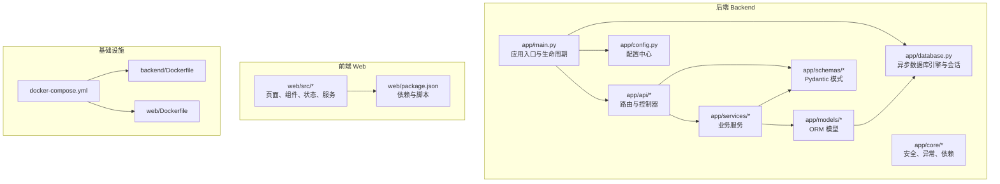
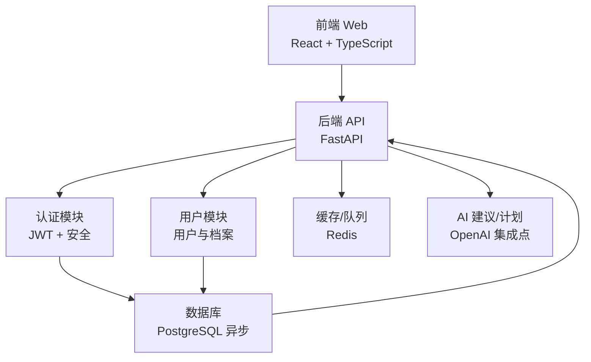
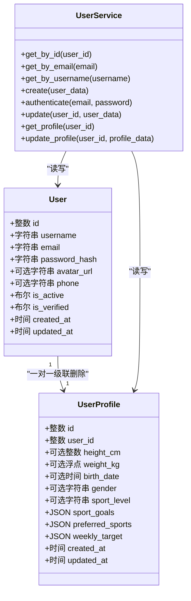
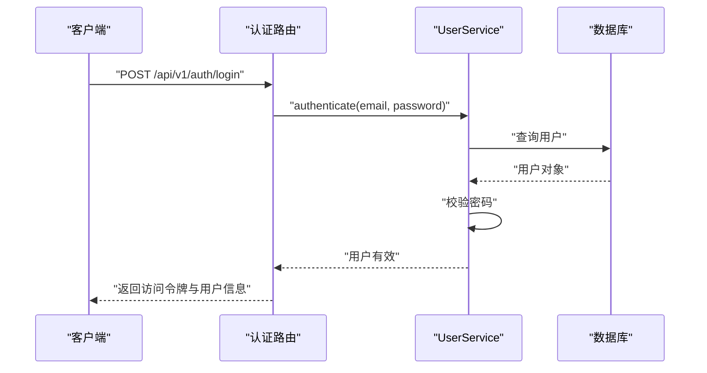
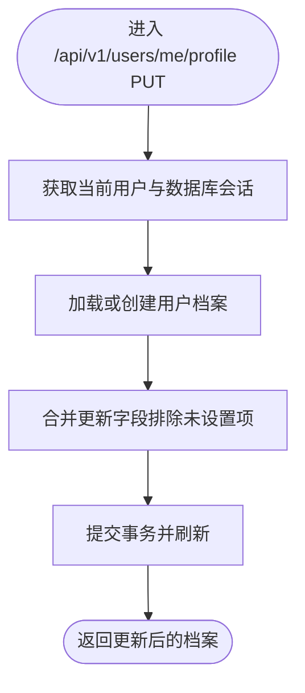
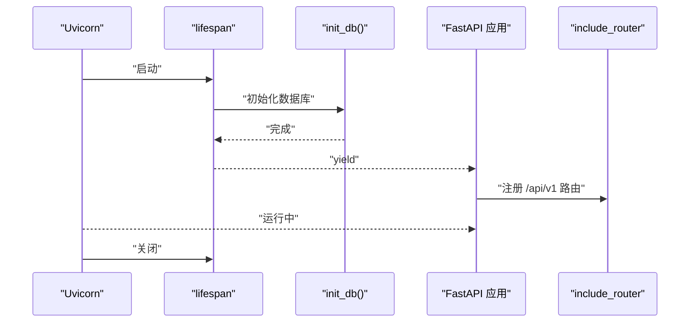
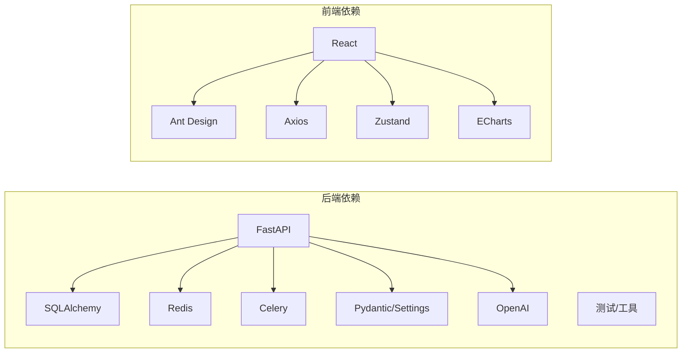

# 开发者指南

<cite>
**本文引用的文件**
- [README.md](file://README.md)
- [backend/app/main.py](file://backend/app/main.py)
- [backend/app/config.py](file://backend/app/config.py)
- [backend/requirements.txt](file://backend/requirements.txt)
- [backend/app/api/__init__.py](file://backend/app/api/__init__.py)
- [backend/app/api/auth.py](file://backend/app/api/auth.py)
- [backend/app/api/users.py](file://backend/app/api/users.py)
- [backend/app/database.py](file://backend/app/database.py)
- [backend/app/models/__init__.py](file://backend/app/models/__init__.py)
- [backend/app/models/user.py](file://backend/app/models/user.py)
- [backend/app/schemas/__init__.py](file://backend/app/schemas/__init__.py)
- [backend/app/schemas/user.py](file://backend/app/schemas/user.py)
- [backend/app/services/__init__.py](file://backend/app/services/__init__.py)
- [backend/app/services/user_service.py](file://backend/app/services/user_service.py)
- [web/package.json](file://web/package.json)
- [docker-compose.yml](file://docker-compose.yml)
- [backend/Dockerfile](file://backend/Dockerfile)
- [web/Dockerfile](file://web/Dockerfile)
</cite>

## 目录
1. [简介](#简介)
2. [项目结构](#项目结构)
3. [核心组件](#核心组件)
4. [架构总览](#架构总览)
5. [详细组件分析](#详细组件分析)
6. [依赖分析](#依赖分析)
7. [性能考虑](#性能考虑)
8. [故障排查指南](#故障排查指南)
9. [结论](#结论)
10. [附录](#附录)

## 简介
ActiveSynapse 是一个个人运动智能教练系统，采用前后端分离架构：后端基于 FastAPI 提供异步 API，前端基于 React + TypeScript，通过 Vite 构建与开发。系统支持用户认证、运动记录、伤病记录、营养与力量训练等模块，并预留 AI 建议与训练计划能力。

本指南面向贡献者与维护者，覆盖开发环境搭建、代码规范、提交与分支管理、API 变更与版本发布、质量保证、调试与性能分析、以及扩展点与最佳实践等内容。

## 项目结构
项目采用多模块组织方式，后端按领域分层（API、服务、模型、模式、核心），前端按页面与组件分层，容器化部署通过 Docker 与 Compose 编排。

图表来源
- [backend/app/main.py](file://backend/app/main.py#L1-L77)
- [backend/app/config.py](file://backend/app/config.py#L1-L46)
- [backend/app/database.py](file://backend/app/database.py#L1-L43)
- [backend/app/api/__init__.py](file://backend/app/api/__init__.py#L1-L10)
- [backend/app/services/__init__.py](file://backend/app/services/__init__.py#L1-L6)
- [backend/app/models/__init__.py](file://backend/app/models/__init__.py#L1-L20)
- [backend/app/schemas/__init__.py](file://backend/app/schemas/__init__.py#L1-L23)
- [web/package.json](file://web/package.json#L1-L37)
- [docker-compose.yml](file://docker-compose.yml)
- [backend/Dockerfile](file://backend/Dockerfile)
- [web/Dockerfile](file://web/Dockerfile)

章节来源
- [README.md](file://README.md#L1-L3)
- [backend/app/main.py](file://backend/app/main.py#L1-L77)
- [backend/app/config.py](file://backend/app/config.py#L1-L46)
- [backend/app/database.py](file://backend/app/database.py#L1-L43)
- [backend/app/api/__init__.py](file://backend/app/api/__init__.py#L1-L10)
- [backend/app/services/__init__.py](file://backend/app/services/__init__.py#L1-L6)
- [backend/app/models/__init__.py](file://backend/app/models/__init__.py#L1-L20)
- [backend/app/schemas/__init__.py](file://backend/app/schemas/__init__.py#L1-L23)
- [web/package.json](file://web/package.json#L1-L37)
- [docker-compose.yml](file://docker-compose.yml)

## 核心组件
- 应用入口与生命周期：定义 FastAPI 实例、CORS 中间件、全局异常处理器、路由注册与健康检查端点。
- 配置中心：集中管理应用名称、版本、数据库、Redis、JWT、AI、文件上传、CORS 允许域等配置项。
- 数据库层：异步 SQLAlchemy 引擎与会话工厂，提供依赖注入与自动建表初始化。
- API 层：按模块划分路由（认证、用户、伤病、运动），统一前缀与标签。
- 服务层：封装业务逻辑（如用户服务），处理数据访问与校验。
- 模型与模式：ORM 模型与 Pydantic 模式，确保数据一致性与序列化。
- 前端：React + TypeScript，Vite 脚手架，包含页面、组件、状态与 API 服务。

章节来源
- [backend/app/main.py](file://backend/app/main.py#L1-L77)
- [backend/app/config.py](file://backend/app/config.py#L1-L46)
- [backend/app/database.py](file://backend/app/database.py#L1-L43)
- [backend/app/api/__init__.py](file://backend/app/api/__init__.py#L1-L10)
- [backend/app/services/user_service.py](file://backend/app/services/user_service.py#L1-L120)
- [backend/app/models/user.py](file://backend/app/models/user.py#L1-L62)
- [backend/app/schemas/user.py](file://backend/app/schemas/user.py#L1-L69)
- [web/package.json](file://web/package.json#L1-L37)

## 架构总览
系统采用分层架构与依赖注入，后端通过 API 路由暴露功能，服务层协调模型与数据库交互，前端通过 Axios 访问后端 API。容器编排用于本地开发与部署。

图表来源
- [backend/app/main.py](file://backend/app/main.py#L1-L77)
- [backend/app/api/auth.py](file://backend/app/api/auth.py#L1-L92)
- [backend/app/api/users.py](file://backend/app/api/users.py#L1-L88)
- [backend/app/config.py](file://backend/app/config.py#L1-L46)
- [backend/app/database.py](file://backend/app/database.py#L1-L43)

## 详细组件分析

### 认证与用户模块（API/服务/模型/模式）
- 路由：注册、登录、刷新、登出；当前用户信息、更新、头像上传占位。
- 服务：用户创建、认证、唯一性校验、档案读写。
- 模型：用户与用户档案，含外键级联删除与丰富字段。
- 模式：Pydantic 模式定义输入输出结构与约束。

图表来源
- [backend/app/models/user.py](file://backend/app/models/user.py#L1-L62)
- [backend/app/services/user_service.py](file://backend/app/services/user_service.py#L1-L120)

图表来源
- [backend/app/api/auth.py](file://backend/app/api/auth.py#L25-L49)
- [backend/app/services/user_service.py](file://backend/app/services/user_service.py#L61-L68)

图表来源
- [backend/app/api/users.py](file://backend/app/api/users.py#L62-L71)
- [backend/app/services/user_service.py](file://backend/app/services/user_service.py#L104-L119)

章节来源
- [backend/app/api/auth.py](file://backend/app/api/auth.py#L1-L92)
- [backend/app/api/users.py](file://backend/app/api/users.py#L1-L88)
- [backend/app/services/user_service.py](file://backend/app/services/user_service.py#L1-L120)
- [backend/app/models/user.py](file://backend/app/models/user.py#L1-L62)
- [backend/app/schemas/user.py](file://backend/app/schemas/user.py#L1-L69)

### 应用启动与生命周期
- 生命周期钩子：启动时初始化数据库，关闭时清理资源。
- CORS：允许指定来源、凭证、方法与头。
- 全局异常处理：自定义异常与通用异常分别返回结构化错误。
- 路由注册：统一前缀与标签，根路径与健康检查端点。

图表来源
- [backend/app/main.py](file://backend/app/main.py#L12-L57)
- [backend/app/database.py](file://backend/app/database.py#L39-L42)

章节来源
- [backend/app/main.py](file://backend/app/main.py#L1-L77)
- [backend/app/database.py](file://backend/app/database.py#L1-L43)

### 配置与依赖
- 配置项：应用名、版本、数据库、Redis、JWT、AI、文件上传、CORS。
- 依赖声明：后端 Python 包、前端 npm 包与脚本。

章节来源
- [backend/app/config.py](file://backend/app/config.py#L1-L46)
- [backend/requirements.txt](file://backend/requirements.txt#L1-L40)
- [web/package.json](file://web/package.json#L1-L37)

## 依赖分析
后端与前端分别有独立的依赖清单，后端使用 FastAPI、SQLAlchemy、Redis、Celery、Pydantic、OpenAI 等；前端使用 React、Ant Design、Axios、Zustand、ECharts 等。

图表来源
- [backend/requirements.txt](file://backend/requirements.txt#L1-L40)
- [web/package.json](file://web/package.json#L1-L37)

章节来源
- [backend/requirements.txt](file://backend/requirements.txt#L1-L40)
- [web/package.json](file://web/package.json#L1-L37)

## 性能考虑
- 异步数据库：使用异步 SQLAlchemy 引擎与会话，减少阻塞，提升并发。
- 连接池：当前示例使用空池类，生产环境建议根据负载调整连接池参数。
- 缓存与队列：Redis 支持缓存与任务队列，可用于热点数据与后台任务。
- 文件上传：限制最大文件大小，结合存储服务实现大文件处理。
- 前端性能：按需引入组件与图表库，避免不必要的重渲染。

章节来源
- [backend/app/database.py](file://backend/app/database.py#L1-L43)
- [backend/app/config.py](file://backend/app/config.py#L28-L31)
- [web/package.json](file://web/package.json#L12-L23)

## 故障排查指南
- 启动失败
  - 检查数据库连接串与服务可用性。
  - 确认 .env 文件与配置项加载。
- 认证问题
  - 核对 JWT 密钥与算法配置。
  - 排查刷新令牌类型与用户状态。
- 数据库异常
  - 查看会话回滚与提交逻辑，定位事务边界。
  - 确认建表初始化是否执行成功。
- 前端请求失败
  - 检查 CORS 配置与代理设置。
  - 使用浏览器网络面板查看响应状态与错误信息。

章节来源
- [backend/app/main.py](file://backend/app/main.py#L21-L57)
- [backend/app/config.py](file://backend/app/config.py#L18-L33)
- [backend/app/database.py](file://backend/app/database.py#L26-L36)
- [backend/app/api/auth.py](file://backend/app/api/auth.py#L52-L85)

## 结论
ActiveSynapse 采用清晰的分层架构与模块化设计，具备良好的扩展性与可维护性。建议在开发中遵循统一的代码规范与提交流程，严格进行代码审查与测试，持续关注性能与安全性，确保系统的稳定演进。

## 附录

### 开发环境配置与 IDE 设置
- 后端
  - Python 版本与虚拟环境，安装依赖清单。
  - 使用 LSP（如 pylsp）与格式化工具（如 ruff、black）。
  - 配置断点调试与单元测试运行。
- 前端
  - Node.js 与包管理器，安装依赖。
  - TypeScript 与 ESLint 规则，启用保存时格式化。
  - Vite 开发服务器与热更新。

章节来源
- [backend/requirements.txt](file://backend/requirements.txt#L1-L40)
- [web/package.json](file://web/package.json#L1-L37)

### 提交流程与分支管理
- 分支策略
  - 主分支保护，仅允许通过合并请求（MR）合并。
  - 功能分支：feature/xxx，修复分支：fix/xxx，文档分支：docs/xxx。
- 提交信息
  - 类型：feat、fix、docs、style、refactor、test、chore。
  - 格式：type(scope): subject。
- 代码审查
  - 至少一名维护者批准。
  - 关注可读性、测试覆盖率、性能影响与安全风险。

### 新功能开发流程
- 需求评审 → 设计接口与模式 → 编写模型与服务 → 实现 API 路由 → 单元测试 → 集成测试 → 文档更新 → 合并与发布。

### API 变更管理与版本发布
- 变更策略
  - 保持向后兼容，新增字段默认可选，废弃字段保留并标注弃用。
  - 对外 API 增加版本前缀，内部变更不破坏外部契约。
- 发布流程
  - 语义化版本号，变更日志，自动化构建与测试，容器镜像推送，编排部署。

### 调试工具与性能分析
- 后端
  - Uvicorn 调试运行，SQL 打印（DEBUG），异常堆栈。
  - Redis 监控与 Celery 任务追踪。
- 前端
  - 浏览器开发者工具，React DevTools，网络面板。
  - 性能面板分析长列表与重渲染。

### 扩展点与最佳实践
- 扩展点
  - 新增领域模块：models/schemas/services/api。
  - 插入中间件与拦截器。
  - 集成更多 AI 模型与第三方服务。
- 最佳实践
  - 依赖注入与单一职责。
  - 明确的异常类型与错误码。
  - 持续集成与自动化测试。
  - 文档驱动开发与变更追踪。