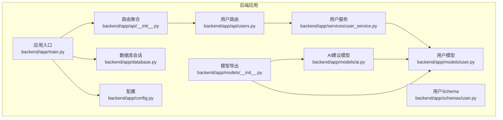
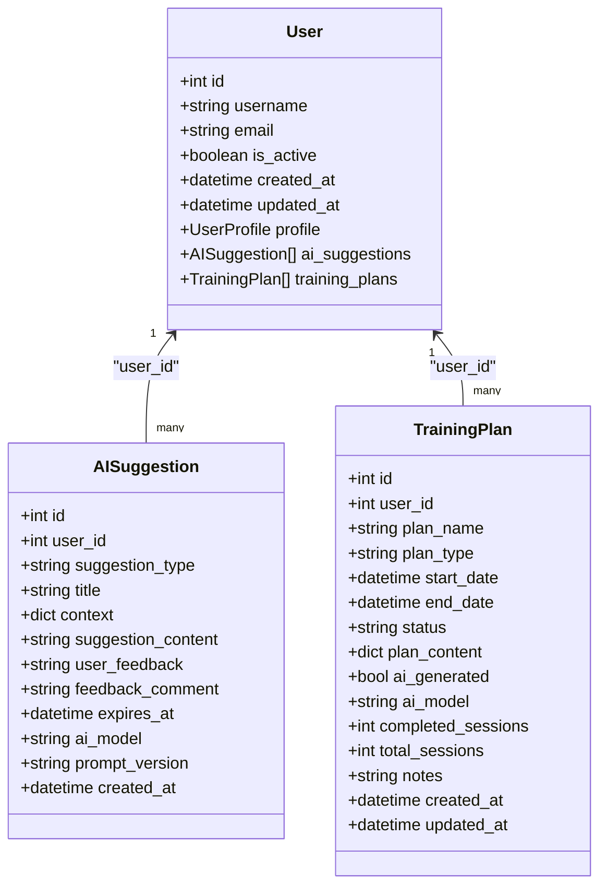
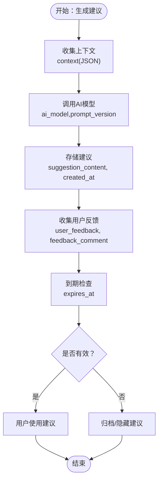
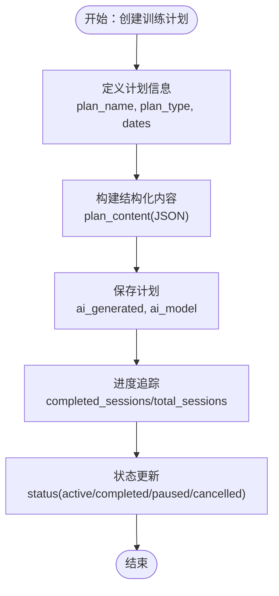
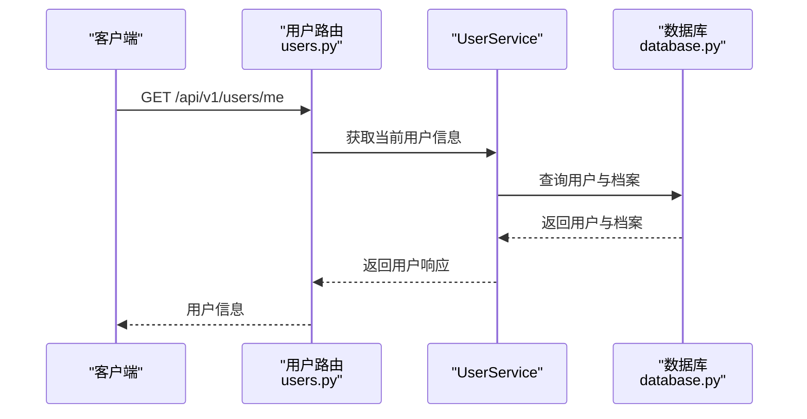
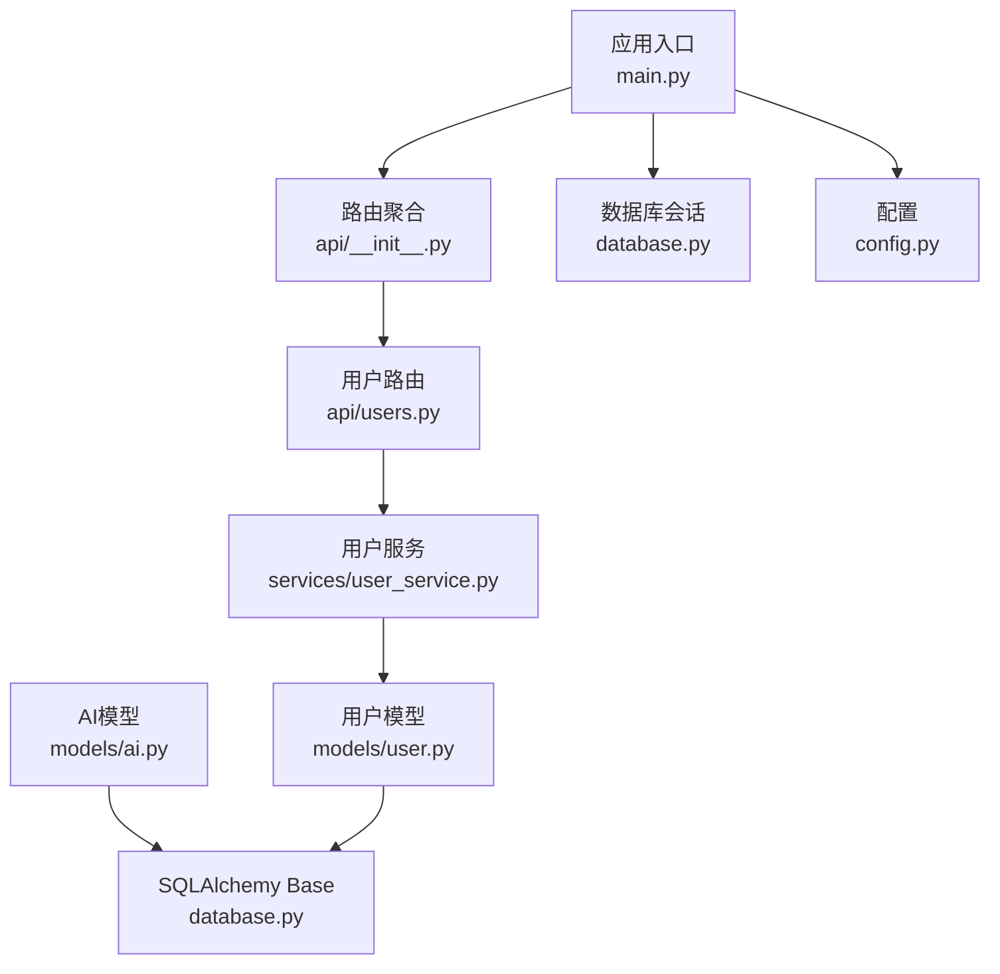

# AI建议模型

<cite>
**本文引用的文件**
- [backend/app/models/ai.py](file://backend/app/models/ai.py)
- [backend/app/models/user.py](file://backend/app/models/user.py)
- [backend/app/models/__init__.py](file://backend/app/models/__init__.py)
- [backend/app/schemas/user.py](file://backend/app/schemas/user.py)
- [backend/app/services/user_service.py](file://backend/app/services/user_service.py)
- [backend/app/database.py](file://backend/app/database.py)
- [backend/app/main.py](file://backend/app/main.py)
- [backend/app/config.py](file://backend/app/config.py)
- [backend/app/api/users.py](file://backend/app/api/users.py)
- [backend/app/api/__init__.py](file://backend/app/api/__init__.py)
</cite>

## 目录
1. [简介](#简介)
2. [项目结构](#项目结构)
3. [核心组件](#核心组件)
4. [架构总览](#架构总览)
5. [详细组件分析](#详细组件分析)
6. [依赖分析](#依赖分析)
7. [性能考虑](#性能考虑)
8. [故障排查指南](#故障排查指南)
9. [结论](#结论)
10. [附录](#附录)

## 简介
本文件为 ActiveSynapse 的 AI 建议模型提供全面的数据模型文档。重点覆盖以下方面：
- AI 建议实体的设计原理、字段定义与数据类型
- 建议类型分类、建议内容存储、用户反馈字段与建议有效性状态
- AI 建议与用户的关联关系、建议生成时间戳与过期机制
- 建议内容的结构化存储、多模态数据（文本+图表）的处理方式与建议历史版本管理
- AI 建议的质量评估指标、用户交互数据收集与建议效果追踪的数据结构
- AI 建议系统的数据流设计与性能监控指标

## 项目结构
ActiveSynapse 后端采用 FastAPI + SQLAlchemy Async 架构，数据库模型集中在 models 子包中，AI 建议相关模型位于 ai.py；用户模型与服务位于 user.py 与 services/user_service.py；数据库连接与会话管理在 database.py；应用入口与路由在 main.py 与 api/__init__.py。

**图示来源**
- [backend/app/main.py:1-77](file://backend/app/main.py#L1-L77)
- [backend/app/api/__init__.py:1-10](file://backend/app/api/__init__.py#L1-L10)
- [backend/app/api/users.py:1-88](file://backend/app/api/users.py#L1-L88)
- [backend/app/models/__init__.py:1-20](file://backend/app/models/__init__.py#L1-L20)
- [backend/app/models/ai.py:1-123](file://backend/app/models/ai.py#L1-L123)
- [backend/app/models/user.py:1-62](file://backend/app/models/user.py#L1-L62)
- [backend/app/services/user_service.py:1-120](file://backend/app/services/user_service.py#L1-L120)
- [backend/app/schemas/user.py:1-69](file://backend/app/schemas/user.py#L1-L69)
- [backend/app/database.py:1-43](file://backend/app/database.py#L1-L43)
- [backend/app/config.py:1-46](file://backend/app/config.py#L1-L46)

**章节来源**
- [backend/app/main.py:1-77](file://backend/app/main.py#L1-L77)
- [backend/app/api/__init__.py:1-10](file://backend/app/api/__init__.py#L1-L10)
- [backend/app/models/__init__.py:1-20](file://backend/app/models/__init__.py#L1-L20)

## 核心组件
本节聚焦于 AI 建议与训练计划两大核心实体及其关联关系，明确字段语义、数据类型与约束，并给出建议内容的结构化存储与多模态扩展思路。

- AISuggestion（AI 建议）
  - 关键字段与含义
    - 基础标识：id（主键）、user_id（外键，级联删除）
    - 建议详情：suggestion_type（枚举，见下表）、title（标题）
    - 上下文：context（JSON，用于记录生成建议时的上下文，如用户画像、近期活动、伤病等）
    - 内容：suggestion_content（Text，建议正文内容）
    - 反馈：user_feedback（字符串，如 helpful/not_helpful）、feedback_comment（评论）
    - 过期：expires_at（DateTime，建议有效期截止时间）
    - 元数据：ai_model（字符串，如 gpt-4）、prompt_version（提示词版本）
    - 时间戳：created_at（UTC 创建时间）
  - 关系：与 User 的一对多反向关系，支持级联删除
  - 有效性状态：通过 expires_at 字段实现"过期"控制；可结合业务逻辑在查询时过滤未过期建议

- TrainingPlan（训练计划）
  - 关键字段与含义
    - 基础标识：id（主键）、user_id（外键，级联删除）
    - 计划信息：plan_name（名称）、plan_type（枚举，见下表）
    - 时间线：start_date、end_date
    - 状态：status（枚举，见下表）
    - 结构化内容：plan_content（JSON，见模型注释中的示例结构）
    - AI 标记：ai_generated（布尔）、ai_model（字符串）
    - 进度：completed_sessions、total_sessions
    - 备注：notes（Text）
    - 时间戳：created_at、updated_at（UTC）
  - 关系：与 User 的一对多反向关系，支持级联删除

- 枚举类型
  - 建议类型（SuggestionType）
    - training、diet、recovery、injury_prevention、general
  - 计划类型（PlanType）
    - running、strength、badminton、combined
  - 计划状态（PlanStatus）
    - active、completed、paused、cancelled

- 数据类型与约束
  - 字符串类：String(n) 限制长度；JSON 字段用于存储复杂上下文与计划内容
  - 文本类：Text 用于大文本内容（建议正文、备注）
  - 时间类：DateTime（带 UTC 时区），确保跨时区一致性
  - 布尔类：Boolean 用于 AI 生成标记
  - 外键：ondelete="CASCADE" 实现用户删除时级联清理相关建议与计划

**章节来源**
- [backend/app/models/ai.py:8-28](file://backend/app/models/ai.py#L8-L28)
- [backend/app/models/ai.py:30-64](file://backend/app/models/ai.py#L30-L64)
- [backend/app/models/ai.py:66-123](file://backend/app/models/ai.py#L66-L123)
- [backend/app/models/user.py:7-31](file://backend/app/models/user.py#L7-L31)
- [backend/app/models/__init__.py:6-19](file://backend/app/models/__init__.py#L6-L19)

## 架构总览
AI 建议系统围绕 AISuggestion 与 TrainingPlan 两个核心实体展开，通过 User 实体与之建立一对多关联。数据流从用户侧发起，经由 API 路由与服务层，最终持久化到数据库。配置模块提供数据库与 AI 模型参数，数据库模块提供异步连接与会话管理。

**图示来源**
- [backend/app/models/user.py:7-31](file://backend/app/models/user.py#L7-L31)
- [backend/app/models/ai.py:30-64](file://backend/app/models/ai.py#L30-L64)
- [backend/app/models/ai.py:66-123](file://backend/app/models/ai.py#L66-L123)

## 详细组件分析

### AISuggestion（AI 建议）分析
- 设计原则
  - 松耦合：通过 JSON 字段存储上下文与建议内容，便于扩展不同类型的建议与多模态数据
  - 可追溯性：记录 ai_model 与 prompt_version，便于质量评估与回溯
  - 可用性：提供 expires_at 控制建议有效期，避免过期建议误导用户
  - 用户反馈：提供 user_feedback 与 feedback_comment，支撑建议质量评估与迭代
- 字段与数据类型
  - 建议类型：枚举，限定取值范围
  - 上下文：JSON，建议生成时的输入上下文
  - 内容：Text，建议正文
  - 反馈：字符串与文本，便于统计与人工审核
  - 过期：DateTime，UTC 时间
  - 元数据：字符串，记录模型与提示词版本
  - 时间戳：DateTime，UTC
- 多模态数据处理
  - 当前模型以文本为主；若需图表等多模态，可在 context 或 suggestion_content 中以 JSON 结构嵌入引用（如 base64 或对象链接），并在前端渲染时解析
- 建议历史版本管理
  - 当前模型未内置版本字段；可通过在 context 或 suggestion_content 中记录版本号与变更摘要，或引入独立的历史表进行版本追踪

**图示来源**
- [backend/app/models/ai.py:30-64](file://backend/app/models/ai.py#L30-L64)

**章节来源**
- [backend/app/models/ai.py:30-64](file://backend/app/models/ai.py#L30-L64)

### TrainingPlan（训练计划）分析
- 设计原则
  - 结构化存储：通过 JSON 存储周计划、日计划与活动列表，便于前端渲染与进度追踪
  - 状态机：通过状态枚举管理计划生命周期
  - 进度量化：completed_sessions 与 total_sessions 支撑完成度统计
  - AI 标记：ai_generated 与 ai_model 便于区分手制与AI生成计划
- 字段与数据类型
  - 计划类型与状态：枚举，限定取值范围
  - 时间线：DateTime，UTC
  - 结构化内容：JSON，遵循模型注释中的示例结构
  - 进度：整数，累计会话数
  - 备注：Text
  - 时间戳：DateTime，UTC
- 多模态数据处理
  - 计划内容以结构化 JSON 为主；若需图表，可在 plan_content 中嵌入可视化元数据或外部资源链接
- 历史版本管理
  - 当前模型未内置版本字段；可通过在 plan_content 中记录版本号与变更摘要，或引入独立的历史表进行版本追踪

**图示来源**
- [backend/app/models/ai.py:66-123](file://backend/app/models/ai.py#L66-L123)

**章节来源**
- [backend/app/models/ai.py:66-123](file://backend/app/models/ai.py#L66-L123)

### 用户与建议关联关系
- 关系映射
  - User 与 AISuggestion：一对多，User.ai_suggestions
  - User 与 TrainingPlan：一对多，User.training_plans
- 级联删除
  - 删除用户时，其所有建议与计划将被级联删除，保证数据一致性
- 查询与权限
  - API 层通过当前活跃用户上下文限制访问范围，避免越权读写

**图示来源**
- [backend/app/api/users.py:13-36](file://backend/app/api/users.py#L13-L36)
- [backend/app/services/user_service.py:14-27](file://backend/app/services/user_service.py#L14-L27)
- [backend/app/database.py:26-37](file://backend/app/database.py#L26-L37)

**章节来源**
- [backend/app/models/user.py:21-28](file://backend/app/models/user.py#L21-L28)
- [backend/app/api/users.py:1-88](file://backend/app/api/users.py#L1-L88)
- [backend/app/services/user_service.py:1-120](file://backend/app/services/user_service.py#L1-L120)

## 依赖分析
- 组件耦合与内聚
  - AISuggestion 与 User 通过外键关联，内聚于建议域；TrainingPlan 同理
  - 模型层仅负责数据结构与关系，不直接处理业务逻辑，保持高内聚低耦合
- 直接与间接依赖
  - 模型依赖数据库基类 Base 与 SQL 类型
  - API 路由依赖服务层，服务层依赖模型层与安全工具
  - 应用入口依赖路由聚合与数据库初始化
- 外部依赖与集成点
  - 数据库：PostgreSQL（异步驱动）
  - 配置：OpenAI API Key 与模型名（用于建议生成）
  - 缓存：Redis URL（预留）

**图示来源**
- [backend/app/models/ai.py:1-123](file://backend/app/models/ai.py#L1-L123)
- [backend/app/models/user.py:1-62](file://backend/app/models/user.py#L1-L62)
- [backend/app/services/user_service.py:1-120](file://backend/app/services/user_service.py#L1-L120)
- [backend/app/api/users.py:1-88](file://backend/app/api/users.py#L1-L88)
- [backend/app/main.py:1-77](file://backend/app/main.py#L1-L77)
- [backend/app/api/__init__.py:1-10](file://backend/app/api/__init__.py#L1-L10)
- [backend/app/database.py:1-43](file://backend/app/database.py#L1-L43)
- [backend/app/config.py:1-46](file://backend/app/config.py#L1-L46)

**章节来源**
- [backend/app/models/ai.py:1-123](file://backend/app/models/ai.py#L1-L123)
- [backend/app/models/user.py:1-62](file://backend/app/models/user.py#L1-L62)
- [backend/app/services/user_service.py:1-120](file://backend/app/services/user_service.py#L1-L120)
- [backend/app/api/users.py:1-88](file://backend/app/api/users.py#L1-L88)
- [backend/app/main.py:1-77](file://backend/app/main.py#L1-L77)
- [backend/app/api/__init__.py:1-10](file://backend/app/api/__init__.py#L1-L10)
- [backend/app/database.py:1-43](file://backend/app/database.py#L1-L43)
- [backend/app/config.py:1-46](file://backend/app/config.py#L1-L46)

## 性能考虑
- 数据库连接与会话
  - 使用异步引擎与会话工厂，减少阻塞；通过 NullPool 在开发环境降低连接开销
- 查询优化
  - 建议实体主键与 user_id 建有索引；按 user_id 与 created_at/expires_at 查询时注意索引策略
- JSON 字段
  - 上下文与计划内容为 JSON，建议控制层级与大小，避免超大文档影响查询性能
- 缓存与限流
  - 利用 Redis（预留）缓存热点建议与计划；对 AI 生成接口实施限流与熔断
- 监控指标
  - 建议生成耗时、命中率、错误率、用户反馈分布、建议过期率等

## 故障排查指南
- 数据库连接异常
  - 检查 DATABASE_URL 与网络连通性；确认异步驱动可用
- 会话管理问题
  - 确认 get_db 依赖在请求生命周期内正确创建与关闭；异常时自动回滚
- 用户认证与授权
  - 确认当前活跃用户依赖正常工作；检查 JWT 密钥与过期设置
- 建议与计划查询异常
  - 检查 user_id 是否匹配当前用户；确认 expires_at 未导致误判

**章节来源**
- [backend/app/database.py:26-37](file://backend/app/database.py#L26-L37)
- [backend/app/config.py:11-22](file://backend/app/config.py#L11-L22)
- [backend/app/api/users.py:13-36](file://backend/app/api/users.py#L13-L36)

## 结论
ActiveSynapse 的 AI 建议模型以简洁而灵活的方式实现了建议与训练计划的结构化存储，通过枚举类型与 JSON 字段兼顾了规范性与扩展性。建议与计划均与用户建立清晰的一对多关系，并通过外键级联删除保障数据一致性。建议有效期与用户反馈字段为质量评估与效果追踪提供了基础。未来可在建议与计划层面引入版本管理、多模态内容标准化以及更完善的监控与缓存策略，以进一步提升系统的可维护性与性能。

## 附录
- 建议类型与计划类型枚举值
  - 建议类型：training、diet、recovery、injury_prevention、general
  - 计划类型：running、strength、badminton、combined
  - 计划状态：active、completed、paused、cancelled
- 配置项要点
  - 数据库：DATABASE_URL（异步）
  - AI：OPENAI_API_KEY、OPENAI_MODEL
  - 缓存：REDIS_URL
  - CORS：ALLOWED_ORIGINS

**章节来源**
- [backend/app/models/ai.py:8-28](file://backend/app/models/ai.py#L8-L28)
- [backend/app/config.py:11-27](file://backend/app/config.py#L11-L27)