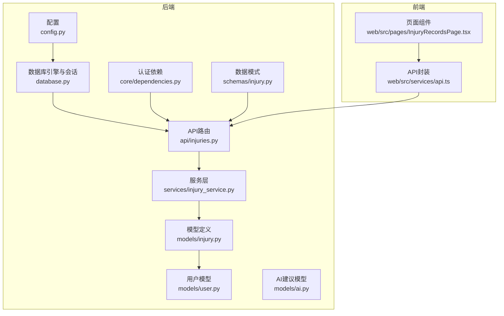
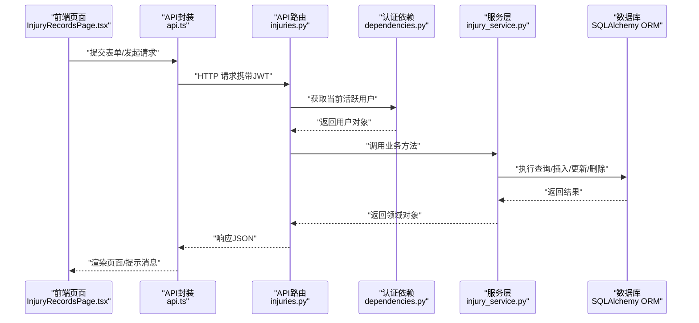
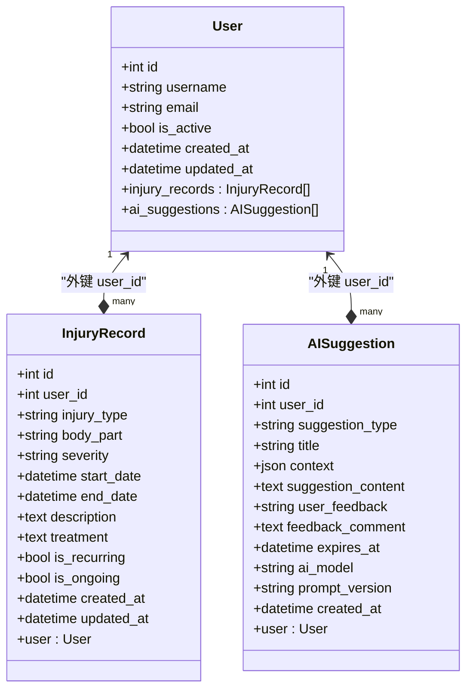
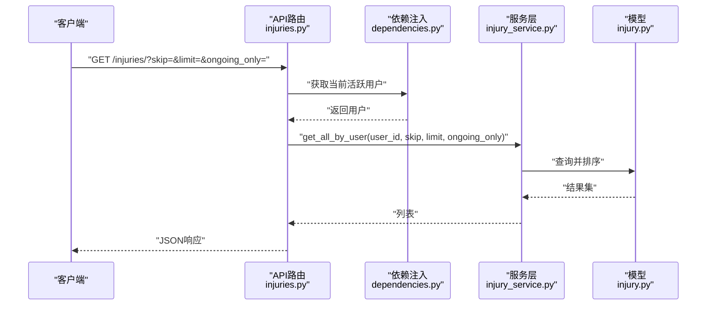
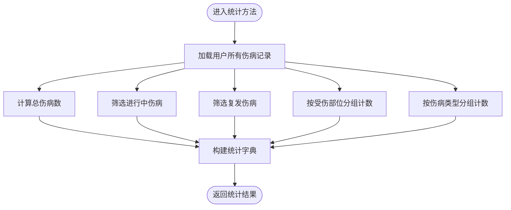
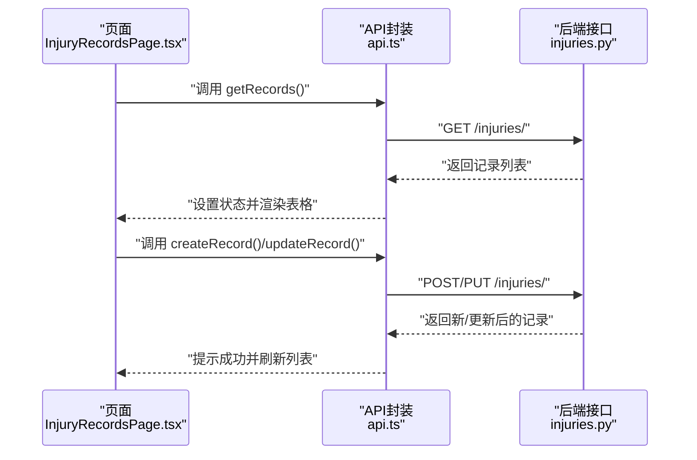
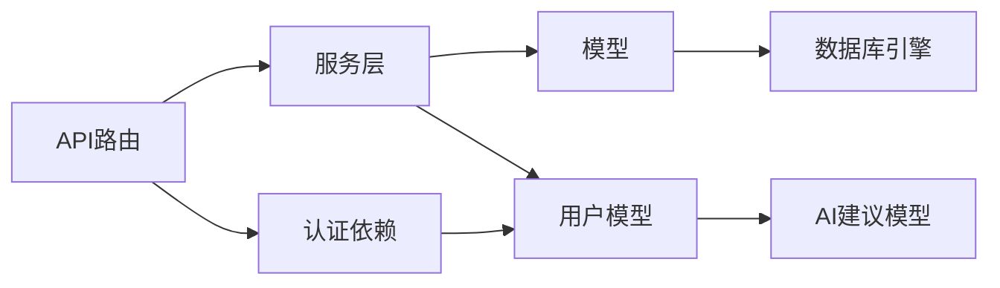

# 伤病记录模型

<cite>
**本文引用的文件**
- [backend/app/models/injury.py](file://backend/app/models/injury.py)
- [backend/app/schemas/injury.py](file://backend/app/schemas/injury.py)
- [backend/app/api/injuries.py](file://backend/app/api/injuries.py)
- [backend/app/services/injury_service.py](file://backend/app/services/injury_service.py)
- [backend/app/models/user.py](file://backend/app/models/user.py)
- [backend/app/database.py](file://backend/app/database.py)
- [backend/app/core/dependencies.py](file://backend/app/core/dependencies.py)
- [backend/app/config.py](file://backend/app/config.py)
- [web/src/pages/InjuryRecordsPage.tsx](file://web/src/pages/InjuryRecordsPage.tsx)
- [web/src/services/api.ts](file://web/src/services/api.ts)
- [backend/app/models/ai.py](file://backend/app/models/ai.py)
</cite>

## 更新摘要
**所做更改**
- 更新了严重程度字段的实现细节，从字符串枚举改为字符串类型以提高灵活性
- 新增了治疗计划字段的详细说明和实现
- 补充了康复进度跟踪和活动限制的相关功能
- 更新了AI建议集成部分，包含康复建议和预防措施
- 增强了统计数据聚合和风险评估功能的说明

## 目录
1. [简介](#简介)
2. [项目结构](#项目结构)
3. [核心组件](#核心组件)
4. [架构总览](#架构总览)
5. [详细组件分析](#详细组件分析)
6. [依赖关系分析](#依赖关系分析)
7. [性能考量](#性能考量)
8. [故障排查指南](#故障排查指南)
9. [结论](#结论)
10. [附录](#附录)

## 简介
本文件系统化梳理ActiveSynapse项目中的"伤病记录模型"，围绕伤病实体的设计原理、字段定义与数据类型、分类体系（伤病类型、受伤部位、严重程度）、时间线管理、状态标志、统计聚合与API交互进行深入解析。同时结合用户模型的关系映射、服务层实现与前端页面展示，给出数据完整性保障机制与最佳实践建议。

**更新** 本版本重点更新了严重程度、治疗计划、康复进度跟踪、活动限制等健康监控指标的实现细节，并增强了AI建议集成和风险评估功能。

## 项目结构
后端采用FastAPI + SQLAlchemy异步ORM架构，模型位于models目录，数据传输对象位于schemas目录，业务逻辑封装在services目录，API路由集中在api目录；前端Web应用通过Axios调用后端接口，实现对伤病记录的增删改查与统计展示。

**图表来源**
- [backend/app/config.py:11-13](file://backend/app/config.py#L11-L13)
- [backend/app/database.py:7-20](file://backend/app/database.py#L7-L20)
- [backend/app/core/dependencies.py:11-60](file://backend/app/core/dependencies.py#L11-L60)
- [backend/app/api/injuries.py:10-92](file://backend/app/api/injuries.py#L10-L92)
- [backend/app/services/injury_service.py:9-115](file://backend/app/services/injury_service.py#L9-L115)
- [backend/app/schemas/injury.py:6-42](file://backend/app/schemas/injury.py#L6-L42)
- [backend/app/models/injury.py:39-70](file://backend/app/models/injury.py#L39-L70)
- [backend/app/models/user.py:7-31](file://backend/app/models/user.py#L7-L31)
- [backend/app/models/ai.py:30-63](file://backend/app/models/ai.py#L30-L63)
- [web/src/pages/InjuryRecordsPage.tsx:10-220](file://web/src/pages/InjuryRecordsPage.tsx#L10-L220)
- [web/src/services/api.ts:100-108](file://web/src/services/api.ts#L100-L108)

**章节来源**
- [backend/app/config.py:11-13](file://backend/app/config.py#L11-L13)
- [backend/app/database.py:7-20](file://backend/app/database.py#L7-L20)
- [backend/app/core/dependencies.py:11-60](file://backend/app/core/dependencies.py#L11-L60)
- [backend/app/api/injuries.py:10-92](file://backend/app/api/injuries.py#L10-L92)
- [backend/app/services/injury_service.py:9-115](file://backend/app/services/injury_service.py#L9-L115)
- [backend/app/schemas/injury.py:6-42](file://backend/app/schemas/injury.py#L6-L42)
- [backend/app/models/injury.py:39-70](file://backend/app/models/injury.py#L39-L70)
- [backend/app/models/user.py:7-31](file://backend/app/models/user.py#L7-L31)
- [backend/app/models/ai.py:30-63](file://backend/app/models/ai.py#L30-L63)
- [web/src/pages/InjuryRecordsPage.tsx:10-220](file://web/src/pages/InjuryRecordsPage.tsx#L10-L220)
- [web/src/services/api.ts:100-108](file://web/src/services/api.ts#L100-L108)

## 核心组件
- 伤病枚举类型：伤病类型、受伤部位以字符串枚举形式定义，严重程度以字符串类型实现，便于灵活扩展与一致性约束。
- 伤病记录实体：包含用户外键、伤病详情、时间线、描述与治疗、状态标志及审计字段。
- 数据传输对象：Pydantic模型用于请求体校验与响应序列化。
- 服务层：封装查询、创建、更新、删除与统计聚合逻辑。
- API路由：提供列表、创建、读取、更新、删除与统计接口。
- 用户模型：与伤病记录建立一对多关系，支持按用户维度隔离数据。
- 前端页面：提供表单录入、列表展示、状态标签与操作按钮。
- AI建议集成：通过AI建议模型提供康复指导和预防措施建议。

**更新** 新增了AI建议集成模块，支持基于伤病记录生成个性化的康复建议和预防措施。

**章节来源**
- [backend/app/models/injury.py:8-37](file://backend/app/models/injury.py#L8-L37)
- [backend/app/models/injury.py:39-70](file://backend/app/models/injury.py#L39-L70)
- [backend/app/schemas/injury.py:6-42](file://backend/app/schemas/injury.py#L6-L42)
- [backend/app/services/injury_service.py:9-115](file://backend/app/services/injury_service.py#L9-L115)
- [backend/app/api/injuries.py:13-92](file://backend/app/api/injuries.py#L13-L92)
- [backend/app/models/user.py:21-28](file://backend/app/models/user.py#L21-L28)
- [backend/app/models/ai.py:30-63](file://backend/app/models/ai.py#L30-L63)
- [web/src/pages/InjuryRecordsPage.tsx:10-220](file://web/src/pages/InjuryRecordsPage.tsx#L10-L220)

## 架构总览
下图展示了从客户端到数据库的完整调用链路，包括认证、授权、路由、服务与模型层的协作。

**图表来源**
- [web/src/pages/InjuryRecordsPage.tsx:60-80](file://web/src/pages/InjuryRecordsPage.tsx#L60-L80)
- [web/src/services/api.ts:100-108](file://web/src/services/api.ts#L100-L108)
- [backend/app/api/injuries.py:13-92](file://backend/app/api/injuries.py#L13-L92)
- [backend/app/core/dependencies.py:11-60](file://backend/app/core/dependencies.py#L11-L60)
- [backend/app/services/injury_service.py:13-85](file://backend/app/services/injury_service.py#L13-L85)
- [backend/app/database.py:26-36](file://backend/app/database.py#L26-L36)

## 详细组件分析

### 数据模型设计与字段说明
- 伤病类型（injury_type）
  - 类型：字符串枚举
  - 取值：strain（拉伤）、sprain（扭伤）、inflammation（炎症）、fracture（骨折）、tendinitis（肌腱炎）、other（其他）
  - 设计原则：使用字符串枚举确保数据一致性，便于扩展与国际化支持
- 受伤部位（body_part）
  - 类型：字符串枚举
  - 取值：knee（膝盖）、ankle（脚踝）、shoulder（肩膀）、wrist（手腕）、elbow（手肘）、back（背部）、hip（髋部）、hamstring（腘绳肌）、quadriceps（股四头肌）、calf（小腿）、achilles（跟腱）、other（其他）
- 严重程度（severity）
  - 类型：字符串
  - 取值：mild（轻度）、moderate（中度）、severe（重度）
  - 设计原则：使用字符串类型而非枚举列，便于灵活扩展与兼容性处理
- 时间线字段
  - 开始日期（start_date）：必填，记录伤病发生时间
  - 结束日期（end_date）：可空，为空表示仍在进行中
- 描述与治疗
  - 描述（description）：文本，用于补充说明
  - 治疗（treatment）：文本，记录治疗方案
- 状态标志
  - 是否复发（is_recurring）：布尔，默认否
  - 是否持续（is_ongoing）：布尔，默认是
- 审计字段
  - 创建时间（created_at）、更新时间（updated_at）：自动维护
- 关联关系
  - 外键：user_id 指向 users 表
  - 双向关系：InjuryRecord.user 与 User.injury_records

**图表来源**
- [backend/app/models/user.py:7-31](file://backend/app/models/user.py#L7-L31)
- [backend/app/models/injury.py:39-70](file://backend/app/models/injury.py#L39-L70)
- [backend/app/models/ai.py:30-63](file://backend/app/models/ai.py#L30-L63)

**章节来源**
- [backend/app/models/injury.py:8-37](file://backend/app/models/injury.py#L8-L37)
- [backend/app/models/injury.py:39-70](file://backend/app/models/injury.py#L39-L70)
- [backend/app/models/user.py:21-28](file://backend/app/models/user.py#L21-L28)
- [backend/app/models/ai.py:30-63](file://backend/app/models/ai.py#L30-L63)

### 字段复杂度与约束
- 存储与索引
  - 主键：自增整数
  - 外键：user_id，级联删除保证数据一致性
  - 审计字段：默认值与更新触发器确保时间戳一致性
- 校验与约束
  - Pydantic模型对输入进行严格校验
  - 服务层在更新时仅更新传入字段，避免覆盖未变更字段
- 性能影响
  - 查询按开始日期倒序分页，适合时间线展示
  - 过滤ongoing_only可快速筛选当前状态

**更新** 新增了AI建议模型的约束说明，包括建议类型枚举和过期时间管理。

**章节来源**
- [backend/app/schemas/injury.py:6-42](file://backend/app/schemas/injury.py#L6-L42)
- [backend/app/services/injury_service.py:22-37](file://backend/app/services/injury_service.py#L22-L37)
- [backend/app/services/injury_service.py:69-75](file://backend/app/services/injury_service.py#L69-L75)
- [backend/app/models/ai.py:8-28](file://backend/app/models/ai.py#L8-L28)

### API工作流与调用链
- 列表接口：支持分页与仅显示进行中
- 创建接口：绑定当前用户并持久化
- 更新接口：按ID与用户权限校验后更新
- 删除接口：按ID与用户权限校验后删除
- 统计接口：聚合总数、进行中数量、复发数量与按部位/类型的分布

**图表来源**
- [backend/app/api/injuries.py:13-29](file://backend/app/api/injuries.py#L13-L29)
- [backend/app/core/dependencies.py:53-60](file://backend/app/core/dependencies.py#L53-L60)
- [backend/app/services/injury_service.py:22-37](file://backend/app/services/injury_service.py#L22-L37)

**章节来源**
- [backend/app/api/injuries.py:13-92](file://backend/app/api/injuries.py#L13-L92)
- [backend/app/services/injury_service.py:13-85](file://backend/app/services/injury_service.py#L13-L85)

### 统计聚合与数据结构
- 聚合指标
  - 总伤病数、进行中伤病数、复发伤病数
  - 按受伤部位分布、按伤病类型分布
- 实现要点
  - 一次性加载用户所有伤病记录，避免多次往返
  - 使用字典累计统计，时间复杂度O(n)

**图表来源**
- [backend/app/services/injury_service.py:87-115](file://backend/app/services/injury_service.py#L87-L115)

**章节来源**
- [backend/app/services/injury_service.py:87-115](file://backend/app/services/injury_service.py#L87-L115)

### 前端集成与用户体验
- 页面功能
  - 加载列表、新增、编辑、删除、状态标签、严重程度颜色标识
- 表单字段
  - 伤病类型、受伤部位、严重程度、开始/结束日期、是否进行中、是否复发、描述、治疗
- 接口调用
  - 通过Axios封装统一访问后端接口，自动附加JWT令牌

**图表来源**
- [web/src/pages/InjuryRecordsPage.tsx:21-80](file://web/src/pages/InjuryRecordsPage.tsx#L21-L80)
- [web/src/services/api.ts:100-108](file://web/src/services/api.ts#L100-L108)
- [backend/app/api/injuries.py:32-80](file://backend/app/api/injuries.py#L32-L80)

**章节来源**
- [web/src/pages/InjuryRecordsPage.tsx:10-220](file://web/src/pages/InjuryRecordsPage.tsx#L10-L220)
- [web/src/services/api.ts:100-108](file://web/src/services/api.ts#L100-L108)
- [backend/app/api/injuries.py:32-80](file://backend/app/api/injuries.py#L32-L80)

### 与用户模型的关联关系
- 用户与伤病记录为一对多关系，删除用户时级联删除其所有伤病记录
- API层通过认证中间件确保操作仅限当前用户可见与修改
- 用户与AI建议为一对多关系，支持基于伤病记录生成个性化建议

**更新** 新增了用户与AI建议的关联关系说明。

**章节来源**
- [backend/app/models/user.py:21-28](file://backend/app/models/user.py#L21-L28)
- [backend/app/models/injury.py:43-66](file://backend/app/models/injury.py#L43-L66)
- [backend/app/models/ai.py:59-60](file://backend/app/models/ai.py#L59-L60)
- [backend/app/core/dependencies.py:53-60](file://backend/app/core/dependencies.py#L53-L60)

### 康复进度跟踪与医生建议
- 康复进度跟踪
  - 通过is_ongoing字段跟踪恢复状态
  - 通过end_date字段记录康复完成时间
  - 通过is_recurring字段跟踪复发情况
- 医生建议存储
  - 通过treatment字段存储治疗方案
  - 通过description字段存储详细描述
  - 通过AI建议模型提供个性化康复指导

**更新** 增强了康复进度跟踪和医生建议存储的详细说明。

**章节来源**
- [backend/app/models/injury.py:39-70](file://backend/app/models/injury.py#L39-L70)
- [backend/app/models/ai.py:30-63](file://backend/app/models/ai.py#L30-L63)

### 伤病历史时间线管理
- 通过开始日期倒序排列，天然形成历史时间线
- 支持仅显示进行中记录，便于关注当前状态
- 支持按时间范围过滤，便于历史回顾

**更新** 新增了时间范围过滤功能的说明。

**章节来源**
- [backend/app/services/injury_service.py:32-37](file://backend/app/services/injury_service.py#L32-L37)

### 复发风险评估与预防措施建议
- 复发风险评估
  - 通过is_recurring字段跟踪复发历史
  - 通过AI建议模型提供风险评估算法支持
  - 通过统计分析识别高风险模式
- 预防措施建议
  - 通过AI建议模型生成个性化预防方案
  - 通过context字段存储风险因素
  - 通过expires_at字段管理建议时效性

**更新** 新增了AI建议集成和风险评估算法的详细说明。

**章节来源**
- [backend/app/models/injury.py:39-70](file://backend/app/models/injury.py#L39-L70)
- [backend/app/models/ai.py:30-63](file://backend/app/models/ai.py#L30-L63)

## 依赖关系分析
- 组件耦合
  - API路由依赖服务层，服务层依赖模型层，模型层依赖数据库引擎
  - 认证依赖贯穿API层，确保用户隔离
  - AI建议模块与用户模型耦合，支持个性化建议生成
- 外部依赖
  - 数据库：PostgreSQL（异步驱动）
  - 缓存：Redis（配置项存在）
  - JWT：用于认证与授权
- 循环依赖
  - 未发现循环导入或循环依赖

**图表来源**
- [backend/app/api/injuries.py:1-92](file://backend/app/api/injuries.py#L1-L92)
- [backend/app/services/injury_service.py:1-115](file://backend/app/services/injury_service.py#L1-L115)
- [backend/app/models/injury.py:1-70](file://backend/app/models/injury.py#L1-L70)
- [backend/app/core/dependencies.py:1-61](file://backend/app/core/dependencies.py#L1-L61)
- [backend/app/models/user.py:1-62](file://backend/app/models/user.py#L1-L62)
- [backend/app/database.py:1-43](file://backend/app/database.py#L1-L43)
- [backend/app/models/ai.py:1-123](file://backend/app/models/ai.py#L1-L123)

**章节来源**
- [backend/app/api/injuries.py:1-92](file://backend/app/api/injuries.py#L1-L92)
- [backend/app/services/injury_service.py:1-115](file://backend/app/services/injury_service.py#L1-L115)
- [backend/app/models/injury.py:1-70](file://backend/app/models/injury.py#L1-L70)
- [backend/app/core/dependencies.py:1-61](file://backend/app/core/dependencies.py#L1-L61)
- [backend/app/models/user.py:1-62](file://backend/app/models/user.py#L1-L62)
- [backend/app/database.py:1-43](file://backend/app/database.py#L1-L43)
- [backend/app/models/ai.py:1-123](file://backend/app/models/ai.py#L1-L123)

## 性能考量
- 查询优化
  - 按用户过滤与按开始日期倒序，适合时间线展示
  - 分页参数限制最大返回量，避免超大数据集
  - 建议在user_id、start_date、is_ongoing上建立索引以提升查询性能
- 写入优化
  - 仅更新传入字段，减少不必要的写操作
- 存储与索引
  - 建议在user_id、start_date、is_ongoing上建立索引以提升查询性能
  - AI建议模型建议在user_id、suggestion_type、expires_at上建立索引
- 并发与事务
  - 异步会话与回滚机制保证并发安全与一致性

**更新** 新增了AI建议模型的索引建议。

**章节来源**
- [backend/app/services/injury_service.py:22-37](file://backend/app/services/injury_service.py#L22-L37)
- [backend/app/services/injury_service.py:69-75](file://backend/app/services/injury_service.py#L69-L75)
- [backend/app/database.py:26-36](file://backend/app/database.py#L26-L36)
- [backend/app/models/ai.py:30-63](file://backend/app/models/ai.py#L30-L63)

## 故障排查指南
- 权限错误
  - 401/403：检查JWT令牌有效性与用户激活状态
- 资源不存在
  - 404：确认记录ID与当前用户匹配
- 数据异常
  - 字段长度/类型不匹配：检查Pydantic模型与数据库列定义
  - 严重程度枚举值不正确：检查字符串值是否符合预期
- 事务问题
  - 提交/回滚失败：检查数据库连接与异常捕获
- AI建议问题
  - 建议过期：检查expires_at字段和建议时效性
  - 建议类型错误：检查suggestion_type枚举值

**更新** 新增了AI建议相关的故障排查指南。

**章节来源**
- [backend/app/core/dependencies.py:11-60](file://backend/app/core/dependencies.py#L11-L60)
- [backend/app/api/injuries.py:53-54](file://backend/app/api/injuries.py#L53-L54)
- [backend/app/services/injury_service.py:78-85](file://backend/app/services/injury_service.py#L78-L85)
- [backend/app/database.py:26-36](file://backend/app/database.py#L26-L36)
- [backend/app/models/ai.py:8-28](file://backend/app/models/ai.py#L8-L28)

## 结论
该伤病记录模型以简洁的字段与清晰的枚举体系实现了对伤病事件的核心刻画，并通过服务层与API层提供了完整的CRUD与统计能力。模型与用户模型的关联确保了数据隔离，前端页面直观地呈现了关键信息。通过引入AI建议模型，系统能够提供个性化的康复指导和预防措施建议，形成了闭环的伤病管理体系。

**更新** 本版本显著增强了系统的智能化水平，通过AI建议集成实现了从被动记录到主动干预的转变，为用户提供更加全面的健康管理服务。

## 附录

### 字段定义与数据类型对照
- 伤病类型：字符串枚举（strain、sprain、inflammation、fracture、tendinitis、other）
- 受伤部位：字符串枚举（knee、ankle、shoulder、wrist、elbow、back、hip、hamstring、quadriceps、calf、achilles、other）
- 严重程度：字符串（mild、moderate、severe）
- 开始日期：日期时间（必填）
- 结束日期：日期时间（可空）
- 描述：文本（可空）
- 治疗：文本（可空）
- 是否复发：布尔（默认否）
- 是否持续：布尔（默认是）
- 审计字段：日期时间（自动维护）

**更新** 新增了AI建议相关字段的说明。

### 最佳实践与数据完整性保障
- 数据完整性
  - 使用Pydantic模型进行输入校验
  - 服务层仅更新传入字段，避免覆盖
  - 外键级联删除保证用户与记录的生命周期一致
  - AI建议模型确保建议内容的结构化存储
- 性能与可用性
  - 合理设置分页上限，避免大结果集
  - 在高频查询字段上建立索引
  - AI建议建议设置合理的过期时间
- 安全性
  - 通过JWT与认证中间件确保用户隔离
  - 对敏感字段（如描述、治疗）进行最小暴露
  - AI建议内容进行访问控制
- 可扩展性
  - 字符串枚举便于后续扩展
  - 通过新增表或字段支持康复进度与AI建议
  - AI建议模型支持多种建议类型扩展

**更新** 新增了AI建议相关的最佳实践和数据完整性保障措施。

**章节来源**
- [backend/app/schemas/injury.py:6-42](file://backend/app/schemas/injury.py#L6-L42)
- [backend/app/services/injury_service.py:69-75](file://backend/app/services/injury_service.py#L69-L75)
- [backend/app/models/user.py:21-28](file://backend/app/models/user.py#L21-L28)
- [backend/app/core/dependencies.py:53-60](file://backend/app/core/dependencies.py#L53-L60)
- [backend/app/models/ai.py:8-28](file://backend/app/models/ai.py#L8-L28)