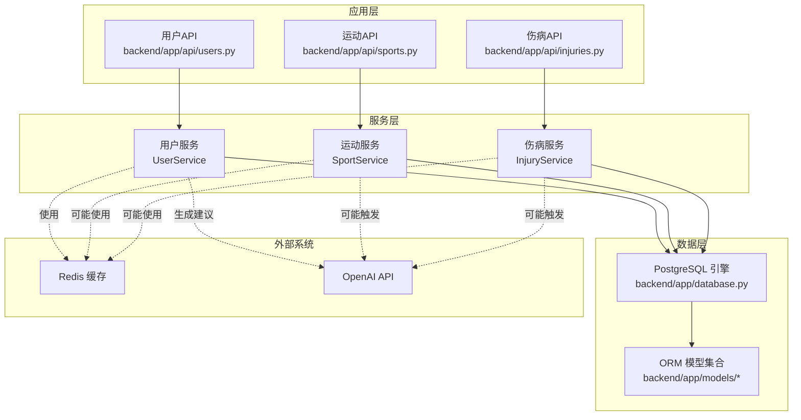
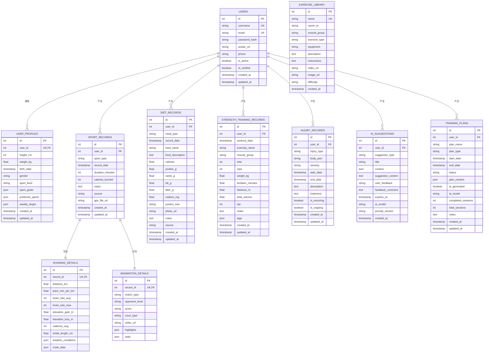
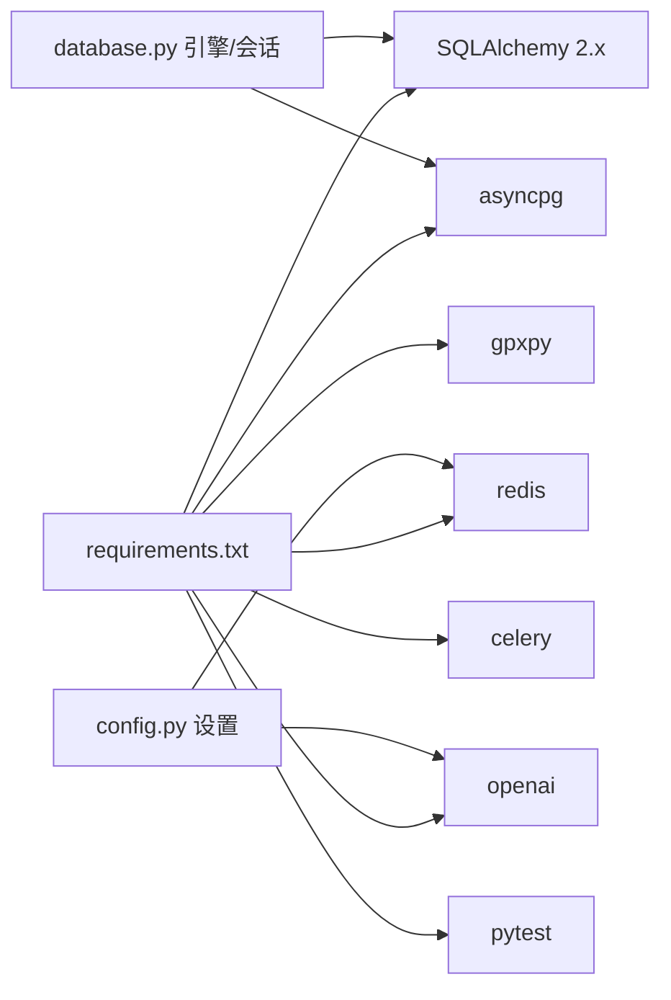

# 数据库设计

<cite>
**本文引用的文件**
- [backend/app/models/__init__.py](file://backend/app/models/__init__.py)
- [backend/app/models/user.py](file://backend/app/models/user.py)
- [backend/app/models/sport.py](file://backend/app/models/sport.py)
- [backend/app/models/injury.py](file://backend/app/models/injury.py)
- [backend/app/models/diet.py](file://backend/app/models/diet.py)
- [backend/app/models/strength.py](file://backend/app/models/strength.py)
- [backend/app/models/ai.py](file://backend/app/models/ai.py)
- [backend/app/database.py](file://backend/app/database.py)
- [backend/app/config.py](file://backend/app/config.py)
- [backend/requirements.txt](file://backend/requirements.txt)
- [backend/app/api/users.py](file://backend/app/api/users.py)
- [backend/app/api/sports.py](file://backend/app/api/sports.py)
- [backend/app/api/injuries.py](file://backend/app/api/injuries.py)
</cite>

## 目录
1. [简介](#简介)
2. [项目结构](#项目结构)
3. [核心组件](#核心组件)
4. [架构总览](#架构总览)
5. [详细组件分析](#详细组件分析)
6. [依赖分析](#依赖分析)
7. [性能考虑](#性能考虑)
8. [故障排查指南](#故障排查指南)
9. [结论](#结论)
10. [附录](#附录)

## 简介
本文件为 ActiveSynapse 数据库的全面数据模型文档，覆盖实体关系、字段定义与数据类型、主键/外键、索引与约束、数据验证与业务规则、数据库模式图、示例数据、数据访问模式与缓存策略、性能考量、数据生命周期与归档策略、迁移路径与版本管理、以及数据安全与访问控制等。重点围绕用户模型、运动记录模型、伤病记录模型、AI 建议模型、饮食记录模型和力量训练模型进行设计原理与关系映射说明。

## 项目结构
后端采用 SQLAlchemy ORM（异步）与 FastAPI 架构，数据库通过 asyncpg 连接 PostgreSQL；Redis 用于缓存；OpenAI 用于生成 AI 建议；Alembic 支持迁移（仓库中未提供具体迁移脚本，但已声明依赖）。模型集中于 backend/app/models，数据库会话工厂在 backend/app/database.py 中初始化，全局配置在 backend/app/config.py 中定义。

**图表来源**
- [backend/app/database.py:1-43](file://backend/app/database.py#L1-L43)
- [backend/app/models/__init__.py:1-20](file://backend/app/models/__init__.py#L1-L20)
- [backend/app/api/users.py:1-88](file://backend/app/api/users.py#L1-L88)
- [backend/app/api/sports.py:1-127](file://backend/app/api/sports.py#L1-L127)
- [backend/app/api/injuries.py:1-92](file://backend/app/api/injuries.py#L1-L92)
- [backend/requirements.txt:6-10](file://backend/requirements.txt#L6-L10)

**章节来源**
- [backend/app/database.py:1-43](file://backend/app/database.py#L1-L43)
- [backend/app/config.py:1-46](file://backend/app/config.py#L1-L46)
- [backend/requirements.txt:1-40](file://backend/requirements.txt#L1-L40)

## 核心组件
- 用户与档案：用户表存储认证与基本信息，用户档案表存储身体指标、运动偏好与目标等。
- 运动记录：通用运动记录表，支持跑步与羽毛球两类细分详情表。
- 伤病记录：记录伤病类型、部位、严重程度、时间线与治疗描述等。
- 营养记录：按餐次记录食物名称、营养成分与照片等。
- 力量训练：记录训练动作、肌肉群、组数/次数/重量/持续时间等。
- AI 建议与训练计划：建议内容、类型、过期时间与反馈；训练计划结构化 JSON 内容与状态进度。

**章节来源**
- [backend/app/models/user.py:1-62](file://backend/app/models/user.py#L1-L62)
- [backend/app/models/sport.py:1-115](file://backend/app/models/sport.py#L1-L115)
- [backend/app/models/injury.py:1-70](file://backend/app/models/injury.py#L1-L70)
- [backend/app/models/diet.py:1-57](file://backend/app/models/diet.py#L1-L57)
- [backend/app/models/strength.py:1-89](file://backend/app/models/strength.py#L1-L89)
- [backend/app/models/ai.py:1-123](file://backend/app/models/ai.py#L1-L123)

## 架构总览
下图展示数据库层的实体关系与外键约束，体现用户与其各类记录之间的"一对多"或"一对一"关系。

**图表来源**
- [backend/app/models/user.py:7-61](file://backend/app/models/user.py#L7-L61)
- [backend/app/models/sport.py:23-114](file://backend/app/models/sport.py#L23-L114)
- [backend/app/models/injury.py:39-69](file://backend/app/models/injury.py#L39-L69)
- [backend/app/models/diet.py:15-56](file://backend/app/models/diet.py#L15-L56)
- [backend/app/models/strength.py:18-88](file://backend/app/models/strength.py#L18-L88)
- [backend/app/models/ai.py:30-122](file://backend/app/models/ai.py#L30-L122)

## 详细组件分析

### 用户模型与档案模型
- 实体
  - 用户表：主键 id，唯一用户名与邮箱，密码哈希、头像、电话、激活/验证标志，时间戳。
  - 用户档案表：一对一关联用户，存储身高、体重、生日、性别、运动等级、目标列表、偏好运动、周目标等，时间戳。
- 关系
  - 用户与档案：一对一（档案 user_id 外键且唯一）。
  - 用户与其他记录：一对多（运动、饮食、力量、伤病、AI 建议、训练计划）。
- 索引与约束
  - 用户表：id 主键、username/email 唯一、索引。
  - 档案表：id 主键、user_id 外键（级联删除）、唯一约束。
- 数据验证与业务规则
  - 用户名长度范围、邮箱格式、可选电话号码、默认激活与未验证状态。
  - 档案字段均为可选，JSON 字段用于灵活存储列表与字典。
- 示例数据
  - 用户：唯一用户名、邮箱、密码哈希、可选头像与电话。
  - 档案：身高/体重/生日/性别可空，运动等级与偏好数组、周目标字典可空。
- 访问模式
  - 获取当前用户信息与档案；更新用户资料与档案；头像上传接口预留。
- 缓存策略
  - 可对用户资料与档案进行读缓存，写入时失效相关键；敏感信息不缓存明文。
- 性能考虑
  - 对 username/email 建索引；profile 与 user 的连接查询频繁，建议缓存最近一次档案。
- 安全与隐私
  - 密码必须哈希存储；头像 URL 仅存储可访问链接；敏感字段避免重复缓存明文。

**章节来源**
- [backend/app/models/user.py:7-61](file://backend/app/models/user.py#L7-L61)
- [backend/app/api/users.py:1-88](file://backend/app/api/users.py#L1-L88)

### 运动记录模型
- 实体
  - 运动记录：记录运动类型、日期、时长、卡路里、来源（手动/设备）、可选 GPX 文件地址，时间戳。
  - 跑步细节：距离、配速、平均/最大心率、海拔增减、步频、步幅、天气与路线数据。
  - 羽毛球细节：比赛类型、对手等级、比分、场地类型、视频、精彩时刻与统计。
- 关系
  - 运动记录与用户：一对多。
  - 运动记录与两类详情：一对一（详情 record_id 外键且唯一）。
- 索引与约束
  - 运动记录：id 主键、user_id 外键（级联删除）、索引。
  - 详情表：record_id 唯一且外键。
- 数据验证与业务规则
  - 运动类型枚举（运行/羽毛球），来源枚举（手动/设备），时长与卡路里非负整数。
  - 跑步与羽毛球详情字段可空，便于部分数据缺失场景。
- 示例数据
  - 跑步：距离公里、配速、心率、海拔、步频、步幅、天气与路线 JSON。
  - 羽毛球：单双打、对手等级、比分、场地、视频、亮点与统计 JSON。
- 访问模式
  - 列表过滤（类型、日期范围）、创建、更新、删除、统计与周汇总。
- 缓存策略
  - 近期统计与周汇总可缓存；GPX 路线数据大时延迟解析。
- 性能考虑
  - 对 record_date、sport_type 建索引；GPX 路线 JSON 大字段按需加载。
- 安全与隐私
  - GPX 文件 URL 存储为可访问链接；路线坐标等敏感地理信息谨慎处理。

**章节来源**
- [backend/app/models/sport.py:23-114](file://backend/app/models/sport.py#L23-L114)
- [backend/app/api/sports.py:1-127](file://backend/app/api/sports.py#L1-L127)

### 伤病记录模型
- 实体
  - 伤病记录：类型（拉伤/扭伤/炎症/骨折/脱臼/肌腱炎/其他）、部位（膝/踝/肩/腕/肘/背/髋/腘绳肌/股四头肌/腓肠肌/跟腱/其他）、严重程度（轻/中/重）、起止时间、描述、治疗、复发与持续标记，时间戳。
- 关系
  - 与用户：一对多。
- 索引与约束
  - id 主键、user_id 外键（级联删除）。
- 数据验证与业务规则
  - 类型/部位/严重程度枚举化；结束时间可空表示持续中；复发与持续布尔标记。
- 示例数据
  - 单次伤病：类型、部位、严重程度、起止时间、描述、治疗、是否复发/持续。
- 访问模式
  - 列表（可筛选"仅持续中"）、创建、更新、删除、统计摘要。
- 缓存策略
  - 最近伤病摘要与统计可缓存；按用户维度失效。
- 性能考虑
  - 对 start_date/end_date 建索引；按时间范围查询频繁。
- 安全与隐私
  - 伤病描述与治疗为敏感健康信息，严格访问控制与最小暴露。

**章节来源**
- [backend/app/models/injury.py:39-69](file://backend/app/models/injury.py#L39-L69)
- [backend/app/api/injuries.py:1-92](file://backend/app/api/injuries.py#L1-L92)

### 营养记录模型
- 实体
  - 营养记录：餐次类型（早餐/午餐/晚餐/加餐）、记录日期、食物名称与描述、营养成分（热量、蛋白质、碳水、脂肪、膳食纤维、钠）、分量、照片、备注、来源（手动/AI 估算），时间戳。
- 关系
  - 与用户：一对多。
- 索引与约束
  - id 主键、user_id 外键（级联删除）。
- 数据验证与业务规则
  - 餐次类型枚举；营养成分与分量可空；照片 URL 可空。
- 示例数据
  - 一日三餐或加餐：食物名称、营养成分、分量、照片、备注。
- 访问模式
  - 列表、创建、更新、删除；可用于统计宏量营养素。
- 缓存策略
  - 近期日摄入摘要可缓存；图片 URL 不缓存。
- 性能考虑
  - 对 record_date、meal_type 建索引；大文本字段按需加载。
- 安全与隐私
  - 食物照片可能包含个人隐私，注意存储与访问控制。

**章节来源**
- [backend/app/models/diet.py:15-56](file://backend/app/models/diet.py#L15-L56)

### 力量训练模型
- 实体
  - 力量训练记录：训练日期、动作名称、肌肉群、组数、次数、重量、持续时间/距离、总训练量、RPE、标签、时间戳。
  - 预定义动作库：动作名称（唯一）、中文名、肌肉群、动作类型、器械、描述、说明、媒体、难度。
- 关系
  - 与用户：一对多；动作库独立存在。
- 索引与约束
  - id 主键、user_id 外键（级联删除）；动作库 name 唯一。
- 数据验证与业务规则
  - 肌肉群枚举；可空字段支持自重/计时/徒手动作；总训练量可计算。
- 示例数据
  - 单个动作：组数/次数/重量/持续时间/距离/RPE/标签。
- 访问模式
  - 列表、创建、更新、删除；可用于训练量趋势分析。
- 缓存策略
  - 常用动作库可缓存；用户近期训练摘要缓存。
- 性能考虑
  - 对 workout_date、muscle_group 建索引；大 JSON 标签按需解析。
- 安全与隐私
  - 训练强度与部位涉及健康信息，谨慎处理。

**章节来源**
- [backend/app/models/strength.py:18-88](file://backend/app/models/strength.py#L18-L88)

### AI 建议与训练计划模型
- 实体
  - AI 建议：建议类型（训练/饮食/恢复/伤病预防/通用）、标题、上下文 JSON、建议内容、用户反馈、过期时间、AI 模型与提示词版本，时间戳。
  - 训练计划：计划名称、类型（跑/力/羽/综合）、起止时间、状态、结构化计划 JSON、是否 AI 生成、AI 模型、完成/总计会话数、备注，时间戳。
- 关系
  - 与用户：一对多。
- 索引与约束
  - id 主键、user_id 外键（级联删除）。
- 数据验证与业务规则
  - 建议类型/计划类型/状态枚举；建议内容必填；过期时间可空；计划 JSON 结构化存储。
- 示例数据
  - 建议：类型、标题、上下文、内容、反馈、过期时间。
  - 计划：名称、类型、起止时间、状态、计划 JSON、进度、备注。
- 访问模式
  - 列表、创建、更新、删除；计划进度更新。
- 缓存策略
  - 有效期内的建议与活跃计划可缓存；到期后失效。
- 性能考虑
  - 对 expires_at、status 建索引；计划 JSON 大字段按需加载。
- 安全与隐私
  - 建议内容与计划 JSON 可能包含个人健康数据，严格访问控制与加密传输。

**章节来源**
- [backend/app/models/ai.py:30-122](file://backend/app/models/ai.py#L30-L122)

## 依赖分析
- 数据库驱动
  - 异步引擎与会话工厂：SQLAlchemy 2.x + asyncpg。
  - 同步引擎：用于 Alembic 迁移。
- 缓存
  - Redis：用于会话与热点数据缓存。
- AI 与文件
  - OpenAI：生成建议；gpxpy：解析 GPX。
- 测试与工具
  - pytest、httpx、Celery（任务队列）。

**图表来源**
- [backend/requirements.txt:6-31](file://backend/requirements.txt#L6-L31)
- [backend/app/database.py:1-43](file://backend/app/database.py#L1-L43)
- [backend/app/config.py:15-27](file://backend/app/config.py#L15-L27)

**章节来源**
- [backend/requirements.txt:1-40](file://backend/requirements.txt#L1-L40)
- [backend/app/database.py:1-43](file://backend/app/database.py#L1-L43)
- [backend/app/config.py:1-46](file://backend/app/config.py#L1-L46)

## 性能考虑
- 索引策略
  - 用户：username/email 唯一索引；profile user_id 唯一索引。
  - 运动：sport_type、record_date；GPX 路线 JSON 按需解析。
  - 伤病：start_date、end_date；类型/部位/严重程度枚举字段可建选择性索引。
  - 营养：meal_type、record_date。
  - 力量：workout_date、muscle_group。
  - AI：expires_at、status。
- 查询优化
  - 分页查询（skip/limit）限制在合理范围；按日期与类型过滤。
  - 大字段（route_data、plan_content、context、stats 等）延迟加载。
- 缓存
  - 用户资料与档案、近期统计、周汇总、常用动作库、有效期内建议与活跃计划。
- 连接池与并发
  - 异步引擎 + 会话工厂；避免在请求中创建过多连接；及时关闭会话。
- IO 与外部集成
  - GPX 解析与图片上传走后台任务；AI 生成建议异步化。

## 故障排查指南
- 数据库连接失败
  - 检查 DATABASE_URL 与数据库可达性；确认 asyncpg 与 PostgreSQL 版本兼容。
- 会话异常
  - 确认 get_db 依赖正确注入；异常时自动回滚并抛出；避免在 finally 中重复 close。
- 权限与约束错误
  - 唯一约束冲突（用户名/邮箱/动作名）；外键约束（详情 record_id 唯一）；枚举值不在允许集合。
- 缓存问题
  - Redis 连接失败或不可用；键空间清理策略；缓存穿透与雪崩防护。
- AI 与文件
  - OpenAI API Key 配置；GPX 文件解析失败；上传文件大小超限。

**章节来源**
- [backend/app/database.py:26-37](file://backend/app/database.py#L26-L37)
- [backend/app/config.py:11-31](file://backend/app/config.py#L11-L31)

## 结论
本数据模型以用户为中心，围绕运动、营养、力量、伤病与 AI 建议构建完整闭环。通过枚举化字段、JSON 扩展与外键约束确保一致性与扩展性；结合异步数据库、Redis 缓存与异步任务，满足高并发与高性能需求。建议后续完善 Alembic 迁移脚本、细化索引与分区策略，并加强数据安全与隐私保护。

## 附录

### 数据访问模式与缓存策略
- 用户与档案
  - 读：缓存用户资料与档案；写：失效相关键。
- 运动记录
  - 列表：按日期与类型过滤；详情：按需加载路线数据。
- 伤病记录
  - 统计：按时间窗口聚合；摘要：缓存最近伤病。
- 营养与力量
  - 日汇总：缓存当日宏量；动作库：缓存常用条目。
- AI 建议与计划
  - 有效期：过期后自动失效；状态：按活跃计划缓存。

### 数据生命周期、保留策略与归档规则
- 建议规范
  - 建议过期时间 expires_at；超过过期时间自动归档或删除。
- 训练计划
  - 状态变更（完成/暂停/取消）后定期归档历史计划。
- 运动与营养
  - 按用户设置的保留期限（如 2 年）归档；保留期内支持快速检索。
- 伤病
  - 历史伤病记录归档；持续中记录保持活跃状态。
- 归档实现
  - 新建归档表或软删除标记；迁移脚本统一处理。

### 数据迁移路径与版本管理
- 当前状态
  - 已声明 Alembic 依赖；未提供具体迁移脚本。
- 建议流程
  - 使用 Alembic 初始化迁移目录；基于现有模型生成初始迁移；后续每次结构变更提交迁移脚本；生产环境执行升级。
- 版本管理
  - 迁移脚本命名带时间戳；版本号与应用版本对应；回滚策略与备份同步。

### 数据安全、隐私要求与访问控制
- 认证与授权
  - JWT 令牌管理；仅当前用户可见其数据；管理员角色用于审计与维护。
- 数据最小化
  - 仅存储必要字段；敏感字段（如伤病描述、路线坐标）最小暴露。
- 加密与传输
  - 传输层 TLS；静态数据加密（如需要）；头像与媒体文件使用安全链接。
- 访问控制
  - 基于角色的权限控制（RBAC）；审计日志记录敏感操作。