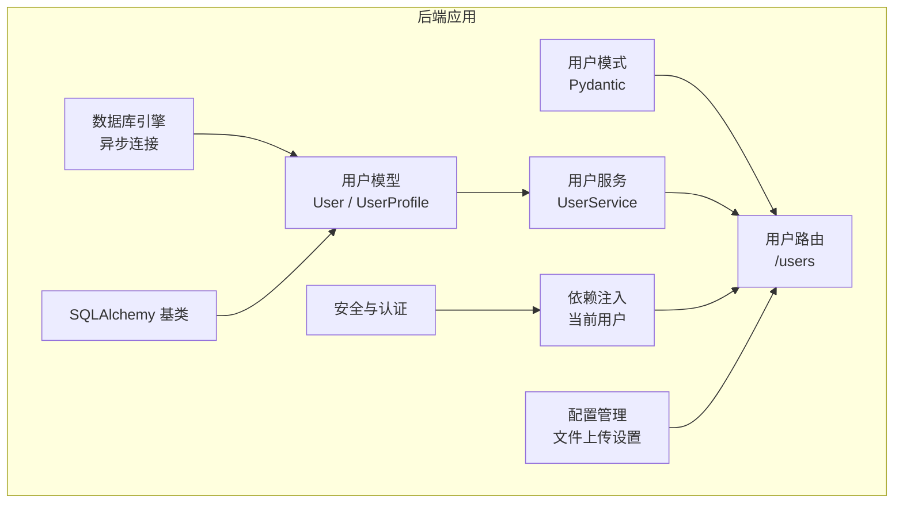
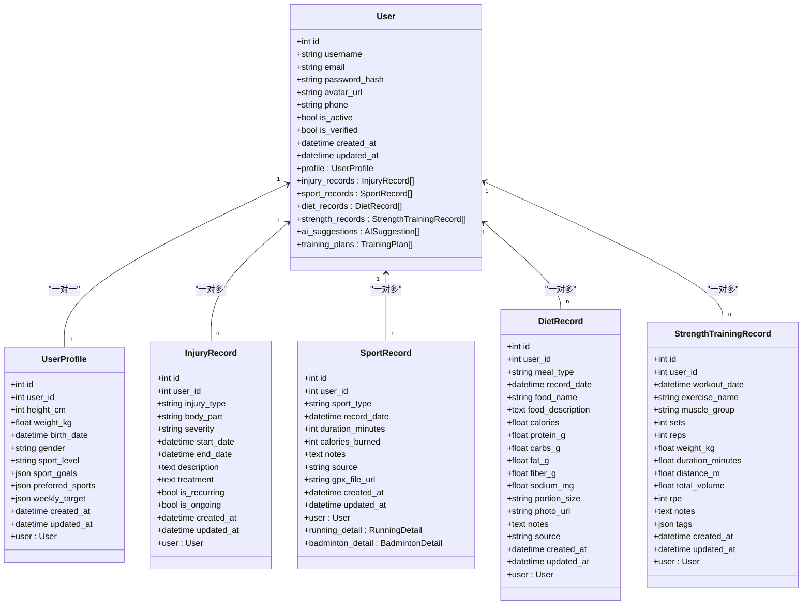
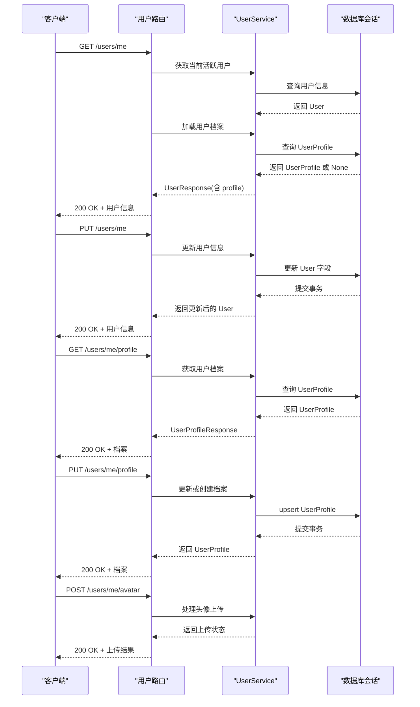
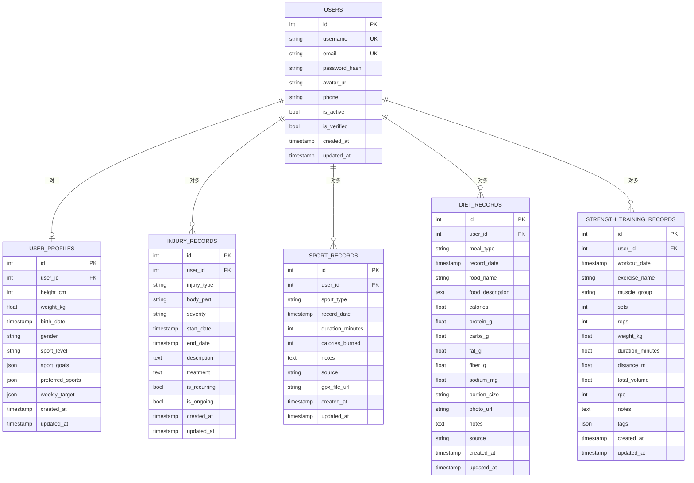

# 用户模型

<cite>
**本文引用的文件**
- [backend/app/models/user.py](file://backend/app/models/user.py)
- [backend/app/schemas/user.py](file://backend/app/schemas/user.py)
- [backend/app/services/user_service.py](file://backend/app/services/user_service.py)
- [backend/app/api/users.py](file://backend/app/api/users.py)
- [backend/app/database.py](file://backend/app/database.py)
- [backend/app/config.py](file://backend/app/config.py)
- [backend/app/models/injury.py](file://backend/app/models/injury.py)
- [backend/app/models/sport.py](file://backend/app/models/sport.py)
- [backend/app/models/diet.py](file://backend/app/models/diet.py)
- [backend/app/models/strength.py](file://backend/app/models/strength.py)
- [backend/app/core/security.py](file://backend/app/core/security.py)
- [backend/app/core/dependencies.py](file://backend/app/core/dependencies.py)
</cite>

## 更新摘要
**变更内容**
- 新增头像上传功能支持
- 更新用户更新模式包含头像字段
- 新增文件上传配置参数
- 完善用户信息管理的完整工作流

## 目录
1. [简介](#简介)
2. [项目结构](#项目结构)
3. [核心组件](#核心组件)
4. [架构总览](#架构总览)
5. [详细组件分析](#详细组件分析)
6. [依赖关系分析](#依赖关系分析)
7. [性能考量](#性能考量)
8. [故障排查指南](#故障排查指南)
9. [结论](#结论)
10. [附录](#附录)

## 简介
本文件系统化梳理 ActiveSynapse 的用户模型数据结构与实现，聚焦以下目标：
- 明确 User 与 UserProfile 实体的设计原则、字段定义与数据类型
- 记录用户基本信息字段（username、email、password_hash、phone）、账户状态字段（is_active、is_verified）与时间戳字段（created_at、updated_at）
- 解释 UserProfile 的身体信息字段（height_cm、weight_kg、birth_date、gender）、运动相关信息（sport_level、sport_goals）与用户偏好设置（preferred_sports、weekly_target）
- 说明主键/外键关系、索引设计与约束规则
- 描述用户关系映射（profile、injury_records、sport_records等）的设计原理
- 提供头像上传功能与文件存储配置
- 提供实际的数据库示例数据与查询模式

## 项目结构
用户模型位于后端应用的 ORM 层，采用 SQLAlchemy 声明式基类建模，并通过 Pydantic 定义 API 层输入输出结构。用户相关接口由 FastAPI 路由暴露，服务层封装业务逻辑，安全与认证通过独立模块处理。

**图表来源**
- [backend/app/database.py:1-43](file://backend/app/database.py#L1-L43)
- [backend/app/models/user.py:1-62](file://backend/app/models/user.py#L1-L62)
- [backend/app/schemas/user.py:1-69](file://backend/app/schemas/user.py#L1-L69)
- [backend/app/services/user_service.py:1-120](file://backend/app/services/user_service.py#L1-L120)
- [backend/app/api/users.py:1-88](file://backend/app/api/users.py#L1-L88)
- [backend/app/core/security.py:1-50](file://backend/app/core/security.py#L1-L50)
- [backend/app/core/dependencies.py:1-61](file://backend/app/core/dependencies.py#L1-L61)
- [backend/app/config.py:28-31](file://backend/app/config.py#L28-L31)

**章节来源**
- [backend/app/database.py:1-43](file://backend/app/database.py#L1-L43)
- [backend/app/models/__init__.py:1-20](file://backend/app/models/__init__.py#L1-L20)

## 核心组件
本节对 User 与 UserProfile 的字段、约束与关系进行逐项说明，并给出字段类型与取值范围的依据来源。

- User 表（users）
  - 主键：id（整型，自增，唯一标识）
  - 唯一索引：username、email
  - 字段
    - username：字符串，长度上限 50，唯一且必填
    - email：字符串，长度上限 100，唯一且必填
    - password_hash：字符串，长度上限 255，必填
    - avatar_url：字符串，长度上限 500，可空（支持头像上传）
    - phone：字符串，长度上限 20，可空
    - is_active：布尔，默认 True
    - is_verified：布尔，默认 False
    - created_at：时间戳，默认为 UTC 当前时间
    - updated_at：时间戳，默认为 UTC 当前时间，更新时自动刷新
  - 关系
    - profile：一对一，指向 UserProfile，级联删除孤儿
    - injury_records：一对多，指向 InjuryRecord，级联删除孤儿
    - sport_records：一对多，指向 SportRecord，级联删除孤儿
    - diet_records：一对多，指向 DietRecord，级联删除孤儿
    - strength_records：一对多，指向 StrengthTrainingRecord，级联删除孤儿
    - ai_suggestions：一对多，指向 AISuggestion，级联删除孤儿
    - training_plans：一对多，指向 TrainingPlan，级联删除孤儿

- UserProfile 表（user_profiles）
  - 主键：id（整型，自增）
  - 外键：user_id → users.id（级联删除）
  - 字段
    - height_cm：整型，厘米，可空
    - weight_kg：浮点型，千克，可空
    - birth_date：日期时间，可空
    - gender：字符串，长度上限 10，取值建议 male/female/other，可空
    - sport_level：字符串，长度上限 20，取值建议 beginner/intermediate/advanced，可空
    - sport_goals：JSON 数组，字符串集合，例如 ["weight_loss","muscle_gain","performance"]，默认空数组
    - preferred_sports：JSON 数组，字符串集合，例如 ["running","badminton","strength"]，默认空数组
    - weekly_target：JSON 对象，键为字符串，值为任意类型，例如 {"running_km":20,"strength_sessions":3}，默认空对象
    - created_at：时间戳，默认为 UTC 当前时间
    - updated_at：时间戳，默认为 UTC 当前时间，更新时自动刷新
  - 关系
    - user：反向关系，指向 User.profile

**章节来源**
- [backend/app/models/user.py:7-62](file://backend/app/models/user.py#L7-L62)
- [backend/app/schemas/user.py:6-69](file://backend/app/schemas/user.py#L6-L69)

## 架构总览
用户模型在系统中的位置与交互如下：

**图表来源**
- [backend/app/models/user.py:7-62](file://backend/app/models/user.py#L7-L62)
- [backend/app/models/injury.py:39-69](file://backend/app/models/injury.py#L39-L69)
- [backend/app/models/sport.py:23-49](file://backend/app/models/sport.py#L23-L49)
- [backend/app/models/diet.py:15-57](file://backend/app/models/diet.py#L15-L57)
- [backend/app/models/strength.py:18-57](file://backend/app/models/strength.py#L18-L57)

## 详细组件分析

### User 实体
- 设计要点
  - 使用整型自增主键，确保高并发下的唯一性与索引效率
  - username 与 email 均建立唯一索引，配合服务层重复性校验，保证全局唯一
  - 密码以哈希形式存储，不保存明文
  - 时间戳统一使用 UTC，便于跨时区一致性
  - 关系映射覆盖用户画像、运动、营养、损伤与训练计划等子域
  - 新增 avatar_url 字段支持头像上传功能
- 字段与约束
  - username：长度限制与唯一性约束
  - email：长度限制与唯一性约束
  - password_hash：非空
  - avatar_url：支持头像文件 URL 存储，长度限制 500 字符
  - phone：长度限制 20 字符
  - is_active/is_verified：布尔标志位，用于账户启用与邮箱验证状态
  - created_at/updated_at：默认值与更新触发器
- 关系映射
  - profile：一对一，级联删除孤儿，确保用户档案的生命周期与用户一致
  - 其余关系：一对多，均配置级联删除孤儿，避免孤立数据

**章节来源**
- [backend/app/models/user.py:7-32](file://backend/app/models/user.py#L7-L32)
- [backend/app/services/user_service.py:29-59](file://backend/app/services/user_service.py#L29-L59)

### UserProfile 实体
- 设计要点
  - 与 User 为一对一关系，通过外键 user_id 引用并设置级联删除
  - 身体信息字段（身高、体重、生日、性别）支持可空，适配不同用户的完善程度
  - 运动相关信息（运动水平、运动目标）与偏好设置（偏好的运动、周目标）采用 JSON 存储，便于灵活扩展
- 字段与约束
  - height_cm/weight_kg/birth_date/gender：可空，满足渐进式完善资料
  - sport_level：字符串枚举风格的取值建议，便于前端选择与后端校验
  - sport_goals/preferred_sports：JSON 数组，建议使用预定义枚举值集合
  - weekly_target：JSON 对象，键为字符串，值为数值或复合结构，建议约定键名规范
  - created_at/updated_at：默认值与更新触发器
- 关系映射
  - user：反向关系，指向 User.profile

**章节来源**
- [backend/app/models/user.py:34-62](file://backend/app/models/user.py#L34-L62)
- [backend/app/schemas/user.py:6-34](file://backend/app/schemas/user.py#L6-L34)

### API 工作流（获取与更新用户信息）
用户信息的读取与更新通过 API 路由完成，流程如下：

**图表来源**
- [backend/app/api/users.py:13-88](file://backend/app/api/users.py#L13-L88)
- [backend/app/services/user_service.py:97-120](file://backend/app/services/user_service.py#L97-L120)

**章节来源**
- [backend/app/api/users.py:1-88](file://backend/app/api/users.py#L1-L88)
- [backend/app/services/user_service.py:1-120](file://backend/app/services/user_service.py#L1-L120)

### 头像上传功能
系统支持用户头像上传功能，包含以下特性：

- **API 端点**：POST /users/me/avatar
- **文件处理**：支持 UploadFile 参数，可扩展为实际文件存储
- **配置支持**：通过配置文件设置上传目录和最大文件大小
- **占位符实现**：当前版本为占位符，预留实际存储实现空间

**章节来源**
- [backend/app/api/users.py:74-88](file://backend/app/api/users.py#L74-L88)
- [backend/app/config.py:28-31](file://backend/app/config.py#L28-L31)

### 数据库初始化与连接
- 异步引擎与会话工厂
  - 使用异步 SQLAlchemy 引擎与会话工厂，支持高并发 I/O
  - 初始化时通过 metadata.create_all 创建所有表
- 配置来源
  - 数据库 URL、调试开关、Redis、JWT、文件上传等配置集中管理

**章节来源**
- [backend/app/database.py:1-43](file://backend/app/database.py#L1-L43)
- [backend/app/config.py:1-46](file://backend/app/config.py#L1-L46)

### 安全与认证
- 密码处理
  - 使用 bcrypt 上下文进行密码哈希与校验
- JWT 令牌
  - 支持访问令牌与刷新令牌，配置过期时间
  - 依赖注入从请求头中提取并解析 JWT，校验有效性与类型
- 当前用户依赖
  - 从令牌解析出用户 ID，查询用户并检查是否激活

**章节来源**
- [backend/app/core/security.py:1-50](file://backend/app/core/security.py#L1-L50)
- [backend/app/core/dependencies.py:1-61](file://backend/app/core/dependencies.py#L1-L61)

## 依赖关系分析
用户模型与其他领域模型存在外键关联，形成清晰的一对一与一对多关系图：

**图表来源**
- [backend/app/models/user.py:7-62](file://backend/app/models/user.py#L7-L62)
- [backend/app/models/injury.py:39-69](file://backend/app/models/injury.py#L39-L69)
- [backend/app/models/sport.py:23-49](file://backend/app/models/sport.py#L23-L49)
- [backend/app/models/diet.py:15-57](file://backend/app/models/diet.py#L15-L57)
- [backend/app/models/strength.py:18-57](file://backend/app/models/strength.py#L18-L57)

**章节来源**
- [backend/app/models/__init__.py:1-20](file://backend/app/models/__init__.py#L1-L20)

## 性能考量
- 索引策略
  - users 表的 username 与 email 均建立唯一索引，加速登录与注册场景的查找
  - 所有表的主键列默认具备索引，确保外键关联高效
- 时间戳更新
  - 使用数据库触发器或 ORM onupdate 机制自动更新 updated_at，减少应用层冗余逻辑
- 异步 I/O
  - 使用异步 SQLAlchemy 引擎与会话，适合高并发写入与读取场景
- JSON 字段
  - sport_goals、preferred_sports、weekly_target 采用 JSON 存储，便于灵活扩展；若未来查询频繁，可考虑拆分或添加派生列
- 文件上传
  - 头像上传支持异步处理，配置最大文件大小限制（默认 100MB）

## 故障排查指南
- 用户名/邮箱冲突
  - 注册时若用户名或邮箱已存在，服务层抛出冲突错误；请检查唯一性约束与输入合法性
- 密码校验失败
  - 登录时若密码不匹配，返回空结果；确认密码哈希算法与存储格式一致
- 令牌无效或用户不存在
  - 依赖注入解析令牌失败或用户不存在时，返回未授权/禁止访问；检查令牌签名、过期时间与用户状态
- 档案缺失
  - 首次注册后会自动创建空档案；若查询为空，请确认是否已调用更新档案接口
- 头像上传问题
  - 文件大小超过配置限制会触发上传失败；检查 MAX_FILE_SIZE 配置
  - 文件类型不被允许时，需要在实际实现中添加类型验证

**章节来源**
- [backend/app/services/user_service.py:29-59](file://backend/app/services/user_service.py#L29-L59)
- [backend/app/services/user_service.py:61-68](file://backend/app/services/user_service.py#L61-L68)
- [backend/app/core/dependencies.py:11-61](file://backend/app/core/dependencies.py#L11-L61)
- [backend/app/config.py:28-31](file://backend/app/config.py#L28-L31)

## 结论
用户模型围绕 User 与 UserProfile 两大实体展开，采用一对一强关联与多对多弱关联相结合的方式，既保证了用户档案的完整性，又为运动、营养、损伤等子域提供了扩展空间。通过异步数据库、Pydantic 模式与 JWT 认证，系统在安全性、可维护性与性能之间取得平衡。新增的头像上传功能进一步完善了用户信息管理，配合灵活的文件上传配置，为未来的实际存储实现奠定了基础。建议后续根据查询热点对 JSON 字段进行规范化或物化，进一步优化检索效率。

## 附录

### 示例数据
- 用户表（users）
  - id: 1
  - username: "alice"
  - email: "alice@example.com"
  - password_hash: "$2b...hash"
  - avatar_url: "https://example.com/uploads/avatar_1.jpg"
  - phone: "+86 138 0000 0000"
  - is_active: true
  - is_verified: false
  - created_at: 2025-01-01 10:00:00+00:00
  - updated_at: 2025-01-01 10:00:00+00:00
- 用户档案（user_profiles）
  - id: 1
  - user_id: 1
  - height_cm: 165
  - weight_kg: 55.5
  - birth_date: 1995-05-15 00:00:00+00:00
  - gender: "female"
  - sport_level: "intermediate"
  - sport_goals: ["weight_loss","performance"]
  - preferred_sports: ["running","badminton"]
  - weekly_target: {"running_km":20,"strength_sessions":3}
  - created_at: 2025-01-01 10:00:00+00:00
  - updated_at: 2025-01-01 10:00:00+00:00

### 常见查询模式
- 获取当前用户及其档案
  - 步骤：鉴权 → 查询 User → 查询 UserProfile → 组装响应
  - 参考路径：[backend/app/api/users.py:13-36](file://backend/app/api/users.py#L13-L36)、[backend/app/services/user_service.py:97-102](file://backend/app/services/user_service.py#L97-L102)
- 更新用户基本信息
  - 步骤：鉴权 → 校验唯一性（如更新邮箱/用户名）→ 写入 User → 提交事务
  - 参考路径：[backend/app/api/users.py:39-48](file://backend/app/api/users.py#L39-L48)、[backend/app/services/user_service.py:70-95](file://backend/app/services/user_service.py#L70-L95)
- 更新或创建用户档案
  - 步骤：鉴权 → 查询 UserProfile（不存在则创建）→ 写入档案 → 提交事务
  - 参考路径：[backend/app/api/users.py:62-71](file://backend/app/api/users.py#L62-L71)、[backend/app/services/user_service.py:104-119](file://backend/app/services/user_service.py#L104-L119)
- 头像上传处理
  - 步骤：鉴权 → 验证文件大小 → 处理上传 → 返回结果
  - 参考路径：[backend/app/api/users.py:74-88](file://backend/app/api/users.py#L74-L88)、[backend/app/config.py:28-31](file://backend/app/config.py#L28-L31)

### 配置参数说明
- 文件上传配置
  - UPLOAD_DIR：上传目录路径，默认 "uploads"
  - MAX_FILE_SIZE：最大文件大小，单位字节，默认 100MB
- 安全配置
  - SECRET_KEY：JWT 密钥
  - ACCESS_TOKEN_EXPIRE_MINUTES：访问令牌过期时间（分钟）
  - REFRESH_TOKEN_EXPIRE_DAYS：刷新令牌过期时间（天）