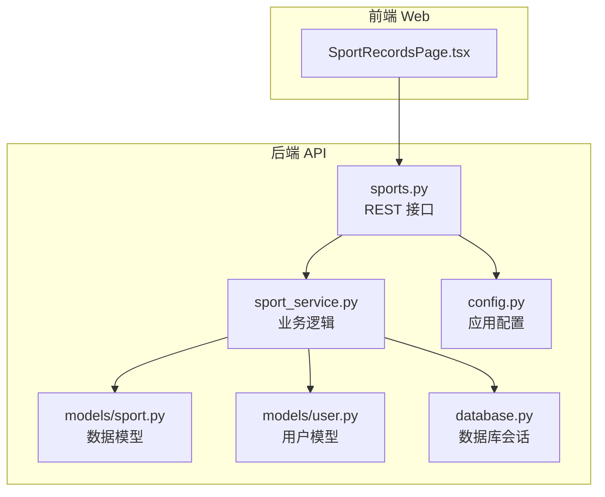
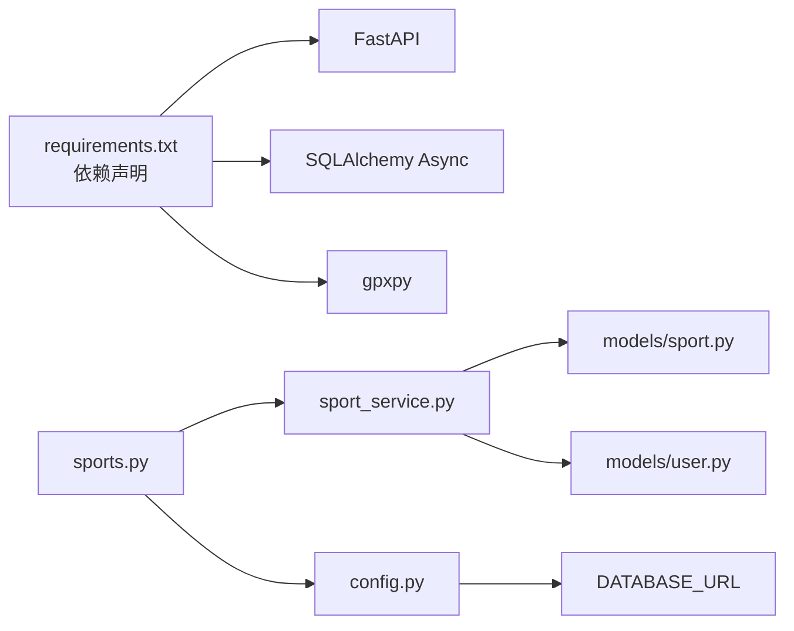

# 运动记录模型

<cite>
**本文档引用的文件**
- [backend/app/models/sport.py](file://backend/app/models/sport.py)
- [backend/app/schemas/sport.py](file://backend/app/schemas/sport.py)
- [backend/app/api/sports.py](file://backend/app/api/sports.py)
- [backend/app/services/sport_service.py](file://backend/app/services/sport_service.py)
- [backend/app/models/user.py](file://backend/app/models/user.py)
- [backend/app/database.py](file://backend/app/database.py)
- [backend/app/config.py](file://backend/app/config.py)
- [backend/requirements.txt](file://backend/requirements.txt)
- [web/src/pages/SportRecordsPage.tsx](file://web/src/pages/SportRecordsPage.tsx)
</cite>

## 更新摘要
**变更内容**
- 更新运动类型枚举定义，修正 BADMINTON 枚举值
- 新增 SportStatistics 统计模型，支持详细的运动数据分析
- 增强统计接口功能，提供运行和羽毛球的专门统计计算
- 完善 GPX 文件导入占位实现说明
- 更新数据验证规则和字段约束

## 目录
1. [简介](#简介)
2. [项目结构](#项目结构)
3. [核心组件](#核心组件)
4. [架构总览](#架构总览)
5. [详细组件分析](#详细组件分析)
6. [依赖关系分析](#依赖关系分析)
7. [性能考虑](#性能考虑)
8. [故障排除指南](#故障排除指南)
9. [结论](#结论)
10. [附录](#附录)

## 简介
本文件为 ActiveSynapse 运动记录模型的全面数据模型文档。重点阐述运动记录实体的设计原理、字段定义与数据类型；记录运动类型枚举、运动参数字段（距离、时间、配速、海拔变化等）、GPS 轨迹数据存储；解释运动记录与用户的关联关系、运动类型的分类体系与数据验证规则；详述 GPX 文件解析后的数据存储格式、运动轨迹的坐标点存储与运动统计计算字段；并涵盖运动记录的生命周期管理、数据更新机制与性能优化策略，最后提供运动数据分析的查询示例与统计报表设计。

## 项目结构
后端采用 FastAPI + SQLAlchemy Async + PostgreSQL 架构，运动记录模型位于 models 层，配合 schemas 层进行请求/响应校验，服务层封装业务逻辑，API 层暴露 REST 接口。前端 Web 应用通过 Ant Design 表单与表格展示运动记录，并调用后端接口完成增删改查与统计分析。



**图表来源**
- [backend/app/api/sports.py:1-127](file://backend/app/api/sports.py#L1-L127)
- [backend/app/services/sport_service.py:1-238](file://backend/app/services/sport_service.py#L1-L238)
- [backend/app/models/sport.py:1-115](file://backend/app/models/sport.py#L1-L115)
- [backend/app/models/user.py:1-62](file://backend/app/models/user.py#L1-L62)
- [backend/app/database.py:1-43](file://backend/app/database.py#L1-L43)
- [backend/app/config.py:1-46](file://backend/app/config.py#L1-L46)

**章节来源**
- [backend/app/api/sports.py:1-127](file://backend/app/api/sports.py#L1-L127)
- [backend/app/services/sport_service.py:1-238](file://backend/app/services/sport_service.py#L1-L238)
- [backend/app/models/sport.py:1-115](file://backend/app/models/sport.py#L1-L115)
- [backend/app/models/user.py:1-62](file://backend/app/models/user.py#L1-L62)
- [backend/app/database.py:1-43](file://backend/app/database.py#L1-L43)
- [backend/app/config.py:1-46](file://backend/app/config.py#L1-L46)

## 核心组件
- 运动记录主表：包含基础信息、来源标记与时间戳，以及与用户和两类运动详情的关联。
- 运动详情子表：
  - 跑步详情：距离、配速、心率、海拔变化、步频、步幅、天气条件、路线坐标点数组。
  - 羽毛球详情：比赛类型、对手水平、比分、场地类型、视频链接、精彩时刻、技术统计。
- 数据验证：Pydantic 模型对输入字段进行范围与必填约束。
- 统计接口：按时间段聚合活动数量、时长、卡路里、跑步距离/平均配速/平均心率、羽毛球场次与时长等。

**章节来源**
- [backend/app/models/sport.py:23-115](file://backend/app/models/sport.py#L23-L115)
- [backend/app/schemas/sport.py:55-102](file://backend/app/schemas/sport.py#L55-L102)
- [backend/app/services/sport_service.py:127-193](file://backend/app/services/sport_service.py#L127-L193)

## 架构总览
运动记录模型遵循"主表 + 多类详情表"的设计，通过外键建立一对一/一对多关系，支持运行与羽毛球两类运动的差异化扩展。数据在创建时根据运动类型选择性写入对应详情表，查询时可按用户、日期范围、运动类型过滤，并提供统计与周汇总接口。

```mermaid
classDiagram
class User {
+int id
+string username
+string email
+bool is_active
+datetime created_at
+datetime updated_at
+sport_records
}
class SportRecord {
+int id
+int user_id
+string sport_type
+datetime record_date
+int duration_minutes
+int calories_burned
+string notes
+string source
+string gpx_file_url
+datetime created_at
+datetime updated_at
+user
+running_detail
+badminton_detail
}
class RunningDetail {
+int id
+int record_id
+float distance_km
+float pace_min_per_km
+int heart_rate_avg
+int heart_rate_max
+float elevation_gain_m
+float elevation_loss_m
+int cadence_avg
+float stride_length_cm
+dict weather_conditions
+list route_data
+sport_record
}
class BadmintonDetail {
+int id
+int record_id
+string match_type
+string opponent_level
+string score
+string court_type
+string video_url
+list highlights
+dict stats
+sport_record
}
User "1" --> "many" SportRecord "user_id"
SportRecord "1" --> "1" RunningDetail "record_id"
SportRecord "1" --> "1" BadmintonDetail "record_id"
```

**图表来源**
- [backend/app/models/user.py:7-31](file://backend/app/models/user.py#L7-L31)
- [backend/app/models/sport.py:23-115](file://backend/app/models/sport.py#L23-L115)

## 详细组件分析

### 运动记录实体设计
- 主表字段
  - 基础信息：运动类型、记录日期、持续时间（分钟）、卡路里消耗、备注。
  - 来源与文件：数据来源（手动/设备）、GPX 文件 URL。
  - 时间戳：创建与更新时间。
- 关联关系
  - 与用户：外键 user_id，删除级联。
  - 与详情：一对一关系，级联删除孤儿记录。
- 设计原则
  - 单表存储通用字段，避免重复；通过运动类型区分详情表，实现垂直拆分。
  - 使用 JSON 字段存储灵活结构（天气、路线坐标、高亮、统计），便于扩展。

**章节来源**
- [backend/app/models/sport.py:23-47](file://backend/app/models/sport.py#L23-L47)

### 运动类型与枚举
- 运动类型枚举：running、badminton。
- 羽毛球比赛类型枚举：singles、doubles。
- 场地类型枚举：indoor、outdoor。
- 用途：API 输入限制、前端下拉选择、统计维度。

**章节来源**
- [backend/app/models/sport.py:8-21](file://backend/app/models/sport.py#L8-L21)

### 运动参数字段与数据类型
- 运动记录主表
  - sport_type: 字符串，取值来自枚举。
  - record_date: 日期时间。
  - duration_minutes: 整数，必须大于 0。
  - calories_burned: 整数，非负。
  - notes: 文本。
  - source: 字符串，默认 manual，取值来自枚举。
  - gpx_file_url: 字符串，设备导入路径。
- 跑步详情
  - distance_km: 浮点数，必须大于 0。
  - pace_min_per_km: 浮点数，配速。
  - heart_rate_avg/max: 整数，范围 0-250。
  - elevation_gain/loss_m: 浮点数，海拔变化。
  - cadence_avg: 整数，步频。
  - stride_length_cm: 浮点数，步幅。
  - weather_conditions: JSON 对象，温度、湿度、天气状况等。
  - route_data: JSON 数组，每个元素包含 lat、lon、elevation、time、hr 等坐标点信息。
- 羽毛球详情
  - match_type: 字符串，取值 singles/doubles。
  - opponent_level: 字符串，难度等级。
  - score: 字符串，如 "21:18, 19:21, 21:15"。
  - court_type: 字符串，indoor/outdoor。
  - video_url: 字符串，视频链接。
  - highlights: JSON 数组，精彩时刻列表，含起止时间与描述。
  - stats: JSON 对象，技术统计字典。

**章节来源**
- [backend/app/schemas/sport.py:55-102](file://backend/app/schemas/sport.py#L55-L102)
- [backend/app/models/sport.py:52-115](file://backend/app/models/sport.py#L52-L115)

### GPS 轨迹数据存储
- 存储位置：running_details.route_data 字段，JSON 数组。
- 结构规范：每条坐标点包含经纬度、海拔、时间戳、心率等字段，便于后续可视化与分析。
- 导入流程：API 提供 GPX 导入占位接口，需结合文件上传与 gpxpy 解析实现（当前为占位）。

**章节来源**
- [backend/app/models/sport.py:77-78](file://backend/app/models/sport.py#L77-L78)
- [backend/app/schemas/sport.py:16-17](file://backend/app/schemas/sport.py#L16-L17)
- [backend/app/api/sports.py:116-126](file://backend/app/api/sports.py#L116-L126)
- [backend/requirements.txt](file://backend/requirements.txt#L27)

### 运动记录与用户的关联关系
- 用户与运动记录：一对多，删除用户时级联删除其运动记录。
- 运动记录与详情：一对一（每条记录仅存在一种详情），详情删除时级联删除。
- 权限控制：所有读写操作均通过当前登录用户 ID 进行所有权校验，防止越权访问。

**章节来源**
- [backend/app/models/user.py](file://backend/app/models/user.py#L24)
- [backend/app/models/sport.py:27-46](file://backend/app/models/sport.py#L27-L46)
- [backend/app/services/sport_service.py:14-21](file://backend/app/services/sport_service.py#L14-L21)

### 运动类型分类体系
- 运行：支持距离、配速、心率、海拔、步频、步幅、天气、路线坐标等。
- 羽毛球：支持比赛类型、对手水平、比分、场地、视频、高光时刻、技术统计等。
- 扩展性：通过新增枚举与详情表字段，可平滑扩展其他运动类型。

**章节来源**
- [backend/app/models/sport.py:8-21](file://backend/app/models/sport.py#L8-L21)
- [backend/app/schemas/sport.py:32-53](file://backend/app/schemas/sport.py#L32-L53)

### 数据验证规则
- Pydantic 字段约束
  - 必填与范围：duration_minutes、distance_km > 0；heart_rate_avg/max ∈ [0,250]。
  - 可选字段：calories_burned、notes、gpx_file_url、route_data、highlights、stats 等。
  - 枚举取值：sport_type、match_type、court_type 等。
- 后端服务层
  - 创建/更新时使用 model_dump(exclude_unset=True) 避免覆盖空值。
  - 查询时支持按运动类型、日期范围过滤，限制分页大小。

**章节来源**
- [backend/app/schemas/sport.py:55-102](file://backend/app/schemas/sport.py#L55-L102)
- [backend/app/services/sport_service.py:98-115](file://backend/app/services/sport_service.py#L98-L115)

### 运动统计计算字段
- 总活动数、总时长（分钟）、总卡路里、平均时长（分钟）。
- 跑步专项：总距离（公里）、平均配速（分钟/公里）、平均心率（bpm）。
- 羽毛球专项：总场次、总时长（分钟）。
- 周汇总：最近 7 天按日聚合 running/badminton/other 分钟数与总卡路里。

**章节来源**
- [backend/app/services/sport_service.py:127-193](file://backend/app/services/sport_service.py#L127-L193)
- [backend/app/services/sport_service.py:195-237](file://backend/app/services/sport_service.py#L195-L237)

### 生命周期管理与数据更新机制
- 创建：先保存主记录获取 ID，再根据运动类型写入对应详情表。
- 更新：基于所有权校验，使用 Pydantic 的 exclude_unset 精准更新字段。
- 删除：按 ID 与用户 ID 查找并删除，支持级联清理详情。
- 时间戳：created_at/updated_at 自动维护。

**章节来源**
- [backend/app/services/sport_service.py:48-96](file://backend/app/services/sport_service.py#L48-L96)
- [backend/app/services/sport_service.py:98-125](file://backend/app/services/sport_service.py#L98-L125)

### 性能优化策略
- 分页与过滤：API 支持 skip/limit、sport_type、start_date/end_date，避免一次性加载全量数据。
- 异步数据库：SQLAlchemy Async 与连接池配置，降低 I/O 阻塞。
- 统计聚合：按天窗口计算，减少大范围扫描；对 running/badminton 分别聚合，避免不必要的 JOIN。
- JSON 字段：route_data、weather_conditions、highlights、stats 等按需查询，避免冗余传输。

**章节来源**
- [backend/app/api/sports.py:14-34](file://backend/app/api/sports.py#L14-L34)
- [backend/app/database.py:1-43](file://backend/app/database.py#L1-L43)

### 查询示例与统计报表设计
- 查询示例
  - 获取某用户近 30 天的运动记录，按日期倒序分页。
  - 按运动类型过滤（running/badminton），限定日期范围。
  - 获取周汇总，按日聚合 running/badminton/other 分钟数与总卡路里。
- 统计报表设计
  - 运动概览：总活动数、总时长、总卡路里、平均时长。
  - 跑步报表：总距离、平均配速、平均心率、海拔累计。
  - 羽毛球报表：总场次、总时长、比分统计、技术指标分布。
  - 周报：每日明细与总计，便于追踪趋势。

**章节来源**
- [backend/app/api/sports.py:88-113](file://backend/app/api/sports.py#L88-L113)
- [backend/app/services/sport_service.py:127-193](file://backend/app/services/sport_service.py#L127-L193)
- [backend/app/services/sport_service.py:195-237](file://backend/app/services/sport_service.py#L195-L237)

## 依赖关系分析
- 后端依赖
  - FastAPI、SQLAlchemy Async、asyncpg、pydantic、gpxpy（用于 GPX 解析）。
  - 配置集中于 Settings，数据库 URL、Redis、JWT、文件上传等。
- 模块耦合
  - API 依赖服务层；服务层依赖模型与异常；模型依赖数据库基类。
  - 前端通过 API 调用后端，SportRecordsPage.tsx 负责展示与交互。



**图表来源**
- [backend/requirements.txt:1-39](file://backend/requirements.txt#L1-L39)
- [backend/app/config.py:11-13](file://backend/app/config.py#L11-L13)
- [backend/app/api/sports.py:1-127](file://backend/app/api/sports.py#L1-L127)
- [backend/app/services/sport_service.py:1-238](file://backend/app/services/sport_service.py#L1-L238)
- [backend/app/models/sport.py:1-115](file://backend/app/models/sport.py#L1-L115)
- [backend/app/models/user.py:1-62](file://backend/app/models/user.py#L1-L62)

**章节来源**
- [backend/requirements.txt:1-39](file://backend/requirements.txt#L1-L39)
- [backend/app/config.py:1-46](file://backend/app/config.py#L1-L46)
- [backend/app/api/sports.py:1-127](file://backend/app/api/sports.py#L1-L127)
- [backend/app/services/sport_service.py:1-238](file://backend/app/services/sport_service.py#L1-L238)
- [backend/app/models/sport.py:1-115](file://backend/app/models/sport.py#L1-L115)
- [backend/app/models/user.py:1-62](file://backend/app/models/user.py#L1-L62)

## 性能考虑
- 数据库层
  - 使用异步引擎与连接池，避免阻塞。
  - 对常用查询字段建立索引（如 user_id、record_date、sport_type）。
- 服务层
  - 分页与过滤优先，避免全表扫描。
  - 统计聚合按天窗口，减少 JOIN 与大范围扫描。
- API 层
  - 控制分页上限，防止超大数据集返回。
  - 对 route_data 等大 JSON 字段按需查询或分页返回。
- 前端
  - 表格分页展示，避免一次性渲染大量记录。
  - 使用标签与颜色快速识别运动类型与来源。

**章节来源**
- [backend/app/database.py:1-43](file://backend/app/database.py#L1-L43)
- [backend/app/api/sports.py:14-34](file://backend/app/api/sports.py#L14-L34)
- [web/src/pages/SportRecordsPage.tsx:1-177](file://web/src/pages/SportRecordsPage.tsx#L1-L177)

## 故障排除指南
- 记录不存在
  - 现象：更新/删除返回 404。
  - 原因：按 ID 与用户 ID 未匹配到记录。
  - 处理：确认当前用户是否正确传入，检查 record_id 是否属于该用户。
- 字段校验失败
  - 现象：创建/更新返回字段范围错误。
  - 原因：duration_minutes ≤ 0、heart_rate 超出范围、sport_type 不在枚举中。
  - 处理：修正输入值，确保符合 Pydantic 约束。
- GPX 导入占位
  - 现象：导入接口返回占位消息。
  - 原因：尚未实现文件上传与解析。
  - 处理：集成文件上传与 gpxpy 解析，生成 route_data 并回写数据库。
- 统计为空
  - 现象：统计结果为 0 或缺失 running/badminton 字段。
  - 原因：查询时间窗口内无记录或运动类型不匹配。
  - 处理：调整 days 参数或 sport_type 过滤条件。

**章节来源**
- [backend/app/services/sport_service.py:104-107](file://backend/app/services/sport_service.py#L104-L107)
- [backend/app/schemas/sport.py:55-102](file://backend/app/schemas/sport.py#L55-L102)
- [backend/app/api/sports.py:116-126](file://backend/app/api/sports.py#L116-L126)
- [backend/app/services/sport_service.py:127-193](file://backend/app/services/sport_service.py#L127-L193)

## 结论
ActiveSynapse 的运动记录模型以清晰的主从结构实现了运行与羽毛球两类运动的差异化扩展，通过 Pydantic 严格的数据验证与服务层的权限校验保障了数据一致性与安全性。GPX 轨迹数据以 JSON 数组形式存储，便于后续可视化与分析。统计接口提供了灵活的时间窗口与维度聚合能力，前端页面直观展示了运动记录的增删改查与基本统计。未来可在 GPX 导入、索引优化与缓存策略上进一步提升性能与用户体验。

## 附录
- 前端使用示例
  - 列表：调用 GET /api/sports/records，支持分页与过滤。
  - 新增/编辑：提交 SportRecordCreate/SportRecordUpdate，自动校验字段范围。
  - 统计：GET /api/sports/statistics，支持 days 与 sport_type 参数。
  - 周汇总：GET /api/sports/weekly-summary，返回最近 7 天的日聚合数据。

**章节来源**
- [backend/app/api/sports.py:14-113](file://backend/app/api/sports.py#L14-L113)
- [web/src/pages/SportRecordsPage.tsx:16-76](file://web/src/pages/SportRecordsPage.tsx#L16-L76)