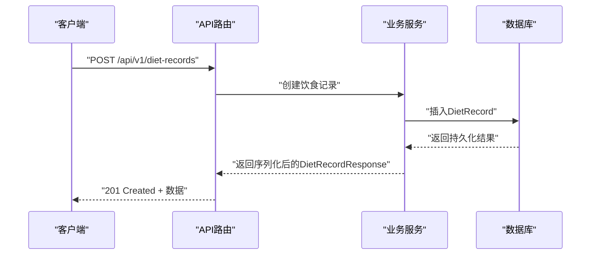
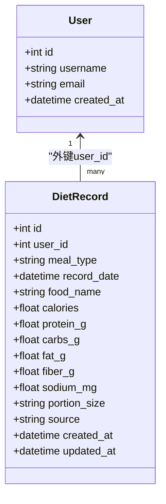
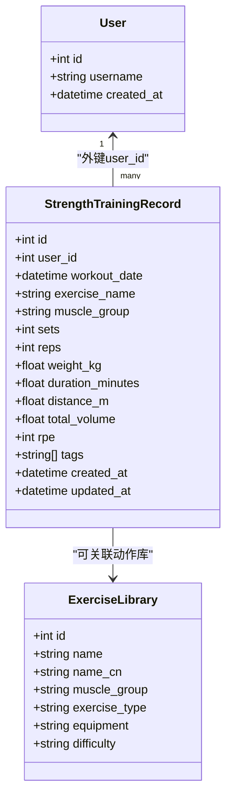
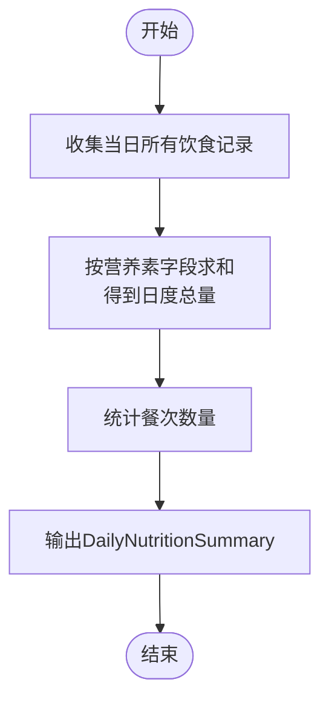
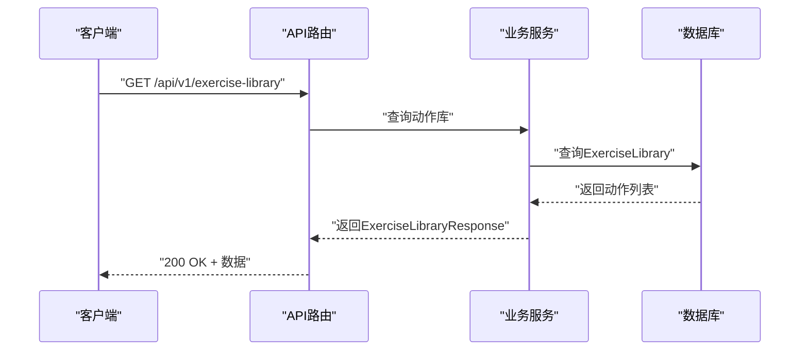
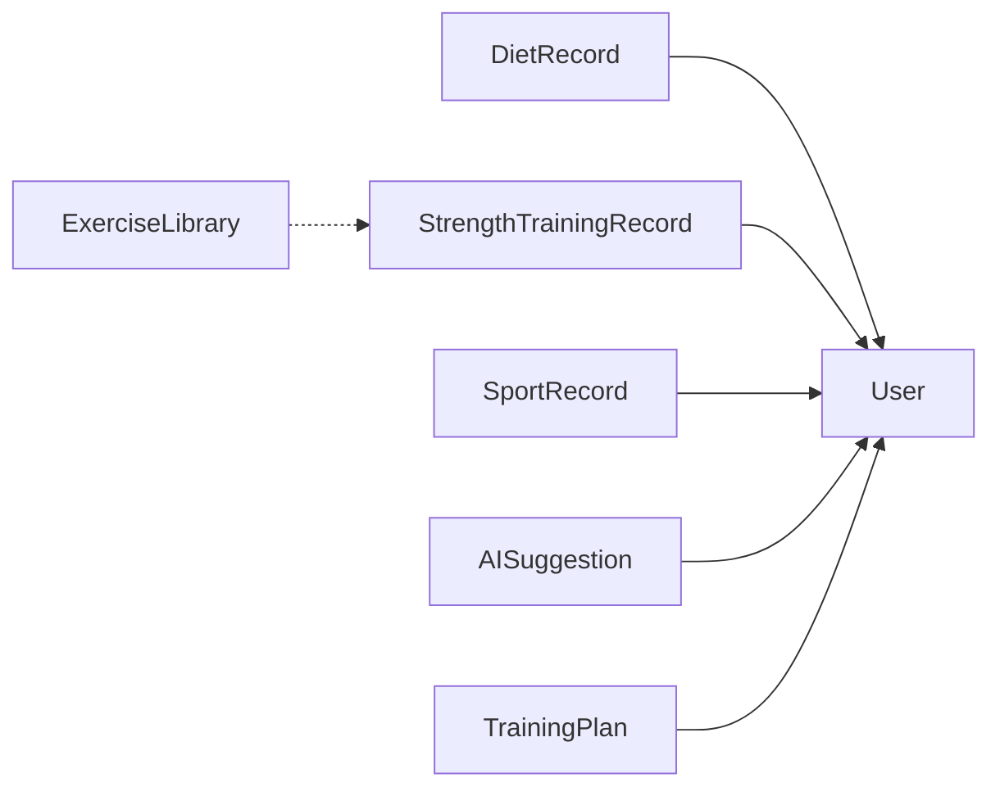

# 饮食与力量训练模型

<cite>
**本文引用的文件**
- [backend/app/models/diet.py](file://backend/app/models/diet.py)
- [backend/app/schemas/diet.py](file://backend/app/schemas/diet.py)
- [backend/app/models/strength.py](file://backend/app/models/strength.py)
- [backend/app/schemas/strength.py](file://backend/app/schemas/strong.py)
- [backend/app/models/user.py](file://backend/app/models/user.py)
- [backend/app/models/ai.py](file://backend/app/models/ai.py)
- [backend/app/models/sport.py](file://backend/app/models/sport.py)
- [backend/app/schemas/sport.py](file://backend/app/schemas/sport.py)
- [backend/app/database.py](file://backend/app/database.py)
- [backend/app/main.py](file://backend/app/main.py)
</cite>

## 目录
1. [简介](#简介)
2. [项目结构](#项目结构)
3. [核心组件](#核心组件)
4. [架构总览](#架构总览)
5. [详细组件分析](#详细组件分析)
6. [依赖分析](#依赖分析)
7. [性能考虑](#性能考虑)
8. [故障排除指南](#故障排除指南)
9. [结论](#结论)
10. [附录](#附录)

## 简介
本文件面向ActiveSynapse系统的“饮食记录”与“力量训练记录”两类核心数据模型，系统化阐述其设计原理、字段定义与数据类型，并结合用户关联、统计分析与趋势预测能力，给出营养需求计算、训练计划匹配与健康指标关联的数据结构设计思路。文档同时提供基于现有模型的综合分析与个性化建议生成的数据支撑路径，帮助开发者与产品人员高效理解与扩展该数据体系。

## 项目结构
后端采用FastAPI + SQLAlchemy异步ORM，模型层位于models目录，序列化层位于schemas目录；用户、运动、饮食、力量训练等实体通过外键与用户建立一对多关系；AI建议与训练计划作为扩展模块与用户关联，用于个性化推荐与计划执行追踪。

```mermaid
graph TB
subgraph "模型层(models)"
U["User<br/>用户"]
UP["UserProfile<br/>用户档案"]
DR["DietRecord<br/>饮食记录"]
STR["StrengthTrainingRecord<br/>力量训练记录"]
EX["ExerciseLibrary<br/>训练动作库"]
SR["SportRecord<br/>运动记录"]
RD["RunningDetail<br/>跑步详情"]
BD["BadmintonDetail<br/>羽毛球详情"]
AS["AISuggestion<br/>AI建议"]
TP["TrainingPlan<br/>训练计划"]
end
subgraph "序列化层(schemas)"
SD["DietRecord*"]
SS["StrengthRecord*"]
SP["SportRecord*"]
end
U < --> DR
U < --> STR
U < --> SR
U < --> AS
U < --> TP
U < --> UP
SR < --> RD
SR < --> BD
STR < --> EX
SD --> DR
SS --> STR
SP --> SR
```

图表来源
- [backend/app/models/user.py](file://backend/app/models/user.py#L21-L28)
- [backend/app/models/diet.py](file://backend/app/models/diet.py#L15-L56)
- [backend/app/models/strength.py](file://backend/app/models/strength.py#L18-L57)
- [backend/app/models/sport.py](file://backend/app/models/sport.py#L23-L49)
- [backend/app/schemas/diet.py](file://backend/app/schemas/diet.py#L6-L48)
- [backend/app/schemas/strength.py](file://backend/app/schemas/strength.py#L6-L47)
- [backend/app/schemas/sport.py](file://backend/app/schemas/sport.py#L55-L88)

章节来源
- [backend/app/models/__init__.py](file://backend/app/models/__init__.py#L1-L20)
- [backend/app/schemas/__init__.py](file://backend/app/schemas/__init__.py#L1-L23)

## 核心组件
- 用户(User)：系统主体，与饮食、力量训练、运动、AI建议、训练计划、用户档案等建立一对多关系。
- 饮食记录(DietRecord)：记录每日餐次、食物名称与描述、营养素（卡路里、蛋白质、碳水、脂肪、纤维、钠）与份量、照片、来源标记及时间戳。
- 力量训练记录(StrengthTrainingRecord)：记录训练日期、动作名、肌肉群、组数与次数/重量/时长/距离、总训练量、RPE、标签与时间戳。
- 运动记录(SportRecord)：记录运动类型、日期、时长、消耗热量、来源与GPX文件链接，并可关联跑步详情与羽毛球详情。
- 训练动作库(ExerciseLibrary)：预置动作库，包含动作名、中文名、肌肉群、动作类型、器械、难度等信息，供训练记录使用。
- AI建议(AISuggestion)与训练计划(TrainingPlan)：与用户关联，用于个性化建议生成与计划执行追踪。

章节来源
- [backend/app/models/user.py](file://backend/app/models/user.py#L7-L31)
- [backend/app/models/diet.py](file://backend/app/models/diet.py#L15-L56)
- [backend/app/models/strength.py](file://backend/app/models/strength.py#L18-L57)
- [backend/app/models/sport.py](file://backend/app/models/sport.py#L23-L49)
- [backend/app/models/ai.py](file://backend/app/models/ai.py#L30-L63)
- [backend/app/models/ai.py](file://backend/app/models/ai.py#L66-L122)

## 架构总览
系统采用“模型-序列化-服务-路由”的分层架构。模型层负责数据库表结构与关系；序列化层负责请求/响应校验与转换；服务层封装业务逻辑；路由层暴露REST接口。数据库初始化在应用启动时完成，使用异步会话管理事务。



图表来源
- [backend/app/main.py](file://backend/app/main.py#L56-L57)
- [backend/app/database.py](file://backend/app/database.py#L39-L42)
- [backend/app/schemas/diet.py](file://backend/app/schemas/diet.py#L44-L51)

## 详细组件分析

### 饮食记录模型(DietRecord)
- 设计原则
  - 以“用户-记录”一对多关联为核心，确保每条记录归属明确。
  - 支持多种餐次类型与摄入时间，便于日度营养汇总与趋势分析。
  - 营养素字段覆盖宏量与微量，满足基础营养评估与个性化建议。
  - 源字段区分手动录入与AI估算，便于质量控制与溯源。
- 字段与数据类型
  - 基本信息：meal_type（枚举）、record_date（日期时间）
  - 食物详情：food_name（字符串）、food_description（文本）
  - 营养成分（每份）：calories（浮点）、protein_g、carbs_g、fat_g、fiber_g、sodium_mg
  - 份量：portion_size（字符串）
  - 媒体：photo_url（字符串）
  - 备注：notes（文本）
  - 来源：source（字符串，默认manual或ai_estimated）
  - 时间戳：created_at、updated_at
- 关联关系
  - 与User通过user_id外键关联，反向关系为user.diet_records
- 统计与趋势
  - 可按record_date聚合生成日度营养汇总（见DailyNutritionSummary），支持趋势分析与目标对比
- 个性化建议支撑
  - 结合UserProfile中的运动目标与偏好，进行宏量目标分配与食物推荐



图表来源
- [backend/app/models/user.py](file://backend/app/models/user.py#L10-L18)
- [backend/app/models/diet.py](file://backend/app/models/diet.py#L18-L50)

章节来源
- [backend/app/models/diet.py](file://backend/app/models/diet.py#L15-L56)
- [backend/app/schemas/diet.py](file://backend/app/schemas/diet.py#L6-L48)
- [backend/app/schemas/diet.py](file://backend/app/schemas/diet.py#L54-L63)

### 力量训练记录模型(StrengthTrainingRecord)
- 设计原则
  - 支持复合动作、孤立动作、自重与计时/计距类动作，满足多样化训练场景。
  - 总体积(total_volume)可由后端计算或前端传入，便于统一口径统计。
  - RPE(主观疲劳)与标签(tags)增强训练强度与动作分类的可分析性。
- 字段与数据类型
  - 基本信息：workout_date（日期时间）、exercise_name（字符串）、muscle_group（枚举）
  - 训练参数：sets（整数）、reps（整数，可空）、weight_kg（浮点，可空）
  - 替代指标：duration_minutes（时长）、distance_m（距离）
  - 计算字段：total_volume（浮点）
  - 主观指标：rpe（1-10）
  - 分类标签：tags（JSON数组）
  - 备注：notes（文本）
  - 时间戳：created_at、updated_at
- 关联关系
  - 与User通过user_id外键关联，反向关系为user.strength_records
  - 可与ExerciseLibrary联动，实现动作标准化与类型归类
- 统计与趋势
  - 可按肌肉群、动作、日期聚合生成统计视图（见MuscleGroupStats与StrengthStatistics），支持训练量与强度趋势分析
- 个性化建议支撑
  - 结合UserProfile的运动目标与训练计划(TrainingPlan)，生成动作匹配与强度调整建议



图表来源
- [backend/app/models/user.py](file://backend/app/models/user.py#L10-L18)
- [backend/app/models/strength.py](file://backend/app/models/strength.py#L21-L51)
- [backend/app/models/ai.py](file://backend/app/models/ai.py#L66-L122)

章节来源
- [backend/app/models/strength.py](file://backend/app/models/strength.py#L18-L57)
- [backend/app/schemas/strength.py](file://backend/app/schemas/strong.py#L6-L47)
- [backend/app/schemas/strong.py](file://backend/app/schemas/strong.py#L76-L89)

### 用户档案与统计视图
- 用户档案(UserProfile)关键字段
  - 基础信息：height_cm、weight_kg、birth_date、gender
  - 运动相关：sport_level、sport_goals（JSON数组）
  - 偏好设置：preferred_sports、weekly_target（JSON对象）
- 日度营养汇总(DailyNutritionSummary)
  - date、total_calories、total_protein_g、total_carbs_g、total_fat_g、total_fiber_g、total_sodium_mg、meal_count
- 力量训练统计(StrengthStatistics)
  - total_workouts、total_sets、total_volume、muscle_group_stats（含每组的总次数与体积）、recent_exercises
- 运动统计(SportStatistics)
  - total_activities、total_duration_minutes、total_distance_km、total_calories、avg_duration_minutes、avg_pace、avg_heart_rate



图表来源
- [backend/app/schemas/diet.py](file://backend/app/schemas/diet.py#L54-L63)

章节来源
- [backend/app/models/user.py](file://backend/app/models/user.py#L34-L61)
- [backend/app/schemas/diet.py](file://backend/app/schemas/diet.py#L54-L63)
- [backend/app/schemas/strong.py](file://backend/app/schemas/strong.py#L76-L89)
- [backend/app/schemas/sport.py](file://backend/app/schemas/sport.py#L93-L101)

### 训练动作库与计划匹配
- 动作库(ExerciseLibrary)字段
  - 名称与中文名、肌肉群、动作类型(compound/isolation/bodyweight/cardio)、器械、难度、媒体资源、说明与指导
- 计划匹配思路
  - 将StrengthTrainingRecord的exercise_name与ExerciseLibrary.name/name_cn匹配，提取muscle_group、exercise_type、equipment、difficulty
  - 结合UserProfile的sport_goals与weekly_target，筛选符合目标的动作组合
  - TrainingPlan中按周/日结构存储活动，与StrengthTrainingRecord形成执行追踪



图表来源
- [backend/app/models/ai.py](file://backend/app/models/ai.py#L66-L122)
- [backend/app/models/ai.py](file://backend/app/models/ai.py#L30-L63)

章节来源
- [backend/app/models/ai.py](file://backend/app/models/ai.py#L66-L122)

## 依赖分析
- 模型间耦合
  - User与DietRecord、StrengthTrainingRecord、SportRecord、AISuggestion、TrainingPlan均为一对多强关联，保证数据归属清晰
  - StrengthTrainingRecord与ExerciseLibrary为弱关联，便于扩展与维护
- 序列化层契约
  - schemas层的Base/Create/Update/Response模式与models层一一对应，确保输入输出一致
- 外部依赖
  - 异步SQLAlchemy引擎与会话工厂，支持高并发读写
  - FastAPI路由注册与CORS中间件，提供跨域访问支持



图表来源
- [backend/app/models/user.py](file://backend/app/models/user.py#L21-L28)
- [backend/app/models/diet.py](file://backend/app/models/diet.py#L52-L53)
- [backend/app/models/strength.py](file://backend/app/models/strong.py#L53-L54)
- [backend/app/models/sport.py](file://backend/app/models/sport.py#L43-L46)
- [backend/app/models/ai.py](file://backend/app/models/ai.py#L59-L60)
- [backend/app/models/ai.py](file://backend/app/models/ai.py#L118-L119)

章节来源
- [backend/app/database.py](file://backend/app/database.py#L1-L43)
- [backend/app/main.py](file://backend/app/main.py#L56-L57)

## 性能考虑
- 异步I/O与连接池
  - 使用NullPool避免连接复用带来的复杂性，适合开发与演示环境；生产环境建议根据QPS选择合适的连接池策略
- 查询优化
  - 对高频查询字段(record_date/workout_date、muscle_group、user_id)建立索引，提升聚合统计效率
- 序列化开销
  - 使用from_attributes=True减少ORM对象到Pydantic模型的转换成本
- 缓存策略
  - 对热点统计视图(如DailyNutritionSummary、StrengthStatistics)引入Redis缓存，降低重复计算成本

## 故障排除指南
- 数据一致性
  - 外键约束与级联删除确保用户删除时相关记录一并清理，避免悬挂数据
- 输入校验
  - schemas层对数值字段设置上下界与必填约束，避免异常数据进入数据库
- 异常处理
  - 全局异常处理器统一返回标准错误格式，便于前端展示与定位问题

章节来源
- [backend/app/models/diet.py](file://backend/app/models/diet.py#L18-L19)
- [backend/app/models/strong.py](file://backend/app/models/strong.py#L21-L22)
- [backend/app/schemas/diet.py](file://backend/app/schemas/diet.py#L11-L16)
- [backend/app/schemas/strong.py](file://backend/app/schemas/strong.py#L10-L16)
- [backend/app/main.py](file://backend/app/main.py#L38-L53)

## 结论
本数据模型围绕“用户-记录”主线，构建了从基础字段到统计视图、从动作库到训练计划的完整闭环。通过明确的字段语义与严格的输入约束，为营养需求计算、训练强度评估与个性化建议生成提供了坚实的数据基础。建议后续在统计视图与缓存策略上进一步优化，以支撑更大规模的数据分析与实时推荐。

## 附录
- 数据模型与序列化对照
  - 饮食记录：DietRecordBase/DietRecordCreate/DietRecordUpdate/DietRecordResponse
  - 力量训练记录：StrengthRecordBase/StrengthRecordCreate/StrengthRecordUpdate/StrengthRecordResponse
  - 运动记录：SportRecordBase/SportRecordCreate/SportRecordUpdate/SportRecordResponse
  - 动作库：ExerciseLibraryBase/ExerciseLibraryCreate/ExerciseLibraryResponse
- 统计视图
  - 日度营养汇总：DailyNutritionSummary
  - 力量训练统计：MuscleGroupStats、StrengthStatistics
  - 运动统计：SportStatistics

章节来源
- [backend/app/schemas/diet.py](file://backend/app/schemas/diet.py#L6-L63)
- [backend/app/schemas/strong.py](file://backend/app/schemas/strong.py#L6-L89)
- [backend/app/schemas/sport.py](file://backend/app/schemas/sport.py#L55-L101)