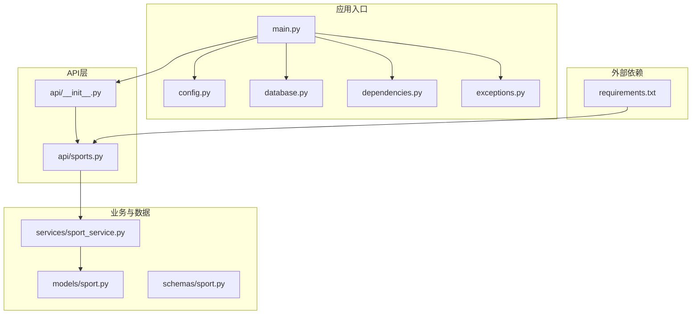
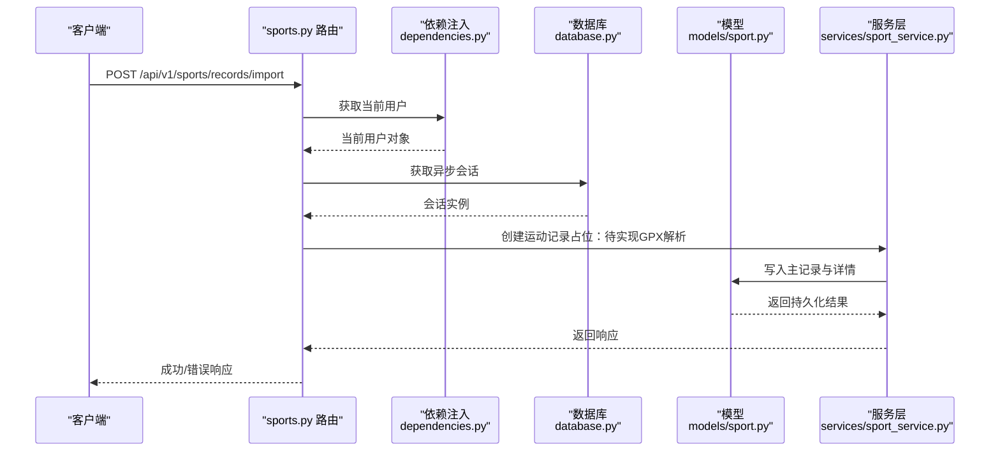
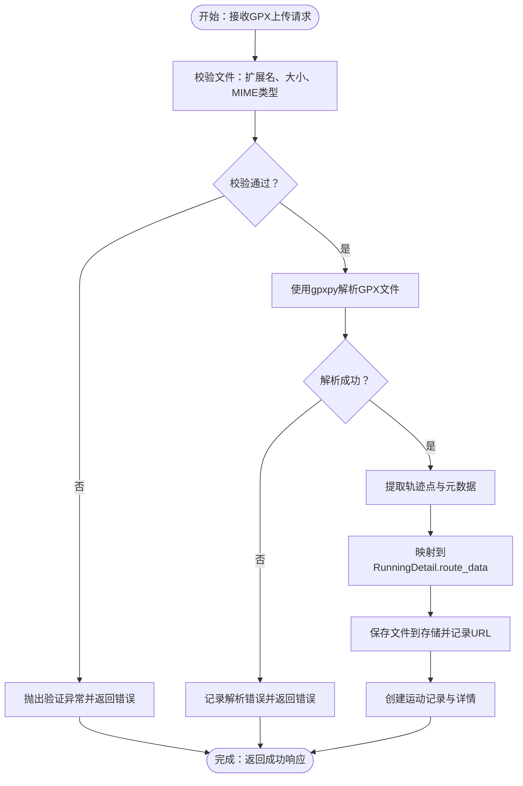
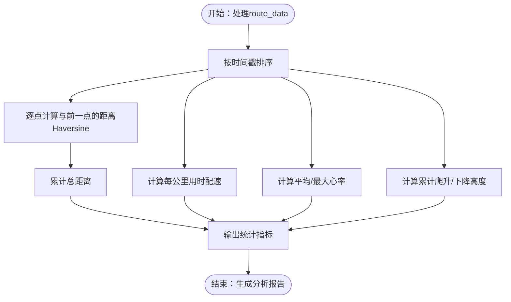
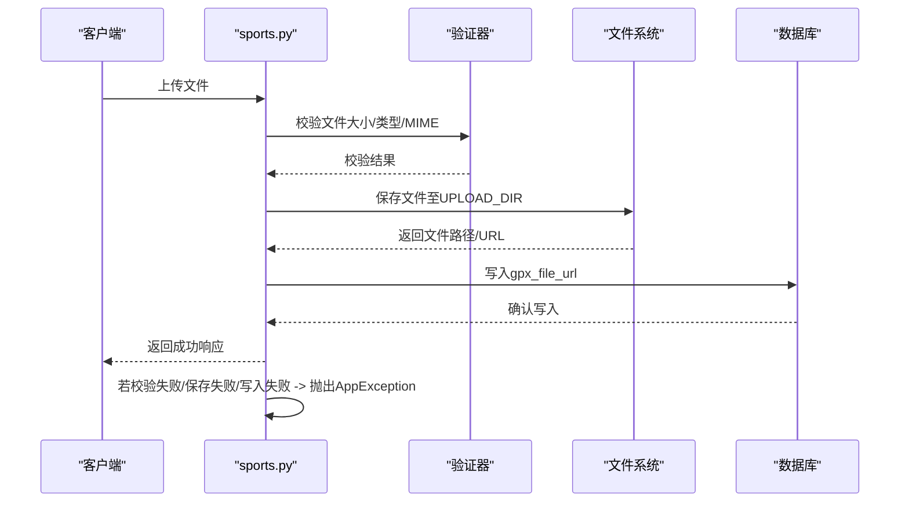
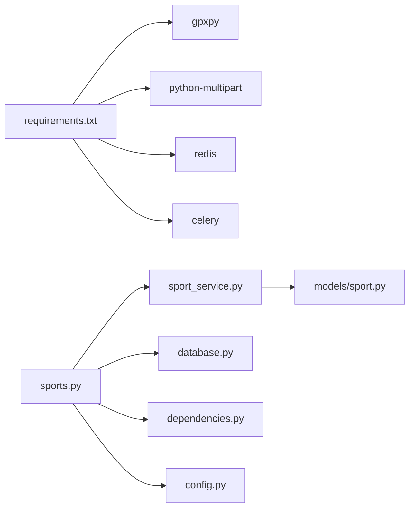

# 文件处理系统

<cite>
**本文档引用的文件**
- [README.md](file://README.md)
- [main.py](file://backend/app/main.py)
- [config.py](file://backend/app/config.py)
- [database.py](file://backend/app/database.py)
- [dependencies.py](file://backend/app/core/dependencies.py)
- [exceptions.py](file://backend/app/core/exceptions.py)
- [api/__init__.py](file://backend/app/api/__init__.py)
- [sports.py](file://backend/app/api/sports.py)
- [sport.py](file://backend/app/models/sport.py)
- [sport_service.py](file://backend/app/services/sport_service.py)
- [sport.py](file://backend/app/schemas/sport.py)
- [requirements.txt](file://backend/requirements.txt)
</cite>

## 目录
1. [简介](#简介)
2. [项目结构](#项目结构)
3. [核心组件](#核心组件)
4. [架构总览](#架构总览)
5. [详细组件分析](#详细组件分析)
6. [依赖分析](#依赖分析)
7. [性能考虑](#性能考虑)
8. [故障排除指南](#故障排除指南)
9. [结论](#结论)
10. [附录](#附录)

## 简介
本文件处理系统围绕运动轨迹数据（主要为GPX格式）的导入、解析与存储展开，目标是为ActiveSynapse提供完整的运动记录管理能力。当前后端已具备基础的运动记录模型、服务层与API路由，但GPX文件上传与解析功能仍处于占位实现阶段。本文档将基于现有代码，系统性梳理文件上传流程、数据验证规则、错误处理机制，并给出针对不同运动类型（跑步、羽毛球）的差异化处理建议、格式支持与大小限制、安全检查、存储策略、缓存与性能优化、错误恢复与重试机制以及监控告警建议，同时提供扩展与自定义的最佳实践。

## 项目结构
后端采用FastAPI + SQLAlchemy异步ORM + PostgreSQL的典型分层架构，文件处理相关的关键模块分布如下：
- 应用入口与异常处理：main.py
- 配置中心：config.py（含上传目录与最大文件大小）
- 数据库连接与会话：database.py
- 认证与依赖注入：dependencies.py
- 运动记录API：sports.py
- 模型定义：models/sport.py（含GPX字段与运行轨迹JSON字段）
- 业务服务：services/sport_service.py（统计与汇总逻辑）
- 数据校验：schemas/sport.py（Pydantic模型）
- 依赖声明：requirements.txt（包含gpxpy）

**图表来源**
- [main.py](file://backend/app/main.py#L1-L77)
- [config.py](file://backend/app/config.py#L1-L46)
- [database.py](file://backend/app/database.py#L1-L43)
- [dependencies.py](file://backend/app/core/dependencies.py#L1-L61)
- [exceptions.py](file://backend/app/core/exceptions.py#L1-L54)
- [api/__init__.py](file://backend/app/api/__init__.py#L1-L10)
- [sports.py](file://backend/app/api/sports.py#L1-L127)
- [sport.py](file://backend/app/models/sport.py#L1-L115)
- [sport_service.py](file://backend/app/services/sport_service.py#L1-L238)
- [sport.py](file://backend/app/schemas/sport.py#L1-L102)
- [requirements.txt](file://backend/requirements.txt#L1-L39)

**章节来源**
- [main.py](file://backend/app/main.py#L1-L77)
- [config.py](file://backend/app/config.py#L1-L46)
- [database.py](file://backend/app/database.py#L1-L43)
- [dependencies.py](file://backend/app/core/dependencies.py#L1-L61)
- [exceptions.py](file://backend/app/core/exceptions.py#L1-L54)
- [api/__init__.py](file://backend/app/api/__init__.py#L1-L10)
- [sports.py](file://backend/app/api/sports.py#L1-L127)
- [sport.py](file://backend/app/models/sport.py#L1-L115)
- [sport_service.py](file://backend/app/services/sport_service.py#L1-L238)
- [sport.py](file://backend/app/schemas/sport.py#L1-L102)
- [requirements.txt](file://backend/requirements.txt#L1-L39)

## 核心组件
- 应用入口与生命周期：注册CORS、异常处理器、路由前缀与健康检查。
- 配置中心：集中管理数据库URL、Redis、JWT、AI、上传目录与最大文件大小等。
- 数据库层：异步引擎与会话工厂，自动建表初始化。
- 认证与依赖：基于Bearer Token的用户认证与活跃状态校验。
- 运动记录API：提供记录查询、创建、更新、删除、统计与周汇总；包含GPX导入占位接口。
- 模型与服务：定义运动记录、运行详情、羽毛球详情的数据结构与统计逻辑。
- 数据校验：Pydantic模型对输入参数进行范围与类型约束。
- 外部依赖：gpxpy用于GPX解析，python-multipart用于多部分表单上传。

**章节来源**
- [main.py](file://backend/app/main.py#L1-L77)
- [config.py](file://backend/app/config.py#L1-L46)
- [database.py](file://backend/app/database.py#L1-L43)
- [dependencies.py](file://backend/app/core/dependencies.py#L1-L61)
- [sports.py](file://backend/app/api/sports.py#L1-L127)
- [sport.py](file://backend/app/models/sport.py#L1-L115)
- [sport_service.py](file://backend/app/services/sport_service.py#L1-L238)
- [sport.py](file://backend/app/schemas/sport.py#L1-L102)
- [requirements.txt](file://backend/requirements.txt#L1-L39)

## 架构总览
下图展示了从客户端到数据库的完整调用链路，以及与文件处理相关的扩展点（GPX上传与解析）：

**图表来源**
- [sports.py](file://backend/app/api/sports.py#L116-L126)
- [dependencies.py](file://backend/app/core/dependencies.py#L11-L61)
- [database.py](file://backend/app/database.py#L26-L36)
- [sport.py](file://backend/app/models/sport.py#L23-L115)
- [sport_service.py](file://backend/app/services/sport_service.py#L48-L96)

## 详细组件分析

### GPX文件解析与导入（占位实现）
- 当前实现：sports.py中存在GPX导入占位接口，返回提示信息，尚未实现文件上传与解析。
- 建议实现路径：
  - 接口扩展：在sports.py中添加文件上传参数，使用python-multipart支持multipart/form-data。
  - 解析器：引入gpxpy对GPX文件进行解析，提取轨迹点（经纬度、海拔、时间戳、心率等）。
  - 数据映射：将解析后的route_data写入RunningDetail.route_data字段，供后续分析使用。
  - 错误处理：捕获文件读取、格式校验、解析异常，统一抛出AppException或HTTPException。
  - 安全检查：白名单校验文件扩展名（.gpx），限制文件大小（参考MAX_FILE_SIZE），进行内容类型校验与路径遍历防护。
  - 存储策略：生成唯一文件名，保存至UPLOAD_DIR，返回可访问URL并持久化到SportRecord.gpx_file_url。
  - 缓存与性能：对频繁访问的统计数据进行Redis缓存，设置合理TTL；对大文件解析采用流式处理与分块缓存。
  - 监控告警：记录解析耗时、失败率与错误堆栈，接入日志与指标系统。

**图表来源**
- [sports.py](file://backend/app/api/sports.py#L116-L126)
- [config.py](file://backend/app/config.py#L28-L30)
- [sport.py](file://backend/app/models/sport.py#L76-L78)
- [requirements.txt](file://backend/requirements.txt#L26-L27)

**章节来源**
- [sports.py](file://backend/app/api/sports.py#L116-L126)
- [config.py](file://backend/app/config.py#L28-L30)
- [sport.py](file://backend/app/models/sport.py#L76-L78)
- [requirements.txt](file://backend/requirements.txt#L26-L27)

### 运动轨迹数据提取与分析逻辑
- 数据结构：RunningDetail.route_data为JSON数组，建议元素包含lat、lon、elevation、time、hr等键，便于后续分析。
- 坐标转换：可选使用地理坐标系转换库（如pyproj）进行投影转换，以提升距离与坡度计算精度。
- 距离计算：采用Haversine公式或更精确的Vincenty公式计算相邻点之间的地面距离，累积得到总距离。
- 时间分析：按时间戳排序，计算配速（分钟/公里）、平均心率、最大心率等。
- 坡度分析：基于相邻点高程差与水平距离计算爬升/下降坡度，统计累计爬升/下降高度。
- 天气与条件：weather_conditions字段可用于记录温度、湿度、天气状况，辅助训练强度评估。
- 窗口聚合：对route_data进行滑动窗口分析，提取最佳配速区间、心率区间等特征。

**图表来源**
- [sport.py](file://backend/app/models/sport.py#L76-L78)

**章节来源**
- [sport.py](file://backend/app/models/sport.py#L76-L78)

### 不同运动类型的文件处理差异
- 跑步（running）：
  - 强依赖GPX轨迹数据：route_data用于距离、配速、心率、坡度等分析。
  - 字段丰富：distance_km、pace_min_per_km、heart_rate_avg/max、elevation_gain/loss、cadence_avg、stride_length_cm。
  - 建议：优先解析GPX，若缺失则允许手动录入基础指标。
- 羽毛球（badminton）：
  - 主要依赖视频与高光时刻标注：highlights字段记录时间戳片段，stats记录技术统计。
  - GPX非必需：可通过其他来源（如视频分析）生成高光片段。
  - 建议：提供视频上传接口与高光标注工具，结合统计字段完善分析。

**章节来源**
- [sport.py](file://backend/app/models/sport.py#L8-L21)
- [sport.py](file://backend/app/models/sport.py#L52-L84)
- [sport.py](file://backend/app/models/sport.py#L87-L115)

### 文件上传流程、数据验证与错误处理
- 上传流程：
  - 客户端发送multipart/form-data请求，包含文件字段与必要元数据。
  - 后端校验文件类型、大小与内容类型，拒绝不合规文件。
  - 将文件保存至UPLOAD_DIR，生成唯一文件名与可访问URL。
  - 将gpx_file_url写入SportRecord，等待后续解析或手动补充详情。
- 数据验证规则：
  - 文件大小：MAX_FILE_SIZE限制（默认100MB）。
  - 文件类型：仅允许.gpx扩展名（可扩展为白名单）。
  - 输入参数：Pydantic模型对数值范围（如心率0-250）、正数距离等进行约束。
- 错误处理机制：
  - 统一异常基类AppException，覆盖认证、授权、资源不存在、验证错误、冲突等场景。
  - 全局异常处理器返回标准化错误响应，避免泄露内部细节。

**图表来源**
- [sports.py](file://backend/app/api/sports.py#L116-L126)
- [config.py](file://backend/app/config.py#L28-L30)
- [exceptions.py](file://backend/app/core/exceptions.py#L4-L54)

**章节来源**
- [sports.py](file://backend/app/api/sports.py#L116-L126)
- [config.py](file://backend/app/config.py#L28-L30)
- [exceptions.py](file://backend/app/core/exceptions.py#L4-L54)

### 文件格式支持、大小限制与安全检查
- 支持格式：GPX（.gpx），可扩展为支持TCX、FIT等运动追踪格式。
- 大小限制：MAX_FILE_SIZE=100MB（可在环境变量中调整）。
- 安全检查：
  - 文件扩展名校验与白名单控制。
  - 内容类型校验，防止伪装文件。
  - 路径遍历防护，生成随机/唯一文件名。
  - 上传目录权限最小化，避免执行权限。
  - 对解析过程进行超时与内存上限控制，防止恶意文件导致资源耗尽。

**章节来源**
- [config.py](file://backend/app/config.py#L28-L30)
- [requirements.txt](file://backend/requirements.txt#L26-L27)

### 文件存储策略、缓存机制与性能优化
- 存储策略：
  - 本地存储：UPLOAD_DIR目录，建议配合NFS或对象存储（如S3）实现高可用。
  - URL生成：对外暴露可访问URL，便于前端直接加载。
- 缓存机制：
  - Redis缓存：对高频统计（如周汇总、近N日统计）进行缓存，设置TTL。
  - 分布式锁：并发导入同一设备文件时使用分布式锁避免重复解析。
- 性能优化：
  - 异步I/O：利用FastAPI与SQLAlchemy异步特性降低阻塞。
  - 流式解析：大文件采用流式读取与分块处理，减少内存峰值。
  - 批量写入：批量插入数据库，减少往返次数。
  - 索引优化：为常用查询字段（user_id、record_date、sport_type）建立索引。

**章节来源**
- [config.py](file://backend/app/config.py#L15-L16)
- [sport_service.py](file://backend/app/services/sport_service.py#L195-L237)

### 错误恢复、重试机制与监控告警
- 错误恢复：
  - 文件解析失败：记录失败原因与原始文件，提供重试接口。
  - 数据库事务：失败回滚，确保数据一致性。
- 重试机制：
  - 指数退避重试：对临时性错误（网络抖动、磁盘空间不足）进行有限次重试。
  - 幂等设计：保证重复提交不会产生副作用。
- 监控告警：
  - 指标采集：解析耗时、成功率、失败率、队列长度（如启用任务队列）。
  - 日志分级：区分INFO/WARN/ERROR，保留关键上下文（用户ID、文件名、错误堆栈）。
  - 告警阈值：设定失败率阈值与超时阈值，触发通知。

**章节来源**
- [main.py](file://backend/app/main.py#L38-L53)
- [exceptions.py](file://backend/app/core/exceptions.py#L4-L54)

### 开发者扩展与自定义最佳实践
- 新增运动类型：
  - 在模型层新增详情表（如CyclingDetail），在API层增加对应路由与Schema。
  - 在服务层扩展统计逻辑，支持新类型的数据聚合。
- 自定义解析器：
  - 引入新的解析库（如fitparse），保持与route_data结构一致。
  - 提供解析器插件化接口，便于未来扩展。
- 扩展验证规则：
  - 在Pydantic模型中增加字段约束与自定义验证器。
  - 对第三方数据源（如COROS）增加签名与校验机制。
- 可观测性增强：
  - 为每个关键步骤埋点，记录耗时与错误码。
  - 使用分布式追踪（如OpenTelemetry）定位性能瓶颈。

**章节来源**
- [sport.py](file://backend/app/models/sport.py#L23-L115)
- [sport_service.py](file://backend/app/services/sport_service.py#L127-L193)
- [sport.py](file://backend/app/schemas/sport.py#L55-L102)

## 依赖分析
- 外部依赖：
  - gpxpy：用于GPX文件解析。
  - python-multipart：用于多部分表单上传。
  - redis：用于缓存与分布式锁。
  - celery：任务队列（可选，用于异步解析与重试）。
- 内部耦合：
  - API层依赖服务层，服务层依赖模型层与数据库会话。
  - 依赖注入贯穿认证、数据库与业务服务，提高可测试性。

**图表来源**
- [requirements.txt](file://backend/requirements.txt#L1-L39)
- [sports.py](file://backend/app/api/sports.py#L1-L127)
- [sport_service.py](file://backend/app/services/sport_service.py#L1-L238)
- [sport.py](file://backend/app/models/sport.py#L1-L115)
- [database.py](file://backend/app/database.py#L1-L43)
- [dependencies.py](file://backend/app/core/dependencies.py#L1-L61)
- [config.py](file://backend/app/config.py#L1-L46)

**章节来源**
- [requirements.txt](file://backend/requirements.txt#L1-L39)
- [sports.py](file://backend/app/api/sports.py#L1-L127)
- [sport_service.py](file://backend/app/services/sport_service.py#L1-L238)
- [sport.py](file://backend/app/models/sport.py#L1-L115)
- [database.py](file://backend/app/database.py#L1-L43)
- [dependencies.py](file://backend/app/core/dependencies.py#L1-L61)
- [config.py](file://backend/app/config.py#L1-L46)

## 性能考虑
- I/O优化：使用异步文件读写与数据库连接池，避免阻塞。
- 内存控制：大文件解析采用流式处理，限制单次解析内存占用。
- 缓存策略：热点数据（统计、周汇总）缓存，设置合理过期时间。
- 并发控制：对同一用户的并发导入进行限流，避免资源争用。
- 索引与查询：为过滤字段建立索引，减少全表扫描。

## 故障排除指南
- 常见问题：
  - 文件过大：检查MAX_FILE_SIZE配置，前端提示与后端校验需一致。
  - 类型不符：确认扩展名与Content-Type，避免伪装文件。
  - 权限不足：检查UPLOAD_DIR写权限与Redis连接。
  - 解析失败：查看日志中的错误堆栈，确认GPX格式是否标准。
- 排查步骤：
  - 查看全局异常处理器返回的错误详情。
  - 检查数据库事务是否正确提交/回滚。
  - 验证依赖注入链路（认证、数据库、服务层）。

**章节来源**
- [main.py](file://backend/app/main.py#L38-L53)
- [exceptions.py](file://backend/app/core/exceptions.py#L4-L54)
- [database.py](file://backend/app/database.py#L26-L36)

## 结论
当前系统已具备完善的运动记录模型与API框架，GPX文件处理功能尚待实现。通过引入gpxpy解析器、完善文件上传与安全校验、建立缓存与监控体系，可快速构建稳定高效的文件处理能力。建议优先实现GPX导入占位接口，逐步完善解析、分析与统计模块，并持续优化性能与可观测性。

## 附录
- 快速启动：确保安装依赖后，使用uvicorn运行应用，访问/health确认健康状态。
- 环境变量：通过.env文件配置数据库、Redis、JWT与上传目录等参数。
- 扩展清单：新增运动类型、解析器插件、任务队列与告警集成。

**章节来源**
- [README.md](file://README.md#L1-L3)
- [main.py](file://backend/app/main.py#L69-L76)
- [config.py](file://backend/app/config.py#L35-L37)