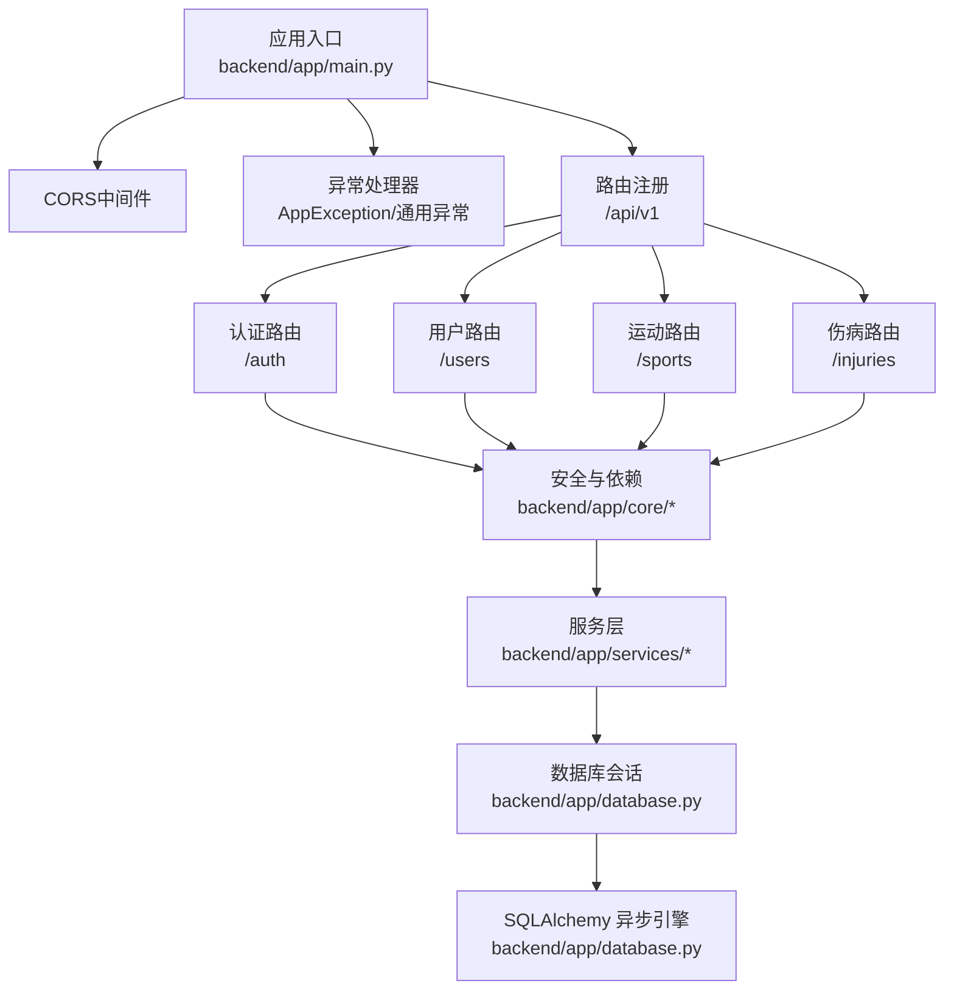
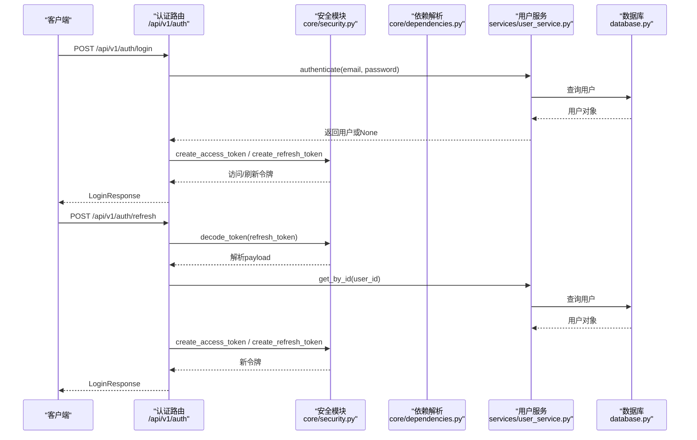
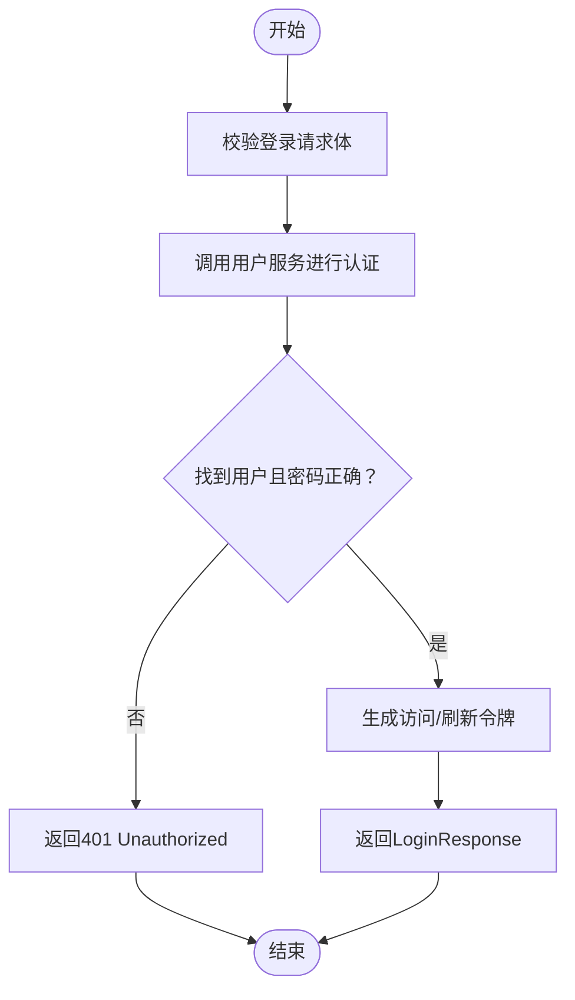
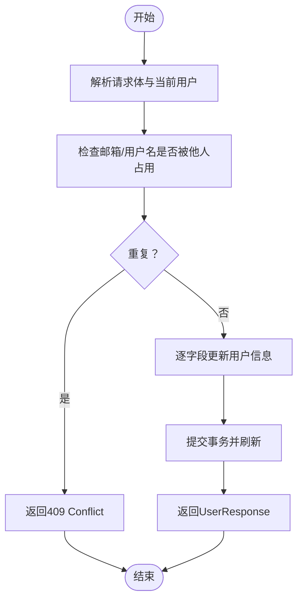
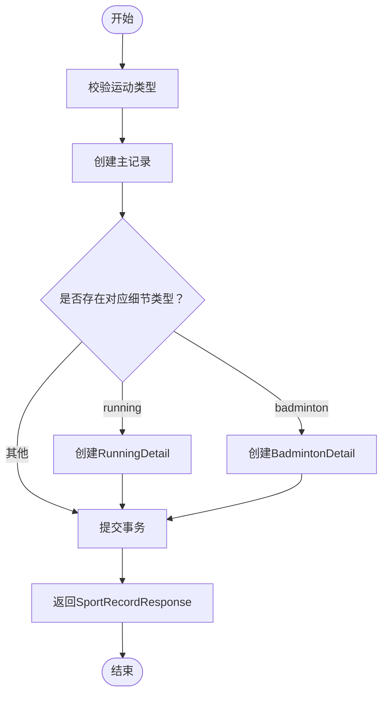
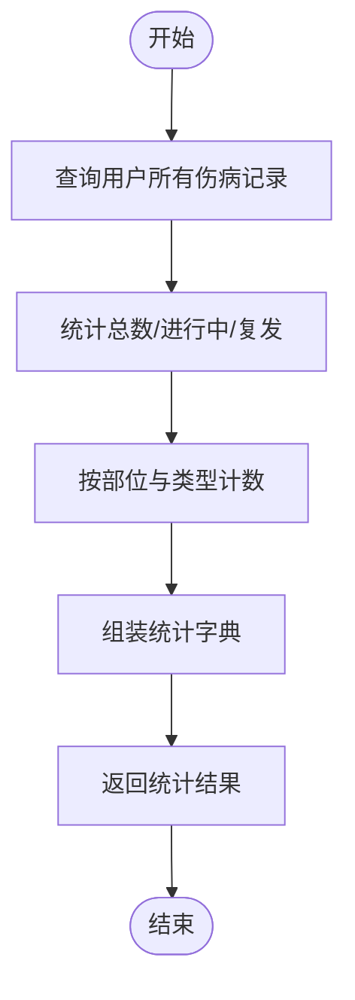
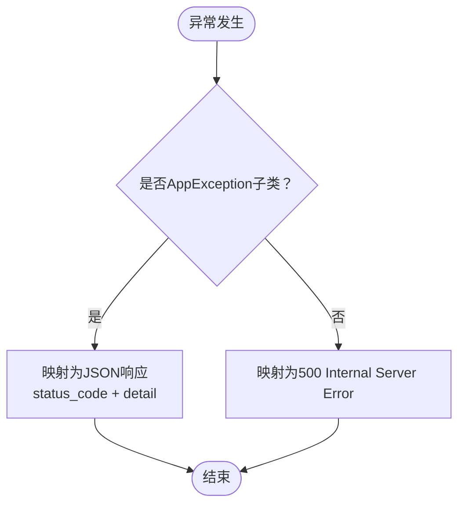
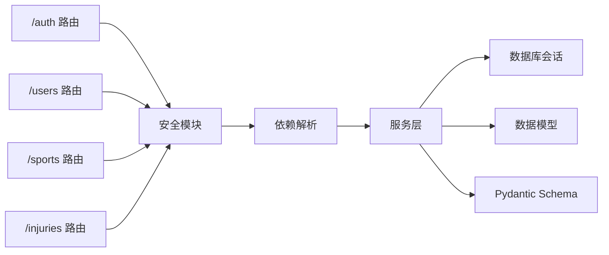

# API测试

<cite>
**本文引用的文件**
- [backend/app/main.py](file://backend/app/main.py)
- [backend/app/api/auth.py](file://backend/app/api/auth.py)
- [backend/app/api/users.py](file://backend/app/api/users.py)
- [backend/app/api/sports.py](file://backend/app/api/sports.py)
- [backend/app/api/injuries.py](file://backend/app/api/injuries.py)
- [backend/app/core/security.py](file://backend/app/core/security.py)
- [backend/app/core/dependencies.py](file://backend/app/core/dependencies.py)
- [backend/app/core/exceptions.py](file://backend/app/core/exceptions.py)
- [backend/app/config.py](file://backend/app/config.py)
- [backend/app/database.py](file://backend/app/database.py)
- [backend/app/services/user_service.py](file://backend/app/services/user_service.py)
- [backend/app/services/sport_service.py](file://backend/app/services/sport_service.py)
- [backend/app/services/injury_service.py](file://backend/app/services/injury_service.py)
- [backend/app/models/user.py](file://backend/app/models/user.py)
- [backend/app/schemas/auth.py](file://backend/app/schemas/auth.py)
- [backend/app/schemas/user.py](file://backend/app/schemas/user.py)
</cite>

## 目录
1. [简介](#简介)
2. [项目结构](#项目结构)
3. [核心组件](#核心组件)
4. [架构总览](#架构总览)
5. [详细组件分析](#详细组件分析)
6. [依赖分析](#依赖分析)
7. [性能考虑](#性能考虑)
8. [故障排查指南](#故障排查指南)
9. [结论](#结论)
10. [附录](#附录)

## 简介
本文件为ActiveSynapse项目的专业API测试文档，覆盖RESTful API测试方法与实践，包括HTTP方法测试、URL模式验证、请求/响应格式校验；认证API（JWT令牌、密码加密、权限控制）测试；用户管理API（注册、登录、信息更新、头像上传）测试；运动记录API（运动类型、GPX导入、统计数据）测试；伤病管理API（创建、更新、查询、统计）测试；以及错误响应、状态码与异常处理测试。同时提供API测试工具使用、Postman集合配置与自动化测试脚本编写指南。

## 项目结构
后端基于FastAPI构建，采用分层架构：路由层（API Router）、核心安全与依赖（Security/Dependencies）、服务层（Services）、数据模型与Schema、数据库会话与初始化。应用通过统一前缀“/api/v1”暴露REST接口，并在根路径与健康检查端点提供基础信息。

图表来源
- [backend/app/main.py](file://backend/app/main.py#L21-L57)
- [backend/app/api/auth.py](file://backend/app/api/auth.py#L13-L92)
- [backend/app/api/users.py](file://backend/app/api/users.py#L10-L88)
- [backend/app/api/sports.py](file://backend/app/api/sports.py#L11-L127)
- [backend/app/api/injuries.py](file://backend/app/api/injuries.py#L10-L92)
- [backend/app/core/security.py](file://backend/app/core/security.py#L1-L50)
- [backend/app/core/dependencies.py](file://backend/app/core/dependencies.py#L1-L61)
- [backend/app/database.py](file://backend/app/database.py#L1-L43)

章节来源
- [backend/app/main.py](file://backend/app/main.py#L1-L77)
- [backend/app/database.py](file://backend/app/database.py#L1-L43)

## 核心组件
- 应用与路由
  - 应用生命周期、CORS、全局异常处理与根/健康检查端点定义于应用入口。
  - 路由统一挂载在“/api/v1”前缀下，便于版本化管理。
- 安全与依赖
  - 基于HTTP Bearer Token的鉴权流程，支持访问令牌与刷新令牌。
  - 密码哈希与JWT编码/解码由安全模块提供。
  - 当前用户解析与活跃用户校验依赖注入到各路由。
- 服务层
  - 用户、运动、伤病服务封装业务逻辑，负责数据持久化与统计计算。
- 数据模型与Schema
  - Pydantic模型用于请求/响应序列化与校验，确保输入输出一致性。
- 配置与数据库
  - 统一配置类提供JWT参数、数据库连接、Redis、CORS等设置。
  - 异步SQLAlchemy引擎与会话工厂，支持事务与回滚。

章节来源
- [backend/app/main.py](file://backend/app/main.py#L21-L77)
- [backend/app/core/security.py](file://backend/app/core/security.py#L1-L50)
- [backend/app/core/dependencies.py](file://backend/app/core/dependencies.py#L1-L61)
- [backend/app/config.py](file://backend/app/config.py#L1-L46)
- [backend/app/database.py](file://backend/app/database.py#L1-L43)

## 架构总览
以下序列图展示认证流程（登录与令牌刷新），体现HTTP方法、URL模式、请求体与响应模型之间的交互。

图表来源
- [backend/app/api/auth.py](file://backend/app/api/auth.py#L25-L85)
- [backend/app/core/security.py](file://backend/app/core/security.py#L21-L49)
- [backend/app/core/dependencies.py](file://backend/app/core/dependencies.py#L11-L50)
- [backend/app/services/user_service.py](file://backend/app/services/user_service.py#L61-L68)
- [backend/app/database.py](file://backend/app/database.py#L26-L36)

## 详细组件分析

### 认证API测试
- 接口清单
  - POST /api/v1/auth/register：注册新用户，返回用户信息（201 Created）
  - POST /api/v1/auth/login：登录获取访问/刷新令牌与用户信息
  - POST /api/v1/auth/refresh：使用刷新令牌换取新令牌
  - POST /api/v1/auth/logout：登出提示（客户端应丢弃令牌）
- 测试要点
  - HTTP方法与URL模式：确认路径前缀与资源命名一致
  - 请求体校验：邮箱格式、密码长度、令牌格式
  - 响应模型：access_token、refresh_token、expires_in、user字段结构
  - 权限控制：未授权时返回401，用户不存在或非活跃返回401/403
  - JWT行为：访问令牌过期时间、刷新令牌有效期与类型标识
- 关键流程图（登录）

图表来源
- [backend/app/api/auth.py](file://backend/app/api/auth.py#L25-L49)
- [backend/app/services/user_service.py](file://backend/app/services/user_service.py#L61-L68)
- [backend/app/core/security.py](file://backend/app/core/security.py#L21-L40)

章节来源
- [backend/app/api/auth.py](file://backend/app/api/auth.py#L17-L92)
- [backend/app/schemas/auth.py](file://backend/app/schemas/auth.py#L6-L35)
- [backend/app/core/security.py](file://backend/app/core/security.py#L11-L50)
- [backend/app/core/dependencies.py](file://backend/app/core/dependencies.py#L11-L50)
- [backend/app/services/user_service.py](file://backend/app/services/user_service.py#L29-L68)

### 用户管理API测试
- 接口清单
  - GET /api/v1/users/me：获取当前用户信息（含可选profile）
  - PUT /api/v1/users/me：更新当前用户信息
  - GET /api/v1/users/me/profile：获取用户档案
  - PUT /api/v1/users/me/profile：更新或创建用户档案
  - POST /api/v1/users/me/avatar：上传头像（占位）
- 测试要点
  - 身份验证：需要有效访问令牌
  - 参数校验：用户名长度、邮箱唯一性、电话格式
  - 业务约束：更新时邮箱/用户名唯一性冲突返回409
  - 响应模型：UserResponse/UserProfileResponse结构
- 关键流程图（更新用户）

图表来源
- [backend/app/api/users.py](file://backend/app/api/users.py#L39-L48)
- [backend/app/services/user_service.py](file://backend/app/services/user_service.py#L70-L95)

章节来源
- [backend/app/api/users.py](file://backend/app/api/users.py#L13-L88)
- [backend/app/schemas/user.py](file://backend/app/schemas/user.py#L36-L69)
- [backend/app/services/user_service.py](file://backend/app/services/user_service.py#L14-L95)

### 运动记录API测试
- 接口清单
  - GET /api/v1/sports/records：分页查询运动记录，支持按类型与日期过滤
  - POST /api/v1/sports/records：创建运动记录（支持running/badminton细节）
  - GET /api/v1/sports/records/{record_id}：按ID获取记录
  - PUT /api/v1/sports/records/{record_id}：更新记录
  - DELETE /api/v1/sports/records/{record_id}：删除记录
  - GET /api/v1/sports/statistics：统计近N天运动数据
  - GET /api/v1/sports/weekly-summary：周度活动汇总
  - POST /api/v1/sports/records/import：GPX导入（占位）
- 测试要点
  - 运动类型：仅允许已知类型（如running、badminton），否则应拒绝
  - 分页与过滤：skip/limit边界、日期范围、sport_type过滤
  - 统计数据：总次数、总时长、总卡路里、平均时长；running特有距离、配速、心率；badminton特有场次与时长
  - 权限与所有权：非本人记录返回404
- 关键流程图（创建运动记录）

图表来源
- [backend/app/api/sports.py](file://backend/app/api/sports.py#L37-L46)
- [backend/app/services/sport_service.py](file://backend/app/services/sport_service.py#L48-L96)

章节来源
- [backend/app/api/sports.py](file://backend/app/api/sports.py#L14-L127)
- [backend/app/services/sport_service.py](file://backend/app/services/sport_service.py#L14-L238)

### 伤病管理API测试
- 接口清单
  - GET /api/v1/injuries/?skip=&limit=&ongoing_only=：分页查询伤病记录
  - POST /api/v1/injuries/：创建伤病记录
  - GET /api/v1/injuries/{injury_id}：按ID获取
  - PUT /api/v1/injuries/{injury_id}：更新
  - DELETE /api/v1/injuries/{injury_id}：删除
  - GET /api/v1/injuries/summary/statistics：伤病统计摘要
- 测试要点
  - 过滤：ongoing_only仅返回进行中记录
  - 统计：总数、进行中数量、复发数量、按部位与类型分布
  - 权限与所有权：非本人记录返回404
- 关键流程图（统计摘要）

图表来源
- [backend/app/api/injuries.py](file://backend/app/api/injuries.py#L83-L91)
- [backend/app/services/injury_service.py](file://backend/app/services/injury_service.py#L87-L115)

章节来源
- [backend/app/api/injuries.py](file://backend/app/api/injuries.py#L13-L92)
- [backend/app/services/injury_service.py](file://backend/app/services/injury_service.py#L13-L115)

### 错误响应、状态码与异常处理测试
- 全局异常映射
  - AppException基类映射至JSON响应，包含状态码与detail
  - 通用异常映射为500 Internal Server Error
- 认证/授权异常
  - AuthenticationError：401 Unauthorized，携带WWW-Authenticate头
  - AuthorizationError：403 Forbidden
  - NotFoundError：404 Not Found
  - ValidationError：422 Unprocessable Entity
  - ConflictError：409 Conflict
- 测试建议
  - 未登录访问受保护路由：401
  - 访问他人资源：404（或403，视具体实现）
  - 刷新令牌无效：401
  - 注册邮箱/用户名冲突：409
  - 输入参数非法：422
  - 服务器内部错误：500
- 关键流程图（异常处理）

图表来源
- [backend/app/main.py](file://backend/app/main.py#L38-L53)
- [backend/app/core/exceptions.py](file://backend/app/core/exceptions.py#L4-L54)

章节来源
- [backend/app/main.py](file://backend/app/main.py#L38-L53)
- [backend/app/core/exceptions.py](file://backend/app/core/exceptions.py#L4-L54)

## 依赖分析
- 组件耦合
  - 路由层依赖安全与依赖模块进行鉴权与用户解析
  - 服务层依赖数据库会话，向上提供业务能力
  - Schema与模型解耦，通过Pydantic保证数据契约
- 外部依赖
  - JWT库用于令牌编解码
  - bcrypt用于密码哈希
  - SQLAlchemy异步ORM用于数据访问
- 可能的循环依赖
  - 通过模块拆分避免直接循环导入

图表来源
- [backend/app/api/auth.py](file://backend/app/api/auth.py#L1-L15)
- [backend/app/api/users.py](file://backend/app/api/users.py#L1-L10)
- [backend/app/api/sports.py](file://backend/app/api/sports.py#L1-L11)
- [backend/app/api/injuries.py](file://backend/app/api/injuries.py#L1-L10)
- [backend/app/core/security.py](file://backend/app/core/security.py#L1-L10)
- [backend/app/core/dependencies.py](file://backend/app/core/dependencies.py#L1-L10)
- [backend/app/database.py](file://backend/app/database.py#L1-L20)

章节来源
- [backend/app/core/security.py](file://backend/app/core/security.py#L1-L50)
- [backend/app/core/dependencies.py](file://backend/app/core/dependencies.py#L1-L61)
- [backend/app/database.py](file://backend/app/database.py#L1-L43)

## 性能考虑
- 数据库连接池与异步I/O：使用异步引擎与会话，减少阻塞
- 查询优化：分页参数限制（skip/limit），日期范围过滤
- 缓存策略：可结合Redis缓存热点统计结果（如统计与周汇总）
- 并发与事务：服务层单次事务内完成读写，避免长时间持有锁

## 故障排查指南
- 常见问题
  - 401未授权：检查Authorization头格式与令牌有效性
  - 403禁止访问：检查用户是否激活
  - 404资源不存在：检查资源ID与归属关系
  - 409冲突：检查邮箱/用户名唯一性
  - 500服务器错误：查看日志定位异常
- 排查步骤
  - 使用Swagger/OpenAPI文档验证请求格式
  - 检查JWT密钥、算法与过期时间配置
  - 核对数据库连接字符串与表结构初始化
  - 在本地环境启用DEBUG观察SQL输出

章节来源
- [backend/app/main.py](file://backend/app/main.py#L38-L53)
- [backend/app/core/exceptions.py](file://backend/app/core/exceptions.py#L10-L54)
- [backend/app/config.py](file://backend/app/config.py#L18-L22)
- [backend/app/database.py](file://backend/app/database.py#L39-L42)

## 结论
本文档提供了ActiveSynapse项目的完整API测试方法论与实践指南，涵盖认证、用户、运动、伤病四大模块的测试要点与流程图示。通过严格的HTTP方法与URL模式验证、请求/响应格式校验、JWT令牌与权限控制测试、错误与异常处理测试，可显著提升API质量与稳定性。建议配合Postman集合与自动化脚本持续集成，保障迭代过程中的回归质量。

## 附录

### API测试工具与Postman集合配置
- Postman集合建议
  - 环境变量：BASE_URL（如 http://localhost:8000/api/v1）、ACCESS_TOKEN、REFRESH_TOKEN、USER_ID
  - 鉴权预处理：在集合/请求Pre-request Script中调用登录接口获取令牌
  - 环境初始化：设置默认请求头（Authorization: Bearer {{ACCESS_TOKEN}}）
- 请求模板
  - 登录：POST /auth/login，Body为邮箱与密码
  - 注册：POST /auth/register，Body为用户名、邮箱、密码
  - 获取资料：GET /users/me
  - 更新资料：PUT /users/me
  - 创建运动记录：POST /sports/records，Body包含运动类型与细节
  - 查询统计：GET /sports/statistics?days=30
  - 创建伤病记录：POST /injuries/
  - 查询统计：GET /injuries/summary/statistics

### 自动化测试脚本编写指南
- 推荐框架
  - Python: pytest + httpx/aiohttp（异步）
  - JavaScript: Jest + Supertest 或 Playwright
- 脚本结构
  - 基础环境准备：启动/停止容器、初始化数据库
  - 用例组织：按模块划分（认证、用户、运动、伤病）
  - 断言策略：状态码、响应体结构、字段类型与范围
  - 清理：删除测试数据，释放资源
- 示例步骤
  1) 启动后端服务与数据库
  2) 执行注册与登录，保存令牌
  3) 使用令牌调用受保护接口
  4) 验证响应结构与业务规则
  5) 清理测试数据并断言幂等性