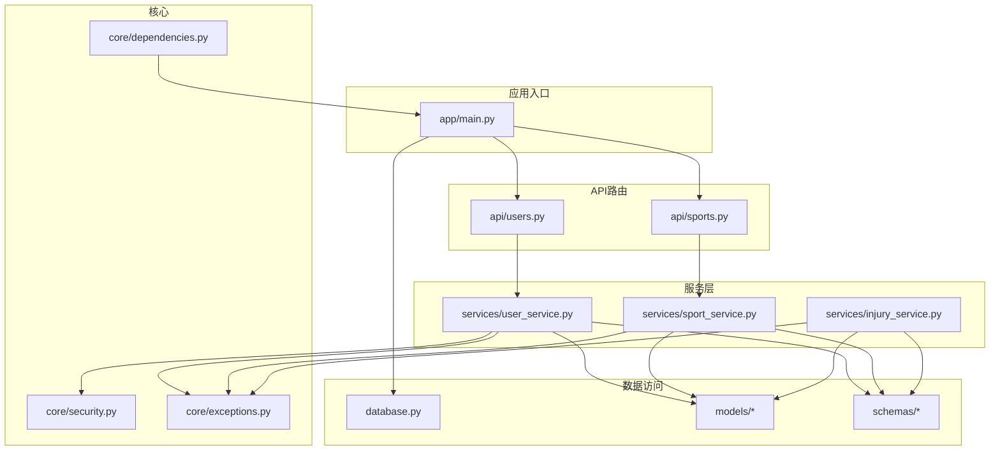
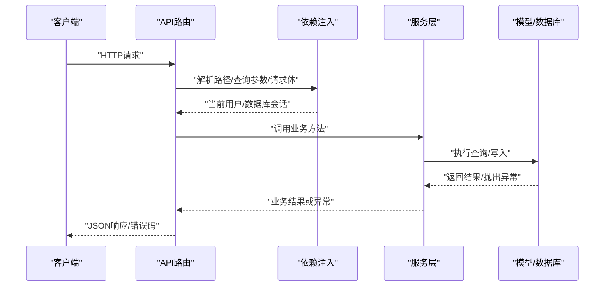
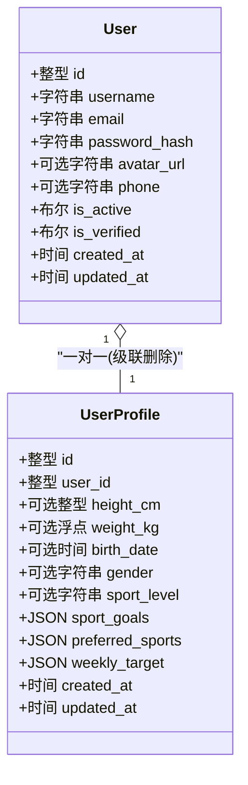
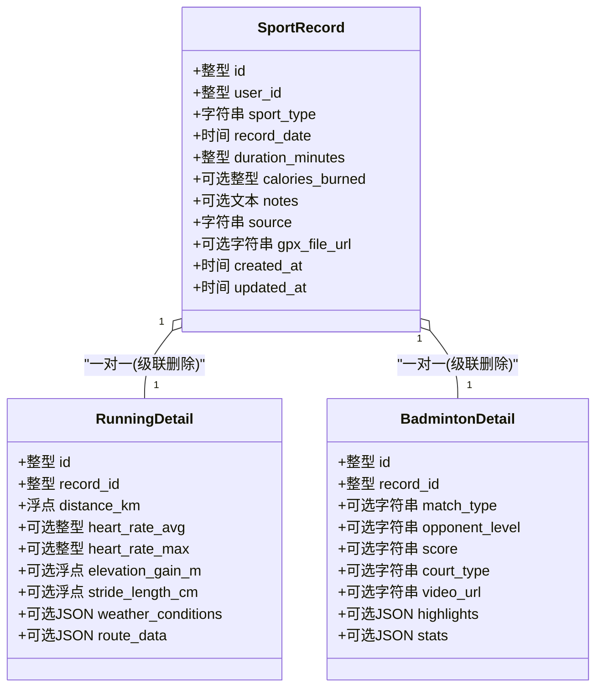
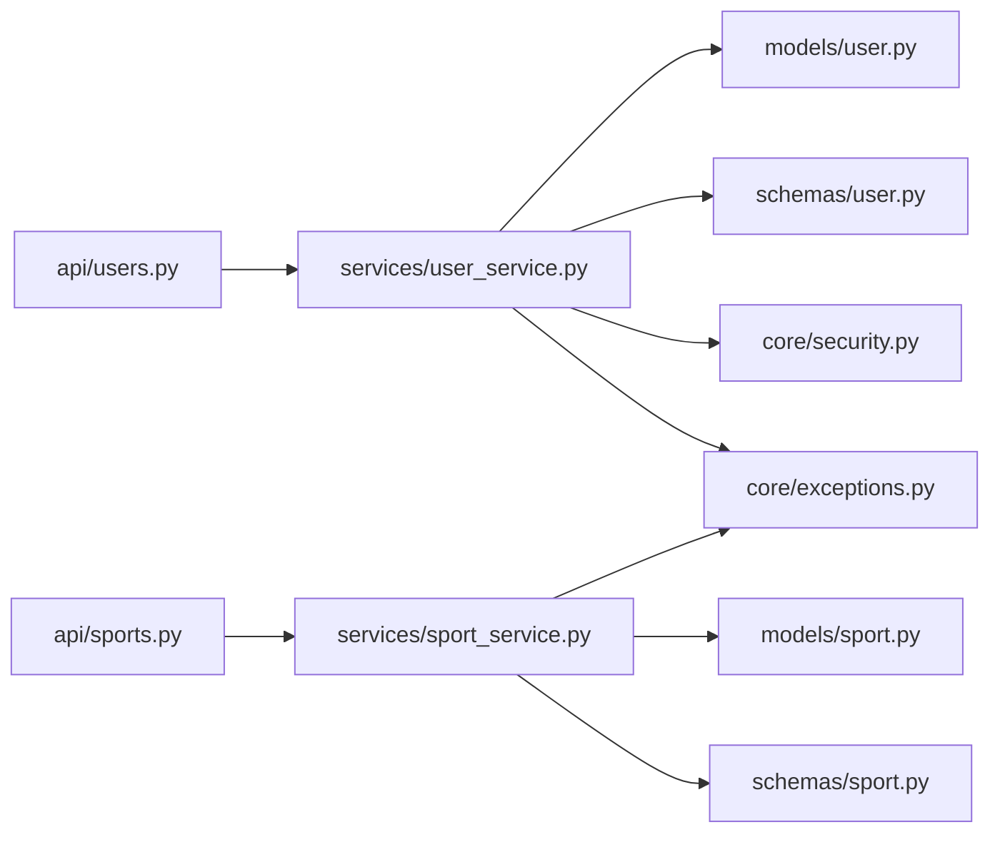

# 单元测试

<cite>
**本文引用的文件**
- [backend/app/main.py](file://backend/app/main.py)
- [backend/app/database.py](file://backend/app/database.py)
- [backend/app/api/users.py](file://backend/app/api/users.py)
- [backend/app/api/sports.py](file://backend/app/api/sports.py)
- [backend/app/services/user_service.py](file://backend/app/services/user_service.py)
- [backend/app/services/sport_service.py](file://backend/app/services/sport_service.py)
- [backend/app/services/injury_service.py](file://backend/app/services/injury_service.py)
- [backend/app/models/user.py](file://backend/app/models/user.py)
- [backend/app/models/sport.py](file://backend/app/models/sport.py)
- [backend/app/models/injury.py](file://backend/app/models/injury.py)
- [backend/app/schemas/user.py](file://backend/app/schemas/user.py)
- [backend/app/schemas/sport.py](file://backend/app/schemas/sport.py)
- [backend/app/schemas/injury.py](file://backend/app/schemas/injury.py)
- [backend/app/core/dependencies.py](file://backend/app/core/dependencies.py)
- [backend/app/core/security.py](file://backend/app/core/security.py)
- [backend/app/core/exceptions.py](file://backend/app/core/exceptions.py)
</cite>

## 目录
1. [引言](#引言)
2. [项目结构](#项目结构)
3. [核心组件](#核心组件)
4. [架构总览](#架构总览)
5. [详细组件分析](#详细组件分析)
6. [依赖分析](#依赖分析)
7. [性能考虑](#性能考虑)
8. [故障排查指南](#故障排查指南)
9. [结论](#结论)
10. [附录](#附录)

## 引言
本文件面向ActiveSynapse后端团队，系统化地阐述单元测试的设计原则与实现方法，覆盖数据模型、服务层与API路由的测试策略，并提供Mock对象使用、测试数据准备、断言与异常/边界条件测试的实践指南。文档同时给出测试环境配置、测试数据库设置以及异步函数测试方法，帮助开发者快速建立高质量的单元测试体系。

## 项目结构
后端采用FastAPI + SQLAlchemy异步ORM的分层架构：API路由负责请求处理与参数校验；服务层封装业务逻辑；模型层定义数据库表结构；模式层（schemas）用于输入输出序列化与校验；核心模块提供安全、依赖注入与异常处理。

图表来源
- [backend/app/main.py](file://backend/app/main.py#L1-L77)
- [backend/app/database.py](file://backend/app/database.py#L1-L43)
- [backend/app/api/users.py](file://backend/app/api/users.py#L1-L88)
- [backend/app/api/sports.py](file://backend/app/api/sports.py#L1-L127)
- [backend/app/services/user_service.py](file://backend/app/services/user_service.py#L1-L120)
- [backend/app/services/sport_service.py](file://backend/app/services/sport_service.py#L1-L238)
- [backend/app/services/injury_service.py](file://backend/app/services/injury_service.py#L1-L115)
- [backend/app/models/user.py](file://backend/app/models/user.py#L1-L62)
- [backend/app/models/sport.py](file://backend/app/models/sport.py#L1-L115)
- [backend/app/models/injury.py](file://backend/app/models/injury.py#L1-L200)
- [backend/app/schemas/user.py](file://backend/app/schemas/user.py#L1-L200)
- [backend/app/schemas/sport.py](file://backend/app/schemas/sport.py#L1-L200)
- [backend/app/schemas/injury.py](file://backend/app/schemas/injury.py#L1-L200)
- [backend/app/core/dependencies.py](file://backend/app/core/dependencies.py#L1-L200)
- [backend/app/core/security.py](file://backend/app/core/security.py#L1-L200)
- [backend/app/core/exceptions.py](file://backend/app/core/exceptions.py#L1-L200)

章节来源
- [backend/app/main.py](file://backend/app/main.py#L1-L77)
- [backend/app/database.py](file://backend/app/database.py#L1-L43)

## 核心组件
- 数据模型层：用户、运动记录、伤病记录及其明细，均通过SQLAlchemy异步会话持久化。
- 服务层：封装业务规则与事务控制，统一处理异常与返回值。
- API层：负责路由、参数校验、鉴权依赖与响应模型转换。
- 核心模块：安全（密码哈希/校验）、依赖注入（当前活跃用户）、异常类型。

章节来源
- [backend/app/models/user.py](file://backend/app/models/user.py#L1-L62)
- [backend/app/models/sport.py](file://backend/app/models/sport.py#L1-L115)
- [backend/app/models/injury.py](file://backend/app/models/injury.py#L1-L200)
- [backend/app/services/user_service.py](file://backend/app/services/user_service.py#L1-L120)
- [backend/app/services/sport_service.py](file://backend/app/services/sport_service.py#L1-L238)
- [backend/app/services/injury_service.py](file://backend/app/services/injury_service.py#L1-L115)
- [backend/app/api/users.py](file://backend/app/api/users.py#L1-L88)
- [backend/app/api/sports.py](file://backend/app/api/sports.py#L1-L127)
- [backend/app/core/security.py](file://backend/app/core/security.py#L1-L200)
- [backend/app/core/dependencies.py](file://backend/app/core/dependencies.py#L1-L200)
- [backend/app/core/exceptions.py](file://backend/app/core/exceptions.py#L1-L200)

## 架构总览
下图展示从API到服务再到模型的调用链路，以及异常处理与依赖注入的关键节点。

图表来源
- [backend/app/api/users.py](file://backend/app/api/users.py#L1-L88)
- [backend/app/api/sports.py](file://backend/app/api/sports.py#L1-L127)
- [backend/app/services/user_service.py](file://backend/app/services/user_service.py#L1-L120)
- [backend/app/services/sport_service.py](file://backend/app/services/sport_service.py#L1-L238)
- [backend/app/services/injury_service.py](file://backend/app/services/injury_service.py#L1-L115)
- [backend/app/core/dependencies.py](file://backend/app/core/dependencies.py#L1-L200)
- [backend/app/core/exceptions.py](file://backend/app/core/exceptions.py#L1-L200)

## 详细组件分析

### 用户模型与服务单元测试
- 测试目标
  - 用户模型字段约束与关系完整性
  - 用户服务的创建、认证、更新、档案读写等流程
  - 唯一性冲突（邮箱/用户名）与不存在场景
- 关键点
  - 使用异步会话进行增删改查
  - 密码哈希/校验在服务层完成，需验证一致性
  - 档案创建与懒加载关系
- 断言建议
  - 字段非空/唯一性/默认值
  - 更新时仅变更已设置字段
  - 查询返回None/单个对象/列表长度
- 异常与边界
  - 重复邮箱/用户名抛出冲突异常
  - 更新不存在用户抛出未找到异常
  - 认证失败返回None

图表来源
- [backend/app/models/user.py](file://backend/app/models/user.py#L1-L62)

章节来源
- [backend/app/models/user.py](file://backend/app/models/user.py#L1-L62)
- [backend/app/services/user_service.py](file://backend/app/services/user_service.py#L1-L120)
- [backend/app/schemas/user.py](file://backend/app/schemas/user.py#L1-L200)
- [backend/app/core/security.py](file://backend/app/core/security.py#L1-L200)
- [backend/app/core/exceptions.py](file://backend/app/core/exceptions.py#L1-L200)

### 运动记录模型与服务单元测试
- 测试目标
  - 主记录与明细（跑步/羽毛球）的创建、更新、删除
  - 统计与周汇总计算逻辑
  - 查询过滤（类型、日期范围、分页）
- 关键点
  - 多态明细表与主记录的外键关系
  - 创建时根据运动类型选择性写入明细
  - 统计聚合（时长、卡路里、距离、平均配速/心率）
- 断言建议
  - 返回记录包含明细字段（按类型）
  - 统计字典包含预期键值
  - 周汇总按自然日聚合
- 异常与边界
  - 非法记录ID/非本人记录抛出未找到异常
  - 超出分页限制的边界值

图表来源
- [backend/app/models/sport.py](file://backend/app/models/sport.py#L1-L115)

章节来源
- [backend/app/models/sport.py](file://backend/app/models/sport.py#L1-L115)
- [backend/app/services/sport_service.py](file://backend/app/services/sport_service.py#L1-L238)
- [backend/app/schemas/sport.py](file://backend/app/schemas/sport.py#L1-L200)
- [backend/app/core/exceptions.py](file://backend/app/core/exceptions.py#L1-L200)

### 伤病记录模型与服务单元测试
- 测试目标
  - 伤病记录的创建、更新、删除与查询
  - 摘要统计（总数、持续中、复发、部位分布、类型分布）
- 关键点
  - 可按“仅持续中”过滤
  - 统计基于聚合计算
- 断言建议
  - 摘要字典包含所有统计项
  - 过滤条件影响返回数量与字段

章节来源
- [backend/app/models/injury.py](file://backend/app/models/injury.py#L1-L200)
- [backend/app/services/injury_service.py](file://backend/app/services/injury_service.py#L1-L115)
- [backend/app/schemas/injury.py](file://backend/app/schemas/injury.py#L1-L200)
- [backend/app/core/exceptions.py](file://backend/app/core/exceptions.py#L1-L200)

### API层单元测试策略
- 用户API
  - 路由装饰器与依赖注入：当前活跃用户、数据库会话
  - 响应模型转换与字段映射
  - 文件上传占位接口的返回结构
- 运动API
  - 分页参数校验（skip/limit）、日期范围过滤、运动类型过滤
  - 统计与周汇总接口的数据结构
- 断言建议
  - 状态码与响应体结构
  - 错误场景返回标准错误格式

章节来源
- [backend/app/api/users.py](file://backend/app/api/users.py#L1-L88)
- [backend/app/api/sports.py](file://backend/app/api/sports.py#L1-L127)
- [backend/app/core/dependencies.py](file://backend/app/core/dependencies.py#L1-L200)

## 依赖分析
- 服务层对模型与模式的依赖：读写操作与数据转换
- API层对服务层与依赖注入的依赖：业务编排与鉴权
- 异常类型集中于核心模块，便于统一断言

图表来源
- [backend/app/api/users.py](file://backend/app/api/users.py#L1-L88)
- [backend/app/api/sports.py](file://backend/app/api/sports.py#L1-L127)
- [backend/app/services/user_service.py](file://backend/app/services/user_service.py#L1-L120)
- [backend/app/services/sport_service.py](file://backend/app/services/sport_service.py#L1-L238)
- [backend/app/models/user.py](file://backend/app/models/user.py#L1-L62)
- [backend/app/models/sport.py](file://backend/app/models/sport.py#L1-L115)
- [backend/app/schemas/user.py](file://backend/app/schemas/user.py#L1-L200)
- [backend/app/schemas/sport.py](file://backend/app/schemas/sport.py#L1-L200)
- [backend/app/core/security.py](file://backend/app/core/security.py#L1-L200)
- [backend/app/core/exceptions.py](file://backend/app/core/exceptions.py#L1-L200)

## 性能考虑
- 使用异步会话避免阻塞，批量查询使用flush/commit减少往返
- 统计类查询尽量在数据库侧聚合，减少Python侧循环
- 对高频接口（如统计/周汇总）可引入缓存层以降低数据库压力

## 故障排查指南
- 常见异常
  - 未找到：断言状态码与错误详情
  - 冲突（邮箱/用户名重复）：断言冲突异常
  - 认证失败：断言返回None或抛出相应异常
- 调试技巧
  - 在服务层埋点记录关键参数与返回值
  - 使用最小化测试数据集定位问题
  - 对异步函数使用事件循环隔离测试

章节来源
- [backend/app/core/exceptions.py](file://backend/app/core/exceptions.py#L1-L200)
- [backend/app/services/user_service.py](file://backend/app/services/user_service.py#L1-L120)
- [backend/app/services/sport_service.py](file://backend/app/services/sport_service.py#L1-L238)
- [backend/app/services/injury_service.py](file://backend/app/services/injury_service.py#L1-L115)

## 结论
通过将服务层作为单元测试的核心，结合Mock数据库会话与依赖注入，可以高效覆盖数据模型、业务逻辑与API行为。建议优先保证服务层测试的完备性，再扩展到API层与集成测试，以获得更高的测试性价比与更快的反馈速度。

## 附录

### 单元测试设计原则与实现方法
- 设计原则
  - 一个测试只测一件事（单一职责）
  - 使用Mock隔离外部依赖（数据库、网络）
  - 参数化测试覆盖边界条件
  - 使用固定种子或可控随机数确保可重复性
- 实现方法
  - 使用异步测试框架（如pytest-asyncio）
  - 通过依赖注入替换真实会话为内存数据库或Mock对象
  - 对模式层输入进行构造与校验

### 测试用例编写规范
- 命名规范：test_<功能>_<场景>_<期望>
- 组织结构：按模块划分测试文件，每个服务一个测试文件
- 前置条件：使用setup/teardown或fixture准备最小化测试数据
- 断言风格：明确断言目标，避免断言过多导致脆弱

### Mock对象使用与测试数据准备
- Mock会话：替换数据库会话，模拟查询/提交/回滚
- Mock依赖：替换鉴权依赖，注入测试用户上下文
- 测试数据：构造最小必要数据，避免跨测试污染

### 服务层单元测试策略
- 用户服务：创建/更新/认证/档案读写/唯一性校验
- 运动服务：创建/更新/删除/查询/统计/周汇总
- 伤病服务：创建/更新/删除/查询/摘要统计

### 测试环境配置与测试数据库
- 使用独立测试数据库或内存数据库（如SQLite内存库）
- 在测试启动时初始化schema并在结束时清理
- 配置异步引擎与会话工厂，确保与生产一致

### 异步函数测试方法
- 使用标记运行异步测试
- 在测试中正确await异步调用
- 使用事件循环隔离，避免并发干扰

### 测试断言、异常与边界条件
- 断言：结构、字段、类型、范围
- 异常：覆盖未找到、冲突、认证失败等
- 边界：分页上限/下限、空值、None、空集合