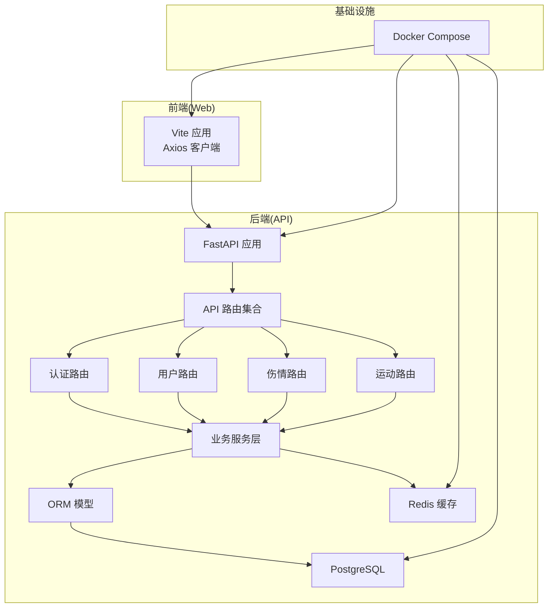
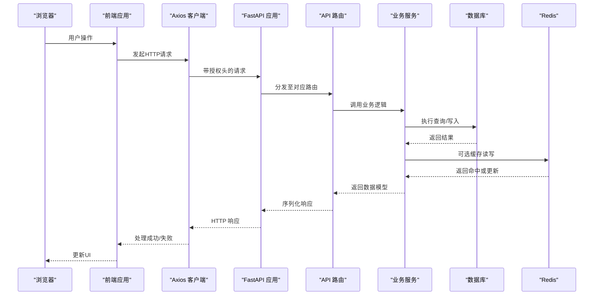
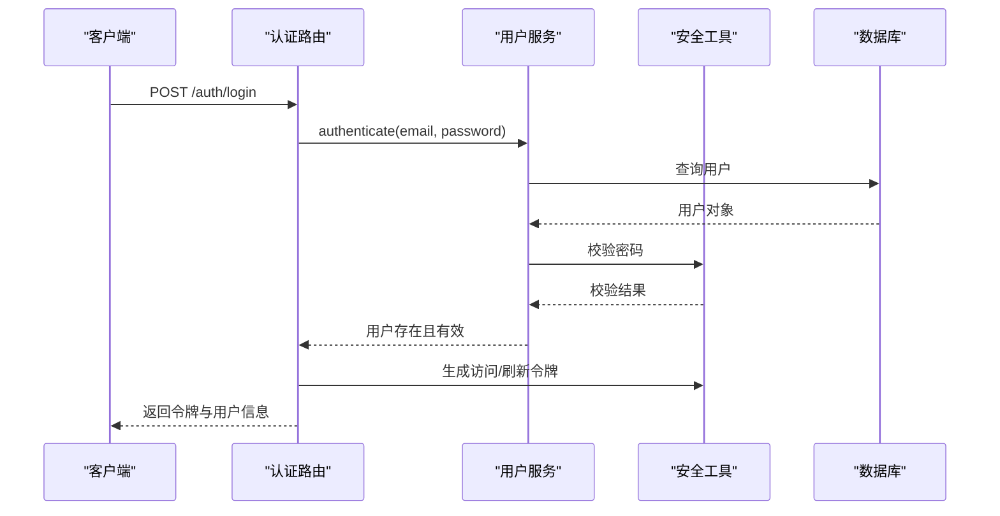
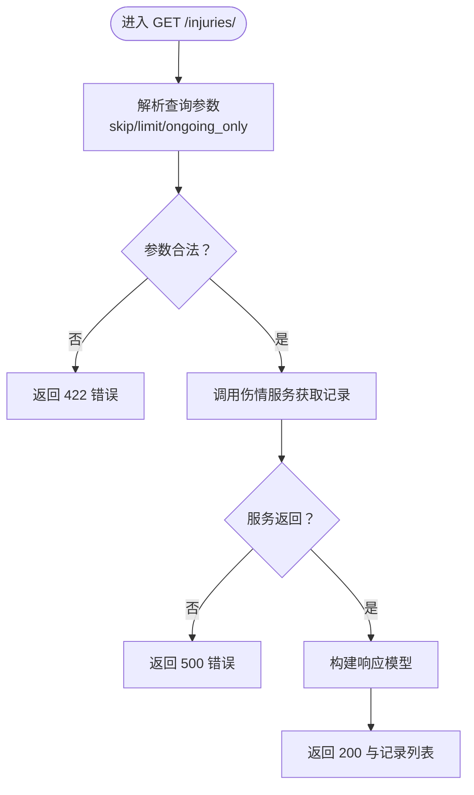
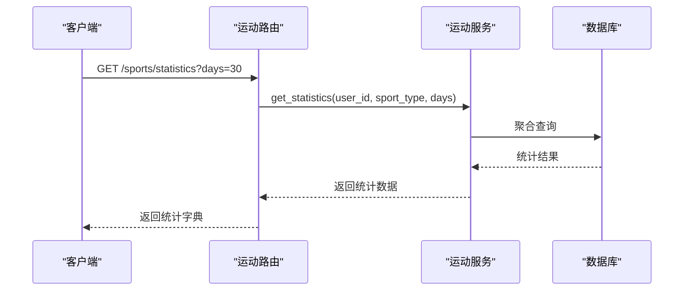
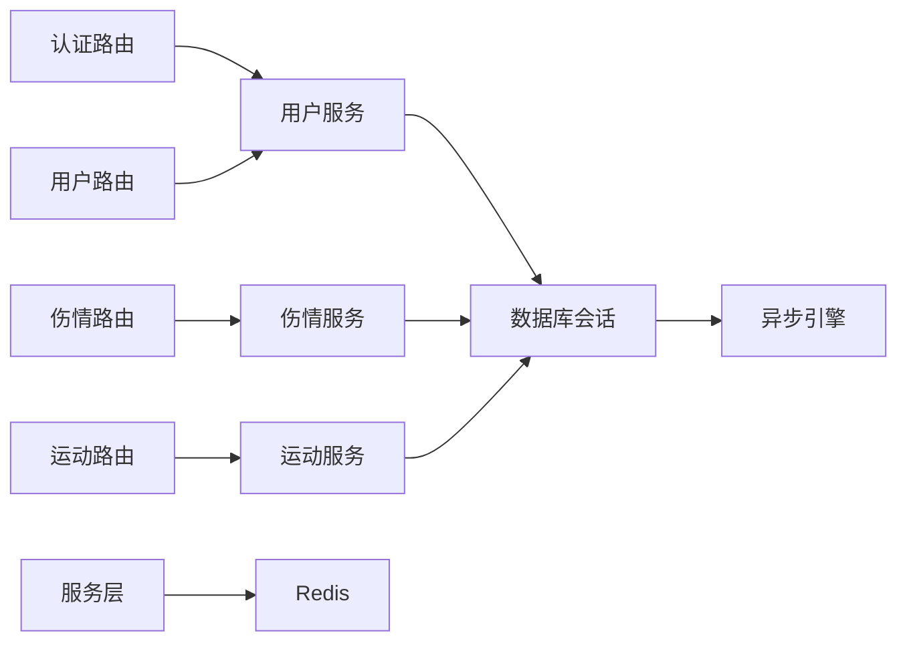

# 测试策略

<cite>
**本文引用的文件**
- [README.md](file://README.md)
- [backend/app/main.py](file://backend/app/main.py)
- [backend/app/config.py](file://backend/app/config.py)
- [backend/app/database.py](file://backend/app/database.py)
- [backend/app/api/__init__.py](file://backend/app/api/__init__.py)
- [backend/app/api/auth.py](file://backend/app/api/auth.py)
- [backend/app/api/users.py](file://backend/app/api/users.py)
- [backend/app/api/injuries.py](file://backend/app/api/injuries.py)
- [backend/app/api/sports.py](file://backend/app/api/sports.py)
- [backend/app/models/user.py](file://backend/app/models/user.py)
- [web/src/services/api.ts](file://web/src/services/api.ts)
- [docker-compose.yml](file://docker-compose.yml)
- [web/package.json](file://web/package.json)
</cite>

## 目录
1. [引言](#引言)
2. [项目结构](#项目结构)
3. [核心组件](#核心组件)
4. [架构总览](#架构总览)
5. [详细组件分析](#详细组件分析)
6. [依赖分析](#依赖分析)
7. [性能考虑](#性能考虑)
8. [故障排查指南](#故障排查指南)
9. [结论](#结论)
10. [附录](#附录)

## 引言
本测试策略文档面向ActiveSynapse项目的开发与测试团队，旨在建立覆盖单元测试、集成测试、API测试、前端组件测试与端到端测试的完整测试体系。文档涵盖测试环境搭建、测试数据准备、测试执行流程、覆盖率与性能标准、安全测试方法、自动化配置与CI/CD集成、测试报告生成，以及测试用例设计原则、Mock对象使用与异步测试处理等实践要点。

## 项目结构
ActiveSynapse采用前后端分离架构：后端基于FastAPI提供REST API，数据库与缓存通过Docker Compose编排；前端基于React/Vite构建，通过Axios调用后端接口。整体结构清晰，便于分层测试与隔离验证。

图表来源
- [backend/app/main.py](file://backend/app/main.py#L21-L57)
- [backend/app/api/__init__.py](file://backend/app/api/__init__.py#L1-L10)
- [backend/app/api/auth.py](file://backend/app/api/auth.py#L1-L92)
- [backend/app/api/users.py](file://backend/app/api/users.py#L1-L88)
- [backend/app/api/injuries.py](file://backend/app/api/injuries.py#L1-L92)
- [backend/app/api/sports.py](file://backend/app/api/sports.py#L1-L127)
- [backend/app/database.py](file://backend/app/database.py#L1-L43)
- [docker-compose.yml](file://docker-compose.yml#L1-L81)

章节来源
- [README.md](file://README.md#L1-L3)
- [docker-compose.yml](file://docker-compose.yml#L1-L81)

## 核心组件
- 后端应用与生命周期：应用在启动时初始化数据库表，并注册CORS与全局异常处理器；根路径提供健康检查与文档入口。
- 配置与设置：集中于配置类，支持数据库、Redis、JWT、AI、文件上传与CORS等参数。
- 数据库与会话：使用异步SQLAlchemy引擎与会话工厂，提供依赖注入获取会话。
- API路由：统一挂载认证、用户、伤情、运动四个模块路由，均通过当前活跃用户依赖进行鉴权。
- 前端Axios客户端：统一基地址、请求拦截器自动附加令牌、响应拦截器处理刷新逻辑。

章节来源
- [backend/app/main.py](file://backend/app/main.py#L12-L77)
- [backend/app/config.py](file://backend/app/config.py#L5-L46)
- [backend/app/database.py](file://backend/app/database.py#L1-L43)
- [backend/app/api/__init__.py](file://backend/app/api/__init__.py#L1-L10)
- [web/src/services/api.ts](file://web/src/services/api.ts#L1-L108)

## 架构总览
下图展示从Web前端到后端API再到数据库与缓存的整体交互链路，用于指导测试范围与断言点选择。

图表来源
- [web/src/services/api.ts](file://web/src/services/api.ts#L1-L108)
- [backend/app/main.py](file://backend/app/main.py#L21-L57)
- [backend/app/api/__init__.py](file://backend/app/api/__init__.py#L1-L10)
- [backend/app/database.py](file://backend/app/database.py#L26-L43)

## 详细组件分析

### 认证与用户模块测试策略
- 单元测试
  - 密码校验与令牌生成/解码：验证哈希算法一致性与JWT负载正确性。
  - 用户服务：模拟数据库会话，验证创建、认证、获取与更新流程。
- 集成测试
  - 登录/注册/刷新/登出端到端：构造有效/无效凭据，断言状态码与响应体字段。
  - 依赖注入：确保依赖解析与异常处理按预期工作。
- API测试
  - 路由层：覆盖所有端点（POST /auth/register、POST /auth/login、POST /auth/refresh、POST /auth/logout）。
  - 鉴权中间件：验证未携带令牌或无效令牌的拒绝行为。
- Mock与异步
  - 使用异步上下文管理器与依赖替换，避免真实数据库连接。
  - 对外部AI服务调用进行桩替，保证测试稳定性与可重复性。
- 前端测试
  - Axios拦截器：模拟401与重试逻辑，验证刷新流程与登出行为。
  - 状态存储：结合状态容器，断言登录后令牌与用户信息更新。

图表来源
- [backend/app/api/auth.py](file://backend/app/api/auth.py#L25-L49)
- [backend/app/api/users.py](file://backend/app/api/users.py#L13-L36)
- [backend/app/config.py](file://backend/app/config.py#L18-L22)

章节来源
- [backend/app/api/auth.py](file://backend/app/api/auth.py#L1-L92)
- [backend/app/api/users.py](file://backend/app/api/users.py#L1-L88)
- [web/src/services/api.ts](file://web/src/services/api.ts#L13-L64)

### 伤情记录模块测试策略
- 单元测试
  - 伤情服务：验证列表、创建、查询、更新、删除与统计汇总的边界条件。
- 集成测试
  - 过滤参数：skip/limit/ongoing_only组合，断言分页与筛选正确性。
- API测试
  - 路由层：GET /injuries/、POST /injuries/、GET /injuries/{id}、PUT /injuries/{id}、DELETE /injuries/{id}、GET /injuries/summary/statistics。
  - 404场景：不存在的ID返回与错误消息。
- Mock与异步
  - 替换数据库会话与统计计算逻辑，聚焦业务规则验证。

图表来源
- [backend/app/api/injuries.py](file://backend/app/api/injuries.py#L13-L29)

章节来源
- [backend/app/api/injuries.py](file://backend/app/api/injuries.py#L1-L92)

### 运动记录模块测试策略
- 单元测试
  - 运动服务：验证记录增删改查、统计与周汇总的聚合逻辑。
- 集成测试
  - 过滤参数：sport_type、start_date、end_date与days，断言结果集与统计口径。
- API测试
  - 路由层：GET /sports/records、POST /sports/records、GET /sports/records/{id}、PUT /sports/records/{id}、DELETE /sports/records/{id}、GET /sports/statistics、GET /sports/weekly-summary。
  - 文件导入占位：验证占位响应与后续实现对接点。
- Mock与异步
  - 对统计聚合与外部AI建议进行桩替，确保测试独立性。

图表来源
- [backend/app/api/sports.py](file://backend/app/api/sports.py#L88-L102)

章节来源
- [backend/app/api/sports.py](file://backend/app/api/sports.py#L1-L127)

### 用户资料模块测试策略
- 单元测试
  - 用户服务：验证获取/更新用户信息与档案的完整性。
- 集成测试
  - 头像上传占位：验证占位响应与后续存储对接。
- API测试
  - 路由层：GET /users/me、PUT /users/me、GET /users/me/profile、PUT /users/me/profile、POST /users/me/avatar。
- Mock与异步
  - 替换文件上传与存储逻辑，确保测试可重复。

章节来源
- [backend/app/api/users.py](file://backend/app/api/users.py#L1-L88)

### 数据模型与关系测试策略
- 单元测试
  - ORM模型：验证字段类型、约束与外键关系。
- 集成测试
  - 关联查询：验证用户与其档案、伤情、运动、饮食、力量训练、AI建议、训练计划的级联删除与回溯查询。
- Mock与异步
  - 使用内存数据库或测试专用实例，避免污染生产数据。

章节来源
- [backend/app/models/user.py](file://backend/app/models/user.py#L1-L62)

## 依赖分析
- 组件耦合
  - 路由依赖于服务层，服务层依赖于数据库会话与模型；API层与配置/安全模块松耦合。
- 外部依赖
  - 数据库：PostgreSQL（异步驱动）
  - 缓存：Redis
  - 文件上传：占位实现，后续接入对象存储
  - AI建议：OpenAI密钥配置，需Mock或桩替
- 依赖注入
  - 通过依赖函数提供数据库会话，便于测试替换。

图表来源
- [backend/app/api/__init__.py](file://backend/app/api/__init__.py#L1-L10)
- [backend/app/database.py](file://backend/app/database.py#L1-L43)
- [backend/app/config.py](file://backend/app/config.py#L15-L16)

章节来源
- [backend/app/api/__init__.py](file://backend/app/api/__init__.py#L1-L10)
- [backend/app/database.py](file://backend/app/database.py#L1-L43)
- [backend/app/config.py](file://backend/app/config.py#L15-L16)

## 性能考虑
- 接口性能
  - 统计与汇总接口应限制查询窗口(days/时间范围)，避免全表扫描。
  - 分页参数严格校验，防止超大limit导致资源耗尽。
- 数据库性能
  - 为常用过滤字段建立索引（如用户ID、时间戳、运动类型）。
  - 使用异步查询与连接池，避免阻塞。
- 缓存策略
  - 对热点统计结果进行短期缓存，降低数据库压力。
- 前端性能
  - 请求拦截器避免重复刷新，减少无效重试。
- 测试中的性能指标
  - 单元测试：关注服务方法的复杂度与调用次数。
  - 集成测试：关注慢查询与高延迟端点的回归阈值。

## 故障排查指南
- 常见问题
  - 401未授权：检查前端是否正确附加Authorization头，刷新令牌是否有效。
  - 404资源不存在：确认ID与用户绑定关系，服务层是否正确校验归属。
  - 500服务器错误：检查异常处理器是否捕获并返回标准错误格式。
- 调试技巧
  - 启用DEBUG模式查看SQL日志与请求追踪。
  - 使用最小化测试用例定位问题范围。
  - 对外部依赖进行桩替，隔离故障源。
- 安全测试
  - 令牌泄露与越权：模拟非本人ID访问，验证鉴权中间件。
  - 参数注入：对查询参数与JSON体进行边界与异常输入测试。
  - CORS与头部：验证跨域策略与敏感头过滤。

章节来源
- [backend/app/main.py](file://backend/app/main.py#L38-L53)
- [web/src/services/api.ts](file://web/src/services/api.ts#L27-L64)

## 结论
通过分层测试策略与严格的Mock与异步处理规范，ActiveSynapse可在快速迭代中保持高质量与稳定性。建议优先完善单元测试覆盖率，再扩展集成与端到端测试，持续优化性能与安全测试，最终形成完善的CI/CD质量门禁。

## 附录

### 测试环境搭建
- 后端
  - 使用Docker Compose启动数据库与缓存，本地开发可直接运行。
  - 配置测试专用数据库与Redis实例，避免与开发环境冲突。
- 前端
  - 设置VITE_API_URL指向后端API地址，确保Axios拦截器正常工作。
- 工具与框架
  - 后端：pytest + httpx（或FastAPI TestClient），异步测试支持。
  - 前端：Vitest/Jest + React Testing Library，支持异步与Mock。
  - CI/CD：GitHub Actions/Docker镜像构建与测试流水线。

章节来源
- [docker-compose.yml](file://docker-compose.yml#L1-L81)
- [web/package.json](file://web/package.json#L1-L37)

### 测试数据准备
- 用户数据：准备已注册用户与未激活账户，覆盖登录与权限场景。
- 伤情与运动数据：准备多条记录与不同状态（进行中/已完成），满足分页与筛选。
- 文件上传：准备小/中/大文件与非法类型，验证占位与后续实现。
- 缓存数据：预热热点统计，验证缓存命中与失效策略。

### 测试执行流程
- 单元测试：优先执行，确保服务与工具函数正确性。
- 集成测试：验证路由、依赖注入与数据库交互。
- API测试：覆盖所有端点与异常分支，生成契约测试。
- 前端组件测试：验证页面渲染、交互与Axios拦截器行为。
- 端到端测试：从登录到关键业务闭环，验证跨层协作。

### 覆盖率与性能标准
- 覆盖率
  - 单元测试：核心服务与工具函数达到80%以上。
  - 集成测试：关键路由与业务流程达到70%以上。
- 性能
  - 接口P95延迟：单次查询不超过200ms，统计接口不超过1s。
  - 并发能力：支持至少100并发请求下的稳定响应。

### 安全测试方法
- 令牌安全：验证JWT签名、过期与刷新流程。
- 权限控制：验证未登录与越权访问被拒绝。
- 输入校验：对所有输入参数进行边界与类型测试。
- CORS与头过滤：验证跨域策略与敏感头清理。

### 自动化配置与CI/CD集成
- 测试脚本
  - 后端：pytest + coverage（生成XML报告）。
  - 前端：Vitest/Jest + coverage（生成HTML报告）。
- CI/CD
  - Docker镜像构建与测试并行执行。
  - 代码覆盖率阈值作为质量门禁，低于阈值阻断合并。
  - 测试报告上传至制品库，供评审与审计。

### 测试报告生成
- 报告内容
  - 单元/集成/API测试结果与覆盖率。
  - 性能基准与回归对比。
  - 安全扫描与漏洞摘要。
- 展示方式
  - HTML报告与Jenkins/GitHub页面集成。
  - 通知机制：失败邮件/消息提醒。

### 测试用例设计原则
- 完整性：覆盖正常、异常与边界场景。
- 独立性：每个用例可独立运行，避免副作用。
- 可重复性：依赖Mock与固定种子数据。
- 可维护性：用例命名清晰，断言明确。

### Mock对象使用与异步测试处理
- Mock
  - 使用unittest.mock或pytest-mock替换数据库、缓存与外部服务。
  - 对文件上传与AI建议进行桩替，避免真实网络调用。
- 异步
  - 使用pytest-asyncio标记异步测试函数。
  - 在测试中使用异步上下文管理器与事件循环。