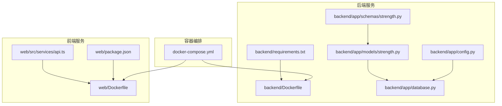
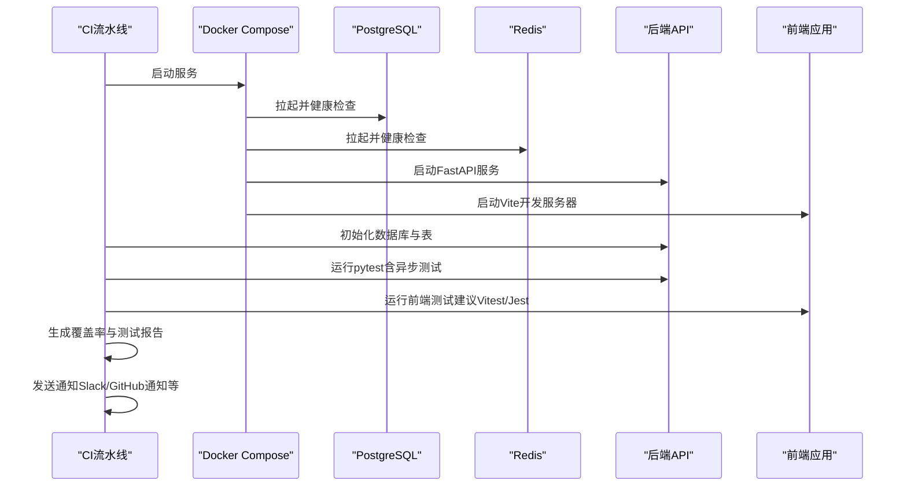
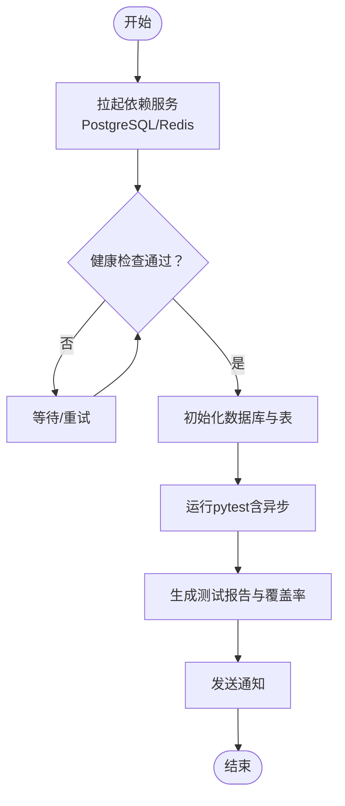
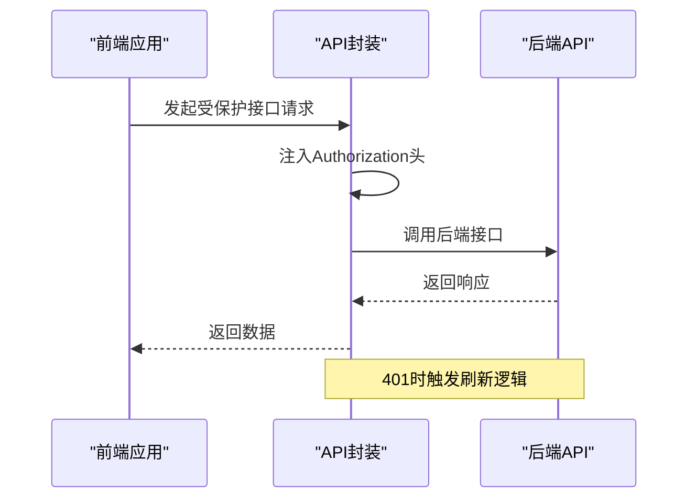
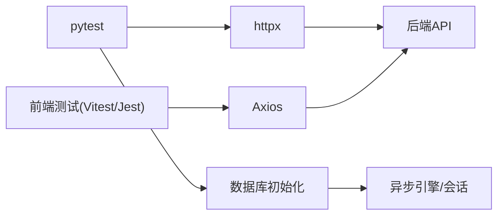

# 测试自动化

<cite>
**本文引用的文件**
- [README.md](file://README.md)
- [docker-compose.yml](file://docker-compose.yml)
- [backend/Dockerfile](file://backend/Dockerfile)
- [web/Dockerfile](file://web/Dockerfile)
- [backend/requirements.txt](file://backend/requirements.txt)
- [backend/app/config.py](file://backend/app/config.py)
- [backend/app/database.py](file://backend/app/database.py)
- [backend/app/models/strength.py](file://backend/app/models/strength.py)
- [backend/app/schemas/strength.py](file://backend/app/schemas/strength.py)
- [web/package.json](file://web/package.json)
- [web/src/services/api.ts](file://web/src/services/api.ts)
</cite>

## 目录
1. [简介](#简介)
2. [项目结构](#项目结构)
3. [核心组件](#核心组件)
4. [架构总览](#架构总览)
5. [详细组件分析](#详细组件分析)
6. [依赖分析](#依赖分析)
7. [性能考虑](#性能考虑)
8. [故障排查指南](#故障排查指南)
9. [结论](#结论)
10. [附录](#附录)

## 简介
本文件面向ActiveSynapse项目的测试自动化与持续集成（CI/CD）配置，目标是帮助开发者在本地与CI环境中实现：
- 测试环境自动搭建（数据库、缓存、后端、前端）
- 测试执行自动化（Python后端、Web前端）
- 测试报告生成与结果分析（覆盖率、性能、失败分析）
- 测试数据管理自动化（生成、清理、隔离）
- 并行测试、重试机制与结果通知
- 测试工具链集成（pytest、httpx、异步测试等）

ActiveSynapse是一个个人运动智能教练系统，后端基于FastAPI，前端基于React/Vite，采用PostgreSQL与Redis作为基础设施。

## 项目结构
项目采用多模块组织：后端（FastAPI）、前端（React/Vite）、数据库与缓存（PostgreSQL/Redis）、容器编排（Docker Compose）。测试自动化应覆盖后端API测试与前端UI测试，并通过Compose统一拉起依赖服务。

图表来源
- [docker-compose.yml](file://docker-compose.yml#L1-L81)
- [backend/Dockerfile](file://backend/Dockerfile#L1-L24)
- [web/Dockerfile](file://web/Dockerfile#L1-L17)
- [backend/requirements.txt](file://backend/requirements.txt#L1-L40)
- [backend/app/config.py](file://backend/app/config.py#L1-L45)
- [backend/app/database.py](file://backend/app/database.py#L1-L42)
- [backend/app/models/strength.py](file://backend/app/models/strength.py#L1-L69)
- [backend/app/schemas/strength.py](file://backend/app/schemas/strength.py#L1-L35)
- [web/package.json](file://web/package.json#L1-L36)
- [web/src/services/api.ts](file://web/src/services/api.ts#L1-L50)

章节来源
- [README.md](file://README.md#L1-L3)
- [docker-compose.yml](file://docker-compose.yml#L1-L81)

## 核心组件
- 容器化依赖服务：PostgreSQL（数据库）、Redis（缓存），由Compose健康检查保障可用性。
- 后端应用：FastAPI + SQLAlchemy异步ORM + Redis缓存；配置集中于settings，数据库连接与会话管理在独立模块中初始化。
- 前端应用：React + Vite，Axios封装API调用，支持鉴权拦截与刷新流程。
- 测试工具链：后端使用pytest与pytest-asyncio，HTTP客户端使用httpx；前端可使用Vitest/Jest（建议）进行单元与集成测试。

章节来源
- [docker-compose.yml](file://docker-compose.yml#L1-L81)
- [backend/app/config.py](file://backend/app/config.py#L1-L45)
- [backend/app/database.py](file://backend/app/database.py#L1-L42)
- [backend/requirements.txt](file://backend/requirements.txt#L32-L35)
- [web/package.json](file://web/package.json#L1-L36)
- [web/src/services/api.ts](file://web/src/services/api.ts#L1-L50)

## 架构总览
下图展示测试自动化在CI中的典型流程：拉起依赖服务 → 初始化数据库与表 → 运行后端测试 → 运行前端测试 → 生成报告与通知。

图表来源
- [docker-compose.yml](file://docker-compose.yml#L1-L81)
- [backend/app/database.py](file://backend/app/database.py#L39-L42)
- [backend/requirements.txt](file://backend/requirements.txt#L32-L35)
- [web/package.json](file://web/package.json#L1-L36)

## 详细组件分析

### 后端测试环境与执行
- 依赖服务：通过Compose拉起PostgreSQL与Redis，设置健康检查与依赖条件，确保后端在数据库与缓存就绪后再启动。
- 数据库初始化：后端提供异步引擎与会话工厂，以及初始化函数用于创建所有表。
- 配置注入：后端settings从环境变量读取数据库与Redis连接信息，便于在容器内运行时替换。
- 测试工具：requirements中包含pytest与pytest-asyncio，httpx用于HTTP测试客户端。

图表来源
- [docker-compose.yml](file://docker-compose.yml#L16-L20)
- [docker-compose.yml](file://docker-compose.yml#L30-L34)
- [docker-compose.yml](file://docker-compose.yml#L54-L58)
- [backend/app/database.py](file://backend/app/database.py#L39-L42)
- [backend/requirements.txt](file://backend/requirements.txt#L32-L35)

章节来源
- [docker-compose.yml](file://docker-compose.yml#L1-L81)
- [backend/app/config.py](file://backend/app/config.py#L11-L16)
- [backend/app/database.py](file://backend/app/database.py#L1-L42)
- [backend/requirements.txt](file://backend/requirements.txt#L32-L35)

### 前端测试环境与执行
- 依赖安装：前端使用npm脚本与Vite开发服务器，Dockerfile中已安装依赖并暴露端口。
- API封装：前端通过Axios封装基础URL、请求拦截器（携带Token）与响应拦截器（401重试与刷新）。
- 测试建议：可在CI中使用Vitest或Jest运行前端测试，结合Playwright/Cypress进行端到端测试。

图表来源
- [web/Dockerfile](file://web/Dockerfile#L1-L17)
- [web/package.json](file://web/package.json#L1-L36)
- [web/src/services/api.ts](file://web/src/services/api.ts#L1-L50)

章节来源
- [web/Dockerfile](file://web/Dockerfile#L1-L17)
- [web/package.json](file://web/package.json#L1-L36)
- [web/src/services/api.ts](file://web/src/services/api.ts#L1-L50)

### 测试数据管理自动化
- 数据隔离：使用Compose卷持久化PostgreSQL与Redis数据，避免测试间互相污染；必要时可为测试环境创建独立数据库。
- 数据生成：在测试前置条件中插入最小化数据集，或使用工厂模式/fixture生成测试数据。
- 数据清理：测试结束后回滚事务或删除临时数据；对持久化卷可选择性清理或重建容器。
- 环境隔离：通过环境变量切换测试数据库URL与Redis实例，确保多分支并发测试互不干扰。

章节来源
- [docker-compose.yml](file://docker-compose.yml#L14-L15)
- [docker-compose.yml](file://docker-compose.yml#L28-L29)
- [backend/app/config.py](file://backend/app/config.py#L11-L16)

### 测试报告与结果分析
- 覆盖率：pytest结合coverage.py生成覆盖率报告，建议在CI中上传覆盖率至codecov或类似平台。
- 性能测试：可引入pytest-benchmark或locust进行后端接口与前端页面加载性能评估。
- 失败分析：收集测试日志、数据库快照与后端堆栈，结合CI工件保存失败用例与截图（前端）。

章节来源
- [backend/requirements.txt](file://backend/requirements.txt#L32-L35)

### 并行测试、重试与通知
- 并行：pytest-xdist可并行执行测试用例；前端测试可按模块并行运行。
- 重试：pytest-rerunfailures支持失败重试；前端测试可配置重试策略。
- 通知：在CI中集成Slack、Microsoft Teams或GitHub通知，失败时自动提醒。

章节来源
- [backend/requirements.txt](file://backend/requirements.txt#L32-L35)

### 测试工具集成
- pytest：用于后端异步接口测试，结合httpx发起HTTP请求，使用fixtures管理测试数据与会话。
- httpx：支持同步与异步HTTP客户端，适合FastAPI应用测试。
- 前端测试：建议使用Vitest/Jest进行单元测试，Cypress/Playwright进行端到端测试。

章节来源
- [backend/requirements.txt](file://backend/requirements.txt#L32-L35)
- [web/package.json](file://web/package.json#L1-L36)

## 依赖分析
后端测试依赖关系如下：pytest驱动测试执行，httpx发起HTTP请求，数据库初始化与会话工厂提供数据访问层支撑；前端测试依赖Vite与Axios。

图表来源
- [backend/requirements.txt](file://backend/requirements.txt#L32-L35)
- [backend/app/database.py](file://backend/app/database.py#L1-L42)
- [web/package.json](file://web/package.json#L1-L36)
- [web/src/services/api.ts](file://web/src/services/api.ts#L1-L50)

章节来源
- [backend/requirements.txt](file://backend/requirements.txt#L32-L35)
- [backend/app/database.py](file://backend/app/database.py#L1-L42)
- [web/package.json](file://web/package.json#L1-L36)
- [web/src/services/api.ts](file://web/src/services/api.ts#L1-L50)

## 性能考虑
- 数据库连接池：生产使用连接池，测试阶段可采用无池或小连接数以降低成本。
- 异步测试：pytest-asyncio支持异步测试，减少I/O阻塞，提升测试吞吐。
- 前端测试：优先使用内存态渲染与Mock API，避免真实网络请求影响性能。
- 缓存命中：Redis在测试中可禁用或清空，避免状态干扰。

## 故障排查指南
- 依赖未就绪：检查Compose健康检查与depends_on条件，确认PostgreSQL/Redis端口映射与卷挂载。
- 数据库连接失败：核对settings中的DATABASE_URL与容器网络，确保后端容器可解析postgres/redis主机名。
- 测试超时：调整pytest超时参数，或拆分大测试用例；前端测试增加等待时间与断言重试。
- 覆盖率异常：确保测试路径正确，忽略无关文件；在CI中统一覆盖率阈值与上报。

章节来源
- [docker-compose.yml](file://docker-compose.yml#L16-L20)
- [docker-compose.yml](file://docker-compose.yml#L30-L34)
- [backend/app/config.py](file://backend/app/config.py#L11-L16)

## 结论
通过Compose统一拉起依赖服务、pytest驱动后端测试、Vite与Axios支撑前端测试，配合覆盖率与性能报告，可构建稳定高效的测试自动化体系。建议在CI中启用并行执行、失败重试与通知，持续优化测试数据管理与环境隔离策略。

## 附录
- 快速清单
  - 使用Compose启动PostgreSQL/Redis/后端/前端
  - 在后端执行数据库初始化
  - 运行pytest与前端测试套件
  - 生成覆盖率与性能报告
  - 失败时收集日志与截图并通知团队