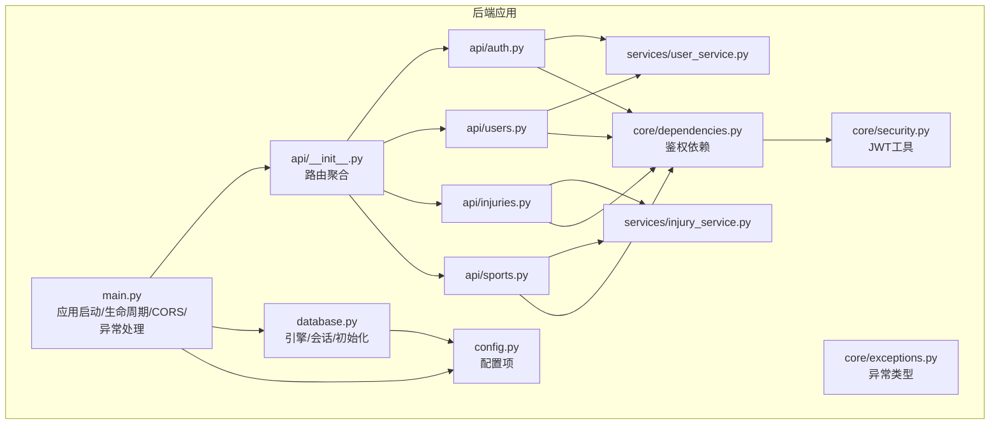
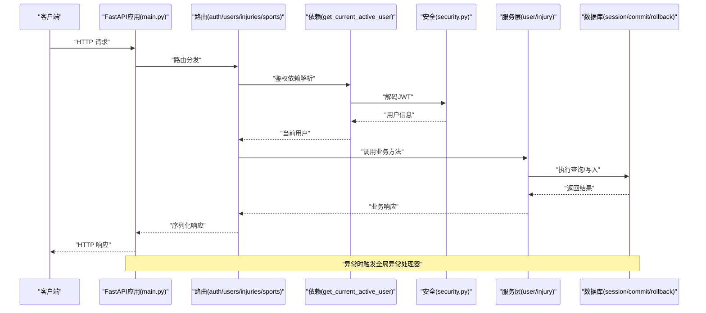
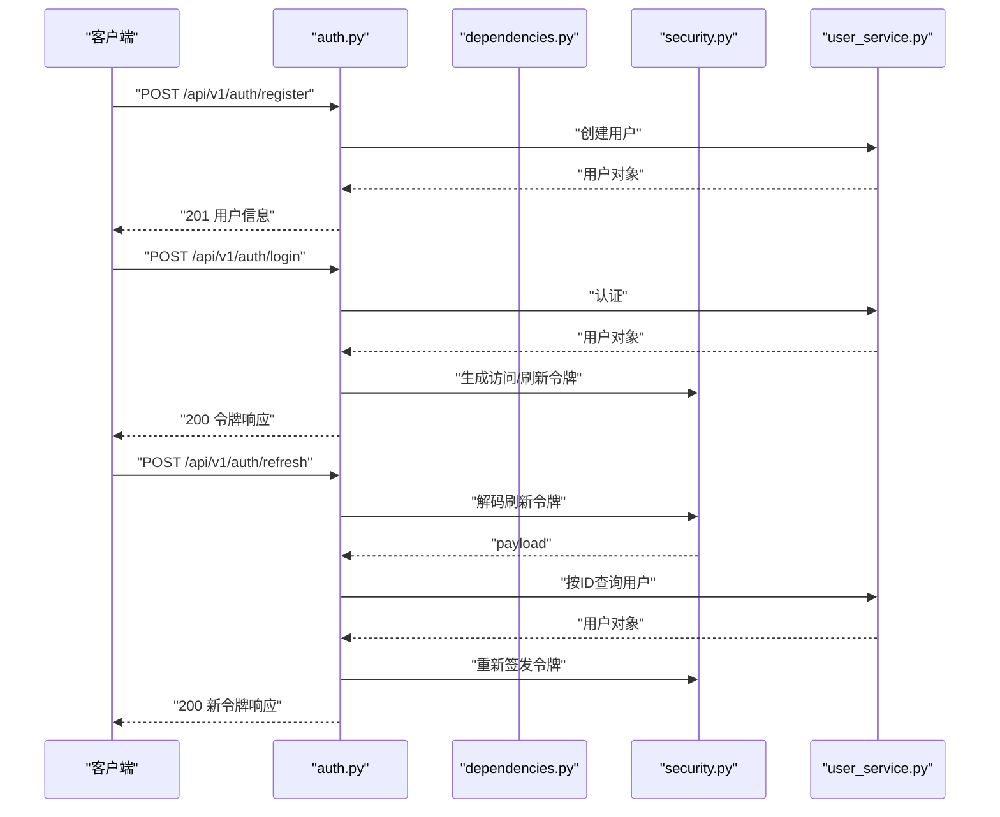
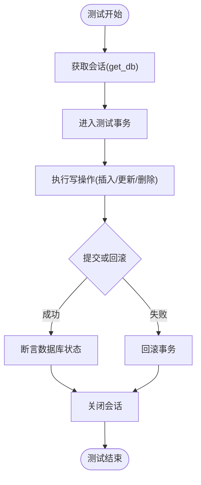
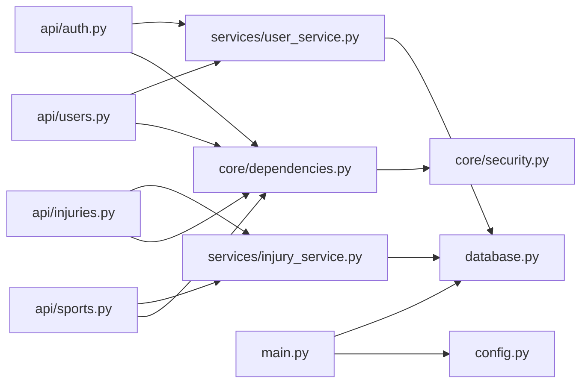

# 集成测试

<cite>
**本文引用的文件**
- [backend/app/main.py](file://backend/app/main.py)
- [backend/docker-compose.yml](file://backend/docker-compose.yml)
- [backend/app/config.py](file://backend/app/config.py)
- [backend/app/database.py](file://backend/app/database.py)
- [backend/app/api/__init__.py](file://backend/app/api/__init__.py)
- [backend/app/api/auth.py](file://backend/app/api/auth.py)
- [backend/app/api/users.py](file://backend/app/api/users.py)
- [backend/app/api/injuries.py](file://backend/app/api/injuries.py)
- [backend/app/api/sports.py](file://backend/app/api/sports.py)
- [backend/app/core/dependencies.py](file://backend/app/core/dependencies.py)
- [backend/app/core/security.py](file://backend/app/core/security.py)
- [backend/app/core/exceptions.py](file://backend/app/core/exceptions.py)
- [backend/app/services/user_service.py](file://backend/app/services/user_service.py)
- [backend/app/services/injury_service.py](file://backend/app/services/injury_service.py)
</cite>

## 目录
1. [引言](#引言)
2. [项目结构](#项目结构)
3. [核心组件](#核心组件)
4. [架构总览](#架构总览)
5. [详细组件分析](#详细组件分析)
6. [依赖分析](#依赖分析)
7. [性能考虑](#性能考虑)
8. [故障排查指南](#故障排查指南)
9. [结论](#结论)
10. [附录](#附录)

## 引言
本文件面向ActiveSynapse后端的集成测试，系统性阐述API端到端测试、数据库持久化与事务测试、外部服务（OpenAI等）集成测试、测试环境搭建与隔离、并发与清理策略，以及编写最佳实践与故障排查方法。文档以实际源码为依据，结合架构图与流程图，帮助开发者高效构建稳定可靠的集成测试体系。

## 项目结构
后端采用FastAPI + SQLAlchemy异步ORM + PostgreSQL + Redis的典型架构。应用通过主入口启动，注册CORS与异常处理器，挂载统一的API路由前缀，并在生命周期中初始化数据库表。测试应覆盖以下关键路径：API路由与中间件、依赖注入链路、数据库事务与连接池、安全令牌与鉴权、服务层业务逻辑、以及外部服务调用。

图表来源
- [backend/app/main.py](file://backend/app/main.py#L1-L77)
- [backend/app/api/__init__.py](file://backend/app/api/__init__.py#L1-L10)
- [backend/app/api/auth.py](file://backend/app/api/auth.py#L1-L92)
- [backend/app/api/users.py](file://backend/app/api/users.py#L1-L88)
- [backend/app/api/injuries.py](file://backend/app/api/injuries.py#L1-L92)
- [backend/app/api/sports.py](file://backend/app/api/sports.py#L1-L127)
- [backend/app/core/dependencies.py](file://backend/app/core/dependencies.py#L1-L61)
- [backend/app/core/security.py](file://backend/app/core/security.py#L1-L50)
- [backend/app/core/exceptions.py](file://backend/app/core/exceptions.py#L1-L54)
- [backend/app/services/user_service.py](file://backend/app/services/user_service.py#L1-L120)
- [backend/app/services/injury_service.py](file://backend/app/services/injury_service.py#L1-L115)
- [backend/app/database.py](file://backend/app/database.py#L1-L43)
- [backend/app/config.py](file://backend/app/config.py#L1-L46)

章节来源
- [backend/app/main.py](file://backend/app/main.py#L1-L77)
- [backend/app/api/__init__.py](file://backend/app/api/__init__.py#L1-L10)

## 核心组件
- 应用生命周期与中间件
  - 启动时初始化数据库表；关闭时结束生命周期。
  - 注册CORS中间件，允许跨域请求。
  - 全局异常处理器将自定义异常转换为JSON响应。
- 数据库与会话
  - 使用异步引擎与会话工厂；提供依赖注入函数以获取会话。
  - 会话在异常时自动回滚，确保测试隔离。
- 安全与鉴权
  - 基于HTTP Bearer的JWT鉴权；支持访问令牌与刷新令牌。
  - 提供当前用户与活跃用户依赖，用于路由保护。
- 路由与服务
  - 统一前缀/api/v1；各模块路由按功能划分。
  - 服务层封装业务逻辑，使用SQLAlchemy异步查询与提交。

章节来源
- [backend/app/main.py](file://backend/app/main.py#L12-L57)
- [backend/app/database.py](file://backend/app/database.py#L26-L42)
- [backend/app/core/dependencies.py](file://backend/app/core/dependencies.py#L11-L60)
- [backend/app/core/security.py](file://backend/app/core/security.py#L21-L49)
- [backend/app/api/__init__.py](file://backend/app/api/__init__.py#L4-L9)

## 架构总览
下图展示从客户端到数据库的端到端调用链，以及异常处理与依赖注入的关键节点。

图表来源
- [backend/app/main.py](file://backend/app/main.py#L21-L57)
- [backend/app/api/auth.py](file://backend/app/api/auth.py#L17-L49)
- [backend/app/api/users.py](file://backend/app/api/users.py#L13-L36)
- [backend/app/api/injuries.py](file://backend/app/api/injuries.py#L13-L29)
- [backend/app/api/sports.py](file://backend/app/api/sports.py#L14-L34)
- [backend/app/core/dependencies.py](file://backend/app/core/dependencies.py#L11-L50)
- [backend/app/core/security.py](file://backend/app/core/security.py#L43-L49)
- [backend/app/services/user_service.py](file://backend/app/services/user_service.py#L14-L59)
- [backend/app/services/injury_service.py](file://backend/app/services/injury_service.py#L13-L56)
- [backend/app/database.py](file://backend/app/database.py#L26-L36)

## 详细组件分析

### API路由与中间件测试
- 测试要点
  - 根路径与健康检查接口可用性。
  - CORS跨域头正确下发，前端可正常访问。
  - 全局异常处理器对AppException与通用异常的响应格式一致。
- 关键路径
  - 应用启动与生命周期：[backend/app/main.py](file://backend/app/main.py#L12-L18)
  - CORS中间件注册：[backend/app/main.py](file://backend/app/main.py#L28-L35)
  - 异常处理器注册与实现：[backend/app/main.py](file://backend/app/main.py#L38-L53)
  - 路由聚合与前缀：[backend/app/api/__init__.py](file://backend/app/api/__init__.py#L4-L9)

章节来源
- [backend/app/main.py](file://backend/app/main.py#L21-L57)
- [backend/app/api/__init__.py](file://backend/app/api/__init__.py#L4-L9)

### 认证与授权测试
- 测试要点
  - 用户注册：邮箱/用户名唯一性约束、密码哈希、默认状态。
  - 登录：邮箱密码校验、访问/刷新令牌生成、用户信息返回。
  - 刷新：刷新令牌有效性与过期控制、用户状态校验。
  - 退出：返回标准消息。
  - 鉴权依赖：无效/过期令牌、非活跃用户、用户不存在的错误分支。
- 关键路径
  - 认证路由：[backend/app/api/auth.py](file://backend/app/api/auth.py#L17-L89)
  - 鉴权依赖：[backend/app/core/dependencies.py](file://backend/app/core/dependencies.py#L11-L50)
  - 安全工具：[backend/app/core/security.py](file://backend/app/core/security.py#L21-L49)
  - 用户服务：[backend/app/services/user_service.py](file://backend/app/services/user_service.py#L29-L68)

图表来源
- [backend/app/api/auth.py](file://backend/app/api/auth.py#L17-L89)
- [backend/app/core/dependencies.py](file://backend/app/core/dependencies.py#L11-L50)
- [backend/app/core/security.py](file://backend/app/core/security.py#L21-L49)
- [backend/app/services/user_service.py](file://backend/app/services/user_service.py#L29-L68)

章节来源
- [backend/app/api/auth.py](file://backend/app/api/auth.py#L17-L89)
- [backend/app/core/dependencies.py](file://backend/app/core/dependencies.py#L11-L50)
- [backend/app/core/security.py](file://backend/app/core/security.py#L21-L49)
- [backend/app/services/user_service.py](file://backend/app/services/user_service.py#L29-L68)

### 用户资料与头像上传测试
- 测试要点
  - 获取/更新当前用户信息与个人资料。
  - 头像上传占位接口返回文件元信息。
  - 依赖注入与鉴权链路验证。
- 关键路径
  - 用户路由：[backend/app/api/users.py](file://backend/app/api/users.py#L13-L87)
  - 用户服务：[backend/app/services/user_service.py](file://backend/app/services/user_service.py#L97-L119)

章节来源
- [backend/app/api/users.py](file://backend/app/api/users.py#L13-L87)
- [backend/app/services/user_service.py](file://backend/app/services/user_service.py#L97-L119)

### 损伤记录与统计测试
- 测试要点
  - 分页列表、条件过滤（仅进行中）、详情查询、更新、删除。
  - 统计摘要：总数、进行中、复发次数、按部位与类型的分布。
  - 未拥有资源的访问拒绝。
- 关键路径
  - 损伤路由：[backend/app/api/injuries.py](file://backend/app/api/injuries.py#L13-L91)
  - 损伤服务：[backend/app/services/injury_service.py](file://backend/app/services/injury_service.py#L13-L114)

章节来源
- [backend/app/api/injuries.py](file://backend/app/api/injuries.py#L13-L91)
- [backend/app/services/injury_service.py](file://backend/app/services/injury_service.py#L13-L114)

### 运动记录与统计测试
- 测试要点
  - 运动记录分页与多维过滤（运动类型、起止时间）。
  - 统计与周汇总：按类型与天数聚合。
  - GPX导入占位接口。
- 关键路径
  - 运动路由：[backend/app/api/sports.py](file://backend/app/api/sports.py#L14-L126)
  - 损伤服务（复用）：[backend/app/services/injury_service.py](file://backend/app/services/injury_service.py#L13-L114)

章节来源
- [backend/app/api/sports.py](file://backend/app/api/sports.py#L14-L126)
- [backend/app/services/injury_service.py](file://backend/app/services/injury_service.py#L13-L114)

### 数据库集成测试策略
- 策略概览
  - 数据持久化：通过服务层写入/更新/删除，断言数据库状态。
  - 事务处理：利用依赖注入的会话生命周期，异常时回滚，成功时提交。
  - 连接池管理：使用NullPool便于测试隔离与快速回收；生产建议使用专用连接池。
- 关键路径
  - 会话依赖与事务语义：[backend/app/database.py](file://backend/app/database.py#L26-L36)
  - 表初始化：[backend/app/database.py](file://backend/app/database.py#L39-L42)
  - 配置项：[backend/app/config.py](file://backend/app/config.py#L11-L13)

图表来源
- [backend/app/database.py](file://backend/app/database.py#L26-L36)

章节来源
- [backend/app/database.py](file://backend/app/database.py#L26-L42)
- [backend/app/config.py](file://backend/app/config.py#L11-L13)

### 外部服务集成测试
- OpenAI API集成测试
  - 场景：当AI相关功能启用时，验证API调用、错误重试与降级策略。
  - 关键点：配置项OPENAI_API_KEY与模型名；对外部服务超时与限流的健壮性。
  - 参考配置：[backend/app/config.py](file://backend/app/config.py#L24-L26)
- 文件处理服务测试
  - 场景：头像上传与GPX导入占位接口，验证文件元信息与占位响应。
  - 关键点：文件大小限制、内容类型、上传目录配置。
  - 参考配置：[backend/app/config.py](file://backend/app/config.py#L28-L30)
  - 占位实现：[backend/app/api/users.py](file://backend/app/api/users.py#L74-L87)、[backend/app/api/sports.py](file://backend/app/api/sports.py#L116-L126)

章节来源
- [backend/app/config.py](file://backend/app/config.py#L24-L30)
- [backend/app/api/users.py](file://backend/app/api/users.py#L74-L87)
- [backend/app/api/sports.py](file://backend/app/api/sports.py#L116-L126)

### 测试环境搭建指南
- 测试数据库
  - 使用PostgreSQL容器，暴露5432端口，卷持久化数据。
  - 参考Compose服务：[backend/docker-compose.yml](file://backend/docker-compose.yml#L4-L21)
  - 应用连接串：[backend/app/config.py](file://backend/app/config.py#L12)
- 缓存与队列
  - Redis容器，端口映射与健康检查。
  - 参考Compose服务：[backend/docker-compose.yml](file://backend/docker-compose.yml#L22-L34)
  - 应用连接串：[backend/app/config.py](file://backend/app/config.py#L15)
- 后端服务
  - 通过Uvicorn运行应用，挂载源码以便热重载。
  - 参考Compose服务：[backend/docker-compose.yml](file://backend/docker-compose.yml#L36-L59)
- 前端联调
  - Web容器通过VITE_API_URL指向后端API。
  - 参考Compose服务：[backend/docker-compose.yml](file://backend/docker-compose.yml#L61-L76)

章节来源
- [backend/docker-compose.yml](file://backend/docker-compose.yml#L4-L76)
- [backend/app/config.py](file://backend/app/config.py#L12-L16)

### 依赖注入与中间件测试
- 依赖注入
  - 会话依赖：每次请求获取新会话，异常回滚，finally关闭。
  - 当前用户依赖：解析Bearer令牌、校验payload、查询用户并校验状态。
- 中间件
  - CORS中间件允许所有方法与头，生产需收敛白名单。
- 关键路径
  - 会话依赖：[backend/app/database.py](file://backend/app/database.py#L26-L36)
  - 当前用户依赖：[backend/app/core/dependencies.py](file://backend/app/core/dependencies.py#L11-L50)
  - CORS注册：[backend/app/main.py](file://backend/app/main.py#L28-L35)

章节来源
- [backend/app/database.py](file://backend/app/database.py#L26-L36)
- [backend/app/core/dependencies.py](file://backend/app/core/dependencies.py#L11-L50)
- [backend/app/main.py](file://backend/app/main.py#L28-L35)

## 依赖分析
- 组件耦合
  - 路由依赖服务层；服务层依赖数据库会话；鉴权依赖安全工具。
  - 异常类型集中定义，便于统一处理。
- 外部依赖
  - 数据库：PostgreSQL（异步驱动）
  - 缓存：Redis
  - 安全：JWTSign/JWTVerify
- 循环依赖
  - 未发现直接循环；路由与服务通过依赖注入解耦。

图表来源
- [backend/app/api/auth.py](file://backend/app/api/auth.py#L1-L11)
- [backend/app/api/users.py](file://backend/app/api/users.py#L1-L8)
- [backend/app/api/injuries.py](file://backend/app/api/injuries.py#L1-L8)
- [backend/app/api/sports.py](file://backend/app/api/sports.py#L1-L9)
- [backend/app/services/user_service.py](file://backend/app/services/user_service.py#L1-L7)
- [backend/app/services/injury_service.py](file://backend/app/services/injury_service.py#L1-L6)
- [backend/app/core/dependencies.py](file://backend/app/core/dependencies.py#L1-L6)
- [backend/app/core/security.py](file://backend/app/core/security.py#L1-L5)
- [backend/app/database.py](file://backend/app/database.py#L1-L3)
- [backend/app/main.py](file://backend/app/main.py#L1-L9)
- [backend/app/config.py](file://backend/app/config.py#L1-L6)

章节来源
- [backend/app/api/auth.py](file://backend/app/api/auth.py#L1-L11)
- [backend/app/api/users.py](file://backend/app/api/users.py#L1-L8)
- [backend/app/api/injuries.py](file://backend/app/api/injuries.py#L1-L8)
- [backend/app/api/sports.py](file://backend/app/api/sports.py#L1-L9)
- [backend/app/services/user_service.py](file://backend/app/services/user_service.py#L1-L7)
- [backend/app/services/injury_service.py](file://backend/app/services/injury_service.py#L1-L6)
- [backend/app/core/dependencies.py](file://backend/app/core/dependencies.py#L1-L6)
- [backend/app/core/security.py](file://backend/app/core/security.py#L1-L5)
- [backend/app/database.py](file://backend/app/database.py#L1-L3)
- [backend/app/main.py](file://backend/app/main.py#L1-L9)
- [backend/app/config.py](file://backend/app/config.py#L1-L6)

## 性能考虑
- 连接池
  - 测试阶段使用NullPool简化隔离；生产建议配置专用连接池参数（最大连接数、空闲连接、超时）。
- 查询优化
  - 对高频查询添加索引（如用户邮箱、运动记录的用户ID与时间范围）。
- 并发与锁
  - 在高并发场景下，注意唯一性约束冲突与乐观锁策略。
- 缓存
  - 对热点读取（如用户资料）引入Redis缓存，减少数据库压力。

## 故障排查指南
- 常见问题
  - 401未认证：检查Bearer令牌是否携带、类型是否为access、payload是否有效。
  - 403禁止访问：检查用户是否激活。
  - 404资源不存在：确认资源ID与所属用户匹配。
  - 409冲突：邮箱/用户名重复。
  - 500服务器错误：全局异常处理器已捕获，检查日志定位具体异常。
- 排查步骤
  - 校验CORS配置与Origin白名单。
  - 检查数据库连接串与容器健康状态。
  - 查看会话依赖的commit/rollback是否按预期执行。
  - 核对JWT密钥、算法与过期时间配置。
- 关键路径
  - 异常类型与HTTP状态映射：[backend/app/core/exceptions.py](file://backend/app/core/exceptions.py#L4-L53)
  - 全局异常处理器：[backend/app/main.py](file://backend/app/main.py#L38-L53)
  - 会话事务语义：[backend/app/database.py](file://backend/app/database.py#L26-L36)

章节来源
- [backend/app/core/exceptions.py](file://backend/app/core/exceptions.py#L4-L53)
- [backend/app/main.py](file://backend/app/main.py#L38-L53)
- [backend/app/database.py](file://backend/app/database.py#L26-L36)

## 结论
通过围绕路由、依赖注入、服务层与数据库的端到端测试，结合异常处理与外部服务的集成验证，可以有效保障ActiveSynapse后端在真实环境中的稳定性与一致性。建议在CI中自动化执行数据库初始化、会话事务验证与关键业务流程回归，持续提升质量与交付效率。

## 附录
- 测试数据准备
  - 准备测试用户与关联资料，确保邮箱/用户名唯一。
  - 生成有效与无效的JWT令牌用于鉴权与刷新场景。
- 测试隔离与清理
  - 每个测试使用独立会话，失败时回滚；测试结束后重建或清空相关表。
- 并发测试
  - 使用多个客户端并发发起请求，验证唯一性约束与幂等性。
- 最佳实践
  - 将数据库初始化与会话依赖作为测试前置步骤。
  - 对外部服务调用使用可配置的超时与重试策略。
  - 在Docker Compose中固定版本，确保测试环境一致性。