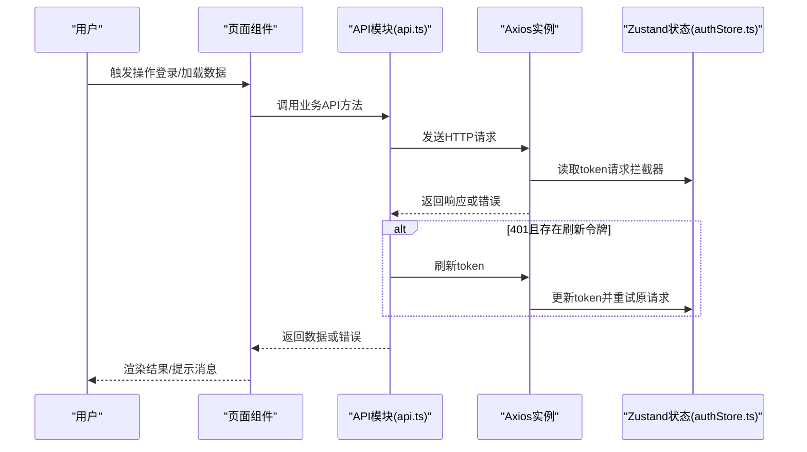
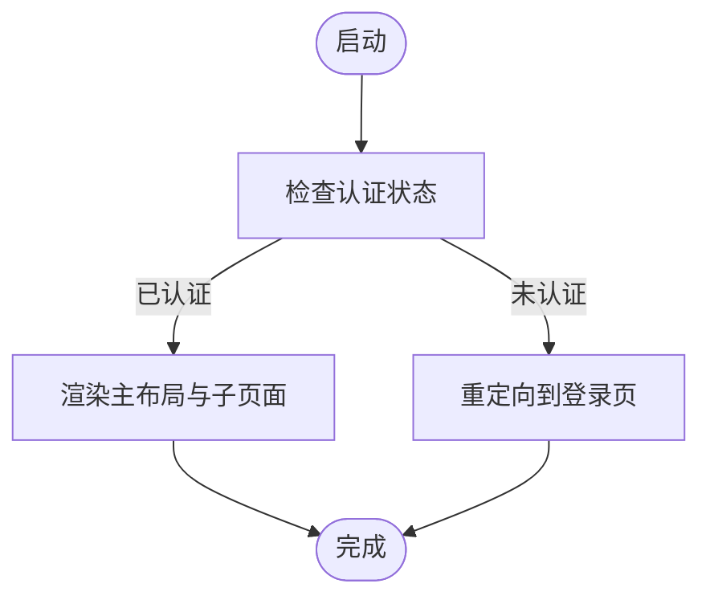
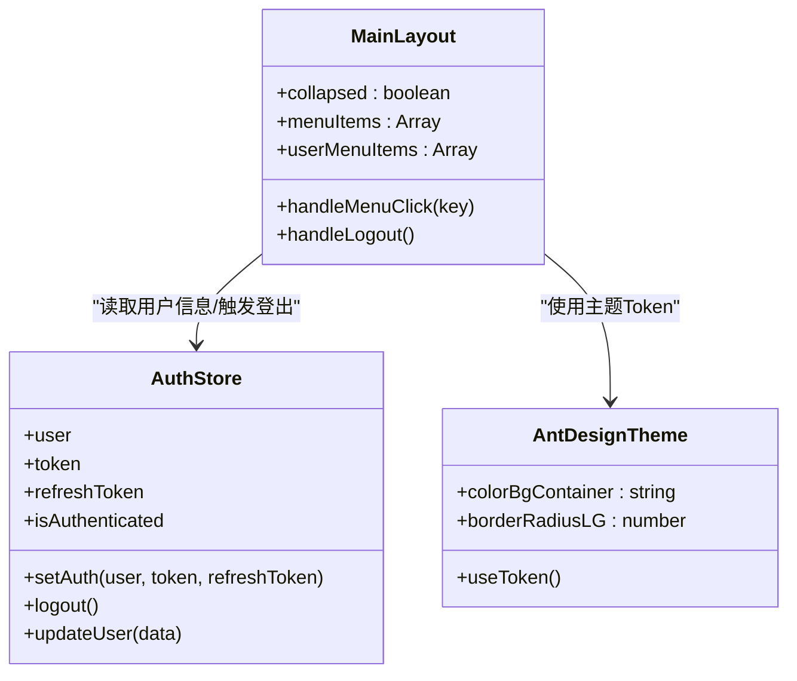
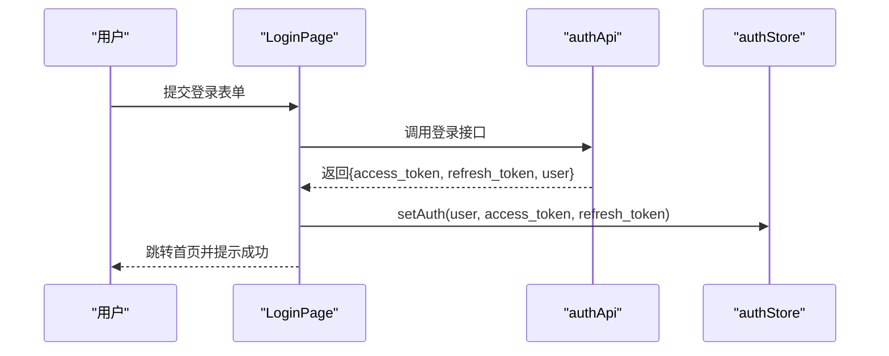
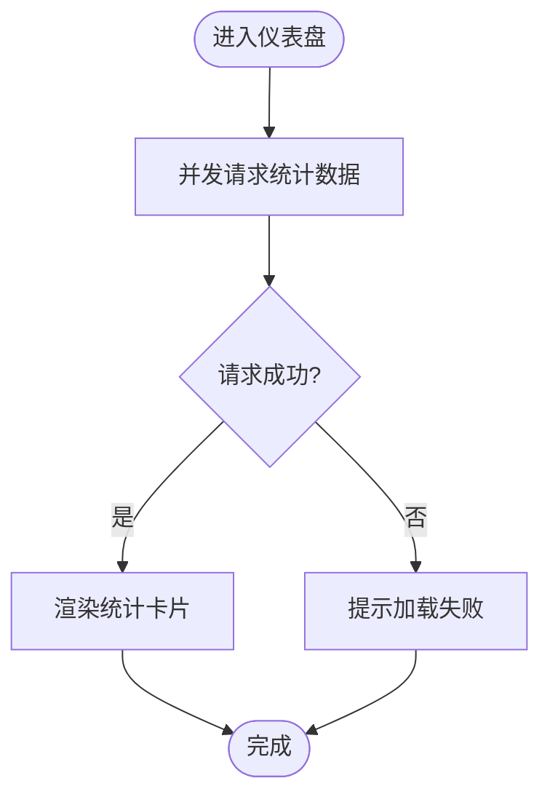
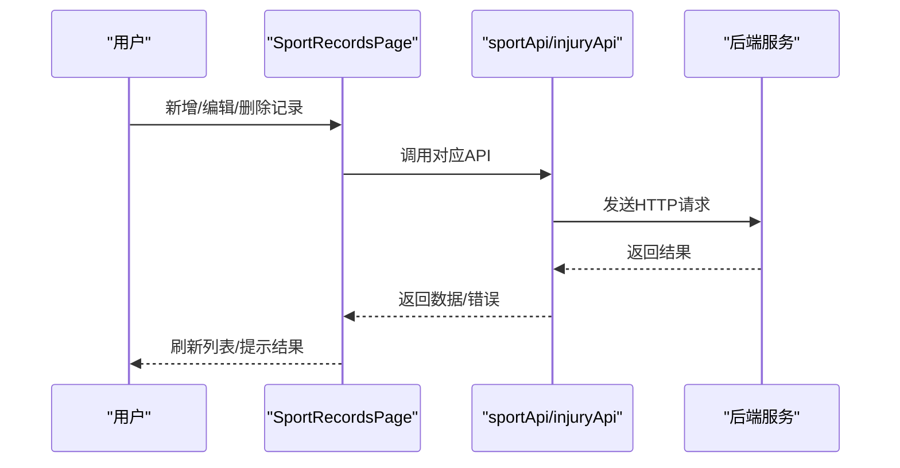
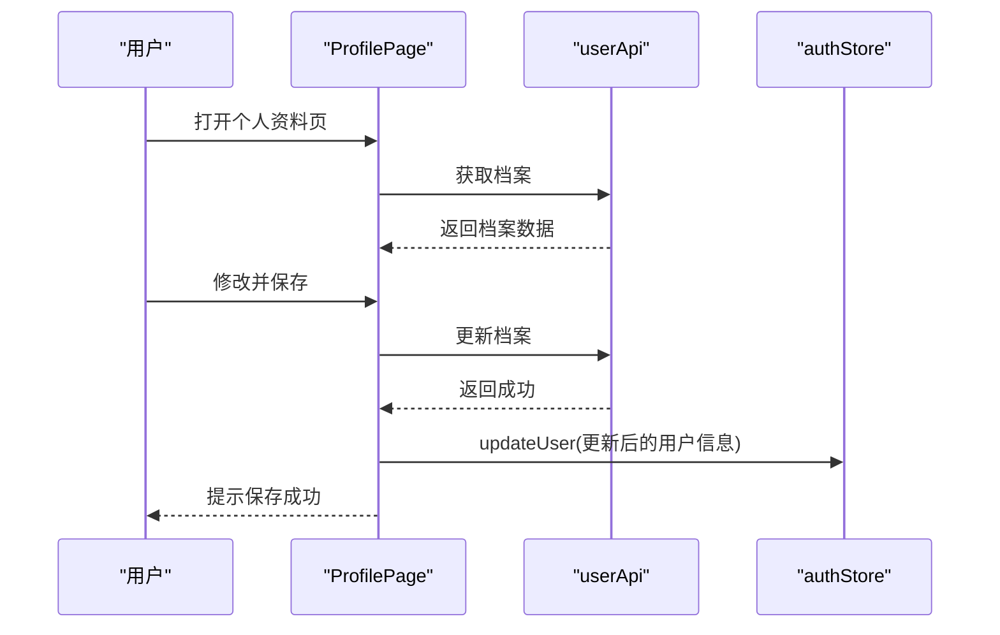
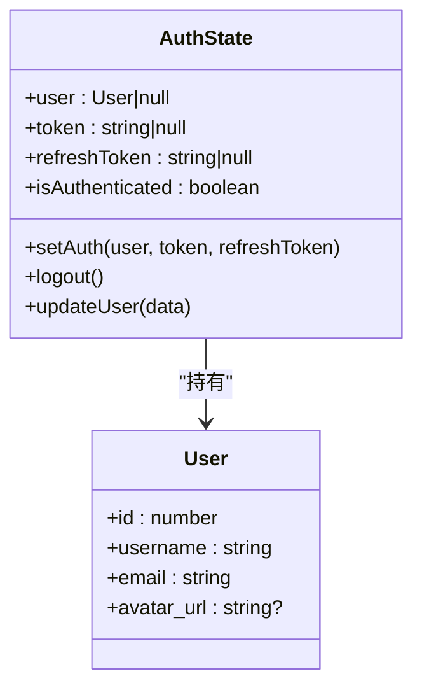
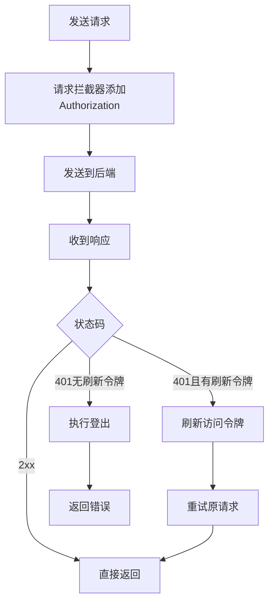
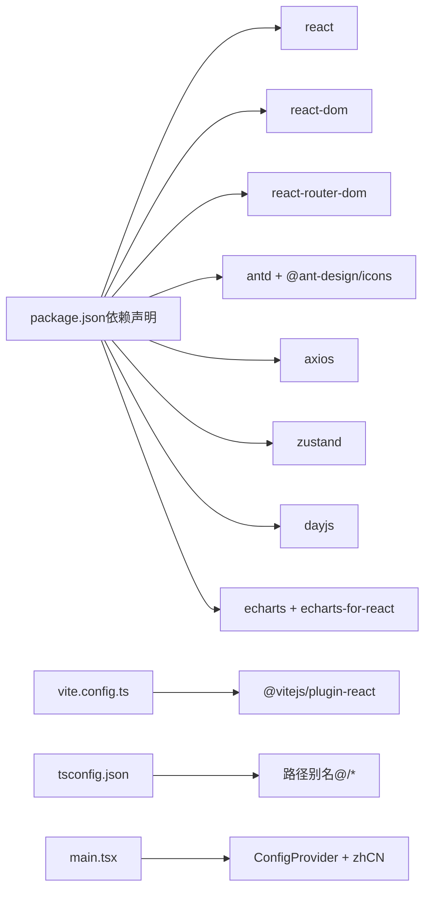

# 前端架构设计

<cite>
**本文档引用的文件**
- [web/src/App.tsx](file://web/src/App.tsx)
- [web/src/main.tsx](file://web/src/main.tsx)
- [web/vite.config.ts](file://web/vite.config.ts)
- [web/tsconfig.json](file://web/tsconfig.json)
- [web/tsconfig.node.json](file://web/tsconfig.node.json)
- [web/package.json](file://web/package.json)
- [web/src/stores/authStore.ts](file://web/src/stores/authStore.ts)
- [web/src/services/api.ts](file://web/src/services/api.ts)
- [web/src/components/MainLayout.tsx](file://web/src/components/MainLayout.tsx)
- [web/src/pages/DashboardPage.tsx](file://web/src/pages/DashboardPage.tsx)
- [web/src/pages/LoginPage.tsx](file://web/src/pages/LoginPage.tsx)
- [web/src/pages/RegisterPage.tsx](file://web/src/pages/RegisterPage.tsx)
- [web/src/pages/ProfilePage.tsx](file://web/src/pages/ProfilePage.tsx)
- [web/src/pages/SportRecordsPage.tsx](file://web/src/pages/SportRecordsPage.tsx)
- [web/src/pages/InjuryRecordsPage.tsx](file://web/src/pages/InjuryRecordsPage.tsx)
- [web/index.html](file://web/index.html)
- [web/src/index.css](file://web/src/index.css)
</cite>

## 更新摘要
**所做更改**
- 更新了项目结构描述，反映完整的React + TypeScript + Ant Design架构
- 新增了国际化配置和主题系统的说明
- 完善了组件层次结构图，包含ConfigProvider和主题系统
- 更新了依赖关系分析，突出Ant Design生态系统的集成
- 增强了UI组件库的使用说明和样式定制方案
- 补充了TypeScript配置和路径别名的详细说明

## 目录
1. [简介](#简介)
2. [项目结构](#项目结构)
3. [核心组件](#核心组件)
4. [架构总览](#架构总览)
5. [详细组件分析](#详细组件分析)
6. [依赖关系分析](#依赖关系分析)
7. [性能考虑](#性能考虑)
8. [故障排除指南](#故障排除指南)
9. [结论](#结论)

## 简介
ActiveSynapse前端采用现代化的React 18 + TypeScript技术栈，结合Vite构建工具，使用Ant Design作为主要UI组件库，Zustand进行状态管理，并通过Axios封装统一API调用。应用提供用户认证、运动记录管理、伤病记录管理与个人资料维护等核心功能，路由采用React Router DOM v6，支持登录保护与侧边导航。系统集成了完整的国际化配置（简体中文）和主题定制功能，提供一致且美观的用户体验。

## 项目结构
前端位于web目录，采用按功能分层的组织方式，完全基于React + TypeScript + Ant Design架构：
- src/components：可复用布局与通用组件（如MainLayout），集成Ant Design布局系统
- src/pages：页面级组件（登录、注册、仪表盘、运动记录、伤病记录、个人资料），使用Ant Design表单和表格组件
- src/stores：Zustand全局状态（当前仅包含认证状态），支持持久化存储
- src/services：Axios封装与API接口模块化导出，统一错误处理和认证管理
- 根目录：Vite配置、TypeScript配置、包管理与国际化配置

```mermaid
graph TB
subgraph "应用入口层"
MAIN["main.tsx<br/>国际化与严格模式配置"]
CONFIG["ConfigProvider<br/>Ant Design国际化配置"]
END
subgraph "应用核心层"
APP["App.tsx<br/>路由与受保护路由"]
PROTECTED["ProtectedRoute<br/>认证守卫"]
end
subgraph "页面层"
LOGIN["LoginPage.tsx<br/>登录表单与验证"]
REGISTER["RegisterPage.tsx<br/>注册表单与验证"]
DASHBOARD["DashboardPage.tsx<br/>统计卡片与图表"]
SPORTS["SportRecordsPage.tsx<br/>运动记录管理"]
INJURIES["InjuryRecordsPage.tsx<br/>伤病记录管理"]
PROFILE["ProfilePage.tsx<br/>个人资料编辑"]
end
subgraph "组件层"
LAYOUT["MainLayout.tsx<br/>侧边栏与头部导航"]
THEME["主题系统<br/>Ant Design Token"]
end
subgraph "状态与服务层"
AUTHSTORE["authStore.ts<br/>Zustand认证状态"]
API["api.ts<br/>Axios封装与拦截器"]
END
MAIN --> CONFIG
CONFIG --> APP
APP --> PROTECTED
APP --> LAYOUT
APP --> LOGIN
APP --> REGISTER
APP --> DASHBOARD
APP --> SPORTS
APP --> INJURIES
APP --> PROFILE
LOGIN --> AUTHSTORE
REGISTER --> API
DASHBOARD --> API
SPORTS --> API
INJURIES --> API
PROFILE --> API
LAYOUT --> AUTHSTORE
LAYOUT --> THEME
```

**图表来源**
- [web/src/main.tsx:1-15](file://web/src/main.tsx#L1-L15)
- [web/src/App.tsx:1-48](file://web/src/App.tsx#L1-L48)
- [web/src/components/MainLayout.tsx:1-121](file://web/src/components/MainLayout.tsx#L1-L121)
- [web/src/stores/authStore.ts:1-52](file://web/src/stores/authStore.ts#L1-L52)
- [web/src/services/api.ts:1-108](file://web/src/services/api.ts#L1-L108)

**章节来源**
- [web/src/main.tsx:1-15](file://web/src/main.tsx#L1-L15)
- [web/src/App.tsx:1-48](file://web/src/App.tsx#L1-L48)

## 核心组件
- **应用入口与国际化配置**：在入口文件中引入Ant Design国际化配置（简体中文）和严格模式包装，确保UI组件本地化与开发期严格检查。
- **路由与受保护路由**：使用React Router DOM v6的路由表定义公开与受保护页面；受保护路由通过Zustand认证状态判断是否放行。
- **主布局组件**：提供Ant Design布局系统（Layout、Sider、Header、Content），支持侧边菜单导航、折叠控制、顶部用户下拉菜单、内容区Outlet。
- **页面组件**：各页面使用Ant Design丰富的UI组件（Card、Table、Form、Modal等）负责数据加载、表单提交与UI呈现，统一通过API模块进行网络请求。
- **状态管理**：Zustand认证状态包含用户信息、访问令牌、刷新令牌与认证标识，并持久化到浏览器存储。
- **API服务**：Axios实例封装基础URL、请求/响应拦截器（自动注入Bearer Token、401自动刷新与登出）与按业务域划分的API方法。

**章节来源**
- [web/src/main.tsx:1-15](file://web/src/main.tsx#L1-L15)
- [web/src/App.tsx:14-18](file://web/src/App.tsx#L14-L18)
- [web/src/components/MainLayout.tsx:17-118](file://web/src/components/MainLayout.tsx#L17-L118)
- [web/src/stores/authStore.ts:21-51](file://web/src/stores/authStore.ts#L21-L51)
- [web/src/services/api.ts:6-66](file://web/src/services/api.ts#L6-L66)

## 架构总览
应用采用"页面组件 + 布局组件 + 状态管理 + API服务"的分层架构，数据流从页面组件发起API请求，经Axios拦截器处理认证与刷新，再返回数据给页面组件渲染。整个架构完全基于React + TypeScript + Ant Design生态系统。



**图表来源**
- [web/src/services/api.ts:13-64](file://web/src/services/api.ts#L13-L64)
- [web/src/stores/authStore.ts:21-51](file://web/src/stores/authStore.ts#L21-L51)

## 详细组件分析

### 路由与受保护路由
- **公开路由**：登录、注册页面无需认证即可访问。
- **受保护路由**：根路径与子路径均需认证，未认证时自动跳转至登录页。
- **路由嵌套**：主布局组件承载Ant Design布局系统，子页面在Outlet中渲染。



**图表来源**
- [web/src/App.tsx:14-18](file://web/src/App.tsx#L14-L18)

**章节来源**
- [web/src/App.tsx:20-45](file://web/src/App.tsx#L20-L45)

### 主布局组件 MainLayout
- **功能**：Ant Design布局系统集成，提供侧边菜单导航、折叠控制、顶部用户下拉菜单、内容区Outlet。
- **交互**：点击菜单项导航；用户下拉菜单支持跳转个人资料与退出登录。
- **状态**：读取Zustand用户信息用于头像与用户名显示。
- **主题**：集成Ant Design主题系统，支持动态主题切换和Token定制。



**图表来源**
- [web/src/components/MainLayout.tsx:17-118](file://web/src/components/MainLayout.tsx#L17-L118)
- [web/src/stores/authStore.ts:21-51](file://web/src/stores/authStore.ts#L21-L51)

**章节来源**
- [web/src/components/MainLayout.tsx:17-118](file://web/src/components/MainLayout.tsx#L17-L118)

### 登录与注册页面
- **登录页面**：使用Ant Design表单组件，包含邮箱密码验证、加载状态管理、成功后写入Zustand认证状态并跳转首页。
- **注册页面**：表单校验、密码确认、调用注册API、成功后提示并跳转登录页。
- **错误处理**：捕获异常并显示友好提示，集成Ant Design消息组件。



**图表来源**
- [web/src/pages/LoginPage.tsx:15-29](file://web/src/pages/LoginPage.tsx#L15-L29)
- [web/src/services/api.ts:69-80](file://web/src/services/api.ts#L69-L80)
- [web/src/stores/authStore.ts:29-34](file://web/src/stores/authStore.ts#L29-L34)

**章节来源**
- [web/src/pages/LoginPage.tsx:10-29](file://web/src/pages/LoginPage.tsx#L10-L29)
- [web/src/pages/RegisterPage.tsx:9-24](file://web/src/pages/RegisterPage.tsx#L9-L24)

### 仪表盘页面
- **数据加载**：并发请求运动统计、周汇总与伤病汇总，提升首屏体验。
- **展示**：使用Ant Design卡片与统计组件呈现关键指标，含运行专项统计与本周活动摘要。
- **响应式设计**：使用Row/Col组件实现响应式布局。



**图表来源**
- [web/src/pages/DashboardPage.tsx:16-33](file://web/src/pages/DashboardPage.tsx#L16-L33)

**章节来源**
- [web/src/pages/DashboardPage.tsx:6-33](file://web/src/pages/DashboardPage.tsx#L6-L33)

### 运动记录与伤病记录页面
- **CRUD操作**：使用Ant Design表格组件展示列表，弹窗表单支持新增/编辑，删除确认，日期时间选择，数值输入等。
- **数据格式化**：使用dayjs对日期进行格式化与转换。
- **错误处理**：统一的消息提示与加载状态管理。



**图表来源**
- [web/src/pages/SportRecordsPage.tsx:57-76](file://web/src/pages/SportRecordsPage.tsx#L57-L76)
- [web/src/pages/InjuryRecordsPage.tsx:60-80](file://web/src/pages/InjuryRecordsPage.tsx#L60-L80)

**章节来源**
- [web/src/pages/SportRecordsPage.tsx:9-76](file://web/src/pages/SportRecordsPage.tsx#L9-L76)
- [web/src/pages/InjuryRecordsPage.tsx:10-80](file://web/src/pages/InjuryRecordsPage.tsx#L10-L80)

### 个人资料页面
- **数据加载**：首次进入时拉取用户档案并回填表单。
- **表单提交**：将日期转换为ISO字符串后提交更新。
- **状态同步**：更新成功后通过Zustand更新用户信息。



**图表来源**
- [web/src/pages/ProfilePage.tsx:20-52](file://web/src/pages/ProfilePage.tsx#L20-L52)
- [web/src/services/api.ts:83-88](file://web/src/services/api.ts#L83-L88)
- [web/src/stores/authStore.ts:43-45](file://web/src/stores/authStore.ts#L43-L45)

**章节来源**
- [web/src/pages/ProfilePage.tsx:10-52](file://web/src/pages/ProfilePage.tsx#L10-L52)

### Zustand 状态管理
- **认证状态模型**：包含用户信息、访问令牌、刷新令牌与认证标识。
- **持久化**：使用persist中间件将状态存储于浏览器本地存储。
- **更新机制**：提供setAuth、logout、updateUser等方法，供页面与服务调用。



**图表来源**
- [web/src/stores/authStore.ts:4-19](file://web/src/stores/authStore.ts#L4-L19)
- [web/src/stores/authStore.ts:21-51](file://web/src/stores/authStore.ts#L21-L51)

**章节来源**
- [web/src/stores/authStore.ts:21-51](file://web/src/stores/authStore.ts#L21-L51)

### API 服务封装
- **基础配置**：Axios实例设置基础URL、JSON头部。
- **请求拦截器**：自动附加Bearer Token。
- **响应拦截器**：处理401未授权，尝试使用刷新令牌换取新访问令牌并重试原请求；失败则登出。
- **业务API**：按模块导出认证、用户、运动记录、伤病记录相关方法。



**图表来源**
- [web/src/services/api.ts:6-66](file://web/src/services/api.ts#L6-L66)

**章节来源**
- [web/src/services/api.ts:6-108](file://web/src/services/api.ts#L6-L108)

## 依赖关系分析
- **构建与工具**：Vite提供开发服务器与打包能力，TypeScript提供类型安全，ESLint保障代码质量。
- **运行时依赖**：React生态、Ant Design UI、Axios网络请求、Zustand状态管理、dayjs日期处理、ECharts图表。
- **路由与国际化**：React Router DOM v6路由，Ant Design国际化配置（简体中文）。
- **开发依赖**：TypeScript编译器、React插件、ESLint代码检查、Vite构建工具。



**图表来源**
- [web/package.json:12-35](file://web/package.json#L12-L35)
- [web/vite.config.ts:1-23](file://web/vite.config.ts#L1-L23)
- [web/tsconfig.json:24-27](file://web/tsconfig.json#L24-L27)
- [web/src/main.tsx:3-12](file://web/src/main.tsx#L3-L12)

**章节来源**
- [web/package.json:1-37](file://web/package.json#L1-L37)
- [web/vite.config.ts:1-23](file://web/vite.config.ts#L1-L23)
- [web/tsconfig.json:1-32](file://web/tsconfig.json#L1-L32)
- [web/tsconfig.node.json:1-11](file://web/tsconfig.node.json#L1-L11)

## 性能考虑
- **并发请求**：仪表盘页面对多个统计接口使用并发调用，减少总等待时间。
- **懒加载与按需**：Ant Design组件按需引入，避免全量引入导致体积增大。
- **缓存与持久化**：Zustand的持久化中间件减少重复登录成本。
- **构建优化**：Vite的快速冷启动与热更新提升开发效率；生产构建进行Tree Shaking与压缩。
- **响应式设计**：使用Ant Design的响应式栅格系统，适配不同屏幕尺寸。

## 故障排除指南
- **登录失败**：检查表单字段校验与后端返回的错误详情，确认网络代理配置正确。
- **401未授权**：确认刷新令牌存在，查看响应拦截器中的刷新逻辑是否正常执行。
- **数据加载异常**：检查API基础URL与代理配置，确保后端服务可用。
- **路由跳转异常**：确认受保护路由守卫与认证状态同步逻辑。
- **国际化问题**：检查ConfigProvider配置和zhCN导入是否正确。
- **样式问题**：确认Ant Design样式文件正确引入，CSS变量覆盖是否生效。

**章节来源**
- [web/src/services/api.ts:33-63](file://web/src/services/api.ts#L33-L63)
- [web/vite.config.ts:15-21](file://web/vite.config.ts#L15-L21)

## 结论
ActiveSynapse前端采用清晰的分层架构与现代化技术栈，完全基于React + TypeScript + Ant Design生态系统。通过Zustand简洁地管理认证状态，借助Axios拦截器实现统一的认证与刷新机制，配合Ant Design提供一致的用户体验和完整的国际化支持。页面组件围绕业务域进行模块化组织，使用丰富的Ant Design组件构建用户界面，具备良好的可扩展性与可维护性。建议后续可进一步完善类型定义、错误边界与缓存策略，以提升整体稳定性与性能表现。