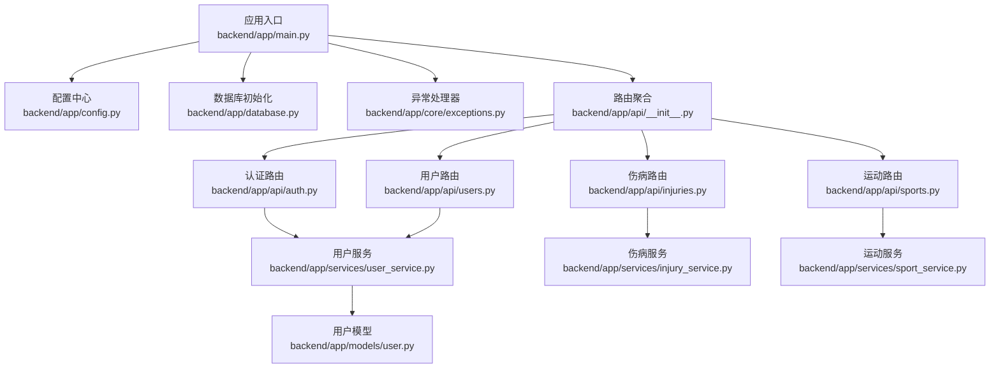
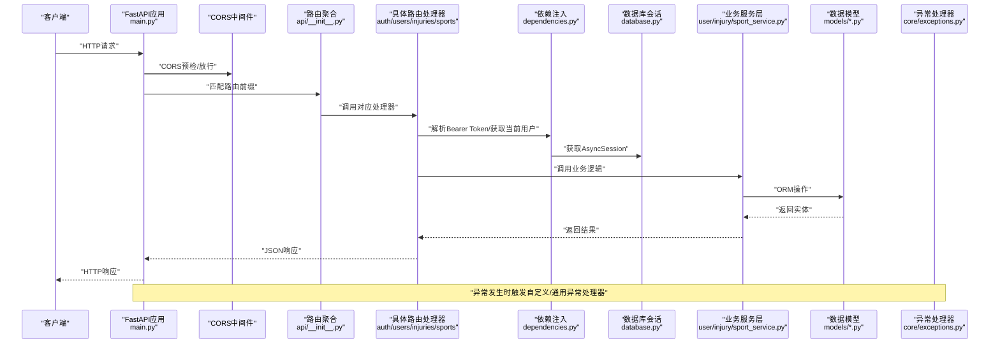
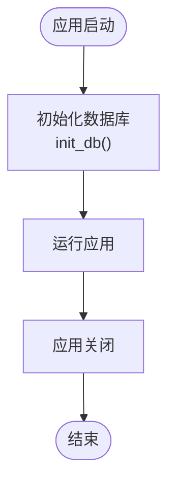
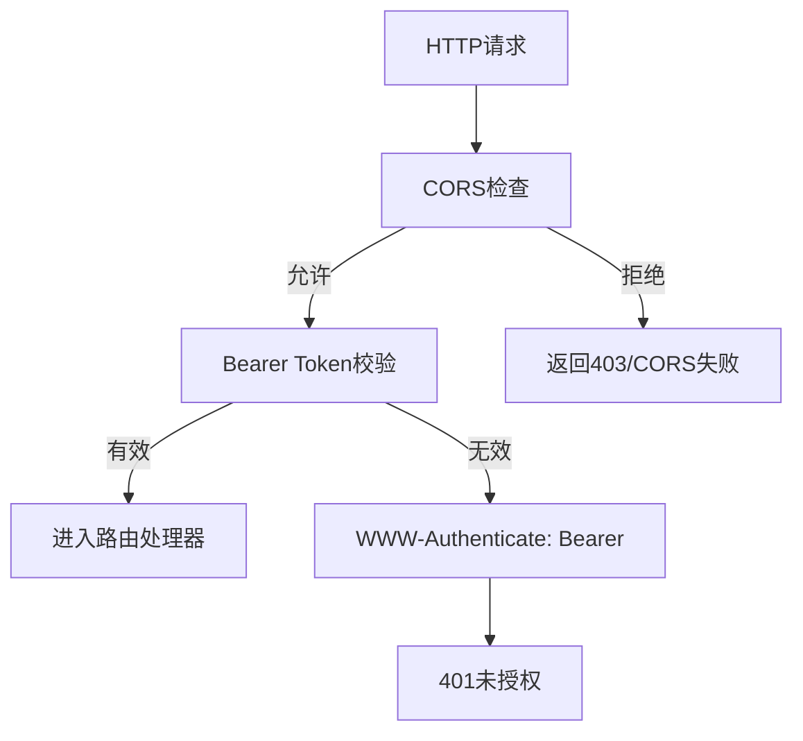
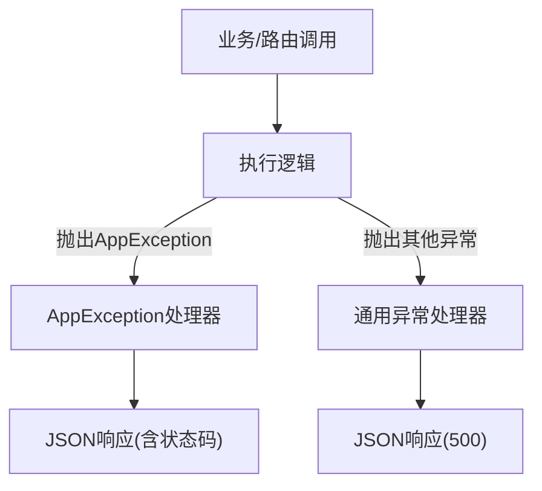
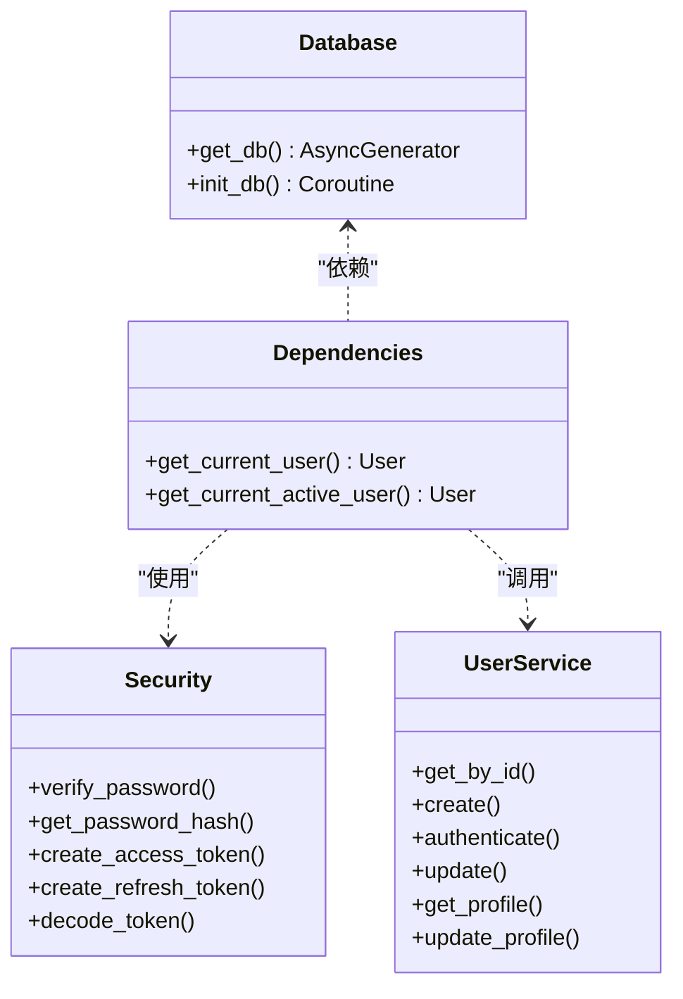
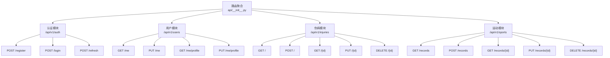
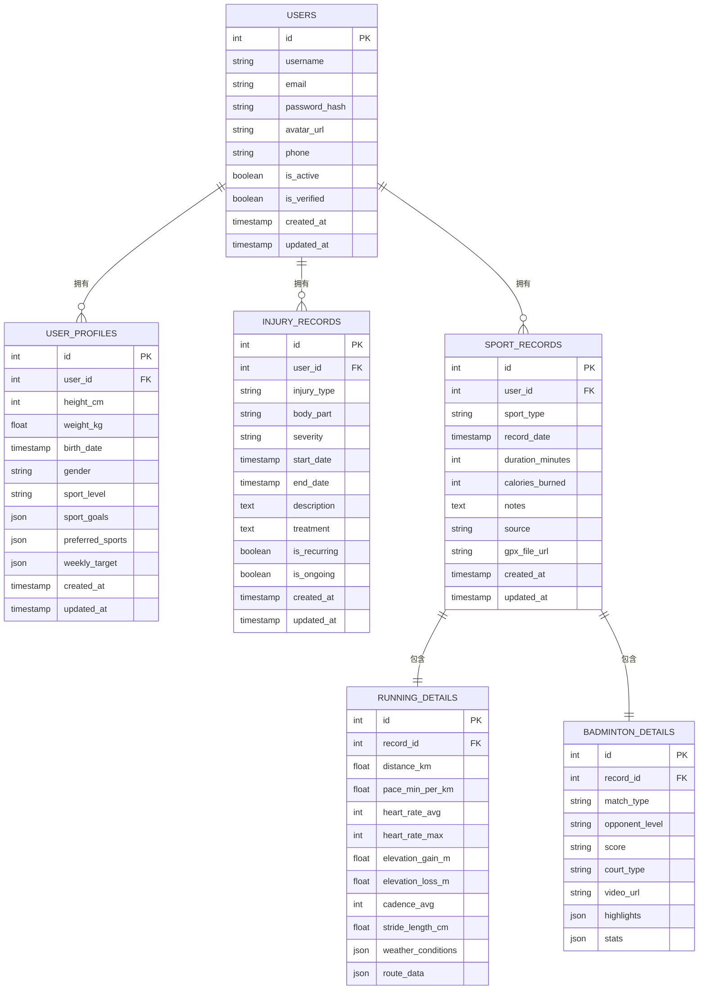
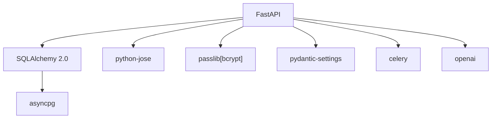

# 后端架构设计

<cite>
**本文档引用的文件**
- [backend/app/main.py](file://backend/app/main.py)
- [backend/app/config.py](file://backend/app/config.py)
- [backend/app/database.py](file://backend/app/database.py)
- [backend/app/core/dependencies.py](file://backend/app/core/dependencies.py)
- [backend/app/core/security.py](file://backend/app/core/security.py)
- [backend/app/core/exceptions.py](file://backend/app/core/exceptions.py)
- [backend/app/api/__init__.py](file://backend/app/api/__init__.py)
- [backend/app/api/auth.py](file://backend/app/api/auth.py)
- [backend/app/api/users.py](file://backend/app/api/users.py)
- [backend/app/api/injuries.py](file://backend/app/api/injuries.py)
- [backend/app/api/sports.py](file://backend/app/api/sports.py)
- [backend/app/services/user_service.py](file://backend/app/services/user_service.py)
- [backend/app/services/injury_service.py](file://backend/app/services/injury_service.py)
- [backend/app/services/sport_service.py](file://backend/app/services/sport_service.py)
- [backend/app/models/user.py](file://backend/app/models/user.py)
</cite>

## 目录
1. [引言](#引言)
2. [项目结构](#项目结构)
3. [核心组件](#核心组件)
4. [架构总览](#架构总览)
5. [详细组件分析](#详细组件分析)
6. [依赖关系分析](#依赖关系分析)
7. [性能考虑](#性能考虑)
8. [故障排除指南](#故障排除指南)
9. [结论](#结论)
10. [附录](#附录)

## 引言
本文件面向ActiveSynapse后端架构，系统性阐述基于FastAPI的RESTful API设计与实现，涵盖应用生命周期管理（lifespan）、中间件配置（CORS）、异常处理机制、依赖注入模式、数据库连接管理、路由组织结构、异步编程模型与协程处理、性能优化策略、安全中间件与请求处理流程，并给出与前端的交互模式与API设计原则。文档同时提供架构图与流程图，帮助读者快速理解系统全貌。

## 项目结构
后端采用按功能分层的模块化组织方式：入口应用、配置中心、数据库引擎与会话、核心依赖与安全、API路由聚合、业务服务层、数据模型与Schema定义。核心文件分布如下：
- 应用入口与生命周期：backend/app/main.py
- 配置中心：backend/app/config.py
- 数据库引擎与会话：backend/app/database.py
- 核心依赖与安全：backend/app/core/dependencies.py、backend/app/core/security.py、backend/app/core/exceptions.py
- API路由聚合与各模块路由：backend/app/api/__init__.py、backend/app/api/auth.py、backend/app/api/users.py、backend/app/api/injuries.py、backend/app/api/sports.py
- 业务服务层：backend/app/services/user_service.py、backend/app/services/injury_service.py、backend/app/services/sport_service.py
- 数据模型：backend/app/models/user.py
- 依赖声明：backend/requirements.txt

**图表来源**
- [backend/app/main.py:1-77](file://backend/app/main.py#L1-L77)
- [backend/app/api/__init__.py:1-10](file://backend/app/api/__init__.py#L1-L10)
- [backend/app/services/user_service.py:1-120](file://backend/app/services/user_service.py#L1-L120)
- [backend/app/services/injury_service.py:1-115](file://backend/app/services/injury_service.py#L1-L115)
- [backend/app/services/sport_service.py:1-238](file://backend/app/services/sport_service.py#L1-L238)
- [backend/app/models/user.py:1-62](file://backend/app/models/user.py#L1-L62)

**章节来源**
- [backend/app/main.py:1-77](file://backend/app/main.py#L1-L77)
- [backend/app/api/__init__.py:1-10](file://backend/app/api/__init__.py#L1-L10)
- [backend/requirements.txt:1-40](file://backend/requirements.txt#L1-L40)

## 核心组件
- 应用生命周期管理（lifespan）
  - 使用FastAPI的lifespan钩子在启动时初始化数据库，在关闭时优雅退出。参考路径：[backend/app/main.py:12-19](file://backend/app/main.py#L12-L19)、[backend/app/database.py:39-43](file://backend/app/database.py#L39-L43)
- 中间件配置（CORS）
  - 在应用中添加CORS中间件，允许跨域请求，支持凭据、通配方法与头。参考路径：[backend/app/main.py:28-35](file://backend/app/main.py#L28-L35)、[backend/app/config.py](file://backend/app/config.py#L33)
- 异常处理机制
  - 自定义应用异常类型与通用异常处理器，分别返回结构化的错误响应。参考路径：[backend/app/core/exceptions.py:1-54](file://backend/app/core/exceptions.py#L1-L54)、[backend/app/main.py:38-53](file://backend/app/main.py#L38-L53)
- 依赖注入模式
  - 通过Depends注入数据库会话、当前用户、安全令牌等，形成清晰的依赖链。参考路径：[backend/app/core/dependencies.py:1-61](file://backend/app/core/dependencies.py#L1-L61)、[backend/app/api/users.py:1-88](file://backend/app/api/users.py#L1-L88)
- 数据库连接管理
  - 基于SQLAlchemy 2.0异步引擎与会话工厂，提供异步依赖get_db，自动提交/回滚/关闭。参考路径：[backend/app/database.py:1-43](file://backend/app/database.py#L1-L43)
- 路由组织结构
  - APIRouter聚合认证、用户、伤病、运动模块路由，统一前缀/api/v1挂载。参考路径：[backend/app/api/__init__.py:1-10](file://backend/app/api/__init__.py#L1-L10)、[backend/app/main.py:56-57](file://backend/app/main.py#L56-L57)
- 安全中间件与JWT
  - HTTP Bearer鉴权、密码哈希与验证、JWT生成与解码。参考路径：[backend/app/core/dependencies.py:1-61](file://backend/app/core/dependencies.py#L1-L61)、[backend/app/core/security.py:1-50](file://backend/app/core/security.py#L1-L50)

**章节来源**
- [backend/app/main.py:12-57](file://backend/app/main.py#L12-L57)
- [backend/app/config.py:1-46](file://backend/app/config.py#L1-L46)
- [backend/app/core/exceptions.py:1-54](file://backend/app/core/exceptions.py#L1-L54)
- [backend/app/core/dependencies.py:1-61](file://backend/app/core/dependencies.py#L1-L61)
- [backend/app/core/security.py:1-50](file://backend/app/core/security.py#L1-L50)
- [backend/app/database.py:1-43](file://backend/app/database.py#L1-L43)
- [backend/app/api/__init__.py:1-10](file://backend/app/api/__init__.py#L1-L10)

## 架构总览
下图展示了从客户端到API、服务层与数据库的完整调用链，以及异常处理与依赖注入的关键节点。

**图表来源**
- [backend/app/main.py:21-57](file://backend/app/main.py#L21-L57)
- [backend/app/api/__init__.py:1-10](file://backend/app/api/__init__.py#L1-L10)
- [backend/app/core/dependencies.py:1-61](file://backend/app/core/dependencies.py#L1-L61)
- [backend/app/database.py:26-37](file://backend/app/database.py#L26-L37)
- [backend/app/services/user_service.py:1-120](file://backend/app/services/user_service.py#L1-L120)
- [backend/app/models/user.py:1-62](file://backend/app/models/user.py#L1-L62)
- [backend/app/core/exceptions.py:1-54](file://backend/app/core/exceptions.py#L1-L54)

## 详细组件分析

### 应用生命周期管理（lifespan）
- 启动阶段：在lifespan中调用数据库初始化函数，确保表结构就绪。
- 关闭阶段：yield之后的清理逻辑可扩展（如关闭连接池）。
- 入口应用：FastAPI构造时传入lifespan参数，保证生命周期钩子生效。

**图表来源**
- [backend/app/main.py:12-19](file://backend/app/main.py#L12-L19)
- [backend/app/database.py:39-43](file://backend/app/database.py#L39-L43)

**章节来源**
- [backend/app/main.py:12-19](file://backend/app/main.py#L12-L19)
- [backend/app/database.py:39-43](file://backend/app/database.py#L39-L43)

### CORS配置与安全中间件
- CORS中间件在应用层面集中配置，允许指定来源、凭据、通配方法与头。
- 安全中间件通过HTTP Bearer进行鉴权，结合JWT解码与用户校验，确保接口访问安全。

**图表来源**
- [backend/app/main.py:28-35](file://backend/app/main.py#L28-L35)
- [backend/app/core/dependencies.py:11-50](file://backend/app/core/dependencies.py#L11-L50)

**章节来源**
- [backend/app/main.py:28-35](file://backend/app/main.py#L28-L35)
- [backend/app/core/dependencies.py:1-61](file://backend/app/core/dependencies.py#L1-L61)

### 异常处理机制
- 自定义异常类体系：认证、授权、资源不存在、验证、冲突等，继承自HTTPException。
- 应用级异常处理器：捕获AppException，返回结构化JSON。
- 通用异常处理器：捕获所有未处理异常，返回500与统一错误信息。

**图表来源**
- [backend/app/core/exceptions.py:1-54](file://backend/app/core/exceptions.py#L1-L54)
- [backend/app/main.py:38-53](file://backend/app/main.py#L38-L53)

**章节来源**
- [backend/app/core/exceptions.py:1-54](file://backend/app/core/exceptions.py#L1-L54)
- [backend/app/main.py:38-53](file://backend/app/main.py#L38-L53)

### 依赖注入模式与数据库会话
- get_db提供异步数据库会话依赖，使用上下文管理确保事务提交/回滚/关闭。
- get_current_user与get_current_active_user通过Bearer Token解析用户身份，结合服务层查询用户状态。

**图表来源**
- [backend/app/database.py:26-37](file://backend/app/database.py#L26-L37)
- [backend/app/core/dependencies.py:11-61](file://backend/app/core/dependencies.py#L11-L61)
- [backend/app/core/security.py:1-50](file://backend/app/core/security.py#L1-L50)
- [backend/app/services/user_service.py:1-120](file://backend/app/services/user_service.py#L1-L120)

**章节来源**
- [backend/app/database.py:26-37](file://backend/app/database.py#L26-L37)
- [backend/app/core/dependencies.py:1-61](file://backend/app/core/dependencies.py#L1-L61)
- [backend/app/core/security.py:1-50](file://backend/app/core/security.py#L1-L50)
- [backend/app/services/user_service.py:1-120](file://backend/app/services/user_service.py#L1-L120)

### 路由组织与API设计原则
- 路由聚合：统一include_router，按模块划分前缀与标签，便于OpenAPI文档生成与维护。
- 设计原则：
  - 统一前缀/api/v1，版本化管理。
  - 资源命名复数化，动词使用HTTP方法表达。
  - 成功响应使用标准状态码，错误返回结构化JSON。
  - 分页参数规范：skip/limit，范围约束。
  - 认证路由使用Bearer Token，鉴权失败返回401并携带WWW-Authenticate头。

**图表来源**
- [backend/app/api/__init__.py:1-10](file://backend/app/api/__init__.py#L1-L10)
- [backend/app/api/auth.py:1-92](file://backend/app/api/auth.py#L1-L92)
- [backend/app/api/users.py:1-88](file://backend/app/api/users.py#L1-L88)
- [backend/app/api/injuries.py:1-92](file://backend/app/api/injuries.py#L1-L92)
- [backend/app/api/sports.py:1-127](file://backend/app/api/sports.py#L1-L127)

**章节来源**
- [backend/app/api/__init__.py:1-10](file://backend/app/api/__init__.py#L1-L10)
- [backend/app/api/auth.py:1-92](file://backend/app/api/auth.py#L1-L92)
- [backend/app/api/users.py:1-88](file://backend/app/api/users.py#L1-L88)
- [backend/app/api/injuries.py:1-92](file://backend/app/api/injuries.py#L1-L92)
- [backend/app/api/sports.py:1-127](file://backend/app/api/sports.py#L1-L127)

### 业务服务层与数据模型
- 用户服务：提供用户创建、认证、更新、档案读写等能力，处理唯一性约束与冲突。
- 伤病服务：支持按用户查询、分页、过滤、统计汇总。
- 运动服务：支持记录增删改查、统计分析、周汇总、按运动类型与日期过滤。
- 数据模型：用户、用户档案、伤病记录、运动记录及明细，定义枚举类型与外键关系。

**图表来源**
- [backend/app/models/user.py:1-62](file://backend/app/models/user.py#L1-L62)

**章节来源**
- [backend/app/services/user_service.py:1-120](file://backend/app/services/user_service.py#L1-L120)
- [backend/app/services/injury_service.py:1-115](file://backend/app/services/injury_service.py#L1-L115)
- [backend/app/services/sport_service.py:1-238](file://backend/app/services/sport_service.py#L1-L238)
- [backend/app/models/user.py:1-62](file://backend/app/models/user.py#L1-L62)

### 异步编程模型与协程处理
- 异步引擎与会话：使用SQLAlchemy异步引擎与异步会话工厂，配合异步依赖提供数据库访问。
- 协程处理：路由处理器、服务层均采用async/await，确保高并发下的I/O非阻塞。
- 性能要点：避免在协程中执行CPU密集型任务；合理使用flush/commit/refresh控制事务边界。

**章节来源**
- [backend/app/database.py:1-43](file://backend/app/database.py#L1-L43)
- [backend/app/services/user_service.py:1-120](file://backend/app/services/user_service.py#L1-L120)
- [backend/app/services/injury_service.py:1-115](file://backend/app/services/injury_service.py#L1-L115)
- [backend/app/services/sport_service.py:1-238](file://backend/app/services/sport_service.py#L1-L238)

### 与前端的交互模式与API设计原则
- 交互模式：前端通过/api/v1前缀调用后端接口，使用Bearer Token进行认证，成功登录后缓存访问/刷新令牌。
- API设计原则：
  - 统一响应结构，错误字段包含detail与状态码。
  - 分页参数遵循skip/limit，限制最大条目。
  - 过滤参数明确类型与取值范围，如运动类型、日期范围。
  - 文件上传占位接口需后续对接存储服务。

**章节来源**
- [backend/app/api/auth.py:1-92](file://backend/app/api/auth.py#L1-L92)
- [backend/app/api/users.py:1-88](file://backend/app/api/users.py#L1-L88)
- [backend/app/api/injuries.py:1-92](file://backend/app/api/injuries.py#L1-L92)
- [backend/app/api/sports.py:1-127](file://backend/app/api/sports.py#L1-L127)

## 依赖关系分析
- 外部依赖：FastAPI、Uvicorn、SQLAlchemy 2.0、asyncpg、Redis、JWT、Passlib、Pydantic Settings、OpenAI、Celery等。
- 内部耦合：路由依赖服务层，服务层依赖数据库会话与模型；依赖注入贯穿应用层与服务层；异常处理独立于业务逻辑。

**图表来源**
- [backend/requirements.txt:1-40](file://backend/requirements.txt#L1-L40)

**章节来源**
- [backend/requirements.txt:1-40](file://backend/requirements.txt#L1-L40)

## 性能考虑
- 数据库连接池：当前使用NullPool，适合开发环境；生产建议配置合适的连接池参数以提升吞吐量。
- 事务边界：在服务层明确commit/rollback，避免长事务占用连接。
- 查询优化：对高频查询建立索引（如用户表的email/username），在路由层限制分页上限。
- 异步I/O：保持异步特性，避免阻塞调用；对外部服务（如OpenAI、文件上传）采用异步或后台任务队列。
- 缓存策略：结合Redis进行热点数据缓存与会话存储。

## 故障排除指南
- 认证失败：检查Bearer Token是否正确传递、算法与密钥是否一致、token类型是否为access。
- 未找到资源：确认用户ID与资源归属关系，服务层已对不存在资源抛出NotFoundError。
- 冲突错误：邮箱/用户名重复导致冲突，需提示用户修改。
- 通用异常：未捕获异常统一返回500，建议增加日志记录与错误追踪。

**章节来源**
- [backend/app/core/exceptions.py:1-54](file://backend/app/core/exceptions.py#L1-L54)
- [backend/app/core/dependencies.py:1-61](file://backend/app/core/dependencies.py#L1-L61)
- [backend/app/services/user_service.py:1-120](file://backend/app/services/user_service.py#L1-L120)

## 结论
ActiveSynapse后端采用现代异步架构，围绕FastAPI构建了清晰的分层结构：配置中心、数据库层、依赖注入、路由与服务层、模型层与异常处理。通过lifespan管理生命周期、CORS与安全中间件保障跨域与认证、依赖注入与异步会话提升可维护性与性能。API设计遵循REST原则与版本化管理，便于前端集成与演进。建议在生产环境中完善连接池配置、查询索引与缓存策略，并对文件上传与外部服务接入进行异步化改造。

## 附录
- 关键实现路径参考：
  - 应用入口与生命周期：[backend/app/main.py:12-19](file://backend/app/main.py#L12-L19)
  - CORS与异常处理：[backend/app/main.py:28-53](file://backend/app/main.py#L28-L53)
  - 配置中心：[backend/app/config.py:1-46](file://backend/app/config.py#L1-L46)
  - 数据库引擎与会话：[backend/app/database.py:1-43](file://backend/app/database.py#L1-L43)
  - 依赖注入与安全：[backend/app/core/dependencies.py:1-61](file://backend/app/core/dependencies.py#L1-L61)、[backend/app/core/security.py:1-50](file://backend/app/core/security.py#L1-L50)
  - 路由聚合与模块路由：[backend/app/api/__init__.py:1-10](file://backend/app/api/__init__.py#L1-L10)、[backend/app/api/auth.py:1-92](file://backend/app/api/auth.py#L1-L92)、[backend/app/api/users.py:1-88](file://backend/app/api/users.py#L1-L88)、[backend/app/api/injuries.py:1-92](file://backend/app/api/injuries.py#L1-L92)、[backend/app/api/sports.py:1-127](file://backend/app/api/sports.py#L1-L127)
  - 业务服务层：[backend/app/services/user_service.py:1-120](file://backend/app/services/user_service.py#L1-L120)、[backend/app/services/injury_service.py:1-115](file://backend/app/services/injury_service.py#L1-L115)、[backend/app/services/sport_service.py:1-238](file://backend/app/services/sport_service.py#L1-L238)
  - 数据模型：[backend/app/models/user.py:1-62](file://backend/app/models/user.py#L1-L62)