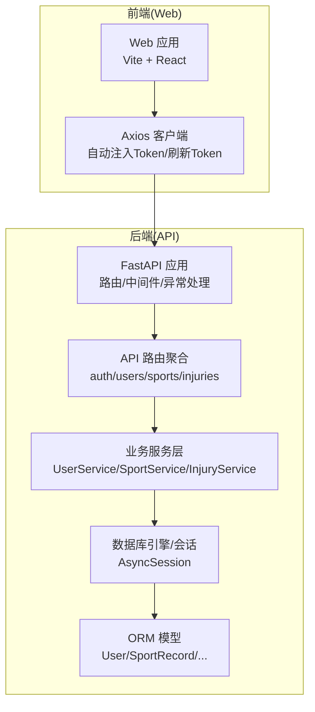
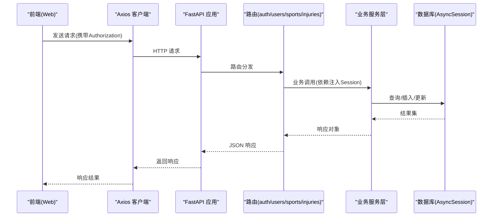
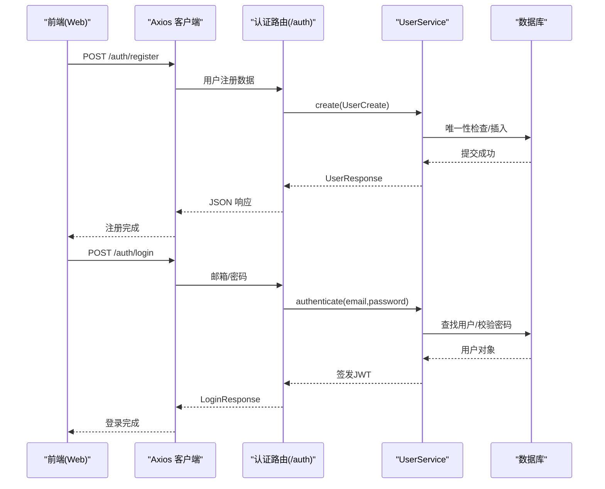
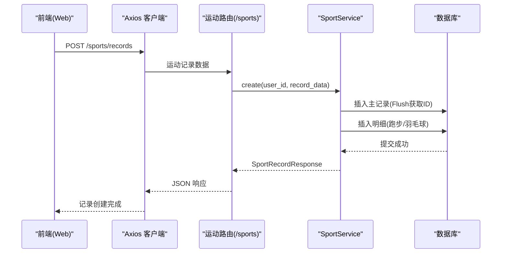
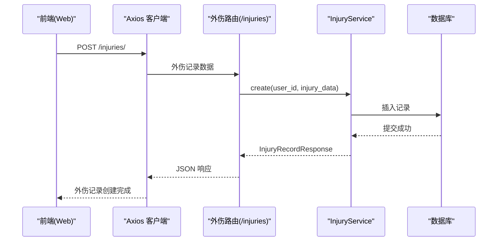
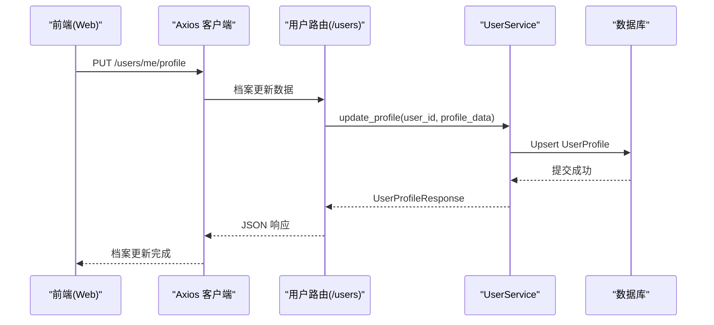
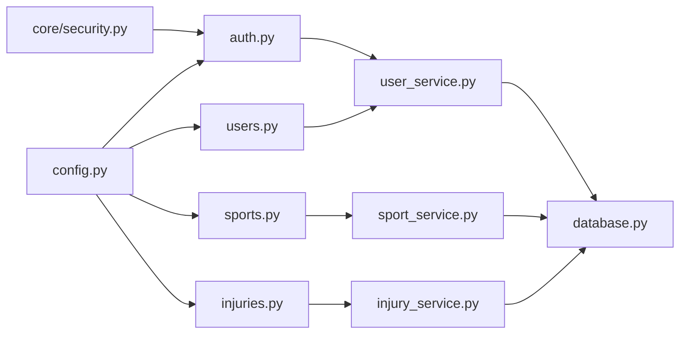

# 数据流设计

<cite>
**本文引用的文件**
- [backend/app/main.py](file://backend/app/main.py)
- [backend/app/database.py](file://backend/app/database.py)
- [backend/app/config.py](file://backend/app/config.py)
- [backend/app/api/__init__.py](file://backend/app/api/__init__.py)
- [backend/app/api/auth.py](file://backend/app/api/auth.py)
- [backend/app/api/users.py](file://backend/app/api/users.py)
- [backend/app/api/sports.py](file://backend/app/api/sports.py)
- [backend/app/api/injuries.py](file://backend/app/api/injuries.py)
- [backend/app/services/user_service.py](file://backend/app/services/user_service.py)
- [backend/app/services/sport_service.py](file://backend/app/services/sport_service.py)
- [backend/app/services/injury_service.py](file://backend/app/services/injury_service.py)
- [backend/app/models/user.py](file://backend/app/models/user.py)
- [backend/app/models/sport.py](file://backend/app/models/sport.py)
- [backend/app/core/security.py](file://backend/app/core/security.py)
- [web/src/services/api.ts](file://web/src/services/api.ts)
</cite>

## 目录
1. [引言](#引言)
2. [项目结构](#项目结构)
3. [核心组件](#核心组件)
4. [架构总览](#架构总览)
5. [详细组件分析](#详细组件分析)
6. [依赖分析](#依赖分析)
7. [性能考虑](#性能考虑)
8. [故障排查指南](#故障排查指南)
9. [结论](#结论)
10. [附录](#附录)

## 引言
本文件面向ActiveSynapse系统，聚焦“从用户输入到数据持久化”的完整数据流设计，覆盖前端数据提交、后端验证与处理、数据库存储、以及AI建议相关流程（含占位实现）。文档同时解释认证数据流、运动记录数据流与AI建议数据流的处理机制，明确数据验证规则、业务逻辑处理与错误传播机制，并给出数据转换、格式化与序列化过程说明。最后提供用户注册、运动记录创建与AI建议生成的完整数据流转示例，说明数据一致性、事务处理与并发控制策略。

## 项目结构
系统采用前后端分离架构：前端使用Vite+React，通过Axios封装HTTP请求；后端基于FastAPI，采用异步SQLAlchemy进行数据库访问，按功能模块划分API路由与服务层。

图表来源
- [backend/app/main.py](file://backend/app/main.py#L21-L57)
- [backend/app/api/__init__.py](file://backend/app/api/__init__.py#L1-L10)
- [backend/app/database.py](file://backend/app/database.py#L6-L23)
- [web/src/services/api.ts](file://web/src/services/api.ts#L1-L66)

章节来源
- [backend/app/main.py](file://backend/app/main.py#L1-L77)
- [backend/app/api/__init__.py](file://backend/app/api/__init__.py#L1-L10)
- [backend/app/database.py](file://backend/app/database.py#L1-L43)
- [web/src/services/api.ts](file://web/src/services/api.ts#L1-L108)

## 核心组件
- 应用入口与生命周期：初始化数据库、CORS配置、全局异常处理器、路由挂载。
- 数据库层：异步引擎与会话工厂，自动提交/回滚与关闭。
- 配置中心：应用名称、数据库URL、Redis、JWT密钥与过期时间、AI模型、文件上传参数、CORS允许域等。
- 安全工具：密码哈希、JWT签发与解码、令牌类型校验。
- API路由：认证、用户、运动、外伤记录四大模块。
- 业务服务：用户、运动、外伤服务，负责领域逻辑与数据一致性。
- ORM模型：用户、运动记录及明细、外伤记录等实体定义。

章节来源
- [backend/app/main.py](file://backend/app/main.py#L12-L57)
- [backend/app/database.py](file://backend/app/database.py#L26-L42)
- [backend/app/config.py](file://backend/app/config.py#L5-L46)
- [backend/app/core/security.py](file://backend/app/core/security.py#L1-L50)
- [backend/app/api/auth.py](file://backend/app/api/auth.py#L1-L92)
- [backend/app/api/users.py](file://backend/app/api/users.py#L1-L88)
- [backend/app/api/sports.py](file://backend/app/api/sports.py#L1-L127)
- [backend/app/api/injuries.py](file://backend/app/api/injuries.py#L1-L92)
- [backend/app/services/user_service.py](file://backend/app/services/user_service.py#L1-L120)
- [backend/app/services/sport_service.py](file://backend/app/services/sport_service.py#L1-L238)
- [backend/app/services/injury_service.py](file://backend/app/services/injury_service.py#L1-L115)
- [backend/app/models/user.py](file://backend/app/models/user.py#L1-L62)
- [backend/app/models/sport.py](file://backend/app/models/sport.py#L1-L115)

## 架构总览
下图展示从前端到后端再到数据库的整体数据流，标注了关键节点与职责边界。

图表来源
- [backend/app/main.py](file://backend/app/main.py#L21-L57)
- [backend/app/api/__init__.py](file://backend/app/api/__init__.py#L1-L10)
- [backend/app/database.py](file://backend/app/database.py#L26-L42)
- [web/src/services/api.ts](file://web/src/services/api.ts#L1-L66)

## 详细组件分析

### 认证数据流（登录/注册/刷新/登出）
- 注册：接收用户创建请求，服务层检查邮箱与用户名唯一性，生成密码哈希，创建用户与空档案，提交事务并刷新对象。
- 登录：根据邮箱查找用户，验证密码，签发访问令牌与刷新令牌，返回用户信息。
- 刷新：解析刷新令牌，校验类型与用户有效性，重新签发新令牌。
- 登出：服务端返回成功消息，客户端负责丢弃本地令牌。

图表来源
- [backend/app/api/auth.py](file://backend/app/api/auth.py#L17-L49)
- [backend/app/services/user_service.py](file://backend/app/services/user_service.py#L29-L59)
- [backend/app/core/security.py](file://backend/app/core/security.py#L21-L40)
- [web/src/services/api.ts](file://web/src/services/api.ts#L68-L80)

章节来源
- [backend/app/api/auth.py](file://backend/app/api/auth.py#L1-L92)
- [backend/app/services/user_service.py](file://backend/app/services/user_service.py#L1-L120)
- [backend/app/core/security.py](file://backend/app/core/security.py#L1-L50)
- [web/src/services/api.ts](file://web/src/services/api.ts#L1-L108)

### 运动记录数据流（创建/查询/统计/周汇总）
- 创建：根据运动类型选择性创建明细表（跑步/羽毛球），先写主记录获取ID，再写明细，提交事务并刷新。
- 查询：支持分页、过滤（类型、日期范围）、按用户归属校验。
- 统计：按时间段聚合活动次数、时长、卡路里，可细分到跑步的配速、心率等指标。
- 周汇总：统计最近七天每日各类运动时长与总消耗。

图表来源
- [backend/app/api/sports.py](file://backend/app/api/sports.py#L37-L46)
- [backend/app/services/sport_service.py](file://backend/app/services/sport_service.py#L48-L96)
- [backend/app/models/sport.py](file://backend/app/models/sport.py#L23-L115)

章节来源
- [backend/app/api/sports.py](file://backend/app/api/sports.py#L1-L127)
- [backend/app/services/sport_service.py](file://backend/app/services/sport_service.py#L1-L238)
- [backend/app/models/sport.py](file://backend/app/models/sport.py#L1-L115)

### 外伤记录数据流（创建/查询/统计）
- 创建：写入外伤记录，提交事务并刷新。
- 查询：支持分页、仅进行中筛选、按用户归属校验。
- 统计：计算总数、进行中外伤数、复发率，以及按部位与类型分布。

图表来源
- [backend/app/api/injuries.py](file://backend/app/api/injuries.py#L32-L41)
- [backend/app/services/injury_service.py](file://backend/app/services/injury_service.py#L39-L56)

章节来源
- [backend/app/api/injuries.py](file://backend/app/api/injuries.py#L1-L92)
- [backend/app/services/injury_service.py](file://backend/app/services/injury_service.py#L1-L115)

### 用户资料数据流（读取/更新/头像上传）
- 读取当前用户：加载用户基础信息与档案。
- 更新用户：字段去未设置排除，邮箱/用户名唯一性校验。
- 更新档案：支持创建或更新用户档案。
- 头像上传：占位接口，后续接入存储服务。

图表来源
- [backend/app/api/users.py](file://backend/app/api/users.py#L62-L71)
- [backend/app/services/user_service.py](file://backend/app/services/user_service.py#L104-L119)

章节来源
- [backend/app/api/users.py](file://backend/app/api/users.py#L1-L88)
- [backend/app/services/user_service.py](file://backend/app/services/user_service.py#L1-L120)

### AI建议数据流（概念与占位）
- 当前系统在后端模型与服务中预留了AI建议相关关系，但API与服务尚未实现具体逻辑。
- 建议流程：前端触发生成请求 → 后端调用AI服务（OpenAI） → 生成建议内容 → 写入AI建议表 → 返回结果。
- 注意：本节为概念性说明，不对应具体源码实现。

## 依赖分析
- 组件耦合与内聚：API路由依赖服务层，服务层依赖数据库会话；模型与数据库层解耦，便于扩展。
- 直接依赖：路由 → 服务 → 数据库；安全工具被认证路由与服务复用。
- 错误传播：业务异常统一由AppException处理，非预期异常转为500。
- 并发控制：异步会话逐请求创建与销毁，服务层在单次请求内执行事务。

图表来源
- [backend/app/api/auth.py](file://backend/app/api/auth.py#L1-L92)
- [backend/app/api/users.py](file://backend/app/api/users.py#L1-L88)
- [backend/app/api/sports.py](file://backend/app/api/sports.py#L1-L127)
- [backend/app/api/injuries.py](file://backend/app/api/injuries.py#L1-L92)
- [backend/app/services/user_service.py](file://backend/app/services/user_service.py#L1-L120)
- [backend/app/services/sport_service.py](file://backend/app/services/sport_service.py#L1-L238)
- [backend/app/services/injury_service.py](file://backend/app/services/injury_service.py#L1-L115)
- [backend/app/database.py](file://backend/app/database.py#L1-L43)
- [backend/app/core/security.py](file://backend/app/core/security.py#L1-L50)
- [backend/app/config.py](file://backend/app/config.py#L1-L46)

章节来源
- [backend/app/api/__init__.py](file://backend/app/api/__init__.py#L1-L10)
- [backend/app/main.py](file://backend/app/main.py#L1-L77)

## 性能考虑
- 异步I/O：使用异步SQLAlchemy减少阻塞，提升高并发下的吞吐。
- 事务粒度：单请求内事务提交/回滚，避免长时间持有连接。
- 查询优化：分页参数限制、索引列使用（如用户ID、记录日期），避免全表扫描。
- 缓存策略：可结合Redis缓存热点统计结果（如周汇总、统计聚合）。
- 文件上传：前端限制大小与类型，后端占位接口待实现实际存储与解析。

## 故障排查指南
- 认证失败：检查邮箱/密码是否正确，确认用户状态有效；刷新令牌需为正确类型且未过期。
- 唯一性冲突：注册/更新时邮箱或用户名已被占用，需修改后重试。
- 资源不存在：查询/更新/删除运动或外伤记录时，若非本人或记录不存在将抛出未找到错误。
- 服务器内部错误：非预期异常会被统一捕获为500，查看日志定位问题。

章节来源
- [backend/app/api/auth.py](file://backend/app/api/auth.py#L31-L32)
- [backend/app/services/user_service.py](file://backend/app/services/user_service.py#L33-L39)
- [backend/app/api/sports.py](file://backend/app/api/sports.py#L58-L59)
- [backend/app/api/injuries.py](file://backend/app/api/injuries.py#L53-L54)
- [backend/app/main.py](file://backend/app/main.py#L38-L53)

## 结论
ActiveSynapse通过清晰的分层架构实现了从前端到数据库的稳定数据流：前端负责交互与请求封装，后端路由与服务层承担业务与数据一致性，数据库层提供异步事务支持。认证、运动记录与外伤记录三大核心数据流具备完善的验证与错误传播机制。AI建议相关模块已预留扩展点，后续可按概念性流程接入外部AI服务。整体设计兼顾可维护性与扩展性，适合持续演进。

## 附录

### 数据验证规则与序列化
- Pydantic模型用于请求体与响应体的序列化与反序列化，确保字段类型与约束一致。
- 密码采用哈希存储，JWT令牌包含过期时间与类型标识，刷新令牌用于安全轮换。
- 运动记录按类型拆分为明细表，避免冗余字段与跨类型数据膨胀。

章节来源
- [backend/app/core/security.py](file://backend/app/core/security.py#L1-L50)
- [backend/app/models/sport.py](file://backend/app/models/sport.py#L1-L115)
- [backend/app/models/user.py](file://backend/app/models/user.py#L1-L62)

### 数据一致性、事务与并发控制
- 事务：每个请求内的数据库操作在异步会话中执行，成功提交，异常回滚并抛出。
- 并发：异步会话逐请求创建，避免共享状态；服务层在单请求上下文中保证原子性。
- 关系级联：用户与各记录采用级联删除，确保数据完整性。

章节来源
- [backend/app/database.py](file://backend/app/database.py#L26-L42)
- [backend/app/models/user.py](file://backend/app/models/user.py#L22-L28)
- [backend/app/models/sport.py](file://backend/app/models/sport.py#L44-L46)

### 具体数据流转示例

#### 示例一：用户注册
- 前端：调用注册接口，提交用户名、邮箱、密码。
- 后端：路由接收请求，服务层检查唯一性，生成哈希，创建用户与档案，提交事务。
- 数据库：写入用户表与档案表。
- 返回：用户信息（不含敏感字段）。

章节来源
- [web/src/services/api.ts](file://web/src/services/api.ts#L73-L74)
- [backend/app/api/auth.py](file://backend/app/api/auth.py#L17-L22)
- [backend/app/services/user_service.py](file://backend/app/services/user_service.py#L29-L59)

#### 示例二：运动记录创建
- 前端：提交运动类型、日期、时长、卡路里、来源与可选明细。
- 后端：路由接收，服务层先写主记录获取ID，再写明细，提交事务。
- 数据库：写入运动记录与对应明细表。
- 返回：完整的运动记录响应。

章节来源
- [web/src/services/api.ts](file://web/src/services/api.ts#L93-L95)
- [backend/app/api/sports.py](file://backend/app/api/sports.py#L37-L46)
- [backend/app/services/sport_service.py](file://backend/app/services/sport_service.py#L48-L96)

#### 示例三：AI建议生成（概念）
- 前端：触发建议生成请求。
- 后端：调用AI服务（OpenAI），生成建议文本，写入AI建议表，返回结果。
- 存储：建议内容以JSON或文本形式保存，关联用户与时间戳。
- 注意：当前代码未实现该流程，属于概念性说明。