# 系统架构

<cite>
**本文引用的文件**
- [README.md](file://README.md)
- [backend/app/main.py](file://backend/app/main.py)
- [backend/app/config.py](file://backend/app/config.py)
- [backend/requirements.txt](file://backend/requirements.txt)
- [backend/app/api/__init__.py](file://backend/app/api/__init__.py)
- [backend/app/api/auth.py](file://backend/app/api/auth.py)
- [backend/app/api/users.py](file://backend/app/api/users.py)
- [backend/app/api/injuries.py](file://backend/app/api/injuries.py)
- [backend/app/api/sports.py](file://backend/app/api/sports.py)
- [backend/app/models/__init__.py](file://backend/app/models/__init__.py)
- [backend/app/models/user.py](file://backend/app/models/user.py)
- [backend/app/models/injury.py](file://backend/app/models/injury.py)
- [backend/app/schemas/__init__.py](file://backend/app/schemas/__init__.py)
- [backend/app/services/user_service.py](file://backend/app/services/user_service.py)
- [backend/app/services/injury_service.py](file://backend/app/services/injury_service.py)
- [backend/app/services/sport_service.py](file://backend/app/services/sport_service.py)
- [backend/app/core/security.py](file://backend/app/core/security.py)
- [backend/app/core/dependencies.py](file://backend/app/core/dependencies.py)
- [backend/Dockerfile](file://backend/Dockerfile)
- [web/package.json](file://web/package.json)
- [web/src/services/api.ts](file://web/src/services/api.ts)
- [web/src/stores/authStore.ts](file://web/src/stores/authStore.ts)
- [web/Dockerfile](file://web/Dockerfile)
- [docker-compose.yml](file://docker-compose.yml)
</cite>

## 目录
1. [引言](#引言)
2. [项目结构](#项目结构)
3. [核心组件](#核心组件)
4. [架构总览](#架构总览)
5. [详细组件分析](#详细组件分析)
6. [分层架构详解](#分层架构详解)
7. [依赖分析](#依赖分析)
8. [性能考虑](#性能考虑)
9. [故障排查指南](#故障排查指南)
10. [结论](#结论)
11. [附录](#附录)

## 引言
ActiveSynapse 是一个"个人运动智能教练系统"，采用前后端分离架构：后端基于 FastAPI 提供 REST API，前端基于 React（Vite + TypeScript）构建用户界面，数据库使用 PostgreSQL，缓存使用 Redis，支持异步数据库访问与令牌鉴权。系统通过 Docker Compose 进行本地开发与部署编排。

## 项目结构
- 后端（FastAPI）
  - 应用入口与生命周期管理
  - 配置中心与环境变量
  - API 路由聚合
  - 数据模型与 Pydantic 模式
  - 业务服务层
  - 安全与认证工具
  - Dockerfile 与依赖清单
- 前端（React/Vite）
  - 页面与布局组件
  - API 服务封装与拦截器
  - 状态管理（Zustand）
  - 构建配置与依赖
- 基础设施编排
  - docker-compose 编排数据库、缓存与服务容器

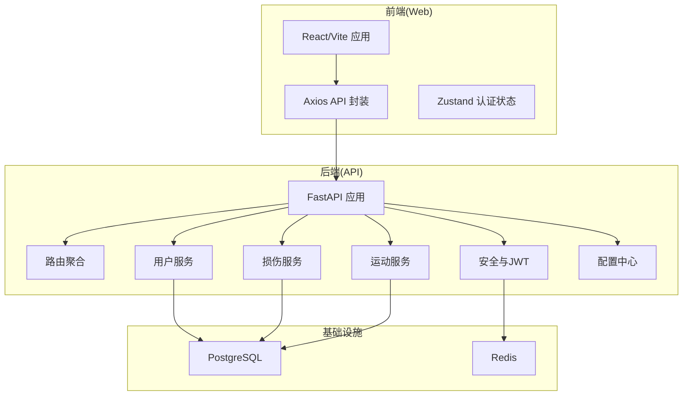

**图表来源**
- [backend/app/main.py:1-77](file://backend/app/main.py#L1-L77)
- [backend/app/api/__init__.py:1-10](file://backend/app/api/__init__.py#L1-L10)
- [backend/app/services/user_service.py:1-120](file://backend/app/services/user_service.py#L1-L120)
- [backend/app/services/injury_service.py:1-115](file://backend/app/services/injury_service.py#L1-L115)
- [backend/app/services/sport_service.py:1-238](file://backend/app/services/sport_service.py#L1-L238)
- [backend/app/core/security.py:1-50](file://backend/app/core/security.py#L1-L50)
- [backend/app/config.py:1-46](file://backend/app/config.py#L1-L46)
- [web/src/services/api.ts:1-108](file://web/src/services/api.ts#L1-L108)
- [web/src/stores/authStore.ts:1-52](file://web/src/stores/authStore.ts#L1-L52)
- [docker-compose.yml:1-81](file://docker-compose.yml#L1-L81)

**章节来源**
- [README.md:1-3](file://README.md#L1-L3)
- [backend/app/main.py:1-77](file://backend/app/main.py#L1-L77)
- [backend/app/config.py:1-46](file://backend/app/config.py#L1-L46)
- [backend/requirements.txt:1-40](file://backend/requirements.txt#L1-L40)
- [web/package.json:1-37](file://web/package.json#L1-L37)
- [docker-compose.yml:1-81](file://docker-compose.yml#L1-L81)

## 核心组件
- FastAPI 应用与生命周期
  - 应用名称、版本、文档路径在应用启动时定义
  - 使用 lifespan 在启动阶段初始化数据库连接
  - 注册 CORS 中间件与全局异常处理器
  - 路由前缀统一为 /api/v1
- 配置中心
  - 统一读取环境变量，包括数据库、Redis、JWT、AI、文件上传、CORS 允许域等
  - 使用缓存函数避免重复加载
- API 路由聚合
  - 路由按模块划分：认证、用户、损伤、运动等
  - 路由标签用于 OpenAPI 文档分组
- 用户服务与安全
  - 用户服务负责用户查询、创建、更新与认证
  - 安全模块提供密码哈希、JWT 签发与解码
- 前端 API 封装
  - Axios 实例封装基础 URL、请求头
  - 请求拦截器自动附加 Bearer Token
  - 响应拦截器处理 401 并触发刷新流程
- 认证状态管理
  - Zustand 管理用户信息、访问令牌与刷新令牌
  - 支持持久化存储

**章节来源**
- [backend/app/main.py:1-77](file://backend/app/main.py#L1-L77)
- [backend/app/config.py:1-46](file://backend/app/config.py#L1-L46)
- [backend/app/api/__init__.py:1-10](file://backend/app/api/__init__.py#L1-L10)
- [backend/app/services/user_service.py:1-120](file://backend/app/services/user_service.py#L1-L120)
- [backend/app/core/security.py:1-50](file://backend/app/core/security.py#L1-L50)
- [web/src/services/api.ts:1-108](file://web/src/services/api.ts#L1-L108)
- [web/src/stores/authStore.ts:1-52](file://web/src/stores/authStore.ts#L1-L52)

## 架构总览
系统采用前后端分离与微服务风格的单体后端架构：
- 前端通过 Axios 发起 REST 请求到后端 API
- 后端通过 SQLAlchemy Async ORM 访问 PostgreSQL
- JWT 用于认证与授权，刷新令牌机制提升用户体验
- Redis 可用于缓存与会话存储（当前配置指向 Redis）

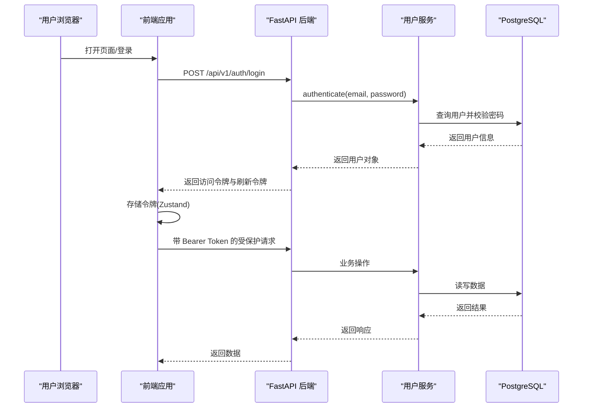

**图表来源**
- [backend/app/api/auth.py:1-92](file://backend/app/api/auth.py#L1-L92)
- [backend/app/services/user_service.py:1-120](file://backend/app/services/user_service.py#L1-L120)
- [backend/app/models/user.py:1-62](file://backend/app/models/user.py#L1-L62)
- [web/src/services/api.ts:1-108](file://web/src/services/api.ts#L1-L108)
- [web/src/stores/authStore.ts:1-52](file://web/src/stores/authStore.ts#L1-L52)

## 详细组件分析

### 后端应用与路由
- 应用入口负责注册中间件、异常处理器与路由
- 路由聚合器将认证、用户、损伤、运动等子路由挂载到统一前缀下
- 生命周期钩子在启动时初始化数据库连接

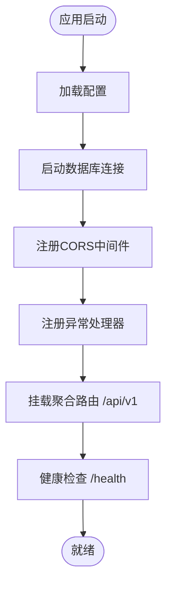

**图表来源**
- [backend/app/main.py:1-77](file://backend/app/main.py#L1-L77)
- [backend/app/api/__init__.py:1-10](file://backend/app/api/__init__.py#L1-L10)
- [backend/app/config.py:1-46](file://backend/app/config.py#L1-L46)

**章节来源**
- [backend/app/main.py:1-77](file://backend/app/main.py#L1-L77)
- [backend/app/api/__init__.py:1-10](file://backend/app/api/__init__.py#L1-L10)

### 认证与授权流程
- 登录：校验凭据后签发访问令牌与刷新令牌
- 刷新：使用刷新令牌签发新的访问令牌
- 注销：客户端丢弃令牌即可
- 前端拦截器在 401 时自动调用刷新接口并重试原请求

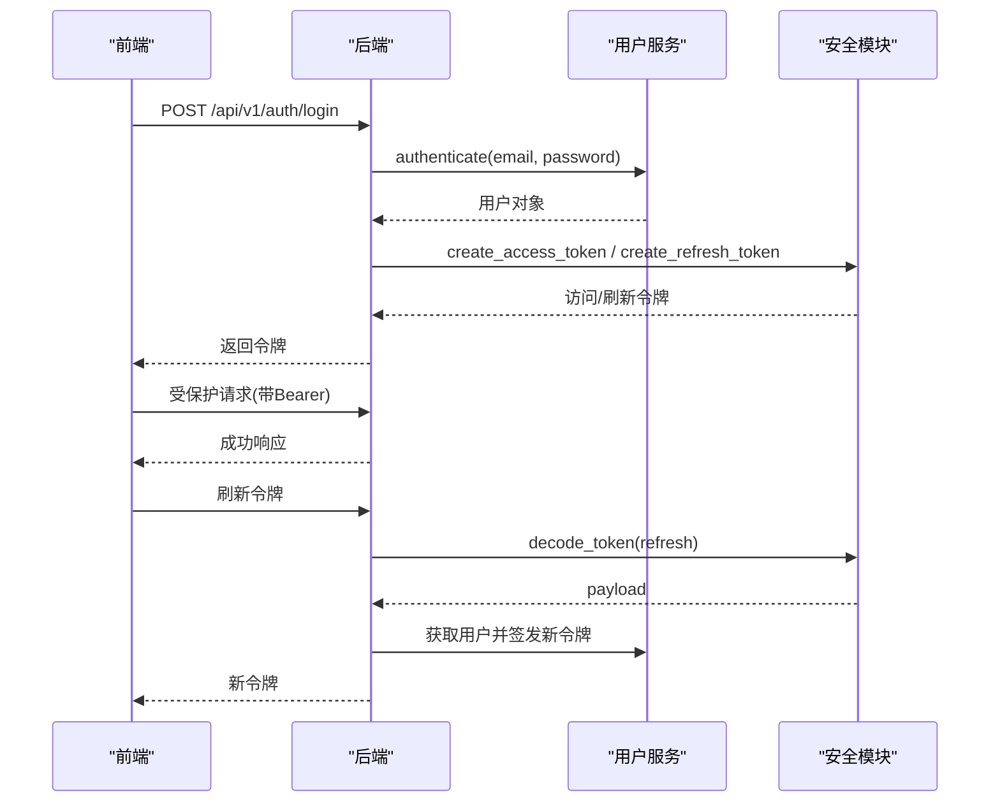

**图表来源**
- [backend/app/api/auth.py:1-92](file://backend/app/api/auth.py#L1-L92)
- [backend/app/services/user_service.py:1-120](file://backend/app/services/user_service.py#L1-L120)
- [backend/app/core/security.py:1-50](file://backend/app/core/security.py#L1-L50)
- [web/src/services/api.ts:1-108](file://web/src/services/api.ts#L1-L108)

**章节来源**
- [backend/app/api/auth.py:1-92](file://backend/app/api/auth.py#L1-L92)
- [backend/app/core/security.py:1-50](file://backend/app/core/security.py#L1-L50)
- [web/src/services/api.ts:1-108](file://web/src/services/api.ts#L1-L108)

### 数据模型与关系
- 用户与用户档案：一对一关系，级联删除
- 用户与各类记录：一对多关系，包含运动、损伤、饮食、力量训练、AI建议与训练计划等
- 关系映射在模型中定义，便于 ORM 查询与维护

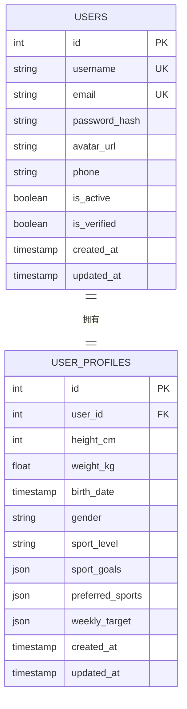

**图表来源**
- [backend/app/models/user.py:1-62](file://backend/app/models/user.py#L1-L62)
- [backend/app/models/__init__.py:1-20](file://backend/app/models/__init__.py#L1-L20)

**章节来源**
- [backend/app/models/user.py:1-62](file://backend/app/models/user.py#L1-L62)
- [backend/app/models/__init__.py:1-20](file://backend/app/models/__init__.py#L1-L20)

### 前端组件与交互
- API 封装：统一基地址、请求头、拦截器
- 认证状态：Zustand 管理用户信息与令牌，并持久化
- 页面与布局：Dashboard、运动记录、损伤记录、个人资料等页面组件

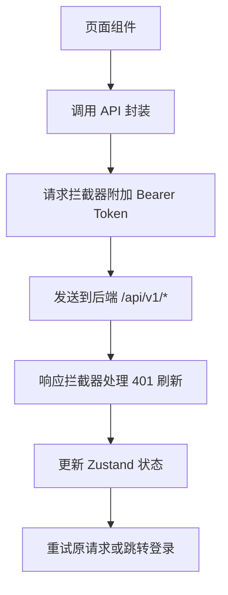

**图表来源**
- [web/src/services/api.ts:1-108](file://web/src/services/api.ts#L1-L108)
- [web/src/stores/authStore.ts:1-52](file://web/src/stores/authStore.ts#L1-L52)

**章节来源**
- [web/src/services/api.ts:1-108](file://web/src/services/api.ts#L1-L108)
- [web/src/stores/authStore.ts:1-52](file://web/src/stores/authStore.ts#L1-L52)

## 分层架构详解

### 后端API层
后端API层采用FastAPI框架，提供RESTful接口服务：

- **路由组织**：按功能模块划分，包括认证、用户管理、损伤记录、运动记录等
- **依赖注入**：使用FastAPI的Depends进行数据库连接和认证依赖注入
- **异常处理**：统一的异常处理器处理业务异常和通用异常
- **中间件**：CORS中间件支持跨域请求

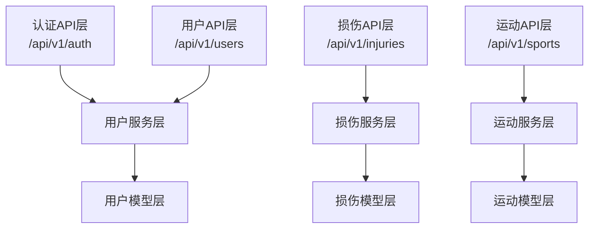

**图表来源**
- [backend/app/api/auth.py:1-92](file://backend/app/api/auth.py#L1-L92)
- [backend/app/api/users.py:1-88](file://backend/app/api/users.py#L1-L88)
- [backend/app/api/injuries.py:1-92](file://backend/app/api/injuries.py#L1-L92)
- [backend/app/api/sports.py:1-127](file://backend/app/api/sports.py#L1-L127)
- [backend/app/services/user_service.py:1-120](file://backend/app/services/user_service.py#L1-L120)
- [backend/app/services/injury_service.py:1-115](file://backend/app/services/injury_service.py#L1-L115)
- [backend/app/services/sport_service.py:1-238](file://backend/app/services/sport_service.py#L1-L238)

**章节来源**
- [backend/app/api/auth.py:1-92](file://backend/app/api/auth.py#L1-L92)
- [backend/app/api/users.py:1-88](file://backend/app/api/users.py#L1-L88)
- [backend/app/api/injuries.py:1-92](file://backend/app/api/injuries.py#L1-L92)
- [backend/app/api/sports.py:1-127](file://backend/app/api/sports.py#L1-L127)

### 业务逻辑层
业务逻辑层封装核心业务规则和流程控制：

- **UserService**：用户注册、登录、信息管理、头像上传
- **InjuryService**：损伤记录的增删改查、统计分析
- **SportService**：运动记录管理、统计数据计算、周汇总分析
- **服务职责单一**：每个服务专注于特定业务领域，便于测试和维护

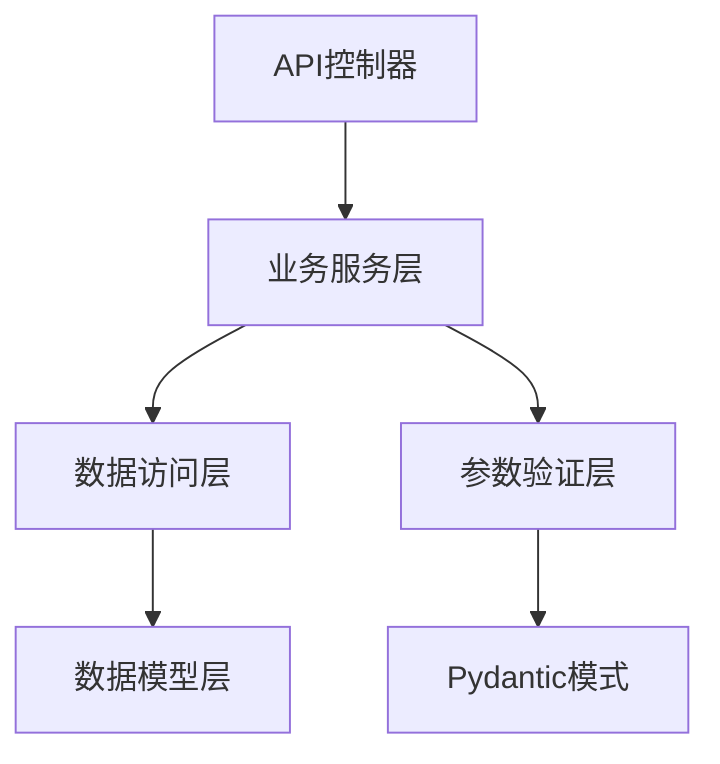

**图表来源**
- [backend/app/services/user_service.py:1-120](file://backend/app/services/user_service.py#L1-L120)
- [backend/app/services/injury_service.py:1-115](file://backend/app/services/injury_service.py#L1-L115)
- [backend/app/services/sport_service.py:1-238](file://backend/app/services/sport_service.py#L1-L238)

**章节来源**
- [backend/app/services/user_service.py:1-120](file://backend/app/services/user_service.py#L1-L120)
- [backend/app/services/injury_service.py:1-115](file://backend/app/services/injury_service.py#L1-L115)
- [backend/app/services/sport_service.py:1-238](file://backend/app/services/sport_service.py#L1-L238)

### 数据访问层
数据访问层使用SQLAlchemy异步ORM进行数据库操作：

- **异步数据库连接**：支持高并发场景下的数据库操作
- **关系映射**：定义实体间的一对一、一对多关系
- **事务管理**：确保数据一致性和完整性
- **查询优化**：支持复杂查询和关联查询

**章节来源**
- [backend/app/models/user.py:1-62](file://backend/app/models/user.py#L1-L62)
- [backend/app/models/injury.py:1-70](file://backend/app/models/injury.py#L1-L70)

### 前端UI层
前端UI层采用React + TypeScript构建现代化用户界面：

- **组件化设计**：页面组件、布局组件、功能组件分离
- **状态管理**：Zustand管理全局状态，包括用户认证状态
- **API集成**：Axios封装HTTP请求，统一处理认证和错误
- **路由管理**：React Router实现页面导航和路由控制

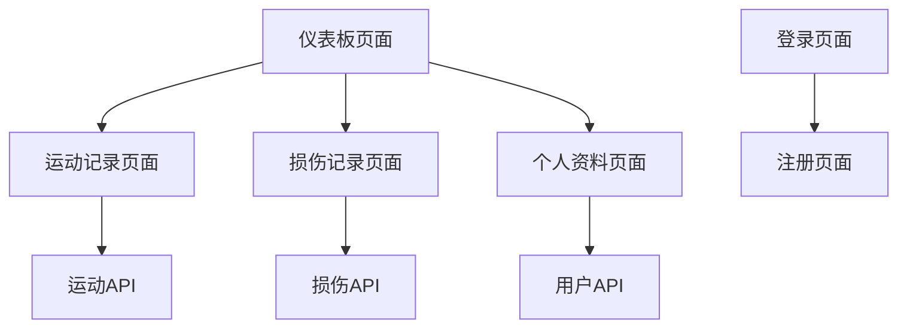

**图表来源**
- [web/src/pages/DashboardPage.tsx](file://web/src/pages/DashboardPage.tsx)
- [web/src/pages/SportRecordsPage.tsx](file://web/src/pages/SportRecordsPage.tsx)
- [web/src/pages/InjuryRecordsPage.tsx](file://web/src/pages/InjuryRecordsPage.tsx)
- [web/src/pages/ProfilePage.tsx](file://web/src/pages/ProfilePage.tsx)
- [web/src/pages/LoginPage.tsx](file://web/src/pages/LoginPage.tsx)
- [web/src/pages/RegisterPage.tsx](file://web/src/pages/RegisterPage.tsx)

**章节来源**
- [web/src/pages/DashboardPage.tsx](file://web/src/pages/DashboardPage.tsx)
- [web/src/pages/SportRecordsPage.tsx](file://web/src/pages/SportRecordsPage.tsx)
- [web/src/pages/InjuryRecordsPage.tsx](file://web/src/pages/InjuryRecordsPage.tsx)
- [web/src/pages/ProfilePage.tsx](file://web/src/pages/ProfilePage.tsx)
- [web/src/pages/LoginPage.tsx](file://web/src/pages/LoginPage.tsx)
- [web/src/pages/RegisterPage.tsx](file://web/src/pages/RegisterPage.tsx)

## 依赖分析
- 技术栈概览
  - 后端：FastAPI、SQLAlchemy 2.x、asyncpg、Alembic、Redis、Celery、Pydantic Settings、OpenAI
  - 前端：React、TypeScript、Ant Design、Axios、Zustand、Day.js、ECharts
  - 基础设施：PostgreSQL、Redis、Docker Compose
- 外部依赖与版本
  - 后端依赖清单明确列出各组件版本
  - 前端依赖清单明确列出运行时与开发时依赖
- 组件耦合
  - 前端仅通过 /api/v1/* 与后端交互，耦合度低
  - 后端通过服务层与模型层解耦业务与数据访问

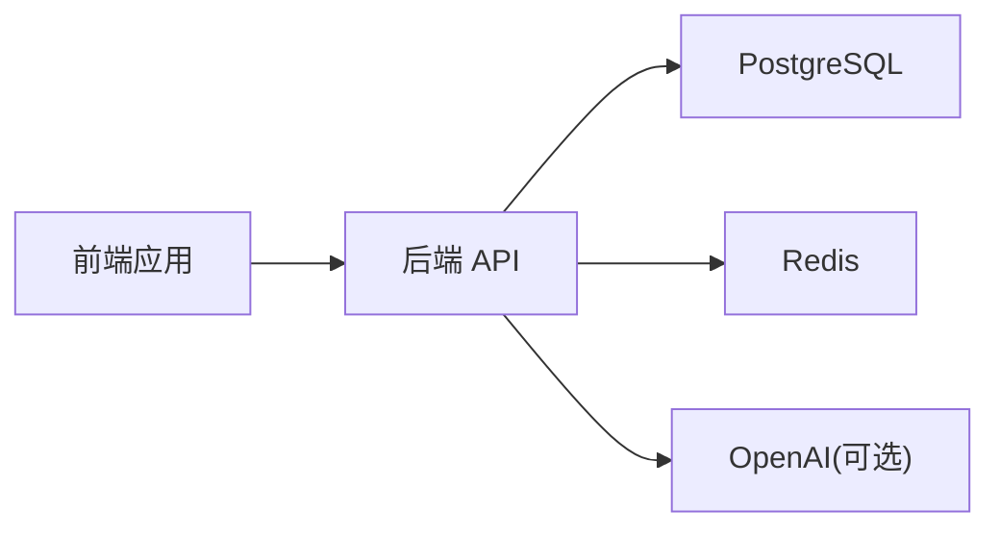

**图表来源**
- [backend/requirements.txt:1-40](file://backend/requirements.txt#L1-L40)
- [web/package.json:1-37](file://web/package.json#L1-L37)
- [docker-compose.yml:1-81](file://docker-compose.yml#L1-L81)

**章节来源**
- [backend/requirements.txt:1-40](file://backend/requirements.txt#L1-L40)
- [web/package.json:1-37](file://web/package.json#L1-L37)
- [docker-compose.yml:1-81](file://docker-compose.yml#L1-L81)

## 性能考虑
- 异步数据库访问：使用 SQLAlchemy Async ORM 降低阻塞，适合高并发场景
- 缓存策略：Redis 可用于热点数据与会话缓存，减少数据库压力
- 文件上传：限制最大文件大小，结合异步处理与队列（如 Celery）实现后台任务
- 前端性能：按需加载、状态持久化与拦截器复用可减少网络往返
- 部署建议：生产环境启用 HTTPS、限流与日志监控；数据库与缓存独立扩缩容

## 故障排查指南
- 健康检查
  - 后端提供 /health 接口，可用于容器编排健康探测
- 认证问题
  - 若出现 401，前端会尝试刷新令牌；若刷新失败则登出
  - 检查后端 JWT 密钥、算法与过期时间配置
- 数据库连接
  - 确认数据库 URL 与容器连通性；查看 Alembic 迁移是否成功
- CORS 与跨域
  - 检查允许的源列表与请求头设置
- 日志与异常
  - 后端已注册通用异常处理器，返回标准错误格式

**章节来源**
- [backend/app/main.py:69-77](file://backend/app/main.py#L69-L77)
- [backend/app/api/auth.py:1-92](file://backend/app/api/auth.py#L1-L92)
- [backend/app/config.py:1-46](file://backend/app/config.py#L1-L46)
- [web/src/services/api.ts:1-108](file://web/src/services/api.ts#L1-L108)

## 结论
ActiveSynapse 采用清晰的前后端分离与模块化后端设计，具备良好的可维护性与扩展性。通过 JWT 认证、异步数据库访问与容器化编排，系统可在本地与生产环境中快速部署。完整的分层架构设计使得各层职责明确，便于团队协作和系统演进。后续可在缓存策略、任务队列与可观测性方面进一步增强。

## 附录

### 系统上下文图
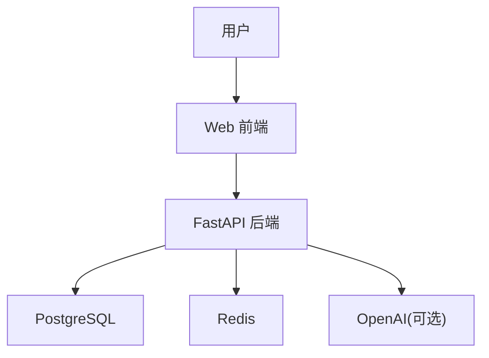

**图表来源**
- [docker-compose.yml:1-81](file://docker-compose.yml#L1-L81)
- [backend/app/config.py:1-46](file://backend/app/config.py#L1-L46)
- [web/package.json:1-37](file://web/package.json#L1-L37)

### 部署拓扑与容器编排
- PostgreSQL：持久化数据卷，健康检查
- Redis：缓存与会话存储
- Backend：监听 8000 端口，依赖数据库与缓存健康
- Web：监听 5173 端口，依赖后端可用

**章节来源**
- [docker-compose.yml:1-81](file://docker-compose.yml#L1-L81)
- [backend/Dockerfile:1-24](file://backend/Dockerfile#L1-L24)
- [web/Dockerfile:1-17](file://web/Dockerfile#L1-L17)