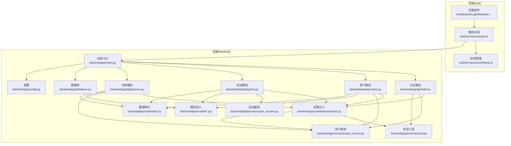
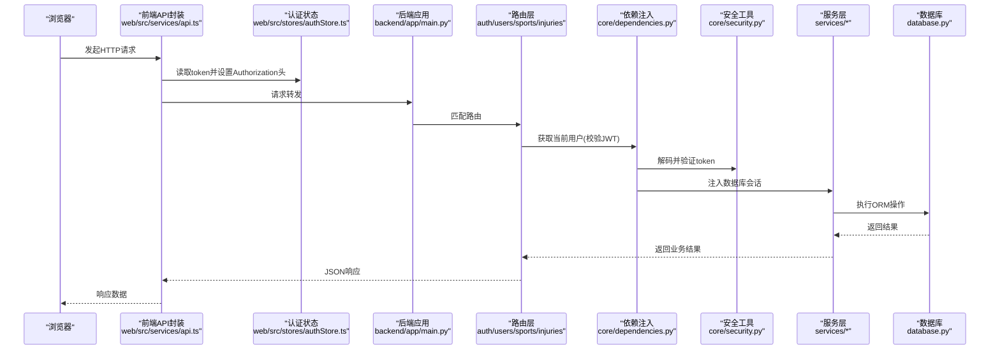
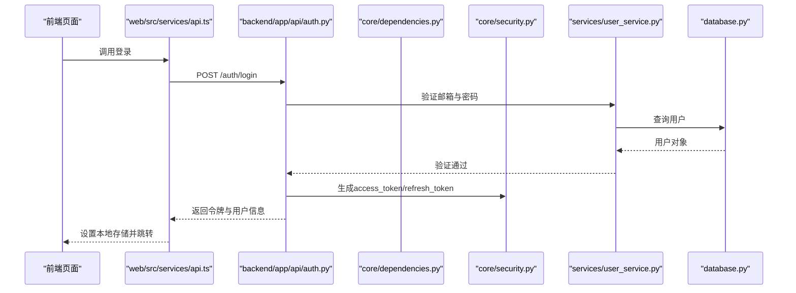
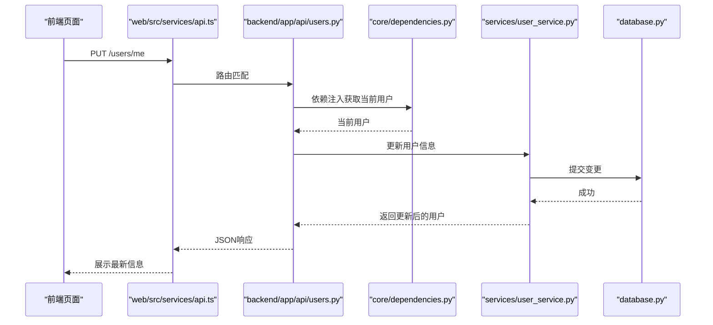
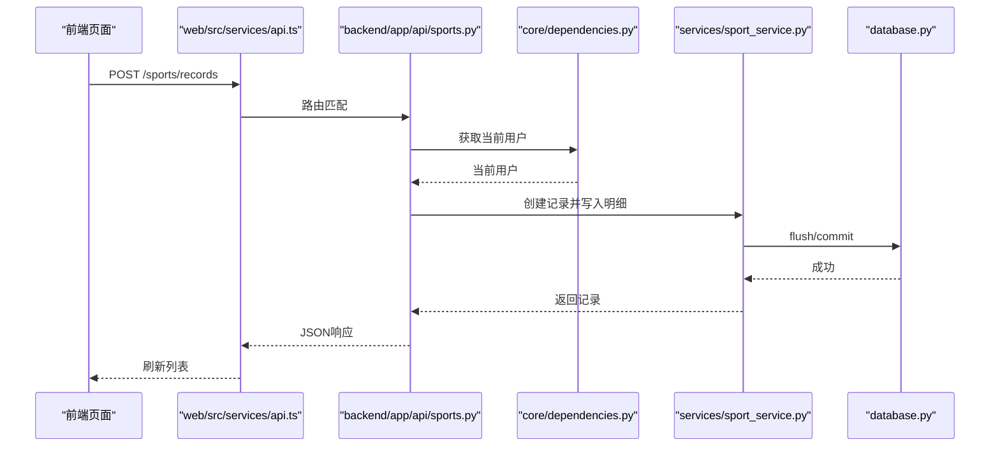
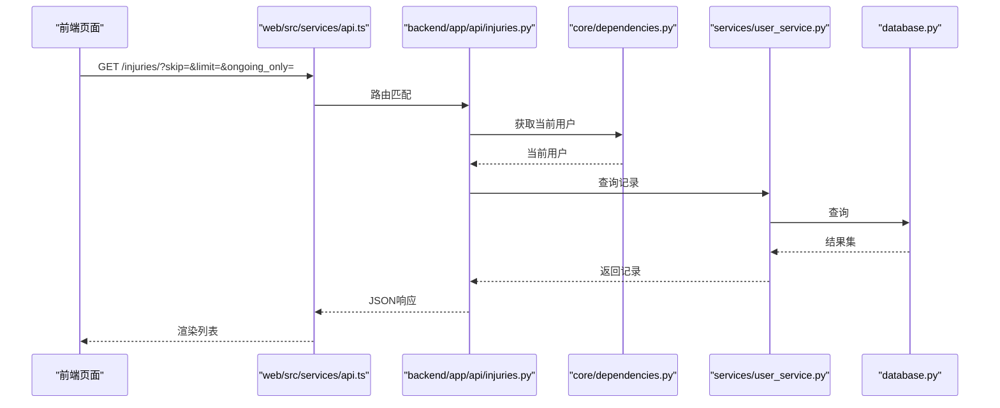
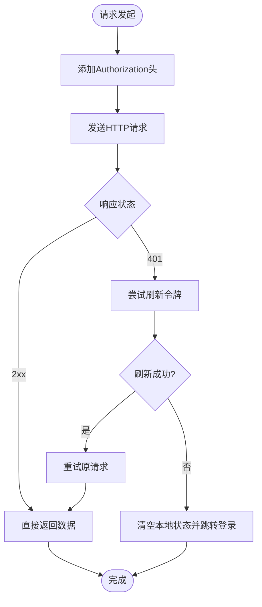
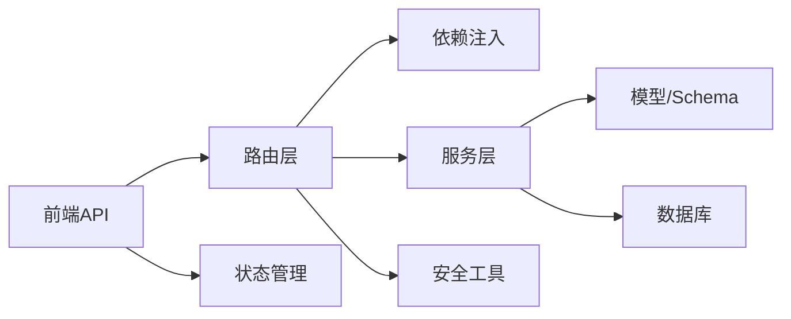

# 组件交互模式

<cite>
**本文引用的文件**
- [backend/app/main.py](file://backend/app/main.py)
- [backend/app/config.py](file://backend/app/config.py)
- [backend/app/database.py](file://backend/app/database.py)
- [backend/app/core/dependencies.py](file://backend/app/core/dependencies.py)
- [backend/app/core/security.py](file://backend/app/core/security.py)
- [backend/app/api/auth.py](file://backend/app/api/auth.py)
- [backend/app/api/users.py](file://backend/app/api/users.py)
- [backend/app/api/sports.py](file://backend/app/api/sports.py)
- [backend/app/api/injuries.py](file://backend/app/api/injuries.py)
- [backend/app/services/user_service.py](file://backend/app/services/user_service.py)
- [backend/app/services/sport_service.py](file://backend/app/services/sport_service.py)
- [backend/app/models/user.py](file://backend/app/models/user.py)
- [backend/app/models/sport.py](file://backend/app/models/sport.py)
- [backend/app/schemas/auth.py](file://backend/app/schemas/auth.py)
- [backend/app/schemas/user.py](file://backend/app/schemas/user.py)
- [web/src/services/api.ts](file://web/src/services/api.ts)
- [web/src/stores/authStore.ts](file://web/src/stores/authStore.ts)
- [README.md](file://README.md)
</cite>

## 目录
1. [简介](#简介)
2. [项目结构](#项目结构)
3. [核心组件](#核心组件)
4. [架构总览](#架构总览)
5. [详细组件分析](#详细组件分析)
6. [依赖分析](#依赖分析)
7. [性能考虑](#性能考虑)
8. [故障排查指南](#故障排查指南)
9. [结论](#结论)
10. [附录](#附录)

## 简介
本文件面向ActiveSynapse系统的前后端组件交互，系统采用FastAPI后端与React/Vite前端（web）组合，提供个人运动管理与智能教练能力。本文档聚焦以下目标：
- 前后端交互协议与通信机制：HTTP请求/响应模式、鉴权令牌传递、状态同步与事件传递建议
- API接口设计原则、参数传递规范与响应格式标准
- 组件解耦策略、依赖注入模式与模块化设计原则
- 错误处理机制、重试策略与降级方案
- 典型交互示例：用户登录、运动记录查询、数据更新的完整流程
- 组件协作模式与数据共享机制

## 项目结构
系统采用分层架构：
- 后端（FastAPI）：路由层（API）、业务层（Services）、数据访问层（Models/Schemas）、基础设施（Config/Database/Security/Dependencies）
- 前端（React/Vite）：页面组件、服务封装（API）、状态管理（Zustand Store）

图表来源
- [backend/app/main.py](file://backend/app/main.py#L1-L77)
- [backend/app/api/auth.py](file://backend/app/api/auth.py#L1-L92)
- [backend/app/api/users.py](file://backend/app/api/users.py#L1-L88)
- [backend/app/api/sports.py](file://backend/app/api/sports.py#L1-L127)
- [backend/app/api/injuries.py](file://backend/app/api/injuries.py#L1-L92)
- [backend/app/core/dependencies.py](file://backend/app/core/dependencies.py#L1-L61)
- [backend/app/core/security.py](file://backend/app/core/security.py#L1-L50)
- [backend/app/services/user_service.py](file://backend/app/services/user_service.py#L1-L120)
- [backend/app/services/sport_service.py](file://backend/app/services/sport_service.py#L1-L238)
- [backend/app/database.py](file://backend/app/database.py#L1-L43)
- [backend/app/config.py](file://backend/app/config.py#L1-L46)
- [web/src/services/api.ts](file://web/src/services/api.ts#L1-L108)
- [web/src/stores/authStore.ts](file://web/src/stores/authStore.ts#L1-L52)

章节来源
- [README.md](file://README.md#L1-L3)
- [backend/app/main.py](file://backend/app/main.py#L1-L77)
- [web/src/services/api.ts](file://web/src/services/api.ts#L1-L108)

## 核心组件
- 应用入口与中间件
  - 启动生命周期、CORS、异常处理器、根路径与健康检查
- 安全与鉴权
  - JWT访问/刷新令牌生成与校验、基于Bearer的HTTP安全依赖
- 数据库与配置
  - 异步数据库引擎与会话工厂、Redis、CORS白名单、JWT参数等
- 路由与控制器
  - 认证、用户、运动、伤病四大模块的REST接口
- 服务层
  - 用户服务、运动服务，封装领域逻辑与事务控制
- 模型与Schema
  - ORM模型与Pydantic数据模式，确保输入输出一致性
- 前端服务与状态
  - Axios封装、拦截器自动携带令牌与刷新、Zustand持久化状态

章节来源
- [backend/app/main.py](file://backend/app/main.py#L1-L77)
- [backend/app/core/security.py](file://backend/app/core/security.py#L1-L50)
- [backend/app/core/dependencies.py](file://backend/app/core/dependencies.py#L1-L61)
- [backend/app/config.py](file://backend/app/config.py#L1-L46)
- [backend/app/database.py](file://backend/app/database.py#L1-L43)
- [backend/app/api/auth.py](file://backend/app/api/auth.py#L1-L92)
- [backend/app/api/users.py](file://backend/app/api/users.py#L1-L88)
- [backend/app/api/sports.py](file://backend/app/api/sports.py#L1-L127)
- [backend/app/api/injuries.py](file://backend/app/api/injuries.py#L1-L92)
- [backend/app/services/user_service.py](file://backend/app/services/user_service.py#L1-L120)
- [backend/app/services/sport_service.py](file://backend/app/services/sport_service.py#L1-L238)
- [backend/app/models/user.py](file://backend/app/models/user.py#L1-L62)
- [backend/app/models/sport.py](file://backend/app/models/sport.py#L1-L115)
- [backend/app/schemas/auth.py](file://backend/app/schemas/auth.py#L1-L35)
- [backend/app/schemas/user.py](file://backend/app/schemas/user.py#L1-L69)
- [web/src/services/api.ts](file://web/src/services/api.ts#L1-L108)
- [web/src/stores/authStore.ts](file://web/src/stores/authStore.ts#L1-L52)

## 架构总览
系统遵循“路由-依赖-服务-模型”分层，前端通过Axios调用后端API，后端使用依赖注入获取数据库会话与当前用户，服务层执行业务逻辑并返回标准化响应。

图表来源
- [web/src/services/api.ts](file://web/src/services/api.ts#L1-L108)
- [web/src/stores/authStore.ts](file://web/src/stores/authStore.ts#L1-L52)
- [backend/app/main.py](file://backend/app/main.py#L1-L77)
- [backend/app/core/dependencies.py](file://backend/app/core/dependencies.py#L1-L61)
- [backend/app/core/security.py](file://backend/app/core/security.py#L1-L50)
- [backend/app/services/user_service.py](file://backend/app/services/user_service.py#L1-L120)
- [backend/app/services/sport_service.py](file://backend/app/services/sport_service.py#L1-L238)
- [backend/app/database.py](file://backend/app/database.py#L1-L43)

## 详细组件分析

### 认证与会话（登录/注册/刷新/登出）
- 接口设计原则
  - 使用标准OAuth2 Bearer令牌；登录成功返回access_token与refresh_token，并包含用户信息
  - 刷新接口仅接受refresh_token，服务端校验类型与用户有效性后签发新令牌
  - 登出接口建议客户端丢弃令牌，服务端不维护会话状态
- 参数与响应
  - 登录/注册：请求体使用Pydantic模型约束字段范围与类型；响应体包含令牌与用户信息
  - 刷新：请求体包含refresh_token；响应同登录
- 交互流程（登录）

图表来源
- [backend/app/api/auth.py](file://backend/app/api/auth.py#L25-L49)
- [backend/app/core/security.py](file://backend/app/core/security.py#L21-L40)
- [backend/app/services/user_service.py](file://backend/app/services/user_service.py#L61-L68)
- [backend/app/database.py](file://backend/app/database.py#L26-L36)
- [web/src/services/api.ts](file://web/src/services/api.ts#L69-L80)

章节来源
- [backend/app/api/auth.py](file://backend/app/api/auth.py#L1-L92)
- [backend/app/schemas/auth.py](file://backend/app/schemas/auth.py#L1-L35)
- [backend/app/core/security.py](file://backend/app/core/security.py#L1-L50)
- [backend/app/services/user_service.py](file://backend/app/services/user_service.py#L1-L120)
- [web/src/services/api.ts](file://web/src/services/api.ts#L1-L108)

### 用户资料与档案（查询/更新/头像上传）
- 接口设计原则
  - 使用当前用户依赖获取身份上下文，所有操作均绑定到已认证用户
  - 用户信息与档案分离，支持独立更新
- 参数与响应
  - 查询当前用户：返回用户基础信息与可选档案
  - 更新用户/档案：使用Pydantic模型进行字段选择性更新
- 交互流程（更新用户信息）

图表来源
- [backend/app/api/users.py](file://backend/app/api/users.py#L39-L48)
- [backend/app/core/dependencies.py](file://backend/app/core/dependencies.py#L53-L60)
- [backend/app/services/user_service.py](file://backend/app/services/user_service.py#L70-L95)
- [backend/app/database.py](file://backend/app/database.py#L26-L36)
- [web/src/services/api.ts](file://web/src/services/api.ts#L82-L88)

章节来源
- [backend/app/api/users.py](file://backend/app/api/users.py#L1-L88)
- [backend/app/schemas/user.py](file://backend/app/schemas/user.py#L1-L69)
- [backend/app/services/user_service.py](file://backend/app/services/user_service.py#L1-L120)

### 运动记录（查询/创建/更新/删除/统计/周汇总）
- 接口设计原则
  - 支持分页与多条件过滤（类型、日期范围）
  - 统一返回标准列表或对象响应
  - 统计与周汇总接口按用户维度聚合数据
- 参数与响应
  - 查询：支持skip/limit/sport_type/start_date/end_date
  - 创建：根据运动类型选择性创建明细（如跑步/羽毛球）
  - 统计：返回活动次数、时长、卡路里、平均时长等
  - 周汇总：按日聚合分钟数与总卡路里
- 交互流程（创建运动记录）

图表来源
- [backend/app/api/sports.py](file://backend/app/api/sports.py#L37-L46)
- [backend/app/core/dependencies.py](file://backend/app/core/dependencies.py#L53-L60)
- [backend/app/services/sport_service.py](file://backend/app/services/sport_service.py#L48-L96)
- [backend/app/database.py](file://backend/app/database.py#L26-L36)
- [web/src/services/api.ts](file://web/src/services/api.ts#L90-L98)

章节来源
- [backend/app/api/sports.py](file://backend/app/api/sports.py#L1-L127)
- [backend/app/services/sport_service.py](file://backend/app/services/sport_service.py#L1-L238)
- [backend/app/models/sport.py](file://backend/app/models/sport.py#L1-L115)

### 伤病记录（查询/创建/更新/删除/统计）
- 接口设计原则
  - 支持分页与“仅显示进行中”筛选
  - 统一返回列表或对象响应
- 交互流程（查询伤病记录）

图表来源
- [backend/app/api/injuries.py](file://backend/app/api/injuries.py#L13-L29)
- [backend/app/core/dependencies.py](file://backend/app/core/dependencies.py#L53-L60)
- [backend/app/services/user_service.py](file://backend/app/services/user_service.py#L1-L120)
- [backend/app/database.py](file://backend/app/database.py#L26-L36)
- [web/src/services/api.ts](file://web/src/services/api.ts#L100-L107)

章节来源
- [backend/app/api/injuries.py](file://backend/app/api/injuries.py#L1-L92)
- [backend/app/services/user_service.py](file://backend/app/services/user_service.py#L1-L120)

### 前端交互与状态管理
- Axios封装
  - 自动添加Authorization头；401时触发刷新流程；刷新失败则登出
- 状态管理
  - Zustand持久化存储用户、令牌与认证状态；支持更新用户信息

图表来源
- [web/src/services/api.ts](file://web/src/services/api.ts#L13-L64)
- [web/src/stores/authStore.ts](file://web/src/stores/authStore.ts#L21-L51)

章节来源
- [web/src/services/api.ts](file://web/src/services/api.ts#L1-L108)
- [web/src/stores/authStore.ts](file://web/src/stores/authStore.ts#L1-L52)

## 依赖分析
- 组件耦合与内聚
  - 路由层仅负责参数解析与依赖注入，业务逻辑集中在服务层，保持高内聚低耦合
- 直接与间接依赖
  - 路由依赖安全与依赖注入模块；服务层依赖数据库会话；模型与Schema提供数据契约
- 外部依赖与集成点
  - 数据库：异步SQLAlchemy引擎
  - 配置：Pydantic Settings加载环境变量
  - 前端：Axios、Zustand、Vite

图表来源
- [backend/app/api/auth.py](file://backend/app/api/auth.py#L1-L92)
- [backend/app/api/users.py](file://backend/app/api/users.py#L1-L88)
- [backend/app/api/sports.py](file://backend/app/api/sports.py#L1-L127)
- [backend/app/api/injuries.py](file://backend/app/api/injuries.py#L1-L92)
- [backend/app/core/dependencies.py](file://backend/app/core/dependencies.py#L1-L61)
- [backend/app/core/security.py](file://backend/app/core/security.py#L1-L50)
- [backend/app/services/user_service.py](file://backend/app/services/user_service.py#L1-L120)
- [backend/app/services/sport_service.py](file://backend/app/services/sport_service.py#L1-L238)
- [backend/app/models/user.py](file://backend/app/models/user.py#L1-L62)
- [backend/app/models/sport.py](file://backend/app/models/sport.py#L1-L115)
- [backend/app/database.py](file://backend/app/database.py#L1-L43)
- [web/src/services/api.ts](file://web/src/services/api.ts#L1-L108)

章节来源
- [backend/app/main.py](file://backend/app/main.py#L1-L77)
- [backend/app/config.py](file://backend/app/config.py#L1-L46)
- [backend/app/database.py](file://backend/app/database.py#L1-L43)
- [backend/app/core/dependencies.py](file://backend/app/core/dependencies.py#L1-L61)
- [backend/app/core/security.py](file://backend/app/core/security.py#L1-L50)
- [backend/app/api/auth.py](file://backend/app/api/auth.py#L1-L92)
- [backend/app/api/users.py](file://backend/app/api/users.py#L1-L88)
- [backend/app/api/sports.py](file://backend/app/api/sports.py#L1-L127)
- [backend/app/api/injuries.py](file://backend/app/api/injuries.py#L1-L92)
- [backend/app/services/user_service.py](file://backend/app/services/user_service.py#L1-L120)
- [backend/app/services/sport_service.py](file://backend/app/services/sport_service.py#L1-L238)
- [backend/app/models/user.py](file://backend/app/models/user.py#L1-L62)
- [backend/app/models/sport.py](file://backend/app/models/sport.py#L1-L115)
- [web/src/services/api.ts](file://web/src/services/api.ts#L1-L108)
- [web/src/stores/authStore.ts](file://web/src/stores/authStore.ts#L1-L52)

## 性能考虑
- 数据库连接与会话
  - 使用异步引擎与会话工厂，避免阻塞；在依赖中按需创建与关闭会话
- 查询优化
  - 分页参数限制（skip/limit），避免一次性拉取大量数据
  - 条件过滤（类型、日期范围）减少扫描范围
- 缓存与计算
  - 统计与周汇总在服务层聚合，避免重复计算
- 前端缓存
  - 对静态数据使用状态缓存，减少重复请求

## 故障排查指南
- 常见错误与处理
  - 401未授权：检查Authorization头是否正确；若频繁出现，确认刷新流程是否生效
  - 403禁止访问：用户账户非激活状态，需联系管理员或重新验证
  - 404资源不存在：确认资源ID与用户归属关系
  - 500服务器错误：查看后端异常处理器返回的统一错误结构
- 重试策略
  - 前端对401错误触发一次刷新重试；刷新失败则强制登出
- 降级方案
  - 服务层捕获异常并返回标准化错误；前端在不可用时提示用户稍后重试或离线模式

章节来源
- [backend/app/main.py](file://backend/app/main.py#L38-L53)
- [backend/app/core/dependencies.py](file://backend/app/core/dependencies.py#L11-L60)
- [web/src/services/api.ts](file://web/src/services/api.ts#L27-L64)

## 结论
ActiveSynapse通过清晰的分层与依赖注入实现了前后端解耦，配合JWT与Axios拦截器保障了鉴权与请求一致性。服务层承担业务规则与事务控制，路由层专注契约与参数校验，前端以状态管理与API封装提升用户体验。建议后续完善文件上传、AI分析与消息推送等模块，进一步增强系统智能化与实时性。

## 附录

### API接口设计原则与规范
- 路径与方法
  - 使用REST风格路径与标准HTTP方法
- 参数传递
  - 查询参数使用Query装饰器并设置默认值与范围约束
  - 请求体使用Pydantic模型进行字段校验
- 响应格式
  - 成功响应返回标准JSON；错误响应返回统一结构（状态码+错误详情）
- 鉴权
  - 所有受保护接口使用Bearer令牌；刷新令牌用于续期

章节来源
- [backend/app/api/sports.py](file://backend/app/api/sports.py#L14-L34)
- [backend/app/api/users.py](file://backend/app/api/users.py#L13-L36)
- [backend/app/api/auth.py](file://backend/app/api/auth.py#L25-L49)
- [backend/app/main.py](file://backend/app/main.py#L38-L53)