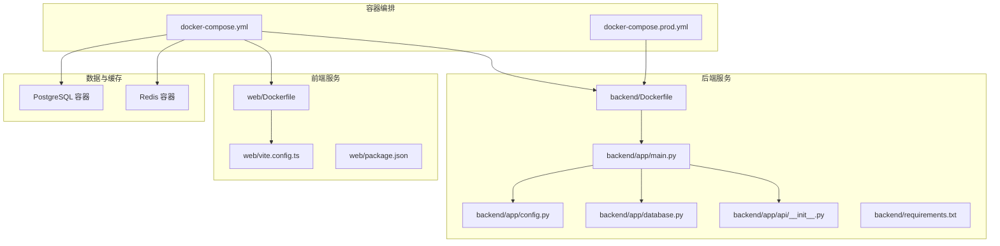
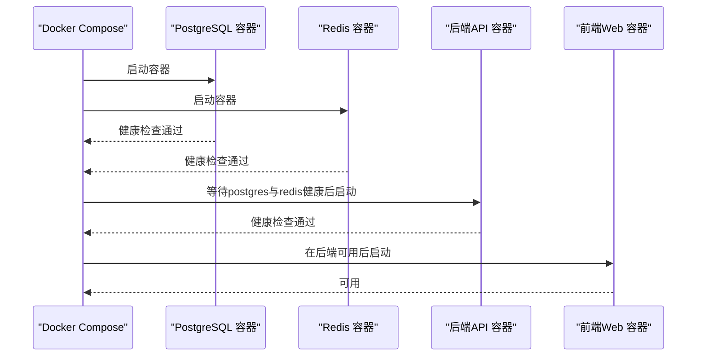
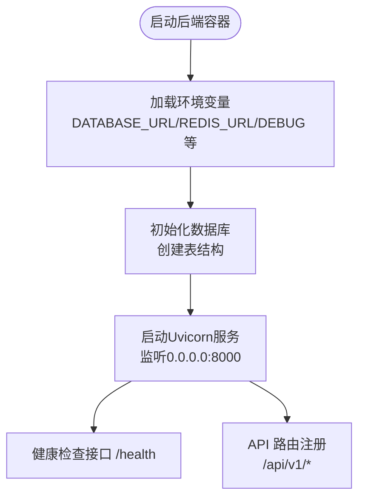
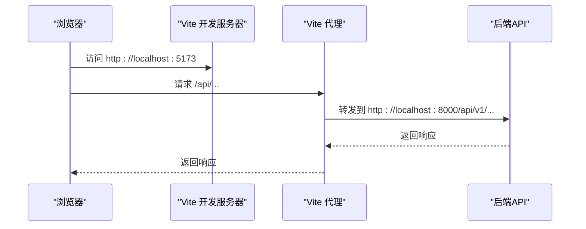
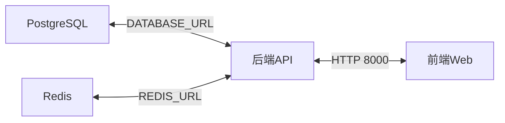

# 容器化部署

<cite>
**本文引用的文件**
- [docker-compose.yml](file://docker-compose.yml)
- [docker-compose.prod.yml](file://docker-compose.prod.yml)
- [backend/Dockerfile](file://backend/Dockerfile)
- [web/Dockerfile](file://web/Dockerfile)
- [backend/requirements.txt](file://backend/requirements.txt)
- [web/package.json](file://web/package.json)
- [backend/app/main.py](file://backend/app/main.py)
- [backend/app/config.py](file://backend/app/config.py)
- [backend/app/database.py](file://backend/app/database.py)
- [backend/app/api/__init__.py](file://backend/app/api/__init__.py)
- [web/vite.config.ts](file://web/vite.config.ts)
- [README.md](file://README.md)
</cite>

## 更新摘要
**变更内容**
- 完善了PostgreSQL数据库容器配置，包含完整的环境变量和健康检查
- 详细说明了Redis缓存容器的配置和用途
- 补充了FastAPI后端服务的完整容器编排配置
- 添加了React前端服务的容器化部署说明
- 更新了生产环境和开发环境的差异化配置
- 完善了容器间依赖关系和启动顺序说明

## 目录
1. [简介](#简介)
2. [项目结构](#项目结构)
3. [核心组件](#核心组件)
4. [架构总览](#架构总览)
5. [详细组件分析](#详细组件分析)
6. [依赖关系分析](#依赖关系分析)
7. [性能与可扩展性考虑](#性能与可扩展性考虑)
8. [故障排查指南](#故障排查指南)
9. [结论](#结论)
10. [附录：开发与生产部署配置](#附录开发与生产部署配置)

## 简介
本文件面向ActiveSynapse项目的容器化部署，围绕Docker Compose编排配置进行系统化说明，覆盖PostgreSQL数据库、Redis缓存、后端API与前端Web服务的容器配置细节，包括环境变量、端口映射、卷挂载、健康检查、容器间依赖与启动顺序，并提供开发与生产两种部署模式的差异建议。同时给出容器镜像构建流程、Dockerfile优化与多阶段构建策略建议，以及本地开发容器环境的搭建指南（含热重载与调试设置）。

## 项目结构
ActiveSynapse采用前后端分离的微服务式容器编排：
- **后端服务**：基于FastAPI，使用异步SQLAlchemy连接PostgreSQL，集成Redis缓存与JWT认证。
- **前端服务**：基于Vite + React，通过代理访问后端API。
- **数据层**：PostgreSQL持久化，Redis用于缓存与任务队列支持。
- **编排**：使用Docker Compose统一管理服务生命周期与依赖。

**图表来源**
- [docker-compose.yml:1-81](file://docker-compose.yml#L1-L81)
- [docker-compose.prod.yml:1-24](file://docker-compose.prod.yml#L1-L24)
- [backend/Dockerfile:1-24](file://backend/Dockerfile#L1-L24)
- [web/Dockerfile:1-17](file://web/Dockerfile#L1-L17)
- [backend/requirements.txt:1-40](file://backend/requirements.txt#L1-L40)
- [web/package.json:1-37](file://web/package.json#L1-L37)
- [backend/app/main.py:1-77](file://backend/app/main.py#L1-L77)
- [backend/app/config.py:1-46](file://backend/app/config.py#L1-L46)
- [backend/app/database.py:1-43](file://backend/app/database.py#L1-L43)
- [backend/app/api/__init__.py:1-10](file://backend/app/api/__init__.py#L1-L10)
- [web/vite.config.ts:1-23](file://web/vite.config.ts#L1-L23)

**章节来源**
- [docker-compose.yml:1-81](file://docker-compose.yml#L1-L81)
- [docker-compose.prod.yml:1-24](file://docker-compose.prod.yml#L1-L24)
- [backend/Dockerfile:1-24](file://backend/Dockerfile#L1-L24)
- [web/Dockerfile:1-17](file://web/Dockerfile#L1-L17)
- [backend/requirements.txt:1-40](file://backend/requirements.txt#L1-L40)
- [web/package.json:1-37](file://web/package.json#L1-L37)
- [backend/app/main.py:1-77](file://backend/app/main.py#L1-L77)
- [backend/app/config.py:1-46](file://backend/app/config.py#L1-L46)
- [backend/app/database.py:1-43](file://backend/app/database.py#L1-L43)
- [backend/app/api/__init__.py:1-10](file://backend/app/api/__init__.py#L1-L10)
- [web/vite.config.ts:1-23](file://web/vite.config.ts#L1-L23)

## 核心组件
- **PostgreSQL数据库容器**
  - 镜像：postgres:15-alpine
  - 端口：5432
  - 卷：postgres_data
  - 健康检查：pg_isready -U postgres
  - 环境变量：POSTGRES_USER、POSTGRES_PASSWORD、POSTGRES_DB
- **Redis缓存容器**
  - 镜像：redis:7-alpine
  - 端口：6379
  - 卷：redis_data
  - 健康检查：redis-cli ping
- **后端API容器**
  - 构建上下文：./backend
  - Dockerfile：backend/Dockerfile
  - 端口：8000
  - 卷：./backend:/app（热重载）
  - 依赖：postgres（健康）、redis（健康）
  - 命令：uvicorn app.main:app --host 0.0.0.0 --port 8000 --reload
  - 环境变量：DATABASE_URL、DATABASE_URL_SYNC、REDIS_URL、SECRET_KEY、DEBUG、OPENAI_API_KEY
- **前端Web容器**
  - 构建上下文：./web
  - Dockerfile：web/Dockerfile
  - 端口：5173
  - 卷：./web:/app（热重载）
  - 依赖：backend
  - 命令：npm run dev -- --host
  - 环境变量：VITE_API_URL

**章节来源**
- [docker-compose.yml:4-20](file://docker-compose.yml#L4-L20)
- [docker-compose.yml:22-34](file://docker-compose.yml#L22-L34)
- [docker-compose.yml:36-76](file://docker-compose.yml#L36-L76)
- [backend/Dockerfile:1-24](file://backend/Dockerfile#L1-L24)
- [web/Dockerfile:1-17](file://web/Dockerfile#L1-L17)

## 架构总览
容器编排遵循"后端先启动并等待数据库与缓存健康，前端再启动"的顺序，确保API可用后再提供前端开发体验。

**图表来源**
- [docker-compose.yml:54-76](file://docker-compose.yml#L54-L76)

**章节来源**
- [docker-compose.yml:54-76](file://docker-compose.yml#L54-L76)

## 详细组件分析

### PostgreSQL 数据库容器
- **配置要点**
  - 使用postgres:15-alpine轻量镜像
  - 端口5432映射到宿主机
  - 持久化卷postgres_data
  - 健康检查命令pg_isready -U postgres
  - 环境变量设置默认用户、密码与数据库名
- **运行时行为**
  - 初始化时自动创建数据库与表（由后端在启动时调用初始化逻辑）
  - 生产环境建议使用独立网络与只读卷策略，避免数据丢失

**章节来源**
- [docker-compose.yml:5-20](file://docker-compose.yml#L5-L20)

### Redis 缓存容器
- **配置要点**
  - 使用redis:7-alpine镜像
  - 端口6379映射到宿主机
  - 持久化卷redis_data
  - 健康检查命令redis-cli ping
  - 默认未启用密码保护
- **运行时行为**
  - 支持会话缓存、任务队列等场景
  - 生产环境建议开启密码认证与持久化策略

**章节来源**
- [docker-compose.yml:22-34](file://docker-compose.yml#L22-L34)

### 后端API 容器
- **镜像构建**
  - 基于python:3.11-slim
  - 安装系统依赖gcc、libpq-dev以支持异步数据库驱动
  - 安装Python依赖requirements.txt
  - 复制应用代码并创建上传目录
  - 暴露端口8000
- **运行参数**
  - 命令：uvicorn app.main:app --host 0.0.0.0 --port 8000 --reload
  - 热重载：挂载./backend:/app，忽略__pycache__缓存目录
- **环境变量**
  - DATABASE_URL/DATABASE_URL_SYNC：指向postgres容器
  - REDIS_URL：指向redis容器
  - SECRET_KEY：JWT密钥
  - DEBUG：调试开关
  - OPENAI_API_KEY：可选，用于AI功能
- **应用特性**
  - FastAPI应用，CORS中间件允许跨域
  - 异步数据库引擎与会话工厂
  - 生命周期钩子中执行数据库初始化
  - 包含根路径与健康检查接口

**图表来源**
- [backend/app/main.py:12-26](file://backend/app/main.py#L12-L26)
- [backend/app/database.py:39-43](file://backend/app/database.py#L39-L43)
- [backend/app/config.py:11-16](file://backend/app/config.py#L11-L16)

**章节来源**
- [backend/Dockerfile:1-24](file://backend/Dockerfile#L1-L24)
- [backend/app/main.py:1-77](file://backend/app/main.py#L1-L77)
- [backend/app/config.py:1-46](file://backend/app/config.py#L1-L46)
- [backend/app/database.py:1-43](file://backend/app/database.py#L1-L43)
- [backend/requirements.txt:1-40](file://backend/requirements.txt#L1-L40)

### 前端Web 容器
- **镜像构建**
  - 基于node:20-alpine
  - 安装依赖后复制源码
  - 暴露端口5173
- **运行参数**
  - 命令：npm run dev -- --host
  - 热重载：挂载./web:/app，忽略node_modules
- **开发代理**
  - Vite代理将/api前缀转发至http://localhost:8000
  - 便于本地联调后端API

**图表来源**
- [web/vite.config.ts:13-21](file://web/vite.config.ts#L13-L21)
- [docker-compose.yml:67-76](file://docker-compose.yml#L67-L76)

**章节来源**
- [web/Dockerfile:1-17](file://web/Dockerfile#L1-L17)
- [web/package.json:1-37](file://web/package.json#L1-L37)
- [web/vite.config.ts:1-23](file://web/vite.config.ts#L1-L23)
- [docker-compose.yml:61-76](file://docker-compose.yml#L61-L76)

## 依赖关系分析
- **启动顺序**
  - postgres与redis先启动并健康检查通过
  - backend在postgres与redis健康后启动
  - web在backend可用后启动
- **服务间通信**
  - backend通过服务名访问postgres与redis（容器内DNS）
  - web通过Vite代理访问后端API
- **数据与缓存**
  - 数据持久化通过卷映射实现
  - 缓存与会话通过Redis提供

**图表来源**
- [docker-compose.yml:42-48](file://docker-compose.yml#L42-L48)
- [docker-compose.yml:67-68](file://docker-compose.yml#L67-L68)

**章节来源**
- [docker-compose.yml:54-76](file://docker-compose.yml#L54-L76)

## 性能与可扩展性考虑
- **数据库**
  - 使用异步SQLAlchemy减少I/O阻塞
  - 生产环境建议启用连接池与只读副本
- **缓存**
  - Redis用于热点数据与会话存储
  - 生产环境建议开启RDB/AOF持久化与主从复制
- **后端**
  - 使用Uvicorn异步运行时
  - 生产环境建议使用Gunicorn + Uvicorn worker或Kubernetes HPA
- **前端**
  - 开发阶段使用Vite热重载
  - 生产构建使用最小化与分包策略

## 故障排查指南
- **数据库无法连接**
  - 检查DATABASE_URL是否正确指向postgres容器
  - 确认postgres容器健康状态与端口映射
- **Redis无法连接**
  - 检查REDIS_URL是否正确指向redis容器
  - 确认redis容器健康状态与端口映射
- **后端启动失败**
  - 查看日志确认数据库初始化是否成功
  - 检查DEBUG与SECRET_KEY等关键环境变量
- **前端无法访问API**
  - 确认VITE_API_URL与后端端口一致
  - 检查CORS配置与代理规则

**章节来源**
- [docker-compose.yml:42-48](file://docker-compose.yml#L42-L48)
- [docker-compose.yml:67-68](file://docker-compose.yml#L67-L68)
- [backend/app/config.py:32-33](file://backend/app/config.py#L32-L33)
- [web/vite.config.ts:15-20](file://web/vite.config.ts#L15-L20)

## 结论
ActiveSynapse的容器化部署以Docker Compose为核心，实现了数据库、缓存、后端API与前端Web的一体化编排。通过合理的环境变量、端口映射、卷挂载与健康检查，保证了服务的稳定性与可观测性。开发与生产模式可通过环境变量与构建策略灵活切换，满足不同场景需求。

## 附录：开发与生产部署配置

### 开发环境配置
- 使用Compose默认配置即可快速启动
- 后端与前端均启用热重载
- 建议在宿主机设置OPENAI_API_KEY等敏感变量
- 如需调试后端，可在IDE中附加到容器进程（参考下节）

### 生产环境配置建议
- **镜像与构建**
  - 后端：使用多阶段构建，分离依赖安装与运行时镜像，减小体积
  - 前端：使用Nginx或静态资源服务器提供生产构建产物
- **安全**
  - 设置强密钥与HTTPS
  - 限制容器权限与网络访问
- **可靠性**
  - 使用健康检查与重启策略
  - 数据与缓存持久化卷
  - 日志聚合与监控告警

### 容器镜像构建与优化
- **后端Dockerfile优化建议**
  - 分离依赖安装与代码复制步骤，利用Docker缓存
  - 移除不必要的系统包与构建工具
  - 使用更小的基础镜像（如alpine）
  - 多阶段构建：构建阶段安装依赖，运行阶段仅拷贝必要文件
- **前端Dockerfile优化建议**
  - 使用多阶段构建：构建阶段生成dist，运行阶段仅拷贝dist与Nginx
  - 清理node_modules与临时文件
  - 使用只读文件系统与非root用户运行

**章节来源**
- [backend/Dockerfile:1-24](file://backend/Dockerfile#L1-L24)
- [web/Dockerfile:1-17](file://web/Dockerfile#L1-L17)
- [backend/requirements.txt:1-40](file://backend/requirements.txt#L1-L40)
- [web/package.json:1-37](file://web/package.json#L1-L37)

### 本地开发容器环境搭建指南
- **启动服务**
  - 使用docker-compose up -d启动所有服务
  - 确保端口未被占用（5432、6379、8000、5173）
- **热重载与调试**
  - 后端：挂载./backend:/app，修改代码即触发Uvicorn热重载
  - 前端：挂载./web:/app，Vite自动刷新
  - 调试：在IDE中附加到容器进程（后端端口8000），或使用浏览器调试前端
- **API联调**
  - 前端通过Vite代理访问后端API，无需手动配置CORS
  - 确认VITE_API_URL与后端端口一致

**章节来源**
- [docker-compose.yml:51-53](file://docker-compose.yml#L51-L53)
- [docker-compose.yml:71-73](file://docker-compose.yml#L71-L73)
- [web/vite.config.ts:15-20](file://web/vite.config.ts#L15-L20)
- [backend/app/main.py:28-35](file://backend/app/main.py#L28-L35)

### 生产环境部署最佳实践
- **环境变量管理**
  - 使用.env.production文件管理生产环境变量
  - 敏感信息通过环境变量注入，不硬编码在Dockerfile中
- **健康检查配置**
  - 后端使用HTTP健康检查，定期验证API可用性
  - 数据库与缓存使用原生命令进行健康检查
- **日志与监控**
  - 配置集中式日志收集
  - 监控容器资源使用情况
  - 设置告警阈值

**章节来源**
- [docker-compose.prod.yml:1-24](file://docker-compose.prod.yml#L1-L24)
- [backend/app/config.py:1-46](file://backend/app/config.py#L1-L46)