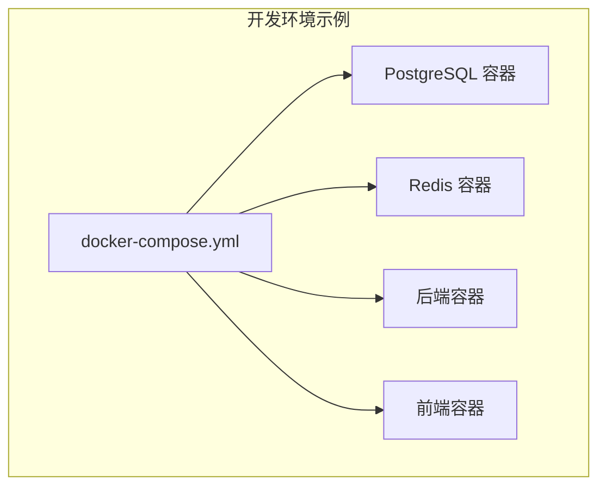
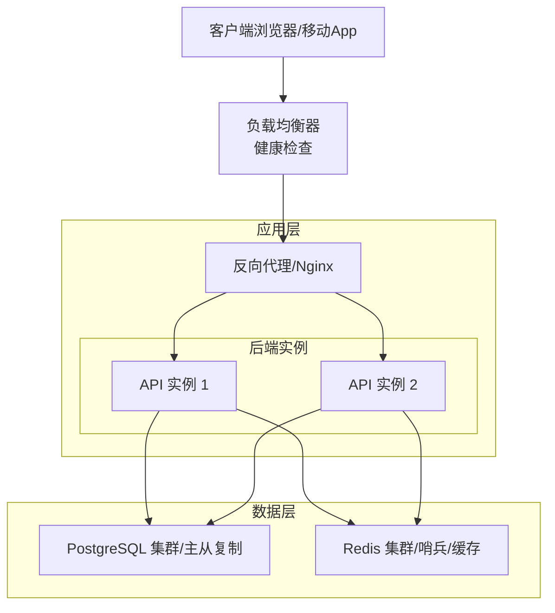
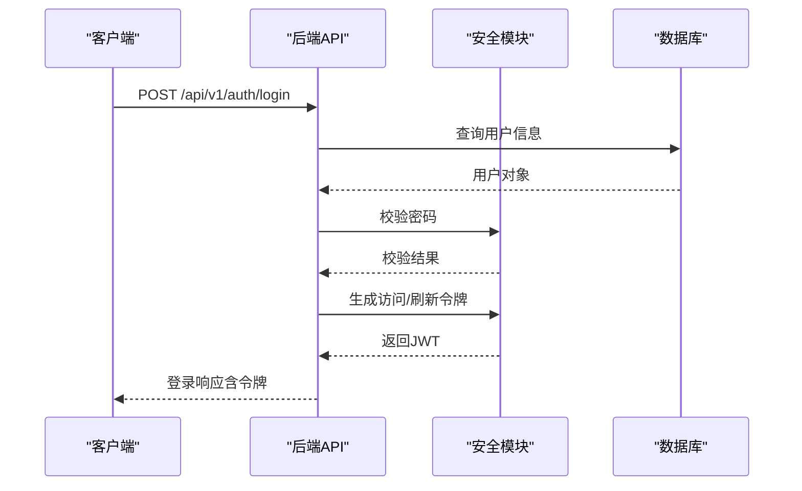
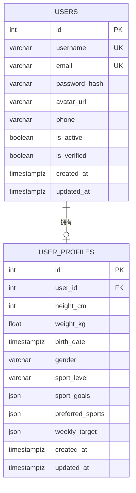
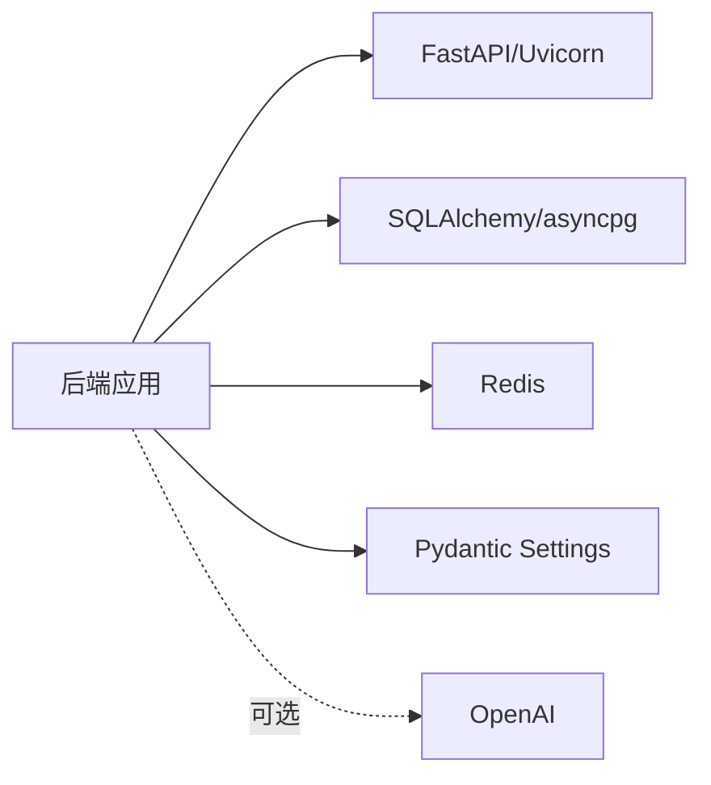

# 生产环境部署

<cite>
**本文引用的文件**
- [README.md](file://README.md)
- [docker-compose.yml](file://docker-compose.yml)
- [backend/Dockerfile](file://backend/Dockerfile)
- [web/Dockerfile](file://web/Dockerfile)
- [backend/requirements.txt](file://backend/requirements.txt)
- [backend/app/main.py](file://backend/app/main.py)
- [backend/app/config.py](file://backend/app/config.py)
- [backend/app/database.py](file://backend/app/database.py)
- [backend/app/core/security.py](file://backend/app/core/security.py)
- [backend/app/api/auth.py](file://backend/app/api/auth.py)
- [backend/app/services/user_service.py](file://backend/app/services/user_service.py)
- [backend/app/models/user.py](file://backend/app/models/user.py)
- [backend/app/schemas/user.py](file://backend/app/schemas/user.py)
</cite>

## 目录
1. [简介](#简介)
2. [项目结构](#项目结构)
3. [核心组件](#核心组件)
4. [架构总览](#架构总览)
5. [详细组件分析](#详细组件分析)
6. [依赖关系分析](#依赖关系分析)
7. [性能考虑](#性能考虑)
8. [故障排查指南](#故障排查指南)
9. [结论](#结论)
10. [附录](#附录)

## 简介
本文件面向ActiveSynapse项目的生产环境部署与运维，基于仓库现有代码与容器编排配置，提供可落地的部署建议与最佳实践。内容涵盖：生产服务器环境要求、硬件配置与网络拓扑；负载均衡与反向代理、SSL证书管理；数据库高可用与读写分离；CI/CD流水线与自动化部署；安全加固与访问控制；备份恢复与灾备；以及运维巡检、性能调优与应急响应。

## 项目结构
项目采用多容器架构，后端使用FastAPI + SQLAlchemy异步ORM，数据库为PostgreSQL，缓存为Redis，前端为Vite+React。开发阶段通过docker-compose编排服务，生产环境建议以Kubernetes或云原生平台承载，并结合外部负载均衡与反向代理统一入口。

图表来源
- [docker-compose.yml](file://docker-compose.yml#L1-L81)

章节来源
- [docker-compose.yml](file://docker-compose.yml#L1-L81)
- [backend/Dockerfile](file://backend/Dockerfile#L1-L24)
- [web/Dockerfile](file://web/Dockerfile#L1-L17)

## 核心组件
- 应用服务（后端）
  - 框架：FastAPI + Uvicorn
  - 数据库：SQLAlchemy 异步引擎 + asyncpg
  - 缓存：Redis
  - 认证：JWT（HS256），密码哈希（bcrypt）
  - 健康检查：/health
- 数据库（PostgreSQL）
  - 版本：15
  - 存储：持久卷
  - 健康检查：pg_isready
- 缓存（Redis）
  - 存储：持久卷
  - 健康检查：redis-cli ping
- 前端（Web）
  - 开发：Vite + React
  - 构建产物可通过Nginx对外提供

章节来源
- [backend/app/main.py](file://backend/app/main.py#L1-L77)
- [backend/app/config.py](file://backend/app/config.py#L1-L46)
- [backend/app/database.py](file://backend/app/database.py#L1-L43)
- [backend/app/core/security.py](file://backend/app/core/security.py#L1-L50)
- [docker-compose.yml](file://docker-compose.yml#L1-L81)

## 架构总览
下图展示生产环境典型拓扑：客户端经反向代理（Nginx/TLS终止）进入，后端服务通过负载均衡分发到多个实例，数据库与缓存由独立集群提供高可用能力。

说明
- 反向代理负责TLS终止、静态资源、请求转发与基础限流
- 后端实例无状态，支持水平扩展
- 数据库与缓存均采用高可用方案（主从/副本/集群）

## 详细组件分析

### 后端服务（FastAPI）
- 应用生命周期与启动
  - 使用 lifespan 在启动时初始化数据库表结构
  - 提供根路径与健康检查接口
- 中间件与异常处理
  - CORS中间件按配置允许跨域
  - 统一异常处理器返回标准化错误
- 路由与认证
  - 路由前缀/api/v1
  - JWT令牌签发与刷新流程
  - 密码哈希与校验

图表来源
- [backend/app/api/auth.py](file://backend/app/api/auth.py#L25-L49)
- [backend/app/core/security.py](file://backend/app/core/security.py#L11-L18)
- [backend/app/services/user_service.py](file://backend/app/services/user_service.py#L61-L68)

章节来源
- [backend/app/main.py](file://backend/app/main.py#L12-L77)
- [backend/app/api/auth.py](file://backend/app/api/auth.py#L1-L92)
- [backend/app/core/security.py](file://backend/app/core/security.py#L1-L50)
- [backend/app/services/user_service.py](file://backend/app/services/user_service.py#L1-L120)

### 数据库与模型
- 连接与会话
  - 异步引擎与会话工厂
  - 初始化时自动创建所有表
- 用户与档案模型
  - 用户表含唯一索引（用户名、邮箱）
  - 用户档案一对一关联，级联删除
- 事务与回滚
  - 会话在异常时自动回滚并关闭

图表来源
- [backend/app/models/user.py](file://backend/app/models/user.py#L7-L62)
- [backend/app/database.py](file://backend/app/database.py#L1-L43)

章节来源
- [backend/app/database.py](file://backend/app/database.py#L1-L43)
- [backend/app/models/user.py](file://backend/app/models/user.py#L1-L62)
- [backend/app/schemas/user.py](file://backend/app/schemas/user.py#L1-L69)

### 配置与环境变量
- 关键配置项
  - 应用名称、版本、调试开关
  - 数据库连接（异步/同步）、Redis连接
  - JWT密钥、算法、过期时间
  - 文件上传目录与大小限制
  - 允许的CORS来源
- 默认值与覆盖
  - 通过.env文件加载，支持覆盖默认值

章节来源
- [backend/app/config.py](file://backend/app/config.py#L1-L46)

### 前端与容器化
- 后端容器
  - 基于Python 3.11 slim镜像
  - 安装系统依赖与Python依赖
  - 暴露8000端口，使用Uvicorn运行
- 前端容器
  - 基于Node 20 alpine
  - 安装依赖后运行开发服务器

章节来源
- [backend/Dockerfile](file://backend/Dockerfile#L1-L24)
- [web/Dockerfile](file://web/Dockerfile#L1-L17)

## 依赖关系分析
- 运行时依赖
  - FastAPI、Uvicorn、SQLAlchemy、asyncpg、Redis、Passlib、Pydantic Settings、OpenAI等
- 组件耦合
  - 后端对数据库与缓存存在直接依赖
  - 认证模块依赖配置中的密钥与算法
- 外部集成
  - OpenAI API（可选），用于AI相关功能

图表来源
- [backend/requirements.txt](file://backend/requirements.txt#L1-L40)
- [backend/app/config.py](file://backend/app/config.py#L1-L46)

章节来源
- [backend/requirements.txt](file://backend/requirements.txt#L1-L40)

## 性能考虑
- 数据库
  - 异步连接池与NullPool在开发环境启用echo便于调试；生产建议使用专用连接池并开启连接复用与超时控制
  - 主从复制与只读副本用于读扩展，写操作路由至主库
- 缓存
  - Redis集群+哨兵实现高可用；热点数据预热与失效策略需结合业务设计
- 应用
  - 启动时一次性初始化表结构，避免运行时DDL
  - 严格控制日志级别与调试开关，减少I/O开销
- 反向代理
  - 启用Gzip/HTTP/2，合理设置超时与缓冲区
  - 对静态资源进行长缓存与版本化

## 故障排查指南
- 健康检查
  - 后端：/health
  - 数据库：pg_isready
  - 缓存：redis-cli ping
- 常见问题定位
  - 数据库连接失败：核对DATABASE_URL、网络连通性与凭据
  - JWT鉴权失败：确认SECRET_KEY一致、算法匹配、令牌未过期
  - 文件上传异常：检查UPLOAD_DIR权限与MAX_FILE_SIZE限制
- 日志与监控
  - 后端输出结构化日志，接入集中式日志系统
  - 监控CPU/内存/IO、数据库QPS与慢查询、Redis命中率

章节来源
- [docker-compose.yml](file://docker-compose.yml#L16-L34)
- [backend/app/main.py](file://backend/app/main.py#L69-L71)
- [backend/app/config.py](file://backend/app/config.py#L28-L31)

## 结论
本部署文档基于现有代码与容器编排，给出了生产环境的实施建议。建议尽快完成以下工作：替换开发默认配置为生产密钥与参数、引入外部负载均衡与反向代理、搭建数据库与缓存高可用集群、完善CI/CD流水线与自动化部署、制定备份恢复与灾备计划，并建立标准化的运维巡检与应急响应流程。

## 附录

### 生产服务器环境要求
- 操作系统
  - Linux（推荐Ubuntu 22.04 LTS或CentOS Stream）
- CPU与内存
  - 至少2核CPU、4GB内存起步；根据QPS与并发调整
- 存储
  - SSD系统盘；数据库与缓存持久化卷容量按业务峰值评估
- 网络
  - 开放端口：80/443（反向代理）、8000（后端）、5432（数据库）、6379（Redis）
  - 防火墙仅放行必要端口，内网数据库与缓存访问

### 硬件配置建议
- 后端实例：2核4GB，建议2-4个实例，配合负载均衡
- 数据库：主库2核4GB以上，至少1个只读副本，SSD存储
- 缓存：Redis主从或哨兵模式，单节点2核4GB起步，建议集群化

### 网络拓扑与安全
- 反向代理（Nginx）部署于公网侧，终止TLS，内部转发至后端
- 后端与数据库、缓存之间通过内网通信
- 防火墙规则最小化放行，禁止外网直连数据库与缓存

### 负载均衡与反向代理
- 负载均衡器
  - 健康检查：/health
  - 调度策略：轮询或最少连接
- 反向代理
  - TLS证书管理：Let’s Encrypt或企业CA
  - 请求头透传：X-Real-IP、X-Forwarded-Proto、X-Forwarded-Host
  - 超时与缓冲：合理设置proxy_read_timeout与proxy_buffer_size

### SSL证书管理
- 自动续期：certbot + cron
- 证书存放：受保护的文件系统或密钥管理服务
- 证书链与DH参数优化

### 数据库高可用与读写分离
- PostgreSQL
  - 主从复制：逻辑复制或物理复制
  - 只读副本：用于报表与读多场景
  - VIP/仲裁：实现故障切换
- 读写分离
  - 写库：主库
  - 读库：只读副本，按业务拆分读流量

### 备份恢复与灾备
- 数据库备份
  - 全量+增量+WAL归档
  - 多地容灾：至少异地一个副本
- 缓存备份
  - RDB/AOF持久化策略
- 恢复演练
  - 定期演练恢复流程，验证RTO/RPO

### CI/CD流水线与自动化部署
- 触发条件：push到主分支或打标签
- 步骤建议
  - 代码扫描与单元测试
  - 构建镜像（后端与前端）
  - 推送镜像到私有仓库
  - 发布到Kubernetes（蓝绿/金丝雀）
  - 健康检查与回滚策略
- 版本发布
  - 语义化版本号，变更日志与发布说明

### 安全加固与访问控制
- 网络安全
  - 防火墙最小放行、内网隔离
  - WAF与DDoS防护
- 应用安全
  - 强制HTTPS、HSTS
  - 最小权限原则与密钥轮换
  - 输入校验与SQL注入防护
- 身份与授权
  - JWT令牌有效期与刷新机制
  - 多因素认证（MFA）可选

### 运维巡检清单
- 每日
  - 健康检查、日志告警、磁盘空间、连接数
- 每周
  - 数据库慢查询、缓存命中率、备份完整性
- 每月
  - 安全基线检查、补丁更新、容量规划

### 性能调优指南
- 数据库
  - 索引优化、查询计划分析、连接池参数
- 缓存
  - 策略优化（LRU/LFU）、热点数据预热
- 应用
  - 并发与超时参数、异步任务队列（Celery）配置

### 应急响应流程
- 事件分级与响应时间
- 快速隔离与降级策略
- 回滚与修复步骤
- 事后复盘与改进