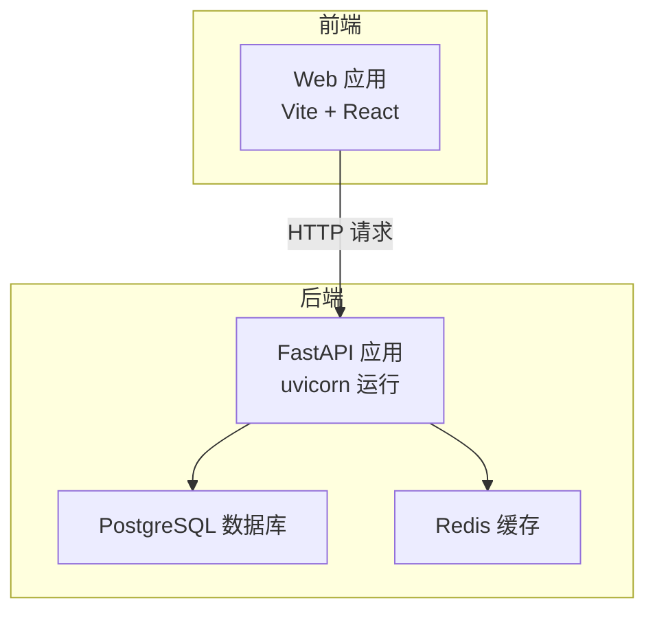
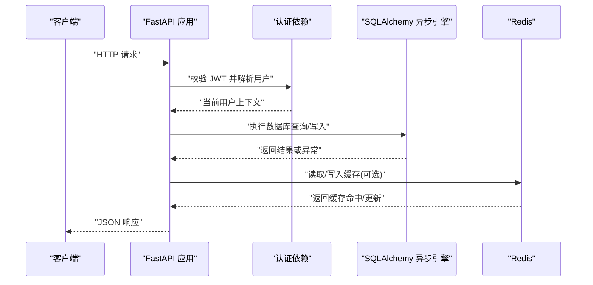
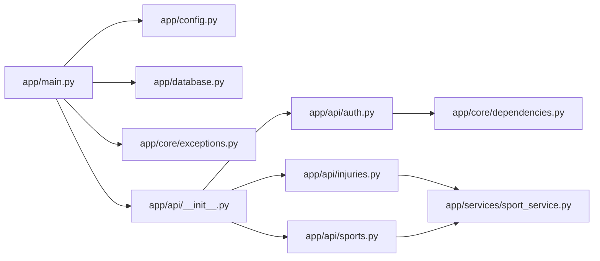

# 监控与日志

<cite>
**本文引用的文件**
- [backend/app/main.py](file://backend/app/main.py)
- [backend/app/config.py](file://backend/app/config.py)
- [backend/app/database.py](file://backend/app/database.py)
- [backend/app/core/exceptions.py](file://backend/app/core/exceptions.py)
- [backend/app/core/dependencies.py](file://backend/app/core/dependencies.py)
- [backend/app/api/__init__.py](file://backend/app/api/__init__.py)
- [backend/app/api/auth.py](file://backend/app/api/auth.py)
- [backend/app/api/injuries.py](file://backend/app/api/injuries.py)
- [backend/app/api/sports.py](file://backend/app/api/sports.py)
- [backend/app/services/sport_service.py](file://backend/app/services/sport_service.py)
- [backend/docker-compose.yml](file://backend/docker-compose.yml)
- [backend/Dockerfile](file://backend/Dockerfile)
- [backend/requirements.txt](file://backend/requirements.txt)
</cite>

## 目录
1. [简介](#简介)
2. [项目结构](#项目结构)
3. [核心组件](#核心组件)
4. [架构总览](#架构总览)
5. [详细组件分析](#详细组件分析)
6. [依赖分析](#依赖分析)
7. [性能考虑](#性能考虑)
8. [故障排查指南](#故障排查指南)
9. [结论](#结论)
10. [附录](#附录)

## 简介
本文件面向ActiveSynapse项目的运维与开发团队，系统化梳理并设计监控与日志体系，覆盖应用性能监控、数据库性能监控、API响应时间监控、日志级别与格式、日志轮转策略、错误追踪与异常报告、告警通知、Prometheus指标采集与Grafana仪表板、分布式追踪与链路监控、性能瓶颈分析方法，并提供可落地的监控告警规则与故障诊断流程。

当前代码库未内置监控与日志实现（如日志库、指标导出器、追踪中间件等），因此本方案在不侵入现有业务逻辑的前提下，提出可扩展的监控与日志集成路径，确保与FastAPI、SQLAlchemy异步引擎、Redis缓存及容器化部署无缝衔接。

## 项目结构
后端采用FastAPI + SQLAlchemy异步ORM + Redis + PostgreSQL的典型架构；前端通过Docker Compose编排运行。整体服务包括：Web前端、后端API、PostgreSQL数据库、Redis缓存。

图表来源
- [backend/docker-compose.yml](file://backend/docker-compose.yml#L36-L76)
- [backend/Dockerfile](file://backend/Dockerfile#L1-L24)

章节来源
- [backend/docker-compose.yml](file://backend/docker-compose.yml#L1-L81)
- [backend/Dockerfile](file://backend/Dockerfile#L1-L24)

## 核心组件
- 应用入口与生命周期管理：负责启动数据库连接、注册路由、异常处理与健康检查端点。
- 配置中心：集中管理数据库、Redis、JWT、AI、CORS等配置项。
- 异常体系：统一的业务异常类型与全局异常处理器，便于日志与告警的结构化输出。
- 数据层：异步SQLAlchemy引擎与会话工厂，支持调试模式下的SQL回显。
- 依赖注入：认证与授权中间流程，为审计与追踪埋下用户维度信息。
- API 路由：按功能模块组织接口，便于按模块统计与告警。

章节来源
- [backend/app/main.py](file://backend/app/main.py#L1-L77)
- [backend/app/config.py](file://backend/app/config.py#L1-L46)
- [backend/app/core/exceptions.py](file://backend/app/core/exceptions.py#L1-L54)
- [backend/app/database.py](file://backend/app/database.py#L1-L43)
- [backend/app/core/dependencies.py](file://backend/app/core/dependencies.py#L1-L61)
- [backend/app/api/__init__.py](file://backend/app/api/__init__.py#L1-L10)

## 架构总览
下图展示从客户端到后端、数据库与缓存的整体调用链，以及监控与日志的关键落点。

图表来源
- [backend/app/main.py](file://backend/app/main.py#L38-L53)
- [backend/app/core/dependencies.py](file://backend/app/core/dependencies.py#L11-L60)
- [backend/app/database.py](file://backend/app/database.py#L26-L37)

## 详细组件分析

### 应用性能监控
- 指标建议
  - 请求总量与成功率：按路径、方法、状态码聚合。
  - 请求延迟分位数：P50/P90/P95/P99，区分成功与失败。
  - 并发请求数：衡量瞬时负载。
  - 错误率：4xx/5xx占比，区分业务异常与系统异常。
  - 认证与授权耗时：从鉴权依赖开始到返回响应的时延。
- 实现要点
  - 在FastAPI中间件中埋点，记录请求进入、处理完成、异常抛出的时间戳。
  - 使用结构化日志输出，包含trace_id、span_id、用户ID、路径、方法、状态码、耗时等字段。
  - 将关键指标暴露为文本格式供Prometheus抓取，或使用OpenTelemetry SDK导出到Prometheus。

章节来源
- [backend/app/main.py](file://backend/app/main.py#L38-L53)
- [backend/app/core/dependencies.py](file://backend/app/core/dependencies.py#L11-L60)

### 数据库性能监控
- 指标建议
  - 连接池使用率、空闲连接数、等待获取连接的请求数。
  - SQL执行时间分布、慢查询阈值命中次数。
  - 事务提交/回滚次数与失败率。
- 当前实现
  - 异步引擎在DEBUG模式下开启echo，便于开发期观察SQL。
  - 会话工厂配置expire_on_commit、autocommit/autoflush关闭，减少不必要的开销。
- 建议
  - 生产环境关闭echo，使用数据库慢查询日志与性能视图进行观测。
  - 结合连接池参数与并发峰值，评估最大连接数与超时配置。

章节来源
- [backend/app/database.py](file://backend/app/database.py#L7-L20)
- [backend/app/database.py](file://backend/app/database.py#L26-L43)
- [backend/app/config.py](file://backend/app/config.py#L8-L9)

### API响应时间监控
- 建议
  - 对每个路由统计“处理时长”与“数据库时长”、“缓存时长”（可选）。
  - 区分“认证鉴权”阶段与“业务处理”阶段的耗时，定位瓶颈。
- 实现
  - 中间件在请求进入与退出时打点，结合数据库会话生命周期统计各阶段耗时。
  - 对异常路径也记录耗时，避免漏报。

章节来源
- [backend/app/main.py](file://backend/app/main.py#L38-L53)
- [backend/app/api/__init__.py](file://backend/app/api/__init__.py#L1-L10)

### 日志级别设置、日志格式标准化与日志轮转策略
- 日志级别
  - 开发：INFO/DEBUG，便于问题定位。
  - 生产：ERROR/WARNING/INFO，避免过多调试日志影响性能。
- 日志格式
  - 结构化JSON：包含timestamp、level、service、module、function、line、trace_id、span_id、user_id、method、path、status_code、duration_ms、exception、stack_trace等字段。
  - 统一日志字段命名规范，确保多服务日志聚合与检索一致。
- 日志轮转
  - 基于时间与大小的轮转策略，保留N份历史日志。
  - 将应用日志输出到stdout/stderr，由容器平台或logrotate统一采集与轮转。

章节来源
- [backend/app/config.py](file://backend/app/config.py#L8-L9)
- [backend/app/main.py](file://backend/app/main.py#L1-L77)

### 错误追踪系统、异常报告机制与告警通知
- 错误追踪
  - 全局异常处理器捕获业务异常与通用异常，统一返回结构化错误体。
  - 在日志中记录异常堆栈与上下文信息，便于回溯。
- 异常报告
  - 对5xx类错误自动上报至错误追踪平台（如Sentry/OpenTelemetry），包含trace_id、用户ID、请求上下文。
- 告警通知
  - 基于Prometheus Alertmanager对错误率、延迟、连接池饱和、数据库慢查询等阈值触发告警。
  - 通知渠道：邮件、IM、电话等，分级处理。

章节来源
- [backend/app/main.py](file://backend/app/main.py#L38-L53)
- [backend/app/core/exceptions.py](file://backend/app/core/exceptions.py#L1-L54)

### Prometheus指标收集与Grafana仪表板
- 指标采集
  - 使用文本格式指标（textfile collector）或OpenTelemetry Exporter。
  - 关键指标：requests_total、requests_duration_seconds、db_pool_connections、db_slow_queries、cache_hit_ratio、error_rate。
- Grafana仪表板
  - 面板建议：请求速率与错误率、P95延迟、数据库连接池使用、慢查询TopN、缓存命中率、用户活跃度与业务指标（如运动记录创建数）。

章节来源
- [backend/app/main.py](file://backend/app/main.py#L69-L71)
- [backend/app/database.py](file://backend/app/database.py#L7-L20)

### 分布式追踪、链路监控与性能瓶颈分析
- 追踪
  - 为每次请求生成trace_id与span_id，贯穿API、数据库、缓存调用。
  - 在日志中输出trace_id与span_id，支持跨服务关联查询。
- 链路监控
  - 以路径/用户/时间段为维度，分析端到端耗时与各子阶段耗时。
- 瓶颈分析
  - 识别慢查询、高延迟路由、缓存未命中热点、认证鉴权耗时过高等。

章节来源
- [backend/app/main.py](file://backend/app/main.py#L38-L53)
- [backend/app/core/dependencies.py](file://backend/app/core/dependencies.py#L11-L60)

### 运维团队监控告警规则与故障诊断流程
- 告警规则示例
  - 错误率 > 1%（5分钟滚动窗口）
  - P95延迟 > 2s（5分钟滚动窗口）
  - 数据库连接池空闲连接 < 10%
  - 缓存命中率 < 80%
  - 健康检查失败或响应时间异常
- 故障诊断流程
  - 快速确认：查看健康检查、错误率、延迟趋势。
  - 定位根因：查看慢查询、慢路由、缓存命中率、数据库连接池状态。
  - 复现与修复：基于日志与追踪ID复现问题，修复后回归验证。
  - 回顾与优化：沉淀告警规则与优化建议。

章节来源
- [backend/app/main.py](file://backend/app/main.py#L69-L71)
- [backend/docker-compose.yml](file://backend/docker-compose.yml#L16-L34)

## 依赖分析
- 外部依赖
  - FastAPI/uvicorn：Web框架与ASGI服务器。
  - SQLAlchemy异步：数据库ORM与连接池。
  - Redis：缓存与会话存储。
  - Celery：任务队列（可用于异步指标上报或日志采集）。
- 内部耦合
  - 主应用依赖配置中心、数据库引擎、异常体系与路由集合。
  - API路由依赖认证依赖与数据库会话。
  - 服务层依赖数据库会话与模型定义。

图表来源
- [backend/app/main.py](file://backend/app/main.py#L1-L77)
- [backend/app/config.py](file://backend/app/config.py#L1-L46)
- [backend/app/database.py](file://backend/app/database.py#L1-L43)
- [backend/app/core/exceptions.py](file://backend/app/core/exceptions.py#L1-L54)
- [backend/app/api/__init__.py](file://backend/app/api/__init__.py#L1-L10)
- [backend/app/api/auth.py](file://backend/app/api/auth.py#L30-L70)
- [backend/app/api/injuries.py](file://backend/app/api/injuries.py#L13-L39)
- [backend/app/api/sports.py](file://backend/app/api/sports.py#L108-L126)
- [backend/app/core/dependencies.py](file://backend/app/core/dependencies.py#L1-L61)
- [backend/app/services/sport_service.py](file://backend/app/services/sport_service.py#L34-L67)

章节来源
- [backend/requirements.txt](file://backend/requirements.txt#L1-L40)
- [backend/app/main.py](file://backend/app/main.py#L1-L77)

## 性能考虑
- 数据库
  - 合理设置连接池大小与超时，避免连接争用。
  - 使用索引与查询优化，关注慢查询日志。
- 缓存
  - 利用Redis缓存热点数据，降低数据库压力。
  - 设置合理的TTL与淘汰策略，避免内存膨胀。
- API
  - 控制单次查询的limit，避免一次性返回大量数据。
  - 对高频接口启用缓存与限流。
- 日志
  - 生产环境避免DEBUG日志，控制日志量与I/O开销。
  - 使用结构化日志与异步写入，减少阻塞。

章节来源
- [backend/app/database.py](file://backend/app/database.py#L7-L20)
- [backend/app/config.py](file://backend/app/config.py#L8-L9)

## 故障排查指南
- 健康检查
  - 访问健康检查端点，确认服务可用性。
- 日志定位
  - 根据trace_id与用户ID筛选日志，快速定位异常请求。
- 数据库问题
  - 检查连接池状态、慢查询与锁等待。
- 缓存问题
  - 校验Key空间、TTL与命中率，排查缓存穿透与雪崩。
- 异常处理
  - 查看全局异常处理器返回的错误详情，结合业务异常类型定位问题。

章节来源
- [backend/app/main.py](file://backend/app/main.py#L69-L71)
- [backend/app/main.py](file://backend/app/main.py#L38-L53)
- [backend/app/core/exceptions.py](file://backend/app/core/exceptions.py#L1-L54)

## 结论
本方案在不改变现有业务逻辑的前提下，提供了可扩展的监控与日志体系：统一的日志格式与轮转策略、结构化的异常处理与告警、可落地的Prometheus指标与Grafana仪表板、以及基于追踪的链路监控与性能瓶颈分析方法。建议尽快引入日志库、指标导出器与追踪中间件，并结合容器化部署完善日志采集与轮转。

## 附录
- 快速清单
  - 引入结构化日志库与轮转配置。
  - 在中间件中埋点，输出trace_id/spans与关键指标。
  - 配置Prometheus抓取与Alertmanager告警。
  - 在Grafana中创建关键面板与仪表板。
  - 对数据库与缓存增加慢查询与命中率监控。
  - 明确故障排查流程与升级预案。