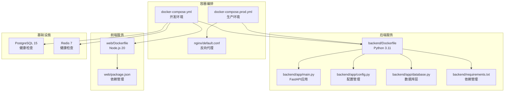
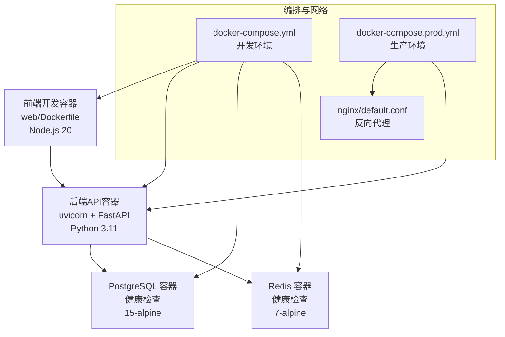
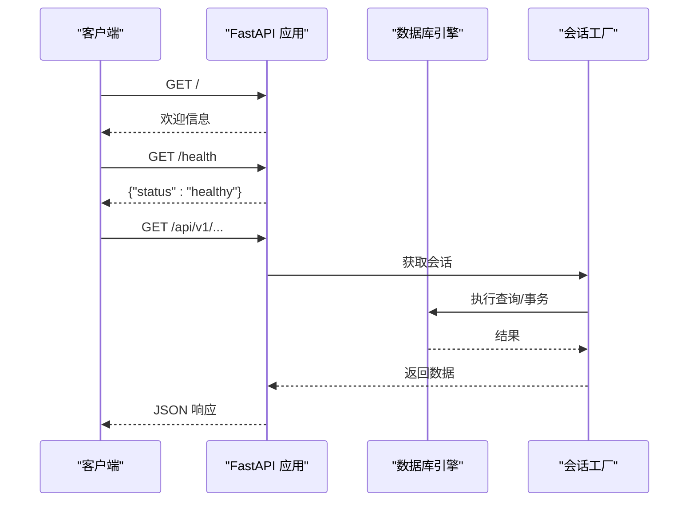
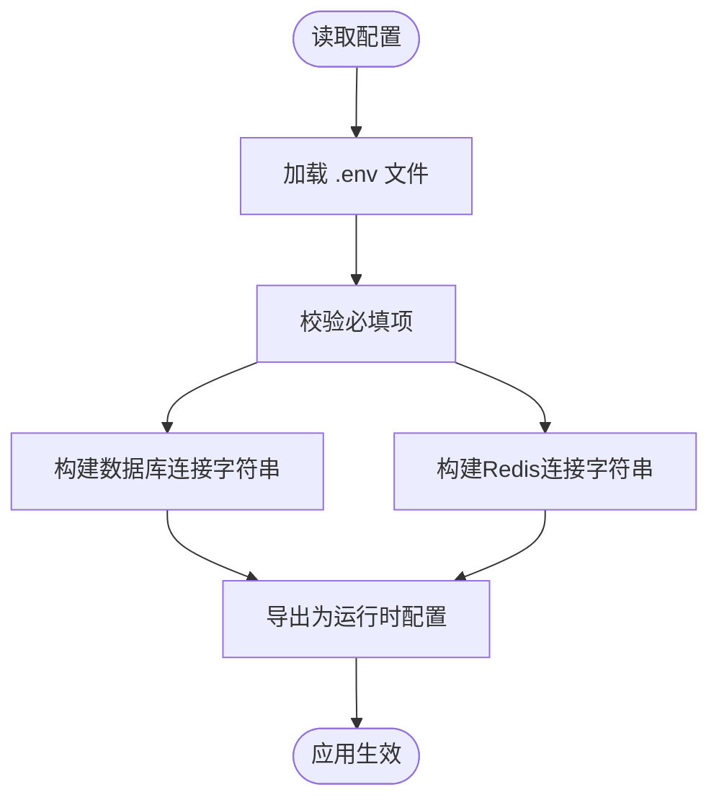
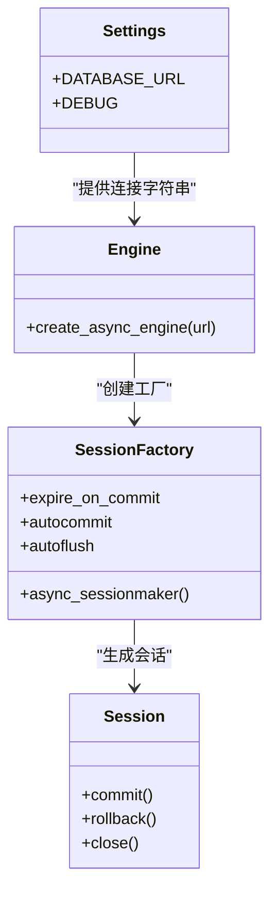
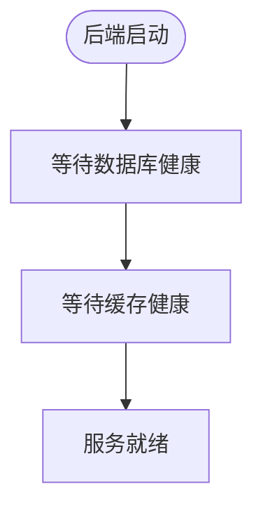
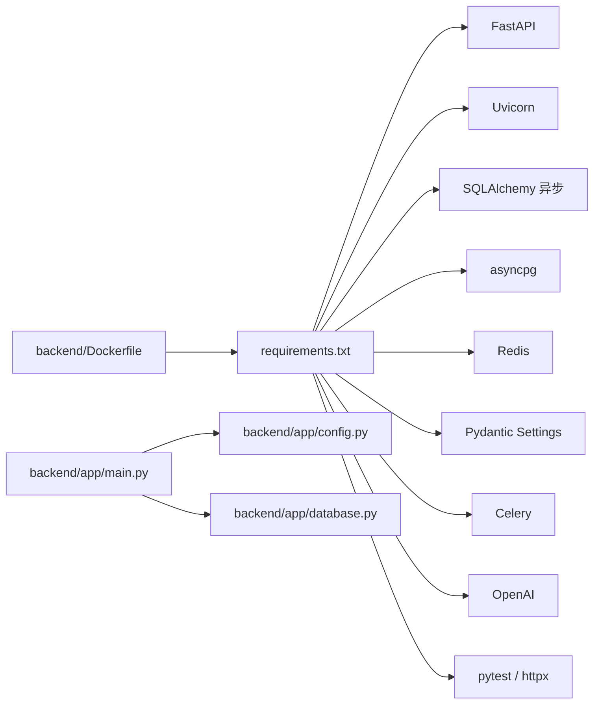
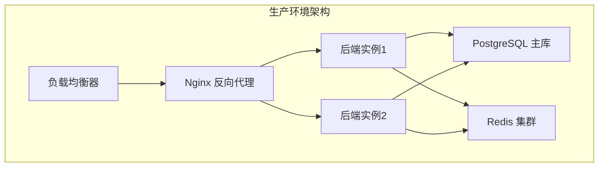

# 部署与运维

<cite>
**本文引用的文件**
- [docker-compose.yml](file://docker-compose.yml)
- [docker-compose.prod.yml](file://docker-compose.prod.yml)
- [backend/Dockerfile](file://backend/Dockerfile)
- [web/Dockerfile](file://web/Dockerfile)
- [nginx/default.conf](file://nginx/default.conf)
- [backend/app/main.py](file://backend/app/main.py)
- [backend/app/config.py](file://backend/app/config.py)
- [backend/app/database.py](file://backend/app/database.py)
- [backend/requirements.txt](file://backend/requirements.txt)
- [web/package.json](file://web/package.json)
- [README.md](file://README.md)
</cite>

## 目录
1. [简介](#简介)
2. [项目结构](#项目结构)
3. [核心组件](#核心组件)
4. [架构总览](#架构总览)
5. [详细组件分析](#详细组件分析)
6. [依赖关系分析](#依赖关系分析)
7. [开发环境部署流程](#开发环境部署流程)
8. [生产环境部署流程](#生产环境部署流程)
9. [性能考量](#性能考量)
10. [故障排查指南](#故障排查指南)
11. [结论](#结论)
12. [附录](#附录)

## 简介
本文件面向ActiveSynapse项目的运维与开发团队，提供从单机到生产级的完整部署与运维指南。内容涵盖Docker容器化部署、开发环境配置管理、生产环境部署流程、负载均衡配置和高可用性设置、数据库备份策略、灾难恢复计划、性能监控指标、服务器环境要求、网络配置和安全加固措施、自动部署配置、版本发布流程和回滚策略、日志收集与错误追踪、性能分析工具、故障排查指南、性能优化建议和容量规划。ActiveSynapse采用多服务容器化架构：后端FastAPI服务、前端Vite开发服务、PostgreSQL数据库与Redis缓存通过Compose统一编排。

## 项目结构
ActiveSynapse采用多服务容器化架构：后端FastAPI服务、前端Vite开发服务、PostgreSQL数据库与Redis缓存通过Compose统一编排。后端与前端分别拥有独立的Dockerfile与构建上下文；数据库与缓存使用持久卷以保障数据持久化；后端服务通过健康检查确保依赖服务就绪后再启动。



**图示来源**
- [docker-compose.yml:1-81](file://docker-compose.yml#L1-L81)
- [docker-compose.prod.yml:1-24](file://docker-compose.prod.yml#L1-L24)
- [nginx/default.conf:1-17](file://nginx/default.conf#L1-L17)
- [backend/Dockerfile:1-24](file://backend/Dockerfile#L1-L24)
- [web/Dockerfile:1-17](file://web/Dockerfile#L1-L17)
- [backend/app/main.py:1-77](file://backend/app/main.py#L1-L77)
- [backend/app/config.py:1-46](file://backend/app/config.py#L1-L46)
- [backend/app/database.py:1-43](file://backend/app/database.py#L1-L43)
- [backend/requirements.txt:1-40](file://backend/requirements.txt#L1-L40)
- [web/package.json:1-37](file://web/package.json#L1-L37)

**章节来源**
- [docker-compose.yml:1-81](file://docker-compose.yml#L1-L81)
- [docker-compose.prod.yml:1-24](file://docker-compose.prod.yml#L1-L24)
- [backend/Dockerfile:1-24](file://backend/Dockerfile#L1-L24)
- [web/Dockerfile:1-17](file://web/Dockerfile#L1-L17)
- [README.md:1-3](file://README.md#L1-L3)

## 核心组件
- 应用入口与生命周期：后端通过FastAPI应用入口定义CORS、异常处理、路由挂载与健康检查端点，并在生命周期钩子中初始化数据库。
- 配置管理：使用Pydantic Settings加载环境变量，支持异步数据库连接、Redis连接、JWT密钥、AI集成参数、上传目录与大小限制、CORS白名单等。
- 数据库层：基于SQLAlchemy异步引擎与会话工厂，提供依赖注入式数据库会话，支持自动建表与事务回滚。
- 健康检查：Compose为数据库与缓存配置了健康检查命令，后端提供/health端点。
- 前端开发：前端使用Vite开发服务器，暴露5173端口，后端API代理地址通过环境变量配置。

**章节来源**
- [backend/app/main.py:1-77](file://backend/app/main.py#L1-L77)
- [backend/app/config.py:1-46](file://backend/app/config.py#L1-L46)
- [backend/app/database.py:1-43](file://backend/app/database.py#L1-L43)

## 架构总览
下图展示容器化部署的端到端交互：前端通过Vite开发服务器访问后端API，后端通过异步数据库连接与Redis缓存交互，数据库与缓存由Compose编排并持久化存储。



**图示来源**
- [docker-compose.yml:1-81](file://docker-compose.yml#L1-L81)
- [docker-compose.prod.yml:1-24](file://docker-compose.prod.yml#L1-L24)
- [nginx/default.conf:1-17](file://nginx/default.conf#L1-L17)
- [backend/Dockerfile:1-24](file://backend/Dockerfile#L1-L24)
- [web/Dockerfile:1-17](file://web/Dockerfile#L1-L17)

## 详细组件分析

### 后端服务（FastAPI + Uvicorn）
- 启动与生命周期：应用在启动时初始化数据库，在关闭时释放资源。
- 异常处理：针对自定义业务异常与通用异常分别返回JSON响应。
- 路由与健康检查：根路径提供欢迎信息与文档链接，/health提供健康状态。
- 依赖注入：数据库会话通过异步生成器提供，自动提交、回滚与关闭。



**图示来源**
- [backend/app/main.py:21-77](file://backend/app/main.py#L21-L77)
- [backend/app/database.py:26-43](file://backend/app/database.py#L26-L43)

**章节来源**
- [backend/app/main.py:1-77](file://backend/app/main.py#L1-L77)
- [backend/app/database.py:1-43](file://backend/app/database.py#L1-L43)

### 配置与环境变量
- 关键配置项：应用名称、调试模式、版本号、数据库URL（异步与同步）、Redis URL、JWT密钥与过期时间、AI集成参数、上传目录与大小限制、CORS允许来源列表。
- 加载机制：通过Pydantic Settings从.env文件加载，支持运行时覆盖。



**图示来源**
- [backend/app/config.py:5-46](file://backend/app/config.py#L5-L46)

**章节来源**
- [backend/app/config.py:1-46](file://backend/app/config.py#L1-L46)

### 数据库与会话管理
- 引擎与池化：使用异步引擎，当前示例采用空池类以简化开发环境；生产建议根据并发与资源评估选择合适池化策略。
- 会话工厂：提供异步会话工厂，支持自动提交、回滚与关闭。
- 初始化：在应用启动时自动创建所有模型对应的表。



**图示来源**
- [backend/app/database.py:1-43](file://backend/app/database.py#L1-L43)
- [backend/app/config.py:11-16](file://backend/app/config.py#L11-L16)

**章节来源**
- [backend/app/database.py:1-43](file://backend/app/database.py#L1-L43)
- [backend/app/config.py:1-46](file://backend/app/config.py#L1-L46)

### 健康检查与依赖关系
- 数据库健康检查：使用pg_isready命令定期探测，失败重试次数与间隔可调。
- 缓存健康检查：使用redis-cli ping探测。
- 服务依赖：后端服务等待数据库与缓存均健康后再启动，避免冷启动失败。



**图示来源**
- [docker-compose.yml:16-34](file://docker-compose.yml#L16-L34)
- [docker-compose.yml:54-58](file://docker-compose.yml#L54-L58)

**章节来源**
- [docker-compose.yml:1-81](file://docker-compose.yml#L1-L81)

### 前端开发容器
- 开发服务器：Vite开发服务器监听5173端口，支持热更新。
- 环境变量：通过VITE_API_URL指向后端API前缀。
- 依赖管理：TypeScript、React、Ant Design、Axios等。

**章节来源**
- [web/Dockerfile:1-17](file://web/Dockerfile#L1-L17)
- [web/package.json:1-37](file://web/package.json#L1-L37)
- [docker-compose.yml:61-77](file://docker-compose.yml#L61-L77)

## 依赖关系分析
- 运行时依赖：后端使用FastAPI、Uvicorn、SQLAlchemy异步、asyncpg、Redis、Pydantic Settings、Celery、OpenAI等。
- 构建阶段：后端Dockerfile安装系统依赖（如gcc、libpq-dev）以满足Python包编译需求。
- 组件耦合：后端对配置模块与数据库模块存在直接依赖；应用入口对异常处理与路由进行集中管理。



**图示来源**
- [backend/requirements.txt:1-40](file://backend/requirements.txt#L1-L40)
- [backend/Dockerfile:1-24](file://backend/Dockerfile#L1-L24)
- [backend/app/main.py:1-77](file://backend/app/main.py#L1-L77)
- [backend/app/config.py:1-46](file://backend/app/config.py#L1-L46)
- [backend/app/database.py:1-43](file://backend/app/database.py#L1-L43)

**章节来源**
- [backend/requirements.txt:1-40](file://backend/requirements.txt#L1-L40)
- [backend/Dockerfile:1-24](file://backend/Dockerfile#L1-L24)
- [backend/app/main.py:1-77](file://backend/app/main.py#L1-L77)
- [backend/app/config.py:1-46](file://backend/app/config.py#L1-L46)
- [backend/app/database.py:1-43](file://backend/app/database.py#L1-L43)

## 开发环境部署流程

### 环境准备
- 系统要求：Docker Desktop（Windows/Mac）或Docker Engine（Linux），至少4GB RAM
- 必需工具：Git、Docker CLI、文本编辑器
- 端口要求：8000（后端）、5173（前端）、5432（数据库）、6379（缓存）

### 步骤一：克隆与基础配置
```bash
# 克隆项目
git clone <repository-url>
cd ActiveSynapse

# 创建环境文件
cp backend/.env.example backend/.env
```

### 步骤二：构建与启动
```bash
# 启动开发环境
docker-compose up -d

# 查看服务状态
docker-compose ps
```

### 步骤三：验证部署
- 后端API：http://localhost:8000/docs
- 前端应用：http://localhost:5173
- 数据库：http://localhost:5432
- 缓存：http://localhost:6379

### 步骤四：开发工作流
```bash
# 查看后端日志
docker-compose logs -f backend

# 重新构建后端
docker-compose build --no-cache backend

# 进入容器调试
docker-compose exec backend bash
```

**章节来源**
- [docker-compose.yml:1-81](file://docker-compose.yml#L1-L81)
- [backend/Dockerfile:1-24](file://backend/Dockerfile#L1-L24)
- [web/Dockerfile:1-17](file://web/Dockerfile#L1-L17)

## 生产环境部署流程

### 环境准备
- 服务器要求：2核CPU、4GB内存、50GB磁盘空间
- 系统要求：Ubuntu 20.04+/CentOS 8+、Docker 20.10+、Docker Compose v2+
- 网络配置：开放80/443端口，内部通信使用私有网络

### 步骤一：生产环境配置
```bash
# 创建生产环境目录
mkdir -p /opt/activesynapse/{logs,uploads}

# 设置权限
sudo chown -R 1000:1000 /opt/activesynapse/uploads

# 准备环境文件
cat > backend/.env.production << EOF
DEBUG=false
SECRET_KEY=your-very-secret-key-change-in-production
OPENAI_API_KEY=your-openai-api-key
ALLOWED_ORIGINS=["https://yourdomain.com","https://www.yourdomain.com"]
EOF
```

### 步骤二：部署架构


**图示来源**
- [docker-compose.prod.yml:1-24](file://docker-compose.prod.yml#L1-L24)
- [nginx/default.conf:1-17](file://nginx/default.conf#L1-L17)

### 步骤三：启动生产服务
```bash
# 拉取最新镜像
docker-compose -f docker-compose.prod.yml pull

# 启动服务
docker-compose -f docker-compose.prod.yml up -d

# 查看健康状态
docker-compose -f docker-compose.prod.yml ps
```

### 步骤四：Nginx配置
```nginx
# nginx/conf.d/activesynapse.conf
upstream activesynapse_backend {
    server 127.0.0.1:8000;
    server 127.0.0.1:8001;
    server 127.0.0.1:8002;
}

server {
    listen 80;
    server_name activesynapse.yourdomain.com;
    
    location / {
        proxy_pass http://activesynapse_backend;
        proxy_set_header Host $host;
        proxy_set_header X-Real-IP $remote_addr;
        proxy_set_header X-Forwarded-For $proxy_add_x_forwarded_for;
        proxy_set_header X-Forwarded-Proto $scheme;
    }
    
    location /api/ {
        proxy_pass http://activesynapse_backend;
        proxy_set_header Host $host;
        proxy_set_header X-Real-IP $remote_addr;
        proxy_set_header X-Forwarded-For $proxy_add_x_forwarded_for;
        proxy_set_header X-Forwarded-Proto $scheme;
    }
}
```

### 步骤五：健康检查与监控
```bash
# 监控后端健康
curl -f http://localhost:8000/health || echo "Service unhealthy"

# 查看容器状态
docker-compose -f docker-compose.prod.yml stats --no-stream

# 查看日志
docker-compose -f docker-compose.prod.yml logs -f backend
```

**章节来源**
- [docker-compose.prod.yml:1-24](file://docker-compose.prod.yml#L1-L24)
- [nginx/default.conf:1-17](file://nginx/default.conf#L1-L17)

## 性能考量
- 数据库连接池：当前示例使用空池类，适合开发环境；生产建议根据QPS与并发连接数调整池大小与超时策略。
- 异步I/O：使用异步数据库驱动与会话，减少阻塞；注意在高并发场景下合理控制事务粒度与批量操作。
- 缓存策略：利用Redis缓存热点数据与会话信息，降低数据库压力；结合TTL与淘汰策略控制内存占用。
- 静态资源与上传：上传目录与大小限制需结合业务量与磁盘空间规划；生产建议将上传目录挂载到持久化存储。
- 健康检查与重启：合理的健康检查间隔与重试次数可避免误判；结合容器编排的重启策略实现自愈。

## 故障排查指南
- 健康检查失败
  - 数据库：确认PostgreSQL容器内用户、密码与数据库名一致；检查端口映射与防火墙；查看健康检查命令是否可用。
  - 缓存：确认Redis容器可被ping通；检查端口映射与网络连通性。
- 后端无法启动
  - 确认数据库与缓存已健康；检查环境变量（数据库URL、Redis URL、密钥等）是否正确；查看启动命令与端口占用。
  - 查看异常处理器返回的错误详情，定位业务异常原因。
- 数据库初始化失败
  - 检查数据库连接字符串与权限；确认应用具备创建表的权限；查看初始化过程中的异常堆栈。
- 前端无法访问后端
  - 确认VITE_API_URL指向正确的后端地址；检查容器间网络与端口映射；验证CORS配置是否允许前端来源。

**章节来源**
- [docker-compose.yml:1-81](file://docker-compose.yml#L1-L81)
- [backend/app/main.py:38-53](file://backend/app/main.py#L38-L53)
- [backend/app/database.py:39-43](file://backend/app/database.py#L39-L43)

## 结论
ActiveSynapse提供了清晰的容器化部署骨架：后端FastAPI服务、前端Vite开发服务、PostgreSQL与Redis基础设施。通过Compose的健康检查与依赖顺序，可实现稳定的本地开发与测试环境。生产部署建议在此基础上补充：负载均衡与反向代理、监控与日志聚合、CI/CD流水线、数据库备份与灾备、安全加固与容量规划等。本文在各环节提供可操作的建议与最佳实践，帮助团队实现从开发到生产的平滑过渡。

## 附录

### 生产环境部署流程（建议）
- 基础设施
  - 使用云厂商的Kubernetes或Docker Swarm进行编排；为数据库与缓存配置高可用副本与持久卷。
  - 在反向代理（Nginx或Traefik）前放置负载均衡器，开启健康检查与自动扩缩容。
- 密钥与敏感信息
  - 将数据库密码、Redis密码、JWT密钥、AI API Key等放入安全的密钥管理服务；通过环境注入而非硬编码。
- 镜像与版本
  - 固定后端与前端镜像标签；在CI中构建并推送镜像；通过滚动更新与回滚策略保证变更可控。
- 网络与安全
  - 仅开放必要端口；启用WAF与DDoS防护；TLS终止于反向代理；限制CORS范围。
- 备份与灾备
  - 数据库定时快照与增量备份；缓存数据可重建；建立RTO/RPO目标与演练计划。
- 监控与日志
  - 部署Prometheus/Grafana与ELK/EFK；采集应用指标、数据库慢查询、错误日志与用户行为日志；设置告警阈值。

### 自动部署与回滚策略（建议）
- CI/CD流水线
  - 触发条件：代码合并至主分支；执行单元测试与静态扫描；构建镜像并推送仓库。
  - 部署阶段：拉取新镜像；滚动更新；等待健康检查通过；失败则触发回滚。
- 回滚策略
  - 记录镜像标签与部署时间；回滚时拉取上一个稳定镜像；必要时回退数据库迁移版本。

### 日志收集与错误追踪（建议）
- 日志采集
  - 容器标准输出与错误流；集中写入文件并通过Logstash/Fluent Bit收集；存储于对象存储或日志服务。
- 错误追踪
  - 集成结构化日志与追踪ID；在异常处理器中记录上下文信息；对重复错误进行去重与告警。
- 性能分析
  - 采集请求耗时、数据库查询耗时、缓存命中率、队列积压等指标；结合APM工具定位瓶颈。

### 服务器环境要求与网络配置（建议）
- 服务器规格
  - CPU与内存按QPS与峰值并发估算；磁盘容量考虑数据库与日志；网络带宽满足峰值流量。
- 网络
  - 内网隔离数据库与缓存；对外仅暴露反向代理端口；配置安全组与防火墙规则。
- 存储
  - 数据库与缓存使用持久卷；定期清理临时文件与日志；监控磁盘使用率。

### 扩展性考虑与成本优化（建议）
- 扩展性
  - 垂直扩展：提升CPU/内存与数据库实例规格；水平扩展：增加后端副本与数据库只读副本。
  - 缓存层：引入多级缓存与分布式缓存；队列层：使用消息中间件承载异步任务。
- 成本优化
  - 使用预留实例与Spot实例；按需伸缩与自动扩缩容；压缩日志与归档旧数据；选择性价比更高的存储类型。

### 容灾备份方案
- 数据库备份
  - 定时全量备份：每周日凌晨2点执行
  - 增量备份：每小时执行一次
  - 远程复制：备份文件同步到对象存储
- 缓存备份
  - RDB快照：每6小时生成一次
  - AOF日志：实时持久化
- 灾难恢复
  - RTO目标：30分钟内恢复核心功能
  - RPO目标：不超过15分钟数据丢失
  - 恢复测试：每季度进行一次完整的灾难恢复演练

### 安全加固措施
- 网络安全
  - 防火墙规则：仅开放80/443端口
  - WAF防护：启用Web应用防火墙
  - DDOS防护：配置流量清洗服务
- 应用安全
  - TLS证书：使用Let's Encrypt免费证书
  - 密钥管理：使用环境变量管理敏感信息
  - 权限控制：最小权限原则
- 运维安全
  - SSH访问：仅允许特定IP访问
  - 操作审计：记录所有管理员操作
  - 定期巡检：每日安全检查与漏洞扫描