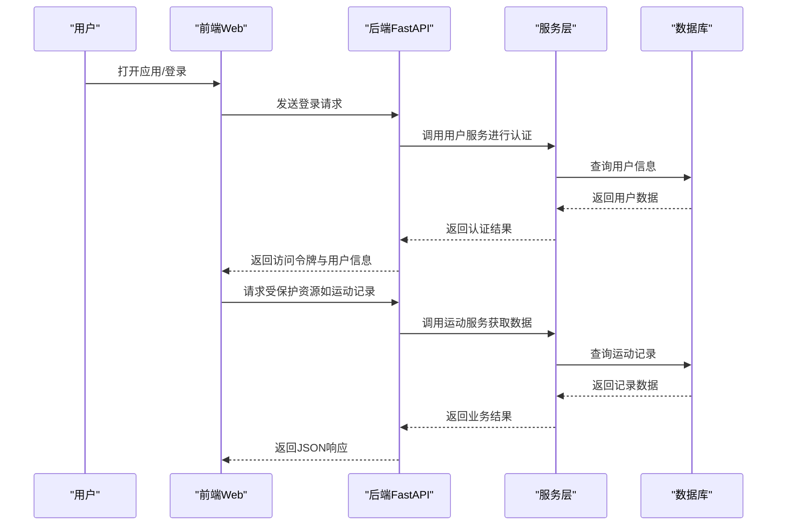
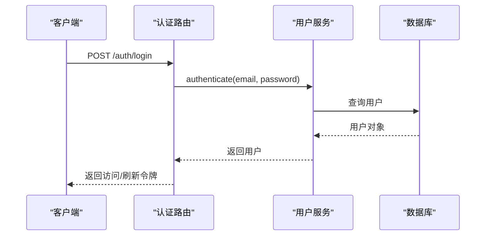
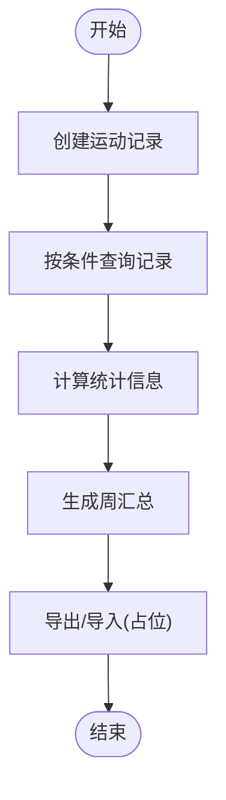
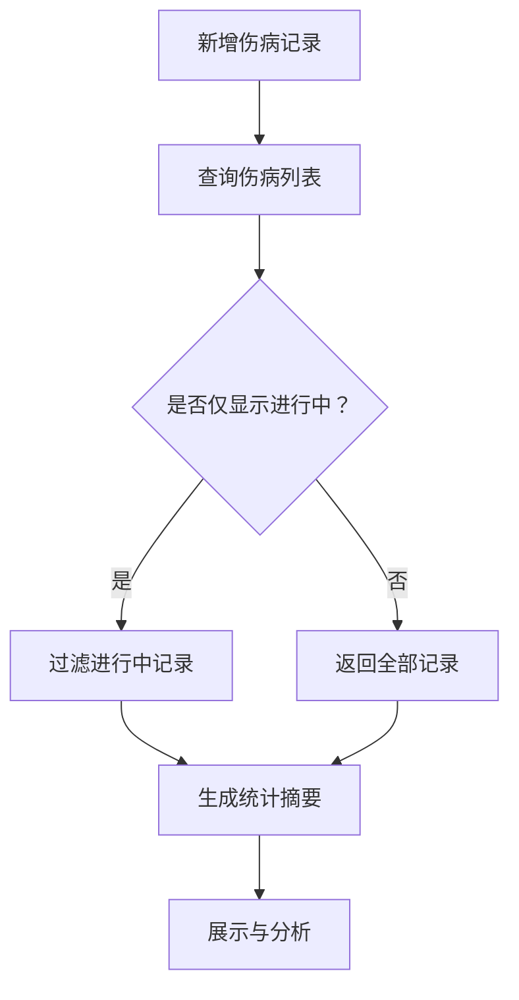
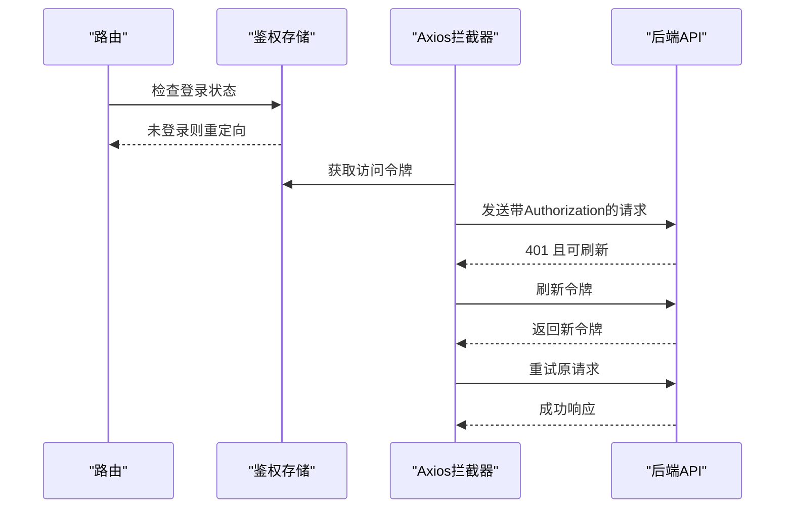
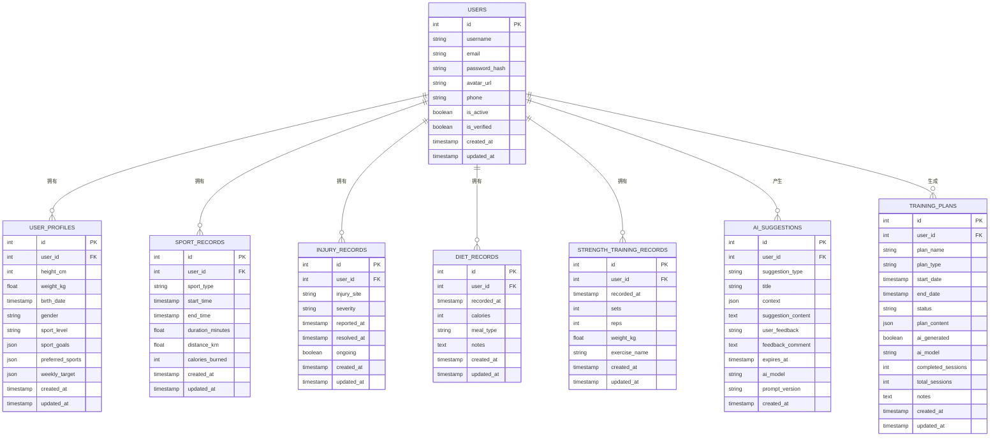
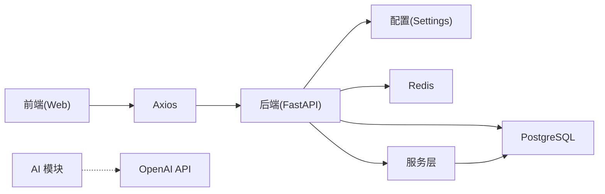

# 项目概述

<cite>
**本文引用的文件**
- [README.md](file://README.md)
- [backend/app/main.py](file://backend/app/main.py)
- [backend/app/config.py](file://backend/app/config.py)
- [backend/app/api/__init__.py](file://backend/app/api/__init__.py)
- [backend/app/api/auth.py](file://backend/app/api/auth.py)
- [backend/app/api/users.py](file://backend/app/api/users.py)
- [backend/app/api/injuries.py](file://backend/app/api/injuries.py)
- [backend/app/api/sports.py](file://backend/app/api/sports.py)
- [backend/app/models/user.py](file://backend/app/models/user.py)
- [backend/app/models/__init__.py](file://backend/app/models/__init__.py)
- [backend/app/models/ai.py](file://backend/app/models/ai.py)
- [backend/app/schemas/__init__.py](file://backend/app/schemas/__init__.py)
- [web/package.json](file://web/package.json)
- [web/src/App.tsx](file://web/src/App.tsx)
- [web/src/services/api.ts](file://web/src/services/api.ts)
- [web/src/pages/DashboardPage.tsx](file://web/src/pages/DashboardPage.tsx)
- [web/src/stores/authStore.ts](file://web/src/stores/authStore.ts)
- [docker-compose.yml](file://docker-compose.yml)
</cite>

## 目录
1. [引言](#引言)
2. [项目结构](#项目结构)
3. [核心组件](#核心组件)
4. [架构总览](#架构总览)
5. [详细组件分析](#详细组件分析)
6. [依赖分析](#依赖分析)
7. [性能考虑](#性能考虑)
8. [故障排除指南](#故障排除指南)
9. [结论](#结论)
10. [附录](#附录)

## 引言
ActiveSynapse 是一个面向个人用户的运动智能教练系统，旨在通过"个性化运动健康管理 + AI 智能训练建议 + 伤病预防管理"的三位一体能力，帮助用户科学地制定训练计划、追踪运动数据、评估健康状态并降低运动风险。系统采用前后端分离架构：后端基于 FastAPI 提供高性能异步 API，前端使用 React + TypeScript 构建现代化 Web 应用，数据库采用 PostgreSQL，辅以 Redis 缓存与可选的 AI 能力集成。

本项目的核心价值主张包括：
- 个性化：基于用户体征、运动偏好与目标生成定制化方案
- 数据驱动：记录与统计运动数据，提供可视化趋势分析
- 风险前置：通过伤病记录与统计，实现伤病预防与康复管理
- 易用性：简洁直观的界面与完善的认证流程，降低使用门槛

## 项目结构
项目采用多模块分层组织：
- 后端（FastAPI）：负责业务逻辑、数据访问、认证授权与 API 路由聚合
- 前端（React + TypeScript）：负责用户交互、页面路由与 API 通信
- 数据与缓存：PostgreSQL 存储业务数据，Redis 提供缓存与会话支持
- 部署：通过 Docker Compose 统一编排数据库、缓存、后端与前端服务

```mermaid
graph TB
subgraph "前端(Web)"
WEB_APP["React 应用<br/>路由与页面"]
API_CLIENT["Axios 客户端<br/>拦截器与鉴权"]
AUTH_STORE["Zustand 状态管理<br/>用户认证状态"]
ENDPOINTS["API 端点封装<br/>认证/用户/运动/伤病"]
DASHBOARD["仪表盘页面<br/>统计与可视化"]
END
subgraph "后端(API)"
FASTAPI_APP["FastAPI 应用<br/>生命周期与异常处理"]
ROUTER_AUTH["认证路由<br/>登录/注册/刷新/登出"]
ROUTER_USERS["用户路由<br/>个人信息/档案/头像"]
ROUTER_INJURIES["伤病路由<br/>记录/查询/统计"]
ROUTER_SPORTS["运动路由<br/>记录/统计/周汇总/导入"]
END
subgraph "基础设施"
DB["PostgreSQL 数据库"]
REDIS["Redis 缓存/会话"]
AI_CONFIG["AI 配置<br/>OpenAI API Key"]
END
WEB_APP --> API_CLIENT
API_CLIENT --> AUTH_STORE
AUTH_STORE --> ENDPOINTS
ENDPOINTS --> FASTAPI_APP
FASTAPI_APP --> ROUTER_AUTH
FASTAPI_APP --> ROUTER_USERS
FASTAPI_APP --> ROUTER_INJURIES
FASTAPI_APP --> ROUTER_SPORTS
ROUTER_AUTH --> DB
ROUTER_USERS --> DB
ROUTER_INJURIES --> DB
ROUTER_SPORTS --> DB
FASTAPI_APP --> REDIS
FASTAPI_APP --> AI_CONFIG
```

**图表来源**
- [backend/app/main.py:21-57](file://backend/app/main.py#L21-L57)
- [backend/app/api/__init__.py:4-9](file://backend/app/api/__init__.py#L4-L9)
- [web/src/services/api.ts:1-66](file://web/src/services/api.ts#L1-L66)
- [web/src/stores/authStore.ts:21-51](file://web/src/stores/authStore.ts#L21-L51)
- [docker-compose.yml:36-76](file://docker-compose.yml#L36-L76)

**章节来源**
- [README.md:1-3](file://README.md#L1-L3)
- [backend/app/main.py:1-77](file://backend/app/main.py#L1-L77)
- [backend/app/config.py:1-46](file://backend/app/config.py#L1-L46)
- [web/package.json:1-37](file://web/package.json#L1-L37)
- [docker-compose.yml:1-81](file://docker-compose.yml#L1-L81)

## 核心组件
- 后端应用与配置
  - 应用入口与生命周期：在应用启动时初始化数据库连接，在关闭时优雅退出
  - 全局异常处理：对自定义异常与通用异常进行统一响应
  - 跨域中间件：允许指定来源访问 API
  - 配置中心：集中管理数据库、Redis、JWT、AI、文件上传与 CORS 等参数
- API 路由聚合
  - 认证、用户、伤病、运动四大模块路由按前缀聚合，便于扩展与维护
- 前端应用与服务
  - 路由保护：未登录用户自动跳转至登录页
  - API 客户端：统一基地址、请求头注入、鉴权令牌刷新与错误处理
  - 状态管理：Zustand 管理用户认证状态，支持持久化存储
- 基础设施编排
  - 使用 Docker Compose 同时启动数据库、缓存、后端与前端服务，支持热重载与健康检查

**章节来源**
- [backend/app/main.py:12-57](file://backend/app/main.py#L12-L57)
- [backend/app/config.py:5-46](file://backend/app/config.py#L5-L46)
- [backend/app/api/__init__.py:1-10](file://backend/app/api/__init__.py#L1-L10)
- [web/src/App.tsx:14-45](file://web/src/App.tsx#L14-L45)
- [web/src/services/api.ts:1-108](file://web/src/services/api.ts#L1-L108)
- [web/src/stores/authStore.ts:1-52](file://web/src/stores/authStore.ts#L1-L52)
- [docker-compose.yml:1-81](file://docker-compose.yml#L1-L81)

## 架构总览
系统采用分层架构与微服务式容器编排：
- 表现层：React 前端通过 Axios 与后端 API 交互，支持路由保护与鉴权
- 控制层：FastAPI 路由按领域划分，统一处理认证、鉴权与异常
- 业务层：服务层封装业务规则与数据访问
- 数据层：SQLAlchemy ORM 映射模型，PostgreSQL 存储；Redis 用于缓存与会话
- 外部集成：可选的 AI 能力（如 OpenAI），用于生成训练建议与计划



**图表来源**
- [backend/app/api/auth.py:25-49](file://backend/app/api/auth.py#L25-L49)
- [backend/app/api/sports.py:37-46](file://backend/app/api/sports.py#L37-L46)
- [web/src/services/api.ts:68-98](file://web/src/services/api.ts#L68-L98)

## 详细组件分析

### 认证与用户管理
- 功能要点
  - 用户注册、登录、令牌刷新与登出
  - 当前用户信息读取与档案更新
  - 头像上传接口占位（待对接存储服务）
- 技术实现
  - JWT 访问/刷新令牌生成与校验
  - 依赖注入获取数据库会话
  - 响应模型严格约束字段与类型
- 实际使用场景
  - 新用户完成注册后获取访问令牌
  - 登录成功后进入仪表盘查看运动与伤病统计
  - 更新个人档案（身高、体重、运动偏好等）



**图表来源**
- [backend/app/api/auth.py:25-49](file://backend/app/api/auth.py#L25-L49)
- [backend/app/services/user_service.py](file://backend/app/services/user_service.py)

**章节来源**
- [backend/app/api/auth.py:1-92](file://backend/app/api/auth.py#L1-L92)
- [backend/app/api/users.py:1-88](file://backend/app/api/users.py#L1-L88)

### 运动记录与统计
- 功能要点
  - 创建、查询、更新、删除运动记录
  - 支持按运动类型与时间范围过滤
  - 获取统计信息与周汇总
  - GPX 导入占位（待实现）
- 技术实现
  - 分页参数校验与默认值控制
  - 服务层封装查询与聚合逻辑
  - 响应模型统一输出格式
- 实际使用场景
  - 用户每日记录跑步或羽毛球运动
  - 查看近 30 天的运动趋势与周汇总
  - 导入第三方设备 GPX 文件进行数据分析



**图表来源**
- [backend/app/api/sports.py:14-113](file://backend/app/api/sports.py#L14-L113)

**章节来源**
- [backend/app/api/sports.py:1-127](file://backend/app/api/sports.py#L1-L127)

### 伤病记录与预防
- 功能要点
  - 新增、查询、更新、删除伤病记录
  - 支持仅显示进行中记录
  - 生成伤病统计摘要
- 技术实现
  - 服务层隔离业务规则与数据访问
  - 统一的响应模型与错误处理
- 实际使用场景
  - 用户记录某次受伤部位、程度与治疗进展
  - 查看历史伤病统计，辅助后续训练强度调整
  - 结合运动记录与伤病数据，形成综合健康画像



**图表来源**
- [backend/app/api/injuries.py:13-91](file://backend/app/api/injuries.py#L13-L91)

**章节来源**
- [backend/app/api/injuries.py:1-92](file://backend/app/api/injuries.py#L1-L92)

### 前端路由与鉴权
- 路由保护：未登录用户无法访问受保护页面，自动跳转到登录页
- 鉴权流程：请求拦截器自动附加 Bearer 令牌；401 时尝试刷新令牌
- 页面覆盖：登录、注册、仪表盘、运动记录、伤病记录、个人资料等
- 状态管理：Zustand 管理用户认证状态，支持本地持久化



**图表来源**
- [web/src/App.tsx:14-45](file://web/src/App.tsx#L14-L45)
- [web/src/services/api.ts:13-64](file://web/src/services/api.ts#L13-L64)

**章节来源**
- [web/src/App.tsx:1-48](file://web/src/App.tsx#L1-L48)
- [web/src/services/api.ts:1-108](file://web/src/services/api.ts#L1-L108)
- [web/src/stores/authStore.ts:1-52](file://web/src/stores/authStore.ts#L1-L52)

### 数据模型与关系
系统围绕用户展开，用户拥有档案、运动记录、伤病记录、饮食与力量训练记录，并可产生 AI 建议与训练计划。模型间通过外键关联，支持级联删除与一对多/一对一关系。



**图表来源**
- [backend/app/models/user.py:7-61](file://backend/app/models/user.py#L7-L61)
- [backend/app/models/__init__.py:1-19](file://backend/app/models/__init__.py#L1-L19)
- [backend/app/models/ai.py:30-122](file://backend/app/models/ai.py#L30-L122)

**章节来源**
- [backend/app/models/user.py:1-62](file://backend/app/models/user.py#L1-L62)
- [backend/app/models/__init__.py:1-20](file://backend/app/models/__init__.py#L1-L20)
- [backend/app/models/ai.py:1-123](file://backend/app/models/ai.py#L1-L123)

### AI 智能系统初始化
- 功能要点
  - AI 建议生成：基于用户数据生成个性化训练建议
  - 训练计划制定：创建结构化的训练计划
  - 建议类型分类：训练、营养、恢复、伤病预防等
  - 计划类型管理：跑步、力量、羽毛球等专项计划
- 技术实现
  - 配置管理：支持 OpenAI API Key 与模型选择
  - 数据结构：JSON 格式存储计划内容与上下文
  - 生命周期管理：支持计划状态跟踪与进度监控
- 实际使用场景
  - 系统根据用户运动数据与伤病历史生成个性化建议
  - 自动生成阶段性训练计划并跟踪执行进度
  - 支持用户对建议进行反馈，优化后续推荐质量

**章节来源**
- [backend/app/config.py:24-26](file://backend/app/config.py#L24-L26)
- [backend/app/models/ai.py:1-123](file://backend/app/models/ai.py#L1-L123)

## 依赖分析
- 技术栈概览
  - 后端：FastAPI（异步、高性能）、SQLAlchemy（ORM）、Alembic（迁移）、Pydantic（数据验证）
  - 前端：React + TypeScript、React Router、Ant Design、Axios、Zustand（状态管理）
  - 数据与缓存：PostgreSQL（异步/同步）、Redis
  - 工具链：Docker、Docker Compose、Vite、ESLint、TypeScript
- 组件耦合
  - 路由层与服务层解耦，便于单元测试与扩展
  - 前端通过 Axios 与后端解耦，统一拦截器处理鉴权与刷新
  - 配置集中管理，避免硬编码，提升可移植性



**图表来源**
- [web/package.json:12-35](file://web/package.json#L12-L35)
- [backend/app/config.py:5-46](file://backend/app/config.py#L5-L46)
- [docker-compose.yml:36-76](file://docker-compose.yml#L36-L76)

**章节来源**
- [web/package.json:1-37](file://web/package.json#L1-L37)
- [backend/app/config.py:1-46](file://backend/app/config.py#L1-L46)
- [docker-compose.yml:1-81](file://docker-compose.yml#L1-L81)

## 性能考虑
- 异步优先：后端使用异步数据库连接与路由，减少阻塞，提升并发吞吐
- 分页与限制：API 对查询参数进行校验与上限控制，防止滥用
- 缓存策略：利用 Redis 缓存热点数据与会话，降低数据库压力
- 前端优化：按需加载、状态管理与拦截器复用，减少重复请求
- 数据库索引：对常用查询字段建立索引（如用户表的唯一索引与时间字段），提升查询效率

## 故障排除指南
- 启动失败
  - 检查数据库与缓存服务是否健康（Compose 健康检查）
  - 确认环境变量与端口映射正确
- 认证问题
  - 确认访问令牌存在且未过期；401 时检查刷新流程
  - 核对 JWT 算法与密钥配置
- 数据访问异常
  - 检查数据库连接字符串与权限
  - 关注 Alembic 迁移状态与版本一致性
- 前端路由与鉴权
  - 确保 Axios 拦截器正确注入 Authorization 头
  - 受保护路由未登录自动跳转至登录页属预期行为

**章节来源**
- [backend/app/main.py:38-53](file://backend/app/main.py#L38-L53)
- [web/src/services/api.ts:13-64](file://web/src/services/api.ts#L13-L64)
- [docker-compose.yml:16-34](file://docker-compose.yml#L16-L34)

## 结论
ActiveSynapse 通过清晰的分层架构与模块化设计，实现了从用户认证、运动与伤病数据管理到统计分析与 AI 建议的完整闭环。系统具备良好的扩展性与可维护性，既适合初学者快速上手，也为有经验的开发者提供了稳定的开发基础。Phase 1 的完整初始化包括后端 FastAPI、前端 React、数据库、缓存与 AI 智能系统的完整架构，为后续的功能扩展奠定了坚实基础。

## 附录
- 快速开始
  - 使用 Docker Compose 启动：数据库、缓存、后端与前端
  - 前端访问地址：http://localhost:5173
  - 后端 API 文档：http://localhost:8000/docs
- 开发建议
  - 保持路由与服务层职责单一，遵循领域驱动设计
  - 在生产环境替换默认密钥与禁用调试模式
  - 逐步引入缓存与限流策略，保障高并发稳定性